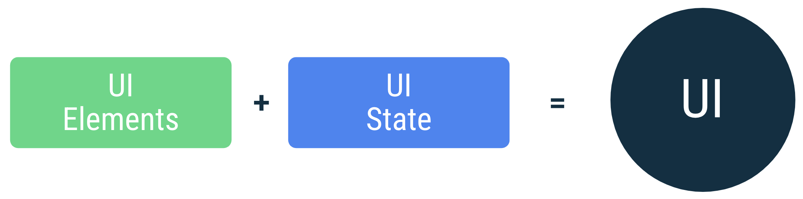

# Android

## 基础知识

Android SDK 工具会将您的代码连同任何数据和资源文件编译成一个 APK（*Android 软件包*），即带有 `.apk` 后缀的归档文件。

每个 Android 应用都处于各自的安全沙盒中，并受以下 Android 安全功能的保护：

- Android 操作系统是一种多用户 Linux 系统，其中的每个应用都是一个不同的用户；
- 默认情况下，系统会为每个应用分配一个唯一的 Linux 用户 ID（该 ID 仅由系统使用，应用并不知晓）。系统会为应用中的所有文件设置权限，使得只有分配给该应用的用户 ID 才能访问这些文件；
- 每个进程都拥有自己的虚拟机 (VM)，因此应用代码独立于其他应用而运行。
- 默认情况下，每个应用都在其自己的 Linux 进程内运行。Android 系统会在需要执行任何应用组件时启动该进程，然后当不再需要该进程或系统必须为其他应用恢复内存时，其便会关闭该进程。

实现了 *最小权限原则* 原则

### 应用组件

每个组件都有一个入口。

共有四种不同的应用组件类型：

- Activity
- 服务
- 广播接收器
- 内容提供程序

#### `Activity`

用户交互入口点，拥有界面的单个屏幕

#### 服务

后台运行组件

## 应用入口点

### `activity`

#### 任务与返回堆栈

系统打开一个新的activity时，改activity会被添加到堆栈中，如果用户按返回键，这个新的avtivity就会从堆栈中退出；堆栈中的 Activity 永远不会重新排列，只会被送入和退出，在当前 Activity 启动时被送入堆栈，在用户使用**返回**按钮离开时从堆栈中退出。

## 应用框架

### 应用框架指南

#### 原则

##### 分离关注点

移动设备的资源也很有限，随时会终止进程，因此，我们不能将所有的东西存到Activity或Fragment中，这些基于界面的类应仅包含处理界面和操作系统交互的逻辑，应使这些类尽可能保持精简

##### 通过数据模型驱动界面

数据模型代表应用的数据。它们独立于应用中的界面元素和其他组件。这意味着它们与界面和应用组件的生命周期没有关联，但仍会在操作系统决定从内存中移除应用的进程时被销毁。

- 如果 Android 操作系统销毁应用以释放资源，用户不会丢失数据。
- 网络连接不稳定或不可用时，应用会继续工作。

##### 单一数据流和单一数据源

定义一个新数据的时候，往往会为其分配单一数据源(SSOT)，便于控制和管理数据

在 UDF 中，**状态**仅朝一个方向流动。修改数据的**事件**朝相反方向流动。

#### 推荐架构

每个应用应至少有两个层：

- 界面层 - 在屏幕上显示应用数据。
- 数据层 - 包含应用的业务逻辑并公开应用数据。
- 网域层(optional) - 化和重复使用界面层与数据层之间的交互。

### 界面层

界面层必须执行以下步骤：

1. 使用应用数据，并将其转换为界面可以轻松呈现的数据。
2. 使用界面可呈现的数据，并将其转换为用于向用户呈现的界面元素。
3. 使用来自这些组合在一起的界面元素的用户输入事件，并根据需要反映它们对界面数据的影响。
4. 根据需要重复第 1-3 步。

#### 定义界面状态

界面是相对用户而言的，那么界面状态就是相对应用而言的

界面中不应该修改UI状态，除非界面是数据的来源

界面状态类是根据其描述的屏幕或部分屏幕的功能命名的。具体命名惯例如下：

功能 + UiState。

### 应用导航

#### Navigation 组件

