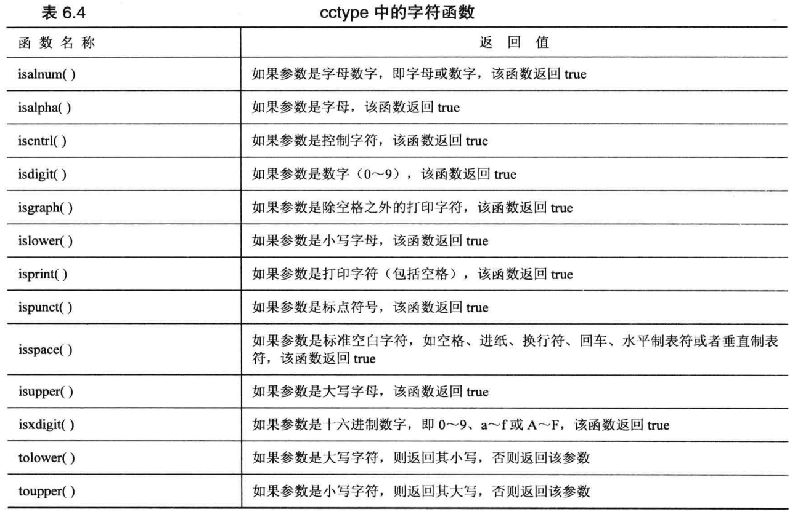

# c++笔记

### 一、开始学习C++

#### 预备知识

```c++
#include <iostream>  //不使用<iostream.h>是为了和c的标准区分开
using nameapcae std; 
```

名称空间，在不同的产品中有相同的wander()函数，那如果要正确使用

```c++
Microflop::wander("go dancing");
Piscine::wander("a fish named Desire");
```

使用`using nameapcae std;`之后可以忽略using


#### `cout`输出

`endl`和`\n`是等价的


##### `cout.setf`

类似于控制符，有两者函数原型：

```c++
fmtflags setf(fmtflage) //第一原型
fmtflags setf(fmtflags, fmtflags)  //第二原型
//fmtflags 是 bitmask 类型(一种用来存储各个位值的类型)的 typedef 名
//显而易见，两个原型的主要区别在于参数数量不同
```


##### `cout.precision(n)`

控制小数位数


### 二、处理数据

`dec、hex、oct//十进制，十六进制，八进制`

`unsigned`是无符号类型

`const type name =value`用来限定，例如：

`const int month = 12`这样可以用month来代替12，注意定义的时候初始化


### 三、复合类型

#### 结构体

如果初始化比成员少，余下的成员会被设置为0


#### 字符串

##### 每次一行输入：

###### `getline()`

`cin.getline()`输入，舍弃\n

###### `get()`

不舍弃\n，所以可以用 `cin.get(name,num).get()`来舍弃换行符


#### string类

可变长度的字符串，可以加减，等于

**计算长度**：str1.size()

输入：`getline(cin,str)`

为了避免在字符串输出中出现太多

```c++
R"("the king" is me)";
R"+*("(sdafaf?)",sadafas.)+*";
```


#### 使用new来分配内存

c++中依然可以使用c中的 `malloc()`函数来分配内存，但是c++有更好的方法就是***new***函数

```c++
int * pt =new int 
//typename * pointer_name = new typename;
```

**`delete`**:

与free对应，`delete pointer_name`

1. 配对的使用 `new`和 `delete`，不然可能造成内存泄漏
2. 不要使用 `delete`来删除不是 `new`定义的内存
3. 不要两次 `delete`同一个函数
4. 对空指针 `delete`是安全的
5. 如果定义的是动态内存数组

   ```c++
   short * ps=new short [100];
   delete [] ps;
   ```

一种节约内存的方法：

```c++
char *getname()
{
	char temp[80];
	cout<<"Enter a string:";
	cin>> temp;
	char *pn = new char[strlen(temp)+1];
	strcpy(pn,temp);
	return pn;
}
```


#### 数组的代替

##### vector

```c++
#include <vector> //包含头文件
vector<int> vi;
```

##### array

```c++
#include <array>
array<int 5>ai;
```

**ps:**

1. array对象可以直接复制
2. 用数组a1[-2]时等于*(a1-2)会跑到奇怪的地方去

#### `ofstream与ifstream`类

##### 1.打开文件

函数原型：

```c++
void open(const char * filename, int mode,int access)
//filename 文件名
//mode 打开文件方式
//access打开文件属性
```

打开文件的方式在类ios(是所有流式I/O类的基类)中定义，常用的值如下：

```
ios::app：　　		以追加的方式打开文件 
ios::ate：　　	　  文件打开后定位到文件尾，ios:app就包含有此属性 
ios::binary：　  	以二进制方式打开文件，缺省的方式是文本方式。两种方式的区别见前文 
ios::in：　　　    文件以输入方式打开（文件数据输入到内存） 
ios::out：　　	   文件以输出方式打开（内存数据输出到文件） 
ios::nocreate： 	不建立文件，所以文件不存在时打开失败 
ios::noreplace:   不覆盖文件，所以打开文件时如果文件存在失败 
ios::trunc：　　	如果文件存在，把文件长度设为0 
```

可以用“或”把以上属性连接起来，如 `ios::out|ios::binary `
**打开文件的属性取值是：**
0：普通文件，打开访问
1：只读文件
2：隐含文件
4：系统文件

`fstream`还有和open()一样的构造函数，在定义的时侯就可以打开文件了：
`fstream file1("c:\\config.sys"); `

`fstream`有两个子类：`ifstream(input file stream)和ofstream(outpu file stream)`，`ifstream`默认以输入方式打开文件，而 `ofstream`默认以输出方式打开文件

##### 2.关闭文件

`file1.close();`


### 四、循环结构

`cout.self(ios_base::boolalpha);`此语句可以将真假输出为false和ture

前缀递增和解除引用的优先级一样，所以

```c++
double array[5]={1.2,123,1.23,43.1,1.3};
double *a1=arr;
//*a1   == 1.2;
//*++a1 == 123;
//++*a1 == 2.2;
```

#### 基于范围的for循环

```c++
double array[5]={1.2,123,1.23,43.1,1.3};
for(double &x :array)
	x = x*0.08;//让array中每一个数都×0.08；
```

`cin`在读取字符串的时候会忽略换行符和空格

`cin.get()`可以输入每一个字符

```c++
cin.get(array,20).get();
```

和

```c++
char ch;
cin.get(ch);
```

很奇怪，`cin.get`可以接受两种参数形式的变量，在c语言中不被允许，这是函数重载的OOP特性

#### 键盘模拟EOF

`cin.eof()`和 `cin.fail()`两个函数，如何检测到EOF，返回的bool值为ture，否则为false

`cin.get(char)`的返回值是一个 `cin`对象。然而，`istream`类提供一个可以将 `istream对象`转换为bool值的函数

```c++
while(cin)   //更好的写法
```


### 五、条件结构

**可以用`3==number`这种方法来避免赋值错误**

#### 字符库函数cctype



#### 简单的文件输入输出

##### 输入：

准备：

1. 包含头文件 `fstream`
2. 声明一个或多个 `ofstream`对象，并且命名
3. 使用 `using`或 `std::`
4. 关联使用 `open`和 `close`

```c++
ofstream outfile; //声明变量
outfile.open("fish.txt");  //关联文件

double wt=5.12;
outfile << wt;     //可以使用和cin相同的任何函数
outfile.close      //已经关联所以可以直接关闭
```

**ps：**打开以存在的文件时，会使文件内容丢失

##### 输出：

与上面相同，主要是声明 `ifstream`对象

`is_open`检测是否打开文件


### 六、函数

#### 函数与结构

结构比较小的时候可以直接按值传递


#### 传递结构的地址

需要修改三个地方：

- 调用函数时，将结构的地址传递
- 将形参声明为指向polar的指针，即polar *类型，由于函数不修改结构，因此使用了`const`修饰符
- 由于形参是指针不是结构，因此应使用间接成员运算符

#### 函数指针

##### 1.获取函数地址

只要使用函数名，如果think()是一个函数，think就是该函数的地址


### 七、函数谈幽

#### 1.内联函数

函数前加上 `inline`，将整个定义（函数头和函数代码）放在本应该提供原型的地方，内联函数不能递归，算是一种用空间换时间的方法，当函数简短切调用很多次的时候有时间优势

**内联与宏**

宏不是通过参数传递实现的，而是通过文本替换实现的


#### 2.引用变量

创建引用变量：

```c++
int rats;
int & rodents = rats;
```

与原变量值相同，地址相同

与指针不同的是，指针可以先定义再初始化，引用变量定义时必须初始化

**引用变量**可以代替C语言中指针的作用，完成函数中对值的改变

不能用表达式作为变量

返回引用变量的时候不能返回临时

C++11新增了右值引用，使用&&声明

函数可以返回引用，但是要避免返回临时引用，包括指针也是如此


### 八、内存与函数空间

static修饰函数中的变量时，只在初始化程序是定义，再次引用函数时不会重置

#### 动态分配

1.使用new初始化

`int *pi= new int(6)`

#### 名称空间

```c++
namespace Jack{
	double t1；
	int hell;
}
```

using 函数可以时该函数在作用块里默认使用

ex:`using Jack::t1`


### 九、对象和类

```c++
class stock{
private:
	int num;
	std::string company;
public:
	void show();
	stock();//构造函数
	stock(std::string &co,int num,long n)//构造函数
}

//使用构造函数：
stock first;
stock first = stock();
stock *first = new stock;

stock second();//注意这是构造一个函数，而不是使用默认的构造方式

//const成员函数
//对于不修改对象的函数应该按如下方式声明和定义
void show() const;
void stock::show() const;


```

#### 运算符的重载

`operator +()`//通过这样的方式可以对运算符进行重载

#### 友元函数

##### 创建友元函数

`friend Time operator* (double m,const Time *t);`

- operator*不是成员变量，不能使用成员运算符
- operator*与成员函数访问权限相同

##### 常用友元：重载<<

```c++
void opeartor<<(ostream & os, const Time &t){
	os << t.hours<<"hours" << t.mins << "minutes";
}
//这样可以使用如下语句
cont << trip;

//更好的方式
std::ostream & opeartor<<(std::ostream & os, const Vector &v)
{
    os << v.ang * Red_to_deg ;
    return os;
}//这样可以连续使用cout
```

#### 转换函数

##### 从类转换到其他

`operator double()`

- 转换函数必须是类方法
- 不能返回指定的类型
- 不能有参数

如果在构造函数前加上了explicit，那么该构造函数只能够显示转换

##### 从其他转换到类

```c++
//类似与构造函数的方式
north = "polaries";					//not allowed
north = star("polaries"); 			//allowed
```

#### 复制构造函数（拷贝构造函数）

```c++
//定义一个显示复制构造函数以解决问题
StringBad::StringBad(const StringBad & st)
{
    num_strings++;
    len = st.len;
    str = new char[len+1];
    std::strcpy(str, st.str);
    cout << num_strings
}
```


### 十、类和动态内存分配

无论创建多少个对象，程序都只共享一个静态类变量副本

不能在类声明里面创建

如果类中包含了new初始化的指针，应当定义一个复制构造函数，以复制指向的数据，而不是指针，这被称为深拷贝

同样的，对于含有指针的类，也要重写=，避免指针的重复

```c++
StringBad & StringBad::operator=(const StringBad & st){
	if(this = st)
		return *this;
	delete [] str;
    len = st.len;
    str = new char [len+1];
    std::strcpy(str, st.str);
    return *this;
}
```

**`nullptr`**可以表示空指针，在c++中常用

初始化的时候不一定会使用赋值运算符，而是使用复制构造函数

#### 在构造函数中使用new的注意事项

- 在构造函数中使用new，必须在析构函数中使用delete
- new对应delete，new []对应delete []
- 如果有多个构造函数，应该统一使用，因为析构函数只有一个


### 十一、继承

```c++
class RatedPlayer : public TableTennisPlayer
```

- 派生类需要自己的构造函数
- 可以添加数据以及成员函数


```c++
//RatedPlayer的构造代码
RatedPlayer::RatePlayer(unsign int i, const string & fn, 
     const string & ln, bool ht ) : TableTennisPlayer (fn, ln, ht)
{
    rating = i;
}
```

常量只能够初始化而无法赋值，构造函数为了解决这个问题可使用下面的方法

```c++
Queue::Queue(int qs) : qsize(qs){
	front = rear = NULL;
	items = 0;
}
//更离谱的方法
Queue::Queue(int qs) : qsize(qs)，front(NULL), rear(NULL), item(0)
{
}
```

对于 `const`类成员以及被声明为引用的类成员

##### 虚函数

虚函数的目的是为了使用指针指向基类的指针可以调用子类的函数

使用 `virtual`关键字

- 构造函数不能是虚函数
- 析构函数要是虚函数
  - 友元函数不能是虚函数


一些经验：

- 如果重新定义继承的方法，要保证参数完全一致
- 如果基类声明被重载了，则需要重新定义所有的基类版本

```c++
virtual int vir_fun()=0;
```


##### 访问控制：protect

派生类可以访问protect修饰的变量，外部不能直接访问

##### 抽象基类

ex：为圆和椭圆创造一个共同的类

###### 纯虚函数：在函数声明结尾处添加=0

当类声明中存在纯虚函数时，则无法创建该类的对象

所有为了创建抽象类，则需要至少使一个函数变为纯虚函数


### 十二、代码重用

#### valarray类简介

`valarray<int>  q_value`

### 头文件

##### stdlib.h

stdlib.h头文件中 定义了两个变量：

\#define EXIT_SUCCESS 0
\#define EXIT_FAILURE 1

```c++
#ifndef COORDIN
#define COORDIN //s
...
#endif //避免重复包含头文件
```


## C++ STL

### 容器

#### vector

##### 使用vector

```c++
#include <vector>
```

##### 创建vector

```c++
vector<int> arr1;								//一个空数组
vector<int> arr2 {1, 2, 3, 4, 5};				//包含1、2、3、4、5五个变量
// 不要先创建空间然后 push_back 会导致vector大小多很多
vector<int> arr3(4);							//开辟4个空间，值默认为0
vector<int> arr4(5, 3);							//5个值为3的数组
vector<int> arr5(arr4);							//将arr4的所有值复制进去，和arr4一样
vector<int> arr6(arr4.begin(), arr4.end());		//将arr4的值从头开始到尾复制
vector<int> arr7(arr4.rbegin(), arr4.rend());	//将arr4的值从尾到头复制
```

##### 遍历访问

```c++
//迭代器：vector<int>::iterator
for (vector<int>::iterator it = arr.begin(); it != arr.end(); it++)
{
    cout << *it << endl;
}
//迭代器：vector<int>::reverse_iterator
for (vector<int>::reverse_iterator it = arr.rbegin(); it != arr.rend(); it++)
{
    cout << *it << endl;
}
// 下标访问
for (int i = 0; i < arr.size(); i++)
{
	cout << arr[i] << endl;
}
// for循环
for (auto num : arr)
{
	cout << num << endl;
}
```

##### 容量和大小

```c++
vec.size();					// 返回当前存储了多少数字
vec.capacity();				// 返回容量
vec.max_size();				// 返回最大可设置的大小
vec.empty();				// 判断是否为空
vec.resize();				// 改变size的大小
vec.reserve();				// 改变capacity的大小
vec.shrink_to_fit();		// 收缩到合适
```

##### 常用操作

```c++
// 尾部插入
push_back();
emplace_back();
pop_back 
```


## C++11

### 时间工具chrono库

chrono定义了三种主要类型以及常用工具：

- 时钟
- 时长
- 时间点


***时钟* *(Clock)***要求：


***平凡时钟* *(TrivialClock)***要求：

- 满足*时钟*要求


#### 时钟

时钟由起点（或纪元）及计次频率(1分钟，1秒或者1毫秒)组成。

##### `system_clock`

std::chrono::system_clock 表示系统范围的实时壁钟。其不一定单调，系统时间可以被调节，它是**唯一有能力映射到c风格时间**(ctime.h)的C++时钟，满足**平凡时钟要求**

***纪元***：从协调世界时 (UTC) 1970 年 1 月 1 日星期四 00:00:00 开始的时间，不计闰秒

成员函数：

> `std::chrono::system_clock::now()`
>
> 返回值：当前时间的时间点
>
> `std::chrono::system_clock::to_time_t( const time_point& t )`
>
> 参数：要转换的时间点
>
> 返回值：返回t的`std::time_t`值，注意`time_t`的精度很低，只有秒


##### `std::chrono::steady_clock`

表示单调时钟。此时钟的时间点无法减少，因为物理时间向前移动。此时钟与壁钟时间无关，且最适于度量间隔。


#### 时间点

##### `std::chrono::time_point`

`std::chrono::time_point` 表示时间中的一个点。它被实现成如同存储一个 `Duration` 类型的自 `Clock` 的纪元起始开始的时间间隔的值。


时间点与时间点相减返回时长

时间点与时长加减返回时间点


#### 时长

时长由**时间跨度**组成，定义为某时间单位的某个计次数。例如，“42 秒”可表示为由 42 个 1 秒时间点位的计次所组成的时长。

##### `std::chrono::duration`

```c++
template<
    class Rep,
    class Period = std::ratio<1>
> class duration;
```

**成员类型：**

- rep：计次数的数据类型
- period：计次周期的 [std::ratio](https://zh.cppreference.com/w/cpp/numeric/ratio/ratio)（即每次的秒数）(默认是1秒)


###### 成员函数

构造函数：

1. 构造函数的 `const Rep2&`能隐式转换为rep（时常的计次类型）且满足下列条件才参与重载决议

   `std::chrono::treat_as_floating_point<rep>::value` 为 true ，或
   `std::chrono::treat_as_floating_point<Rep2>::value` 为 false 。


`count()`

计数函数，返回此 duration 的计次数。


