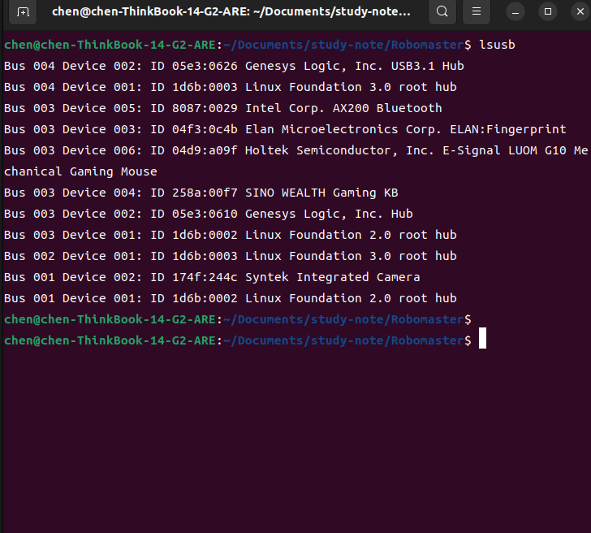

# 串口绑定

步骤1：

`lsusb`查看对应硬件的ID



ID后面的两个四位分别是idVendor和idProduct


步骤2：

建立udev规则

```shell
cd /etc/udev/rules.d/

```


创建`*.rules`文件填入，*可为任意名称


步骤3：

填入字段：

```shell
KERNEL=="ttyUSB*",ATTRS{idVendor}=="0483", ATTRS{idProduct}=="5740", MODE:="0777", SYMLINK="ttyUART"
```


注意：重新拔插串口可以使修改生效，或者运行`sudo udevadm trigger`使得修改生效

