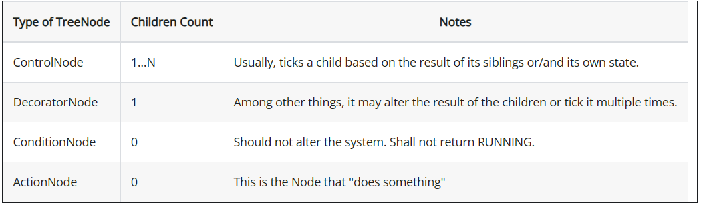
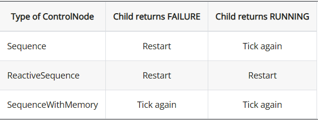
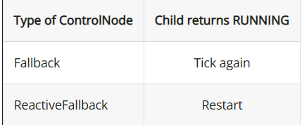

# 行为树

- 主要使用的是GitHub上的一个开源库`BehaviorTree.cpp`

[开源链接](https://github.com/BehaviorTree/BehaviorTree.CPP)

[教程](https://www.behaviortree.dev/)

[Robomaster哨兵应用开源](https://github.com/Ruinwalker7/rm_decision)

## 基本概念

行为树是一种树结构的层次节点，通过“tick”信号在树中传递

一个“tick”信号从树的根节点传递到叶子节点，每一个节点都必须返回以下的三个值之一：

- SUCCESS
- FAILURE
- RUNNING 

`RUNNING`表示这个节点需要更多时间来完成任务

叶子节点通常是实际操作的节点

树中的节点有以下类型：

- 在`ActionNode`中有可能会返回`Running`结果，我们需要再次"tick"这个节点，直到返回`SUCCESS`或`FAILURE`

## 节点详解

### `ControlNode`

控制节点的子节点总是按顺序排列的

#### `Sequence`

如果节点返回的是`SUCCESS`，则"tick"下一个节点，`Sequence`有两个变种节点

### `DecoratorNode`

装饰节点，通常只有一个孩子

#### `InverterNode`

反转结果，SUCCESS返回FAILURE，FAILURE返回SUCCESS

#### `ForceSuccessNode`

子节点返回`RUNNING`则返回`RUNNING`，否则返回`SUCCESS`

#### `ForceFailureNode`

与上面相同

#### `RepeatNode`

重复N次，直到返回失败，N是可以输入的

#### `RetryNode`

重复N次，直到返回成功，N是可以输入的

### `ConditionNode`

#### `Fallbacks`

可以理解为后备，如果当前节点失败了，则"tick"下一个节点

如果某个子节点返回`SUCCESS`，则该节点返回`SUCCESS`，且中断后面的所有节点(通过这种方式可以打断异步行为)

有两个变种，主要区别在于子节点返回`RUNNING`时"tick"的节点不同

### `ActionNode`

没有子节点，由用户自己自定