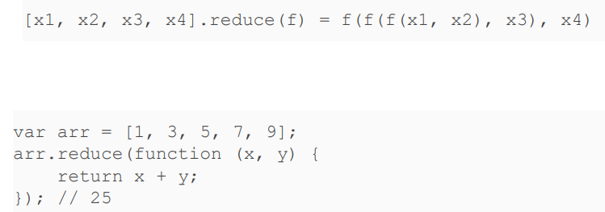
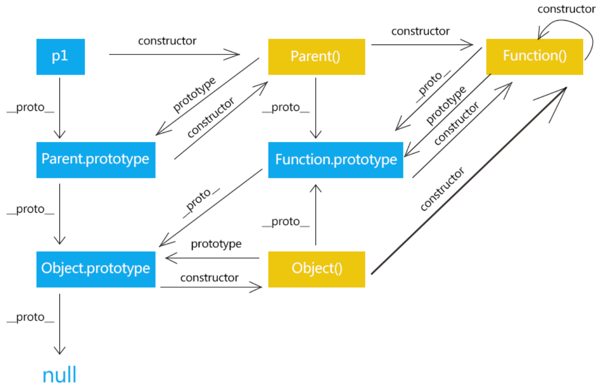

# JavaScript

## 基础

浏览器分为两个引擎：渲染引擎和JS引擎：

⚫ 渲染引擎：解析HTML和CSS，例如Chrome的Webkit和blink

⚫ JS引擎：JS解释器，用于读取和执行网页中Javascript代码，例如Chrome的V8


### 变量

◼ JS当中，函数分为声明式函数和赋值式函数，声明式函数与赋值式函数的区别在于：
在JS的预编译期，声明式函数将会先被提取出来，然后才按顺序执行js代码

◼ JS的解析过程分为两个阶段**编译期与执行期**


◼ DOM—文档对象模型

- 文档对象模型（Document Object Model，简称DOM），是W3C组织推荐的处理可扩展标记语言的标准编程接口。通过 DOM 提供的接口可以对页面上的各种元素进行操作。

◼ BOM—浏览器对象模型

- BOM (Browser Object Model，简称BOM) 是指浏览器对象模型，它提供了独立于内容的、可以与浏览器窗口进行互动的对象结构。通过BOM可以操作浏览器窗口，比如弹出框、控制浏览器跳转、获取分辨率等。


`strict`模式

- 不强制要求用var申明变量，一个变量没有申明就被使用，自动申明为全局变量

- strict模式下运行JS代码，强制通过var申明变量

  `'use strict';`


### 使用

- 使用 `window.alert()` 写入警告框
- 使用 `document.write()` 写入 HTML 输出
- 使用 `innerHTML` 写入 HTML 元素
- 使用 `console.log()` 写入浏览器控制台
- 使用`prompt()`输入


模板字符串：`${name}`


### 变量类型

- Number：不区分整数和浮点数
- 字符串：以单引号'或双引号"括起来的任意文本
- 布尔值：true、false
- 数组：用[]表示，元素之间用,分隔
- 对象：一组由键-值组成的无序集合
- NaN：NaN表示Not a Number，当无法计算结果时用NaN表示
- Infinity：Infinity表示无限大，当数值超过了JavaScript的Number所能
  - 表示的最大值时，就表示为Infinity
- null：一个“空”的值，表示“没有对象”，可用于函数的参数
- Undefined：表示“未定义”，一般用于已定义但没有赋值


强制转换

```javascript
Number("string")
parseFloat("100px") //常用于过滤单位
parseInt() //保留整数
```


### 使用 innerHTML

如需访问 HTML 元素，JavaScript 可使用 `document.getElementById(id)` 方法。


### 对象

在JavaScript中，对象是一组无序的相关属性和方法的集合，所有的事物都是对象，例如字符 串、数值、数组、函数等。

对象是由**属性**和**方法**组成的：

- 属性：反映事物的特征
- 方法：反映事物的行为


## 函数

使用var申明的变量是有作用域的


变量提升：变量和函数的声明会在物理层面移动到代码的最前

JavaScript引擎自动提升了变量y的声明，但不会提升变量y的赋值


- 局部作用域
  - 变量作用域实际上是函数内部，我们在for循环等语句块中是无法定义具有局部作用域的变量
  - 关键字let


高阶函数：

- 一个函数就可以接收另一个函数作为参数，这种函数就称之为高阶函数

- reduce：对数组中的每个元素按序执行一个由您提供的 reducer 函数，每一次运行 reducer 会
  将先前元素的计算结果作为参数传入

  

- sort：数组的元素进行排序，并返回数组。默认排序顺序是在将元素转换为字符串

- 闭包定义：

  是一个函数以及其捆绑的周边环境状态（lexical environment，词法环境）的引用的组合

## 面向对象编程

不区分类和实例的概念，通过原型（prototype）来实现面向对象编程

- __proto__(或[[Prototype]]):指向该对象的构造函数的原型对象
  (已弃用: 不再推荐使用该特性)，推荐使用Object.getPrototypeOf()
- prototype：指向该方法的原型对象, 只有函数才有prototype属性
- constructor:返回对象的构造函数



所谓继承关系不过是把一个对象的原型指向另一个对象而已


## DOM和浏览器对象

### DOM元素查找

- 根据ID查找：`document.getElementById(id)`
  - Id名称大小写敏感
  - 返回值：拥有指定 ID 的第一个元素

- 根据**标签名**查找元素： `document.getElementsByTagName(name)`
  - name可以不区分大小写
- 根据name属性查找元素： `document.getElementsByName(name)`
- 根据**类名**查找元素： `document. getElementsByClassName(className)`
- 根据**选择器**查找元素： `document.querySelector(selName)`
- 根据**选择器**查找所有元素： `document.querySelectorAll(selName)`


### DOM元素操作

修改元素样式：element.style，element.className

> CSS允许font-size这样的名称，但它并非JavaScript有效的属性名，所以需要在 JavaScript中改写为驼峰式命名fontSize

**自定义属性：**

element.getAttribute("attr")/setAttribute("attr’,’value")/removeAttribute("attr")


### DOM元素节点操作

- 所有内容都有可以表示为节点node
- DOM树中所有节点均可通过JavaScript进行访问
- 所有节点均可被创建删除和修改


父节点：`node.parentNode`

返回节点最近一个父节点，没有就返回null


子节点：`node.childNodes`

返回包含指定节点的子节点的集合，该集合为即时更新的集合


子节点：`parentNode.children`

与childNodes不同，只返回子元素节点，其余节点不返


◼ parentNode.firstChild：返回第一个子节点
◼ parentNode.lastChild：返回最后一个子节点
◼ parentNode.firstElementChild：返回第一个子元素节点
◼ parentNode.lastElementChild：返回最后一个子元素节点


◼ 创建元素： document.createElement('tag') //创建由 tag 指定的 HTML 元素

◼ 添加节点： node.appendChild(childNode) //添加到子节点列表末尾 node.insertBefore(newNode, referenceNode) //添加元素到参考子节点之前 

◼ 删除节点 node.removeChild(childNode) //删除指定子节点


### 事件基础

三要素：事件源、事件类型、处理程序


获取事件源、注册事件、添加事件处理程序

主要区别：<font color=red>注册事件的唯一性</font>

 

### DOM浏览器事件流

事件发生会在元素节点之间**按特定的顺序传播**，这个传播过程称之为**事件流**

事件流三个阶段：1、捕获阶段 2、当前目标阶段 3、冒泡阶段


### DOM事件对象

触发DOM上某个事件时，会产生一个**事件对象**

◼ e.target 和 this 的区别：

​	◼ e.target：触发事件的对象 (某个 DOM 元素) 的引用

​	◼ this：事件绑定元素和e.currentTarget一致

​	◼ 在事件的冒泡或捕获阶段被调用时两者的区别


### DOM事件委托

例子：对于表格中任何一个元素都能点击？

可以将事件监听器设置在其父节点上，并让子节点上发生的事件冒泡到父节点上， 这种称为<font color=red>事件委托</font>


### DOM阻止事件冒泡

解决方案：e.stopPropagation()；//标准写法 

e.cancelBubble = true;//IE 6-8 兼容性写法


### BOM (浏览器对象) 

- 提供了独立于内容而与浏览器窗口进行交互的对象，其核心对象是 window 
- 不存在浏览器对象模型（BOM）的官方标准


## 同步和异步机制


JavaScript 是以单线程的方式运行的

◼同步任务：在主线程上顺序执行，形成一个执行栈

◼异步任务：JS异步依赖于回调函数