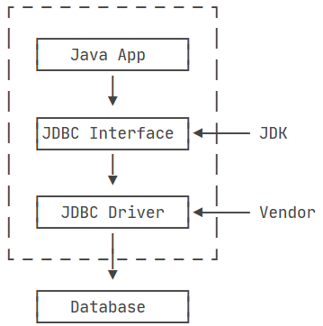

# Web 技术

## JSP


### 开发环境搭建

1. 配置Java开发工具（JDK），下载Java JDK，Java JDK 下载完后，请按照给定的指示来安装和配置 JDK。最后，通过设置 PATH 和 JAVA_HOME环境变量来指明包括 java 和 javac 的文件夹路径，通常是 java_install_dir/bin和java_install_dir。

2. 设置Web服务器：Tomcat
   目前，市场上有很多支持 JSP 和 Servlets 开发的 Web 服务器。他们中的一些可以免费下载和使用，Tomcat 就是其中之一。

   Apache Tomcat 是一个开源软件，可作为独立的服务器来运行 JSP 和 Servlets，也可以集成在 Apache Web Server 中。

3. 设置 CLASSPATH 环境变量
   由于 servlets 不是 Java SE 的一部分，所以您必须标示出 servlet 类的编译器。

### JSP 生命周期

理解JSP底层功能的关键就是去理解它们所遵守的生命周期。

JSP生命周期就是从创建到销毁的整个过程，类似于servlet生命周期，区别在于JSP生命周期还包括将JSP文件编译成servlet。

以下是JSP生命周期中所走过的几个阶段：

- 编译阶段：

  servlet容器编译servlet源文件，生成servlet类

- 初始化阶段：

  加载与JSP对应的servlet类，创建其实例，并调用它的初始化方法

- 执行阶段：

  调用与JSP对应的servlet实例的服务方法

- 销毁阶段：

  调用与JSP对应的servlet实例的销毁方法，然后销毁servlet实例


#### JSP编译

当浏览器请求JSP页面时，JSP引擎会首先去检查是否需要编译这个文件。如果这个文件没有被编译过，或者在上次编译后被更改过，则编译这个JSP文件。

编译的过程包括三个步骤：

- 解析JSP文件。
- 将JSP文件转为servlet。
- 编译servlet。

#### JSP初始化

容器载入JSP文件后，它会在为请求提供任何服务前调用jspInit()方法。如果您需要执行自定义的JSP初始化任务，复写jspInit()方法就行了，就像下面这样：

```
public void jspInit(){
  // 初始化代码
}
```

一般来讲程序只初始化一次，servlet也是如此。通常情况下您可以在jspInit()方法中初始化数据库连接、打开文件和创建查询表。

#### JSP执行

这一阶段描述了JSP生命周期中一切与请求相关的交互行为，直到被销毁。

当JSP网页完成初始化后，JSP引擎将会调用`_jspService()`方法。

`_jspService()`方法需要一个HttpServletRequest对象和一个HttpServletResponse对象作为它的参数，就像下面这样：

```
void _jspService(HttpServletRequest request, HttpServletResponse response)
{// 服务端处理代码
}
```

`_jspService()`方法在每个request中被调用一次并且负责产生与之相对应的response，并且它还负责产生所有7个HTTP方法的回应，比如GET、POST、DELETE等等。

#### JSP清理

JSP生命周期的销毁阶段描述了当一个JSP网页从容器中被移除时所发生的一切。

jspDestroy()方法在JSP中等价于servlet中的销毁方法。当您需要执行任何清理工作时复写jspDestroy()方法，比如释放数据库连接或者关闭文件夹等等。

jspDestroy()方法的格式如下：

```
public void jspDestroy()
{ // 清理代码}
```

#### 实例

JSP生命周期代码实例如下所示：

```jsp
<%@ page language="java" contentType="text/html; charset=UTF-8"
    pageEncoding="UTF-8"%>
<html>
<head>
<title>life.jsp</title>
</head>
<body>
<%! 
  private int initVar=0;
  private int serviceVar=0;
  private int destroyVar=0;
%>
<%!
  public void jspInit(){
    initVar++;
    System.out.println("jspInit(): JSP被初始化了"+initVar+"次");
  }
  public void jspDestroy(){
    destroyVar++;
    System.out.println("jspDestroy(): JSP被销毁了"+destroyVar+"次");
  }
%>
<%
  serviceVar++;
  System.out.println("_jspService(): JSP共响应了"+serviceVar+"次请求");

  String content1="初始化次数 : "+initVar;
  String content2="响应客户请求次数 : "+serviceVar;
  String content3="销毁次数 : "+destroyVar;
%>
<h1>菜鸟教程 JSP 测试实例</h1>
<p><%=content1 %></p>
<p><%=content2 %></p>
<p><%=content3 %></p>
</body>
<html>
```

### 注释

1. **HTML注释**：HTML注释在JSP文件中的作用和在普通HTML文件中一样。这种注释在客户端可见，因为它们被包含在发送到浏览器的HTML源代码中。

   语法：

   ```
   <!-- 这是一个HTML注释 -->
   ```

   这种注释不会被JSP容器处理，而是原样发送到客户端。

2. **JSP注释**：JSP注释仅在服务器端处理，用于在JSP代码中添加注释，这些注释不会出现在生成的HTML源代码中，因此客户端用户看不到这些注释。

   语法：

   ```
   <%-- 这是一个JSP注释 --%>
   ```

3. **JAVA注释：**注释会在编译成Servlet的时候保留

   ```
   // 单行注释
   /*多行注释
   */
   ```

### JSP 控制流语句

JSP提供对Java语言的全面支持。您可以在JSP程序中使用Java API甚至建立Java代码块，包括判断语句和循环语句等等。

#### 判断语句

**if…else** 块，请看下面这个例子：

```jsp
<%@ page language="java" contentType="text/html; charset=UTF-8"
    pageEncoding="UTF-8"%>
<%! int day = 3; %> 
<!DOCTYPE html>
<html>
<head>
<meta charset="utf-8">
<title>菜鸟教程(runoob.com)</title>
</head>
<body>
<h3>IF...ELSE 实例</h3>
<% if (day == 1 || day == 7) { %>
      <p>今天是周末</p>
<% } else { %>
      <p>今天不是周末</p>
<% } %>
</body> 
</html> 
```

运行后得到以下结果：

```
IF...ELSE 实例
今天不是周末
```

现在来看看switch…case块，与if…else块有很大的不同，它使用out.println()，并且整个都装在脚本程序的标签中，就像下面这样：

```jsp
<%@ page language="java" contentType="text/html; charset=UTF-8"
    pageEncoding="UTF-8"%>
<%! int day = 3; %> 
<!DOCTYPE html>
<html>
<head>
<meta charset="utf-8">
<title>菜鸟教程(runoob.com)</title>
</head>
<body>
<h3>SWITCH...CASE 实例</h3>
<% 
switch(day) {
case 0:
   out.println("星期天");
   break;
case 1:
   out.println("星期一");
   break;
case 2:
   out.println("星期二");
   break;
default:
   out.println("星期六");
}
%>
</body> 
</html> 
```

浏览器访问，运行后得出以下结果：

```
SWITCH...CASE 实例
星期三
```

------

#### 循环语句

在JSP程序中可以使用Java的三个基本循环类型：for，while，和 do…while。

让我们来看看for循环的例子，以下输出的不同字体大小的"菜鸟教程"：

```jsp
<%@ page language="java" contentType="text/html; charset=UTF-8"
    pageEncoding="UTF-8"%>
<%! int fontSize; %> 
<!DOCTYPE html>
<html>
<head>
<meta charset="utf-8">
<title>菜鸟教程(runoob.com)</title>
</head>
<body>
<h3>For 循环实例</h3>
<%for ( fontSize = 1; fontSize <= 3; fontSize++){ %>
   <font color="green" size="<%= fontSize %>">
    菜鸟教程
   </font><br />
<%}%>
</body> 
</html> 
```

### JSP 脚本元素

```jsp
<% 代码片段 %>
<jsp:scriptlet>
   代码片段
</jsp:scriptlet>
<%
out.println("Your IP address is " + request.getRemoteAddr());
%>
```

使用 `out.println()` 才能输出到页面上，`system.out.println()`只会输出到控制台

#### JSP 声明

一个声明语句可以声明一个或多个变量、方法，供后面的Java代码使用。在JSP文件中，您必须先声明这些变量和方法然后才能使用它们。

JSP声明的语法格式：

```jsp
<%! declaration; [ declaration; ]+ ... %>
```

或者，您也可以编写与其等价的XML语句，就像下面这样：

```jsp
<jsp:declaration>
   代码片段
</jsp:declaration>
```

程序示例：

```jsp
<%! int i = 0; %> 
<%! int a, b, c; %> 
<%! Circle a = new Circle(2.0); %> 
```

声明中的变量是全局变量，且在这里无法使用隐含对象，如`out`等

#### 表达式

一个JSP表达式中包含的脚本语言表达式，先被转化成String，然后插入到表达式出现的地方。

表达式元素中可以包含任何符合Java语言规范的表达式，但是不能使用分号来结束表达式。

```jsp
<%= 表达式 %>

<jsp:expression>
   表达式
</jsp:expression>
```


### JSP 指令元素

**JSP指令用来设置与整个JSP页面相关的属性**

JSP指令语法格式：

```jsp
<%@ directive attribute="value" %>
```

这里有三种指令标签：

| **指令**           | **描述**                                                  |
| :----------------- | :-------------------------------------------------------- |
| <%@ page ... %>    | 定义页面的依赖属性，比如脚本语言、error页面、缓存需求等等 |
| <%@ include ... %> | 包含其他文件                                              |
| <%@ taglib ... %>  | 引入标签库的定义，可以是自定义标签                        |

#### Page指令

Page指令为容器提供当前页面的使用说明。一个JSP页面可以包含多个page指令。

Page指令的语法格式：

```
<%@ page attribute="value" %>
```

等价的XML格式：

```
<jsp:directive.page attribute="value" />
```

##### 使用中文

```jsp
<%@ page language="java" contentType="text/html; charset=UTF-8"
    pageEncoding="UTF-8"%>
```

##### 属性

下表列出与Page指令相关的属性：

| **属性**           | **描述**                                            |
| :----------------- | :-------------------------------------------------- |
| buffer             | 指定out对象使用缓冲区的大小                         |
| autoFlush          | 控制out对象的 缓存区                                |
| contentType        | 指定当前JSP页面的MIME类型和字符编码                 |
| errorPage          | 指定当JSP页面发生异常时需要转向的错误处理页面       |
| isErrorPage        | 指定当前页面是否可以作为另一个JSP页面的错误处理页面 |
| extends            | 指定servlet从哪一个类继承                           |
| import             | 导入要使用的Java类                                  |
| info               | 定义JSP页面的描述信息                               |
| isThreadSafe       | 指定对JSP页面的访问是否为线程安全                   |
| language           | 定义JSP页面所用的脚本语言，默认是Java               |
| session            | 指定JSP页面是否使用session                          |
| isELIgnored        | 指定是否执行EL表达式                                |
| isScriptingEnabled | 确定脚本元素能否被使用                              |

------

#### Include指令

JSP可以通过include指令来包含其他文件。被包含的文件可以是JSP文件、HTML文件或文本文件。包含的文件就好像是该JSP文件的一部分，会被同时编译执行。

Include指令的语法格式如下：

```
<%@ include file="文件相对 url 地址" %>
```

**include** 指令中的文件名实际上是一个相对的 URL 地址。

如果您没有给文件关联一个路径，JSP编译器默认在当前路径下寻找。

等价的XML语法：

```
<jsp:directive.include file="文件相对 url 地址" />
```

------

#### Taglib指令

JSP API允许用户自定义标签，一个自定义标签库就是自定义标签的集合。

Taglib指令引入一个自定义标签集合的定义，包括库路径、自定义标签。

Taglib指令的语法：

```
<%@ taglib uri="uri" prefix="prefixOfTag" %>
```

uri属性确定标签库的位置，prefix属性指定标签库的前缀。

等价的XML语法：

```
<jsp:directive.taglib uri="uri" prefix="prefixOfTag" />
```


### JSP 动作元素

JSP行为标签使用XML语法结构来控制servlet引擎。它能够动态插入一个文件，重用JavaBean组件，引导用户去另一个页面，为Java插件产生相关的HTML等等。

行为标签只有一种语法格式，它严格遵守XML标准：

```
<jsp:action_name attribute="value" />
```

行为标签基本上是一些预先就定义好的函数，下表罗列出了一些可用的JSP行为标签：：

| **语法**        | **描述**                                                     |
| :-------------- | :----------------------------------------------------------- |
| jsp:include     | 用于在当前页面中包含静态或动态资源                           |
| jsp:useBean     | 寻找和初始化一个JavaBean组件                                 |
| jsp:setProperty | 设置 JavaBean组件的值                                        |
| jsp:getProperty | 将 JavaBean组件的值插入到 output中                           |
| jsp:forward     | 从一个JSP文件向另一个文件传递一个包含用户请求的request对象   |
| jsp:plugin      | 用于在生成的HTML页面中包含Applet和JavaBean对象               |
| jsp:element     | 动态创建一个XML元素                                          |
| jsp:attribute   | 定义动态创建的XML元素的属性                                  |
| jsp:body        | 定义动态创建的XML元素的主体                                  |
| jsp:text        | 用于封装模板数据                                             |
| jsp:param       | 与jsp:include, jsp:forward, jsp:plugin 一起使用，用于传递参数。 |
| jsp:plugin      | 用于嵌入浏览器插件，如Applet                                 |

- id属性：

  id属性是动作元素的唯一标识，可以在JSP页面中引用。动作元素创建的id值可以通过PageContext来调用。

- scope属性：

  该属性用于识别动作元素的生命周期。 id属性和scope属性有直接关系，scope属性定义了相关联id对象的寿命。 scope属性有四个可能的值： (a) page, (b)request, (c)session, 和 (d) application。

#### `jsp:usebean`

`<jsp:useBean>` 是 JSP (Java Server Pages) 中的一个重要动作元素，用于在 JSP 页面中声明和实例化 Java Beans。它可以查找指定范围内是否已经存在指定类型的 Bean，如果不存在，则会自动创建该 Bean。这个标签简化了 Java 对象的创建和使用过程。

**基本语法**：

```
1<jsp:useBean id="beanId" class="className" scope="scopeName"/>
```

- **`id`**: 这是引用 Bean 的名称，后续可以通过这个名称来访问 Bean。
- **`class`**: 指定 Bean 的完全限定类名（即包括包名的类名）。
- **`scope`**: 指定 Bean 的作用域，可以是 `page`、`request`、`session` 或 `application`。


假设有一个名为 `User` 的 Java 类，包含属性 `name` 和 `age`，并有相应的 getter 和 setter 方法。

1. **声明并实例化 Bean**:

   ```
   1<jsp:useBean id="user" class="com.example.User" scope="session"/>
   ```

   这将在 session 作用域内查找或创建一个 `User` 类的实例。

2. **设置 Bean 属性**:

   ```
   1<jsp:setProperty name="user" property="name" value="John Doe"/>
   2<jsp:setProperty name="user" property="age" value="30"/>
   ```

   这将设置 `user` 对象的 `name` 和 `age` 属性。

3. **获取 Bean 属性**:

   ```
   1Name: <jsp:getProperty name="user" property="name"/>
   2Age: <jsp:getProperty name="user" property="age"/>
   ```

   这将获取并显示 `user` 对象的 `name` 和 `age` 属性。


### EL表达式

#### 访问 Java Beans 属性

假设有一个名为 `user` 的 JavaBean 对象，具有属性 `name`：

```
1${user.name}
```

这个表达式会访问 `user` 对象的 `getName()` 方法

#### 表达式操作

EL 表达式支持一些基本的操作，如算术操作、逻辑操作、关系操作等：

```jsp
${num1 + num2}
${num1 > num2}
${condition1 && condition2}
```

#### 作用域（Scope）

1. Page Scope

     - **生命周期**：仅在当前页面有效。

     - **如何存入**：在 JSP 页面中使用 `<jsp:setProperty>` 或者在页面的 Java 代码段中设置属性。

     - **用途**：通常用于仅在当前页面有效的临时数据。


2. Request Scope

     - **生命周期**：在一次请求中有效，包括从一个 servlet 到另一个 servlet 或 JSP 的转发。

     - **如何存入**：在 Servlet 中使用 `request.setAttribute("key", value)`。

     - **用途**：用于在一次请求中传递数据，适合在转发过程中保持数据。


3. Session Scope

     - **生命周期**：在整个用户会话期间有效。

     - **如何存入**：在 Servlet 或 JSP 中使用 `session.setAttribute("key", value)`。

     - **用途**：用于存储用户会话期间需要持续跟踪的数据，如用户登录信息。


4. Application Scope

     - **生命周期**：在整个Web应用程序的生命周期内有效。

     - **如何存入**：在 Servlet 或 JSP 中使用 `servletContext.setAttribute("key", value)`，其中 `servletContext` 可以通过 `getServletContext()` 方法获取。

     - **用途**：用于存储整个应用程序范围内的全局数据，如应用程序级配置。


  #### 作用域的作用

  - **数据隔离**：根据作用域不同，数据可以被隔离在不同的层次，避免不必要的数据共享。
  - **数据传递**：特别是在 request 和 session 作用域中，数据可以在不同的 servlets 和 JSP 页面间传递。
  - **性能和资源管理**：通过合理的作用域选择，可以有效地管理内存和应用资源，例如，避免在 application scope 中存储大量的或用户特定的数据。
  - **安全性**：适当地使用不同的作用域可以提高应用的安全性，例如，敏感信息不应存储在 application scope 中。

  正确地理解和使用这些作用域对于开发高效和可维护的 JSP 和 Servlet 应用至关重要。

EL 表达式会按照 Page -> Request -> Session -> Application 的顺序查找变量。

#### 内置对象

EL 提供了一系列内置对象，这些对象对于访问常用的功能非常有用：

1. **pageScope**: 用于访问page作用域的属性。
2. **requestScope**: 用于访问request作用域的属性。
3. **sessionScope**: 用于访问session作用域的属性。
4. **applicationScope**: 用于访问application作用域的属性。
5. **param**: 用于访问请求参数。
6. **paramValues**: 用于访问具有多个值的请求参数。
7. **header**: 用于访问HTTP头信息。
8. **headerValues**: 用于访问具有多个值的HTTP头信息。
9. **cookie**: 用于访问cookies。
10. **initParam**: 用于访问web应用程序的初始化参数。

### JSP 隐含对象

JSP 支持九个自动定义的变量，江湖人称隐含对象，它们是在 JSP 页面中自动可用的对象，无需额外的声明或初始化。

这九个隐含对象的简介见下表：

| **对象**    | **描述**                                                     |
| :---------- | :----------------------------------------------------------- |
| request     | **HttpServletRequest**类的实例，代表 HTTP 请求的对象，包含客户端发送到服务器的信息，如表单数据、URL参数等。 |
| response    | **HttpServletResponse**类的实例，代表 HTTP 响应的对象，用于向客户端发送数据和响应。 |
| out         | **JspWriter**类的实例，用于向客户端输出文本内容的对象，通常用于生成HTML。 |
| session     | **HttpSession**类的实例，代表用户会话的对象，可用于存储和检索用户特定的数据，跨多个页面。 |
| application | **ServletContext**类的实例，代表 Web 应用程序的上下文，可以用于存储和检索全局应用程序数据。 |
| config      | **ServletConfig**类的实例，包含有关当前 JSP 页面的配置信息，例如初始化参数。 |
| pageContext | **PageContext**类的实例，提供对JSP页面所有对象以及命名空间的访问 |
| page        | 类似于 Java 类中的 this 关键字，代表当前 JSP 页面的实例，可以用于调用页面的方法。 |
| exception   | **exception** 类的对象，代表发生错误的 JSP 页面中对应的异常对象，用于处理 JSP 页面中的异常情况，可用于捕获和处理页面中发生的异常。 |

### JSP HTTP状态码

#### 设置HTTP状态码的方法

下表列出了HttpServletResponse 类中用来设置状态码的方法：

| **S.N.** | **方法** **&** **描述**                                      |
| :------- | :----------------------------------------------------------- |
| 1        | **public void setStatus ( int statusCode )**此方法可以设置任意的状态码。如果您的响应包含一个特殊的状态码和一个文档，请确保在用PrintWriter返回任何内容前调用setStatus方法 |
| 2        | **public void sendRedirect(String url)**此方法产生302响应，同时产生一个 *Location* 头告诉URL 一个新的文档 |
| 3        | **public void sendError(int code, String message)**此方法将一个状态码(通常为 404)和一个短消息，自动插入HTML文档中并发回给客户端 |

### JSP 表单处理

#### 读取所有表单参数

```jsp
<%
   Enumeration paramNames = request.getParameterNames();

   while(paramNames.hasMoreElements()) {
      String paramName = (String)paramNames.nextElement();
      out.print("<tr><td>" + paramName + "</td>\n");
      String paramValue = request.getParameter(paramName);
      out.println("<td> " + paramValue + "</td></tr>\n");
   }
%>
```

### JSP 文件上传

upload.jsp 文件代码如下：

```java
<%@ page language="java" contentType="text/html; charset=UTF-8"
    pageEncoding="UTF-8"%>
<!DOCTYPE html PUBLIC "-//W3C//DTD HTML 4.01 Transitional//EN"
    "http://www.w3.org/TR/html4/loose.dtd">
<html>
<head>
<meta http-equiv="Content-Type" content="text/html; charset=UTF-8">
<title>文件上传实例 - 菜鸟教程</title>
</head>
<body>
<h1>文件上传实例 - 菜鸟教程</h1>
<form method="post" action="/TomcatTest/UploadServlet" enctype="multipart/form-data">
    选择一个文件:
    <input type="file" name="uploadFile" />
    <br/><br/>
    <input type="submit" value="上传" />
</form>
</body>
</html>
```

UploadServlet 的源代码 如下所示：

```java
package com.runoob.test;
import java.io.File;
import java.io.IOException;
import java.io.PrintWriter;
import java.util.List;
import javax.servlet.ServletException;
import javax.servlet.annotation.WebServlet;
import javax.servlet.http.HttpServlet;
import javax.servlet.http.HttpServletRequest;
import javax.servlet.http.HttpServletResponse;
import org.apache.commons.fileupload.FileItem;
import org.apache.commons.fileupload.disk.DiskFileItemFactory;
import org.apache.commons.fileupload.servlet.ServletFileUpload;
// 如果不配置 web.xml ，可以使用下面的代码
// @WebServlet("/UploadServlet")
public class UploadServlet extends HttpServlet {
    private static final long serialVersionUID = 1L;
     
    // 上传文件存储目录
    private static final String UPLOAD_DIRECTORY = "upload";
 
    // 上传配置
    private static final int MEMORY_THRESHOLD   = 1024 * 1024 * 3;  // 3MB
    private static final int MAX_FILE_SIZE      = 1024 * 1024 * 40; // 40MB
    private static final int MAX_REQUEST_SIZE   = 1024 * 1024 * 50; // 50MB
 
    /**
     * 上传数据及保存文件
     */
    protected void doPost(HttpServletRequest request,
        HttpServletResponse response) throws ServletException, IOException {
        // 检测是否为多媒体上传
        if (!ServletFileUpload.isMultipartContent(request)) {
            // 如果不是则停止
            PrintWriter writer = response.getWriter();
            writer.println("Error: 表单必须包含 enctype=multipart/form-data");
            writer.flush();
            return;
        }
 
        // 配置上传参数
        DiskFileItemFactory factory = new DiskFileItemFactory();
        // 设置内存临界值 - 超过后将产生临时文件并存储于临时目录中
        factory.setSizeThreshold(MEMORY_THRESHOLD);
        // 设置临时存储目录
        factory.setRepository(new File(System.getProperty("java.io.tmpdir")));
 
        ServletFileUpload upload = new ServletFileUpload(factory);
         
        // 设置最大文件上传值
        upload.setFileSizeMax(MAX_FILE_SIZE);
         
        // 设置最大请求值 (包含文件和表单数据)
        upload.setSizeMax(MAX_REQUEST_SIZE);
        
        // 中文处理
        upload.setHeaderEncoding("UTF-8"); 

        // 构造临时路径来存储上传的文件
        // 这个路径相对当前应用的目录
        String uploadPath = getServletContext().getRealPath("/") + File.separator + UPLOAD_DIRECTORY;
        // 如果目录不存在则创建
        File uploadDir = new File(uploadPath);
        if (!uploadDir.exists()) {
            uploadDir.mkdir();
        }
        try {
            // 解析请求的内容提取文件数据
            @SuppressWarnings("unchecked")
            List<FileItem> formItems = upload.parseRequest(request);
 
            if (formItems != null && formItems.size() > 0) {
                // 迭代表单数据
                for (FileItem item : formItems) {
                    // 处理不在表单中的字段
                    if (!item.isFormField()) {
                        String fileName = new File(item.getName()).getName();
                        String filePath = uploadPath + File.separator + fileName;
                        File storeFile = new File(filePath);
                        // 在控制台输出文件的上传路径
                        System.out.println(filePath);
                        // 保存文件到硬盘
                        item.write(storeFile);
                        request.setAttribute("message",
                            "文件上传成功!");
                    }
                }
            }
        } catch (Exception ex) {
            request.setAttribute("message",
                    "错误信息: " + ex.getMessage());
        }
        // 跳转到 message.jsp
        getServletContext().getRequestDispatcher("/message.jsp").forward(
                request, response);
    }
}
```

message.jsp 文件代码如下：

```java
<%@ page language="java" contentType="text/html; charset=UTF-8"
    pageEncoding="UTF-8"%>
<!DOCTYPE html PUBLIC "-//W3C//DTD HTML 4.01 Transitional//EN"
    "http://www.w3.org/TR/html4/loose.dtd">
<html>
<head>
<meta http-equiv="Content-Type" content="text/html; charset=UTF-8">
<title>文件上传结果</title>
</head>
<body>
    <center>
        <h2>${message}</h2>
    </center>
</body>
</html>
```

#### 编译和运行 Servlet

编译上面的 Servlet UploadServlet，并在 web.xml 文件中创建所需的条目，如下所示：

```java
<?xml version="1.0" encoding="UTF-8"?>
<web-app xmlns:xsi="http://www.w3.org/2001/XMLSchema-instance"
    xmlns="http://java.sun.com/xml/ns/javaee"
    xmlns:web="http://java.sun.com/xml/ns/javaee/web-app_2_5.xsd"
    xsi:schemaLocation="http://java.sun.com/xml/ns/javaee
        http://java.sun.com/xml/ns/javaee/web-app_2_5.xsd"
    id="WebApp_ID" version="2.5">
  <servlet>
    <display-name>UploadServlet</display-name>
    <servlet-name>UploadServlet</servlet-name>
    <servlet-class>com.runoob.test.UploadServlet</servlet-class>
  </servlet>
  <servlet-mapping>
    <servlet-name>UploadServlet</servlet-name>
    <url-pattern>/TomcatTest/UploadServlet</url-pattern>
  </servlet-mapping>
</web-app>
```

### JSP 页面重定向

最简单的方法：

```java
public void response.sendRedirect(String location)
throws IOException 
```

通过设置状态码和新的页面位置来达到同样效果：

```java
....
String site = "http://www.runoob.com" ;
response.setStatus(response.SC_MOVED_TEMPORARILY);
response.setHeader("Location", site); 
....
```

### JSP 自动刷新

```java
public void setIntHeader(String header, int headerValue)
```

```jsp
<%
   // 设置每隔5秒刷新一次
   response.setIntHeader("Refresh", 5);
   // 获取当前时间
   Calendar calendar = new GregorianCalendar();
   String am_pm;
   int hour = calendar.get(Calendar.HOUR);
   int minute = calendar.get(Calendar.MINUTE);
   int second = calendar.get(Calendar.SECOND);
   if(calendar.get(Calendar.AM_PM) == 0)
      am_pm = "AM";
   else
      am_pm = "PM";
   String CT = hour+":"+ minute +":"+ second +" "+ am_pm;
   out.println("当前时间为: " + CT + "\n");
%>
```

### JSTL

#### c:out

- 默认空值不输出
- 默认转义处理

```
 <c:out value="&lt要显示的数据对象（未使用转义字符）&gt" escapeXml="true" default="默认值"></c:out><br/>
          <c:out value="&lt要显示的数据对象（使用转义字符）&gt" escapeXml="false" default="默认值"></c:out><br/>
    <c:out value="${null}" escapeXml="false">使用的表达式结果为null，则输出该默认值</c:out><br/>
```

#### c:forEach

-  **current**: 当前这次迭代的（集合中的）项
-  **index**: 当前这次迭代从 0 开始的迭代索引
-  **count**: 当前这次迭代从 1 开始的迭代计数
-  **first**: 用来表明当前这轮迭代是否为第一次迭代的标志
-  **last**: 用来表明当前这轮迭代是否为最后一次迭代的标志
-  **begin**: 属性值
-  **end**: 属性值
-  **step**: 属性值

例如：

```jsp
<c:forEach  items="${sessionScope.userList}"  var="userItem"  begin="1"  end="10"  step="3"  varStatus="userStatus"> XXX </c:foreach>
```

**实例解读：** 对 session 对象存储的 userList 集合对象进行遍历，每次访问的项暂时存储在 userItem 变量中，从索引 1 开始至索引 10 进行访问，但不是依次访问，每隔 3 个元素访问一次。每次访问项的状态相关值由 userStatus 对象暂存。

<c:foreach> 的 varStatus 属性暂存项的相关状态属性，可由 EL 表达式引用。

```
${userStatus.index} 此项的索引，从0开始 
${userStatus.count} 此项的计数序号，从1开始 
${userStatus.first} 此项是否是第一项，布尔值 
${userStatus.last} 此项是否是最后一项，布尔值 
${userStatus.begin} 此次迭代的起始索引，对应<c:foreach>中begin属性值 
${userStatus.end} 此次迭代的终止索引，对应<c:foreach>中end属性值 
${userStatus.step} 此次迭代的跳跃步伐，对应<c:foreach>中step属性值 
```


## JDBC

JDBC 是一个 Java API，用于在 Java 应用程序中连接和操作数据库。它提供了一种标准方法，使得开发者可以查询和更新数据库中的数据，而无需考虑底层数据库的具体细节。

用Java程序访问数据库时，Java代码并不是直接通过TCP连接去访问数据库，而是通过JDBC接口来访问，而JDBC接口则通过JDBC驱动来实现真正对数据库的访问。

例如，我们在Java代码中如果要访问MySQL，那么必须编写代码操作JDBC接口。注意到JDBC接口是Java标准库自带的，所以可以直接编译。而具体的JDBC驱动是由数据库厂商提供的，例如，MySQL的JDBC驱动由Oracle提供。因此，访问某个具体的数据库，我们只需要引入该厂商提供的JDBC驱动，就可以通过JDBC接口来访问，这样保证了**Java程序编写的是一套数据库访问代码，却可以访问各种不同的数据库，因为他们都提供了标准的JDBC驱动**：



实际上，一个MySQL的JDBC的驱动就是一个jar包，本身也是纯Java编写的。我们自己编写的代码只需要引用Java标准库提供的java.sql包下面的相关接口，由此再间接地通过MySQL驱动的jar包通过网络访问MySQL服务器，所有复杂的网络通讯都被封装到JDBC驱动中，因此，Java程序本身只需要引入一个MySQL驱动的jar包就可以正常访问MySQL服务器


### JDBC 的核心组件

1. **驱动管理器（DriverManager）**：负责管理不同数据库驱动程序。
2. **数据库连接（Connection）**：代表与特定数据库的连接。
3. **语句对象（Statement, PreparedStatement, CallableStatement）**：用于执行 SQL 命令。
4. **结果集（ResultSet）**：存储 SQL 查询的结果。
5. **数据库元数据（DatabaseMetaData）**：提供关于数据库结构的信息。


### 常用的 JDBC API 和类

1. **java.sql.DriverManager**：用于管理一组 JDBC 驱动程序的基本服务。
2. **java.sql.Connection**：提供了与特定数据库的连接。
3. **java.sql.Statement**：用于执行静态 SQL 语句并返回其生成的结果。
4. **java.sql.PreparedStatement**：用于执行预编译 SQL 语句。
5. **java.sql.CallableStatement**：用于执行存储过程。
6. **java.sql.ResultSet**：表示数据库结果集的数据表。
7. **java.sql.SQLException**：处理 JDBC 操作中发生的错误。


### JDBC 元数据

#### 数据库元数据 `DatabaseMetaData`

1. 数据库和驱动信息

     - String getDatabaseProductName(): 获取数据库产品名称。


     - String getDatabaseProductVersion(): 获取数据库产品版本。


     - String getDriverName(): 获取 JDBC 驱动程序名称。


     - String getDriverVersion(): 获取 JDBC 驱动程序版本。


     - int getDriverMajorVersion(): 获取 JDBC 驱动程序的主版本号。


     - int getDriverMinorVersion(): 获取 JDBC 驱动程序的次版本号。
     - String getUrl()：返回数据库的URL。


2. 支持的特性
   - boolean supportsTransactions(): 检查数据库是否支持事务。
   - boolean supportsResultSetType(int type): 检查是否支持特定类型的 ResultSet。
   - boolean supportsBatchUpdates(): 检查是否支持批量更新。
   - boolean supportsStoredProcedures(): 检查是否支持存储过程。
3. SQL 语法
   - String getSQLKeywords(): 获取数据库支持的 SQL 关键字。
   - String getNumericFunctions(): 获取数据库支持的数值函数。
   - String getStringFunctions(): 获取数据库支持的字符串函数。
   - String getSystemFunctions(): 获取数据库支持的系统函数。
   - String getTimeDateFunctions(): 获取数据库支持的时间和日期函数。
4. 数据库架构和结构
  - ResultSet getTables(String catalog, String schemaPattern, String tableNamePattern, String[] types): 获取数据库中的表信息。
  - ResultSet getSchemas(): 获取数据库的架构信息。
  - ResultSet getCatalogs(): 获取数据库的目录信息。
  - ResultSet getTableTypes(): 获取数据库中可用的表类型。
  - ResultSet getColumns(String catalog, String schemaPattern, String tableNamePattern, String columnNamePattern): 获取表的列信息。


5. 索引和键
   - ResultSet getPrimaryKeys(String catalog, String schema, String table): 获取表的主键。
   - ResultSet getImportedKeys(String catalog, String schema, String table): 获取表的外键。

6. 其他
   - boolean isReadOnly(): 检查数据库是否是只读的。
   - ResultSet getProcedures(String catalog, String schemaPattern, String procedureNamePattern): 获取存储过程的信息。
   - ResultSet getColumnPrivileges(String catalog, String schema, String table, String columnNamePattern): 获取列的权限信息。


#### 结果元数据 `ResultSetMetaData`

1. 列的基本信息

   - int getColumnCount(): 获取 ResultSet 中列的数量。

   - String getColumnName(int column): 获取指定列的名称。

   - String getColumnLabel(int column): 获取用于显示的列标签（别名）。

2. 列的类型

   - int getColumnType(int column): 获取指定列的 SQL 类型，返回值是 java.sql.Types 中的常量。

   - String getColumnTypeName(int column): 获取指定列的数据库特定的类型名称。

   - String getColumnClassName(int column): 获取将用于表示列值的 Java 类的名称。

3. 列的属性

   - int getColumnDisplaySize(int column): 获取指定列的建议显示宽度。

   - int getPrecision(int column): 获取列中数值精度。

   - int getScale(int column): 获取列中数值的小数点后的位数。
   - boolean isNullable(int column): 指示指定列的值是否可以为 null。

4. 列的其他属性

   - boolean isAutoIncrement(int column): 指示是否自动增加列。

   - boolean isCaseSensitive(int column): 指示列的大小写是否敏感。

   - boolean isReadOnly(int column): 指示列是否只读。

   - boolean isSearchable(int column): 指示列是否可以出现在 WHERE 子句中。

   - boolean isCurrency(int column): 指示列是否是货币值。

```java
ResultSet rs = // 获取结果集
ResultSetMetaData rsmd = rs.getMetaData();
int columnCount = rsmd.getColumnCount();

for (int i = 1; i <= columnCount; i++) {
    String columnName = rsmd.getColumnName(i);
    String columnType = rsmd.getColumnTypeName(i);
    // 处理其他列属性...
}
```


#### 参数元数据 `ParameterMetaData`

以下是 ParameterMetaData 接口提供的一些主要方法：

- 获取参数数量：int getParameterCount(): 返回 SQL 语句中参数的数量。

- 获取参数类型：int getParameterType(int param): 返回指定参数的 SQL 类型，返回值是 java.sql.Types 中的一个整数值。
- 获取参数类型名称：String getParameterTypeName(int param): 返回指定参数的数据库特定的类型名称。
- 判断参数的空值状态：int isNullable(int param): 指示指定参数是否允许为 null。返回值是 ParameterMetaData.parameterNoNulls、parameterNullable 或 parameterNullableUnknown。
- 获取参数的模式：int getParameterMode(int param): 确定参数是输入型、输出型还是输入输出型。返回值是 ParameterMetaData.parameterModeIn、parameterModeOut、parameterModeInOut 或 parameterModeUnknown。


### 连接数据库

```java
import java.sql.Connection;
import java.sql.DriverManager;
import java.sql.SQLException;

public class MySQLConnectionExample {
    public static void main(String[] args) {
        // 替换为你的数据库URL、用户名和密码
        String url = "jdbc:mysql://localhost:3306/yourDatabaseName";
        String user = "yourUsername";
        String password = "yourPassword";

        try {
            // 加载MySQL JDBC驱动
            Class.forName("com.mysql.cj.jdbc.Driver");

            // 建立连接
            Connection conn = DriverManager.getConnection(url, user, password);
            if (conn != null) {
                System.out.println("Connected to the database successfully!");
                // 这里可以添加你的数据库操作代码
            }
        } catch (SQLException e) {
            System.out.println("SQL Error: " + e.getMessage());
        } catch (ClassNotFoundException e) {
            System.out.println("MySQL JDBC Driver not found: " + e.getMessage());
        }
    }
}
```

#### 连接池版本

```java
import java.sql.Connection;
import java.sql.DriverManager;
import java.sql.SQLException;
import java.util.ArrayList;
import java.util.List;

public class SimpleConnectionPool {
    private List<Connection> connectionPool;
    private String url;
    private String user;
    private String password;

    public SimpleConnectionPool(String url, String user, String password, int initialPoolSize) {
        this.url = url;
        this.user = user;
        this.password = password;
        this.connectionPool = new ArrayList<>(initialPoolSize);

        try {
            for (int i = 0; i < initialPoolSize; i++) {
                connectionPool.add(this.createConnection());
            }
        } catch (SQLException e) {
            throw new RuntimeException(e);
        }
    }

    private Connection createConnection() throws SQLException {
        return DriverManager.getConnection(url, user, password);
    }

    public synchronized Connection getConnection() {
        if (connectionPool.isEmpty()) {
            throw new RuntimeException("No available connection");
        }
        return connectionPool.remove(connectionPool.size() - 1);
    }

    public synchronized void releaseConnection(Connection connection) {
        connectionPool.add(connection);
    }

    // You might want to add some cleanup method to close all the connections when your application stops.
    public synchronized void shutdown() {
        for (Connection conn : connectionPool) {
            try {
                conn.close();
            } catch (SQLException e) {
                // handling errors
            }
        }
        connectionPool.clear();
    }

    public static void main(String[] args) {
        // Initialize the connection pool
        SimpleConnectionPool pool = new SimpleConnectionPool(
                "jdbc:mysql://localhost:3306/yourDatabaseName", "yourUsername", "yourPassword", 10);

        try {
            // Get a connection from the pool
            Connection connection = pool.getConnection();
            // Use the connection to interact with the database
            // Release the connection back to the pool
            pool.releaseConnection(connection);
            // Shutdown the pool
            pool.shutdown();
        } catch (Exception e) {
            e.printStackTrace();
        }
    }
}
```


## AJAX

AJAX（Asynchronous JavaScript and XML）是一种在网页浏览器中创建交互式Web应用程序的技术。它允许Web应用程序异步地发送和接收数据，这意味着可以在不重新加载整个页面的情况下更新部分页面内容。AJAX的核心是 JavaScript 语言，特别是 `XMLHttpRequest` 对象，它用于在浏览器和服务器之间异步交换数据。


### AJAX的组成

1. **HTML/CSS**：用于标记和样式化信息。
2. **JavaScript**：用于与服务器交互并控制页面行为。
3. **XMLHttpRequest对象**：用于异步与服务器通信。尽管名称中包含“XML”，但它可以处理任何类型的数据，包括JSON、XML、HTML和纯文本。


### AJAX流程

1. 创建XMLHttpRequest对象
2. 设置要发送的数据
3. 设置请求头
4. 发送数据

```js
const xhr = new XMLHttpRequest();
xhr.onreadystatechange = () => {
   if (xhr.readyState !== 4) return;
   if ((xhr.status >= 200 && xhr.status < 300) || xhr.status === 304) {
       console.log(xhr.responseText);
    }
};
xhr.open('GET', 'text.json', true);
xhr.send(null);
```

```js
// 创建一个新的 XMLHttpRequest 对象
var xhr = new XMLHttpRequest();

// 配置请求类型、URL 以及是否异步处理请求
xhr.open('GET', 'https://jsonplaceholder.typicode.com/posts/1', true);
// 设置请求完成后的回调函数
xhr.onload = function () {
    // 检查请求是否成功
    if (xhr.status >= 200 && xhr.status < 300) {
        // 请求成功，处理响应数据
        console.log('Success:', xhr.responseText);
    } else {
        // 请求失败，处理错误
        console.error('The request failed!');
    }
};
// 设置请求过程中发生错误时的回调函数
xhr.onerror = function () {
    console.error('The request encountered an error.');
};
// 发送请求
xhr.send();
```


在HTTP请求中，`Content-Type` 是一个非常重要的请求头，用于指示发送到服务器的数据的类型。以下是一些常见的 `Content-Type` 类型：

1. **`text/plain`**
   - 描述：纯文本格式。当发送的数据是未格式化的文本时使用。
2. **`text/html`**
   - 描述：HTML格式。当发送的数据是HTML文档时使用。
3. **`text/css`**
   - 描述：CSS格式。用于发送CSS样式表。
4. **`text/javascript`**
   - 描述：JavaScript代码。用于发送JavaScript代码。
5. **`application/json`**
   - 描述：JSON（JavaScript Object Notation）数据格式。
   - 使用场景：在现代Web编程中非常常见，用于发送和接收结构化数据。
6. **`application/x-www-form-urlencoded`**
   - 描述：这是HTML表单提交时默认的编码格式，其中数据以键值对形式编码，键值对之间以`&`分隔。
   - 使用场景：通常用于提交HTML表单数据。
7. **`multipart/form-data`**
   - 描述：一种用于文件上传的编码类型。它允许在一个表单中发送多个类型的数据（如文本字段和文件）。
   - 使用场景：在需要上传文件时使用。
8. **`application/xml` 或 `text/xml`**
   - 描述：XML数据格式。当发送的数据是XML文档时使用。
9. **`application/octet-stream`**
   - 描述：任意的二进制数据。用于发送文件或其他二进制数据。
10. **`application/pdf`**
    - 描述：PDF格式。发送PDF文件。


### CORS

跨域资源共享

使用CORS的情况：

- 由 XMLHttpRequest 或 Fetch API 发起的跨源 HTTP 请求。
- Web 字体（CSS 中通过 @font-face 使用跨源字体资源），因此，网站就可以发布 TrueType 字体资源，并只允许已授权网站进行跨站调用。
- 使用 drawImage() 将图片或视频画面绘制到 canvas。
- 来自图像的 CSS 图形 。


#### 简单请求

某些请求不会触发 **CORS 预检请求**，被废弃的CORS标准称为简单请求。

被认定为是*简单请求*的条件：

- 使用以下方法：
  - GET，HEAD，POST
- 运行设置的 Fetch 字段
  - Accept
  - Accept-Language
  - Content-Language
  - Content-Type（需要注意额外的限制）
  - Range（只允许简单的范围标头值 如 bytes=256- 或 bytes=127-255）
- Content-Type 标头所指定的媒体类型的值仅限于下列三者之一：
  - text/plain
  - multipart/form-data
  - application/x-www-form-urlencoded
- 如果请求是使用 XMLHttpRequest 对象发出的，在返回的 XMLHttpRequest.upload 对象属性上没有注册任何事件监听器；也就是说，给定一个 XMLHttpRequest 实例 xhr，没有调用 xhr.upload.addEventListener()，以监听该上传请求。
- 请求中没有使用 ReadableStream 对象。


服务器响应：

```HTTP
HTTP/1.1 200 OK
Date: Mon, 01 Dec 2008 00:23:53 GMT
Server: Apache/2
Access-Control-Allow-Origin: *
Keep-Alive: timeout=2, max=100
Connection: Keep-Alive
Transfer-Encoding: chunked
Content-Type: application/xml

[…XML Data…]

```

服务端返回的 Access-Control-Allow-Origin 标头的 Access-Control-Allow-Origin: * 值表明，该资源可以被任意外源访问。

如果需要限制某个资源可以访问：

```http
Access-Control-Allow-Origin: https://foo.example
```


#### 预检请求

“需预检的请求”要求必须首先使用 [`OPTIONS`](https://developer.mozilla.org/zh-CN/docs/Web/HTTP/Methods/OPTIONS) 方法发起一个预检请求到服务器，以获知服务器是否允许该实际请求。"预检请求“的使用，可以避免跨域请求对服务器的用户数据产生未预期的影响。


#### 附带身份凭证的请求

设置AJAX请求附带Cookie

```js
invocation.withCredentials = true;
```

如果服务器端的响应中未携带 [`Access-Control-Allow-Credentials`](https://developer.mozilla.org/zh-CN/docs/Web/HTTP/Headers/Access-Control-Allow-Credentials)`: true`，浏览器将**不会**把响应内容返回给请求的发送者。


#### 使用AJAX实现页面跳转

要使用 AJAX 实现异步登录验证和页面跳转，您需要编写一段前端代码来发送用户凭据（通常是用户名和密码）到服务器，然后根据服务器的响应来决定是否跳转到另一个页面。以下是实现这一过程的基本步骤：

1. 创建 HTML 表单
首先，您需要一个 HTML 表单，让用户输入他们的登录凭据。

```html
<form id="loginForm">
    <label for="username">用户名:</label>
    <input type="text" id="username" name="username">
    <label for="password">密码:</label>
    <input type="password" id="password" name="password">
    <input type="submit" value="登录">
</form>
<div id="errorMessage"></div>
```

2. 编写 JavaScript 用于 AJAX 请求
接下来，使用 JavaScript 监听表单的提交事件，并使用 AJAX 发送请求到服务器。

```js
document.getElementById('loginForm').addEventListener('submit', function(e) {
    e.preventDefault();
var username = document.getElementById('username').value;
var password = document.getElementById('password').value;
var errorMessage = document.getElementById('errorMessage');

var xhr = new XMLHttpRequest();
xhr.open('POST', '/login', true);
xhr.setRequestHeader('Content-Type', 'application/json');
xhr.onreadystatechange = function() {
    if (xhr.readyState === 4 && xhr.status === 200) {
        var response = JSON.parse(xhr.responseText);
        if (response.success) {
            window.location.href = '/dashboard'; // 跳转到仪表板或其他页面
        } else {
            errorMessage.textContent = response.message; // 显示错误信息
        }
    }
};
xhr.send(JSON.stringify({username: username, password: password}));
});
```

在这个例子中，当用户提交表单时，会创建一个 XMLHttpRequest 对象并发送一个 POST 请求到 /login 路径。请求的内容是用户输入的用户名和密码。

3. 后端处理和响应

    在服务器端，您需要处理这个 POST 请求，验证用户名和密码。以下是一个简化的 Node.js/Express 示例：

```php
app.post('/login', function(req, res) {
    // 获取用户名和密码
    var username = req.body.username;
    var password = req.body.password;
// 进行登录验证（示例中省略了具体验证过程）
if (username === 'user' && password === 'pass') {
    res.json({success: true});
} else {
    res.json({success: false, message: '无效的用户名或密码'});
}
});
```
4. 页面跳转
在 AJAX 请求的回调函数中，根据服务器的响应来决定是否跳转。如果验证成功（response.success 为 true），则使用 window.location.href 实现页面跳转。如果失败，则在页面上显示错误信息。

注意事项

- 安全性：请确保后端正确地处理登录请求，包括对密码进行加密存储和验证、防止SQL注入等。
- 用户体验：考虑在发送请求期间显示加载指示器，并在收到响应后将其隐藏。
- 前后端分离：如果您的项目使用前后端分离的架构，您可能需要处理跨域请求（CORS）。
- 使用 AJAX 实现异步登录验证可以提供更流畅和响应式的用户体验，因为它避免了整个页面的重新加载。


### FETCH API

Fetch API 提供了一个获取资源的接口（包括跨网络通信）。对于任何使用过 [`XMLHttpRequest`](https://developer.mozilla.org/zh-CN/docs/Web/API/XMLHttpRequest) 的人都能轻松上手，而且新的 API 提供了更强大和灵活的功能集。

#### 概念和用法

Fetch 提供了对 `Request` 和 `Response`（以及其他与网络请求有关的）对象的通用定义。这将在未来更多需要它们的地方使用它们。

它同时还为有关联性的概念，例如 CORS 和 HTTP Origin 标头信息，提供一种新的定义，取代它们原来那种分离的定义。

`fetch()` 强制接受一个参数，即要获取的资源的路径。它返回一个 `Promise`，该 Promise 会在服务器使用标头响应后，兑现为该请求的 `Response`——**即使服务器的响应是 HTTP 错误状态**。你也可以传一个可选的第二个参数 `init`

一旦 [`Response`](https://developer.mozilla.org/zh-CN/docs/Web/API/Response) 被返回，有许多方法可以获取主体定义的内容以及如何处理它。

#### 与AJAX区别

`fetch` 规范主要在三个方面与 `jQuery.ajax()` 不同：

- 从 `fetch()` 返回的 Promise **不会因 HTTP 的错误状态而被拒绝**，即使响应是 HTTP `404` 或 `500`。相反，它将正常兑现（`ok` 状态会被设置为 `false`），并且只有在网络故障或者有任何阻止请求完成时，才拒绝。
- 除非你在init 对象中设置（去包含）credentials，否则 `fetch` 将不会发送跨源 cookie

#### Fetch 用法

```js
fetch("http://example.com/movies.json")
  .then((response) => response.json())
  .then((data) => console.log(data));
```

这里我们通过网络获取一个 JSON 文件并将其打印到控制台。最简单的用法是只提供一个参数用来指明想 fetch() 到的资源路径，然后返回一个包含响应结果的 promise（一个 Response 对象）。

当然它只是一个 HTTP 响应，而不是真的 JSON。为了获取 JSON 的内容，我们需要使用 json() 方法（该方法返回一个将响应 body 解析成 JSON 的 promise）。

##### 支持的参数

Fetch()，接收第二个可选参数

```js
// Example POST method implementation:
async function postData(url = "", data = {}) {
  // Default options are marked with *
  const response = await fetch(url, {
    method: "POST", // *GET, POST, PUT, DELETE, etc.
    mode: "cors", // no-cors, *cors, same-origin
    cache: "no-cache", // *default, no-cache, reload, force-cache, only-if-cached
    credentials: "same-origin", // include, *same-origin, omit
    headers: {
      "Content-Type": "application/json",
      // 'Content-Type': 'application/x-www-form-urlencoded',
    },
    redirect: "follow", // manual, *follow, error
    referrerPolicy: "no-referrer", // no-referrer, *no-referrer-when-downgrade, origin, origin-when-cross-origin, same-origin, strict-origin, strict-origin-when-cross-origin, unsafe-url
    body: JSON.stringify(data), // body data type must match "Content-Type" header
  });
  return response.json(); // parses JSON response into native JavaScript objects
}

postData("https://example.com/answer", { answer: 42 }).then((data) => {
  console.log(data); // JSON data parsed by `data.json()` call
});
```

注意：`mode: "no-cors"` 仅允许使用一组有限的 HTTP 请求头：

- `Accept`
- `Accept-Language`
- `Content-Language`
- `Content-Type` 允许使用的值为：`application/x-www-form-urlencoded`、`multipart/form-data` 或 `text/plain`

##### 附带身份凭证

为了让浏览器发送包含凭据的请求（即使是跨域源），要将 `credentials: 'include'` 添加到传递给 `fetch()` 方法的 `init` 对象。

```js
fetch("https://example.com", {
  credentials: "include",
});
```

> 当请求使用 `credentials: 'include'` 时，响应的 `Access-Control-Allow-Origin` 不能使用通配符 "`*`"。在这种情况下，`Access-Control-Allow-Origin` 必须是当前请求的源，在使用 CORS Unblock 插件的情况下请求仍会失败。

如果你只想在请求 URL 与调用脚本位于同一起源处时发送凭据，请添加 `credentials: 'same-origin'`。

要改为确保浏览器不在请求中包含凭据，请使用 `credentials: 'omit'`。

##### 上传JS数据

```js
const data = { username: "example" };

fetch("https://example.com/profile", {
  method: "POST", // or 'PUT'
  headers: {
    "Content-Type": "application/json",
  },
  body: JSON.stringify(data),
})
  .then((response) => response.json())
  .then((data) => {
    console.log("Success:", data);
  })
  .catch((error) => {
    console.error("Error:", error);
  });

```

##### 上传文件

```js
const data = { username: "example" };

fetch("https://example.com/profile", {
  method: "POST", // or 'PUT'
  headers: {
    "Content-Type": "application/json",
  },
  body: JSON.stringify(data),
})
  .then((response) => response.json())
  .then((data) => {
    console.log("Success:", data);
  })
  .catch((error) => {
    console.error("Error:", error);
  });

```

##### 自定义请求对象

除了传给 `fetch()` 一个资源的地址，你还可以通过使用 `Request()` 构造函数来创建一个 request 对象，然后再作为参数传给 `fetch()`：

```js
const myHeaders = new Headers();

const myRequest = new Request("flowers.jpg", {
  method: "GET",
  headers: myHeaders,
  mode: "cors",
  cache: "default",
});

fetch(myRequest)
  .then((response) => response.blob())
  .then((myBlob) => {
    myImage.src = URL.createObjectURL(myBlob);
  });
```

`Request()` 和 `fetch()` 接受同样的参数。你甚至可以传入一个已存在的 request 对象来创造一个拷贝：

```js
const anotherRequest = new Request(myRequest, myInit);
```

这个很有用，因为 request 和 response bodies 只能被使用一次（译者注：这里的意思是因为设计成了 stream 的方式，所以它们只能被读取一次）。创建一个拷贝就可以再次使用 request/response 了，当然也可以使用不同的 `init` 参数。创建拷贝必须在读取 body 之前进行，而且读取拷贝的 body 也会将原始请求的 body 标记为已读。

>**备注：** `clone()` 方法也可以用于创建一个拷贝。它和上述方法一样，如果 request 或 response 的 body 已经被读取过，那么将执行失败。区别在于， `clone()` 出的 body 被读取不会导致原 body 被标记为已读取。


## MVC

MVC模式（Model-View-Controller模式）是一种用于设计和开发软件，特别是在图形用户界面（GUI）应用程序开发中常用的架构模式。它将应用程序分为三个互相关联的组件，目的是分离内部业务逻辑（数据）和用户界面。这种分离有助于组织代码、提高灵活性和可维护性。

### MVC的三个组件

1. **模型（Model）**
   - **定义**：模型是应用程序的核心部分，代表应用程序的数据结构，通常与数据库的数据表直接对应。
   - **职责**：模型负责处理数据和业务逻辑，如检索数据、处理数据（如计算、排序）、管理应用状态等。
2. **视图（View）**
   - **定义**：视图是应用程序的用户界面部分。在Web应用中，视图通常由HTML、CSS和JavaScript组成。
   - **职责**：视图的职责是展示数据（模型）给用户。它仅负责显示数据，不处理任何业务逻辑。
3. **控制器（Controller）**
   - **定义**：控制器是模型和视图之间的中介。
   - **职责**：控制器响应用户输入，并调用模型来处理数据（如更新、查询数据等）。然后，控制器选择一个视图来展示模型的数据。

### MVC的工作流程

1. 用户通过视图界面发起一个操作（例如，点击一个按钮）。
2. 控制器接收到这个操作，然后调用适当的模型来处理数据。
3. 模型执行业务逻辑，修改数据状态，并将结果返回给控制器。
4. 控制器接收模型的数据，选择一个合适的视图。
5. 视图使用控制器提供的数据进行渲染，展示给用户。

### MVC的优点

- **高内聚低耦合**：MVC模式通过分离关注点，减少了组件之间的依赖。
- **提高可维护性**：由于代码结构清晰，易于管理和维护。
- **促进团队协作**：不同团队成员可以独立地工作在模型、视图或控制器上。
- **灵活性和可扩展性**：易于扩展和修改应用程序的各个部分。


### B/S 三层架构

B/S三层架构（Browser/Server三层架构）是一种常用的网络应用程序设计模式，它将应用程序分为三个主要层次：表现层（Presentation Layer）、业务逻辑层（Business Logic Layer）和数据访问层（Data Access Layer）。这种架构模式主要用于Web应用程序的开发，其中B/S代表“浏览器/服务器”（Browser/Server）。

#### 1. 表现层（Presentation Layer）

- **定义**：表现层位于最前端，直接与用户交互。它通常运行在用户的浏览器中，通过网页或Web界面展示信息和提供交互功能。
- **技术**：主要使用HTML、CSS和JavaScript等技术。
- **职责**：负责展示数据和接收用户输入，然后将用户请求发送到服务器的业务逻辑层。

#### 2. 业务逻辑层（Business Logic Layer）

- **定义**：业务逻辑层位于服务器端，是处理用户请求、执行应用程序核心功能的地方。
- **技术**：可以使用各种服务器端编程语言和框架，如Java（Spring）、Python（Django、Flask）、Ruby（Ruby on Rails）等。
- **职责**：负责执行具体的业务逻辑操作，如数据处理、计算、业务规则的执行等。

#### 3. 数据访问层（Data Access Layer）

- **定义**：数据访问层也位于服务器端，负责与数据库或其他数据存储方式交互。
- **技术**：包括数据库管理系统（如MySQL、PostgreSQL、MongoDB等）和数据访问框架或ORM（对象关系映射）技术。
- **职责**：负责数据的持久化，包括数据的查询、保存、更新和删除等操作。

#### B/S三层架构的优点

- **分离关注点**：每一层都有其明确的职责，易于管理和维护。
- **灵活性和可扩展性**：由于层与层之间的松耦合性，易于扩展和替换各层的实现。
- **便于团队协作**：不同的团队可以专注于不同的层次，提高开发效率。
- **支持多种客户端**：表现层可以适配不同的终端（如浏览器、移动应用），而不需要修改业务逻辑和数据访问层。


### MVVM 

MVVM（Model-View-ViewModel）是一种软件架构模式，主要用于简化用户界面的开发。这种模式尤其在构建现代用户界面应用程序，如网页应用和移动应用中非常流行。MVVM主要由三部分组成：模型（Model）、视图（View）和视图模型（ViewModel）。

#### 组件

1. **模型（Model）**
   - **定义**：模型代表特定的数据或业务逻辑，通常是应用程序的数据访问层。
   - **职责**：负责数据的获取、存储和管理。它与数据库或其他数据源直接交互。
2. **视图（View）**
   - **定义**：视图是用户看到并与之交互的界面。
   - **职责**：展示数据（通过ViewModel提供）并接收用户输入。这些输入再传递给ViewModel处理。
3. **视图模型（ViewModel）**
   - **定义**：ViewModel是视图的抽象，它是视图和模型之间的桥梁。
   - **职责**：处理视图的逻辑。它接收视图的输入，处理这些输入（可能涉及到模型的调用），然后返回结果以更新视图。ViewModel还负责实现数据绑定，即自动更新视图以匹配模型状态的改变。

#### 工作流程

- 用户与视图交互（如点击按钮）。
- 视图将交互传递给ViewModel，ViewModel处理这些输入。
- ViewModel与模型交互，可能会修改模型的状态。
- 模型状态的改变通过ViewModel反映到视图上，通常是通过数据绑定实现的，这样用户界面可以自动更新以匹配最新的数据。

#### MVVM的优点

1. **提高可维护性**：通过分离视图和业务逻辑，MVVM使得代码更加易于维护和扩展。
2. **改善测试性**：由于视图和业务逻辑分离，ViewModel可以独立于视图进行测试。
3. **数据绑定**：数据绑定减少了大量的样板代码，使开发者更容易更新视图和同步状态。
4. **支持双向数据绑定**：这意味着视图和模型可以自动保持同步，减少了需要编写的同步代码。


## Web常见安全漏洞

### SQL 注入

SQL注入攻击（SQL Injection Attack）是一种常见的网络攻击方法，它利用了应用程序中对SQL语句的处理不当。在这种攻击中，攻击者会向数据库查询输入恶意的SQL代码，如果应用程序未对用户输入进行适当的检查和转义，这些代码就可能被执行。这可能导致未授权的数据访问、数据泄露、甚至数据库的完全控制。

要防范SQL注入攻击，可以采取以下几种方法：

1. **预编译语句和参数化查询**：使用预编译语句（例如在Java中的PreparedStatement）和参数化查询，可以确保用户输入被当作数据处理，而不是SQL代码的一部分。
2. **输入验证**：对所有用户输入进行严格的验证。确保输入符合预期的格式，并且去除潜在的恶意内容。
3. **使用ORM工具**：对象关系映射（ORM）工具如Hibernate或Entity Framework，自动进行参数化查询，减少直接编写SQL语句的需要。
4. **限制数据库权限**：确保应用程序的数据库账户只具有执行必要操作的最小权限。这样即使发生SQL注入，攻击者也无法执行敏感的数据库操作。
5. **错误处理**：避免在应用程序的错误消息中暴露数据库信息，因为这些信息可能被攻击者利用。
6. **Web应用防火墙**：使用Web应用防火墙（WAF）可以帮助识别和阻止SQL注入攻击。
7. **定期安全审核和代码审查**：定期对代码进行安全审查，检查潜在的安全漏洞。

了解和采取这些措施可以显著降低SQL注入攻击的风险。


### XSS攻击

XSS攻击，即跨站脚本攻击（Cross-Site Scripting Attack），是一种常见的网络安全威胁。它允许攻击者将恶意脚本注入到原本安全且信任的网页上。当其他用户访问这些被篡改的网页时，这些恶意脚本会在用户的浏览器上执行，可能导致用户信息泄露、会话劫持、网站篡改等安全问题。

#### XSS攻击的原理

1. **存储型XSS攻击**：恶意脚本被存储在服务器上（例如，在数据库中），当用户浏览相关页面时，这些脚本被发送到用户的浏览器并执行。
2. **反射型XSS攻击**：恶意脚本不保存在服务器上，而是通过URL、表单提交等方式传送到服务器，服务器将这些脚本作为响应的一部分返回，然后在用户浏览器上执行。
3. **DOM型XSS攻击**：攻击脚本通过修改页面的DOM结构实现，这种攻击不涉及服务器端的处理，完全在客户端浏览器中执行。

#### 预防XSS攻击的手段

1. **数据转义和编码**：对用户输入的数据进行转义处理，确保在HTML、JavaScript等上下文中安全显示。例如，将`<`转换为`<`、`>`转换为`>`。
2. **使用内容安全策略（CSP）**：通过设置内容安全策略，限制网页能够加载和执行的资源，降低XSS攻击的风险。
3. **验证用户输入**：对所有用户输入进行验证，确保输入符合预期格式，去除潜在的恶意脚本。
4. **使用HTTPOnly标志**：在Cookie中设置HTTPOnly标志，可以防止JavaScript访问这些Cookie，从而减少某些类型的XSS攻击。
5. **框架和库的安全特性**：现代的Web开发框架和库（如React, Angular等）内置了对XSS攻击的防护措施。确保充分利用这些功能。
6. **定期的安全审查和测试**：定期进行代码审查和安全测试，检查潜在的XSS漏洞。

### CSRF 攻击

CSRF攻击，全称“跨站请求伪造”（Cross-Site Request Forgery），是一种网络攻击技术，它利用了用户已经验证的浏览器状态来执行未经授权的操作。CSRF攻击主要针对基于Web的应用程序，尤其是那些对安全性要求较高的网站（如银行和社交媒体网站）。

#### CSRF攻击的原理

1. **用户登录验证网站**：用户在某个网站（例如银行网站）上登录，并在浏览器中保持登录状态。
2. **恶意请求的创建**：攻击者构造了一个恶意请求（比如一个链接或者一段HTML代码），这个请求指向受害者已登录的网站，并执行某种操作（比如转账）。
3. **请求的触发**：攻击者诱使受害者点击链接或访问包含恶意请求的网站。如果受害者已登录目标网站，那么请求会伴随用户的验证信息（如Cookies）被发送。
4. **未授权操作的执行**：因为请求带有用户的验证信息，所以目标网站认为这是一个有效的用户请求，并执行该操作。

#### 防范CSRF攻击的措施

1. **使用Anti-CSRF令牌**：最常见的防御手段是在表单中加入一个不可预测的令牌（Anti-CSRF Token）。服务器检查这个令牌，只有当它匹配服务器端的记录时，请求才会被执行。
2. **检查Referer和Origin头部**：服务器可以检查HTTP请求的Referer或Origin头部，以确保请求是从受信任的源发起的。
3. **使用SameSite Cookie属性**：为Cookies设置`SameSite`属性可以阻止浏览器在跨站请求中发送这些Cookies，从而帮助预防CSRF攻击。
4. **双重验证**：对于敏感操作（如转账、密码更改等），应用程序可以要求用户进行二次验证，比如重新输入密码、发送验证码等。
5. **自定义请求头**：由于跨站请求通常不允许设置自定义头部，因此可以利用这一点，要求所有请求都必须包含一个自定义的头部信息。
6. **注销和超时**：确保在不活动一段时间后用户会话自动注销，可以降低CSRF攻击的风险。

#### Anti-CSRF Token

Anti-CSRF Token（防跨站请求伪造令牌）是用于防止CSRF攻击（跨站请求伪造）的一种安全措施。在Web应用中实现这种机制可以显著提高应用程序的安全性。以下是关于Anti-CSRF Token的详细解释：

##### 原理和工作机制

1. **生成Token**：当用户访问一个表单或页面时，服务器生成一个唯一的、随机的令牌，并将其发送给用户的浏览器。
2. **客户端存储**：令牌通常存储在HTML表单的隐藏字段中或在用户会话中。
3. **提交请求**：当用户提交表单时，令牌也随着请求一起发送到服务器。
4. **服务器验证**：服务器检查接收到的令牌是否与用户会话中存储的令牌相匹配。只有在令牌匹配的情况下，请求才被视为合法并得到处理。

##### 防御效果

通过使用Anti-CSRF Token，即使攻击者能够构造一个恶意请求，由于他们无法访问用户会话中的合法令牌，这个请求将无法通过服务器的验证。这样就有效地阻止了CSRF攻击。

##### 实施注意事项

1. **唯一性**：每个会话应有其唯一的CSRF令牌，最好每个请求都使用不同的令牌。
2. **加密与随机性**：令牌应该是完全随机的，并且对于外部是不可预测的。
3. **安全存储**：确保令牌在服务器端安全存储，并且通过安全的方式传输（如使用HTTPS）。
4. **有效期**：给令牌设置一个合理的有效期，以减少被攻击的机会。


## multipart/form-data

在Java中，处理`multipart/form-data`类型的请求通常是为了接收包含文件的表单数据。Java Servlet API提供了支持来处理这种类型的请求，但直接使用原生的Servlet API比较复杂，通常推荐使用Apache Commons FileUpload库，这使得解析和处理`multipart/form-data`请求更加容易和灵活。

以下是一个使用Apache Commons FileUpload来处理`multipart/form-data`请求、获取参数和文件并将文件保存到本地的示例：

### 步骤1：添加依赖

首先，确保你的项目中包含了Apache Commons FileUpload和Apache Commons IO库。如果你使用Maven，可以添加以下依赖到你的`pom.xml`文件：

```xml
<dependency>
    <groupId>commons-fileupload</groupId>
    <artifactId>commons-fileupload</artifactId>
    <version>1.4</version>
</dependency>
<dependency>
    <groupId>commons-io</groupId>
    <artifactId>commons-io</artifactId>
    <version>2.6</version>
</dependency>
```

### 步骤2：编写Servlet处理multipart/form-data

```java
import org.apache.commons.fileupload.FileItem;
import org.apache.commons.fileupload.disk.DiskFileItemFactory;
import org.apache.commons.fileupload.servlet.ServletFileUpload;
import org.apache.commons.io.FilenameUtils;

import javax.servlet.*;
import javax.servlet.http.*;
import java.io.File;
import java.io.IOException;
import java.util.List;

public class UploadServlet extends HttpServlet {

    private static final long serialVersionUID = 1L;

    // 上传文件存储目录
    private static final String UPLOAD_DIRECTORY = "upload";

    // 上传配置
    private static final int MEMORY_THRESHOLD   = 1024 * 1024 * 3;  // 3MB
    private static final int MAX_FILE_SIZE      = 1024 * 1024 * 40; // 40MB
    private static final int MAX_REQUEST_SIZE   = 1024 * 1024 * 50; // 50MB

    protected void doPost(HttpServletRequest request,
            HttpServletResponse response) throws ServletException, IOException {
        // 检测是否为多媒体上传
        if (!ServletFileUpload.isMultipartContent(request)) {
            // 如果不是则停止
            PrintWriter writer = response.getWriter();
            writer.println("Error: 表单必须包含 enctype=multipart/form-data");
            writer.flush();
            return;
        }

        // 配置上传参数
        DiskFileItemFactory factory = new DiskFileItemFactory();
        // 设置内存临界值 - 超过后将产生临时文件并存储于临时目录中
        factory.setSizeThreshold(MEMORY_THRESHOLD);
        // 设置临时存储目录
        factory.setRepository(new File(System.getProperty("java.io.tmpdir")));

        ServletFileUpload upload = new ServletFileUpload(factory);

        // 设置最大文件上传值
        upload.setFileSizeMax(MAX_FILE_SIZE);

        // 设置最大请求值 (包含文件和表单数据)
        upload.setSizeMax(MAX_REQUEST_SIZE);

        // 中文处理
        upload.setHeaderEncoding("UTF-8");

        // 构造临时路径来存储上传的文件
        // 这个路径相对当前应用的目录
        String uploadPath = getServletContext().getRealPath("/") + File.separator + UPLOAD_DIRECTORY;

        // 如果目录不存在则创建
        File uploadDir = new File(uploadPath);
        if (!uploadDir.exists()) {
            uploadDir.mkdir();
        }

        try {
            // 解析请求的内容提取文件数据
            @SuppressWarnings("unchecked")
            List<FileItem> formItems = upload.parseRequest(request);
            if (formItems != null && formItems.size() > 0) {
                // 迭代表单数据
                for (FileItem item : formItems) {
                    // 处理不在表单中的字段
                    if (!item.isFormField()) {
                        String fileName = new File(item.getName()).getName();
                        String filePath = uploadPath + File.separator + fileName;
                        File storeFile = new File(filePath);
                        // 在控制台输出文件的上传路径
                        System.out.println(filePath);
                        // 保存文件到硬盘
                        item.write(storeFile);
                        request.setAttribute("message",
                            "文件上传成功!");
                    }
                }
            }
        } catch (Exception ex) {
            request.setAttribute("message",
                    "错误信息: " + ex.getMessage());
        }
        // 跳转到 message.jsp
        getServletContext().getRequestDispatcher("/message.jsp").forward(request, response);
    }
}
```

要从前端发送`multipart/form-data`数据，您可以使用一个简单的HTML表单，配合JavaScript（如果需要进行异步提交）。这里给出两个示例：一个是基本的HTML表单，另一个是使用JavaScript（使用`XMLHttpRequest`或`fetch` API）进行异步提交的示例。

### 示例1：基本的HTML表单

这是一个简单的HTML表单，允许用户选择文件并提交：

```html
<!DOCTYPE html>
<html>
<head>
    <title>文件上传表单</title>
</head>
<body>
    <form action="URL_TO_YOUR_SERVLET" method="post" enctype="multipart/form-data">
        <label for="fileToUpload">选择文件：</label>
        <input type="file" name="fileToUpload" id="fileToUpload">
        <input type="submit" value="上传文件" name="submit">
    </form>
</body>
</html>
```

在这个表单中，`enctype="multipart/form-data"` 属性是必须的，因为它指定了表单数据应该以`multipart/form-data`格式发送。

### 示例2：使用JavaScript进行异步提交

以下是使用原生JavaScript（使用`XMLHttpRequest`）进行异步文件上传的示例：

```html
<!DOCTYPE html>
<html>
<head>
    <title>异步文件上传</title>
</head>
<body>
    <input type="file" id="fileToUpload">
    <button onclick="uploadFile()">上传文件</button>

    <script>
        function uploadFile() {
            var file = document.getElementById('fileToUpload').files[0];
            var formData = new FormData();
            formData.append("fileToUpload", file);

            var xhr = new XMLHttpRequest();
            xhr.open("POST", "URL_TO_YOUR_SERVLET", true);

            xhr.onload = function () {
                if (xhr.status === 200) {
                    alert('文件上传成功');
                } else {
                    alert('文件上传失败');
                }
            };

            xhr.send(formData);
        }
    </script>
</body>
</html>
```

在这个例子中，我们创建了一个`FormData`对象，并将文件附加到这个对象上。然后，我们使用`XMLHttpRequest`来发送一个异步POST请求。

#### 使用Fetch API

另一个现代且更简洁的方法是使用`fetch` API：

```javascript
function uploadFile() {
    var file = document.getElementById('fileToUpload').files[0];
    var formData = new FormData();
    formData.append("fileToUpload", file);

    fetch("URL_TO_YOUR_SERVLET", {
        method: "POST",
        body: formData
    })
    .then(response => response.text())
    .then(result => alert('文件上传成功'))
    .catch(error => alert('文件上传失败'));
}
```

在这个例子中，`fetch` API 提供了一种更现代和简洁的方式来处理HTTP请求。


## application/json

要处理前端发送的以`application/json`格式的数据，您需要在前端创建一个HTML页面来输入数据并使用JavaScript发送JSON格式的请求。在后端，您可以使用Java Servlet来接收和解析这些数据。

### 前端HTML和JavaScript

这是一个简单的HTML页面，它包含一个表单和JavaScript代码，用于将表单数据转换为JSON格式并发送到后端。

#### HTML:

```html
<!DOCTYPE html>
<html>
<head>
    <title>JSON Data Form</title>
</head>
<body>
    <h2>发送JSON数据</h2>
    <form id="dataForm">
        <label for="name">姓名:</label>
        <input type="text" id="name" name="name"><br><br>
        <label for="age">年龄:</label>
        <input type="number" id="age" name="age"><br><br>
        <input type="button" value="提交" onclick="submitData()">
    </form>

    <script>
        function submitData() {
            var xhr = new XMLHttpRequest();
            var url = "URL_TO_YOUR_SERVLET"; // 替换为您的Servlet URL
            xhr.open("POST", url, true);
            xhr.setRequestHeader("Content-Type", "application/json");

            var data = JSON.stringify({
                "name": document.getElementById("name").value,
                "age": document.getElementById("age").value
            });

            xhr.send(data);
        }
    </script>
</body>
</html>
```

### 后端Java处理

在Java后端，您可以使用一个Servlet来接收这些数据。以下是如何在Servlet中解析JSON格式的数据：

#### Java Servlet:

```java
import javax.servlet.*;
import javax.servlet.http.*;
import java.io.BufferedReader;
import java.io.IOException;
import java.io.PrintWriter;
import org.json.JSONObject;

public class JsonServlet extends HttpServlet {
    @Override
    protected void doPost(HttpServletRequest request, HttpServletResponse response) throws ServletException, IOException {
        StringBuilder buffer = new StringBuilder();
        BufferedReader reader = request.getReader();
        String line;
        while ((line = reader.readLine()) != null) {
            buffer.append(line);
        }
        String data = buffer.toString();

        // 解析JSON数据
        JSONObject json = new JSONObject(data);
        String name = json.optString("name");
        int age = json.optInt("age");

        // 这里处理您的业务逻辑...

        // 响应
        response.setContentType("application/json");
        PrintWriter out = response.getWriter();
        out.print("{\"status\":\"success\"}");
        out.flush();
    }
}
```

## application/x-www-form-urlencoded

#### HTML:

这是一个简单的HTML页面，包含一个表单：

```html
<!DOCTYPE html>
<html>
<head>
    <title>Form Submission</title>
</head>
<body>
    <h2>发送表单数据</h2>
    <form id="dataForm">
        <label for="name">姓名:</label>
        <input type="text" id="name" name="name"><br><br>
        <label for="age">年龄:</label>
        <input type="number" id="age" name="age"><br><br>
        <input type="button" value="提交" onclick="submitData()">
    </form>

    <script>
        function submitData() {
            var xhr = new XMLHttpRequest();
            var url = "URL_TO_YOUR_SERVLET"; // 替换为您的Servlet URL
            xhr.open("POST", url, true);
            xhr.setRequestHeader("Content-Type", "application/x-www-form-urlencoded");

            var name = document.getElementById("name").value;
            var age = document.getElementById("age").value;
            var data = "name=" + encodeURIComponent(name) + "&age=" + encodeURIComponent(age);

            xhr.send(data);
        }
    </script>
</body>
</html>
```

### 后端Java处理

在Java后端，您可以使用一个Servlet来接收这些数据。以下是如何在Servlet中处理`application/x-www-form-urlencoded`格式的数据：

#### Java Servlet:

```java
import javax.servlet.*;
import javax.servlet.http.*;
import java.io.IOException;
import java.io.PrintWriter;

public class FormServlet extends HttpServlet {
    @Override
    protected void doPost(HttpServletRequest request, HttpServletResponse response) throws ServletException, IOException {
        
        // 从请求中获取表单参数
        String name = request.getParameter("name");
        int age = Integer.parseInt(request.getParameter("age"));

        // 处理业务逻辑...

        // 响应客户端
        response.setContentType("text/html");
        PrintWriter out = response.getWriter();
        out.println("<html><body>");
        out.println("<h2>接收到的数据</h2>");
        out.println("<p>name: " + name + "</p>");
        out.println("<p>age: " + age + "</p>");
        out.println("</body></html>");
    }
}
```

在这个Servlet中，我们使用`request.getParameter()`方法来获取表单数据。这是处理`application/x-www-form-urlencoded`提交方式的标准方法。


## image/png

#### HTML:

这是一个简单的HTML页面，它包含一个表单，用于选择图片文件：

```html
<!DOCTYPE html>
<html>
<head>
    <title>图片上传</title>
</head>
<body>
    <h2>上传PNG图片</h2>
    <input type="file" id="imageInput" accept="image/png">
    <button onclick="uploadImage()">上传</button>

    <script>
        function uploadImage() {
            var fileInput = document.getElementById('imageInput');
            var file = fileInput.files[0];

            // 检查是否有文件被选中
            if (!file) {
                alert("请选择一个PNG图片文件");
                return;
            }

            var xhr = new XMLHttpRequest();
            var url = "URL_TO_YOUR_SERVLET"; // 替换为您的Servlet URL
            xhr.open("POST", url, true);

            // 设置请求头
            xhr.setRequestHeader("Content-Type", "image/png");

            // 发送请求
            xhr.send(file);
        }
    </script>
</body>
</html>
```

### 后端Java处理

在Java后端，您可以使用Servlet来接收和保存这个图片文件：

#### Java Servlet:

```java
import javax.servlet.*;
import javax.servlet.http.*;
import java.io.FileOutputStream;
import java.io.IOException;
import java.io.InputStream;
import java.nio.file.Paths;

public class ImageUploadServlet extends HttpServlet {
    @Override
    protected void doPost(HttpServletRequest request, HttpServletResponse response) throws ServletException, IOException {
        // 设置保存路径和文件名，这里以上传时间命名文件
        String fileName = "uploaded_" + System.currentTimeMillis() + ".png";
        String savePath = "/path/to/save/" + fileName; // 替换为实际的保存路径

        try (InputStream fileContent = request.getInputStream();
             FileOutputStream outputStream = new FileOutputStream(savePath)) {
            byte[] buffer = new byte[1024];
            int bytesRead;
            while ((bytesRead = fileContent.read(buffer)) != -1) {
                outputStream.write(buffer, 0, bytesRead);
            }
        }

        // 响应客户端
        response.setContentType("text/html");
        response.getWriter().print("文件上传成功，保存为: " + fileName);
    }
}
```

在这个Servlet中，我们读取POST请求的正文，它是图片文件的数据。然后我们使用`FileOutputStream`将这些数据保存到服务器上的一个文件中。


## 动态搜索框

要实现点击搜索图标弹出搜索框，并对返回的文字中的关键字进行标红，可以通过HTML、CSS和JavaScript来完成。以下是一个基本示例：

### HTML

首先，创建一个搜索图标和一个初始状态为隐藏的搜索框：

```html
<!DOCTYPE html>
<html>
<head>
    <title>搜索示例</title>
    <link rel="stylesheet" type="text/css" href="style.css">
</head>
<body>
    <div id="searchIcon">&#128269;</div> <!-- 搜索图标 -->
    <div id="searchBox" style="display:none;">
        <input type="text" id="searchInput">
        <button onclick="search()">搜索</button>
    </div>
    <div id="searchResults"></div> <!-- 搜索结果 -->
    <script src="script.js"></script>
</body>
</html>
```

### CSS

使用CSS来美化界面和控制搜索框的显示：

```css
/* style.css */
#searchIcon {
    cursor: pointer;
    /* 其他样式 */
}

#searchBox {
    /* 搜索框样式 */
}

.highlight {
    color: red;
}
```

### JavaScript

JavaScript用于处理点击事件，显示搜索框，执行搜索，以及高亮显示关键字：

```javascript
// script.js
document.getElementById("searchIcon").onclick = function() {
    var searchBox = document.getElementById("searchBox");
    searchBox.style.display = searchBox.style.display === 'none' ? 'block' : 'none';
};

function search() {
    var input = document.getElementById("searchInput").value;
    // 假设 fetchResults 是一个函数，用于获取搜索结果
    fetchResults(input, function(results) {
        displayResults(results, input);
    });
}

function displayResults(results, keyword) {
    var resultsDiv = document.getElementById("searchResults");
    resultsDiv.innerHTML = ''; // 清空当前结果

    results.forEach(function(result) {
        var resultDiv = document.createElement('div');
        resultDiv.innerHTML = highlightKeyword(result, keyword);
        resultsDiv.appendChild(resultDiv);
    });
}

function highlightKeyword(text, keyword) {
    var re = new RegExp(keyword, 'gi');
    return text.replace(re, '<span class="highlight">' + keyword + '</span>');
}
```

在这个示例中：

1. 当点击搜索图标时，搜索框的显示状态会切换。
2. 当用户输入关键字并点击搜索按钮时，`search`函数被调用。这里，你需要实现`fetchResults`函数来获取实际的搜索结果。
3. `displayResults`函数用于显示搜索结果，并通过`highlightKeyword`函数将关键字标红。

​	

## 在线投票系统

你正在开发一个简单的在线投票系统，允许用户对一组给定的选项进行投票。这个系统应该能够显示所有选项，并允许用户选择一个选项并提交他们的投票。一旦投票提交，系统应该显示当前各选项的投票数。

### 答案示例:

#### 前端代码:

**HTML (index.html):**
```html
<!DOCTYPE html>
<html>
<head>
    <title>在线投票系统</title>
    <link rel="stylesheet" type="text/css" href="style.css">
</head>
<body>
    <h2>在线投票</h2>
    <div id="poll">
        <button onclick="vote('OptionA')">选项A</button>
        <button onclick="vote('OptionB')">选项B</button>
        <button onclick="vote('OptionC')">选项C</button>
    </div>
    <div id="results">
        <!-- 投票结果将在这里显示 -->
    </div>
    <script src="script.js"></script>
</body>
</html>
```

**CSS (style.css):**
```css
/* 添加基本的样式规则 */
button {
    margin: 5px;
    padding: 10px;
}
```

**JavaScript (script.js):**
```javascript
function vote(option) {
    var xhr = new XMLHttpRequest();
    xhr.open("POST", "voteServlet", true);
    xhr.setRequestHeader("Content-Type", "application/x-www-form-urlencoded");
    xhr.onload = function() {
        if (xhr.status === 200) {
            var results = JSON.parse(xhr.responseText);
            displayResults(results);
        }
    };
    xhr.send("option=" + option);
}

function displayResults(results) {
    var resultsDiv = document.getElementById("results");
    resultsDiv.innerHTML = '';
    for (var option in results) {
        resultsDiv.innerHTML += option + ": " + results[option] + " votes<br>";
    }
}
```

#### 后端代码:

**Java Servlet (VoteServlet.java):**
```java
import javax.servlet.*;
import javax.servlet.http.*;
import java.io.IOException;
import java.io.PrintWriter;
import java.util.HashMap;

public class VoteServlet extends HttpServlet {
    private HashMap<String, Integer> voteCounts = new HashMap<>();

    public VoteServlet() {
        voteCounts.put("OptionA", 0);
        voteCounts.put("OptionB", 0);
        voteCounts.put("OptionC", 0);
    }

    @Override
    protected void doPost(HttpServletRequest request, HttpServletResponse response) throws ServletException, IOException {
        String option = request.getParameter("option");
        int count = voteCounts.getOrDefault(option, 0);
        voteCounts.put(option, count + 1);

        response.setContentType("application/json");
        PrintWriter out = response.getWriter();
        out.print(new JSONObject(voteCounts).toString());
    }
}
```

## 正则表达式

JavaScript中的`RegExp`对象用于描述字符串的模式，可以用于文本搜索和文本替换等操作。以下是一些常见的`RegExp`对象的构造方式及其匹配的字符串示例：

### 1. 直接量语法

```javascript
var regex = /pattern/flags;
```

- **示例**：
    - `/abc/`：匹配任何包含"abc"的字符串。
    - `/^abc/`：匹配以"abc"开头的字符串。
    - `/abc$/`：匹配以"abc"结尾的字符串。
    - `/a.b/`：匹配包含"a"后跟任意字符然后是"b"的字符串（例如，"acb", "aXb"）。

### 2. 构造函数

```javascript
var regex = new RegExp("pattern", "flags");
```

- **示例**：
    - `new RegExp("abc")`：等同于`/abc/`。
    - `new RegExp("^abc", "i")`：匹配以"abc"开头的字符串，忽略大小写。

### 3. 使用特殊字符

- **示例**：
    - `/\d/`：匹配任何数字，等同于`[0-9]`。
    - `/\w/`：匹配任何字母数字字符，包括下划线，等同于`[A-Za-z0-9_]`。
    - `/\s/`：匹配任何空白字符，包括空格、制表符、换页符等。

### 4. 使用量词

- **示例**：
    - `/a*/`：匹配零个或多个'a'。
    - `/a+/`：匹配一个或多个'a'。
    - `/a?/`：匹配零个或一个'a'。
    - `/a{3}/`：匹配恰好三个'a'。
    - `/a{3,}/`：匹配三个或更多'a'。
    - `/a{3,6}/`：匹配三个到六个'a'。

### 5. 使用分组和引用

- **示例**：
    - `/(ab)+/`：匹配一个或多个"ab"。
    - `/(\d{4})-\1/`：匹配四个数字后跟一个破折号和相同的四个数字（例如，“1234-1234”）。

### 6. 使用或操作符

- **示例**：
    - `/cat|dog/`：匹配"cat"或"dog"。

### 7. 使用字符类

- **示例**：
    - `/[abc]/`：匹配任何一个'a'、'b'或'c'。
    - `/[^abc]/`：匹配任何不是'a'、'b'或'c'的字符。
    - `/[A-Z]/`：匹配任何一个大写字母。
    - `/[0-9]/`：匹配任何一个数字。


# 模式（Patterns）和修饰符（flags）

## 正则表达式

正则表达式（可叫作 “regexp”，或 “reg”）由 **模式** 和可选的 **修饰符** 组成。

有两种创建正则表达式对象的语法。

较长一点的语法：

```javascript
regexp = new RegExp("pattern", "flags");
```

较短一点的语法，使用斜线 `"/"`：

```javascript
regexp = /pattern/; // 没有修饰符
regexp = /pattern/gmi; // 带有修饰符 g、m 和 i（后面会讲到）
```

斜线 `/.../` 告诉 JavaScript 我们正在创建一个正则表达式。它的作用与字符串的引号作用相同。

在这两种情况下，`regexp` 都会成为内建类 `RegExp` 的一个实例。

这两种语法之间的主要区别在于，使用斜线 `/.../` 的模式不允许插入表达式（如带有 `${...}` 的字符串模板）。它是完全静态的。

在我们写代码时就知道正则表达式时则会使用斜线的方式 —— 这是最常见的情况。而当我们需要从动态生成的字符串创建一个正则表达式时，更常使用 `new RegExp`。例如：

```javascript
let tag = prompt("What tag do you want to find?", "h2");

let regexp = new RegExp(`<${tag}>`); // 如果在上方输入到 prompt 中的答案是 "h2"，则与 /<h2>/ 相同
```

## 修饰符

正则表达式可能有影响搜索结果的修饰符。

在 JavaScript 中，只有 6 个修饰符：

- `i`

  使用此修饰符后，搜索时不区分大小写：`A` 和 `a` 之间没有区别（请参见下面的示例）。

- `g`

  使用此修饰符后，搜索时会寻找所有的匹配项 —— 没有它，则仅返回第一个匹配项。

- `m`

  多行模式（详见 [锚点 ^ $ 的多行模式，修饰符 "m"](https://zh.javascript.info/regexp-multiline-mode)）。

- `s`

  启用 “dotall” 模式，允许点 `.` 匹配换行符 `\n`（在 [字符类](https://zh.javascript.info/regexp-character-classes) 中有详细介绍）。

- `u`

  开启完整的 Unicode 支持。该修饰符能够正确处理代理对。详见 [Unicode：修饰符 "u" 和类 \p{...}](https://zh.javascript.info/regexp-unicode)。

- `y`

  粘滞（Sticky）模式，在文本中的确切位置搜索（详见 [粘性修饰符 "y"，在位置处搜索](https://zh.javascript.info/regexp-sticky)）

**颜色**

接下来，各部分的颜色如下：

- 正则表达式 —— `red`
- 字符串（我们搜索的地方）—— `blue`
- 结果 —— `green`

## 搜索：str.match

正如前面所提到的，将正则表达式和字符串方法结合一起使用。

`str.match(regexp)` 方法在字符串 `str` 中寻找 `regexp` 的所有匹配项。

它有 3 种工作模式：

1. 如果正则表达式具有修饰符 `g`，它返回一个由所有匹配项所构成的数组：

   ```javascript
   let str = "We will, we will rock you";
   
   alert( str.match(/we/gi) ); // We,we（由两个匹配的子字符串构成的数组）
   ```

   请注意，`We` 和 `we` 都被找到了，因为修饰符 `i` 使得正则表达式在进行搜索时不区分大小写。

2. 如果没有这样的修饰符，它则会以数组形式返回第一个匹配项，索引 `0` 处保存着完整的匹配项，返回的结果的属性中还有一些其他详细信息：

   ```javascript
   let str = "We will, we will rock you";
   
   let result = str.match(/we/i); // 没有修饰符 g
   
   alert( result[0] );     // We（第一个匹配项）
   alert( result.length ); // 1
   
   // 详细信息：
   alert( result.index );  // 0（匹配项的位置）
   alert( result.input );  // We will, we will rock you（源字符串）
   ```

   如果正则表达式中有一部分内容被包在括号里，那么返回的数组可能会有 `0` 以外的索引。我们将在 [捕获组](https://zh.javascript.info/regexp-groups) 中学习这部分相关内容。

3. 最后，如果没有匹配项，则返回 `null`（无论是否有修饰符 `g`）。

   这是一个非常重要的细微差别。如果没有匹配项，我们不会收到一个空数组，而是会收到 `null`。忘了这一点可能会导致错误，例如：

   ```javascript
   let matches = "JavaScript".match(/HTML/); // = null
   
   if (!matches.length) { // Error: Cannot read property 'length' of null
     alert("Error in the line above");
   }
   ```

   如果我们希望结果始终是一个数组，我们可以这样写：

   ```javascript
   let matches = "JavaScript".match(/HTML/) || [];
   
   if (!matches.length) {
     alert("No matches"); // 现在可以了
   }
   ```

## 替换：str.replace

`str.replace(regexp, replacement)` 方法使用 `replacement` 替换在字符串 `str` 中找到的 `regexp` 的匹配项（如果带有修饰符 `g` 则替换所有匹配项，否则只替换第一个）。

例如：

```javascript
// 没有修饰符 g
alert( "We will, we will".replace(/we/i, "I") ); // I will, we will

// 带有修饰符 g
alert( "We will, we will".replace(/we/ig, "I") ); // I will, I will
```

第二个参数是字符串 `replacement`。我们可以在其中使用特殊的字符组合来对匹配项进行插入：

| 符号      | 在替换字符串中的行为                                         |
| :-------- | :----------------------------------------------------------- |
| `$&`      | 插入整个匹配项                                               |
| `$``      | 插入字符串中匹配项之前的字符串部分                           |
| `$'`      | 插入字符串中匹配项之后的字符串部分                           |
| `$n`      | 如果 `n` 是一个 1-2 位的数字，则插入第 n 个分组的内容，详见 [捕获组](https://zh.javascript.info/regexp-groups) |
| `$<name>` | 插入带有给定 `name` 的括号内的内容，详见 [捕获组](https://zh.javascript.info/regexp-groups) |
| `$$`      | 插入字符 `$`                                                 |

带有 `$&` 的一个示例：

```javascript
alert( "I love HTML".replace(/HTML/, "$& and JavaScript") ); // I love HTML and JavaScript
```

## 测试：regexp.test

`regexp.test(str)` 方法寻找至少一个匹配项，如果找到了，则返回 `true`，否则返回 `false`。

```javascript
let str = "I love JavaScript";
let regexp = /LOVE/i;

alert( regexp.test(str) ); // true
```

在后面的章节中，我们会学习更多正则表达式，通过更多的例子，也会遇到其他的方法。

关于这些方法的完整信息请见 [正则表达式和字符串的方法](https://zh.javascript.info/regexp-methods)。

## str.split(regexp|substr, limit

使用正则表达式（或子字符串）作为分隔符来分割字符串。

我们可以用 `split` 来分割字符串，像这样：

```javascript
alert('12-34-56'.split('-')) // 数组 ['12', '34', '56']
```

但同样，我们也可以用正则表达式：

```javascript
alert('12, 34, 56'.split(/,\s*/)) // 数组 ['12', '34', '56']
```

## str.search(regexp)

方法 `str.search(regexp)` 返回第一个匹配项的位置，如果没找到，则返回 `-1`：

```javascript
let str = "A drop of ink may make a million think";

alert( str.search( /ink/i ) ); // 10（第一个匹配位置）
```

**重要限制：`search` 仅查找第一个匹配项。**

如果我们需要其他匹配项的位置，则应使用其他方法，例如用 `str.matchAll(regexp)` 查找所有位置。


## 总结

- 正则表达式由模式和可选择修饰符构成：`g`、`i`、`m`、`u`、`s` 和 `y`。
- 没有修饰符和特殊符号（稍后我们会学到），那么正则表达式的搜索和子字符串的搜索相同。
- `str.match(regexp)` 方法寻找匹配项：如果带有修饰符 `g`，则会返回所有匹配项，否则只会返回第一个匹配项。
- `str.replace(regexp, replacement)` 方法使用 `replacement` 替换 `regexp` 的匹配项：如果带有修饰符 `g`，则会替换所有匹配项，否则只会替换第一个匹配项。
- `regexp.test(str)` 方法用于测试，如果找到至少一个匹配项则返回 `true`，否则返回 `false`。
