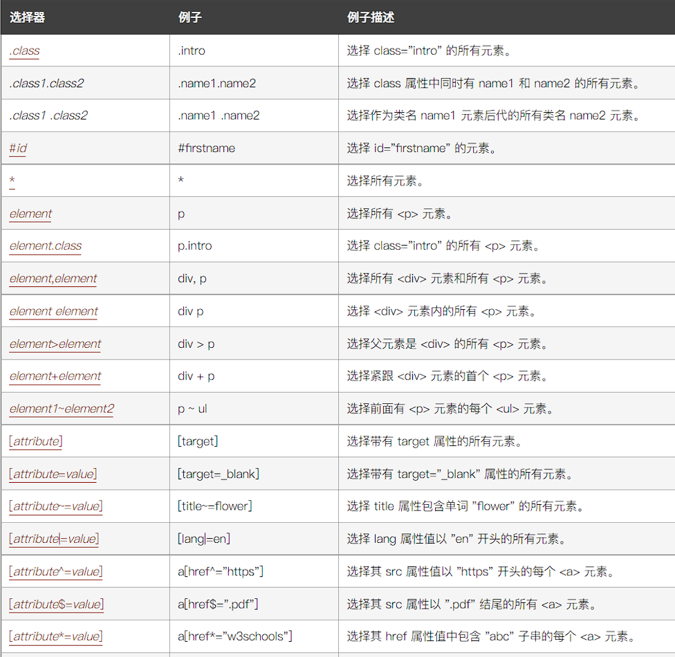
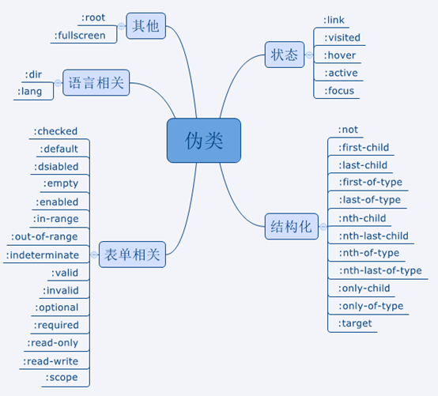
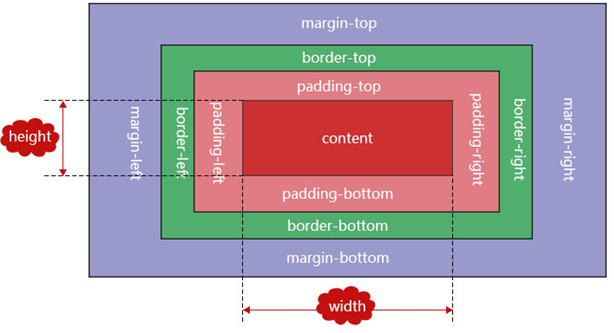
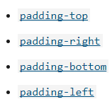

# CSS

- Cascading Style Sheets 层叠样式表
- 定义如何显示HTML(XML)元素

## CSS简介


1. 外部样式表
   CSS编写在扩展名为.css 的单独文件中，并从HTML`<link>`元素引用它
2. 内部样式表
   将CSS放在HTML文件`<head>`标签里的`<style>`标签之中
3. 内联样式
   存在于HTML元素的style属性之中。其特点是每个CSS表只影响一个元素

## 选择器




### 基础选择器

#### 属性选择器

##### 语法

- [attr]
  - 表示带有以 attr 命名的属性的元素。
- [attr=value]
  - 表示带有以 attr 命名的属性，且属性值为 value 的元素。
- [attr~=value]
  - 表示带有以 attr 命名的属性的元素，并且该属性是一个以空格作为分隔的值列表，其中至少有一个值为 value。

- [attr|=value]
  - 表示带有以 attr 命名的属性的元素，属性值为“value”或是以“value-”为前缀（- 为连字符，Unicode 编码为 U+002D）开头。典型的应用场景是用来匹配语言简写代码（如 zh-CN、zh-TW 可以用 zh 作为 value）。
- [attr^=value]
  - 表示带有以 attr 命名的属性，且属性值是以 value 开头的元素。
- [attr$=value]
  - 表示带有以 attr 命名的属性，且属性值是以 value 结尾的元素。
- [attr*=value]
  - 表示带有以 attr 命名的属性，且属性值至少包含一个 value 值的元素。
- [attr operator value i]
  - 在属性选择器的右方括号前添加一个用空格隔开的字母 i（或 I），可以在匹配属性值时忽略大小写（支持 ASCII 字符范围之内的字母）。
- [attr operator value s] 实验性
  - 在属性选择器的右方括号前添加一个用空格隔开的字母 s（或 S），可以在匹配属性值时区分大小写（支持 ASCII 字符范围之内的字母）。


#### class 选择器

##### 语法

```
.类名 { 样式声明 }
```


注意它与下面的属性选择器语句等价：

```
[class~=类名] { 样式声明 }
```

class 选择器用于描述一组元素的样式，class 选择器有别于id选择器，class可以在多个元素中使用。

class 选择器在 HTML 中以 class 属性表示, 在 CSS 中，类选择器以一个点 **.** 号显示：

:hand: 栗子：

```css
/* 所有含有 class="spacious" 类的元素 */
.spacious {
  margin: 2em;
}

/* 所有含有 class="spacious" 类的 <li> 元素 */
li.spacious {
  margin: 2em;
}

/* 所有同时含有“spacious”和“elegant”类的 <li> 元素 */
/* 例如 class="elegant retro spacious" */
li.spacious.elegant {
  margin: 2em;
}
```


#### id 选择器

id 选择器可以为标有特定 id 的 HTML 元素指定特定的样式。

HTML元素以id属性来设置id选择器，CSS 中 id 选择器以 "#" 来定义。

```
#id 属性值 { 样式声明 }
```


#### 标签选择器

```
元素 { 样式声明 }
span {
  background-color: skyblue;
}
```


#### 通配选择器*

选择所有的元素


### 关系选择器

#### 邻近兄弟选择器

介于两个选择器之间，当第二个元素紧跟在第一个元素之后，并且两个元素都是属于同一个父元素的子元素，则第二个元素将被选中

语法：

```css
former_element + target_element { style properties } 
```


#### 兄弟元素选择器

兄弟选择符，位置无须紧邻，只须同层级，选择与第一个元素同层级的所有第二个元素

语法：

```css
former_element ~ target_element { style properties }
```


#### 直接子元素选择器

只匹配那些被第二个选择器匹配的元素，这些元素是被第一个选择器匹配的元素的直接子元素。

语法：

```css
former_element > target_element { style properties }
```


#### 后代元素选择器

**后代组合器**（通常用单个空格（" "）字符表示）组合了两个选择器，如果第二个选择器匹配的元素具有与第一个选择器匹配的祖先（父母，父母的父母，父母的父母的父母等）元素，则它们将被选择。利用后代组合器的选择器称为*后代选择器*。

```css
selector1 selector2 {
  /* property declarations */
}
```


#### 组选择器

并集选择器、并集组合器

当多个选择器共享相同的声明时，它们可以被编组进一个以逗号分隔的列表。选择器列表也可以作为参数传递给一些函数式 CSS 伪类。逗号之前和/或之后可以有空白（字符）。

- 语法
  - `element, element, element{ style properties }`

以下三个声明是等效的：

```css
span {
  border: red 2px solid;
}
div {
  border: red 2px solid;
}
```

```css
span,
div {
  border: red 2px solid;
}
```

```css
:is(span, div) {
  border: red 2px solid;
}
```


##### 有效和无效的组选择器

如果组选择器中有一个选择器是无效的，则整个组选择器都会无效，除了接受可容错选择器列表的函数式伪类。

解决无效的选择器列表问题的一种方法是使用 :is() 或 :where() 伪类，它们接受一个可容错选择器列表。可容错选择器列表中的每个选择器都被单独解析。因此列表中任何无效的选择器会被忽略，而有效的选择器则会被有效使用。


### 伪类和伪元素

定义：

1. 为了格式化`文档树（DOM）`以外的信息
2. 伪类和伪元素是用来修饰**不在**文档树中的部分


伪类：

- 当已有元素处于某个**状态时**，为其添加对应的样式，这个状态时根据用户行为而动态变化的

伪元素

- 不在文档树中的元素，为其添加样式

基本语法：
`Selector : pseudo-class{ property: value; }`

`Selector :: pseudo-elements{ property: value; }`




### 伪类

添加到选择器的关键字，用于指定所选元素的特殊状态。例如，伪类 `:hover`可以用于选择一个按钮，当用户的指针悬停在按钮上时，设置此按钮的样式。

伪类由冒号（`:`）后跟着伪类名称组成（例如，`:hover`）。函数式伪类还包含一对括号来定义参数（例如，`:dir()`）。附上了伪类的元素被定义为*锚元素*（例如，`button:hover` 中的 `button`）。

#### `:active`

匹配被用户激活的元素。它让页面能在浏览器监测到激活时给出反馈。当用鼠标交互时，它代表的是用户按下按键和松开按键之间的时间。

```css
/* Selects any <a> that is being activated */
a:active {
  color: red;
}
```

为保证样式生效，需要把 `:active` 的样式放在所有链接相关的样式之后。这种链接伪类先后顺序被称为 *LVHA 顺序*：`:link` — `:visited` — `:hover` — `:active`。

#### `:any-link`

匹配每个具有href属性的元素

#### `:checked`

表示任何处于选中状态的**radio**(`<input type="radio">`), **checkbox** (`<input type="checkbox">`) 或 ("select") 元素中的**option** HTML 元素 ("option")。

用户通过勾选/选中元素或取消勾选/取消选中，来改变该元素的 :checked 状态。

#### `:empty`

选择不包含任何子元素的元素。子元素可以是元素节点或文本（包括空格）。但是注释、处理指令和 CSS content 不会影响元素是否被认定为空。

#### `:enabled`

表示可以被激活的元素

#### `:first-child`


## CSS特性

层叠样式表

1. 层叠
   - 多个CSS规则应用于同一个元素
   - 样式冲突，**就近原则**
   - 样式不冲突，样式层叠加
2. 优先级
   - !Important>行内样式>ID 选择器>类选择器>标签>通配符>继承>浏览器默认属性
3. 继承
   - css属性继承当前元素的父辈元素上设置的值


## 盒模型

- 在 CSS 中，所有的元素都被一个个的“盒子（box）”包围着
- 块级盒子（Block box） 和 内联盒子（Inline box）
- 块级（block）盒子行为:
  - 盒子会在内联的方向上扩展并占据父容器在该方向上的所有可用空间，在绝大数情况下意味着盒子会和父容器一样宽
  - 每个盒子都会换行
  - width 和 height 属性可以发挥作用
  - 内边距（padding）, 外边距（margin） 和 边框（border） 会将其他元素从当前盒子周围“推开”
- 内联盒子（Inline box）行为
  - 盒子不会产生换行
  - width 和 height 属性将不起作用。
  - 垂直方向的内边距、外边距以及边框会被应用但是不会把其他处于 inline 状态的盒子推开。
  - 水平方向的内边距、外边距以及边框会被应用且会把其他处于 inline 状态的盒子推开。
- 通过对盒子display 属性的设置，比如 inline 或者 block ，来控制盒子的外部显示类型


盒的每个部分：

- Content box: 这个区域是用来显示内容，大小可以通过设置 width 和 height.
- Padding box: 包围在内容区域外部的空白区域； 大小通过 padding 相关属性设置。
- Border box: 边框盒包裹内容和内边距。大小通过 border 相关属性设置。
- Margin box: 这是最外面的区域，是盒子和其他元素之间的空白区域。大小通过 margin 相关属性设置。




### 外边距

可以设置为负值，但是会和别的元素重叠

有两个外边距相接的元素，这些外边距将合并为一个外边距

即最大的单个外边距的大小

```html
.box{
	margin-top: 40px;
	margin-right: 40px;
	margin-left: 40px;
	margin-bottom: 40px;
}
```

### 边框

- 边距和填充框之间绘制的
- 为边框设置样式时，有大量的属性可以使用
  - 有四个边框，每个边框都有样式、宽度和颜色，我们可能需要对它们进行操作

<center> <figure>   </figure></center>

### 内边距

- 内边距位于边框和内容区域之间
- 不能有负数量的内边距，所以值必须是0或正的值



### 溢出

- overflow属性
  - overflow: hidden
  - overflow: scroll
  - overflow-y: scroll

## 背景与边框

`background-color`设置颜色

`background-image`属性设置背景图

- body {background-image:url('paper.gif');}

`background-repeat`属性用于控制图像的平铺行为。可用的值是

- no-repeat — 不重复。
- repeat-x —水平重复。
- repeat-y —垂直重复。
- repeat — 在两个方向重复。

`background-position`属性：设置背景图的位置


## 文本

color：设置颜色

### 对齐

文本排列属性是用来设置文本的水平对齐方式。

文本可居中或对齐到左或右,两端对齐.

当text-align设置为"justify"，每一行被展开为宽度相等，左，右外边距是对齐（如杂志和报纸）。

```css
h1 {text-align:center;}
p.date {text-align:right;}
p.main {text-align:justify;}
p.uppercase {text-transform:uppercase;} /*转换*/
p.lowercase {text-transform:lowercase;}
p.capitalize {text-transform:capitalize;} 
p {text-indent:50px;} /* 缩进 */
```

### 字体

`font-family`设置字体先后顺序

## CSS布局

### 正常布局流

- 取得元素的内容来放在一个独立的元素盒子中，然后在其周边加上内边距、边框和外边距 
- 默认的，一个块级元素的宽度是其父元素的100%，其高度与其内容高度一致。
- 内联元素的height，width与内容一致（无法设置内联元素的height width）
- 默认的，内部的块级元素会在垂直方向，从顶部开始一个接一个地放置，每个块级元素会在上一个元素下面另起一行
- 独立容器，容器里面的子元素不会影响到外面的元素
- 内联元素：只要在其父级块级元素的宽度内有足够的空间，它们与其他内联元素、相邻的文本内容（或者被包裹的）被安排在同一行

### 浮动

- 使元素脱离文档流`脱标`，按照指定方向发生移动，遇到父级边界或者相邻的浮动元素停了下来，提升层级**半层**
- float：left， right，none，inherit
- 浮动盒子不再保留原来的空间
- 浮动盒子按一行显示，且上边沿对齐，具备行内块特性
- 浮动盒子只会影响当前元素之后的标准流，不会影响之前的标准流

#### 标准文档流

文档流指的是元素排版布局过程中，元素会**默认**自动从左往右，从上往下的流式排列方式。

即不对页面进行任何布局控制时，浏览器默认的HTML布局方式，这种布局方式从左往右，从上往下，有点像流水的效果，我们称为`流式布局`。

#### 脱标

```html
<!DOCTYPE html>
<html lang="en">
<head>
	<meta charset="UTF-8">
	<title>脱标</title>
	<style type="text/css">
		.box1{
			width: 200px;
			height: 200px;
			background-color: red;
			float: left;
			color: #fff;
		}
		.box2{
			width: 400px;
			height: 400px;
			background-color: green;
			color: #fff;
		}
	</style>
</head>
<body>
	<div class="box1">左青龙</div>
	<div class="box2">右白虎</div>
</body>
</html>
```


在标准文档流下，`左青龙`和`右白虎`两个盒子是上下排版，如果对`左青龙`设置了浮动，那么盒子会脱离了标准文档流，它就不会按照默认的流式排版布局，可以认为这个`左青龙`盒子浮起来了，不受标准文档流排版布局的约束。那么此时浏览器认为`右白虎`盒子是标准文档流下的第一个盒子。所以`右白虎`就渲染到了页面中的第一个位置上。

#### 浮动的破坏性

浮动前后效果对比：


由此可见，浮动之后，蓝色的盒子因为脱离了标准文档流，它撑不起父盒子的高度，导致父盒子`高度塌陷`。如果网页中出现了这种问题，会导致我们整个网页的布局紊乱。我们一定要去**解决这种父盒子高度塌陷**的问题。


#### 清除浮动的方式

- 父盒子设置固定高度

  - 固定盒子高度区域，但是不灵活

- 内墙法

  - 在浮动元素的后面加一个空的块级元素(通常是div),并且该元素设置`clear:both；`属性。
  - 结构冗余，一般不用，只是为了引出下一个方法

- 伪元素清除法

  ```css
  .clearfix:after{
      content:'.';
      display: block;
      clear: both;
      overflow: hidden;
      height: 0;
  }
  ```

  - `content:'.';`表示给`.clearfix`元素内部最后添加一个内容，该内容为行内元素。
  - `display:block;`设置该元素为块级元素，符合内墙法的需求。
  - `clear:both；`清除浮动的方法。必须要写
  - `overflow:hidden;height:0;`如果用`display:none;`,那么就不能满足该元素是块级元素了。`overflow:hidden;`表示隐藏元素，与`display:none;`不同的是，前者隐藏元素，该元素占位置，而后者不占位置。

- overflow:hidden

| 属性值  | 描述                                             |
| ------- | ------------------------------------------------ |
| visible | 默认值。内容不会被修剪，会呈现在元素框之外       |
| hidden  | 内容会被修剪，并且其余内容不可见                 |
| scroll  | 内容会被修剪，浏览器会显示滚动条以便查看其余内容 |
| auto    | 由浏览器定夺，如果内容被修剪，就会显示滚动条     |
| inherit | 规定从父元素继承overflow属性的值                 |

#### Clear属性

指定不允许元素周围有浮动元素，可选：left right both none inherit


### 定位

- 静态定位(static)
  - 将元素放入它在文档布局流中的正常位置
- 相对定位(relative)
  - 在正常的文档流中
  - 如果没有定位偏移量，对元素本身没有任何影响
  - 它原本所占的空间仍保留
  - top, bottom, left, 和 right 来精确指定要将定位元素移动到的位置
- 绝对定位(absolute)
  - 完全脱离文档流
  - 如果有定位父级相对于定位父级发生偏移，没有定位父级相对于整个文档发生偏移
- 固定定位（fixed）
  - 绝对定位相对于其最近的定位祖先或者<html>
  - 固定定位相对于浏览器视口本身

- 粘性定位（sticky）
- z-index
  - 元素位于Z轴上的位置
  - 数值越大，越在前面
  - 默认：auto（0）


### flex

什么是弹性盒子？
display:flex 是一种布局方式。它即可以应用于容器中，也可以应用于行内元素。

容器默认存在两根轴：水平的主轴（main axis）和垂直的交叉轴（cross axis）。
采用Flex布局的元素，称为Flex容器（flex container），简称”容器”。它的所有子元素自动成为容器成员，称为Flex项目（flex item）。
注：设为Flex布局以后，子元素的float、clear和vertical-align属性将失效。


