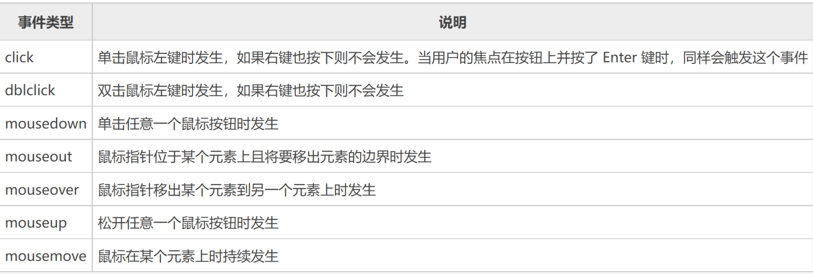

# JavaScript

## 基础

浏览器分为两个引擎：渲染引擎和JS引擎：

⚫ 渲染引擎：解析HTML和CSS，例如Chrome的Webkit和blink

⚫ JS引擎：JS解释器，用于读取和执行网页中Javascript代码，例如Chrome的V8


### 变量

◼ JS当中，函数分为声明式函数和赋值式函数，声明式函数与赋值式函数的区别在于：
在JS的预编译期，声明式函数将会先被提取出来，然后才按顺序执行js代码。

◼ JS的解析过程分为两个阶段编译期与执行期


`strict`模式

- 不强制要求用var申明变量，一个变量没有申明就被使用，自动申明为全局变量
- strict模式下运行JS代码，强制通过var申明变量

·


### 使用

- 使用 `window.alert()` 写入警告框
- 使用 `document.write()` 写入 HTML 输出
- 使用 `innerHTML` 写入 HTML 元素
- 使用 `console.log()` 写入浏览器控制台
- 使用`prompt()`输入


模板字符串：`${name}`


### 变量类型

强制转换

```javascript
Number("string")
parseFloat("100px") //常用于过滤单位
parseInt() //保留整数
```


### 使用 innerHTML

如需访问 HTML 元素，JavaScript 可使用 `document.getElementById(id)` 方法。


### 对象

在JavaScript中，对象是一组无序的相关属性和方法的集合，所有的事物都是对象，例如字符 串、数值、数组、函数等。

对象是由**属性**和**方法**组成的：

- 属性：反映事物的特征
- 方法：反映事物的行为


## 面向对象编程

不区分类和实例的概念，通过原型（prototype）来实现面向对象编程


所谓继承关系不过是把一个对象的原型指向另一个对象而已


## DOM和浏览器对象

### DOM元素查找

- 根据ID查找：`document.getElementById(id)`
  - Id名称大小写敏感
  - 返回值：拥有指定 ID 的第一个元素

- 根据**标签名**查找元素： `document.getElementsByTagName(name)`
  - name可以不区分大小写
- 根据name属性查找元素： `document.getElementsByName(name)`
- 根据**类名**查找元素： `document. getElementsByClassName(className)`
- 根据**选择器**查找元素： `document.querySelector(selName)`
- 根据**选择器**查找所有元素： `document.querySelectorAll(selName)`


### DOM元素操作

修改元素样式：element.style，element.className

> CSS允许font-size这样的名称，但它并非JavaScript有效的属性名，所以需要在 JavaScript中改写为驼峰式命名fontSize

**自定义属性：**

element.getAttribute("attr")/setAttribute("attr’,’value")/removeAttribute("attr")


### DOM元素节点操作

- 所有内容都有可以表示为节点node
- DOM树中所有节点均可通过JavaScript进行访问
- 所有节点均可被创建删除和修改


父节点：`node.parentNode`

返回节点最近一个父节点，没有就返回null


子节点：`node.childNodes`

返回包含指定节点的子节点的集合，该集合为即时更新的集合


子节点：`parentNode.children`

与childNodes不同，只返回子元素节点，其余节点不返


◼ parentNode.firstChild：返回第一个子节点
◼ parentNode.lastChild：返回最后一个子节点
◼ parentNode.firstElementChild：返回第一个子元素节点
◼ parentNode.lastElementChild：返回最后一个子元素节点


◼ 创建元素： document.createElement('tag') //创建由 tag 指定的 HTML 元素

◼ 添加节点： node.appendChild(childNode) //添加到子节点列表末尾 node.insertBefore(newNode, referenceNode) //添加元素到参考子节点之前 

◼ 删除节点 node.removeChild(childNode) //删除指定子节点


### 事件基础

三要素：事件源、事件类型、处理程序



获取事件源、注册事件、添加事件处理程序

主要区别：<font color=red>注册事件的唯一性</font>

 