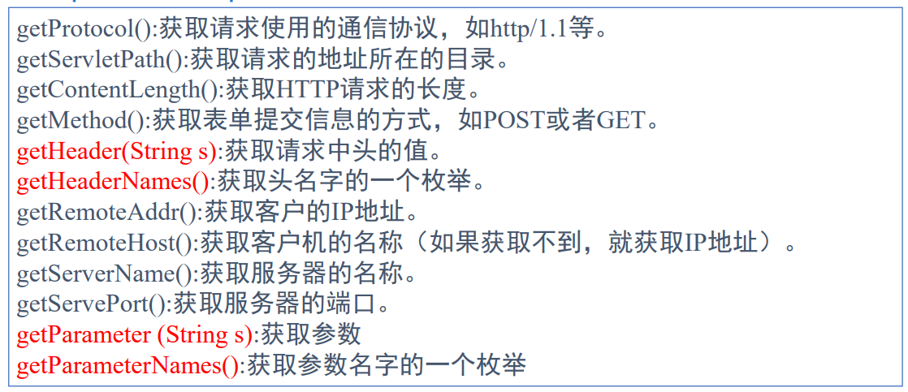

# Servlet

客户端和服务器的数据库或应用程序中的中间层


## Servlet 生命周期

Servlet 生命周期可被定义为从创建直到毁灭的整个过程。以下是 Servlet 遵循的过程：

- Servlet 初始化后调用 **init ()** 方法。
- Servlet 调用 **service()** 方法来处理客户端的请求。
- Servlet 销毁前调用 **destroy()** 方法。
- 最后，Servlet 是由 JVM 的垃圾回收器进行垃圾回收的。


### init()

在第一次创建Servlet时被调用，Servlet创建于用户第一次调用对应该Servlet的URL时候，也可以指定在服务器第一次启动时被调用


### service() 

service() 方法是执行实际任务的主要方法。Servlet 容器（即 Web 服务器）调用 service() 方法来处理来自客户端（浏览器）的请求，并把格式化的响应写回给客户端。

service() 方法由容器调用，service 方法在适当的时候调用 `doGet`、`doPost`、`doPut`、`doDelete` 等方法。所以，您不用对 service() 方法做任何动作，您只需要根据来自客户端的请求类型来重写 `doGet()` 或 `doPost()` 即可。

`doGet()` 和 `doPost()` 方法是每次服务请求中最常用的方法。下面是这两种方法的特征。


Servlet 是服务 HTTP 请求并实现 `javax.servlet.Servlet` 接口的 Java 类。Web 应用程序开发人员通常编写 Servlet 来扩展`javax.servlet.http.HttpServlet`，并实现 Servlet 接口的抽象类专门用来处理 HTTP 请求。


## Servlet 实例

### Servlet 部署

默认情况下，Servlet 应用程序位于路径 `<Tomcat-installation-directory>/webapps/ROOT` 下，且类文件放在 `<Tomcat-installation-directory>/webapps/ROOT/WEB-INF/classes` 中。

如果您有一个完全合格的类名称 **com.myorg.MyServlet**，那么这个 Servlet 类必须位于 WEB-INF/classes/com/myorg/MyServlet.class 中。

现在，让我们把 HelloWorld.class 复制到 `<Tomcat-installation-directory>/webapps/ROOT/WEB-INF/classes` 中，并在位于 `<Tomcat-installation-directory>/webapps/ROOT/WEB-INF/` 的 **web.xml** 文件中创建以下条目：

```xml
<web-app>      
    <servlet>
        <servlet-name>HelloWorld</servlet-name>
        <servlet-class>HelloWorld</servlet-class>
    </servlet>

    <servlet-mapping>
        <servlet-name>HelloWorld</servlet-name>
        <url-pattern>/HelloWorld</url-pattern>
    </servlet-mapping>
</web-app>  

```


## Servlet 表单数据

### GET 方法

向页面请求发送已编码的用户信息。页面和已编码的信息中间用 ? 字符分隔：

```
http://www.test.com/hello?key1=value1&key2=value2
```

会产生一个很长的字符串，请不要使用get方法传输密码


### POST 方法

把这些信息作为一个单独的消息。消息以标准输出的形式传到后台程序，您可以解析和使用这些标准输出。Servlet 使用 `doPost()` 方法处理这种类型的请求。


### 使用 Servlet 读取表单数据

Servlet 处理表单数据，这些数据会根据不同的情况使用不同的方法自动解析：

- `getParameter()`：您可以调用 `request.getParameter()` 方法来获取表单参数的值。
- `getParameterValues()`：如果参数出现一次以上，则调用该方法，并返回多个值，例如复选框。
- `getParameterNames()`：如果您想要得到当前请求中的所有参数的完整列表，则调用该方法。


### Servlet处理请求/响应

`HttpServlet` 在 Web 服务器调用 service() 方法之前，都会创建 `HttpServletRequest` 和 `HttpServletResponse` 对象，用于封装HTTP 请求消息和响应消息

`HttpServletRequest` 类方法：




### 网页重定向与转发

转发：

```java
request.getRequestDispatcher(url).forward(request, response);
```


◼转发和重定向区别 

​	◼转发：容器将使用一个内部的方法来调用目标地址，新的地址继 续处理同一个请求，而浏览器将不会知道这个过程。所以它的URL 会保持不变，它会保留原来的request和response。 

​	◼重定向：第一个地址通知浏览器发送一个新的地址请求。因此， 当你使用重定向时，浏览器中所显示的URL会变成新页面的URL, 除了能在url上挂参数外,由于是两次独立请求，request和response 也是独立的。

重定向请求到另一个网页的最简单的方式是使用 response 对象的 sendRedirect() 方法。下面是该方法的定义：

```java
public void HttpServletResponse.sendRedirect(String location)
throws IOException 
```


## Servlet 过滤器

动态拦截请求，以变换或使用包含在请求或响应中的信息

可以将一个或多个 Servlet 过滤器附加到一个 Servlet 或一组 Servlet。Servlet 过滤器也可以附加到 JavaServer Pages (JSP) 文件和 HTML 页面。调用 Servlet 前调用所有附加的 Servlet 过滤器。


目的：

- 在客户端的请求访问后端资源之前，拦截这些请求。
- 在服务器的响应发送回客户端之前，处理这些响应。


### 过滤器方法

过滤器是一个实现了 javax.servlet.Filter 接口的 Java 类

| 序号 | 方法 & 描述                                                  |
| :--- | :----------------------------------------------------------- |
| 1    | **`public void doFilter (ServletRequest, ServletResponse, FilterChain)`** 该方法完成实际的过滤操作，当客户端请求方法与过滤器设置匹配的URL时，Servlet容器将先调用过滤器的doFilter方法。FilterChain用户访问后续过滤器。 |
| 2    | **`public void init(FilterConfig filterConfig)`** web 应用程序启动时，web 服务器将创建Filter 的实例对象，并调用其init方法，读取web.xml配置，完成对象的初始化功能，从而为后续的用户请求作好拦截的准备工作（filter对象只会创建一次，init方法也只会执行一次）。开发人员通过init方法的参数，可获得代表当前filter配置信息的FilterConfig对象。 |
| 3    | **`public void destroy()`** Servlet容器在销毁过滤器实例前调用该方法，在该方法中释放Servlet过滤器占用的资源。 |

#### FilterConfig 使用

Filter 的 init 方法中提供了一个 FilterConfig 对象。

如 web.xml 文件配置如下：

```xml
<filter>
    <filter-name>LogFilter</filter-name>
    <filter-class>com.runoob.test.LogFilter</filter-class>
    <init-param>
        <param-name>Site</param-name>
        <param-value>菜鸟教程</param-value>
    </init-param>
</filter>

```

在 init 方法使用 FilterConfig 对象获取参数：

```java
public void  init(FilterConfig config) throws ServletException {
    // 获取初始化参数
    String site = config.getInitParameter("Site"); 
    // 输出初始化参数
    System.out.println("网站名称: " + site); 
}
```


### 实例

过滤器类代码：

```java
package com.runoob.test;

//导入必需的 java 库
import javax.servlet.*;
import java.util.*;

//实现 Filter 类
public class LogFilter implements Filter  {
    public void  init(FilterConfig config) throws ServletException {
        // 获取初始化参数
        String site = config.getInitParameter("Site"); 

        // 输出初始化参数
        System.out.println("网站名称: " + site); 
    }
    public void  doFilter(ServletRequest request, ServletResponse response, FilterChain chain) throws java.io.IOException, ServletException {

        // 输出站点名称
        System.out.println("站点网址：http://www.runoob.com");

        // 把请求传回过滤链
        chain.doFilter(request,response);
    }
    public void destroy( ){
        /* 在 Filter 实例被 Web 容器从服务移除之前调用 */
    }
}
```

web.xml: 

```xml
<?xml version="1.0" encoding="UTF-8"?>  
<web-app>  
<filter>
  <filter-name>LogFilter</filter-name>
  <filter-class>com.runoob.test.LogFilter</filter-class>
  <init-param>
    <param-name>Site</param-name>
    <param-value>菜鸟教程</param-value>
  </init-param>
</filter>
<filter-mapping>
  <filter-name>LogFilter</filter-name>
  <url-pattern>/*</url-pattern>
</filter-mapping>
<servlet>  
  <!-- 类名 -->  
  <servlet-name>DisplayHeader</servlet-name>  
  <!-- 所在的包 -->  
  <servlet-class>com.runoob.test.DisplayHeader</servlet-class>  
</servlet>  
<servlet-mapping>  
  <servlet-name>DisplayHeader</servlet-name>  
  <!-- 访问的网址 -->  
  <url-pattern>/TomcatTest/DisplayHeader</url-pattern>  
</servlet-mapping>  
</web-app>  
```

上述过滤器适用于所有的 Servlet，因为我们在配置中指定 **/\*** 。如果您只想在少数的 Servlet 上应用过滤器，可以指定一个特定的 Servlet 路径。


### 过滤器的应用顺序

web.xml 中的 filter-mapping 元素的顺序决定了 Web 容器应用过滤器到 Servlet 的顺序。若要反转过滤器的顺序，您只需要在 web.xml 文件中反转 filter-mapping 元素即可。

如果要使用多个过滤器，只需要依次定义过滤器和映射


## Cookie 处理

Cookie 保存了各种用户信息，识别返回用户包含三个步骤：

- 服务器脚本向浏览器发送一组 Cookie。例如：姓名、年龄或识别号码等。
- 浏览器将这些信息存储在本地计算机上，以备将来使用。
- 当下一次浏览器向 Web 服务器发送任何请求时，浏览器会把这些 Cookie 信息发送到服务器，服务器将使用这些信息来识别用户。

### Servlet Cookie 方法

以下是在 Servlet 中操作 Cookie 时可使用的有用的方法列表。

| 序号 | 方法 & 描述                                                  |
| :--- | :----------------------------------------------------------- |
| 1    | **public void setDomain(String pattern)** 该方法设置 cookie 适用的域，例如 runoob.com。 |
| 2    | **public String getDomain()** 该方法获取 cookie 适用的域，例如 runoob.com。 |
| 3    | **public void setMaxAge(int expiry)** 该方法设置 cookie 过期的时间（以秒为单位）。如果不这样设置，cookie 只会在当前 session 会话中持续有效。 |
| 4    | **public int getMaxAge()** 该方法返回 cookie 的最大生存周期（以秒为单位），默认情况下，-1 表示 cookie 将持续下去，直到浏览器关闭。 |
| 5    | **public String getName()** 该方法返回 cookie 的名称。名称在创建后不能改变。 |
| 6    | **public void setValue(String newValue)** 该方法设置与 cookie 关联的值。 |
| 7    | **public String getValue()** 该方法获取与 cookie 关联的值。  |
| 8    | **public void setPath(String uri)** 该方法设置 cookie 适用的路径。如果您不指定路径，与当前页面相同目录下的（包括子目录下的）所有 URL 都会返回 cookie。 |
| 9    | **public String getPath()** 该方法获取 cookie 适用的路径。   |
| 10   | **public void setSecure(boolean flag)** 该方法设置布尔值，表示 cookie 是否应该只在加密的（即 SSL）连接上发送。 |
| 11   | **public void setComment(String purpose)** 设置cookie的注释。该注释在浏览器向用户呈现 cookie 时非常有用。 |
| 12   | **public String getComment()** 获取 cookie 的注释，如果 cookie 没有注释则返回 null。 |


### 通过 Servlet 设置 Cookie

通过 Servlet 设置 Cookie 包括三个步骤：

**(1) 创建一个 Cookie 对象：**您可以调用带有 cookie 名称和 cookie 值的 Cookie 构造函数，cookie 名称和 cookie 值都是字符串。

```
Cookie cookie = new Cookie("key","value");
```

**(2) 设置最大生存周期：**您可以使用 setMaxAge 方法来指定 cookie 能够保持有效的时间（以秒为单位）。下面将设置一个最长有效期为 24 小时的 cookie。

```
cookie.setMaxAge(60*60*24); 
```

**(3) 发送 Cookie 到 HTTP 响应头：**您可以使用 **response.addCookie** 来添加 HTTP 响应头中的 Cookie，如下所示：

```
response.addCookie(cookie);
```


### 通过 Servlet 读取 Cookie

要读取 Cookie，您需要通过调用 `HttpServletRequest` 的 **getCookies( )** 方法创建一个 `javax.servlet.http.Cookie` 对象的数组。然后循环遍历数组，并使用 getName() 和 getValue() 方法来访问每个 cookie 和关联的值。


### 通过 Servlet 删除 Cookie

删除 Cookie 是非常简单的。如果您想删除一个 cookie，那么您只需要按照以下三个步骤进行：

- 读取一个现有的 cookie，并把它存储在 Cookie 对象中。
- 使用 **setMaxAge()** 方法设置 cookie 的年龄为零，来删除现有的 cookie。
- 把这个 cookie 添加到响应头。


## Session 跟踪

### HttpSession 对象

Servlet 容器使用这个接口来创建一个 HTTP 客户端和 HTTP 服务器之间的 session 会话。会话持续一个指定的时间段，跨多个连接或页面请求。

您会通过调用 HttpServletRequest 的公共方法 **getSession()** 来获取 HttpSession 对象，如下所示：

```java
HttpSession session = request.getSession();
```

| 序号 | 方法 & 描述                                                  |
| :--- | :----------------------------------------------------------- |
| 1    | **public Object getAttribute(String name)** 该方法返回在该 session 会话中具有指定名称的对象，如果没有指定名称的对象，则返回 null。 |
| 2    | **public Enumeration getAttributeNames()** 该方法返回 String 对象的枚举，String 对象包含所有绑定到该 session 会话的对象的名称。 |
| 3    | **public long getCreationTime()** 该方法返回该 session 会话被创建的时间，自格林尼治标准时间 1970 年 1 月 1 日午夜算起，以毫秒为单位。 |
| 4    | **public String getId()** 该方法返回一个包含分配给该 session 会话的唯一标识符的字符串。 |
| 5    | **public long getLastAccessedTime()** 该方法返回客户端最后一次发送与该 session 会话相关的请求的时间自格林尼治标准时间 1970 年 1 月 1 日午夜算起，以毫秒为单位。 |
| 6    | **public int getMaxInactiveInterval()** 该方法返回 Servlet 容器在客户端访问时保持 session 会话打开的最大时间间隔，以秒为单位。 |
| 7    | **public void invalidate()** 该方法指示该 session 会话无效，并解除绑定到它上面的任何对象。 |
| 8    | **public boolean isNew()** 如果客户端还不知道该 session 会话，或者如果客户选择不参入该 session 会话，则该方法返回 true。 |
| 9    | **public void removeAttribute(String name)** 该方法将从该 session 会话移除指定名称的对象。 |
| 10   | **public void setAttribute(String name, Object value)** 该方法使用指定的名称绑定一个对象到该 session 会话。 |
| 11   | **public void setMaxInactiveInterval(int interval)** 该方法在 Servlet 容器指示该 session 会话无效之前，指定客户端请求之间的时间，以秒为单位。 |


### 删除 Session 会话数据

当您完成了一个用户的 session 会话数据，您有以下几种选择：

- **移除一个特定的属性：**您可以调用 *public void removeAttribute(String name)* 方法来删除与特定的键相关联的值。
- **删除整个 session 会话：**您可以调用 *public void invalidate()* 方法来丢弃整个 session 会话。
- **设置 session 会话过期时间：**您可以调用 *public void setMaxInactiveInterval(int interval)* 方法来单独设置 session 会话超时。
- **注销用户：**如果使用的是支持 servlet 2.4 的服务器，您可以调用 **logout** 来注销 Web 服务器的客户端，并把属于所有用户的所有 session 会话设置为无效。
- **web.xml 配置：**如果您使用的是 Tomcat，除了上述方法，您还可以在 web.xml 文件中配置 session 会话超时，如下所示：

```
  <session-config>
    <session-timeout>15</session-timeout>
  </session-config>
```

上面实例中的超时时间是以分钟为单位，将覆盖 Tomcat 中默认的 30 分钟超时时间。
