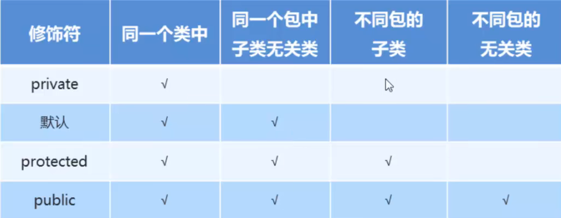
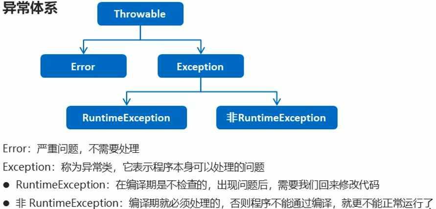
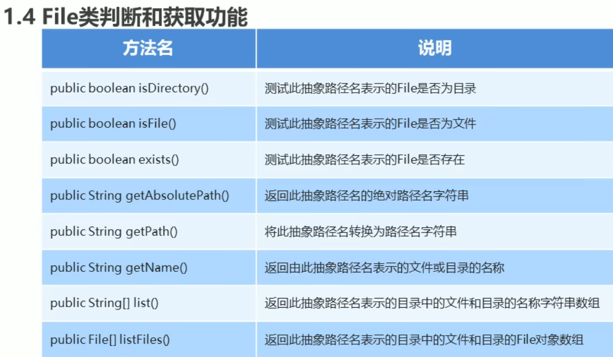

# Java

### 基础

#### JDK JRE JVM

JDK：开发环境，包含JRE和JVM

Java Development Kit

Java Running environment

Java Virtual Machine


`System.out.println(a);`

`System.out.print(a);`没有空行

float和long初始化要加F和L

char,byte,short做加法时会类型提升到int

骆驼命名法：第一个单词大写


#### 输入

```java
//导包
import java.util.Scanner;//在类定义的上面
//或
import java.util.*;
Scanner sc = new Scanner(System.in);//创建对象
int i=sc.nextInt();//接受数据
nextline();
next();//空格为止
nextDouble();//读取浮点数
```

##### 文件的输入

```java
Scanner in = new Scnner(Path.of("myfile.txt"),StandardCharsets.UTF_8);
//写入文件
PrintWriter out = new PrintWriter("myfile.txt",StandardCharsets.UTF_8);

```


#### IDEA操作

**快捷键：**

快速生成main：psvm/main +Enter\

快速生成输出：sout+Enter

注释：Ctrl+/

多行注释：Ctrl+Shift+/

格式化：Ctrl+Alt+L

自动变量：ctrl+alt+v

快速生成方法：alt+fn+insert

快速导包：alt+enter 

快速方法重写：eat+enter

查看方法源码：选中方法，ctrl+B

向前缩进：shift+tab

快捷键用不了可能是冲突了


#### java对内存的管理

分为堆内存和栈内存

基本数据类型会在栈内存中存放，new新建立的类会在栈内存中新建一个地址，然后在堆内存中开辟一片空间，堆内存中还有常量池，用于存放静态变量以及string字符串


#### 方法重载

一个类中定义多个方法的关系

- 多个方法在同一个类

- 多个方法有同一个名称

- 参数类型或数量不同


#### 抽象

一个**没有方法体**的方法定义为**抽象方法**，如果**类**中有抽象方法则必须定义为**抽象类**

修饰符：`abstract`

抽象类的子类要么也是抽象类，要么要重写抽象方法


#### 包

##### 建包

包就是文件夹，用来分别存放类

包的定义格式：

- 格式：**package 包名**
- 范例：**package com.itheima**


带包编译和执行：

- 手动建包：

按照以往格式编译，自己手动建立文件夹

- 自动建包：

cmd中 `javac -d . HelloWorld.java`

`java com.itheima.HelloWorld`


##### 导包

导包的格式

- 格式：**import 包名;**
- 范例：**import cn.itcast.Teacher**


##### 修饰符

 

###### final修饰的特点

- 修饰方法：最终方法，不能被重写
- 修饰类：最终类，不能被继承
- 修饰变量：最终变量，不能被赋值

###### static

静态的意思，可以修饰成员变量，成员方法

- 被类的所有对象共享
- 推荐使用类名调用

**静态的成员方法只能访问静态的成员方法**，静态的内容是属于类的，程序允许的过程中先加载类，先加载的不能用后加载的


#### 接口

**公共规范标准**

**对行为的规范**

##### 接口特点

- 关键字：`Interface`
  - `public interface 接口名{}`

- 类实现接口限定词implements
  - public class implements 接口名{}
- 接口不能实例化
  - 通过实现类对象实例化
- 接口的实现类
  - 要么是抽象类
  - 要么重写所有抽象方法


##### 接口成员特点：

- 成员变量
  - 只能是常量
  - 默认修饰符：`public static final`
- 构造方法
  - 接口没有构造方法
  - 一个类如果没有父类，默认继承是Object类
- 成员方法
  - 只能是抽象方法
  - 默认修饰符：`public abstract`


##### 类和接口的关系

- 类和类关系

  继承关系，多层继承

- 类和接口

  实现关系，可以单实现，也可以多实现，也可以继承一个类的时候同时实现多个接口

- 接口和接口关系

  继承关系，可以单继承，也可以多继承


自己总结一下：所有类基础的功能都在抽象类里面，而单独的功能或者以后添加的功能写在接口里面，因为可以添加多个接口，就可以实现一直添加功能


#### break

```java
label:
{
	...
	if(condition) break label;//exits block
	...
}//跳出label代码区
```


#### 大数

BigInteger和BigDecimal

```java
valueOf(int i）//将普通的数字转换为大数
```


#### 数组

数组拷贝：

```java
int[] copiedLucktNum = Array.copyOf(luckyNum,luckyNum.length);
//可以通过该函数增加数组的大小
int[] copiedLucktNum = Array.copyOf(luckyNum,luckyNum.length*2);
```


### 类和对象

限定：private

局部变量和成员变量同名时候用this


#### java函数的数据传递

值传递的适用数据类型：
1.八大基本数据类型（byte,short,int,long,char,float,double,boolean)
2.String类型

String数据类型在传递时会在堆内存中创建的常量池中，改变时不改变原数据地址指向的字符串


引用传递：

适用范围：
除String以外的数据类型的对象


#### 内部类

##### 成员内部类

###### 特点：

在一个类中创建另一个类

```java
public class Outer{
    private int num = 10;
    public class Inner{
        
    }
}
```

内部类可以直接访问外部类，包括私有成员

外部类想要访问内部类要创建对象


##### 成员内部

按照类的位置分为：

- 在类的成员位置：成员内部类
- 在类的局部位置：局部内部类

成员内部类，外界的创建：

- 格式：外部类名.内部类名 对象名=外部类对象.内部类对象
- 范例：`Outer.Inner oi=new Outer().new Inner();`


##### 匿名内部类

前提：存在一个接口或者一个类，抽象类or具体类

- 格式：

```java
new 类名或者接口名{
	重写方法；
}；
```

- 实例：

```java
new Inner(){
	public void show{
		
	}
}
```

本质上：是一个实现了该接口或继承了该类的内部类，可以赋值给对象


### 常用API

#### Random

```java
import java.util.Random;
Random i = new Random();
int number = r.nextInt(10);//获取数据范围[0,10)
```

#### MATH类

```java
abs(int a);//返回绝对值
ceil(double a);//取正数符号
floor(double a);//取比a大的数
round(float a);//四舍五入
max(int a,int b);
min(int a,int b);
pow(double a,double b);//a的b次幂
random();//返回一个随机数，double类型，在0.0到1.0之间

Math.max//使用方法
```

#### System类

```java
System.exit(0);//结束，非0表示异常终止
System.currentTimeMillis()//返回当前时间（以毫秒为单位），1970年1月1日
```

#### Object类

toString()方法

建议所有子类重写次方法，快捷设置

可以快捷打出类包含的内容

equal()方法

默认比地址，想要比较成员内容需要重写

自动设置重写


 ### 各种类

#### String

比较：s1.equal(s2)返回值是boolen类 

​			equalsIgnoreCase:忽略大小写的比较方式

charAt(i)返回指定索引的char值

length()返回字符串长度

`split("char")`：用char分割字符串，将其分为多个字符串

`String.valueOf(基本类);`把多种类转为字符串

`String.substring(first,end)//not include end`

**不使用==来比较字符串是否相等**


#### StringBuilder类

目的是为了改造String类对于字符串构造时会重复创建String而造成空间的浪费

StringBuilder构造完之后，可以使用toString()转换

可变字符串

append(任意类型)   添加数据

reverse()                   返回相反字符序列，返回值都是自己


#### String和StringBuilder的相互转换

String转换到StringBuilder：

`public StringBuilder(String s1);`

StringBuilder转换到String：

`toString()`返回值是一个String字符串


#### ArrayList类

| 方法名                            | 说明                                               |
| --------------------------------- | -------------------------------------------------- |
| public boolen remove(Object to)   | 删除指定元素，返回是否成功                         |
| public E remove(int index)        | 删除指定索引处元素，返回被删除元素                 |
| public E set(int index,E element) | 修改指定索引处元素，返回被修改元素，add后才可以set |
| public E get(int index)           | 返回指定索引处元素                                 |
| public int size()                 | 返回集合中元素个数                                 |

`ArrayList<int> obj = new ArrayList<int>`

```java
void ensureCapacity(int Capacity);//重新分配大小
void trimToSize()//将列表大小缩小到当前大小
```


#### LinkedList类

底层是链表实现的

用法与ArrayList相似

| 方法名                              | 说明                                |
| ----------------------------------- | ----------------------------------- |
| public void addFirst(E e)           | 在列表开头插入指定元素              |
| public void addLast                 | 在末尾添加元素                      |
| public E getFirst/getLast()         | 返回首个/末尾元素                   |
| public E removeFirst()/removeLast() | 删除并返回列表中第一个/最后一个元素 |


#### Arrays类

`Arrays.toString(int[] a)`：返回数组内容的字符串表示

`Arrays.sort(arr)`：升序排序


#### Integer类

`Interger.valueOf(int i)`：返回一个指定int值的对象

`Interger.valueOf(String s)`：返回一个保存指定值的Interger对象String

方法intValue()

返回int类的数字

方法parseInt(String s)

返回int类数字


#### Date类

构造方法：
`Date()`初始值为当前时间

`Date(long i)`


常用方法：

`public long getTime()`:获取的是日期从基准时间的毫秒值

`public void setTime(long time)`:设置时间，给的毫秒值


#### SimpleDateFormat类

格式化和解析日期

构造方法：

`public SimpleDateFormat()`:构造一个SimpleDateFormat，使用默认模式和日期格式

`public simpleDateFormat(String pattern)`:构造一个simpleDateFormat使用给定模式和日期格式

1.格式化（从Date到String）

`public final String format(Date date) `

2.解析（从String到Date）

`public Date parse(String source)`


#### Calendar类

Calendar提供了一个类方法 getInstance 用于获取Calendar对象

分别获取年月日：

`int year  = c.get(Calendar.YEAR)`

`int month = c.get(Calendar.MONTH) + 1`

常用方法：

`public abstract void add(int field, int amount)`

`public final void set(int year,int month,int day)` 设置日期

ex：

`c.add(Calendar.YEAR,10)`日期增加十年

好像还是有一点点的炒

#### 基本数据类型

自动装箱：

`Interger i = 100;`

**使用前要做是否为NULL的判断**

在家玩好像还可以但是用来打字的话还是有一点炸的我脑壳痛！还回去还回去137289===========

```java
System.exit(0);//退出虚拟机
```

### 面向对象编程的特性

面向对象的三大特征（封装，继承，多态）

封装的意义：控制成员变量的操作，保证数据安全性


#### 继承

- 格式：public class 子类 extend 父类名{}
- 父类也被称为基类、超类
- 子类也被称为派生类


super可以访问父类中的变量

父类中构造方法的访问特点

- 子类会继承父类中的数据，所以子类初始化之前一定要对父类初始化
- 如果使用无参构造可以不用写`super()`
- 但调用有参子类构造的第一语句默认都是：**super()**


`@Override`方法重写的检验工具

- 重写以继承为前提
- 有相同的方法名和参数
- 重写方法使用的访问权限不能小于父类方法
- private和final不能被重写
- static不能重写，但是可以再次被声明


父类中的私有内容子类是不允许继承调用的


只能继承一个类，可以多层继承但是不能多重继承

继承只能是重写方法，而不能改变原有对象

#### 多态

编译看左边，执行看右边

与重写和继承有关


### 抽象

用abstract修饰方法，这样就不用实现，而只需要在子类中实现，方法名前面也要加上abstract


### 接口

实现comparable接口，使用comparaTo函数，这样才可以使用sort函数


### 异常

程序出现了不正常情况





#### 异常处理：

##### try...catch...

- 格式

```
try{
	可能出现的异常代码;
} catch(异常类名 变量名) {
	异常的处理代码;
}
```


##### throw处理

谁用谁处理


##### Throwable的成员方法

`public String getMessage()`:返回此throwable的详细消息字符串

`public String toString()`:返回此可抛出的简短描述

`public void printStackTrace()`:将异常信息输出在控制台，最详细


#### 自定义异常

```java
public class 异常名称 extends Exception{
	无参构造
	带参构造
}
```


#### throw和throws的区别

throws

- 用在方法体后面，跟的是异常类名
- 表示抛出异常，由该方法的调用者来处理
- 表示出现异常的一种可能


throw

- 用在方法体内
- 表示抛出异常，由方法体内的语句处理
- 执行时一定抛出了异常


### 集合体系

#### Collection

boolean add(E e):添加元素

boolean remove(E e):移除元素

void clear:清除所有元素

boolean contain(E e):判断有没有e元素

boolean isEmpty:判断集合是否为空


##### Collection的遍历

Iterator：迭代器，集合的专用遍历方式

- `Iterator<E> iterator()`：返回集合器元素中的迭代器
- `Iterator<student> it = c.iterator();`

```java
Iterator<student> it = c.iterator();
while(it.hasNext()){
	Student s = it.next();
	System.out.println(s.getName()+","+s.getAge());
}//遍历器遍历方式
```


常用方法：
E next():返回迭代中的下一个元素

boolean hasNext():如果迭代有更多元素，则返回true


#### List集合

List集合特点

- 有序
- 允许重复

`List<int> list = new ArrayList<int>();`


##### 并发修改异常

迭代器中默认集合不会再改变，而如果要改变则需要重写刷新迭代器

不然就需要for循环来避免问题


ListIterator<e>：list的专用迭代器


#### 增强for

```java
for(元素数据类型 变量名 ：数组或Collection集合){
}
```

内部原理是Iterator迭代器


#### Set

##### 接口Set集合

- 不包含重复元素
- 没有带索引的方法，不能使用普通for循环遍历


##### 哈希值

JDK根据对象地址或字符串或数字计算出的int数值

 Object类中有一个方法可以获取对象的哈希值

`publilc int hashCode():`返回对象哈希值

同一个对象的返回值相同

默认情况下不同对象的哈希值，重写可以实现


##### HashSet集合

- 底层是哈希表
- 对迭代顺序不做保证
- 没有带索引的方法
- 不包含重复元素

当定义类的时候想要哈希表生效需要去重写hashCode和equals


##### LinkedHashSet集合特点

- 由哈希表和链表实现的Set
- 保证有序和唯一


##### TreeSet

特点：

- 

- 元素有序，按照一定规律排序

​			TreeSet():根据元素自然顺序排序

​			TreeSet(Comparator comparator):根据比较器排序

- 没有带索引的方法，不能使用普通for循环
- 不包含重复元素

所有基础类存储的时候用的是其包装类类型

类要实现Comparable重写CompareTo函数

必须要实现主要和次要


比较器 可以用匿名内部类Comparator()


#### 泛型

##### 泛型类

编译时检测到非法的类型

本质是**参数化模型**

泛型的定义格式：

- <类型>：指定为一种类型的格式
- <类型1,类型2...>：指定多种类型
- 范例：public class Generic<T>{}
  - T为任意标识，常见的有T、K、E、V等泛型标识

可以理解为规范化添加数据的类型


##### 泛型方法

- 范例：public <T> void show(T t){ }


##### 泛型接口

public interface Generic<T>{ }


##### 类型通配符

表示各种泛型list的父类

- <?>
- List<?>:表示元素未知的List，他的元素可以匹配任何的类型
- 仅表示是各种泛型List的父类


类型通配符的上限：

<? extends 类型>

下限：

<? super 类型>


##### 可变参数：

参数个数可变

- 格式：修饰符 返回值类型 方法名{数据类型...结构名}
- 范例：public static int sum(int... a){}
- 有多个参数时，把可变参数放在最后

等于是把元素放到数组里面去了，可以用增强for循环


#### Map

- 概述 ：Interface Map<k,v> k:键的类型 V：值的类型

- 将键映射到值，不含重复值，每个键映射一个值

实现类 HashMap

`put （K key，V key）`

添加元素 代替元素

常用函数

```java
V remove(key);
void clear();
containsKey(key);
containsValue(value);
boolean isEmpty();
int size();
```


##### Map的获取功能

| V get(Object Key)     | 根据键获取值     |
| :-------------------- | ---------------- |
| keySet                | 获取所有键的集合 |
| Collection<V> value() | 获取所有值的集合 |


##### Map集合的遍历

Set<Map.Entry<K,V>> entrySet():获取所有键对对象的集合

增强for遍历

getKey和getValue分别获取键和值


#### Collections

针对集合操作的工具类

常用方法

```
public static <T extends comparable<? super T>> void sort (List<T> list):将指定列表升序
public static void reverse(List<T> list):反转顺序
public static void shuffle(List<T> list):使用默认的随机源排序指定
```


### File类

封装的仅仅只是一个路径名

File(String Pathname);

File(String parent,String child)

File(File parent,String child)


#### File类的创建功能

public boolean createNewFile();创建一个文件 不存在 创建文件 返回Ture 存在返回False

没有对应文件夹不能创建文件

public boolean mkdir();创建目录

public boolean mkdirs();创建多级目录


#### 删除功能

public boolean delect():

目录里面有文件不能够删除





### ThreadLocal

ThreadLocal叫做线程变量，意思是ThreadLocal中填充的变量属于当前线程，该变量对其他线程而言是隔离的，也就是说该变量是当前线程独有的变量。ThreadLocal为变量在每个线程中都创建了一个副本，那么每个线程可以访问自己内部的副本变量。

ThreadLoal 变量，线程局部变量，同一个 ThreadLocal 所包含的对象，在不同的 Thread 中有不同的副本。这里有几点需要注意：

- 因为每个 Thread 内有自己的实例副本，且该副本只能由当前 Thread 使用。这是也是 ThreadLocal 命名的由来。

- 既然每个 Thread 有自己的实例副本，且其它 Thread 不可访问，那就*不存在多线程间共享的问题*。

**ThreadLocal则用于线程间的数据隔离。**

#### ThreadLocal 常见使用场景

- **1、每个线程需要有自己单独的实例**
- **2、实例需要在多个方法中共享，但不希望被多线程共享**


