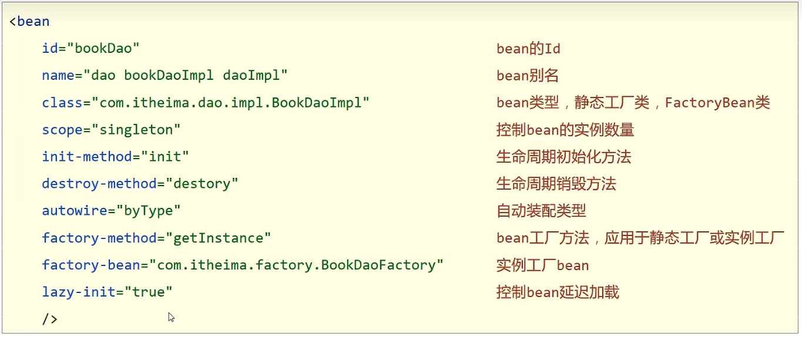

## Spring

### IoC控制反转

使用对象时，由主动new产生的对象转换为外部提供对象，在此过程中对象创建权交给外部


### 容器

#### 加载配置文件

1. 加载类路径下配置文件
2. 从文件系统下加载配置文件

```java
ApplicationContext ctx = new ClassPathXmlApplicationContext("applicationContext.xml");
```


### 实例化bean

#### bean的基础配置 

```java
//配置文件关系
<bean id="bookService" name="service book" scope="prototype"class = "com.itheima.di.service.impl.BookServiceImpl">
	<property name="bookDao" ref="bookDao"/>
</bean>
    //name起别名
    //ref后面指的是bean的名字
    //scope创建时的范围，默认为单例
    //spring造的bean是为了可复用的对象
```

构造方法来实现bean，使用无参的构造方法

如果不提供无参的构造方法，会报错


#### 使用静态工厂创建对象

```java
//静态工厂
public class OrderDaoFactory{
    public static OrderDao getOrderDao(){
		return new OrderDaoImpl();
    }
}
//配置
<bean
    id="orderDao"
    factory-method="getOrderDao"
    class="com.itheima.factory.OrderDaoFactory"
  	/>
```

####  使用实例工厂创建：

**先创建一个`DaoFactoryBean`实现`FactoryBean`接口**

### bean的生命周期

- 配置
- 接口

```java
<bean
	id="bookService" class="com.itheima.dao.BookDaoImpl" init-method="init" 
	destory-method="destory"/>
</bean>
```


### 依赖注入方式

- setter注入
  - 引用类型 `ref`
  - 基本类型 `value`
- 构造器注入
  - 自己开发对象建议setter注入


### 依赖自动装配

- 根据类型，保证类型bean唯一
- 根据名称，不推荐，高耦合
- 优先级低

```java
<bean id="bookService" class="com.itheima.dao.BookDaoImpl" autowire="byType"/>
```





###  注解开发

#### 1.定义bean

- @Component
  - @Controller
  - @Service
  - @Repository
- `<context:component-scan/>`

2.纯注解开发

- `@Configuration`
- `@ComponentScan`
- `AnnotationConfigApplicationContext`