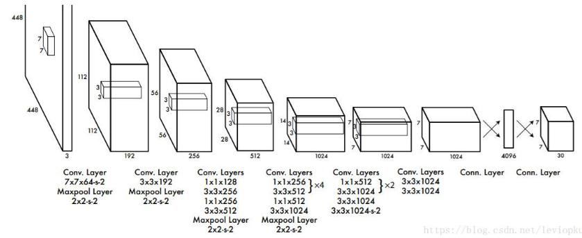
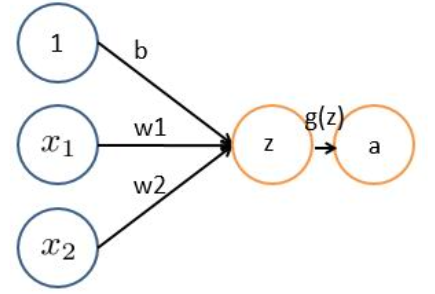
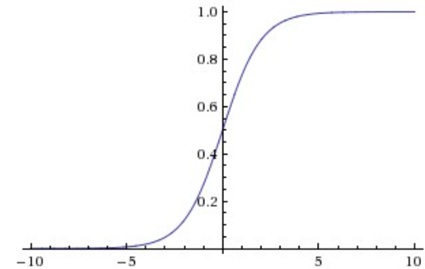
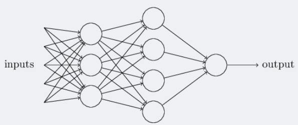
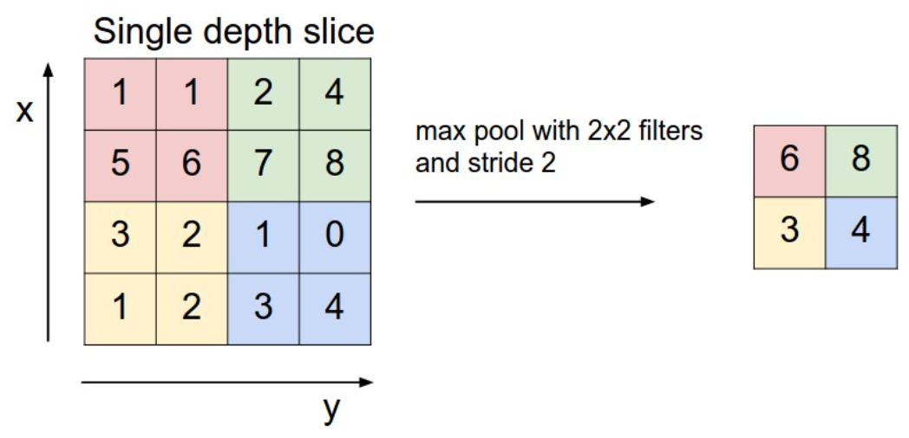

# Yolo笔记

## 前置知识

#### Yolov1

yolov1奠定了yolo系列算法**“分而治之”**的基调，输入图片被划分为7*7的网格

在inference的过程中，网格只是物体中心点位置的划分之用，并不是对图片进行切片，不会让网格脱离整体的关系。

基本思想是这样：预测框的位置、大小和物体分类都通过CNN暴力predict出来。

30 = 2*5 +20 **代表能预测2个框的5个参数(x,y,w,h,score)和20个种类**

v1的输出深度只有30，意味着每个单元格只能预测两个框(而且只认识20类物体)，这**对于密集型目标检测和小物体检测都不能很好适用**。

##### 总结：

v1对于整个yolo系列的价值，即v2/v3还保留的特性，可以总结为3点：

leaky ReLU，相比普通ReLU，leaky并不会让负数直接为0，而是乘以一个很小的系数(恒定)，保留负数输出，但衰减负数输出；公式如下:
$$
y =\begin{cases} 
x , &x > 0 \\
0.1 x ,&otherwise
\end{cases}
$$
分而治之，用网格来划分图片区域，每块区域独立检测目标；
端到端训练。损失函数的反向传播可以贯穿整个网络，这也是one-stage检测算法的优势。

#### Yolov2

一大特点：折中

**召回率** 就是用你查出来的正确的数量除以所有正确的数量，可以跟准确率对比着记忆，
**准确率**是用你查出来的正确的数量除以所有的数量（包含正确和不正确的数量）。

#### 卷积神经网络CNN

##### 人工神经网络

###### 神经元

> 神经网络由大量的神经元相互连接而成。每个神经元接受线性组合的输入后，最开始只是简单的线性加权，后来给每个神经元加上了非线性的激活函数，从而进行非线性变换后输出。每两个神经元之间的连接代表加权值，称之为权重（weight）。不同的权重和激活函数，则会导致神经网络不同的输出。

  基本wx + b的形式，其中

- $$x_1,x_2$$表示输入向量
- $$w_1,w_2$$为权重，几个输入则意味着有几个权重，即每个输入都被赋予一个权重
- b为偏置bias
- g(z) 为激活函数
- a 为输出

###### 激活函数

常用的非线性激活函数有sigmoid、tanh、relu等等，前两者sigmoid/tanh比较常见于全连接层，后者relu常见于卷积层。

`sigmoid`:
$$
g(z)=\frac{1}{1+e^{-z}}
$$
z是一个线性组合，比如z可以等于：
$$
z=b+w_1x_1+w_2x_2
$$

**sigmoid函数的**功能是相当于把一个实数压缩至0到1之间。当z是非常大的正数时，\**g(z)\**会趋近于1，而z是非常小的负数时，则g(z)会趋近于0**。

sigmoid函数可以视为一种分类概率函数，

###### 神经网络

三层神经网络结构

上图中最左边的原始输入信息称之为输入层，最右边的神经元称之为输出层（上图中输出层只有一个神经元），中间的叫隐藏层。

> 输入层（Input layer），众多神经元（Neuron）接受大量非线形输入讯息。输入的讯息称为输入向量。
> 输出层（Output layer），讯息在神经元链接中传输、分析、权衡，形成输出结果。输出的讯息称为输出向量。
> 隐藏层（Hidden layer），简称“隐层”，是输入层和输出层之间众多神经元和链接组成的各个层面。如果有多个隐藏层，则意味着多个激活函数。

##### CNN之卷积计算层

###### CNN怎么进行识别

对于CNN来说，它是一块一块地来进行比对。它拿来比对的这个“小块”我们称之为Features（特征）。在两幅图中大致相同的位置找到一些粗糙的特征进行匹配，CNN能够更好的看到两幅图的相似性，相比起传统的整幅图逐一比对的方法。

###### 什么是卷积

> 对图像（不同的数据窗口数据）和滤波矩阵（一组固定的权重：因为每个神经元的多个权重固定，所以又可以看做一个恒定的滤波器filter）做**内积**（逐个元素相乘再求和）的操作就是所谓的『卷积』操作，也是卷积神经网络的名字来源。

除去中间层和输出层，中间的层可以视为一个滤波器，许多的滤波器叠加就形成了卷积层

###### CNN之激励层与池化层

ReLU激励层

实际梯度下降中，sigmoid容易饱和、造成终止梯度传递，且没有0中心化。咋办呢，可以尝试另外一个激活函数：ReLU，其图形表示如下

###### 池化pool层

前头说了，池化，简言之，即取区域平均或最大，如下图所示（图引自cs231n）

### 目标检测

#### 计算机视觉的任务：

（1）分类-Classification：解决“是什么？”的问题，即给定一张图片或一段视频判断里面包含什么类别的目标。

（2）定位-Location：解决“在哪里？”的问题，即定位出这个目标的的位置。

（3）检测-Detection：解决“在哪里？是什么？”的问题，即定位出这个目标的位置并且知道目标物是什么。

（4）分割-Segmentation：分为实例的分割（Instance-level）和场景分割（Scene-level），解决“每一个像素属于哪个目标物或场景”的问题。

#### 目标检测算法的分类：

1）Tow Stage
先进行区域生成，该区域称之为region proposal，再通过卷积神经网络进行样本分类。

任务流程：特征提取 --> 生成RP --> 分类/定位回归。

常见tow stage目标检测算法有：R-CNN、SPP-Net、Fast R-CNN、Faster R-CNN和R-FCN等。

2）One Stage
不用RP，直接在网络中提取特征来预测物体分类和位置。

任务流程：特征提取–> 分类/定位回归。

常见的one stage目标检测算法有：OverFeat、YOLOv1、YOLOv2、YOLOv3、SSD和RetinaNet等。

#### 检测目标原理

目标检测两大分类：RCNN系列是基于区域检测的代表性算法，YOLO是基于区域提取的代表性算法

##### 候选区域的产生：

- 滑动窗口

检测慢，准确度会高一些

- 选择性搜索

#### 效果评估

使用IoU（Intersection over Union，交并比）来判断模型的好坏。所谓交并比，是指预测边框、实际边框交集和并集的比率，一般约定0.5为一个可以接收的值

