# 信息与网络安全概述

## 绪论

三个关键目标：机密性  完整性  可用性

网络安全有五大要素：可用性、机密性、完整性、可靠性、不可抵赖性

三个基本原则：完整性、保密性、可用性

### 网络攻击

主动攻击(passive attack)：更改数据流，或伪造假的数据流。 

- 伪装（masquerade) 
- 重放(replay) 
- 篡改(modification) 
- 拒绝服务(denial of service)

被动攻击(active attack)：对传输进行偷听与监视，获得传输信息。 

- 窃听攻击(eavesdrop) 
- 流量分析(traffic analysis

### 五类安全服务

- 认证——密码技术
- 访问控制服务
- 数据保密性服务——加密
  - 防止数据在 传输的过程中被破解或泄露

- 数据完整性服务——数字摘要
  - 防止数据在 传输的过程中被篡改

- 抗否认性服务——数字签名

 八类安全机制：

## 二、数据加密技术

密码系统的组成：

**加密：**通信双方按照某种约定将消息的原型隐藏

**密码系统：**明文、密文、加解密算法、密钥空间

按照对明文的处理方式

**对称密钥加密速度快于公钥加密**？

1. **计算复杂度**：
   - 对称密钥加密算法（如AES）通常使用比较简单的运算，如置换和替换，这些运算在现代计算机上非常高效。
   - 公钥加密算法（如RSA）则依赖于更为复杂的数学问题，例如大数因数分解或椭圆曲线运算，这些计算相对来说更加复杂和耗时。
2. **资源需求**：
   - 对称密钥加密通常对计算资源的需求较低，因此在处理大量数据时更为高效。
   - 公钥加密由于其复杂的数学运算，对处理器的负荷更大，特别是在加密或解密大量数据时。

**公钥难以推导出私钥**？

1. **基于数学难题**：
   - 公钥加密算法通常基于某些数学难题，这些难题在当前的计算能力下极难解决。例如，RSA算法基于大数因数分解的难度，而椭圆曲线加密则基于椭圆曲线离散对数问题。
2. **单向函数**：
   - 这些算法涉及所谓的“单向函数”。这些函数的特点是易于计算但难以逆向。例如，在RSA中，乘以两个大质数容易，但要从其乘积推导出原来的质数却非常困难。
3. **密钥生成机制**：
   - 在公钥加密系统中，公钥和私钥是同时生成的，通常基于同一对数学参数。虽然公钥是公开的，但由于它是基于一个难以逆向的数学问题生成的，因此不能轻易从公钥推导出私钥。

**为什么是维护密钥，而不是维护密钥算法？**

答：算法需要很长时间设计，而且如果保密算法的话，就没有办法验证算法的有效性

理想密码系统：没有密钥的情况下，无法恢复明文

Kerckhoffs准则认为，一个安全保护系统的安全性不是建立在它的算法对于对手来说是保密的，而是应该建立在它所选择的密钥对于对手来说是保密的。

1、算法公开。算法应当经得起公开的检验。

2、Open Cryptographic Design

### 经典加密

这三种加密方法各有其特点和实现方式：

#### 简单替换密码（Substitution Cipher）

简单替换密码是一种最基本的加密技术，它通过将明文中的每个字符替换为另一个字符来实现加密。

- **加密过程**：选择一个替换规则，例如，可以将字母表中的每个字母替换为它后面的第三个字母。例如，'A'替换为'D'，'B'替换为'E'，依此类推。
- **解密过程**：进行相反的替换操作。在上面的例子中，就是将每个字母向后移动三位。

这种方法的安全性较低，因为它容易受到**频率分析法**的攻击。

#### 双换位密码（Transposition Cipher）

双换位密码是一种通过改变字符的位置而非字符本身来进行加密的方法。它通常使用两轮置换操作，从而增加加密的复杂度。

- **加密过程**：
  1. 将明文分成固定长度的组。
  2. 在每个组内进行第一轮置换（换位），例如可以改变字符的顺序。
  3. 对得到的结果再进行一次置换，这次置换可能涉及跨组的字符交换，比如按列交换。

- **解密过程**：执行两次置换的逆操作，首先进行第二轮置换的逆操作，然后进行第一轮置换的逆操作。

#### 一次性密码本（One-Time Pad）

一次性密码本是一种理论上完全安全的加密方法，但它在实践中很难实现，因为它要求密钥长度与消息长度相同，且密钥必须是完全随机的、仅使用一次。

- **加密过程**：
  1. 生成一个与明文长度相同的随机密钥。
  2. 将明文和密钥进行逐位的组合，通常是通过二进制的异或（XOR）操作。

- **解密过程**：
  1. 将加密后的文本和相同的密钥进行同样的异或操作。
  2. 由于异或操作的逆操作是它本身，所以这将产生原始的明文。

一次性密码本的安全性在于密钥的随机性和一次性使用。如果重复使用密钥，或者密钥被泄露，那么加密就会变得不安全。

### 对称密钥加密

#### 流密码加密

- 密钥相对比较短
- 密钥被延展到长二进制码流中
- 类似**一次性密码本**

用n位长度的密钥K，并将其**延展**成长长的**密钥流**。然后该密钥流与明文P进行**异或**运算，生成密文C。接收方再用同样的方法解密。

如何将密钥延展？A5/1算法！

##### A5/1算法

该算法用于 **GSM 系统**的序列密码算法，最初是保密的，但通过泄漏和逆向工程公开。

A5/1算法的**密钥**K共**64位**，用于三个线性反馈移位寄存器的初始填充，充当三个寄存器的**初始值**。

1、三个**线性反馈移位寄存器**（X:19位，Y:22位， Z:23位）

滚动生成密钥流可以分为三个步骤：

- 反馈多项式

  - 择多原则：三个寄存器中各选择一个钟控信号，19位寄存器中为第8位，22位、23位寄存器中皆为第10位（**这些位置是固定的**）
  - 根据这三个钟控信号的取值，必定有0或1数量居多，**居多**的寄存器需要进行**位移**操作。
  
- 位移

  - 进行右移操作，第一位需要填充t，t由下列公式决定

  

- 取KEY

  - 取每个寄存器最后一位，也就是19位、22位、23位，进行**异或**操作，得到的结果为这一轮**密钥流的一位**

#### 分组密钥加密

分组密钥加密（Block Cipher）是一种将明文分成固定大小的块（分组）进行加密的方法。每个块独立加密，生成相同大小的密文块。

##### Feistel密码

费斯妥（Feistel）密码是一种广泛应用的对称密钥加密方法。它的加密过程可以分为多个轮次，每个轮次都包括以下几个步骤：

1. **分割**：在每个轮次的开始，将数据块分割为两个等长的部分，记为左半部分$L$和右半部分$R$。
2. **处理**：在每个轮次中，执行以下操作：
   - 使用一个轮函数（round function），通常涉及到加密算法的密钥，对右半部分$R$进行处理。
   - 将处理后的结果与左半部分$L$进行某种组合操作，
      - 例如，通常这种组合操作是异或（XOR）操作。所以，处理后的右半部分$R'$会与左半部分$L$进行异或操作。
3. **交换与合并**：在每轮结束时，交换处理后的两个半部分。具体来说，原来的左半部分$L$成为下一轮的右半部分，而经过处理和组合操作后得到的新右半部分$R'$成为下一轮的左半部分。这个步骤在最后一轮后不进行。
4. **重复**：重复上述步骤，直到完成所有轮次。
5. **输出**：在最后一轮之后，将最终的左半部分和右半部分合并，得到加密后的数据块。

需要注意的是，费斯妥加密过程的每一轮都使用不同的子密钥，这些子密钥通常是从原始密钥通过一定的算法生成的。

费斯妥结构的一个关键特性是其解密过程与加密过程结构上非常相似，只是子密钥的使用顺序相反。这意味着，如果你理解了加密过程，解密过程也就容易理解了。

##### DES（数据加密标准）

DES（数据加密标准）是一种经典的对称密钥分组密码算法。它使用固定长度的密钥（56位，**密钥会被拓展到64位，其中8、16、24等是奇偶校验位，不参与运算**）和64位的数据块。DES的加密过程包括一系列复杂的置换和替换操作，具体步骤如下：

1. 初始置换（Initial Permutation, IP）
   - 加密过程以一个初始置换开始，这个置换对64位的明文块进行重排，这个置换是根据DES标准预先定义好的，对于所有使用DES加密的数据都是相同的。所以不具有加密的安全性

2. 16轮加密操作

   - 接下来，明文经过16轮的加密操作。每一轮都使用了不同的子密钥（由原始密钥生成），但是运算的步骤是相同的。

   - 每轮包括以下主要步骤：
     - **扩展置换**：将32位的半块扩展到48位，使其与子密钥长度相匹配，同样的，数据拓展也是根据一个**固定**的置换表。红框中就是我们要补位的数据。
     
       
     - **与子密钥混合**：将扩展后的半块与子密钥进行异或操作，
     
       
     - **S盒置换**：S盒替换（Substitution Box substitution）是一种在密码学中广泛使用的加密技术。它是将明文中的一组比特映射到密文中的一组比特的过程，用于增强密码的安全性。DES中S盒替换用于将上一轮异或运算的48位结果映射到32位输出中去。
     
       
     
       同样的，S盒也是一种置换表。在DES的每一轮计算中S盒都是不一样的。这里我以第一轮计算中的S盒为例。从上图中我们看到，S盒内部有8个S块，记作S1-S8。每个S块都会接收6位字符作为输入并输出四位字符。这里我们以第一个S盒S1为例。他是一个4*16的置换表。
     
       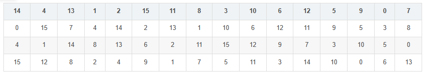
     
       例如输入101010到S1中。S1会将这六位的第一位和第六位拿出来10作为S1的行，中间四位0101拿出来作为S1的列。我们转换成十进制，此时映射到这个S盒的位置就是(2,5)对应S盒的第3行第6列（索引都从0开始数)。
     - **P盒置换**：P盒替换将S盒替换的32位输出作为输入，经过上述固定的替换表进行替换后即为最后F轮函数的结果。
     - 
     - **合并**：处理后的半块与另一半块进行异或操作，然后交换两半块的位置（除了最后一轮）。

3. 子密钥生成
   - 子密钥是从原始56位密钥生成的，这个过程包括密钥的置换和移位操作。每一轮使用一个不同的48位子密钥。

4. 最终置换（Final Permutation, FP）
   - 经过16轮之后，最后一次合并的输出进行最终置换，这是初始置换的逆过程。

解密过程

- DES的解密过程与加密过程相似，只是子密钥的使用顺序相反。

**DES的优缺点**

优点：

- 安全性高：DES算法使用密钥进行加密和解密，相同的明文使用不同的密钥加密后得到的密文是不同的。密钥越长，加密的安全性就越高。

- 算法简单：DES算法的加密和解密过程非简单，基于对称加密，使用相同的key进行加解密。
- 适用广泛：DES算法是最早也是最广泛使用的加密算法之一，被广泛应用于电子商务、电子邮件、虚拟私人网络等领域，具有广泛的适用性和可移植性。

缺点：

- 密钥长度较短：DES算法使用56位密钥，虽然在当时足够安全，但在当前计算机的处理能力下，已经不足以保证加密的安全性，易受到暴力破解攻击。

- 无法抵抗差分密码分析攻击：DES算法无法抵抗差分密码分析攻击，这种攻击可以通过比较相同明文的密文，分析加密算法的行为并推断出密钥。
- 比较慢：由于DES算法是一种分组密码算法，需要对64位的明文进行加密，加密速度比较慢，不适用于对大量数据进行实时加密和解密。

DES的攻击方法：

- 由于DES从诞生距今已经很多年了，但是仍然有部分老旧的系统会使用DES进行加密。因为其密钥长度较短（仅56位）和已知的弱点，因此容易受到以下攻击。

- 穷举攻击（Brute-Force Attack）：由于DES算法的密钥长度较短，可能受到暴力破解攻击，攻击者可以通过穷举所有可能的密钥来尝试破解密文。尽管DES算法的加密速度比较慢，但现代计算机的计算能力很强，可以在合理时间内进行暴力破解攻击。

- 差分密码分析攻击（Differential Cryptanalysis Attack）：差分密码分析是一种比较高效的攻击方式，可以通过对明文和密文之间的差异进行分析，推导出密钥。对于DES算法，攻击者可以通过分析不同的输入和输出差异，以及密钥可能取值的概率，从而获得密钥。

- 线性密码分析攻击（Linear Cryptanalysis Attack）：线性密码分析是一种比较有效的攻击方式，可以通过线性近似计算找到密钥。对于DES算法，攻击者可以通过构造一些线性逼近，以及计算相应的概率，从而推导出密钥。

- 工作密钥攻击（Known Plaintext Attack）：在工作密钥攻击中，攻击者可以获得一些已知明文和相应的密文，然后利用这些信息来推导出密钥。对于DES算法，攻击者可以通过获得足够的已知明文和密文，来推导出密钥。

- 生日攻击（Birthday Attack）：生日攻击是一种利用概率学的攻击方式，可以在相对较短的时间内找到具有相同散列值的两个不同的输入。对于DES算法，攻击者可以使用生日攻击来找到两个不同的密钥，这些密钥都可以加密相同的明文。

##### AES

AES为分组密码，每组长度相等，每次加密一组数据，直到加密完整个明文。在AES标准规范中，分组长度是128位，也就是说，每个分组为16个字节（每个字节8位）。密钥的长度可以使用128位、192位或256位。密钥的长度不同，推荐加密轮数也不同，如下表所示：

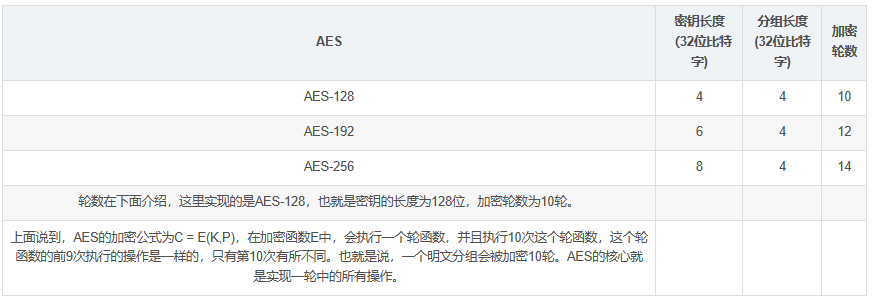

AES的加密公式为C = E(K,P)，在加密函数E中，会执行一个轮函数，并且执行10次这个轮函数，这个轮函数的前9次执行的操作是一样的，只有第10次有所不同。也就是说，一个明文分组会被加密10轮。AES的核心就是实现一轮中的所有操作。

AES的处理单位是字节，128位输入明文分组P被分为16字节

类似地，128位密钥也是用字节为单位的矩阵表示，矩阵的每一列被称为1个32位比特字。通过密钥编排函数该密钥矩阵被扩展成一个44个字组成的序列W[0],W[1], … ,W[43],该序列的前4个元素W[0],W[1],W[2],W[3]是原始密钥，用于加密运算中的初始密钥加（下面介绍）;后面40个字分为10组，每组4个字（128比特）分别用于10轮加密运算中的轮密钥加，如下图所示： 

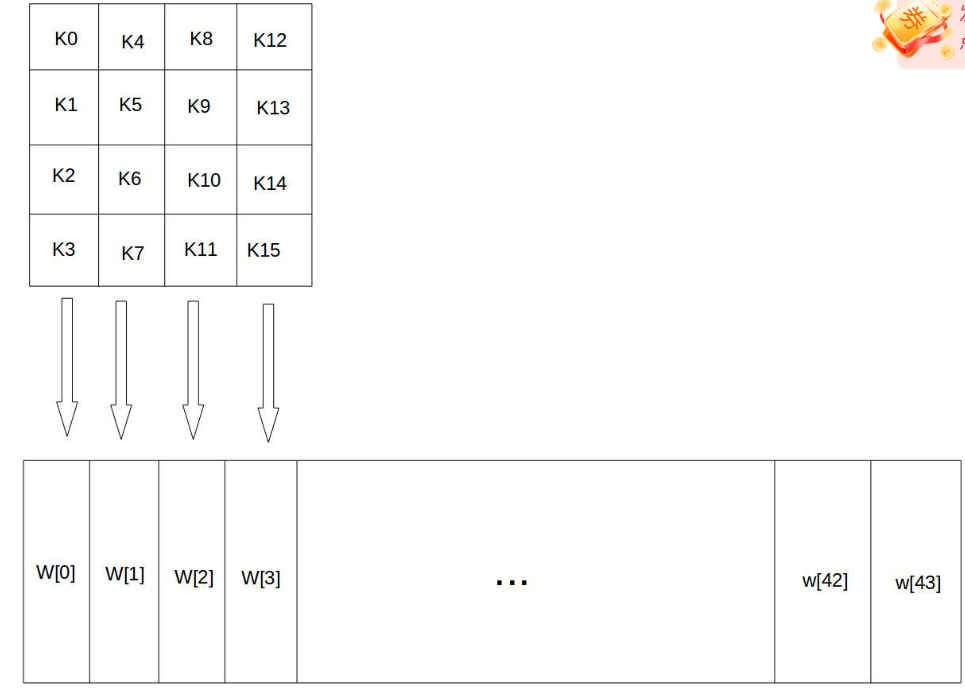

加密的第1轮到第9轮的轮函数一样，包括4个操作：字节代换、行位移、列混合和轮密钥加。最后一轮迭代不执行列混合。另外，在第一轮迭代之前，先将明文和原始密钥进行一次异或加密操作。 

**字节代换**

类似于S-box操作，将一个字节的高八位和低八位分别取出，高8位作为行，低8位作为列，获得新值作为替换；同时存在一个逆S-box盒，可以完成逆向的操作

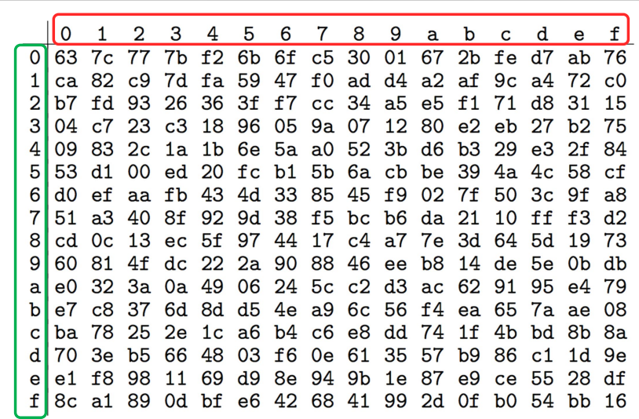

**行位移**

行移位是一个简单的左循环移位操作。当密钥长度为128比特时，状态矩阵的第0行左移0字节，第1行左移1字节，第2行左移2字节，第3行左移3字节，如下图所示： 

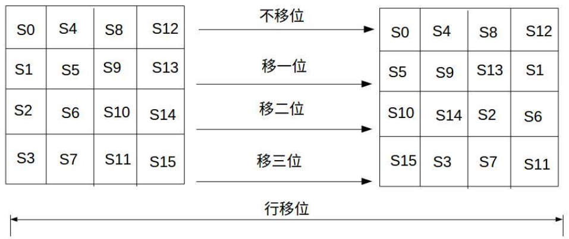

**列混合**

列混合变换是通过矩阵相乘来实现的，经行移位后的状态矩阵与固定的矩阵相乘，得到混淆后的状态矩阵，如下图的公式所示： 

状态矩阵中的第j列(0 ≤j≤3)的列混合可以表示为下图所示： 

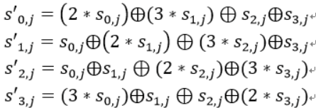

其中，矩阵元素的乘法和加法都是定义在基于GF(2^8)上的二元运算,并不是通常意义上的乘法和加法。这里涉及到一些信息安全上的数学知识，不过不懂这些知识也行。其实这种二元运算的加法等价于两个字节的异或，乘法则复杂一点。对于一个8位的二进制数来说，使用域上的乘法乘以(00000010)等价于左移1位(低位补0)后，再根据情况同(00011011)进行异或运算，设S1 = (a7 a6 a5 a4 a3 a2 a1 a0)，刚0x02 * S1如下图所示：

类似地，乘以(00000100)可以拆分成两次乘以(00000010)的运算

**轮密钥加**

轮密钥加是将128位轮密钥Ki同状态矩阵中的数据进行逐位异或操作，如下图所示。其中，密钥Ki中每个字W[4i],W[4i+1],W[4i+2],W[4i+3]为32位比特字，包含4个字节，。轮密钥加过程可以看成是字逐位异或的结果，也可以看成字节级别或者位级别的操作。也就是说，可以看成S0 S1 S2 S3 组成的32位字与W[4i]的异或运算。 

**密钥拓展**

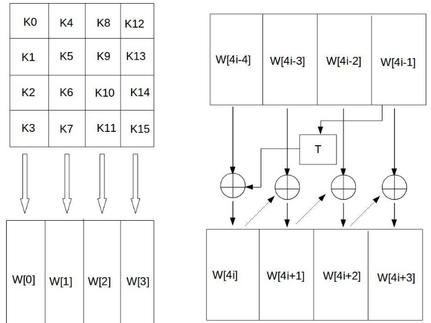

这个4*4矩阵的每一列的4个字节组成一个字，矩阵4列的4个字依次命名为W[0]、W[1]、W[2]和W[3]，它们构成一个以字为单位的数组W。例如，设密钥K为”abcdefghijklmnop”,则K0 = ‘a’,K1 = ‘b’, K2 = ‘c’,K3 = ‘d’,W[0] = “abcd”。 

接着，对W数组扩充40个新列，构成总共44列的扩展密钥数组。新列以如下的递归方式产生： 

1. 如果i不是4的倍数，那么第i列由如下等式确定： 
   W[i]=W[i-4]⨁W[i-1] 

2. 如果i是4的倍数，那么第i列由如下等式确定： 
   W[i]=W[i-4]⨁T(W[i-1]) 
   其中，T是一个有点复杂的函数。 

   函数T由3部分组成：字循环、字节代换和轮常量异或，这3部分的作用分别如下。 
   a. 字循环：将1个字中的4个字节循环左移1个字节。即将输入字[b0, b1, b2, b3]变换成[b1,b2,b3,b0]。 
   b. 字节代换：对字循环的结果使用S盒进行字节代换。 
   c. 轮常量异或：将前两步的结果同轮常量Rcon[j]进行异或，其中j表示轮数。 
   轮常量Rcon[j]是一个字，其值见下表。

   | j       | 1           | 2           | 3           | 4           | 5           |
   | :------ | :---------- | :---------- | :---------- | :---------- | :---------- |
   | Rcon[j] | 01 00 00 00 | 02 00 00 00 | 04 00 00 00 | 08 00 00 00 | 10 00 00 00 |
   | j       | 6           | 7           | 8           | 9           | 10          |
   | Rcon[j] | 20 00 00 00 | 40 00 00 00 | 80 00 00 00 | 1B 00 00 00 | 36 00 00 00 |

### 公开密钥加密

加密使用公钥，解密使用私钥，只有配对才能完成解密过程

- 公钥：可为任何人知道，用来**加密消息或者验证签名**
- 私钥：只有接收者本人知道，用来**解密消息**和**签名**
- 不对称性：用来加密的密钥不能用来解密

私钥不能加密

#### 数学原理

**同余式**是数论的基本概念之一，设m是给定的一 个正整数，a、b是整数，若满足m|(a-b)，则称a与b 对模m同余，记为a≡b(mod m)，这个式子称为模m的 同余式。

m|(a－b)表示m能够整除a与b的差。也就是说， a与b除以m的余数是相同的，a mod m = b mod m 。

**欧拉函数**

欧拉函数 𝜑(𝑛) 是小于等于 𝑛 的正整数中与 𝑛 互质的数的个数

对于任意互质的𝑎和𝑛，有$𝑎^{𝜑(𝑛)} ≡1(\mathrm{~mod~n~})$，即$a^{\varphi(n)}\mathrm{~mod~n~=~1}$

如果 $n$ 是质数，则 $\varphi(n)=n-1$, 因为质数与小于它的每一个正整数都互质

如果$n=p*q$，而$p$ 和$q$互质，则：$\varphi(n)=\varphi(p*q)=\varphi(p)*\varphi(q)=(p-1)(q-1)$

#### RSA

- 生成公钥/私钥对：

1. 取两个大素数 $p,q,(p\neq q)$, 保密； 
1. 计算$n=p*q$;
 3. 计算欧拉函数$\varphi(n)=(p-1)(q-1);$
 4. 随机选择整数$e\left(1<e<\varphi(n)\right)$，使得$e$ 和$\varphi(n)$互质即两个数的最大公约数为1；

5. 计算d，使得$ed=1(mod\varphi(n))$, 也就是$ed=k\varphi(n)+1;$ 
6. 公开$(e,n)=(5,119);$
7. 将 $d$ 保密，丢弃$p$, $q$。

由欧拉定理：
$$
m^{k(\boldsymbol{p}-1)(\boldsymbol{q}-1)+1}\equiv{m}\left({modn}\right)
$$
由于$ed=k\varphi(\mathfrak{n})+1$，故$m^{ed}\equiv\mathrm{m~(mod~n)}$

- 加密消息 m 
  - 获取接收者的公钥$: K$u$= \{ e, n\} $
  - 计算：$c=m^\mathrm{e}modn$ $(0\leq m\leq n)$
- 解密密文 $c$
  - 使用自己的私钥$:K_R=\{d,n\}$
  - 计算$:m=c^\mathrm{d}modn$

$$
\begin{aligned}
c ^\text{d }modn& =\text{ (me mod }n)^d\mathrm{~mod~}n  \\
&= m^{ed}modn \\
&=(m\mathrm{~mod~}n)\mathrm{mod~}n \\
&=m\quad(\text{因为}m\leq n)
\end{aligned}
$$

举例：

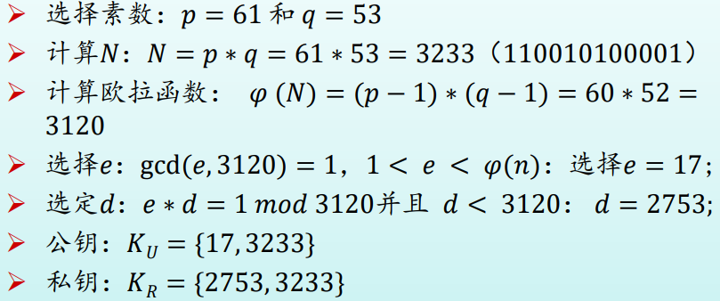

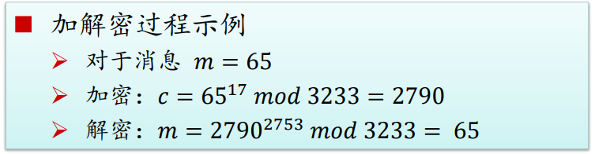

#### Diffie-Hellman密钥交换方案

使两个用户安全地交换 一个密钥以便用于以后的报文加密，这个算法本身限于密钥交换的用途

在Diffie-Hellman密钥交换算法中单项函数是**模指数运算**。它的逆过程是**离散对数问题**，其 Diffie-Hellman算法的保密性基于求 mod P解离散对数问题的困难。

**本原元概念：**定义素数g的本原元（primitive root）为其乘方能够产生从1到g-1的所有整数的数。也就是说，如果n是素数g的本原元，那么有下列数字：
$$
\mathrm{n~mod~g,~n^2mod~g,~...,~n^{g-1}mod~g}
$$
**离散对数**：对于任何小于 g 的整数 a 和素数 g 的本原元 n 来说，能够找到唯一的指数 i 满足：
$$
a=n^imodg(其中0 <=i <= (g-1) )
$$
称指数 i 为 a 对于基数 n 和运算 mod g 的离散对数

**Diffie-Hellman密钥交换方案：**设 𝑔 是一个质数， 𝑛 是 𝑔 的本原元，要求 𝑛 和 𝑔 是公开的，则网络中的某一用户可以任选一个 小于𝑔的整数𝑎作为秘密密钥

#### 圆锥曲线加密ECC

其安全性依赖于定义在椭圆曲线点群上的离散对数问题(ECDLP)的难解性

椭圆曲线加密体制（Elliptic CurveCryptography ， ECC）的优势是：要获得同样等级的安全性，需要的二进制位数较少。从不利的方面来说，椭圆曲线体制的数学计算更加复杂，因此，椭圆曲线体制中的每个数学操作的代价都相对而言更加昂贵

## 三、消息认证及数字签名:ok:

### 消息认证方法

消息认证：

- 内容是否被篡改
- 来源是否被

#### 散列函数

散列函数：将变长消息M转换为定长摘要H，使得数据量变小， 将数据的格式固定下来。与消息验证码不同的是不需要密钥输入

三种方式：

- **传统加密**

  

- **公钥加密**

  

- **密秘值**

  

散列函数需要满足：

- 对于任意长度得输入，都能产生固定长度输出
- 高效：计算快速
- 没有有效的逆运算
- 具有抗碰撞性，不能找到任何两个输 入，使得他们经过哈希后产生相同的输出值

##### MD5算法

MD5算法以一个任意长度的消息（M）作为输入，生成 128位（16字节）的消息摘要作为输出，输入消息是按 512位的分组处理的

分组的最后64位是包含了分组信息的数据，所以如果不够64位，就需要补全到下一个512位

#### 消息认证码

利用**私钥**产生一小块数据，**附到消息上，用来进行消息验证**

区别：散列函数不需要加密，而消息认证码是需要加密的

##### 基于散列函数消息认证码-HMAC

- 将密钥与散列算法结合的最广为接受的方案

步骤描述如下：

IPAD和Opad就是字符串的循环，h是散列函数，可以MD5，SHA-1

**基于密文的消息认证码（CMAC）**

### 数字签名技术

数字签名：只有信息的发送者才能产生的别人无法伪造的一段数字串，是认证的重要工具！

目的：保证双方自身不能互相欺骗

数字签名的要求：

- 发方发出签名后的消息，就不能否认所签消息；
- 收方能确认或证实发方的签字，但不能伪造； 
- 收方对已收到的消息不能否认；
- 第三者可以确认收发双方之间的消息传送，但不能伪造这一过程

数字签名的性质：

- 必须能够验证签名者及其签名的日期时间；
- 必须能够认证被签名消息的内容；
- 签名必须能够由第三方验证，以解决争议。

两类数字签名函数：

- 直接数字签名
  - 仅涉及通信双方
  - 有效性以来发送方密钥安全
- 仲裁数字签名
  - 使用第三方认证

### 先加密后签名还是先签名后加密

先签名后加密是指先对消息进行签名，然后对消息的签名值和消息一起进行加密。如果采用先加密后签名的方式，接收方只能知道该消息是由签名者发送过来的，但并不能确定签名者是否是该消息的创建者。比如在发送一个认证凭据时采用先加密后签名的方式，消息在发送过程中就有可能被第三方截获并将认证凭据密文的签名值修改为自己的签名，然后发送给接收方。第三方就有可能在不需知道认证凭据的情况下通过这种方式来通过认证获取权限。

采用先签名后加密方式可以避免这类问题的发生，因为只有在知道消息明文的情况下才能对其进行签名。

## 四、密钥管理技术 :ok:

**密钥生成**：

1. 用户设置 往往是弱密码
2. 随机密钥 难以记忆
3. 软件加密不安全，操作系统可能终止加密的运行
4. 硬件加密 相对安全

**密钥分发技术**是指：**传递密钥**给希望交换数据的双方，**不允许其他人看见密钥的方法**

> 任何密码系统的强度取决于**密钥分发技术**

### 对称密钥管理

#### 密钥分发技术

1. 物理方式直接传递
2. 间接物理方式传递
3. 使用旧密钥加密的新密钥传递
4. 各自有一个到达第三方的加密链路，有一个实体在加密链路上转发

密钥类型

- 会话密钥：所有数据都使用一个**一次性**的会话密钥加密。在该会话或连接结束时，会话密钥被销毁

- 永久密钥：用于在实体之间**分发会话密钥**

密钥分发中心 KDC (Key Distribution Center)：

- 充当可信任的第三方
- 保存与用户之间的唯一密钥，以便进行分配
- 生成会话密钥

### 公钥的分配中心

- 所有密钥由KDC管理
- 用户只需保存自己的秘密密钥和KDC的公开密钥
- 用户可通过KDC获得任何其他用户的公开密钥

### 公钥的密钥管理

公钥证书：CA证书，由可信赖的人或机构（CA）签发,防止中间人攻击。

CA (Certification Authorit) 是负责签发证书、认证证书、管理已颁发证书的机关

验证的时候，将使用CA公钥解密获得散列码，再把上部进行散列哈希，进行对比：

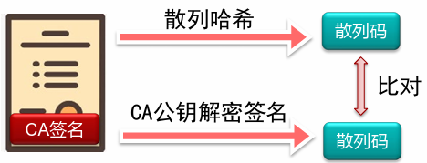

#### 公钥基础设施PKI

> PKI是生成,管理,存储,分发和吊销基于公钥密码 学的公钥证书所需要的硬件,软件,人员,策略和规程的总和
>

组成：

- 注册机构RA
  - 向CA登记或担保一个用户的身份
- 认证机构CA
- 证书库
  - 存放证书和证书撤销链表CRL

- 密钥备份及恢复系统
- 证书撤消处理系统
- PKI 应用接口系统

## 五、用户认证 :ok:

用户认证功能：

1. 用户通过**一个凭证**来向系统证明自身
2. 核实**用户身份**，并**授予相应权限**

消息认证：保证消息真实未被更改且信息源真实

用户认证：用于系统识别用户的真实身份

### 口令认证

第一代：明文用户名密码，如果数据库泄露就失效

第二代：数据库中密码采用散列函数加密，仅的得到加密后的密码无法访问，简单密码仍可以被破解

第三代：加入盐值，将**密码+盐值使用散列加密**后存储在数据库中

盐值：在密码任意固定位置插入的特定的字符串， 让加盐后的密码进行散列运算的结果和原始密码的散列运算结果不一致。

盐值优点：

- 即使是选择相同口令，也会因为不同盐值而生成不同的散列口令
- 大大增加攻击难度
- 几乎不能发现一个用户是否在两个或者多个系统中使用了相同的口令

### 令牌认证

静态协议：**将自己与令牌绑定**，再将令牌与系统用户绑定，即可通过令牌完成身份认证

动态口令生成器：系统与令牌首先进行初始化并保持同步，每过一段 时间令牌就会生成一段口令

挑战-应答协议：系统产生挑战信号，智能令牌基于信号生成应答信号

生物特征：静态生物特征

### 用户认证的安全问题

**口令的脆弱性：**

- 离线字典攻击：
  - 将常用口令进行散列后结果与口令文件中的散列值对比，匹配时可以登录
  - 对策：禁止访问口令文件
- 特点账户攻击：
  - 攻击某个账户，疯狂尝试密码
- 常用口令：
  - 对大量用户ID尝试简单密码

**一些常用的攻击方式：**

- 客户端攻击
  - 伪装成一个合法用户
- 重放攻击
  - 攻击者发送一个目的主机已接收过的包，达到欺骗主机的目的
- 特洛伊木马
  - 冒充认证服务来获取用户口令、验证码或生物特征信息
- 拒绝服务攻击
  - DDOS

### 基本认证方法

#### 单向认证

**认证对方的真实性：**

- A向B表明身份（A是客户）
- 如果系统A是安全的，则**攻击者不能冒充A**
- 最简单的方法是A向B出示口令

对称密钥加密：

- 共享密钥，A和B双方共享密钥，B向A发送一 个明文R，A返回该明文对应的密文，从而确认A掌握密钥
- 一方被攻破 另一方也不安全
- 每次R值不同，不能重放

口令认证——Lamport散列函数：

- A处存放：散列函数，密码
- B处存放：散列函数，A的用户名，n，$hash^n(password)$

过程：

1. A要求B作身份认证时，B返回n的当前值
2. A计算$hash^{n-1}(password)$并返还B
3. B将返回值再散列一次，与当前存储值比较
4. 如果鉴别成功，则更新当前散列值，n的值减一；n若递减为1，则重新设置口令

问题：

小数攻击：攻击者有散列函数且能拦截B的信息，它可以向A返回一个很小的m，然后就可以再n减少到m前都能冒充A，它可以继续散列A的口令，使其达到$hash^{n-1}(password)$

#### 双向鉴别

- 对称密钥

  - A和B相互提出一个challenge
  - 存在桥接攻击

- 非对称密钥

  - 相互使用对方的公钥
  - 公钥的真实性问题

- 时标

  - 数据的时效性问题

  

Key Distribution Center 密钥分发中心：集中管理密钥

使用对称密钥时步骤：

- A 向 KDC 请求和 B 通信，使用A与KDC的对称密钥
- KDC 返回 使用A与KDC对称密钥加密的 key 和 使用 B与KDC的对称密钥加密的消息（A和key）
  - A 将 消息（A和key） 转发给B，这个消息是使用B与KDC的对称密钥加密的，因此可以知道A和key													

- A 和 B 使用 key 通信

双向鉴别：

#### Keberos 概述

角色：用户、服务器、KDC（Kerberos Distribution Center）

KDC分为三部分：**数据库，认证服务器(Authentication Server，简称AS)和票据分发服务器 (Ticket Granting Server，简称TGS)**

分为三步：

- 用户与AS交互
  - 用户向KDC的AS发送**认证服务请求（KRB_AS_REQ）**
    - 用户身份
    - KDC的TGS的服务器名称
  - AS验证用户是否合法并返回**认证服务应答（KRB_AS_REP）**
    - 使用**用户密钥加密的会话密钥**
    - 使用**KDC密钥加密的TGT（访问TGS的凭证）**
- 用户与TGS交互
  - 使用用户密钥解密 KRB_AS_REP，获得会话密钥
  - 用户向KDC中的TGS发送**票据授予服务请求（KRB_TGS_REQ）**
    - KDC密钥加密的TGT（访问TGS的凭证）
    - 使用会话密钥加密的用户身份
    - 需访问的服务器名称
  - TGS使用KDC密钥解密TGT，验证用户身份，返回**送票据授予服务应答（KRB_TGS_REP）**
    - 使用会话密钥加密的服务会话密钥
    - 使用服务器密钥加密的Ticket （服务票据）：访问服务器的凭证，包含**服务会话密钥和经过TGS验证**的用户信息
- 用户与服务器交互
  - 用户使用**会话密钥解密**，获取**服务会话密钥**
  - 向服务器发送服务器登录请求，内容包括
    - 使用服务器密钥加密的服务票据
    - 服务会话密钥加密的用户身份
  - 服务器解密Ticket，然后同用户身份对比

**Kerberos 域**

一个Kerberos域包括：

- 一台Kerberos 服务器
- 若干个客户端
- 若干应用服务器，与服务器共享密钥

如果有多个Kerberos域：

- 它们的Kerberos服务器必须共享一个密钥，并信任另一 个域中的Kerberos服务器对其用户进行认证
- 在第二个域中参与的服务器也必须信任另一个域中 Kerberos服务器

## 六、访问控制:ok:

> 访问控制：限制用户对某些信息项的访问，或限制对某些功能的使用

广义访问控制：

1. **授权：**授予系统实体访问系统资源的权限和许可
2. **认证**：验证用户或其他系统实体声称的身份时有效的
3. **审计：**对系统记录和活动进行独立评审和检查，以便测试系统控制措施的充分性

### 访问控制策略

#### 自主访问控制(DAC)

给予和管理请求者的权限，可以分配权限

通常方式时提供访问控制矩阵：

使用矩阵的话会是一个稀疏矩阵，存在很多的浪费，所以更加常用的是链表和授权表（关系型数据库）

#### 强制访问控制(MAC)

通过比较具有安全许可的安全标记来控制访问

是由**操作系统**约束的访问控制

目标：限制主体或发起者访问或对对象或目标执行某种操作的能力。

> 主体对对象的任何操作都会根据一组授权规则进行测试，由操作系统决定操作是否允许
>
> 1. 主体被赋予一定安全级别
> 2. 客体被赋予一定的安全级别
> 3. 主体能否访问客体由双方的关系安全级别决定

#### 基于角色的访问控制(RBAC)

基于用户在系统中的**角色**说明各种角色用户享有哪些访问权的规则来控制访问

在系统设定的是**角色**而不是用户的身份

用户和角色的关系可以是多对多的

角色与对象的关系也是多对多的

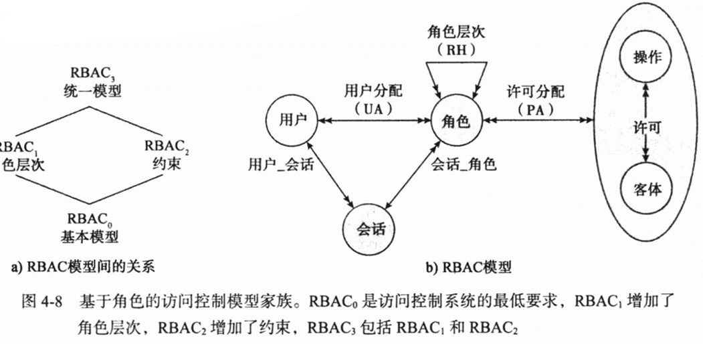

##### RBAC约束

**约束**是在角色之间定义的关系或与角色相关的条件， 它提供了一种令RBAC适应组织中的管理和安全策略的细节的手段

- 互斥角色约束
  - 一个用户只能被分配给一个角色
  - 任何许可只能被授予给集合中一个角色
- 基数约束
  - 设置关于角色的最大数量，比如能分配给一个角色的最大用户数
- 先决条件约束
  - 想要有高级权限，必须要先有低级权限

缺点：适合面向销售公司或学校这种规整的组织，无法适用于很复杂的场景

#### 基于属性的访问控制(ABAC)

基于属性、被访问资源及当前环境条件来控制访问

- 属性
  - 主体属性
  - 客体属性
  - 环境属性
- 策略
  - 用来管理组织内部的允许行为的规则和关系
- 架构

## 七、数据库安全 :ok:

### SQL 注入攻击

针对数据库的最普通和最危险的基于网络的安全威胁

发送恶意sql命令到数据库服务器

常见攻击方式：提取数据、修改或删除数据、执行任意系统操作命令、发起拒绝服务攻击

SQL 攻击的方法通常是在SQL语句中提前终止文本串，随后附加新的命令代码

被攻击的原因：

1. 充分信任用户，导致用户有机会输入恶意代码
2. 数据和操作逻辑没有隔离，本应该是数据的内容最终变成了可执行语句，并改变了原有的执行逻辑

### SQL 攻击方式

攻击途径：

1. 用户输入
   - 精心构造用户输入来注入SQL命令
2. 服务器变量
   - 构造HTTP和网络报头来利用这个漏洞，将数据安排在报头中
3. 二阶注入
   - 利用已存在的数据触发注入攻击
   - 这个输入一般来自系统本身
4. Cookie
   - 实现cookie的修改
5. 物理用户输入
   - 除了Web页面请求，还有其他可以被用户SQL注入的用户请求

攻击分类：

- 带内攻击(inband)
  - 带内攻击使用同样的通信通道来完成注入SQL码和结果返回，这些返回的数据可以直接呈现在Web页面
  - 行尾注释、捎带查询、重言式
- 推理(interential)
  - 当系统展示错误信息时：通过输入特定的请求，并观察返回的错误进行修正，为以后攻击准备
  - 当系统不展示错误信息时：盲SQL注入，多次试错推断数据库系统中的数据
- 带外攻击(out-of-band)
  - 这一方式可以用于信息检索有限制但数据库服务器带外连接不严格的情况

### SQL 防范

 应对措施：

1. 防御性编码
2. 检测
3. 运行时阻断

 数据库加密

最后一道防线，缺点是密钥管理和不灵活

## 八、恶意软件:ok:

病毒：需要宿主程序

蠕虫、木马和僵尸程序：自包含，可以独立运行

### 恶意软件的来源

APT(Advanced Persistent Threat)即高级持续性威胁，是一种周期较长、隐蔽性极强的攻击模式

### 恶意软件的传染机制

病毒：寄存文件、宿主程序运行、本地文件

蠕虫：独立程序、主动攻击、网络计算机

宏病毒：感染文档

## 九、拒绝服务攻击:ok:

## 十、入侵检测 :ok:

### 入侵者

网络罪犯  活动家  国家资助的组织  其他入侵者

### 入侵检测系统

入侵检测系统（IDS, Intrusion Detection System）是一种用于检测和监视网络或系统以寻找恶意活动或政策违规行为的安全技术。IDS主要的作用是为了识别各种威胁和未授权的活动，然后通过报告、警告或其他方式来通知网络管理员或安全人员。

#### IDS主要性能参数

误报(false positive)：系统错误地将异常活动定义为入侵。 

漏报(false negative)：系统未能检测出真正的入侵行为。

两个指标：漏报率和误报率

#### IDS的主要类型

1. **网络入侵检测系统（NIDS）**：这种类型的IDS部署在网络中的关键点，以监视整个网络的流量。它分析通过网络传输的数据包，检测潜在的恶意流量。
2. **主机入侵检测系统（HIDS）**：HIDS安装在特定的主机（如服务器）上，用于监控和分析该主机的内部活动，包括系统调用、文件系统的访问、日志文件等。
3. 混合或分布式IDS
3. 应用软件入侵检测
3. 集成的入侵检测系统

#### IDS的工作原理

- **签名检测（基于知识的检测）**：这种方法依赖于预先定义的攻击特征（即“签名”）来识别已知的威胁。当检测到与已知攻击特征相匹配的活动时，IDS会触发警报。
- **异常检测（基于行为的检测）**：异常检测不是寻找特定的攻击签名，而是监视网络或系统活动，并与建立的正常行为基线进行对比。任何显著偏离这个基线的行为都可能被视为可疑的。
- **状态监控**：这种方法涉及到检查系统的配置和状态，识别不一致或可疑的配置和更改。

#### IDS的优缺点

**优点**：

- 实时监控和警报：IDS可以提供实时的安全分析，并立即响应潜在的入侵。
- 文档记录：IDS可以记录被检测到的活动，提供宝贵的信息，用于事后分析和合规性审计。
- 帮助防御已知威胁：通过使用签名检测，IDS可以有效地识别和阻止已知的攻击类型。

**缺点**：

- 无法防御未知威胁：如果使用基于签名的检测，IDS可能无法识别新型或未知的攻击方法。
- 假阳性和假阴性：IDS可能产生误报（假阳性）或漏报（假阴性），需要适当的调整和维护以优化性能。
- 不是主动防御工具：IDS主要用于检测和警报，而不是直接阻止攻击。通常需要与其他安全措施（如防火墙）结合使用。

#### 组成

传感器（信息收集） 分析器（信息分析） 用户接口（查看系统输出或控制系统行为）

### 蜜罐

## 十一、防火墙 :ok:

防火墙：保护本地系统或网络

### 防火墙类型

#### 包过滤防火墙

这是最基本的防火墙类型，工作在**网络层**。它检查传入和传出的数据包，并根据头部信息（如源IP地址、目的IP地址、TCP/UDP端口号）决定是否允许数据包通过。

#### 状态检测防火墙

状态检测防火墙（Stateful Inspection Firewall）：比包过滤防火墙更先进，工作在网络层和传输层。除了检查数据包的头部信息外，还跟踪每个网络连接的状态信息（如连接是否已建立、连接的阶段等），能提供更安全的过滤策略。

电路级网关（Circuit-Level Gateway）和应用级网关（Application-Level Gateway）是两种不同类型的网络安全设备，它们在工作原理和功能上有所区别。

#### 电路级网关

**工作原理**：
- 电路级网关工作在传输层（TCP/IP模型中的第四层）。
- 它主要验证TCP握手过程，确保建立的是合法的会话。
- 一旦TCP连接建立，电路级网关允许数据包通过，而不深入检查数据包的内容。
- 这种类型的网关监控会话的起始阶段，确保会话是在已知的协议（如TCP或UDP）上合法地建立的。
- 由于它们不检查数据包的有效载荷（Payload），所以对网络性能的影响较小。

**适用场景**：
- 电路级网关适用于需要快速处理数据包，但不需要深入内容检查的场景。

#### 应用级网关

**工作原理**：
- 应用级网关也被称为代理服务器，工作在应用层（TCP/IP模型的第七层）。
- 它不仅检查数据包的头部信息，还深入检查数据包的内容。
- 应用级网关作为客户端和服务器之间的中介，所有经过的通信都必须通过这个代理。
- 它可以检查、过滤、转换应用层的数据，例如HTTP、FTP和DNS请求。
- 这种网关可以实施更细致的内容过滤策略，比如过滤网页内容、阻止特定类型的HTTP请求等。

**适用场景**：
- 应用级网关适用于需要高级安全控制和内容过滤的环境，如需要严格控制访问和监视网络数据的企业网络。

#### 区别总结

- **工作层级**：电路级网关工作在传输层，而应用级网关工作在应用层。
- **检查内容**：电路级网关主要检查会话的合法性，不涉及数据内容；应用级网关则对数据内容进行深入检查和过滤。
- **性能影响**：电路级网关对网络性能的影响较小，而应用级网关可能由于深入的数据检查而对性能产生较大影响。
- **安全级别**：应用级网关提供更高级别的安全控制，因为它能够对数据内容进行细致的审查。

### 防火墙的布置

堡垒主机被防火墙管理员称为网络安全中极强的端系统。通常，堡垒主机可以作为应用级或电路级网关平台

直接置于可信网络和不可信网络的之间的主机

### 防火墙部署和配置

#### VPN网络

VPN（虚拟私人网络，Virtual Private Network）是一种用于在公共网络上建立安全、加密的通信通道的技术。它允许用户通过不安全的网络（如互联网）以安全和加密的方式访问远程网络或传输数据。VPN广泛应用于远程办公、保护数据传输安全、绕过地理限制等场景。

**VPN的工作原理**

1. **加密**：VPN通过加密技术保护数据。当数据在VPN客户端和服务器之间传输时，它会被加密，这意味着即使数据在传输过程中被截获，也无法被未授权的第三方读取。
2. **隧道协议**：VPN使用所谓的隧道协议来建立一个安全的通道。这些协议（如IPsec、L2TP、OpenVPN等）封装原始数据，并通过一个安全“隧道”在互联网上传输数据。
3. **身份验证**：VPN在建立连接时进行身份验证，确保只有授权的用户可以访问VPN网络。这通常涉及用户名和密码，有时还包括数字证书或双因素认证。
4. **数据完整性**：VPN还确保数据在传输过程中不被篡改。它通过各种机制（如校验和）来检测数据在传输过程中是否被篡改。
5. **隐藏真实IP地址**：使用VPN时，用户的网络流量会通过VPN服务器重新路由。这意味着用户的真实IP地址被VPN服务器的IP地址所替代，从而提高了匿名性和隐私保护。

**VPN的主要用途**

- **远程访问**：员工可以通过VPN安全地访问公司的内部网络资源，即使他们身处公司网络之外。
- **数据安全**：在使用公共Wi-Fi或其他不安全网络时，VPN加密数据，保护敏感信息不被窃取。
- **绕过地理限制**：VPN可以用来访问某些国家或地区因政治、版权等原因而被屏蔽的网站和服务。
- **匿名浏览**：通过隐藏真实的IP地址，VPN帮助用户保持匿名，防止被跟踪和监控。

#### DMZ网络

它是为了解决安装防火墙后外部网络不能访问内部网络服务器的问题，而设立的一个位于内部网络与外部网络之间的缓冲区，在这个网络区域内可以放置一些公开的服务器资源，这个子网也被称为非军事区。

例如FTP服务器、E-Mail服务器及网站服务器等允许外部用户访问这些服务器，但不可能接触到存放在内网中的信息，就算黑客入侵DMZ 中服务器，也不会影响到公司内部网络安全，不允许任何外部网络的直接访问，实现内外网分离，在企业的信息安全防护加了一道屏障。

## 十二、缓冲区溢出:ok:

## 十三、安全协议:ok:

1. **病毒和蠕虫**：
   - 病毒：通过附着在其他程序上的方式传播，需要用户干预（如打开文件）才能激活。
   - 蠕虫：自我复制并自动传播到其他计算机，不需要用户干预。
2. **木马程序**：伪装成合法软件的恶意程序。用户在不知情的情况下安装这些软件，木马程序就会在用户的计算机上执行恶意操作。
3. **钓鱼攻击**：通过假冒信任的网站或电子邮件，诱使用户提供敏感信息，如用户名、密码和信用卡细节。
4. **DDoS攻击（分布式拒绝服务攻击）**：通过大量的请求超载目标服务器，使其无法处理合法的请求。
5. **SQL注入**：在Web应用的数据库查询中注入恶意的SQL代码，用以访问或篡改数据库中的数据。
6. **跨站脚本攻击（XSS）**：在用户浏览器上执行恶意脚本，通常通过将恶意代码注入到被信任的网站上。
7. **中间人攻击（MITM）**：恶意第三方截取、篡改在双方通信过程中的数据。
8. **零日攻击**：利用软件中未公开的安全漏洞进行攻击，这些漏洞在被发现并修复之前是未知的。
9. **社会工程学**：通过欺骗或操纵人们来获取敏感信息，不一定涉及技术手段。
10. **密码攻击**：使用各种方法尝试破解密码，如暴力破解、字典攻击等。

### 邮件安全协议

S/MIME协议全称“安全的多功能互联网邮件扩展”（Secure/Multipurpose Internet Mail Extensions），是通过在RFCl847中定义的多部件媒体类型在MIME中打包安全服务。它提供验证、信件完整性、数字签名和加密。

### 安全套接层

#### SSL协议

SSL是一个不依赖于平台和运用程序的协议，位于TCP/IP协议与各种**应用层协议**之间，为数据通信提高安全支持。

SSL协议主要分为两层：

1. **SSL记录协议层**的作用是为高层协议提供基本的安全服务。SSL纪录协议针对HTTP协议进行了特别的设计，使得超文本的传输协议HTTP能够在SSL运行。纪录封装各种高层协议，具体实施压缩解压缩、加密解密、计算和校验MAC等与安全有关的操作。
2. **SSL握手协议层**包括SSL握手协议（SSL HandShake Protocol）、SSL密码参数修改协议（SSL Change Cipher Spec Protocol）和SSL告警协议（SSL Alert Protocol）。握手层的这些协议用于SSL管理信息的交换，允许应用协议传送数据之间相互验证，协商加密算法和生成密钥等。

**SSL握手协议的作用是协调客户和服务器的状态，使双方能够达到状态的同步。**

SSL协议的意义

- 认证用户和服务器，确保数据发送到正确的客户机和服务器，互联网连接安全；
- 加密数据以防止数据中途被窃取；
- 维护数据的完整性，确保数据在传输过程中不被改变。

SSL协议认证流程

- 客户端向服务器发送一个开始信息“Hello”以便开始一个新的会话连接，这个消息里包含了一个客户端生成的随机数 **Random1**、客户端支持的加密套件（Support Ciphers）和 SSL Version 等信息。

- 收到客户端问候之后服务器必须发送服务器问候信息，服务器会检查指定诸如TLS版本和算法的客户端问候的条件，如果服务器接受并支持所有条件，它将发送其证书以及其他详细信息，否则，服务器将发送握手失败消息。

  如果接受，第二步是服务端向客户端发送 Server Hello 消息，这个消息会从 Client Hello 传过来的 Support Ciphers 里确定一份加密套件，这个套件决定了后续加密和生成摘要时具体使用哪些算法，另外还会生成一份随机数 Random2。注意，至此客户端和服务端都拥有了两个随机数（Random1+ Random2），这两个随机数会在后续生成对称秘钥时用到。

- 客户根据收到的服务器响应信息，产生一个密钥对，并用服务器的公钥加密后将自己的公钥传给服务器；

- 服务器用私钥解密客户端的公钥，并返回给客户一个用客户端公钥加密的信息，以此让客户认证服务器。

##### SSL记录协议

SSL记录协议主要用来实现对数据块的分块、加密解密、压缩与解压缩、完整性检查及封装各种高层协议。

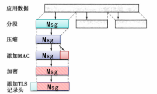

### IPv4和IPv6安全

#### IPSec协议

传输模式和隧道模式，前者负责两台主机间的通信，后者负责网关与目的主机之间的通信

1. AH协议：AH是报文头验证协议，主要提供的功能有数据源验证、数据完整性校验和防报文重放功能。然而，AH并不加密所保护的数据报，只能提供认证安全。

2. ESP协议：ESP是封装安全载荷协议。它除提供AH协议的所有功能外（但其数据完整性校验不包括IP头），还可提供对IP报文的加密功能。

3. IKE协议：IKE协议用于自动协商AH和ESP所使用的密码算法。
   IKE定义了安全参数如何协商,以及共享密钥如何建立,但它没有定义的是协商内容。这方面的定义是由"解释域(doi)"文档来进行。

