# 信息与网络安全概述

**五类安全服务：**

- 认证——密码技术
- 访问控制服务
- 数据保密性服务——加密
- 数据完整性服务——数字摘要
- 抗否认性服务——数字签名

 八类安全机制：

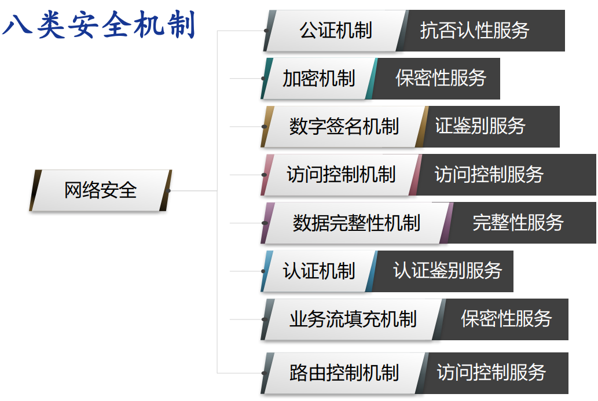

## 二、数据加密技术

密码系统的组成：

**加密：**通信双方按照某种约定将消息的原型隐藏

**密码系统：**明文、密文、加解密算法、密钥空间

**为什么是维护密钥，而不是维护密钥算法？**

答：算法需要很长时间设计，而且如果保密算法的话，就没有办法验证算法的有效性

理想密码系统：

- 没有密钥的情况下，无法恢复明文

### 对称密钥加密

#### 流密码加密

- 密钥相对比较短
- 密钥被延展到长二进制码流中
- 类似**一次性密码本**

用n位长度的密钥K，并将其**延展**成长长的**密钥流**。然后该密钥流与明文P进行**异或**运算，生成密文C。接收方再用同样的方法解密。

##### A5/1算法

该算法用于 **GSM 系统**的序列密码算法，最初是保密的，但通过泄漏和逆向工程公开。

A5/1算法的**密钥**K共**64位**，用于三个线性反馈移位寄存器的初始填充，充当三个寄存器的**初始值**。

1、三个**线性反馈移位寄存器**（X:19位，Y:22位， Z:23位）

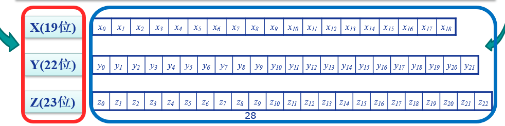

滚动生成密钥流可以分为三个步骤：

- 反馈多项式

  - 择多原则：三个寄存器中各选择一个钟控信号，
  - 19位寄存器中为第8位，22位、23位寄存器中皆为第10位（这些位置是固定的）
  - 根据这三个钟控信号的取值，必定有0或1数量居多，**居多**的寄存器需要进行**位移**操作。

- 位移

  - 进行右移操作，第一位需要填充t，t由下列公式决定

  

- 取KEY

  - 取每个寄存器最后一位，也就是19位、22位、23位，进行**异或**操作，得到的结果为这一轮**密钥流的一位**

### 公开密钥加密

加密使用公钥，解密使用私钥，只有配对才能完成解密过程

- 公钥：可为任何人知道，用来**加密消息或者验证签名**
- 私钥：只有接收者本人知道，用来**解密消息**和**信息**
- 不对称性：用来加密的密钥不能用来解密

#### RSA 算法

- 生成公钥/私钥对：

1. 取两个大素数 $p,q,(p\neq q)$, 保密； 
1. 计算$n=p*q$,公开$n$;
 3. 计算欧拉函数$\varphi(n)=(p-1)(q-1);$
 4. 随机选择整数$e\left(1<e<\varphi(n)\right)$,使得$e$ 和$\varphi(n)$互质即两个数的最大公约数为1；

5. 计算d，使得$ed=1(mod\varphi(n))$, 也就是$ed=k\varphi(n)+1;$ 
6. 公开$(e,n)=(5,119);$
7. 将 $d$ 保密，丢弃$p$, $q$。

## 三、消息认证及数字签名

### 消息认证方法

消息认证：

- 内容是否被篡改
- 来源是否被

#### 散列函数

散列函数：将变长消息M转换为定长摘要H，不需要密钥

三种方式：

- 传统加密

  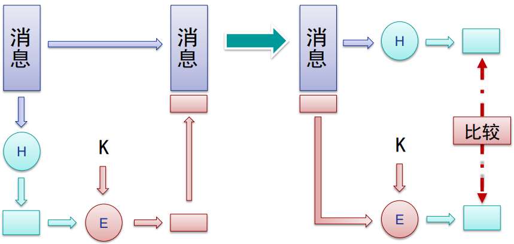

- 公钥加密

  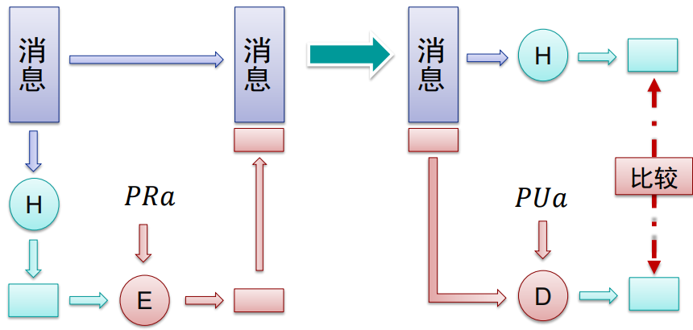

- 密钥值

  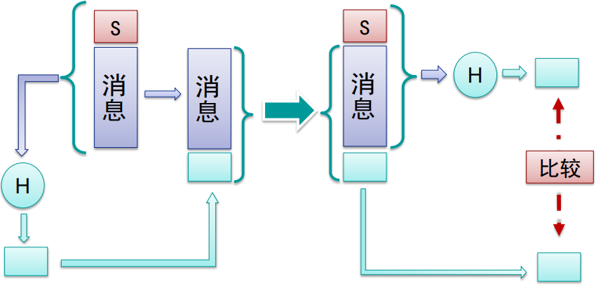

散列函数需要满足：

- 对于任意长度得输入，都能产生固定长度输出
- 高效：计算快速
- 没有有效的逆运算
- 具有抗碰撞性，不能找到任何两个输 入，使得他们经过哈希后产生相同的输出值

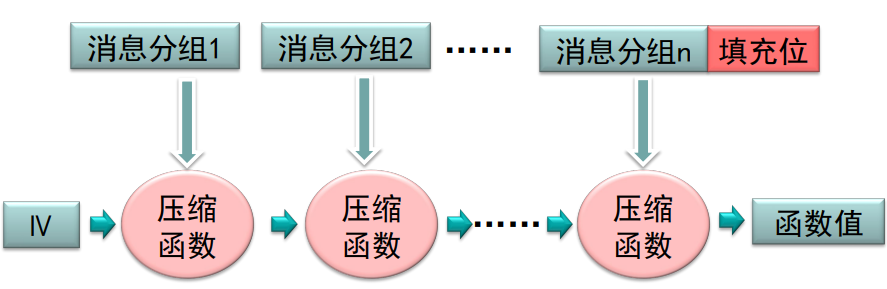

##### MD5算法

MD5算法以一个任意长度的消息（M）作为输入，生成 128位（16字节）的消息摘要作为输出，输入消息是按 512位的分组处理的

#### 消息认证码

利用**私钥**产生一小块数据，**附到消息上，用来进行消息验证**

区别：散列函数不需要加密，而消息认证码是需要加密的

**基于散列函数消息认证码-HMAC**

- 将密钥与散列算法结合的最广为接受的方案

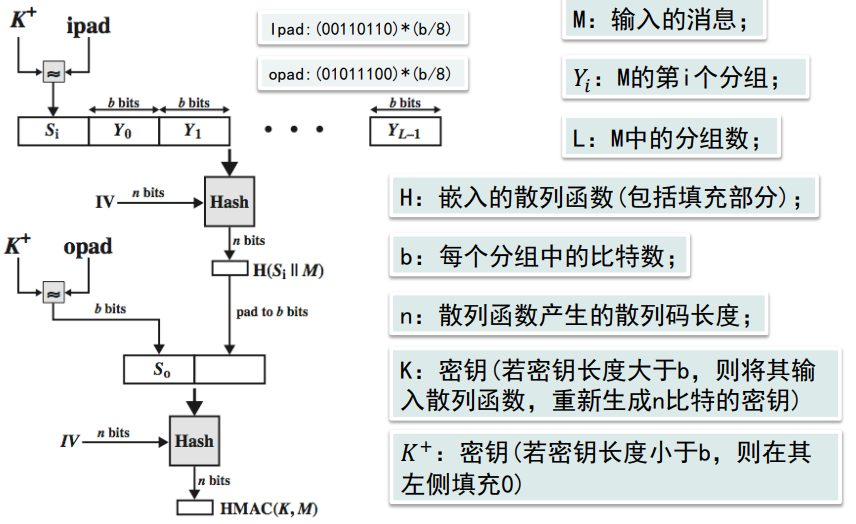

步骤描述如下：

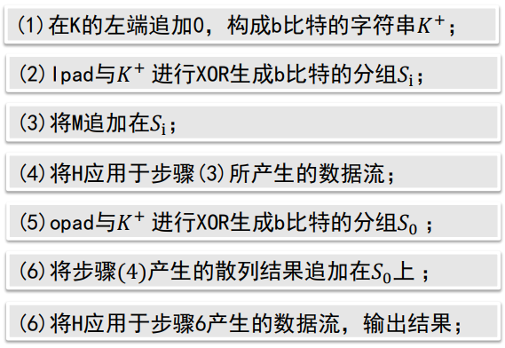

**基于密文的消息认证码（CMAC）**

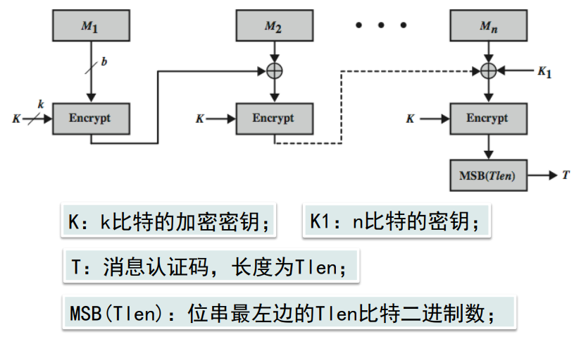

### 数字签名技术

数字签名：只有信息的发送者才能产生的别人无法伪造的一段数字串

目的：保证双方自身不能互相欺骗

两类数字签名函数：

- 直接数字签名
  - 仅涉及通信双方
  - 有效性以来发送方密钥安全
- 仲裁数字签名
  - 使用第三方认证

## 四、密钥管理技术

**密钥生成**：

1. 用户设置 往往是弱密码
2. 随机密钥 难以记忆
3. 软件加密不安全，操作系统可能终止加密的运行
4. 硬件加密 相对安全

**密钥分发技术**是指：**传递密钥**给希望交换数据的双方，**不允许其他人看见密钥的方法**

> 任何密码系统的强度取决于**密钥分发技术**

### 对称密钥管理

#### 密钥分发技术

1. 物理方式直接传递
2. 间接物理方式传递
3. 使用旧密钥加密的新密钥传递
4. 在加密链路上传递

密钥类型

- 会话密钥：所有数据都使用一个**一次性**的会话密钥加密。在该会话或连接结束时， 会话密钥被销毁

- 永久密钥：用于在实体之间**分发会话密钥**

密钥分发中心 KDC (Key Distribution Center)：

- 充当可信任的第三方
- 保存与用户之间的唯一密钥，以便进行分配
- 生成会话密钥

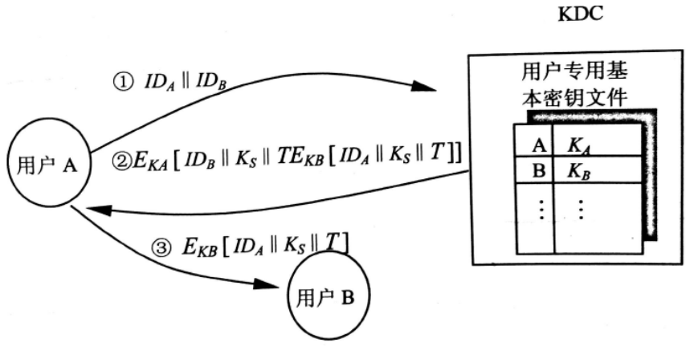

### 公开的密钥管理

公钥证书：CA证书，由可信赖的人或机构（CA）签发

CA (Certification Authorit) 是负责签发 证书、认证证书、管理已颁发证书的机关

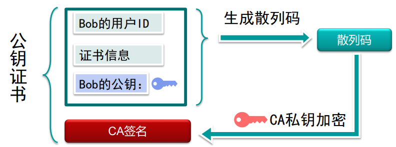

#### 公钥基础设施PKI

> PKI是生成,管理,存储,分发和吊销基于公钥密码 学的公钥证书所需要的硬件,软件,人员,策略和规 程的总和
>

组成：

- 注册机构RA
  - 向CA登记或担保一个用户的身份
- 认证机构CA
- 证书库
  - 存放证书和证书撤销链表CRL

- 密钥备份及恢复系统
- 证书撤消处理系统
- PKI 应用接口系统

## 五、用户认证

用户认证功能：

1. 用户通过**一个凭证**来向系统证明自身
2. 核实**用户身份**，并**授予相应权限**

消息认证：保证消息真实未被更改

用户认证：用于系统识别用户的真实身份

### 口令认证

第一代：明文用户名密码，如果数据库泄露就失效

第二代：采用散列函数加密，简单密码仍可以被破解

第三代：加入盐值，将**密码+盐值使用散列加密**后存储在数据库中

盐值优点：

- 即使是选择相同口令，也会因为不同盐值而生成不同的散列口令
- 大大增加攻击难度
- 几乎不能发现一个用户是否在两个或者多个系统中使用了相同的口令

### 令牌认证

静态协议：**将自己与令牌绑定**，再将令牌与系统用户绑定，即可通过令牌完成身份认证

动态口令生成器：系统与令牌首先进行初始化并保持同步，每过一段 时间令牌就会生成一段口令

挑战-应答协议：系统产生挑战信号，智能令牌基于信号生成应答信号

生物特征：静态生物特征

#### 缺点

**口令的脆弱性：**

- 离线字典攻击：
  - 将常用口令进行散列后结果与口令文件中的散列值对比，匹配时可以登录
  - 对策：禁止访问口令文件，
- 特点账户攻击：
  - 攻击某个账户，疯狂尝试密码
- 常用口令：
  - 对大量用户ID尝试简单密码

**一些常用的攻击方式：**

- 客户端攻击
  - 伪装成一个合法用户
- 重放攻击
  - 攻击者发送一个目的主机已接收过的包
- 特洛伊木马
  - 冒充认证服务来获取 密码
- 拒绝服务攻击
  - DDOS

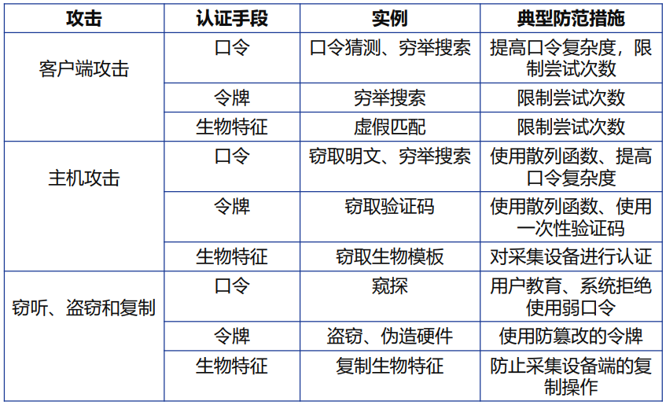

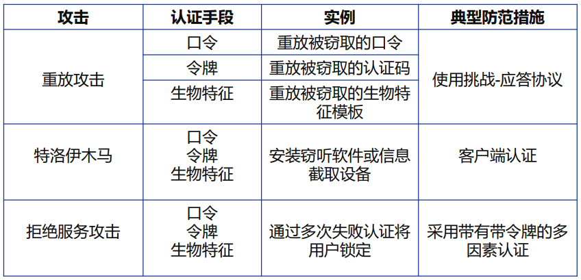

### 单向认证

**认证对方的真实性：**

- A向B表明身份
- 如果系统A是安全的，则攻击者不能冒充A
- 最简单的方法是A向B出示口令

对称密钥：

- 共享密钥
- 一方被攻破 另一方也不安全
- 每次R值不同，不能重放

公钥：

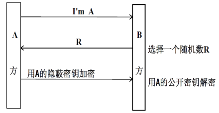

口令认证——Lamport散列函数：

- A处存放：散列函数，密码
- B处存放：散列函数，A的用户名，n，$hash^n(password)$

过程：

1. A相B作身份认证时，B返回n的当前值
2. A计算$hash^{n-1}(password)$并返还B
3. B将返回值再散列一次，与当前存储值比较
4. 如果鉴别成功，则更新当前散列值，n的值减一；n若递减为1，则重新设置口令

问题：

小数攻击：攻击者有散列函数且能拦截B的信息，它可以向A返回一个很小的m，然后就可以再n减少到m前都能冒充A

### 双向鉴别

- 对称密钥

  - A和B相互提出一个challenge
  - 存在桥接攻击

- 非对称密钥

  - 相互使用对方的公钥
  - 公钥的真实性问题

- 时标

  - 数据的时效性问题

  

Key Distribution Center 密钥分发中心：集中管理密钥

使用对称密钥时 步骤：

- A 向 KDC 请求和 B 通信，使用A与KDC的对称密钥
- KDC 返回 key和 使用B与KDC密钥加密的消息（A和key）
- A 将 消息 转发给B
- A 和 B 使用 key 通信

双向鉴别：

Keberos 概述

角色：用户、服务器、KDC

KDC分为三部分：数据库，认证服务器(Authentication Server，简称AS)和票据分发服务器 (Ticket Granting Server，简称TGS)

分为三步：

- 用户与AS交互
  - 用户身份
  - KDC和TGS的服务器名称
  - AS验证用户是否合法并返回**认证服务应答（KRB_AS_REP）**
    - 使用**用户密钥加密的会话密钥**
    - 使用**KDC密钥加密的TGT（访问TGS的凭证）**
- 用户与TGS交互
  - 使用用户密钥解密
  - 用户向KDC中的TGS发送**票据授予服务请求（KRB_TGS_REQ）**
    - KDC密钥加密的TGT（访问TGS的凭证）
    - 使用会话密钥加密的用户身份
    - 需访问的服务器名称
  - TGS使用KDC密钥解密TGT，验证用户身份，返回**送票据授予服务应 答（KRB_TGS_REP）**
    - 使用会话密钥加密的服务会话密钥
    - 使用服务器密钥加密的Ticket （服务票据）：访问服务器 的凭证，包含服务会话密钥和经过TGS验证的用户信息
- 用户与服务器交互
  - 用户获取服务会话密钥
  - 向服务器发送服务器登录请求，内容包括
    - 使用 服务器密钥加密的服务票据
    - 服务会话密钥加密的用户身份
  - 服务器解密Ticket，然后同用户身份对比

Kerberos 域

一个Kerberos域包括：

- 一台Kerberos 服务器
- 若干个客户端
- 若干应用服务器，与服务器共享密钥

如果有多个Kerberos域：

- 它们的Kerberos服务器必须共享一个密钥，并信任另一 个域中的Kerberos服务器对其用户进行认证
- 在第二个域中参与的服务器也必须信任另一个域中 Kerberos服务器

## 六、访问控制

> 访问控制：限制用户对某些信息项的访问，或限制对某些功能的使用

广义访问控制：

1. **授权：**授予系统实体访问系统资源的权限和许可
2. **认证**：验证用户或其他系统实体声称的身份时有效的
3. **审计：**对系统记录和活动进行独立评审和检查，以便测试系统控制措施的充分性

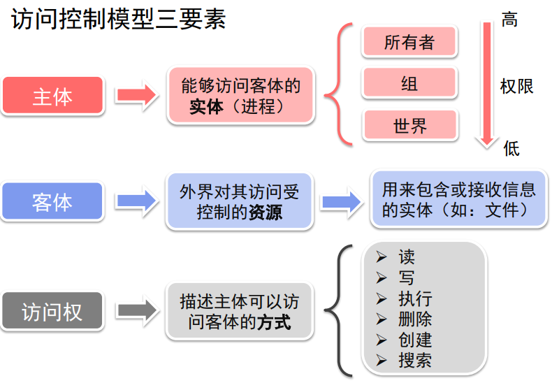

### 访问控制策略

#### 自主访问控制(DAC)

给予和管理请求者的权限，可以分配权限

通常方式时提供访问控制矩阵：

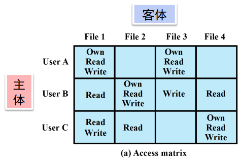

使用矩阵的话会是一个稀疏矩阵，存在很多的浪费，所以更加常用的是链表和授权表（关系型数据库）

#### 强制访问控制(MAC)

通过比较具有安全许可的安全标记来控制访问

是由**操作系统**约束的访问控制

目标：限制主体或发起者访问或对对象或目标执行某种操作的能力。

> 主体对对象的任何操作都会根据一组授权规则进行测试，由操作系统决定操作是否允许
>
> 1. 主体被赋予一定安全级别
> 2. 客体被赋予一定的安全级别
> 3. 主体能否访问客体由双方的关系安全级别决定

#### 基于角色的访问控制(RBAC)

基于用户在系统中的**角色**说明各种角色用户享有哪些访问权的规则来控制访问

在系统设定的是**角色**而不是用户的身份

用户和角色的关系可以是多对多的

角色与对象的关系也是多对多的

##### RBAC约束

**约束**是在角色之间定义的关系或与角色相关的条件， 它提供了一种令RBAC适应组织中的管理和安全策略的细节的手段

- 互斥角色约束
  - 一个用户只能被分配给一个角色
  - 任何许可只能被授予给集合中一个角色
- 基数约束
  - 设置关于角色的最大数量，比如能分配给一个角色的最大用户数
- 先决条件约束
  - 想要有高级权限，必须要先有低级权限

缺点：适合面向销售公司或学校这种规整的组织，无法适用于很复杂的场景

#### 基于属性的访问控制(ABAC)

基于属性、被访问资源及当前环境条件来控制访问

- 属性
  - 主体属性
  - 客体属性
  - 环境属性
- 策略
  - 用来管理组织内部的允许行为的规则和关系
- 架构

## 七、数据库安全

### SQL 注入攻击

针对数据库的最普通和最危险的基于网络的安全威胁

发送恶意sql命令到数据库服务器

