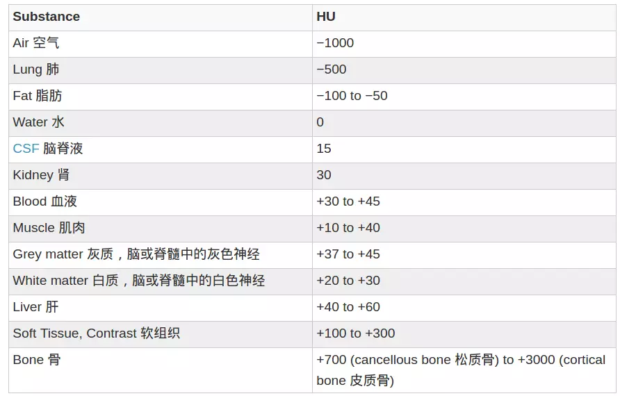
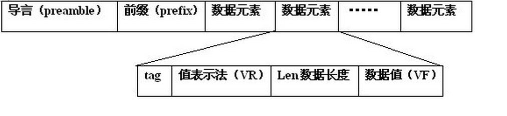

# DICOM

DICOM（Digital Imaging and Communications in Medicine）即医学数字成像和通信，是医学图像和相关信息的国际标准（ISO 12052）

DICOM由以下两部分组成：

1. DICOM文件信息

   包含关于患者的 PHI（protected health information，https://en.wikipedia.org/wiki/Protected_health_information ）信息，例如姓名，性别，年龄，以及其他图像相关信息比如捕获并生成图像的设备信息，医疗的一些上下文相关信息等。

2. DICOM具体的数据

   在dicom文件中每个像素由2字节表示，图像中每个像素都是整数，专业名称为 Hounsfield scale 或 CT Number，是描述物质的放射密度的量化值(参考Wikipedia)。下表为常见物质的HU值

## 文件结构

dicom文件结构：

### tag

tag是4个字节表示的，前两字节是组号后两字节是元素号 比如0008（组号） 0018（元素号）。

根据组号和元素号，我们可以确认当前tag描述的是什么信息

主要组号：0002组描述设备通讯，0008组描述特征参数，0010组描述患者信息，0028组描述图像信息参数

tag分组：文件元tag，普通tag，像素tag

1.文件元tag（组号+0000）：不受传输语法影响，总是以显示VR方式表示，因为它里面就定义了传输语法；文件元tag的dataElement，并没有多大的意义，它的VF数值是整个组所有dataElement的字节长度，一个dicom中可以只有一个文件元tag，也可以有多个文件元tag。

2.普通tag：除了文件元tag和像素tag，其余的都是普通tag数据。包括：图像宽，高，数据传输格式，病人姓名，病人生日，病历医院，病历科室，病情的描述等等数据；

3.像素tag（7fe0,0010）：表示dataElement存储的是病历的图像数据。

关键tag：

**1.tag：0002,0010，决定普通tag的读取方式 little字节序还是big字节序，隐式VR还是显示VR。由它的值决定**

**2.tag：7fe0,0010，像素数据开始处**

所有tag英文列表：https://exiftool.org/TagNames/DICOM.html

### 值表示法 VR- Value Representation

VR由两个单字节Char组成，类似于表示数据类型，VR有27种

查看所有的VR类型：https://blog.csdn.net/wenzhi20102321/article/details/75127140

### 长度VL-Value Length

2字节UInt16，有些情况是4字节UInt32

数据长度：所有DICOM数据元素都应该为偶数长度，若为奇数，追加空格或空NULL
得到这个VL的数值大小就知道这个dataElement的字节长度。

### 值VF-Value Field

如果VL=0xFFFFFFFF，则需要一直读到截止符

值是整个dataElement里面数据的表现形式，如：用户名，年龄，性别等等数据，当然，图像字节的数据也在对应的VF里面，但是表现不出来。
