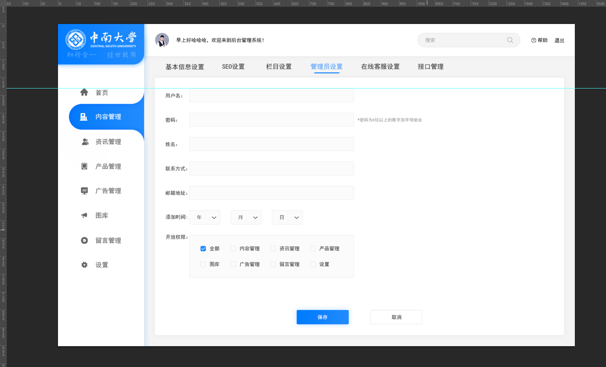
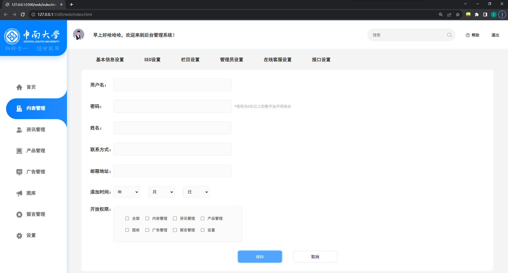

汇报日期：2023.10.8

汇报人：李锐

本周学习：

1. 国庆回来后就在准备发展对象考核，可惜差了几分没有通过笔试

2. 完成了web作业的第一次作业，仅使用html和css复现页面，做了差不多一天，感觉对于原生的前端三件套有了更熟悉的了解

   

   
ps里效果图

   

   
作业截图

   ps: 感觉还是挺像的

3. 看了一篇深度学习的经典论文，感觉词汇上面问题倒不是很大，但存在情况就是脑容量不太够，感觉看了后面忘了前面，准备接下来复现一下模型

下周计划：

1. 最近感觉事情也比较多，下周希望能完成一道网络题
2. 准备学习软件工程课设所需要的技术栈，涉及java后端开发比较多，有一些学习压力