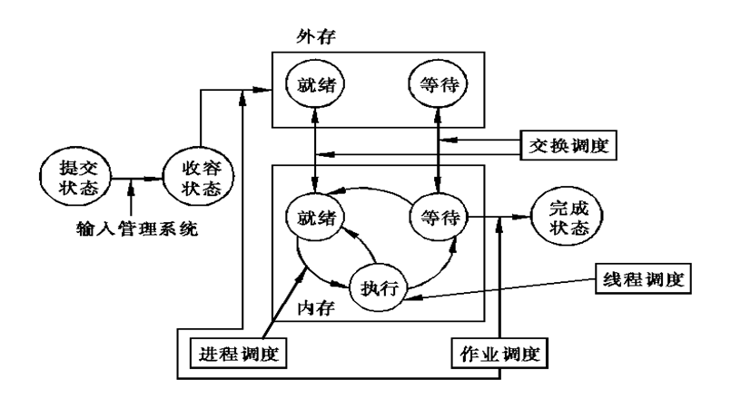
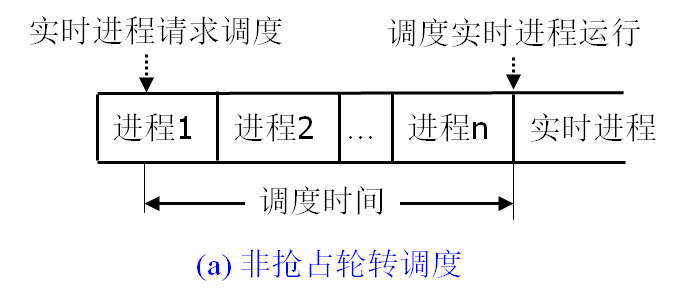
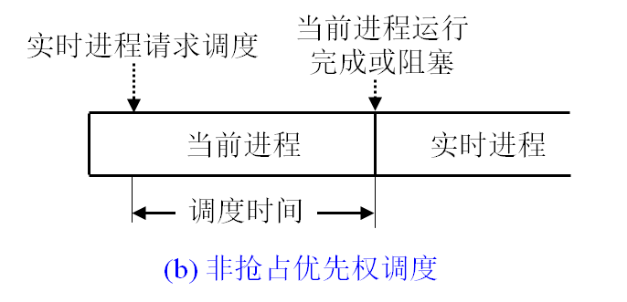
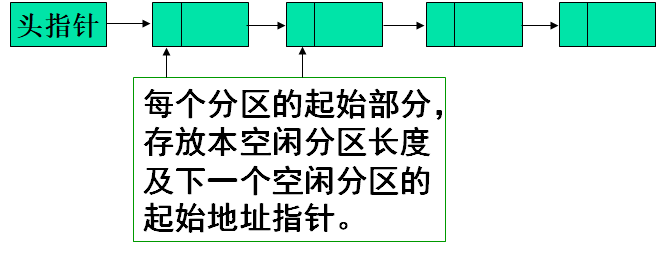

# 操作系统原理

### 学习顺序：

1. 学习原理：看书

> 《操作系统导论》
>
> 《现代操作系统》
>
> 书名（英文）：Operating Systems : Design and Implementation (3rd Edition)
> 书名（中文）：操作系统：设计及实现 (第三版)
> 原作者：Andrew S. Tanenbaum / Albert S. Woodhull
> 翻译者：王鹏、尤晋元、朱鹏、[敖青云](https://www.zhihu.com/search?q=敖青云&search_source=Entity&hybrid_search_source=Entity&hybrid_search_extra={"sourceType"%3A"answer"%2C"sourceId"%3A"1724086062"})
>
> Operating System (操作系统)
> 书名（英文）：Operating System Concepts (7th Edition)
> 书名（中文）：操作系统概念 (第七版)
> 原作者：Abraham Silberschatz / Peter Baer Galvin / Greg Gagne

2. MIT的实验

MIT6.828： [Operating System Engineering](https://link.zhihu.com/?target=https%3A//pdos.csail.mit.edu/6.828/2020/index.html)

官网主页：`https://pdos.csail.mit.edu/6.828/2020/index.html`


## 绪论

### 操作系统的基本概念：

#### 进程：

一个正在执行的程序


### OS的基本特征：

并发：

在多道程序环境下，并发性指的是在一段时间内，宏观上有多个程序同时运行

共享：系统中的资源可供内存中多个并发执行的进程共同使用

虚拟：


## 操作系统接口

命令接口：用户使用命令接口来与计算机进行交互

### 系统调用

- 程序分为管理程序和用户程序

- 根据对资源和机器指令的使用权限，将处理机执行时的工作状态分为核心态（管态，kernel mode）和用户态（目态，user mode）。
- 由于用户程序执行在用户态下，因此，为了使用操作系统的服务和功能，必须借助操作系统提供的程序接口。


### 系统调用的类型：

进程控制

文件操作

进程通讯

设备管理

信息维护


### 系统调用的实现

中断和陷入机制


## 进程管理

### 进程基本概念

具有独立功能的程序在某个数据段上的执行过程，他是系统进行**资源分配和调度**的一个基本单位

- **顺序执行的特征**
  1. 顺序性：严格按照程序规定的顺序执行
  2. 程序是在封闭的环境下执行的
     1. 独占资源
     2. 内部不受外部影响
  3. 可再现性：只要程序的初始条件和环境相同，程序的执行结果就相同。


- **并发执行的特征**
  1. 间歇性：共享系统资源，并发程序间互相制约
  2. 失去封闭性
  3. 不可再现性


#### 进程的状态

- 就绪状态
- 阻塞状态/等待状态
- 执行状态
- 创建状态：PCB已填写标识符，但是其他资源未分配，进程自身没有进入主存，无法调用
- 终止状态


#### 进程的特征

- 静态描述

  | PCB：常驻在内存之中 |
  | ------------------- |
  | 程序段              |
  | 数据段              |

- 动态性：它由创建而产生，由调度（这里主要指**进程调度**，而不是作业调度）而执行，由撤销而消亡

- 并发性：指多个进程实体存于内存中，且能在同一时间段内执行，（这里同操作系统的并发性）
- 独立性：进程实体是一个能独立运行，独立获得资源和独立接收调度的基本单位
- 制约性：进程间对于资源的争用而相互制约
- 异步性：同操作系统的异步性


#### 进程的数据结构

- 内部数据结构：内存表，设备表，文件表，进程表（程序控制快PCB）

**PCB：**进程标识符，处理机状态，进程调度信息，进程控制信息


### 进程与程序的区别与关系

- 进程与程序的区别：
  - 进程是一个动态的概念（有 “ 生命 ” ），程序是静态的概念。
  - 进程可以具有并行性（在多处理器的系统中），但是程序没有
  - 进程是竞争系统资源的基本单位
- 进程与程序的关系：
  - 一个程序对应多个进程，一个进程又可以为多个程序服务。


### 进程控制

#### 进程的挂起和接挂

- 设置原因：

  用户，操作系统，父进程，系统负载过重等

- 挂起过程

  首先判断进程状态，若该进程正处于活动就绪状态，将其改为静止就绪态；若该进程处于活动阻塞状态，将该进程改为静止阻塞状态；若该进程处于执行状态，将其改为静止就绪状态，调度程序重新进行调度


#### 进程控制原语

**通常把进程控制用程序段做成原语**

创建原语`create`


#### 进程的互斥和同步

目的：

1. 进程按照一定规则使用系统资源
2. 对多个相关进程在执行次序上进行协调，是程序具有可再现性。

**制约关系：**

1. 间接制约(互斥)关系：由于**共享系统的临界资源**而相互制约（ex：打印机）
2. 直接制约关系


**临界资源：**一段时间内只允许一个进程访问的资源

**临界区：**访问临界资源的那段程序


**互斥执行的原则：**

1. 空闲让进
2. 忙则等待
3. 让权等待：进程不能进入临界区，就应当释放CPU资源，让权指让出CPU
4. 有限等待：对请求访问的进程，应该保证在有限时间可以访问


##### 软件方法解决

思路：通过记号标记是否有标志在检查区中，**入区通过循环检查进行等待，进程离开临界区后则在退出区修改标志。**


**单双标志法：**

- 两个进程轮流访问一个临界资源。另一个循环判断
- 不遵守“空闲让进”


**双标志法：**

- 主要问题：请求和上锁的操作不是原子的，如果运行顺序改变可能会导致结果变化


`peterson`算法：不满足让权等待


##### 硬件方法：

中断隐藏方法：

1. 使用原子的指令“开\关中断”
2. 简单高效
3. 只适用于单处理机


##### `TestandSet`指令

- 将检查和上锁变成一步的原子操作
- 适合多处理器
- **缺点：**不满足让权等待


##### 信号量机制

信号量：仅由互斥控制原语对其进行操作的整形变量

**互斥控制原语：**

​			  P/wait操作；
​            V/signal操作；

- 信号量机制：
  - 信号量说明：`var s:semaphore;`
  - wait操作即是申请资源，signal操作是释放资源
  - 原子操作不能被打断
- 整形信号量：
  - 把整型信号量定义为一个用于表示资源数目的整型量S
  - 依然没有实现**让权等待**
- 记录形信号量


##### 进程同步

各自的执行结果为对方进程的执行条件，称为**直接制约**，这组进程被称为**合作进程**


##### 生产者消费者问题

生产者向缓冲区输入

消费者向缓冲区输出


### 管程

把分散在各进程中的临界区集中起来进行管理，并把系统中的共享资源用数据结构抽象地表示出来。

组成：

局部于管程的共享变量说明；

对该数据结构进行操作的一组过程；

对局部于管程的数据设置初值的语句。

```python
type PH=monitor
   var chop:array[0..4] of integer; 
   cc: array[0..4] of condition;
   procedure entry get(integer i)  #第i号哲学家取筷子过程
     begin
             j:=(i+1) mod 5;
      L1: if chop[i]=0 or chop[j]=0 then
	 begin
		if chop[i]=0 then cc[i].wait;
		else cc[j].wait;
		goto L1;  #被唤醒后必须回到if语句开头
	 end
	 chop[i]:=0;	   #拿起左边的筷子
	 chop[j]:=0; 	   #拿起右边的筷子
      end
```


### 进程通信

进程间的信息交换

-   共享存储器通信； 
-   管道通信(共享文件)； 
-   消息传递通信


共享存储器：

先向系统申请共享存储区中的一个分区，并指定该分区的关键字；

若系统已经将该分区分配给其它进程，则将其描述符返回给申请者； 

申请者将获得的共享存储分区连接到本进程上； 

此后，便可象读写普通存储器那样地读写该公用存储分区。——UNIX/LINUX与之有关的系统调用有4个


管道(pipe)通信 

用于连接一个读进程和一个写进程以实现它们之间通信的一个共享文件

需要有的能力：

1. 互斥：只有一个进程操作
2. 同步：互相唤醒，完成后睡眠
3. 确认服务存在才建立pipe


### 线程

减少线程切换和创建的开销，所以设立线程

一个进程可以创建多个线程

线程也拥有许多的状态，也是一个动态的概念


线程优点：

1. 响应快
2. 资源共享
3. 一个线程阻塞不会妨碍其他线程


#### 线程的分类

内核级线程

用户级线程

组合级线程：

1. 多对一模型
2. 一对一模型：一对一模型将每个用户线程映射到一个内核线程。
3. 多对多模型：内核线程的数量可能与特定应用程序或特定机器有关。 


## 处理调度与死锁

### 处理机调度的分级模型

#### 作业和作业的状态转换

作业：可以理解为用户向计算机提交的任务实体，一个作业由一个或多个进程组成

作业控制实体（JCB）

作业分为经历**提交、收容、执行和完成**等4个状态



1. 作业调度：进行作业选择，分配内存，输入输出设备资源，建立进程，回收系统资源
2. 交换调度：外存和内存中作业交换的调度

多道批处理系统中：作业调度和进程调度

分时系统和实时系统中：进程调度、交换调度和线程调度。 


#### 调度目标

资源利用率：系统中的处理机和其他所有资源都尽可能的保持忙碌状态
公平性：各个进程都获得合理的CPU时间，避免进程“饿死”
平衡性:系统使用尽量平衡，避免一个资源（如CPU)忙个不停，一个资源（如I/O)无所事事
策略强制执行：特殊情况的强制策略（安全策略）


### 调度算法

先来先服务调度算法

短作业(进程)优先调度算法

高优先权优先调度算法 

高响应比优先调度算法

基于时间片的轮转调度算法 


#### 高响应比优先调度算法

响应比=（等待时间+要求服务时间）/要求服务时间

即考虑了公平性，又考虑了平均周转时间

缺点：会增加系统开销


#### 基于时间片的轮转调度算法 

把CPU的运行时间分成许多时间片，运行完一个时间片后则将队首的任务放到队尾


#### 多级反馈队列调度


### 实时调度

前面的多种调度并不能满足实时系统对调度的要求，因此引入**实时调度**

实现实时调度应具备下述几个条件：

1. 提供必要的信息

   1. 就绪时间
   2. 开始完成截止时间
   3. 处理时间
   4. 资源要求
   5. 优先级

2. 系统处理能力强

   满足这个公式，这个系统才是可调度的：

   

   采用单处理机系统，但需提高其处理能力

   采用多处理机系统

3. 采用抢占式调度机制

   

4. 具有快速切换机制

   - 对外部中断的快速响应能力
   - 快速的任务切换能力


#### 实时调度算法的分类

##### 非抢占式调度算法

算法简单，适合不复杂系统

1. 非抢占式轮转系统调度

   适合要求不高的系统

   

2. 非抢占式优先调度算法

   

##### 抢占式调度算法

在要求较严格(响应时间为数十毫秒以下)的实时系统中采用

①**基于时钟中断的抢占式优先权调度算法**

- 在某实时任务到达后，如果任务的优先级高于当前任务的优先级，这时并不立即抢占当前任务的处理机
- 而是等到时钟中断到来时，调度程序才剥夺当前任务执行，将处理机分配给新到的高优先权任务
- 这种调度算法能获得较好的响应效果，其调度延时可降到几十毫秒到几毫秒,可用于大多数的实时系统

②**立即抢占的优先权调度算法**

- 一旦出现外部中断，只要当前任务未处于临界区，便可立即剥夺当前任务的执行，把处理机分配给请求中断的紧迫任务。
- 这种算法能获得非常快的响应，可把调度延迟时间降低到几毫秒至100微秒，甚至更低。


#### 常用的实时调度算法

##### 最早截止时间优先算法

谁的截至时间早先完成谁


##### 最低松弛度优先算法

   **即LLF(Least Laxity First)算法**

根据任务紧急(或松弛)的程度来确定任务的优先级。任务紧急程度愈高，其优先级愈高。

ex:一个任务在200ms之前必须完成，它本身需要运行100ms，则该任务的紧急程度(松弛程度)为100ms


### 死锁

定义：一组竞争系统资源或相互通信的进程间相互的“永久”阻塞

#### 死锁的必要条件

- 互斥条件：对分配到的资源进行排他性使用
- 请求和保持条件：进程提出了新的资源请求，但是对自己已有资源保持不放
- 不剥夺条件：不能剥夺未使用完的资源
- 链路等待条件


#### 处理死锁的方法

预防死锁：通过设置某些限制条件，破坏必要条件；可能会减弱速度

避免死锁：动态防止系统进入不安全状态

检测死锁：及时检测死锁并清除

解除死锁：与检测死锁相配套的措施。常用的方法是撤消或挂起一些进程，以便回收一些资源，分配给已处于阻塞状态的进程，使之转为就绪状态，以继续运行。


#### 预防死锁

1. 破坏“互斥”条件

可以允许若干个进程同时产生输出。

2. 摒弃“请求并保持”条件 

等待所有资源都就绪了再一次性获取

3. 摒弃“不剥夺”条件

如果一个进程已经保持了某些资源，再请求得不到时，会放弃已有资源

4. 摒弃“环路等待”条件 

采用资源“按号分配”


#### 避免死锁——银行家算法

安全状态：系统存在一个进程序列$$<p_1,p_2,p_3,...,p_n>$$，资源按照这个序列的顺序分配资源，可以依次满足每个进程对于资源的需求

不安全状态：不存在一个进程序列

**并非所有不安全状态都是死锁状态，但它迟早会进入死锁状态。**

**银行家算法:**

在资源动态分配过程中，若分配后系统状态仍是安全的，则同意分配，否则将拒绝分配，这样可防止系统进入不安全状态，从而避免死锁。 


## 存储器管理

### 层次结构

#### 存储器管理的功能

1. 内存分配和回收
2. 内存保护
3. 地址映射
4. 内存扩充


#### 主存储器与寄存器

##### 主存储器

内存或者主存，可以保存进程的程序和数据

CPU只能通过内存与外部存储交流

主存速度远低于CPU速度，所以需要在系统中引入寄存器和告诉缓存


##### 寄存器

速度快，价格昂贵，一般以字作为容量


#### 高速缓存（Cache）

容量比较小但速度比主存高得多， 接近于CPU的速度。

将主存中一些经常访问的信息存放在高速缓存中，减少访问主存的次数，可以大幅度提高程序执行的速度。

由于高速缓存的速度越快价格也越高，故有的计算机系统中设置了两级或多级高速缓存。一级高速缓存速度最高而容量最小，二级高速缓存容量稍大，速度也稍低


#### 磁盘缓存

磁盘将频繁使用的信息放在缓存中，减少开销

命中：CPU需要磁盘中信息时，在缓存中找到


#### 逻辑地址和物理地址

**目标程序**使用的地址单元称为**逻辑地址(相对地址或虚地址)**。一个用户作业的目标程序的逻辑地址集合称为该作业的**逻辑地址空间**。

主存中的实际存储单元编号称为**物理地址(绝对地址或内存地址)**。物理地址的总体构成**物理地址空间**。

**重定向：**必须把程序和数据的逻辑地址转换为物理地址。

分为**静态重定位和动态重定位。**


### 程序的装入和链接

#### 程序的装入

将程序(模块)装入内存时，可以有三种方式：

- 绝对装入方式

- 可重定位装入方式(静态重定位方式)

- 动态运行时装入方式


#### 程序的链接

- 静态链接
- 装入时动态链接
- 运行时动态链接


### 存储连续分配方式

#### 单一连续分配 

内存分为系统区和用户区两部分，系统区仅提供给OS使用，通常是放在内存的低址部分；

用户区是指除系统区以外的全部内存空间，提供给用户使用。 

只适用于单用户，单系统的操作系统中


#### 固定区域分配

将内存划分为若干个固定大小的区域（分区），每个分区中装入一道作业，允许几道作业并发运行。

分区内存相等：特殊情况下可用

分区内存不等：普适性更强，适合多种作业环境


内存分配：

为了便于分配，通常将分区按大小排列，当用户程序装入时，从上到下依次搜素可用的分区


固定分区方式的缺点：

- 大程序可能无法装入；
- 主存空间利用率不高——作业往往不可能恰好填满分区；
- 限制了多道运行的程序数。
- 作业动态扩充主存困难；
- 各分区作业要共享程序和数据也难实现；


#### 动态分区方式

##### 分配系统中数据结构

**空闲分区表：**

**每个空闲分区占一个表目，表目包括：**

分区号、分区始址、分区大小等

| **分区号** | **分区始址** | **分区长度** |
| ---------- | ------------ | ------------ |
| **1**      | **100KB**    | **128KB**    |
| **2**      | **800KB**    | **200KB**    |
| **3**      | **1300KB**   | **700KB**    |

**空闲分区链：** 




##### 搜索方式

首次适应算法(First Fit) ：空闲地址按地址顺序排列，每次从头搜索，直到找到一个合适大小的区域

循环首次适应算法(Next Fit) ：每次从上一次的地址开始搜索

最佳适应算法(Best Fit) ：按大小排序


#### 可重定位分区分配 

**动态重定位的引入** ：为了解决碎片问题

**物理地址 = 逻辑地址 + 基址寄存器中的地址值** 

当找不到满足的分区时，就进行紧凑操作


#### 对换（Swapping）

因为资源浪费

把内存中暂时不能运行的进程或进程所需要的程序和数据，调出到外存上，以便腾出足够的内存空间，再把已具有运行条件的进程或进程所需要的程序和数据，调入内存。

**整体对换：**以进程为单位

**部分对换：**对换以“页”为单位

对换以“段”为单位


## 基本分页存储管理方式

连续分配方式会形成“碎片” ，“紧凑”须付出很大开销 -->所以产生离散分配方式

### 页面和页表


1.页面

将逻辑地址空间分成若干大小相等的片，称为页面或页(page)。页号从0开始。

内存空间分成与页大小相同的若干存储块，称为块或页框(frame)。也从0开始编号。

页框=页帧=内存块=物理块=物理页面

为进程分配内存时，以**块为单位将进程中的若干页分别装入到多个可以不相邻的物理页**中。最后一个页不满，称为页内碎片。 

**页的大小**：应是2的幂。通常为512B～8KB 

2.地址结构

分页逻辑地址可以分为：

页号P+分页地址d

对于特定的机器来说，其地址结构是一定的

3.页表

系统为每个进程建立一张表，记录了相应页在内存中对应的物理块


### 地址变换机构

#### 1.  基本的地址转换机构


### 虚拟存储器的基本概念

问题：内存位置不够

解决方法：逻辑上拓展内存——虚拟存储器

**定义：**具有**请求调入**和**置换功能**，能从逻辑上扩充内存容量

**基本原理：**

- 部分装入
- 请求页面
- 页面置换


### 请求分页存储管理方式 


### 页面置换算法

#### 最佳置换算法（OPT）

每次选择后续不再使用或者长时间不使用的页面，实际中难以观测到序列

#### 先进先出（FIFO）页面置换算法 

先进先出

#### 最近最久未使用(LRU)置换算法 

使用栈或者移位寄存器


#### Clock置换算法

每个页面都有一个计数器，同时有一个指针，当有页面失效时，会通过指针搜索计数器，如果为0则换页，否则计数器-1


#### 页面缓冲算法PBA

**数据结构：**

1) 空闲页面链表
2) 修改页面链表

暂时缓冲页面，几个页面一起写回，减少开销


### 抖动和工作集

#### 抖动

刚调出的老页面又要被调用，时间被浪费在和外设的数据传输上

原因：1. 产生的进程数太多，使得每个进程分到内存块过少

2. 页面置换算法不合理

#### 工作集


## 文件管理

### 文件和文件系统

#### 文件系统模型

底层：文件 目录 磁盘

中间层：对对象进行操纵和管理的软件集合

高层：操作系统提供给用户的接口——命令接口 程序接口


### 文件的逻辑结构

**逻辑结构：**从用户观点出发所观察到的文件组织形式，是用户可以直接处理的数据及其结构

- 提高检索速度
- 便于修改
- 降低存储费用

**存储结构**：文件在外存上的存储组织形式。

- 文件是否有结构分类
  - 有结构文件，无结构文件
- 按文件的组织方式
  - 顺序文件、索引文件、索引顺序文件


#### 文件逻辑结构的类型

1. 有结构文件
2. 无结构文件
3. 顺序结构
4. 索引文件
5. 索引顺序文件
6. Hash文件

### 文件目录

要求：

- 按名存储
- 提高对目录的检索速度
- 文件共享
- 允许重名

#### 文件控制块和索引结点 

**文件控制块**(FCB)：为了能对文件进行正确的存取，必须为文件设置用于描述和控制文件的数据结构

一个文件对应一个FCB

文件目录：文件控制块的集合


FCB：

1. 基本信息：
   - 文件名
   - 物理位置
   - 逻辑位置
   - 物理结构
2. 存取控制信息类
   - 文件主权限
   - 核准用户权限
   - 普通用户权限
3. 使用信息


