# 操作系统原理

### 学习顺序：

1. 学习原理：看书

> 《操作系统导论》
>
> 《现代操作系统》
>
> 书名（英文）：Operating Systems : Design and Implementation (3rd Edition)
> 书名（中文）：操作系统：设计及实现 (第三版)
> 原作者：Andrew S. Tanenbaum / Albert S. Woodhull
> 翻译者：王鹏、尤晋元、朱鹏、[敖青云](https://www.zhihu.com/search?q=敖青云&search_source=Entity&hybrid_search_source=Entity&hybrid_search_extra={"sourceType"%3A"answer"%2C"sourceId"%3A"1724086062"})
>
> Operating System (操作系统)
> 书名（英文）：Operating System Concepts (7th Edition)
> 书名（中文）：操作系统概念 (第七版)
> 原作者：Abraham Silberschatz / Peter Baer Galvin / Greg Gagne

2. MIT的实验

MIT6.828： [Operating System Engineering](https://link.zhihu.com/?target=https%3A//pdos.csail.mit.edu/6.828/2020/index.html)

官网主页：`https://pdos.csail.mit.edu/6.828/2020/index.html`


## 绪论

### 操作系统的目标和作用

#### 目标

1. 方便性：可使计算机系统更容易使用
2. 有效性：提高系统资源利用率
3. 可扩展性：更方便添加新的功能
4. 开放性：便于在不同设备上使用


#### 操作系统的作用：

1. OS作为用户和计算机硬件系统的接口
2. OS作为计算机资源的管理者
   1. 计算机系统资源可归结为四类：处理器、存储器、I/O设备、信息（数据和程序）
   2. OS的主要功能也正是针对这四类资源进行有效管理
3. OS实现了对计算机资源的抽象


### OS的发展顺序

无OS：人工

单道批处理：将程序预先存入磁带，按顺序存入

多道批处理：先存入外存，使并发和共享变成可能


分时系统：一台主机上连接多个带有显示器和键盘的终端，同时允许多个用户通过自己的终端，以交互方式使用计算机，共享主机中的资源。

（1）及时接收:  分时多路复用

（2）及时处理：驻留内存 

- 多路性
- 独立性
- 交互性
- 及时性


实时系统：及时处理**外部事件响应**，在规定时间完成任务，并控制所有实时任务协调一致地运行，对**截止时间**要求

- 可靠性
- 及时性


微机系统：

- 单用户单任务操作系统
- 单用户多任务操作系统

- 多用户多任务操作系统
  - 允许多个用户通过各自的终端使用同一台机器，共享主机系统的各种资源，而每个用户程序又可以进一步分为几个任务，使它们能够并发地执行，从而进一步提高资源利用率和系统吞吐量。


**多处理机系统：**

**多处理机操作系统类型**

**1、非对称多处理模式：主-从模式（ Master-Slave node）**

把处理机分为主处理机和从处理机，主处理机只有一个，其上配置了操作系统，用于管理整个系统的资源，并负责为从处理机分配任务。

从处理机可以有多个，他们执行预先规定的任务以及由主处理机所分配的任务。

**2、对称多处理模式（Symmetric Multiprocessor Model)**

所有的处理机都是相同的，在每个处理机上运行一个相同的OS拷贝，用它来管理本地资源和控制进程的运行，以及各个计算机之间的通信。

允许多个进程同时运行，然而必需小心地控制I/O，以保证能将数据送至适当的处理机。同时还需考虑各CPU的负载均衡。


### OS的基本特征

1. 并发：


在多道程序环境下，并发性指的是在一段时间内，宏观上有多个程序同时运行

> 并发：在同一时间间隔内发生
>
> 并行：在同一时刻发生

2. 共享：系统中的资源可供内存中多个并发执行的进程共同使用

并发和共享是操作系统的两个最基本的特征，它们是互为存在条件的。


3. 虚拟：是指通过某种技术把一个物理实体变为若干个逻辑上的对应物。 
3. 异步：进程进行的顺序是未知的


### 微内核

1. 足够小
2. 基于客户/服务器模式
3. 机制与策略分离
4. 面向对象技术


## 操作系统接口

### 接口方式

> 命令行接口：用户使用命令接口来与计算机进行交互
>
> 图像界面接口：图形界面
>
> 系统调用
>


### 系统调用

- 程序分为管理程序和用户程序

- `管理程序负责管理和分配系统资源，为用户提供服务。`

- `用户程序运行时，所需资源必须向操作系统提出请求，自己不能随意取用资源。`

- 根据对资源和机器指令的使用权限，将处理机执行时的工作状态分为核心态（管态，kernel mode）和用户态（目态，user mode）。
- 由于用户程序执行在用户态下，因此，为了使用操作系统的服务和功能，必须借助操作系统提供的程序接口。
- 特权指令：系统态运行时的指令
- 非特权指令：用户态时运行的指令


> 系统调用实质上是应用程序请求操作系统内核完成某一功能的一种特殊的过程调用。


### 系统调用的类型

- 进程控制

- 文件操作

- 进程通讯

- 设备管理

- 信息维护


### 系统调用的实现

实现过程：系统调用→指令中断→信号送入中断和陷入硬件机构→启动中断和陷入处理程序

中断：CPU对系统发生某事件时的一种响应：CPU暂停正在执行的程序，在保留现场后自动地转去执行该事件的中断处理程序；执行完后，再返回到原程序的断点处继续执行。

- 外中断：由外部设备事件引起的中断
- 内中断：由CPU内部事件引起的中断，由现行指令引起，也称为“捕获”或“陷入”(trap)


## 进程管理

### 进程基本概念

具有独立功能的程序在某个数据段上的执行过程，他是系统进行**资源分配和调度**的一个基本单位

- **顺序执行的特征**
  1. 顺序性：严格按照程序规定的顺序执行
  2. 程序是在封闭的环境下执行的
     1. 独占资源
     2. 内部不受外部影响
  3. 可再现性：只要程序的初始条件和环境相同，程序的执行结果就相同。


- **并发执行的特征**
  1. 间歇性：共享系统资源，并发程序间互相制约
  2. 失去封闭性
  3. 不可再现性


进程由程序、数据、PCB组成

进程：**进程是程序在一个数据集上的运行过程，是系统进行资源分配和调度的一个独立单位。**


#### 进程的数据结构

> 内部数据结构：内存表，设备表，文件表，进程表（程序控制块PCB）

**PCB：**进程标识符，处理机状态，进程调度信息，进程控制信息（内存中地址，进程同步和通信信息）

**为什么说PCB是进程存在的唯一标志?**

> ​		因为PCB包含了进程的描述信息和控制信息，是进程的动态特征的集中反映，系统在建立进程的同时就建立该进程的PCB，在撤消一个进程时也就撤消其PCB，系统根据PCB而感知某一进程的存在，所以PCB是进程存在的唯一标志。
>


#### PCB的组织方式

1. 链接方式：把相同状态的PCB链接成一个队列
2. 索引方式：根据所有进程的状态建立索引表


#### 进程的特征

- 静态描述

  | PCB：常驻在内存之中 |
  | ------------------- |
  | 程序段              |
  | 数据段              |

- 动态性：它由创建而产生，由调度（这里主要指**进程调度**，而不是作业调度）而执行，由撤销而消亡

- 并发性：指多个进程实体存于内存中，且能在同一时间段内执行，（这里同操作系统的并发性）
- 独立性：进程实体是一个能独立运行，独立获得资源和独立接收调度的基本单位
- 制约性：进程间对于资源的争用而相互制约
- 异步性：同操作系统的异步性
- 结构性：进程包含了数据集合和其上运行的程序。为了描述和记录进程的动态变化过程，还需要配置一个进程控制块，所以每个进程由三要素组成：程序、数据和进程控制块。


### 进程与程序的区别与关系

- 进程与程序的区别：
  - 进程是一个动态的概念（有“ 生命 ”），程序是静态的概念。
  - 进程可以具有并发性（在多处理器的系统中），但是程序没有
  - 进程是竞争系统资源的基本单位
- 进程与程序的关系：
  - 一个程序对应多个进程，一个进程又可以为多个程序服务。


### 进程控制

#### *进程的状态

- 就绪状态
- 阻塞状态/等待状态
- 执行状态
- 创建状态：PCB已填写标识符，但是其他资源未分配，进程自身没有进入主存，无法调用
- 终止状态
- 挂起/解挂状态


#### 进程的挂起和解挂

- 设置原因：

  用户，操作系统，父进程，系统负载过重等

- 挂起过程

  首先判断进程状态，若该进程正处于活动就绪状态，将其改为静止就绪态；若该进程处于活动阻塞状态，将该进程改为静止阻塞状态；若该进程处于执行状态，将其改为静止就绪状态，调度程序重新进行调度


#### 进程控制原语

**通常把进程控制用程序段做成原语**

创建原语`create`：

1. 申请PCB
2. 分配资源
3. 编写PCB
4. 将新进程插入就绪队列

进程终止原语`kill()`: 


#### 进程的互斥和同步

**目的：**

1. 进程按照一定规则使用系统资源
2. 对多个相关进程在执行次序上进行协调，是程序具有可再现性。

**制约关系：**

1. 间接制约(互斥)关系：由于**共享系统的临界资源**而相互制约（EX：打印机）
2. 直接制约关系：同步制约关系


**临界资源：**一段时间内只允许一个进程访问的资源

**临界区：**访问临界资源的那段程序

> 进程互斥：**不允许**两个以上的共享该临界资源的并发进程同时进入临界区
>


**临界资源互斥执行的原则：**

1. 空闲让进
2. 忙则等待
3. 让权等待：进程不能进入临界区，就应当释放CPU资源，让权指让出CPU
4. 有限等待：对请求访问的进程，应该保证在有限时间可以访问


##### 软件方法

思路：通过记号标记是否有标志在检查区中，**入区通过循环检查进行等待，进程离开临界区后则在退出区修改标志。**


**单双标志法：**

- 两个进程轮流访问一个临界资源。另一个循环判断
- 不遵守“空闲让进”


**双标志法：**

- 主要问题：请求和上锁的操作不是原子的，如果运行顺序改变可能会导致结果变化


`peterson`算法：不满足让权等待


##### 硬件方法

中断隐藏方法：

1. 使用原子的指令“开\关中断”
2. 简单高效
3. 只适用于单处理机


##### `Test-and-Set`指令

- 将检查和上锁变成一步的原子操作
- 适合多处理器
- **缺点：**不满足让权等待


##### 信号量机制

信号量：仅由互斥控制原语对其进行操作的整形变量

**互斥控制原语：**

​			  `P/wait操作；`
​            `V/signal操作；`

- 信号量机制：
  - 信号量说明：`var s:semaphore;`
  - wait操作即是申请资源，signal操作是释放资源
  - 原子操作不能被打断
- 整形信号量：
  - 把整型信号量定义为一个用于表示资源数目的整型量S
  - 依然没有实现**让权等待**
- 记录形信号量
  - 为了实现让权等待

  - 将请求资源的进程加入等待队列，之后阻塞

- 信号量集机制


##### 进程同步

各自的执行结果为对方进程的执行条件，称为**直接制约**，这组进程被称为**合作进程**


### 经典进程的同步与互斥问题

#### 生产者消费者问题

生产者向缓冲区输入

消费者向缓冲区输出


1. 一个生产者，一个消费者，一个缓冲区
2. 一个生产者，一个消费者，n个缓冲区
3. n个生产者，n个消费者，n个缓冲区


#### 哲学家就餐问题

描述：五个哲学家五双筷子，只有拿起左右两支筷子才能就餐，哲学家交替思考和就餐

常见解决算法：

1. 同一时间只允许一个哲学家就餐
2. 仅当哲学家左右均可用的时候，才允许就餐
3. 四个哲学家只允许先拿左手的筷子，最后一个哲学家只允许先拿右手的
4. 奇数哲学家先拿左边筷子，偶数哲学家先拿右边筷子


#### 读者——写者问题

1. 允许多读者读
2. 不允许边读边写
3. 不允许两写者一起写


#### *进程控制伪代码

```
semaphore Wmutex; //声明型号量
parbegin
process Reader{  //进程声明
	wait(Wmutex);
	read();
	signal(Wmutex);
}
parend  //声明代码结束
```

> PS：
>
> 1. 共享变量都需要信号量控制
> 2. 通信需要信号量控制


### 管程

把分散在各进程中的临界区集中起来进行管理，并把系统中的共享资源用数据结构抽象地表示出来。

**组成：**

1. 局部于管程的共享变量说明；
2. 对该数据结构进行操作的一组过程；
3. 对局部于管程的数据设置初值的语句。

```python
type PH=monitor
   	var chop:array[0..4] of integer; 
   	cc: array[0..4] of condition;
   	procedure entry get(integer i)  #第i号哲学家取筷子过程
    	begin
    	         j:=(i+1) mod 5;
      	L1: if chop[i]=0 or chop[j]=0 then
	 		begin
				if chop[i]=0 then cc[i].wait;
				else cc[j].wait;
				goto L1;  #被唤醒后必须回到if语句开头
			end
		chop[i]:=0;	   #拿起左边的筷子
		chop[j]:=0; 	   #拿起右边的筷子
      end
```


### 进程通信

进程间的信息交换

-   共享存储器通信； 
-   管道通信(共享文件)； 
-   消息传递通信


共享存储器：

1. 先向系统申请共享存储区中的一个分区，并指定该分区的关键字；
1. 若系统已经将该分区分配给其它进程，则将其描述符返回给申请者； 
1. 申请者将获得的共享存储分区连接到本进程上； 
1. 此后，便可象读写普通存储器那样地读写该公用存储分区。——UNIX/LINUX与之有关的系统调用有4个


管道(pipe)通信 

用于连接一个读进程和一个写进程以实现它们之间通信的一个共享文件

需要有的能力：

1. 互斥：只有一个进程操作
2. 同步：互相唤醒，完成后睡眠
3. 确认服务存在才建立pipe


消息传递通信：

1. 信号


### 线程

> 调度和分配处理机的基本单位

减少进程切换和创建的开销，所以设立线程

一个进程可以创建多个线程

线程也拥有许多的状态，也是一个动态的概念（执行 就绪 阻塞）


线程优点：

1. 响应快
2. 资源共享
3. 一个线程阻塞不会妨碍其他线程


进程是资源分配的基本单位，线程是处理机调度的基本单位


#### 线程的分类

内核级线程

用户级线程

组合级线程：

1. 多对一模型
2. 一对一模型：一对一模型将每个用户线程映射到一个内核线程。
3. 多对多模型：内核线程的数量可能与特定应用程序或特定机器有关。 


用户态对于操作系统来说是透明的，操作系统并不知道用户态下进程有多少线程，而只会认为线程等同于进程。内核级线程可以让内核知道线程的存在，这样就可以做到一个线程阻塞时调用进程中另一个线程

内核级线程缺点：内核的空间有限，每次线程切换需要调入内核态


## 处理调度与死锁

### 处理机调度的分级模型

#### 作业和作业的状态转换

> 多道批处理系统中才需要这个
>

作业：可以理解为用户向计算机提交的任务实体，一个作业由一个或多个进程组成

作业控制实体（JCB）

作业分为经历**提交、收容、执行和完成**等4个状态


完成状态：此时作业运行完成，但是他占用的资源还未被回收

1. 作业调度：进行作业选择，分配内存，输入输出设备资源，建立进程，回收系统资源
2. 交换调度：外存和内存中作业交换的调度
3. 进程调度：选择合适的进程运行
4. 线程调度：选择合适线程运行

> 多道批处理系统中：作业调度和进程调度
>
> 分时系统和实时系统中：进程调度、交换调度和线程调度。 
>


#### 调度目标

资源利用率：系统中的处理机和其他所有资源都尽可能的保持忙碌状态

公平性：各个进程都获得合理的CPU时间，避免进程“饿死”

平衡性：系统使用尽量平衡，避免一个资源（如CPU)忙个不停，一个资源（如I/O)无所事事

策略强制执行：特殊情况的强制策略（安全策略）


##### 性能目标

周转时间：$$T_i=T_{ei}-T_{si}$$

带权周转时间：作业周转时间与执行时间之比


### 调度算法

先来先服务调度算法（FCFS）

短作业(进程)优先调度算法(SJF\SPF)

高优先权优先调度算法 

高响应比优先调度算法

基于时间片的轮转调度算法 


#### 短进程优先（SPF）调度算法

非抢占式算法


#### 高优先权优先调度算法 

作业调度——选择优先权最高的作业，将其调入内存运行

进程调度——将处理机分配给就绪队列中一个优先权最高的进程


设置为抢占式和非抢占式均可以


#### 高响应比优先调度算法

> 作业调度算法，不涉及抢占

响应比=（等待时间+要求服务时间）/要求服务时间

即考虑了公平性，又考虑了平均周转时间

缺点：会增加系统开销


#### 基于时间片的轮转调度算法 

把CPU的运行时间分成许多时间片，运行完一个时间片后则将队首的任务放到队尾

**抢占式**


#### 多级反馈队列调度

优先度逐级降低，时间片逐级增加


### **实时调度

前面的多种调度并不能满足实时系统对调度的要求，因此引入**实时调度**

硬实时调度算法：必须严格规定时间内完成

软实时调度算法：偶尔的超过时常是可以接受的

> 对截止时间要求！！！！！！！


实现实时调度应具备下述几个条件：

1. 提供必要的信息

   1. 就绪时间
   2. 开始完成截止时间
   3. 处理时间
   4. 资源要求
   5. 优先级

2. 系统处理能力强

   满足这个公式，这个系统才是可调度的：

   

   采用单处理机系统，但需提高其处理能力

   采用多处理机系统

3. 采用抢占式调度机制

4. 具有快速切换机制

   - 对外部中断的快速响应能力
   - 快速的任务切换能力


#### 实时调度算法的分类

##### 非抢占式调度算法

算法简单，适合不复杂系统

1. 非抢占式轮转系统调度

   适合要求不高的系统

   

2. 非抢占式优先调度算法

   

##### 抢占式调度算法

在要求较严格(响应时间为数十毫秒以下)的实时系统中采用

①**基于时钟中断的抢占式优先权调度算法**

- 在某实时任务到达后，如果任务的优先级高于当前任务的优先级，这时并不立即抢占当前任务的处理机
- 而是等到时钟中断到来时，调度程序才剥夺当前任务执行，将处理机分配给新到的高优先权任务
- 这种调度算法能获得较好的响应效果，其调度延时可降到几十毫秒到几毫秒,可用于大多数的实时系统

②**立即抢占的优先权调度算法**

- 一旦出现外部中断，只要当前任务未处于临界区，便可立即剥夺当前任务的执行，把处理机分配给请求中断的紧迫任务。
- 这种算法能获得非常快的响应，可把调度延迟时间降低到几毫秒至100微秒，甚至更低。


#### 常用的实时调度算法

##### 最早截止时间优先算法

谁的截至时间早先完成谁


##### 最低松弛度优先算法 LLF(Least Laxity First)算法

根据任务紧急(或松弛)的程度来确定任务的优先级。任务紧急程度愈高，其优先级愈高。

`EX`：一个任务在200ms之前必须完成，它本身需要运行100ms，则该任务的紧急程度(松弛程度)为100ms


### 死锁

定义：一组竞争系统资源或相互通信的进程间相互的“永久”阻塞

#### 死锁的必要条件

- 互斥条件：对分配到的资源进行排他性使用
- 请求和保持条件：进程提出了新的资源请求，但是对自己已有资源保持不放
- 不剥夺条件：不能剥夺未使用完的资源
- 环路等待条件：发生死锁时，存在进程-资源等待链


#### 处理死锁的方法

预防死锁：通过设置某些限制条件，破坏必要条件；可能会减弱系统速度

避免死锁：动态防止系统进入不安全状态

检测死锁：及时检测死锁并清除

解除死锁：与检测死锁相配套的措施。常用的方法是撤消或挂起一些进程，以便回收一些资源，分配给已处于阻塞状态的进程，使之转为就绪状态，以继续运行。


#### 预防死锁

1. 破坏“互斥”条件

可以允许若干个进程同时产生输出。

2. 摒弃“请求并保持”条件 

等待所有资源都就绪了再一次性获取

3. 摒弃“不剥夺”条件

如果一个进程已经保持了某些资源，再请求得不到时，会放弃已有资源

4. 摒弃“环路等待”条件 

采用资源“按号分配”


#### **避免死锁——银行家算法

`安全状态`：系统存在一个进程序列$$<p_1,p_2,p_3,...,p_n>$$，资源按照这个序列的顺序分配资源，可以依次满足每个进程对于资源的需求

`不安全状态`：不存在一个进程序列

**并非所有不安全状态都是死锁状态，但它迟早会进入死锁状态。**

**银行家算法:**

在资源动态分配过程中，若分配后系统状态仍是安全的，则同意分配，否则将拒绝分配，这样可防止系统进入不安全状态，从而避免死锁。 


#### 死锁检测

1.资源分配图

方框代表资源，圆代表进程

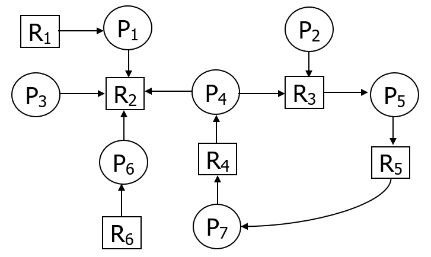


#### 死锁解除

剥夺资源法

撤销进程法


## 存储器管理

### 层次结构

#### 存储器管理的功能

> 1. 内存分配和回收
> 2. 内存共享和保护
> 3. 地址映射
> 4. 内存扩充，虚拟存储技术
>


#### 主存储器与寄存器

##### 主存储器

内存或者主存，可以保存进程的程序和数据

CPU只能通过内存与外部存储交流

主存速度远低于CPU速度，所以需要在系统中引入寄存器和告诉缓存


##### 寄存器

速度快，价格昂贵，一般以字作为容量


#### 高速缓存（Cache）

容量比较小但速度比主存高得多， 接近于CPU的速度。

将主存中一些经常访问的信息存放在高速缓存中，减少访问主存的次数，可以大幅度提高程序执行的速度。

由于高速缓存的速度越快价格也越高，故有的计算机系统中设置了两级或多级高速缓存。一级高速缓存速度最高而容量最小，二级高速缓存容量稍大，速度也稍低


#### 磁盘缓存

磁盘将频繁使用的信息放在缓存中，减少开销

命中：CPU需要磁盘中信息时，在缓存中找到


#### 逻辑地址和物理地址

**目标程序**使用的地址单元称为**逻辑地址(相对地址或虚地址)**。一个用户作业的目标程序的逻辑地址集合称为该作业的**逻辑地址空间**。

主存中的实际存储单元编号称为**物理地址(绝对地址或内存地址)**。物理地址的总体构成**物理地址空间**。

**重定向：**必须把程序和数据的逻辑地址转换为物理地址。

分为**静态重定位和动态重定位。**


### 程序的装入和链接

#### 程序的装入

将程序(模块)装入内存时，可以有三种方式：

- 绝对装入方式
  - 编译时知道程序在内存中位置，产生绝对地址

  - 地址不需要修改

  - 单道程序

- 可重定位装入方式(静态重定位方式)
  - 在装入时对程序中逻辑地址的偏移值加入起始地址中

  - 在装入时一次完成

  - 只能连续装入

- 动态运行时装入方式


#### 程序的链接

源程序经编译后，可得到一组目标程序，再利用链接程序将这组目标模块链接，形成装入模块。

- 静态链接
- 装入时动态链接
- 运行时动态链接


### 存储连续分配方式

#### 单一连续分配 

内存分为**系统区**和**用户区**两部分，系统区仅提供给OS使用，通常是放在内存的低址部分；

用户区是指除系统区以外的全部内存空间，提供给用户使用。 

只适用于单用户，单系统的操作系统中


#### 固定区域分配

将内存划分为若干个固定大小的区域（分区），每个分区中装入一道作业，允许几道作业并发运行。

分区内存相等：特殊情况下可用

分区内存不等：普适性更强，适合多种作业环境


内存分配：

为了便于分配，通常将分区按大小排列，当用户程序装入时，从上到下依次搜素可用的分区


固定分区方式的缺点：

- 大程序可能无法装入；
- 主存空间利用率不高——作业往往不可能恰好填满分区；
- 限制了多道运行的程序数。
- 作业动态扩充主存困难；
- 各分区作业要共享程序和数据也难实现；


#### 动态分区方式

##### 分配系统中数据结构

**空闲分区表：**

**每个空闲分区占一个表目，表目包括：**

分区号、分区始址、分区大小等

| **分区号** | **分区始址** | **分区长度** |
| ---------- | ------------ | ------------ |
| **1**      | **100KB**    | **128KB**    |
| **2**      | **800KB**    | **200KB**    |
| **3**      | **1300KB**   | **700KB**    |

**空闲分区链：** 


##### 顺序搜索方式

首次适应算法(First Fit) ：空闲地址按地址顺序排列，每次从头搜索，直到找到一个合适大小的区域

循环首次适应算法(Next Fit) ：每次从上一次的地址开始搜索

最佳适应算法(Best Fit) ：按大小排序

最坏适应算法(Worst Fit)：将空闲分区按其容量从大到小顺序排列，分配时从表首开始顺序查找。


##### 动态分区的分配和回收流程

分配内存：

1. 先找到一块大小可以分配的分区大小
2. 检测剩余大小是否足够再作为一个分区
3. 够的话就分割
4. 不够就全给了


##### 基于索引搜索的动态分区分配算法 

**快速适应方法（Quick fit）：**将所有空闲分区根据容量大小分类，对于每一类具有相同容量的所有空闲分区，单独设立一个空闲分区链表。

`在搜索可分配的空闲分区时分为两步`：第一步是根据进程的长度，从索引表中寻找到能容纳它的最小空闲区链表；第二步是从链表中取下第一块进行分配，不进行空闲分区分割。

`特点`：比顺序搜索查找速度快；空闲分区回收存在较大系统开销，分区以进程为单位，存在一定空间浪费浪费。


**伙伴系统：**与ft不同的地方是，这个方式规定的空闲或者使用的内存块均为$$2^k$$大小，所以在构成链表的时候更加节约空间

`特点`：比顺序搜索查找速度快；空闲分区可分割，空闲空间利用率比QF高；回收时间开销比QF高。


#### 可重定位分区分配 

**动态重定位的引入** ：为了解决碎片问题

**物理地址 = 逻辑地址 + 基址寄存器中的地址值** 

当找不到满足的分区时，就进行紧凑操作


#### 对换（Swapping）

因为资源浪费

把内存中暂时不能运行的进程或进程所需要的程序和数据，调出到外存上，以便腾出足够的内存空间，再把已具有运行条件的进程或进程所需要的程序和数据，调入内存。

**整体对换：**以进程为单位

**部分对换：**对换以“页”“段”为单位


功能：

- 对换空间的管理
- 进程的换入
- 进程的换出


##### 对换空间管理

将外存分为：**文件区和对换区**


### 基本分页存储管理方式

连续分配方式会形成“碎片” ，“紧凑”须付出很大开销 -->所以产生离散分配方式


#### 页面和页表

1.页面

将逻辑地址空间分成若干大小相等的片，称为页面或页(page)。页号从0开始。

内存空间分成与页大小相同的若干存储块，称为块或页框(frame)。也从0开始编号。

页框=页帧=内存块=物理块=物理页面

为进程分配内存时，以**块为单位将进程中的若干页分别装入到多个可以不相邻的物理页**中。最后一个页不满，称为页内碎片。 

**页的大小**：应是2的幂。通常为512B～8KB 


2.地址结构

分页逻辑地址可以分为：

页号P+分页地址d

对于特定的机器来说，其地址结构是一定的


3.页表

系统为每个进程建立一张表，记录了相应页在内存中对应的物理块


#### 地址变换机构

##### 基本的地址转换机构


##### 具有快表的地址转换机构

将页号送入快速缓存，快缓没找到要去内存找，满了要淘汰

快表中没有找到，还需要访问内存中的页表，然后更新快表


##### 两级和多级页表


##### 反向页表

与索引的思想差不多，表项只与实际内存块大小有关


### 基本分段存储管理方式

每访问一个数据，需要访问两次内存

#### 引入

方便编程：用户通常把自己的程序按逻辑关系分成若干段

> 共享：页只是信息存放的物理单位，没有实际意义，段是逻辑单位
>
> 保护：同样是对逻辑单位的包含，分段管理更容易实现


#### 段页式存储管理方式

分页系统能有效地提高内存利用率

分段系统能很好地满足用户的需要

分段大小可以由用户决定

##### 原理

将用户程序分成若干段，然后把段分成若干页

逻辑地址由3部分组成：段号，段内地址，页内地址


### 虚拟存储器的基本概念

> 虚拟存储器是一种存储管理技术，用以完成用小的内存实现大的虚空间中程序的运行，由操作系统决定，牺牲cpu工作时间以及内外存交换时间和外存空间

问题：内存位置不够

解决方法：逻辑上拓展内存——虚拟存储器


#### 局部性原理 

程序在执行时将呈现局部性规律，即在一较短的时间内，程序的执行仅局限于某个部分（如顺序执行，过程调用，循环，数组访问等）；相应地，它所访问的存储空间也局限于某个区域。

时间局部性——某指令一旦执行，则不久后该指令可能再次被执行（数据亦然）。循环

空间局部性——程序一旦访问了某个存储单元，不久后，附近的存储单元也将被访问。顺序执行


#### 虚拟存储器定义

**定义：**具有**请求调入**和**置换功能**，能从逻辑上扩充内存容量

**基本原理：**

- 部分装入
- 请求页面
- 页面置换


#### 虚拟存储器的特征 没记住的

> - 多次性：一个作业被分成多次调入内存运行
> - 对换性：作业在运行过程中进行换进、换出； 
> - 虚拟性：从逻辑上扩充内存，使用户看到的内存容量大于实际内存容量。这是虚拟存储器所表现的最重要的特征，也是实现虚拟存储器的最重要的目标
>


### 请求分页存储管理方式 

#### 硬件支持

页面失效时，操作系统中需要把信息保存在操作系统内部的软件表格中，硬件不需要


#### 内存分配策略

- 最小物理块数确定：
  - 取决于指令、功能寻址方式
- 物理块的分配策略
  - 固定分区指的是分给进程的物理块数固定，可变就是不固定
  - 局部置换指的是置换私有页面，全局置换指的是只要缺页就获得新的物理块
  - 固定分区局部置换
  - 可变分区全局置换
  - 可变分区局部置换
  
- 物理块分配算法
  - 平均分配
  - 按比例分配算法
  - 考虑优先级分配算法


### 页面置换算法

#### 最佳置换算法（OPT）

每次选择后续不再使用或者长时间不使用的页面，实际中难以观测到序列

#### 先进先出（FIFO）页面置换算法 

先进先出

#### 最近最久未使用(LRU)置换算法 

使用栈或者移位寄存器

#### 最近最少使用(LFU)置换算法

为每个页面设置寄存器，访问了加一，每次选择最小的

#### Clock置换算法

每个页面都有一个计数器，同时有一个指针，当有页面失效时，会通过指针搜索计数器，如果为0则换页，否则计数器-1

#### 页面缓冲算法PBA

OS总是分配给进程固定的内存空间，避免进程老是缺页

但是OS会觉得有些进程的缺页率已经够低了，就可以把一些不怎么影响缺页率的页拿出来，放到空闲页面链表，供需要的使用。

如果此时还没被修改，原进程又需要这个页，则会把该页取出来

**数据结构：**

1) 空闲页面链表
2) 修改页面链表

暂时缓冲页面，几个页面一起写回，减少开销


### 抖动和工作集

#### 抖动

刚调出的老页面又要被调用，时间被浪费在和外设的数据传输上

原因：

1. 产生的进程数太多，使得每个进程分到内存块过少

2. 页面置换算法不合理


#### 工作集

OS分配给每个进程的实际物理块的大小可以是固定的，也可以是不固定的，如果根据工作集的大小来分配实际物理块，会减少抖动的概率。


#### 预防抖动

- 采取局部置换策略
- 处理机调度中引入工作集算法
- 利用L=S准则（Denning,1980)调节缺页率
        L：缺页之间的平均服务时间
        S：平均缺页服务时间
- 暂停某些进程


## 文件管理

### 文件和文件系统

#### 类型

用途：

- 用户文件
- 库文件
- 系统文件

数据形式：

- 源文件
- 目标文件
- 可执行文件

存储控制属性分类：

- 读文件
- 写文件
- 执行文件


#### 文件系统模型

- 底层：文件 目录 磁盘存储空间


- 中间层：对对象进行操纵和管理的软件集合
  - 文件管理
  - 文件目录管理
  - 文件存储空间管理
  - 共享和保护

- 高层：操作系统提供给用户的接口——命令接口 程序接口


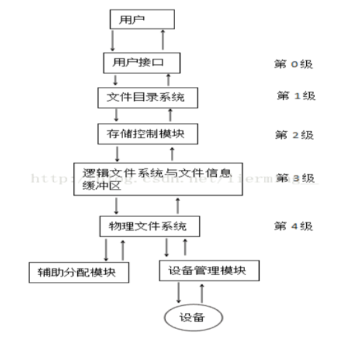


### 文件的逻辑结构

**逻辑结构：**从用户观点出发所观察到的文件组织形式，是用户可以直接处理的数据及其结构

- 提高检索速度
- 便于修改
- 降低存储费用

**存储结构**：文件在外存上的存储组织形式。

- 文件是否有结构分类
  - 有结构文件，无结构文件
- 按文件的组织方式
  - 顺序文件、索引文件、索引顺序文件


#### 文件逻辑结构的类型

1. 有结构文件
2. 无结构文件
3. 顺序结构
4. 索引文件
5. 索引顺序文件
6. Hash文件


### 文件目录

要求：

- 按名存储
- 提高对目录的检索速度
- 文件共享
- 允许重名

#### 文件控制块和索引结点 

**文件控制块**(FCB)：为了能对文件进行正确的存取，必须为文件设置用于描述和控制文件的数据结构

一个文件对应一个FCB

文件目录：文件控制块的集合


FCB：

1. 基本信息：
   - 文件名
   - 物理位置
   - 逻辑位置
   - 物理结构
2. 存取控制信息类
   - 文件主权限
   - 核准用户权限
   - 普通用户权限
3. 使用信息


**减少文件控制块得大小，可以显著减小查找文件所需次数**

UNIX采用文件名与文件描述信息分开的方法，即文件描述信息单独形成一个称为索引节点的数据结构，称为索引结点（i节点）。


### 外存分配方式

外存分配方式有：连续分配、链接分配、索引分配。 

#### 连续分配

- 为每一个文件分配一组相邻的盘块
- 顺序文件结构，物理文件又称顺序文件
- 文件目录项：文件名、第一个盘块号、文件长度
- 会形成磁盘碎片


#### 链接分配

为文件分配多个不连续的盘符，通过在每个盘块上的链接指针，将同属于一个文件的多个离散的盘块链接成一个链表

> 注意链接分配只能够顺序访问！

##### 隐式链接

每个FCB中，包含第一个盘块和最后一个盘块号

在每一个盘块中，都有指向下一个盘块的指针

缺点：只适合顺序访问，一个出问题后面就寄了


##### 显式链接

指针显式存放在外存的一张链接表中，整个磁盘就一张表，称为FAT表

每个表项中存放链接指针，即下一个盘块号。

文件的第一个块号，存放在文件目录项（FCB）中


#### 索引方式

将每个文件的盘块号集中放在一起

为每个文件分配一个索引块（表），把分配给该文件的盘块号都记录在索引块中。

在建立文件时，其目录项中包含指向索引块的指针。

**优点：**

支持直接访问，不会产生外部碎片，文件较大时，优于链接分配


### 文件存储空间的管理

操作系统需要记住存储空间的使用情况，所以需要**相应的存储结构和提供存储空间分配和回收的手段**

#### 空闲表法和空闲链表法


#### 位示图

从位示意图中很容易找到一个或一组相邻近的空闲盘块


#### 成组空间法


### 文件共享与保护

#### 基于索引结点的共享方式 

硬链接，计数+1


#### 利用符号链实现文件共享

软链接，计数一直是1

### 题目

1、存放在某个磁盘上的文件系统，采用混合索引分配方式，其FCB中共有13个地址项，第0~9个地址项为直接地址，第10个地址项为一次间接地址，第11个地址项为二次间接地址，第12个地址项为三次间接地址。如果每个盘块的大小为512字节，若盘块号需要用3个字节来描述，而每个盘块最多存放170个盘块地址： 

（1）该文件系统允许文件的最大长度是多少？

（2）将文件的字节偏移量5000、15000转换为物理块号和块内偏移量。

（3）假设文件的FCB已在内存，为了访问文件中某个位置的内容，最少需要访问几次磁盘，最多需要访问几次磁盘？

（4）对某个长度为18000000字节的文件，它需要占用多少个盘块（包括间接地址块）？

**【解答】（列出了详细的分析过程，实际回答可以简单写）**

1、(10+170+170*170+170*170*170）*512=4942080*512字节=2471040KB

2、每一个盘块的大小是512字节，文件的逻辑空间每块大小也是512字节

（1）5000/512得到商为9，余数为392，所以字节偏移量5000对应的逻辑块号为9，块内偏移量为392。由于9<10，故可直接从该文件的FCB的9号地址项处得到物理盘块号，块内偏移量为392。

（2）15000/512得到商为29，余数为152，即字节偏移量15000对应的逻辑块号为29，块内偏移量为152。由于10<29<10+170，而29-10=19，故可从FCB的10号地址项，即一次间址项中得到一次间址的地址；并从一次间址块的19号（即该块的第57~59这3个字节）中获得对应的物理盘块号，块内偏移量为152。

3、由于文件的FCB已在内存，为了访问文件中某个位置的内容，最少需要1次访问磁盘（即可通过直接地址直接读文件盘块），最多需要4次访问磁盘（第一次是读三次间址块，第二次是读二次间址块，第三次是读一次间址块，第四次是读文件盘块）

4、根据题意，18000000/512＝35156.25，因此该文件总共需要35157个盘块存储。由于10＋170＋170×170<35157<10＋170＋170×170＋170*170*170，故该文件不仅需要使用10个直接地址项，还需要使用一次、二次及三次间接地址项。又因为35157－（10＋170＋170×170）＝6077，6077/（170×170）得到商为0，余数为6077，得知该文件在三次间接地址时还需要1个二次间接地址块；而余数6077/170得到商为35余数为127，可知该文件在三次间接地址时还需要36个一次间接地址块。因此该文件需要：

直接地址 10个数据盘块

一次地址 1个一次地址块，170个数据块

二次地址 1个二次地址块+170个一次地址块+170*170个数据块

三次地址 1个三次地址块+1个二次地址块+36个一次地址块+（35*170+127）（或直接6077）


## 设备管理

### I/O系统

- 直接用于IO和存储的设备
- 相应的设备控制器和高速总线
- IO通道


#### I/O设备

类型：


I/O设备的电子部件称作**设备控制器**


I/O设备通常与设备控制器相连，包含的信号有：数字信号、控制信号、状态信号。

设备控制器：控制一个或几个I/O设备，实现I/O设备和计算机之间的数据交换

组成：

- 处理机与设备控制器的接口
- 设备控制器与设备的接口
- I/O逻辑


#### I/O通道

I/O通道——是一种特殊的处理机，它具有执行I/O指令的能力，并且通过执行通道程序来控制I/O操作。 


### I/O控制方式

#### 程序查询I/O方式

- 忙等方式
  - 查询方式
  - CPU极大浪费


#### 中断驱动I/O控制方式

使得CPU和I/O设备并行工作

CPU请求I/O设备后去做自己的事情


#### DMA控制方式

由于中断驱动方式仍以字节为单位进行I/O的，用于控制块设备时是极其低效的（中断频繁），故引入了DMA，以数据块为I/O单位，比中断驱动方式又成百倍地提高效率。 

进一步提高了CPU与I/O设备的并行操作程度。

组成：

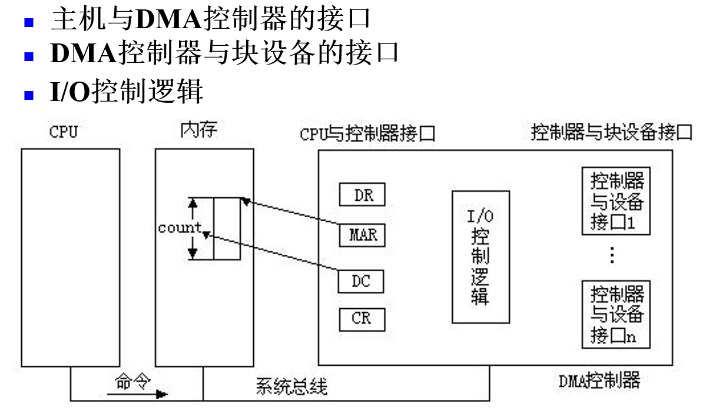


#### I/O通道控制方式

读/写多个不同的数据块

通道程序是由一系列通道命令构成的


### *缓冲管理

#### 引入

- 为了缓和CPU和I/O速度不匹配
- 减少CPU中断次数
- 解决数据粒度不匹配
- 提高并行性

#### 单缓冲和双缓冲

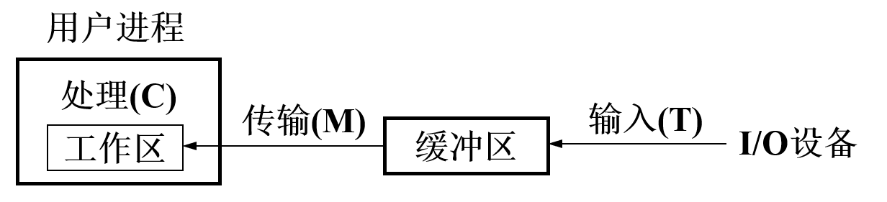

系统处理一块数据的时间可表示为**Max(T,C) + M**

##### 双缓冲

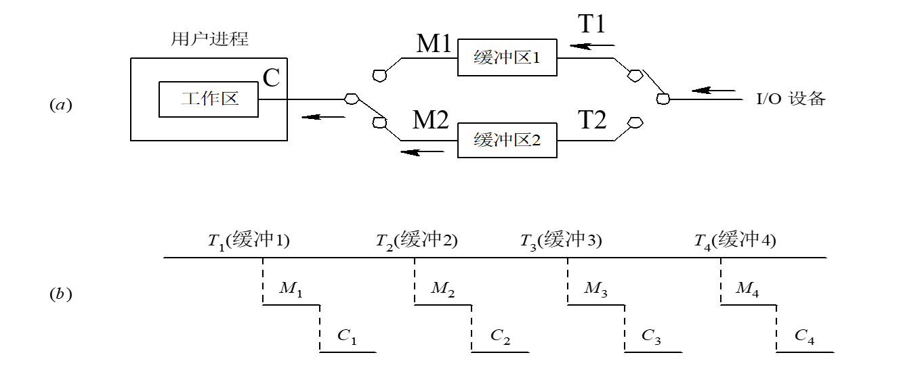

若C<T 处理一块数据的平均时间为Max(T,C+M)

若C>T 处理一块数据的平均时间大约为C+M


##### 循环缓冲

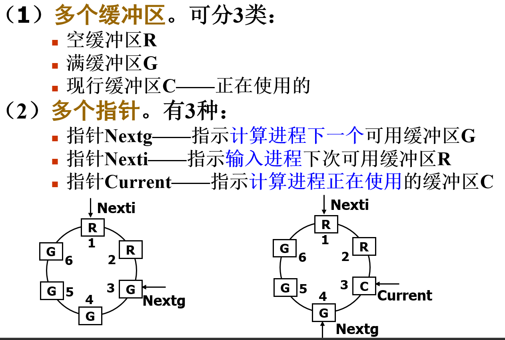


##### 缓冲池


工作方式：

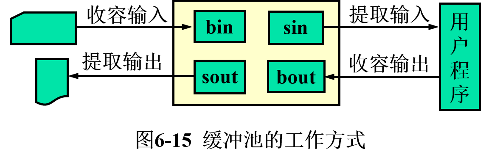


### 设备分配

**必须由系统统一分配**


#### 设备分配中的数据结构

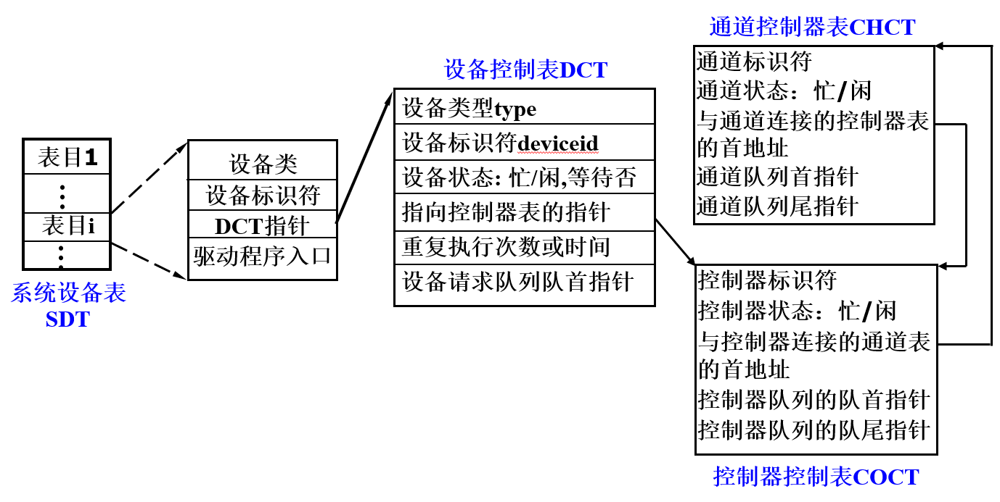

设备控制表DCT

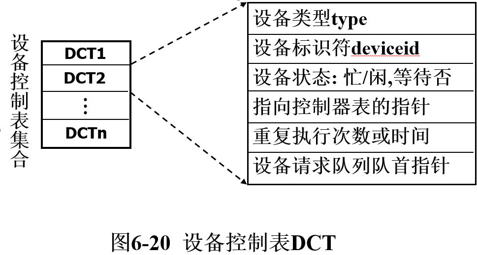

 控制器控制表COCT

 通道控制表CHCT

 系统设备表SDT

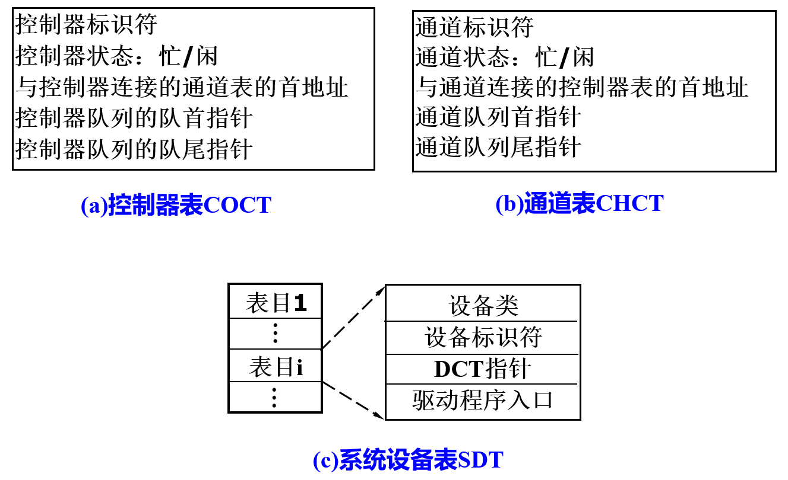


#### SPOOLing技术

主机的直接控制下，实现脱机输入、 输出功能。 此时的外围操作与CPU对数据的处理同时进行。 

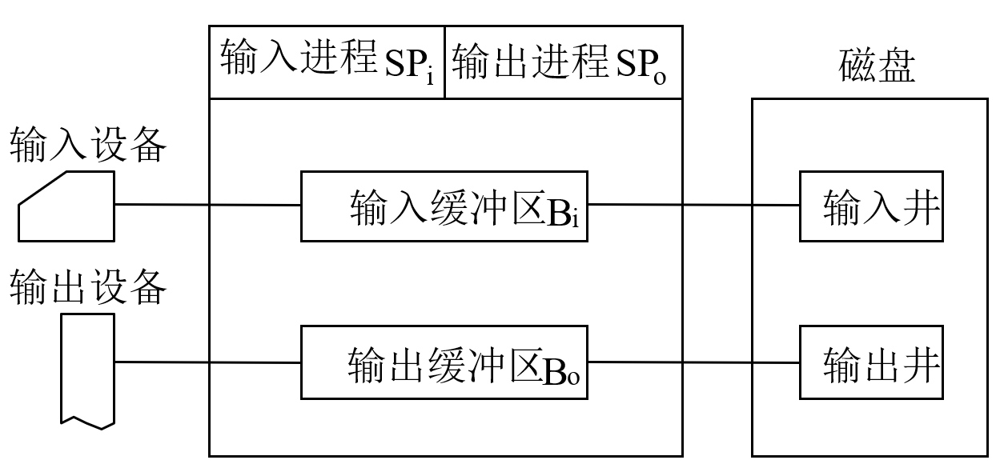

##### 组成

磁盘输入井和磁盘输出井：

磁盘输入井和磁盘输出井是磁盘中两块较大的存储区域；输入井用来模拟脱机输入时候的磁盘，暂时存储I/O输入设备的输入；输出井模拟脱机输出时候的磁盘，用来存储用户程序的输出

 

输入缓冲区和输出缓冲区：

在内存中开辟的两个区域，输入缓冲区用来暂存I/O设备的输入，再传送到输入井

输出缓冲区用来暂存从输出井送来的数据，再传送给输出设备


输入进程：用来模拟脱机输入时的外围控制机，在输入设备空闲时，将用户要求的数据从输入机通过输入缓冲区传送到输入井，当CPU需要数据时，再从输入井中读出数据

输出进程：用来模拟脱机输出时的外围控制机，在输出设备空闲时，将用户程序的数据从输出井中读到输出缓冲区中，并传送到输出设备中去


##### 意义

`提高了I/O速度 `：对数据所进行的I/O操作，从对低速I/O设备进行的I/O操作，演变为对输入井或输出井中数据的存取。

`将独占设备改造成共享设备`：在Spooling系统中，实际上并没有为任何进程分配设备，只是在输入井或输出井中为进程分配一个存储区和建立一张I/O请求表

`实现了虚拟设备功能`：将独占设备变换为若干台对应的逻辑设备的功能。  


### I/O软件系统层次模型

目标：

1. 隐藏物理细节
2. 与设备无关
3. 提高处理机和I/O设备的利用率
4. 对I/O设备控制
5. 错误处理
6. 保证设备的正确共享

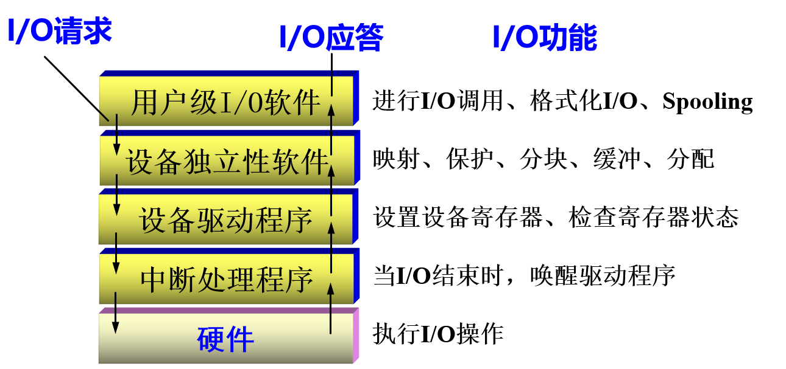


#### 中断处理程序

- 中断
  - 中断是指CPU对I/O设备发来的中断信号的一种响应。
  -  CPU暂停正在执行的程序，保留CPU环境后，自动  转去执行该I/O设备的中断处理程序。
    执行完后，再回到断点，继续执行原来的程序。
  - 这种中断是由外部设备引起的，一般称为外中断。
- 陷入（trap）
  - 由CPU内部事件引起的中断，如除零，越界访问等。
  - 与中断一样，若系统发现了有陷入事件，CPU也将暂停正在执行的程度，转去执行该陷入事件的处理序。
  - 中断事件来源于内部，通常称为内中断

**中断向量表**

为每种设备配以相应的中断处理程序，并把该程序的入口地址放在中断向量表的一个表项中


##### 中断处理步骤

1. 检测是否有未响应的中断信号
   1. 设备完成输入或输出后，发送请求
   2. 程序每执行完当前指令，处理机都要检测是否有信号，以便及时响应
2. 保护被中断进程的CPU环境
   1. 硬件自动将处理机状态和下一条指令地址保存在中断保留区
   2. 把被中断进程的 CPU 现场信息，即将包括所有 CPU 寄存器的（如通用寄存器、段寄存器等）内容都压入中断栈中。
3. 转入设备中断处理程序
   1. 找到引起本次中断的I/O设备，并发送确认
   2. 收到确认信号后，取消中断请求信号，将设备中断处理程序入口地址装到程序计数器中 
4. 中断处理
5. 恢复被中断进程CPU的现场并退出中断
   1. 当中断处理完成以后，需要恢复 CPU 的现场，退出中断。但是，此刻是否返回到被中断的进程，取决于两个因素：
   2. ①本中断是否采用了屏蔽（禁止）中断方式，若是，就会返回被中断的进程。
   3. ②采用的是中断嵌套方式，如果没有优先级更高的中断请求 I / O ，在中断完成后，仍会返回被中断的进程；反之，系统将处理优先级更高的中断请求。


#### 设备驱动程序

是I/O进程与设备控制器之间的通信程序

主要任务：

1. 接收上层软件发来的抽象I/O要求，转换为具体要求后发给设备控制器
2. 将设备控制器的信号传递给上层软件


功能：

- 接收由独立性软件发来的命令和参数，并将命令中的抽象要求转换为具体要求。例如，将磁盘块号转换为磁盘的盘面、磁道号和扇区号。
- 检查用户I/O请求的合法性、了解I/O设备状态、传递有关参数、设置设备工作方式 
- 发出I/O命令。如果设备空闲，便立即启动I/O设备去完成指定的I/O操作； 如果设备处于忙碌状态，则将请求者的请求块挂在设备队列上等待。
- 及时响应由控制器或通道来的中断请求，并根据其中断类型调用相应的中断处理程序。 
- 对于设置有通道的系统，驱动程序还应能自动地构成通道程序。


### 设备独立性软件

> 应用程序独立于具体使用的物理设备。

引入了逻辑设备和物理设备

从逻辑名到物理设备名映射的实现：

1. 逻辑设备表


### 磁盘存储器管理

#### 磁盘访问时间

1）寻道时间Ts:是指把磁臂（磁头）移动到指定磁道上所经历的时间。

2）旋转延迟时间Tτ：是指定扇区移动到磁头下面所经历的时间。 

3）传输时间Tt :是指把数据从磁盘上读出或向磁盘写入数据所经历的时间。

​               $$T_a=T_s+T_τ+T_t = (m \times n+s)+\frac 1 {2r}+\frac b{rN}        $$

n:移动磁道数    s:启动磁道臂时间

r:每秒的转数 

N：一条磁道的字节数

b:传输的字节数


#### 磁盘调度算法

目的是为了使平均寻道时间最少

1. 先来先服务FCFS
2. 最短寻道时间优先
   - 会有饿死
3. 扫描算法SCAN
   - 先按顺序扫描
   - 再反向扫描
4. 循环扫描CSCAN
   - 先按顺序扫描
   - 再直接跑到最外侧


### RAID分级

- RAID0
  - 数据分散存储在所有磁盘中
  - 并发IO
  - 不需要进行数据校验
  - n个磁盘组成的RAID0是单个磁盘的n倍性能
- RAID1
  - 分别写入工作磁盘和镜像，利用率为50%
  - 写入有影响，读取无影响
  - 数据保护
- RAID2
  - 纠错海明码磁盘阵列，其设计思想是利用海明码实现数据校验冗余。
- RAID3
  - RAID3是采用一个专用的磁盘作为校验盘，其余磁盘作为数据盘，数据按位可字节的方式交叉存储到各个数据盘中。
  - 并行从多个磁盘条带读取数据，性能非常高，同时还提供了数据容错能力。
  - RAID3 只需要一个校验盘，阵列的存储空间利用率高，再加上并行访问的特征，能够为高带宽的大量读写提供高性能，适用大容量数据的顺序访问应用，如影像处理、流媒体服务等
- RAID5
  - 将校验数据分散到所有的磁盘中
