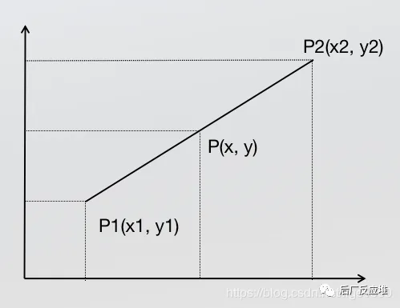
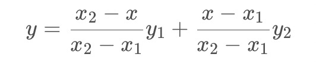
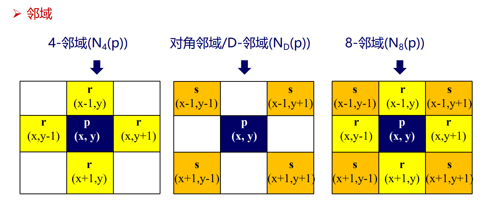
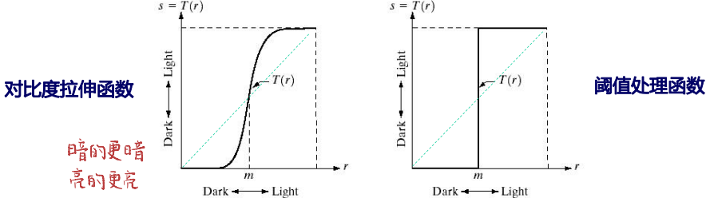
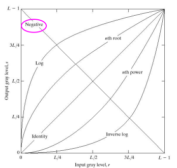
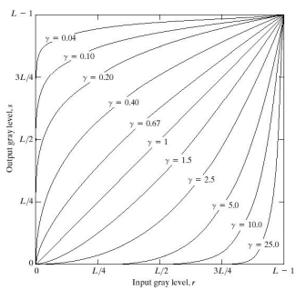
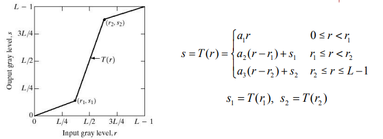
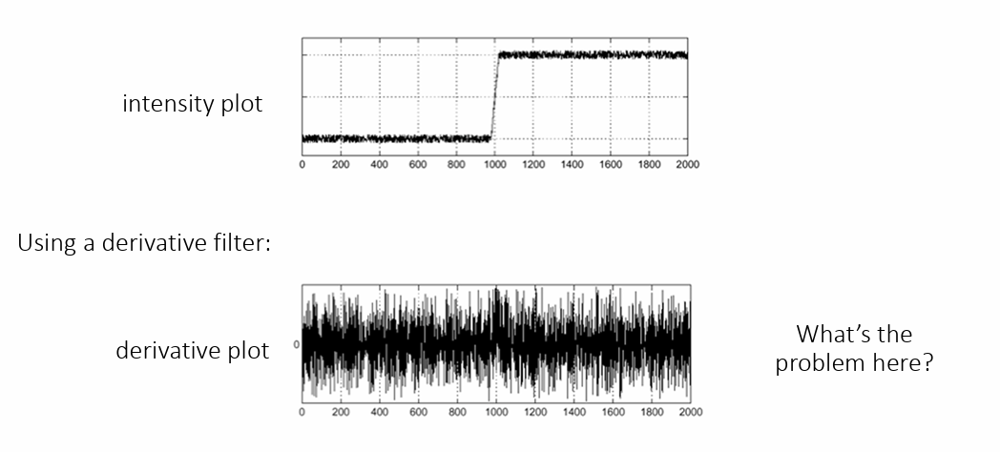

# 数字图像处理

## 基础

图像处理的三个层次：

- 图像处理：图像->图像
- 图像分析：图像->描述
- 图像识别：图像->语义

处理的是数字信号，在数学上是离散的

何凯明 去雾算法

期刊：CVPR ICCV ECCV

### 人眼视觉感知

人眼辨别亮度差别的能力，与环境亮度和本身亮度有关（马赫带效应）

人眼和照相机

- 眼帘=镜头盖
- 瞳孔=光圈
- 晶状体=透镜
- 视网膜=底片
- 视觉神经细胞（视感细胞，视锥细胞） vs 感光药膜

视杆细胞：只对光的振幅感兴趣，而对波长不敏感

视锥细胞：对波长敏感，分布在中央凹的位置，色盲的视锥细胞有不完善的地方

小孔成像

照射强度和反射强度

### 图像采样与量化

连续 ``（空间坐标连续+幅值连续）``->数字形式

采样：空间坐标的离散化。决定图像的 ``空间分辨率 ``

量化：图形幅值的数字化，决定图像的 ``幅度（灰度级）分辨率 ``

#### 空间与灰度分辨率

**空间分辨率：**离开空间单位谈图像大小没意义，所以我们尝试使用dpi描述图像分辨率

**灰度分辨率**：量化灰度的比特数

图像内插：调整图像大小、旋转、几何校正

- 下采样/收缩：行列删除
- 上采样/放大：创建新的像素位置

#### 图像放大

创建新的像素位置，对新位置上的像素赋值

- 最近邻插值：把原图中最邻近的灰度赋给每个新像素
- 优点：简单易行 速度快
- 缺点：容易产生马赛克效应

##### 单线性插值

已知中P1点和P2点，坐标分别为(x1, y1)、(x2, y2)，要计算 [x1, x2] 区间内某一位置 x 在直线上的y值

简单整理公式为以下格式，可以理解为分子距离x1和x2的距离

##### 双线性插值

用四个邻近位置上的灰度值估计给定位置的灰度值

##### 双三次插值

和双线性插值的映射方法差不多，需要16个点完成

### 像素间的一些基本关系

像素之间的关系：邻接、连接、连通、通路

像素集合之间的关系：邻接、连接、连通

#### 像素间的距离

欧式距离$$D_e$$：范数为2的距离。设像素p和q的坐标分别为(x,y)和(s,t)，他们之间的欧氏距离定义为：
$$
D_{\mathrm{E}}(p, q)=\sqrt{(x-s)^2+(y-t)^2}
$$
城区距离$D_4$ ：也叫曼哈顿距离，是范数为1的距离
$$
D_4(p, q)=|x-s|+|y-t|
$$
棋盘格距离$D_8$：也叫切比雪夫距离
$$
D_8(p, q)=\max \{|x-s|,|y-t|\}
$$

## 空间域图像增强

**灰度变换与空间滤波**

- 图像增强：对图像数据处理

  - 图像增强不改变图像内容，只是改变灰度分布

- 空间域图像增强：图像平面本身，直接对**像素**操作

  - $g(x,y)=T[f(x,y)]$

  - T变换的处理对象是某个邻域

    

- 变换域图像增强：通过数学变换将图像转换到变换域后进行处理，再转换回空间域

### 灰度变换函数

**图像反转变换**

$s=(l-1)-r$，s为新图像的灰度值，r为当前图像的灰度值

灰度图像：黑白颠倒  彩色图像：补色

 各种灰度变换函数 

**对数变换**

$s=c\log(1+r)$，c为常数，r非负

- 增强低灰度，抑制高灰度
- 应用：压缩图像的动态范围

暗区压缩，暗部变少

亮区压缩，亮部增加

**反对数变换**

$s=c/\log(1+r)$，c为常数，r为非负

**伽马（幂次）变化**

$s=cr^\gamma$，c,r为非负

- $\gamma<1$: 扩展暗像素值，压缩亮像素值
- $\gamma>1$: 压缩暗像素值，扩展亮像素值

**伽马校正**

某些设备 (ex: CRT) 的**电压-亮度**曲线近似为幂函数

经过伽马校正后的图像作为输入，更加接近真实显示值

**分段线性变换**

将灰度级划分为不同范围，每个范围采用不同的线性变换

主要形式：

- 对比度拉伸：提高图像灰度级的动态范围

  

- 灰度级分层（灰度切割）: 提高图像中特点灰度范围的亮度

- 比特平面分层（位图切割）：分析图像每个比特的相对重要性

  - 信息多存在于高层比特上

### 直方图处理

定义：描述每个灰度值的像素个数

**基于直方图的图像增强技术：**

- 直方图均衡
- 直方图规定化

#### 直方图均衡

定义：将原图像的直方图通过**灰度变换函数**$s=T(r)$对灰度修正，使得灰度概率密度函数(PDF)为均匀分布

目的：增加像素灰度值的动态范围，从而达到增强图像整体对比度的效果；把任意的直方图均衡化均匀的直方图

变换函数要求：

- 均匀分布且连续可微
- 单调递增

公式结论：

- 变换的连续形式：
  $$
  s=T(r)=(L-1)\int^r_0p_r(w)dw
  $$

- 公式的离散形式：

$$
s_k=T(r_k)=(L-1)\sum^k_{j=0}p_r(r_j)=\frac{L-1}{MN}\sum^k_{j=0}n_j \quad k=0,1,2,...,K-1
$$

小结：直方图均衡化

- **非线性拉伸**
- 增强对比度，不改变图像内容
- 有些灰度被拉断了，造成细节损失

#### 直方图规定化

定义：修改一幅图片直方图，使其与另一幅图像的直方图匹配或者具有一种预先规定的函数形状

目标：突出感兴趣的部分
$$
z=\boldsymbol{G}^{-1}(s)=\boldsymbol{G}^{-1}(T(r))
$$

### 空间滤波基础

空间域模板进行图像处理。模板本身被称为空域滤波器
$$
g(x, y)=\sum_{s=-a}^a \sum_{t=-b}^b w(s, t) f(x+s, y+t)
$$

#### 空间滤波与卷积

相关操作：
$$
w(x, y)\star f(x, y)=\sum_{s=-a}^a \sum_{t=-b}^b w(s, t) f(x+s, y+t)
$$
卷积操作：
$$
w(x, y) \star f(x, y)=\sum_{s=-a}^a \sum_{t=-b}^b w(s, t) f({x-s, y-t})
$$
向量表示：
$$
R=w_1 z_1+w_2 z_2+\ldots+w_{m n} z_{m n}=\sum_{k=1}^{m n} w_k z_k=\boldsymbol{w}^T \boldsymbol{Z}
$$

### 平滑空间滤波器

作用：

- 模糊处理：去除图像中一些不重要的细节
- 减少噪声

平滑空间滤波器分类：

- 平滑线性滤波器：均值滤波器
- 统计排序滤波器（非线性）：最大值滤波器，中值滤波器，最小值滤波器

加权均值滤波：
$$
g(x, y)=\frac{\sum_{s=-a t=-b}^a \sum^b w(s, t) f(x+s, y+t)}{\sum_{s=-a t=-b}^a \sum^b w(s, t)}
$$

### 锐化（高通）滤波器

用途：突出细节

一阶微分产生较粗的边缘，二阶微分产生双边缘

二级微分比一阶微分对细节有更为强烈的响应，易于实现

非锐化掩膜：

1. 模糊原图像
2. 从原图像中减去模糊后的图像
3. 模板与原图相加

Sobel算子：

1. 定义算子

2. 与图像卷积以达到求导：

$$
\frac{\delta f}{\delta x}S_x \otimes f \qquad \frac{\delta f}{\delta y}S_y \otimes f
$$

3. 计算梯度：

4. 边缘检测：根据梯度强度和方向来判断像素是否为边缘点。通常，可以根据梯度强度设置一个阈值，将梯度强度大于阈值的像素标记为边缘点，否则标记为非边缘点。

对噪声敏感：

为什么均值化会拉断？自适应均衡化

## 四、频率域滤波

问题的提出：偏微分方程(PDE)

法国数学家D`Almbert
$$
u(x, t)=f(x+c t)+g(x-c t)
$$
瑞士数学家 D.Bernoulli 
$$
u(x, t)=\sum_{n=0}^{\infty}\left[a_n \cos n x+b_n \sin n x\right]
$$

**信号正交：**

定义在$(t_1,t_2)$区间的$\varphi_1(t)$和$\varphi_2(t)$满足
$$
\int_{t_1}^{t_2}\phi_{1}( t) \phi{2}( t)  d_t= 0 \quad  (两函数的内积为0)
$$
则称$\varphi_{1}(t)$和$\varphi_2(t)$ 在区间($t_1,t_2$)内正交。

**正交函数集：**

函数集内任意两个不同的函数都满足正交，则称为**正交函数集**

**信号的正交分解：**

设有$n$个函数$\varphi_1(t)$,$\varphi_2(t),\cdots,\quad\varphi_n(t)$在区间$(t_1,t_2)$构成一个正交函数空间将任一函数$f(x)$用这$n$个正交函数的线性组合来近似, 可表示为

$$
f(t)\approx C_1\varphi_1+C_2\varphi_2+\cdots+C_n\varphi_n
$$

如何选择各系数$C_j$使$f(t)$与近似函数之间的误差在区间$(t_1,\quad t_2)$内为最小。通常使误差的方差均值(称为均方误差)最小。均方误差为

$$
{\overline{\varepsilon^2}=\frac1{t_2-t_1}\int_{t_1}^{t_2}[f(t)-\sum_{j=1}^nC_j\varphi_j(t)]^2\operatorname{d}t}
$$

为使上式最小（系数Cj变化时，即Cj为变量），有**Leibnitz准则（求偏导等于0处取最小值）**，有：
$$
\frac{\partial\overline{\varepsilon^2}}{\partial C_i}=\frac\partial{\partial C_i}\int{t_1}^{t_2}\left[f(t)-\sum{j=1}^nC_j\varphi_j(t)\right]^2\operatorname{d}t=0
$$

n要变得无穷小

无限多的三角函数的线性积分

时间意义上周期的，频谱意义上离散的

无限周期，频谱没办法离散

信号在时域上窄，频域上宽

正变换：把时域转换为频域

alt ctrl 截图 reisub

