# 数字图像处理

## 数字图像处理基础

图像处理的三个层次：

- 图像处理：图像->图像
- 图像分析：图像->描述
- 图像识别：图像->语义

处理的是数字信号，在数学上是离散的

何凯明 去雾算法

期刊：CVPR ICCV ECCV

### 人眼视觉感知

人眼辨别亮度差别的能力，与环境亮度和本身亮度有关（马赫带效应）

人眼和照相机

- 眼帘=镜头盖
- 瞳孔=光圈
- 晶状体=透镜
- 视网膜=底片
- 视觉神经细胞（视感细胞，视锥细胞） vs 感光药膜

视杆细胞：只对光的振幅感兴趣，而对波长不敏感

视锥细胞：对波长敏感，分布在中央凹的位置，色盲的视锥细胞有不完善的地方

#### 韦伯定律

$\Delta I_c$：照射分量

$I_c$：照射强度

韦伯比：$\Delta I_c/I_c$

> 较小的$\frac{\Delta I_c}{I_c}$值意味着可辩别亮度小百分比变化。这表示“较好”的亮度辨别能力。相反，较大的$\frac{\Delta I_c}{I_c}$意味着人眼检测变化时要求较大百分比的亮度变化。这表示“较差”的亮度辨别能力。

照射强度和反射强度

人眼辨别亮度的能力与环境亮度和本身亮度有关

### 图像采样与量化

连续 `（空间坐标连续+幅值连续）`->数字形式

采样：空间坐标的离散化。决定图像的 空间分辨率 

量化：图形幅值的数字化，决定图像的 `幅度（灰度级）分辨率 `

**动态范围 (Dynamic Range):**
动态范围是指在图像或场景中可分辨的最暗部分和最亮部分之间的亮度比例或范围。高动态范围（HDR）意味着图像包含了从非常暗到非常亮的广泛亮度级别，能够更好地捕捉现实世界中的亮度变化。低动态范围的图像则可能丢失细节，尤其是在极亮或极暗的区域。

**对比度 (Contrast):**
对比度是指图像中明暗区域之间的差异度。高对比度的图像具有更明显的亮暗区分，使图像看起来更加鲜明、有层次感。低对比度图像的亮暗区别不太明显，看起来较为平坦和模糊。对比度强调的是亮度差异的强度。

**饱和度 (Saturation):**
饱和度是指颜色的强度或纯度。高饱和度的图像颜色看起来更加鲜艳和明亮，而低饱和度的图像颜色则较为柔和、接近灰色。彩色图像的饱和度降低到最低点就变成了黑白图像。饱和度影响的是颜色的鲜艳程度，而不是亮度。

#### 空间与灰度分辨率

**空间分辨率：**离开空间单位谈图像大小没意义，所以我们尝试使用dpi描述图像分辨率

dpi：单位面积上像素点的个数

**灰度分辨率**：量化灰度的比特数，比如256个灰度级就是8bit

图像内插：调整图像大小、旋转、几何校正

- 下采样/收缩：行列删除
- 上采样/放大：创建新的像素位置

#### 图像放大

创建新的像素位置，对新位置上的像素赋值

##### 最近邻插值

- 把原图中最邻近的灰度赋给每个新像素
- 优点：简单易行 速度快
- 缺点：容易产生马赛克效应

##### 单线性插值

已知中P1点和P2点，坐标分别为(x1, y1)、(x2, y2)，要计算 [x1, x2] 区间内某一位置 x 在直线上的y值

简单整理公式为以下格式，可以理解为分子距离x1和x2的距离

##### 双线性插值

用四个邻近位置上的灰度值估计给定位置的灰度值

##### 双三次插值

和双线性插值的映射方法差不多，需要16个点完成

### 像素间的一些基本关系

像素之间的关系：邻接、连接、连通、通路

像素集合之间的关系：邻接、连接、连通

**集合 V**

就是一个集合，里面有一些自己定义的值，这些值对应图像的像素值。一个图像中，像素值属于集合V的**像素们**才能够彼此间邻接，形成通路。

#### 邻接

##### 4-邻接

- q和p互相在对方的邻域$N_4(p)$中，且他们都在V中取值

##### m-邻接

**IF** ( p和q是4邻接的 **OR** p和q是8邻接且p的四邻域和q的四邻域的交集中没有V中的元素)  **THEN** p和q是m邻接的

#### 像素间的距离

欧式距离$$D_e$$：范数为2的距离。设像素p和q的坐标分别为$(x,y)$和$(s,t)$，他们之间的欧氏距离定义为：
$$
D_{\mathrm{E}}(p, q)=\sqrt{(x-s)^2+(y-t)^2}
$$
城区距离$D_4$ ：也叫曼哈顿距离，是范数为1的距离
$$
D_4(p, q)=|x-s|+|y-t|
$$
棋盘格距离$D_8$：也叫切比雪夫距离
$$
D_8(p, q)=\max \{|x-s|,|y-t|\}
$$

### 所用数学工具

#### 线性操作

1. 若 $y=f(x)$ ，对于任意a，都有 $a\cdot y=f(a\cdot x)$
2. 若有 $y_1=f(x_1)$，$y_2=f(x_2)$，则有$y_1+y_2=f(x_1+x_2)$

#### 邻域操作

就是空间域操作

## 灰度变换与空间滤波

- 图像增强：对图像数据处理

  - 图像增强不改变图像内容，只是改变灰度分布

- 空间域图像增强：图像平面本身，直接对**像素**操作

  - $g(x,y)=T[f(x,y)]$

  - T变换的处理对象是某个邻域

    

- 变换域图像增强：通过数学变换将图像转换到**变换域**后进行处理，再转换回空间域

### 基本灰度变换函数

#### 图像反转变换

$s=(l-1)-r$，s为新图像的灰度值，r为当前图像的灰度值

灰度图像：黑白颠倒  彩色图像：补色

 各种灰度变换函数 

#### 对数变换

$s=c\log(1+r)$，c 为常数，r 非负

- 增强低灰度，抑制高灰度
- 应用：压缩图像的动态范围

暗区压缩，暗部变少

亮区压缩，亮部增加

#### 反对数变换

$s=c/\log(1+r)$，c为常数，r为非负

- 抑制低灰度级
- 增强高灰度级

#### 伽马（幂次）变化

$s=cr^\gamma$，c,r为非负，注意一下这里的$r$是(0,1)之间的数！

- $\gamma<1$: 压缩暗像素值，扩展亮像素值
- $\gamma>1$: 扩展暗像素值，压缩亮像素值

#### 伽马校正

某些设备 (ex: CRT) 的**电压-亮度**曲线近似为幂函数

经过伽马校正后的图像作为输入，更加接近真实显示值

#### 分段线性变换

将灰度级划分为不同范围，每个范围采用不同的线性变换

主要形式：

- 对比度拉伸：提高图像灰度级的动态范围

  

- 灰度级分层（灰度切割）: 提高图像中特定灰度范围的亮度

  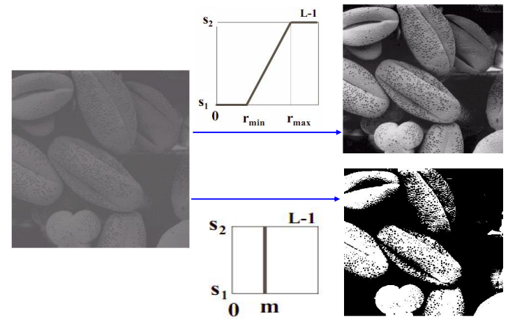

- 比特平面分层（位图切割）：分析图像每个比特的相对重要性

  - 信息多存在于高层比特上

### 直方图处理

定义：描述每个灰度值的像素个数

**基于直方图的图像增强技术：**

- 直方图均衡
- 直方图规定化

归一化直方图：$h(r_k)=\frac{n_k}{n}$。n为图像总像素个数

#### 直方图均衡

定义：将原图像的直方图通过**灰度变换函数** $s=T(r)$ 对灰度修正，使得灰度概率密度函数(PDF)为均匀分布

目的：增加像素灰度值的动态范围，从而达到增强图像整体对比度的效果；把任意的直方图均衡化均匀的直方图

**适合用于增强直方图呈 尖峰 分布的图像**

变换函数要求：

- 均匀分布且连续可微
- 单调递增

公式结论：

- 变换的连续形式：
  $$
  s=T(r)=(L-1)\int^r_0p_r(w)dw
  $$

- 公式的离散形式：

$$
s_k=T(r_k)=(L-1)\sum^k_{j=0}p_r(r_j)=\frac{L-1}{MN}\sum^k_{j=0}n_j \quad k=0,1,2,...,K-1
$$

##### 证明

1. 假设 概率密度函数 $P_r(r)$ 和变换函数 $T(r)$已知，可以的得到一个简单的公式：
   $$
   P_s(s)=P_r(R)\abs{\frac{dr}{ds}}
   $$
   

   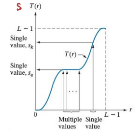

2. $T(r)$ 可以由$r$的概率密度函数求积分的得出的
   $$
   s=T(r)=(L-1)\int^r_0p_r(w)dw
   $$

3. 由莱布尼茨公式可得：
   $$
   \frac{ds}{dr} = \frac{dT(r)}{r}=\frac{d}{dr}[\int^r_0p_r(w)dw]=p_r(r)
   $$

4. 带入 1中公式可得 $P_s(s)=1$，说明变换后的函数一定是均匀的

##### 计算

先求归一化直方图，然后求累计直方图（累积分布函数（CDF）），之后将每个灰度级直接乘以$L-1$，四舍五入取整

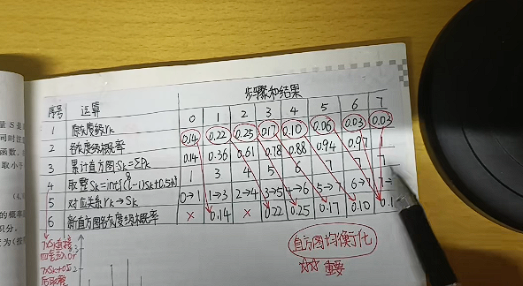

##### 小结

- **非线性拉伸**
- 增强对比度，不改变图像内容
- 有些灰度被拉断了，造成细节损失，高对比度的图拉伸后变差

#### 直方图规定化

定义：修改一幅图片直方图，使其与另一幅图像的直方图匹配或者具有一种预先规定的函数形状

目标：突出感兴趣的部分

步骤：

1. 计算原图像的累积分布函数（CDF）:
   $$
   s_k= T(r) = \int^r_0p_r(w)dw
   $$

2. 计算待匹配直方图的累积分布函数G**(CDF)**：
   $$
   G(z_	q)=\int^z_0p_z(t)dt
   $$

3. G 满足一定条件且存在逆函数，所以存在原图像到目标图像的变换

$$
z=\boldsymbol{G}^{-1}(s)=\boldsymbol{G}^{-1}(T(r))
$$

直方图规定化更多的是一个试凑的过程，需要不断尝试不同的目标直方图

**注意：**上面的公式都是假设灰度级是连续的，在实际图像中，灰度级已经被离散化了，所以不能直接积分，需要求累计和

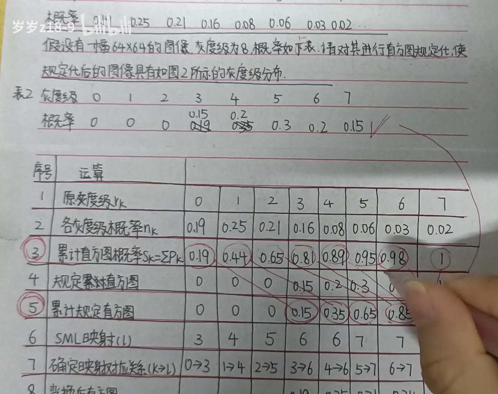

### 空间滤波基础

空间域模板进行图像处理。模板本身被称为空域滤波器（掩膜mask/核/模板/窗口）
$$
g(x, y)=\sum_{s=-a}^a \sum_{t=-b}^b w(s, t) f(x+s, y+t)
$$

#### 空间滤波与卷积

相关操作：
$$
w(x, y)\star f(x, y)=\sum_{s=-a}^a \sum_{t=-b}^b w(s, t) f(x+s, y+t)
$$
卷积操作（核以中心反转，再进行相乘）：
$$
w(x, y) \star f(x, y)=\sum_{s=-a}^a \sum_{t=-b}^b w(s, t) f({x-s, y-t})
$$
向量表示：
$$
R=w_1 z_1+w_2 z_2+\ldots+w_{m n} z_{m n}=\sum_{k=1}^{m n} w_k z_k=\boldsymbol{w}^T \boldsymbol{Z}
$$

### 平滑（低通）空间滤波器

作用：

- 模糊处理：去除图像中一些不重要的细节
- 减少噪声

平滑空间滤波器分类：

- 平滑线性滤波器：均值滤波器
- 统计排序滤波器（非线性）：最大值滤波器，中值滤波器，最小值滤波器

加权均值滤波：
$$
g(x, y)=\frac{\sum_{s=-a t=-b}^a \sum^b w(s, t) f(x+s, y+t)}{\sum_{s=-a t=-b}^a \sum^b w(s, t)}
$$

高斯滤波器：
$$
G(x) = \frac{1}{\sqrt{2\pi}\sigma} e^{-\frac{x^2}{2\sigma^2}}
$$
二维高斯函数：
$$
G(x, y) = \frac{1}{2\pi\sigma^2} e^{-\frac{x^2 + y^2}{2\sigma^2}}
$$

### 锐化（高通）空间滤波器

用途：突出细节

一阶微分产生较粗的边缘，二阶微分产生双边缘

二级微分比一阶微分对细节有更为强烈的响应，易于实现

一阶微分定义：
$$
\frac{\partial f}{\partial x}=f(x+1)-f(x)
$$
二阶微分定义：
$$
\dfrac{\partial^2f}{\partial x^2}=f(x+1)+f(x-1)-2f(x)
$$
我们最关注的是各向同性滤波器，滤波器具有旋转不变性

#### 拉普拉斯算子

$$
\nabla^2 f = \frac{\partial^2 f}{\partial x^2} + \frac{\partial^2 f}{\partial y^2}
$$

非锐化掩膜：

1. 模糊原图像
2. 从原图像中减去模糊后的图像
3. 模板与原图相加

#### 梯度

Sobel算子：

1. 定义算子

2. 与图像卷积以达到求导：

$$
\frac{\delta f}{\delta x}S_x \otimes f \qquad \frac{\delta f}{\delta y}S_y \otimes f
$$

3. 计算梯度：

4. 边缘检测：根据梯度强度和方向来判断像素是否为边缘点。通常，可以根据梯度强度设置一个阈值，将梯度强度大于阈值的像素标记为边缘点，否则标记为非边缘点。

对噪声敏感：

为什么均值化会拉断？自适应均衡化

## 频率域滤波

问题的提出：偏微分方程(PDE)

法国数学家D`Almbert
$$ {3.1}
u(x, t)=f(x+c t)+g(x-c t) \tag{3.1}
$$
瑞士数学家 D.Bernoulli 
$$
u(x, t)=\sum_{n=0}^{\infty}\left[a_n \cos n x+b_n \sin n x\right]\tag{3.2}
$$

### 信号正交

定义在$(t_1,t_2)$区间的$\varphi_1(t)$和$\varphi_2(t)$满足
$$
\int_{t_1}^{t_2}\phi_{1}( t) \phi{2}( t)  d_t= 0 \quad  (两函数的内积为0) \tag{3.3}
$$
则称$\varphi_{1}(t)$和$\varphi_2(t)$ 在区间($t_1,t_2$)内正交。

**正交函数集：**

函数集内任意两个不同的函数都满足正交，则称为**正交函数集**

**信号的正交分解：**

设有$n$个函数$\varphi_1(t)$,$\varphi_2(t),\cdots,\quad\varphi_n(t)$在区间$(t_1,t_2)$构成一个正交函数空间将任一函数$f(x)$用这$n$个正交函数的线性组合来近似, 可表示为：

$$
f(t)\approx C_1\varphi_1+C_2\varphi_2+\cdots+C_n\varphi_n \tag{3.4}
$$

如何选择各系数$C_j$使$f(t)$与近似函数之间的误差在区间$(t_1,\quad t_2)$内为最小。通常使误差的方差均值(称为均方误差)最小。均方误差为

$$
{\overline{\varepsilon^2}=\frac1{t_2-t_1}\int_{t_1}^{t_2}[f(t)-\sum_{j=1}^nC_j\varphi_j(t)]^2\operatorname{d}t} \tag{3.5}
$$

为使上式最小（系数$C_j$变化时，即$C_j$为变量），有**Leibnitz准则（求偏导等于0处取最小值）**，有：
$$
\frac{\partial\overline{\varepsilon^2}}{\partial C_i}=\frac{1}{t_2-t_1}\frac\partial{\partial C_i}\int_{t_1}^{t_2}\left[f(t)-\sum_{j=1}^nC_j\varphi_j(t)\right]^2\operatorname{d}t=0 \tag{3.6}
$$

展开被积函数，由于**正交性（相乘为0）** ，以及前面的系数，只有两项不为0：
$$
\frac{\partial}{\partial C_i} \int_{t_1}^{t_2}\left[-2 C_i f(t) \varphi_i(t)+C_i^2 \varphi_i^2(t)\right] \mathrm{d} t=0 \\
即：-2 \int_{t_1}^{t_2} f(t) \varphi_i(t) \mathrm{d} t+2 C_i \int_{t_1}^{t_2} \varphi_i^2(t) \mathrm{d} t=0 \tag{3.7}
$$

想要使方差最小，第$i$项$φ_i$的系数$C_i$应该如下取值：
$$
C_i=\frac{\int_{t_1}^{t_2} f(t) \varphi_i(t) \mathrm{d} t}{ \int_{t_1}^{t_2} \varphi_i^2(t) \mathrm{d} t}=\frac{1}{K_i} \int_{t_1}^{t_2} f(t) \varphi_i(t) \mathrm{d} t \quad K_1=\int_{t_1}^{t_2} \varphi^2_i(t) \mathrm{d} t \tag{3.7}
$$

欧拉公式：$e^{i\theta}=\cos\theta+i\sin\theta$

可以用求导证明

### 傅里叶分析

傅里叶分析可分为傅里叶级数（Fourier Serie）和傅里叶变换(Fourier Transformation)

傅里叶分析的作用：

在时域看似不可能做到的数学操作，在频域相反很容易。这就是需要傅里叶变换的地方。尤其是从某条曲线中去除一些特定的频率成分，也就是称为滤波。

不同频率的正弦波我们成为频率分量，如果第一个频率最低的频率分量为 1 ，我们就有了构造频域的最基本单位

那么频域的“0”是什么呢？cos（0t）就是一个周期无限长的正弦波，也就是一条直线！所以在频域，0频率也被称为直流分量，在傅里叶级数的叠加中，它仅仅影响全部波形相对于数轴整体向上或是向下而不改变波的形状。

一个矩形波在频域里面的样子：

清楚一点：

#### 傅里叶级数

具有周期$T$的连续变量$t$的周期函数$f(t)$可表述为适当的三角函数之和：
$$
\begin{aligned}&f(t)=\sum_{n=-\infty}^\infty{{c_n}\mathrm{e}^{j\frac{2\pi n}Tt}} \\
&傅里叶系数：
c_n=\frac{1}{T}\int_{-T/2}^{T/2}f(t)\mathrm{e}^{-j\frac{2\pi n}{T}t}\mathrm{d}t\end{aligned}  \tag{3.8}
$$

#### 傅里叶变换（Fourier Transformation）

傅里叶级数，在时域是一个周期且连续的函数，而在频域是一个非周期离散的函数。这句话比较绕嘴，实在看着费事可以干脆回忆第一章的图片。

而傅里叶变换，则是将一个时域非周期的连续信号，转换为一个在频域非周期的连续信号。

原来离散谱的叠加，变成了连续谱的累积。所以在计算上也从求和符号变成了积分符号。

**连续单变量函数的傅里叶变换**
$$
\begin{aligned}
& f(t)=\mathfrak{F}^{-1}\{F(u)\}=\int_{-\infty}^{\infty} F(u) \mathrm{e}^{j 2 \pi u t} \mathrm{~d} u &傅里叶逆变换 \\
& F(u)=\mathfrak{F}\{f(t)\}=\int_{-\infty}^{\infty} f(t) \mathrm{e}^{-j 2 \pi u t} \mathrm{~d} t  &傅里叶变换 
\end{aligned} \tag{3.9}
$$

时域是复频域投影到频域中的各成分的累积

> 举个例子

对如下函数做傅里叶变换：

由图可以知：$f(x)= \begin{cases}A & x>-W / 2 \& x<W / 2 \\ 0 & x<-W / 2 \mid x>W / 2\end{cases}$

代入傅里叶变换公式(3.9)：
$$
\begin{aligned}
F(\mu) & =\int_{-\infty}^{\infty} f(t) e^{-j 2 \pi \mu t} d t=\int_{-W / 2}^{W / 2} A e^{-j 2 \pi \mu t} d t \\
& =\frac{-A}{j 2 \pi \mu}\left[e^{-j 2 \pi \mu t}\right]_{-w / 2}^{W / 2}=\frac{-A}{j 2 \pi \mu}\left[e^{-j \pi \mu W}-e^{j \pi \mu W}\right] \\
& =\frac{A}{j 2 \pi \mu}\left[e^{j \pi \mu W}-e^{-j \pi \mu W}\right] \\
& =A W \frac{\sin (\pi \mu W)}{(\pi \mu W)}
\end{aligned}
$$
最终得到 $sinc$ 函数的曲线：

通常，傅里叶变换包含了复数项，且为了显示目的，通常处理该变换的幅值（一个实量），该幅值称为傅里叶谱或频谱：
$$
|F(\mu)|=AW\left|\frac{\sin(\pi\mu W)}{(\pi\mu W)}\right|
$$

### 取样与采样函数的傅里叶变换

> 狄拉克函数：幅度无限，持续时间为0，具有单位面积和尖峰信号

#### 冲击函数极其特性

**连续变量$t$在$t=0$处的单位冲击被定义为：**
$$
\begin{array}{ll}
\delta(t)=  \begin{cases}\infty, & t=0 \\
0, & t \neq 0\end{cases} \\
\text { s.t. } \quad \int_{-\infty}^{\infty} \delta(t) \mathrm{d} t=1
\end{array} \tag{3.10}
$$
单位冲击具有取样特性$\int_{-\infty}^{\infty}f(t)\delta(t)dt=f(0)$

**离散变量$x$在$x=0$处的冲击函数：**
$$
\begin{array}\delta(x)=  \begin{cases}1, & x=1 \\
0, & x \neq 0\end{cases} \\
\text { s.t. } \quad \sum_{x=-\infty}^{\infty} \delta(x)=1 \end{array}  \tag{3.11}
$$
在$x=x_0$处的冲击采样：
$$
\sum_{x=-\infty}^\infty f(x)\delta(x-x_0)\mathrm{d}x=f(x_0) \tag{3.12}
$$
**冲击串函数：**
$$
s_{\Delta T}(t)=\sum_{n=-\infty}^{\infty} \delta(t-n \Delta T) \tag{3.13}
$$
冲击函数的采样，通常这里的求和函数表示的是集合：
$$
\tilde{f}(t)=f(t) s_{\Delta T}(t)=\sum_{n=-\infty}^{\infty} f(t) \delta(t-n \Delta T) \tag{3.14}
$$
**冲激函数**$\delta(t)$傅里叶变换为：
$$
F(\mu)=\int_{-\infty}^\infty\delta(t)\mathrm{e}^{-\mathrm{j}2\pi\mu t}\mathrm{d}t=\int_{-\infty}^\infty\mathrm{e}^{-\mathrm{j}2\pi\mu t}\delta(t)\mathrm{d}t=\mathrm{e}^{-\mathrm{j}2\pi\mu0}=\mathrm{e}^0=1 \tag{3.15}
$$
**这个变换表示，位于原点的单位冲激函数在频率域是一个常数**。

$t=t_0$处的冲激函数的傅里叶变换为：
$$
F(\delta\left(t-t_0\right))=\int_{-\infty}^\infty\delta\left(t-t_0\right)\mathrm{e}^{-\mathrm{j}2\pi\mu t}\mathrm{d}t=\int_{-\infty}^\infty\mathrm{e}^{-\mathrm{j}2\pi\mu t}\delta\left(t-t_0\right)\mathrm{d}t=\mathrm{e}^{-\mathrm{j}2\pi\mu t_0} \tag{3.16}
$$
**它表示了以复平面原点为中心的单位圆**

由傅里叶变换对定义可得$f(t)$的傅里叶变换为$F(u)$，则在点$t$求值后函数是$F(t)$，$F(t)$的傅里叶变换为$f(-u)$；
$$
\begin{array}F(\delta\left(t-t_0\right)) = e^{-\text{j}2\pi\mu t_0} \\
F(e^{-\text{j}2\pi t t_0}) = \delta\left(-\mu-t_0\right) \end{array} \tag{3.17}
$$

**冲击串**的傅里叶级数：$$s_{\Delta T}(t)=\sum_{n=-\infty}^{\infty}\delta(\boldsymbol{x}-n\Delta T)$$
$$
\begin{aligned}
&s_{\Delta T}(t) =\sum_{n=-\infty}^{\infty}c_{n}\mathrm{e}^{\mathrm{j}\frac{2\pi n}{\Delta T}t}  
,\quad{\text{其中 }c_{n}} =\frac{1}{\Delta T}\int_{-\Delta T/2}^{\Delta T/2}s_{\Delta T}(t)\mathrm{e}^{-j\frac{2\pi n}{\Delta T}t}\mathrm{d}t =\frac 1 {\Delta T}e^0=\frac 1{\Delta T}\\&所以：s_{\Delta T}(t)=\sum^\infty_{n=-\infty} \frac{1}{\Delta T} \mathrm{e}^{j \frac{2 \pi n}{\Delta T} t}
\end{aligned} \tag{3.18}
$$

**周期为 $\Delta T$ 的冲激串的傅里叶变换还是冲激串，其周期是 $1/\Delta T$ , $s_{\Delta T}(t)$ 和 $S(\mu)$ 之间呈现周期反比关系。**

#### 卷积

空域卷积公式：
$$
f(t) \star h(t)=\int_{-\infty}^{\infty} f(\tau) h(t-\tau) \mathrm{d} \tau \tag{3.19}
$$
将(3.18)带入傅里叶变换公式(3.9)：
$$
\begin{aligned}
\mathfrak{F}\{f(t) \star h(t)\} & =\int_{-\infty}^{\infty}\left[\int_{-\infty}^{\infty} f(\tau) h(t-\tau) \mathrm{d} \tau\right] \mathrm{e}^{-j 2 \pi u t} \mathrm{~d} t \\
& =\int_{-\infty}^{\infty} f(\tau)\left[\int_{-\infty}^{\infty} h(t-\tau) \mathrm{e}^{-j 2 \pi u t} \mathrm{~d} t\right] \mathrm{d} \tau \\
& =\int_{-\infty}^{\infty} f(\tau) \mathrm{e}^{-j 2 \pi u \tau}\left[\int_{-\infty}^{\infty} h(t-\tau) \mathrm{e}^{-j 2 \pi u(t-\tau)} \mathrm{d} t\right] \mathrm{d} \tau \\
& =\int_{-\infty}^{\infty} f(\tau) \mathrm{e}^{-j 2 \pi u \tau} H(u) \mathrm{d} \tau \\
& =F(u) H(u)
\end{aligned} \tag{3.20}
$$
由此得证：

- 对时域内两个函数卷积做傅里叶变换 = 频域内两个函数相乘

- 时域内两个函数相乘 = 对频域内两个函数卷积做傅里叶逆变换

#### 取样函数的傅里叶变换

由公式(3.14)可知冲击串取样函数：$$\tilde{f}(t)=f(t)s_{\Delta T}(t)=\sum_{n=-\infty}^{\infty}f(t)\delta(t-n\Delta T)$$

傅里叶变换：$$\tilde{F}(u)=\mathfrak{F}\{\tilde{f}(t)\}=\mathfrak{F}\{f(t)s_{\Delta T}(t)\}=F(u)\star\boxed{S(u)}$$

先求$S(u)$与冲击串函数(3.13)的关系，将冲击串的傅里叶级数(3.18)代入，由傅里叶变换对(3.17)的性质可以得到：
$$
S(u)=\mathfrak{F}\left\{\sum_{n=-\infty}^{\infty} \frac{1}{\Delta T} \mathrm{e}^{j \frac{2 \pi n}{\Delta T} t}\right\}=\int_{-\infty}^{\infty}\left\{\sum_{n=-\infty}^{\infty} \frac{1}{\Delta T} \mathrm{e}^{j \frac{2 \pi n}{\Delta T}}\right\} \mathrm{e}^{-j 2 \pi u t} \mathrm{~d} t=\frac{1}{\Delta T} \sum_{n=-\infty}^{\infty} \delta\left(u-\frac{n}{\Delta T}\right) \tag{3.21}
$$
将卷积公式(3.19)和(3.21)带入，由冲击串采样的采样函数(3.14)可得：
$$
\begin{aligned}
\tilde{F}(u) & =F(u) \star S(u)=\int_{-\infty}^{\infty} F(\tau) S(u-\tau) \mathrm{d} \tau=\frac{1}{\Delta T} \int_{-\infty}^{\infty} F(\tau) \sum_{n=-\infty}^{\infty} \delta\left(u-\tau-\frac{n}{\Delta T}\right) \mathrm{d} \tau \\
& =\frac{1}{\Delta T} \sum_{n=-\infty}^{\infty} \int_{-\infty}^{\infty} F(\tau) \delta\left(u-\tau-\frac{n}{\Delta T}\right) \mathrm{d} \tau=\frac{1}{\Delta T} \sum_{n=-\infty}^{\infty} F\left(u-\frac{n}{\Delta T}\right)
\end{aligned} \tag{3.22}
$$
取样函数和傅里叶变换后函数均为周期函数，取样函数的周期为${\Delta T}$，傅里叶变换后周期为$\frac{1}{\Delta T}$

**带限函数：**对于函数$f(t)$，如果傅里叶变换后函数是以原点为中心，具有有限区域$[-u_\min,u_\max]$，区域之外的频率值为0，则称函数$f(t)$为带限函数

带限函数恢复条件：$\frac{1}{\Delta T}\ge 2u_{\max}（奈奎斯特采样定理）$

问题：如何根据$\tilde F(u)$恢复$f(t)$

1. 将$\tilde F(u)$变成带限函数，必须要带限函数才能恢复
   $$
   \begin{aligned}
   & H(u)= \begin{cases}\Delta T, & -u_{\max } \leq u \leq u_{\max } \\
   0, & \text { otherwise }\end{cases} \\
   & F(u)=H(u) \tilde{F}(u)
   \end{aligned} \tag{3.23}
   $$

2. 利用傅里叶反变换复原$f(t)$
   $$
   f(t)=\mathfrak{F}^{-1}\{F(u)\}=\int_{-\infty}^{\infty} F(u) \mathrm{e}^{j 2 \pi u t} \mathrm{~d} u \tag{3.24}
   $$
   或者使用卷积定理复原$f(t)$
   $$
   \begin{aligned}
   & f(t)=\mathfrak{F}^{-1}\{F(u)\}=\mathfrak{F}^{-1}\{H(u) \tilde{F}(u)\}=h(t) \star \tilde{f}(t) \\
   & f(t)=\sum^{\infty}_{n=\infty} f(n \Delta T) \operatorname{sinc}[(t-n \Delta T) / \Delta T]
   \end{aligned} \tag{3.25}
   $$

分别在时域和频率域看看这件事情：

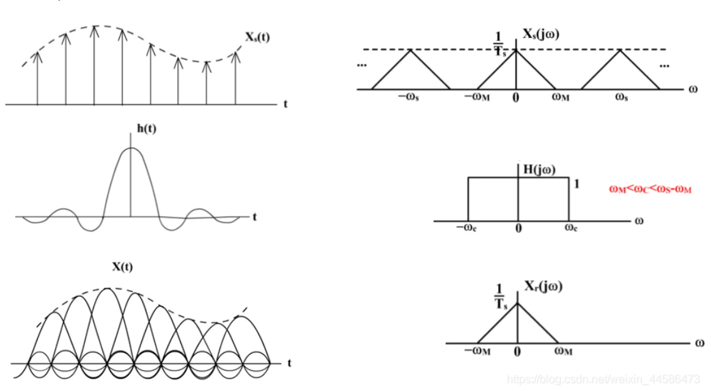

左边是理想的重建函数样子。

如果用低于最高频率的两倍取样率对带限函数进行取样，会产生混淆：

如最后一个图，频率受到邻近周期的破坏

### 单变量的离散傅里叶变换 (DFT)

取样是为了把时域的连续函数变为计算机中可以处理的离散点

一个在时域上的离散函数，傅里叶变换后它的频域上的变换可以是连续的，并且是周期的。

时域上连续函数取样后的函数是变成离散的计算机可以处理的数据了，但是傅里叶变换后的频域上还是连续的啊。怎么让计算机连频域上的数据都可以处理呢？对！老方法再用一次，对频域信号进行采样呗~

取样函数：$\tilde{f}(t)=f(t)s_{\Delta T}(t)=\sum_{n=-\infty}^{\infty}f(t)\delta(t-n\Delta T)$

对取样函数做傅里叶变换，由单位冲激函数采样(3.10)可得结果：
$$
\begin{aligned}
\tilde{F}(u)& =\mathfrak{F}\{\tilde{f}(t)\}=\int_{-\infty}^{\infty}\sum_{n=-\infty}^{\infty}f(t)\delta(t-n\Delta T)\mathrm{e}^{-j2\pi ut}\mathrm{d}t  \\
&=\sum_{n=-\infty}^{\infty}\int_{-\infty}^{\infty}f(t)\delta(t-n\Delta T)\mathrm{e}^{-j2\pi ut}\mathrm{d}t=\sum_{n=-\infty}^{\infty}f_{n}\mathrm{e}^{-j2\pi u\Delta T} \\
&f_n=\int_{-\infty}^{\infty}f(t)\delta(t-n\Delta T)\mathrm{d}t=f(n\Delta T)
\end{aligned} \tag{3.26}
$$

时域离散函数的傅里叶变换是周期为$\frac 1{ \Delta T}$的无限周期连续函数

假设我们想要在周期 $\mu=0$ 到 $\mu=1/\Delta T$ 之间得到的 $\tilde{F}(\mu)$ 的 $M$ 个等间距样本，可以通过加如下频率处取样得到：

$$
\mu=\frac m{M\Delta T},\quad m=0,1,2,\cdots,M-1 \tag{3.27}
$$
>  注：
>  这里已经开始对频率域的 $\tilde{F}(\mu)$ 进行一个周期采样啦。

把 $\mu$ 代入上式，我们用 $F_m$ 表示得到的结果：

$$
F_m=\sum_{n=0}^{M-1}f_n\mathrm{e}^{-\mathrm{j}2\pi mn/M},\quad m=0,1,2,\cdots,M-1 \tag{3.28}
$$
这已经是我们定义的DFT啦！

$u,v$表示频率$x,y$ 表示坐标
$$
\begin{array}离散傅里叶变换：& F_{m}=\sum_{n=0}^{M-1}f_{n}\mathrm{e}^{-j2\pi mn/M}\:,& m=0,1,2,\cdots\:,M-1\\

离散傅里叶反变换：& f_{n}=\frac{1}{M}\sum_{n=0}^{M-1}F_{m}\mathrm{e}^{j2\pi mn/M}\:,& n=0,1,2,\cdots\:,M-1  \end{array} \tag{3.29}
$$

$$
\begin{array}离散傅里叶变换： & F(u)=\sum^{M-1}_{x=0}f(x)e^{−j2πux/M} &u=0,1,2,\cdots,M-1 \\
离散傅里叶反变换:& f(x)=\frac{1}{M}\sum_{n=0}^{M−1}F(u)e^{j2\pi ux/M}&  x=0,1,2,⋯,M−1 \end{array} \tag{3.30}
$$

### 双变量函数的傅里叶变换 (DFT)

双连续变量的冲激函数及其取样特性：
$$
\begin{array}\delta(t,z)=\left\{\begin{array}{ll}\infty,&t=z=0\\0,&x\neq0\end{array}\right.\\\text{s.t.}\quad\int_{-\infty}^{\infty}\int_{-\infty}^{\infty}\delta(t,z)\mathrm{d}t\mathrm{d}z=1 \end{array} \tag{3.31}
$$
取样特性：
$$
\begin{aligned}\int_{-\infty}^\infty\int_{-\infty}^\infty f(t,z)\delta(t,z)\mathrm{d}t\mathrm{d}z&=f(0,0)\\\\\int_{-\infty}^\infty\int_{-\infty}^\infty f(t,z)\delta(t-t_0,z-z_0)\mathrm{d}t\mathrm{d}z&=f(t_0,z_0)\end{aligned} \tag{3.32}
$$
2D DFT 及 IDFT
$$
\begin{aligned}F(u,v)&=\sum_{x=0}^{M-1}\sum_{y=0}^{N-1}f(x,y)\mathrm{e}^{-j2\pi(ux/M+vy/N)}\\\\f(x,y)&=\frac{1}{{MN}}\sum_{u=0}^{M-1}\sum_{v=0}^{N-1}F(u,v)\mathrm{e}^{j2\pi(ux/M+vy/N)}\end{aligned}
$$

### 二维离散傅里叶变换的一些性质

**空间与频率间隔的关系：**
$$
\begin{aligned}\Delta u&=\frac{1}{M\Delta T}\\\\\Delta v&=\frac{1}{N\Delta Z}\end{aligned}
$$
**平移：**
$$
f(x,y)\mathrm{e}^{j2\pi(u_0x/M+v_0y/N)} \Leftrightarrow F(u-u_0,v-v_0)\\ f(x-x_0,y-y_0)\Leftrightarrow F(u,v)\mathrm{e}^{-j2\pi(u_0x/M+v_0y/N)}
$$

平移对频谱无影响，但影响相位谱；相位谱携带图像中物体的定位信息

旋转同时影响频谱和相位谱

### 频率域滤波基础

由二维离散傅里叶变换图像的频率域表示：$F(u,v)=\sum_{x=0}^{M-1}\sum_{y=0}^{N-1}f(x,y)\mathrm{e}^{-j2\pi(ux/M+vy/N)}$

- 图像的频率：表征图像中灰度变化剧烈程度
- $u=v=0$ 变化最慢，直流
- **低频：图像中变换缓慢的灰度分量**
- 高频：图像中灰度急剧变化的分量
- 频率域滤波：通常修改图像的傅里叶频谱；
- 滤波器通常中心对称

直流分量：图像的平均灰度，如果将直流分量置零，则图像的平均灰度将减小为0
$$
F(0,0)=\sum_{x=0}^{M-1}\sum_{y=0}^{N-1}f(x,y)=MN\bar{f}(x,y) \tag{3.7.1}
$$

**二维卷积定理（两种滤波方法）：**

1. 二维循环卷积

$$
f(x,y)\star h(x,y)=\sum_{m=0}^{M-1}\sum_{n=0}^{N-1}f(m,n)h(x-m,y-n)
$$
2. 二维卷积定理

$$
\begin{aligned}&f(x,y)\star h(x,y)=F(u,v)H(u,v)\\[2ex]&f(x,y)h(x,y)=\frac{1}{2\pi}F(u,v)\star H(u,v)\end{aligned}
$$
频率域滤波通常需要填充，主要是为了避免在傅里叶变换和逆傅里叶变换之间出现的问题，将离散的变成连续的；

- 对滤波器做IDFT，得到空间滤波器，在空间域填充，DFT返回频率域
  - 产生震铃效果
- 先对图像填充0，然后在频域创建尺寸与填充过图像一样大小的滤波器
  - 导致交叠错误

步骤：

- 输入： M× N 图像$f(x,y)$ 
- 零填充，$M*N ->(2M)*(2N)$
- 乘以(-1)$^{x+y}$进行频谱中心化
- 计算出它的傅立叶变换F(u,\nu)
- 选择一个变换函数$H(u,v)$,计算$H(u,v)F(u,v)$
- 计算出它的反傅立叶变换
- 用$(-1)^{x+y}$乘以上面结果的实部
- 提取左上角原始图像大小的区域得目标图像

### 频域图像平滑

基本思想：利用频域低通滤波器平滑图像

- 理想低通滤波器
- 巴特沃斯低通滤波器
- 高斯低通滤波器

#### 理想低通滤波器

$$
H(u,v)=\begin{cases}1&D(u,\nu)\leq D_0\\0&D(u,\nu)>D_0\end{cases}
$$
$D_0$为截至频率，是一个正常数

$D(u,v)$为频率中$(u,v)$点到频率矩阵中心的距离
$$
{D(u,v)=\sqrt{(u-P/2)^2+(v-Q/2)^2}}
$$

截至频率的设计：

- 首先计算总功率
  $$
  P_T=\sum_{u=0}^{M-1}\sum_{\nu=0}^{N-1}P(u,\nu)
  $$

- 如果将变换做中心平移，以频域中心为原点，$r$为半径就包含了$\beta\%$的能量
  $$
  \beta=100\left[\sum_u\sum_vP(u,v)/P_T\right]
  $$

- 图像中大多细节都存储在高频$(0.8\%-13\%)$之中
- 理想低通滤波器会产生震铃现象

理想低通滤波器产生震铃现象（也称为吉布斯现象）的原因，主要与其频率响应和时域响应之间的关系有关。理想低通滤波器的频率响应是完全平坦的，直到某个截止频率，之后突然下降到零。这种频率响应在数学上相当于一个矩形函数。

1. **频率响应和时域响应的关系**：根据傅里叶变换理论，一个信号的频率响应和它的时域响应是一对傅里叶变换对。理想低通滤波器的矩形频率响应在时域中对应于一个sinc函数（正弦函数除以其变量），这个sinc函数有无限的延伸并在时域中振荡。

2. **震铃现象的产生**：由于sinc函数在时间上的振荡，当通过理想低通滤波器处理信号时，时域响应的这种振荡会导致信号在截止频率附近出现超调和下冲，即震铃现象。尤其是在信号的突变点（如阶跃响应）附近，这种现象更为明显。

3. **实际应用的考量**：在实际应用中，为了避免这种震铃现象，通常会使用非理想的滤波器设计，如布特沃斯滤波器或切比雪夫滤波器，这些滤波器在频率响应上更平滑，因此在时域中引起的振荡较小。

4. **数学表达**：数学上，理想低通滤波器的时域响应可以用以下公式表示：
   $$
   h(t) = \frac{\sin(2\pi f_c t)}{\pi t}
   $$
   其中，$f_c$ 是截止频率，$h(t)$ 是时域响应。

#### 高斯低通滤波器(Gaussian Low-Pass Filtering, GLPF)

$$
\begin{aligned}H(u,v)&=e^{-D^2(u,v)/2D_0^2}\\\\D(u,v)&=\sqrt{(u-M)^2+(v-N)^2}\end{aligned}
$$

- 没有振铃
- $D_0$越大越好

#### 巴特沃斯低通滤波器

$$
\begin{aligned}H(u,\nu)&=\frac{1}{1+\left[D(u,\nu)/D_0\right]^{2n}}\\\\D(u,v)&=\sqrt{(u-M)^2+(v-N)^2}\end{aligned}
$$

- 不存在一个不连续点作为截止频率的明显区分
- 把$H(u,v)$开始小于其最大值的一定比例的点当作其截至频率点
- $D(u,v)=D_0$时，$H(u,v)=0.5$

- 一阶：没有振铃
- 二阶：不明显
- n越大，振铃越明显

### 频域图像锐化

**基本思想：衰减低频成分而不干扰高频信息**

理想的二维高通滤波器是一个分段函数

**巴特沃斯高通滤波器（BHPF）**
$$
\begin{aligned} H(u,v)=\frac{1}{1+{\left[D_0/D(u,v)\right]^{2n}}} &&高通 \\ H(u,v)= \frac{1}{1+\left[D(u,v)/{D_0}^{2n}\right]} &&低通
 \end{aligned} \tag{3.9.1}
$$

**高斯高通滤波器**
$$
\begin{aligned} H(u,\nu)=&1-e^{-D^2(u,\nu)/2{D_0}^2}&&高通 \\H(u,\nu)=&e^{-D^2(u,\nu)/2{D_0}^2} &&低通 \end{aligned} \tag{3.9.2}
$$
高斯对于细小结果和细线条滤波更清晰，也比理想高通和BHPF更光滑

**频率域拉普拉斯算子**

空域二维拉普拉斯算子：$\nabla^2f(t,z)=\frac{\partial^2f}{\partial t^2}+\frac{\partial^2f}{\partial z^2}$

频率二维拉普拉斯算子：$H(u,v)=-4\pi^{2}(u^{2}+v^{2})$

中心化：$H(u,v)=-4\pi^2\left[(u-P/2)^2+(v-Q/2)^2\right]=-4\pi^2D^2(u,v)$

#### 同态滤波

同态滤波器：
$$
H(u,v)=({\gamma_H-\gamma_L})\left[1-\mathrm{e}^{-c\left[D^2(u,v)/D_0^2\right]}\right]+\gamma_L
$$
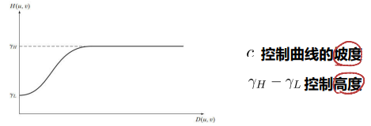

### 选择性滤波

带阻滤波器和带通滤波器：

- 理想带阻滤波器、
  $$
  \begin{aligned}
  &\left.H(u,v)=\left\{\begin{array}{ll}{0,}&{{D_{0}-\frac{W}{2}\leq D(u,v)\leq D_{0}+\frac{W}{2}}}\\{1,}&{{\mathrm{otherwise}}}\end{array}\right.\right.
  \end{aligned} \tag{3.10.1}
  $$

- 巴特沃斯带阻滤波器
  $$
  H(u,v)=\frac{1}{1+\left[\frac{DW}{D^{2}-D_{0}^{2}}\right]^{2n}} \tag{3.10.2}
  $$

- 高斯带阻滤波器
  $$
  H(u,v)=1-\mathrm{e}^{-[{\frac{D^{2}-D_{0}^{2}}{DW}}]^{2}} \tag{3.10.3}
  $$

- 带通滤波器
  $$
  H_{BP}(u,v)=1-H_{BR}(u,v)
  $$
  
- 

总结：

## 复原和重建

找到退化原因！构建退化模型！

### 图像退化/复原模型

退化过程：一个退化函数H加一个加性线性噪声$n$

图像复原：有退化图像、退化函数、噪声的先验知识，获得原始图像估计

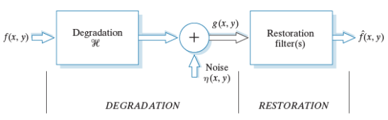

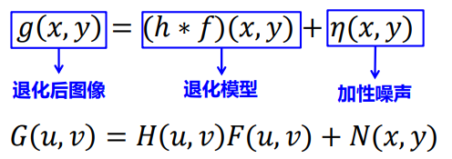

图像复原方法分类：

- 估计方法：缺乏先验知识，只能建模描述，进而寻址一种去除或消弱其影响的成果；
- 拟合方法：对原始图像有足够的先验知识，对原始图像建立数学模型

优缺点比较：

- 第一种方法不需要先验知识，速度慢，效果差

### 噪声模型

加性噪声：$g(x,y)=f(x,y)+\eta(x,y)$

乘性噪声：$g(x,y)=f(x,y)[1+\eta(x,y)]$

常见的加性噪声按照概率密度函数特征分类

#### 高斯噪声

高斯噪声是最常见也是最重要的一种噪声，众多的图像降噪算法都是以降低高斯噪声为目标设计的

瑞利噪声

伽马噪声

指数噪声

均匀噪声

#### 椒盐噪声

有很多灰度值极大和极小的点，其概率密度函数如下：
$$
p(z)=\begin{cases}P_s&z=2^k-1\\P_p&z=0\\1-(P_s+P_s)&otherwise\end{cases}
$$
如果只有一遍，则叫单极脉冲

#### 周期噪声

- 图像获取时，电力的干扰
- 通过频率域滤波可以显著减少

### 只存在噪声的复原——空间滤波

#### 均值滤波

算数均值滤波：

几何均值滤波：

#### 自适应滤波器

自适应中值滤波器有三个目的：

- 滤除椒盐噪声
- 平滑其他非脉冲噪声
- 尽可能的保护图像中细节信息，避免图像边缘的细化或者粗化。

最简单的度量是均值和方差，这些参数是自适应滤波基础

### 用频率域滤波消除周期函数

被污染函数的频率域表示：
$$
\begin{aligned}G(u,v)&=F(u,v)+N(u,v)\\\\G(u,v)&=N(u,v)\end{aligned}
$$

#### 陷波滤波器

阻止事先预定的频率域矩阵中的频率

假设：在傅里叶变换中，周期噪声在对应于周期干扰的频率处显示为集中爆发的能量

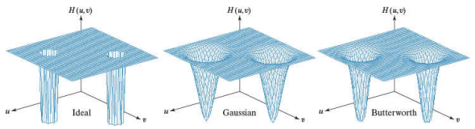

可以使用中心被平移到陷波滤波中心的高通滤波器函数的乘积产生
$$
\begin{aligned}H_{NR}(u,v)&=\prod_{k=1}^QH_k(u,v)H_{-k}(u,v)\\D_k(u,v)&=[\left(u-\frac M2-u_k\right)^2+(u-\frac M2-v_k)^2]^{1/2}\end{aligned}
$$
n阶巴特沃斯带阻滤波器：
$$
H_{NR}(u,v)=\prod_{k=1}^{3}[\frac{1}{1+[D_{0k}/D_{k}(u,v)]^{n}}\frac{1}{1+[D_{0k}/D_{-k}(u,v)]^{n}}]
$$

#### 最优陷波滤波器

当存在几种干扰分量时上面讨论的滤波过程会消除过多的图像细节，而且此时干扰成分通常不是单频脉冲【通常携带干扰模式信息的宽边缘】。这种情况下可应用最佳陷波滤波的方法，第一步屏蔽干扰的主要成分，第二步是从被污染的图像中减去该模式的一个可变的加权部分。

第一步：在每个尖峰位置处放置一个陷波带通滤波器，估计屏蔽干扰模式的主频率成分：

$$
噪声的傅里叶谱=带通陷波函数\times 污染图像的傅里叶谱\\
{N(u,v)}=H_{NP}(u,v){G(u,v)}\\{\eta(x,y)}=\mathfrak{F}^{-1}\{H_{NP}(u,v)G(u,v)\}
$$

第二步：从被污染图像中减去干扰模式的可加权部分
$$
\hat{f}(x,y)=g(x,y)-{{w(x,y)}}\eta(x,y)
$$
$w(x,y)$被称为加权函数/调制函数：目的是使图像恢复到最优

最优的判定：**使复原图像在每一个点的指定邻域上方差最小**

考虑点$(x,y)$的大小为$(2a+1,2b+1)$的邻域。$\hat{f}(x,y)$ 的局部方差估计为：

$$
\begin{aligned}\delta^2(x,y)&=\frac{1}{(2a+1)(2b+1)}\sum_{s=-a}^{a}\sum_{t=-b}^{b}\left[\hat{f}(x+s,y+t)-\bar{\hat{f}}(x,y)\right]^2\\\\   \bar{\hat f}(x,y)&=\frac{1}{(2a+1)(2b+1)}\sum_{s=-a}^{a}\sum_{t=-b}^{b}\hat{f}(x+s,y+t)\end{aligned}
$$
可以推出：
$$
\begin{aligned}\delta^2(x,y)&=\frac{1}{(2a+1)(2b+1)}\sum_{s=-a}^a\sum_{t=-b}^b\left\{[g(x+s,y+t)-w(x+s,y+t)\eta(x+s,y+t)]-[\bar{g}(x,y)-\overline{w(x,y)\eta(x,y)}]\right\}^2\end{aligned}
$$
假设：$w(x+s,y+t)=w(x,y)$ 常数，用邻域中心的值代替有：$\delta^2(x,y)=\frac{1}{(2a+1)(2b+1)}\sum_{s=-a}^{a}\sum_{t=-b}^{b}\left\{[g(x+s,y+t)-w(x,y)\eta(x+s,y+t)]-[\bar{g}(x,y)-w(x,y)\bar{\eta}(x,y)]\right\}^2$

最小化局部方差等价于求解下式：$\frac{\partial\delta^2(x,y)}{\partial w(x,y)}=0$

最终解：

$$
w(x,y)=\frac{\overline{g(x,y)\eta(x,y)}-\bar{g}(x,y)\bar{\eta}(x,y)}{\overline{\eta^2(x,y)}- \overline{\eta(x,y)}^{2}}
$$
线性、位置不变的退化

### 估计退化函数

观察法 实验法 数学建模法

### 逆滤波

用退化函数除退化图像的傅立叶谱，变换来计算原始图像的傅里叶变换的估计
$$
\hat{F}(u,v)=\frac{G(u,v)}{H(u,v)}=\frac1{H(u,v)}G(u,v)
$$

#### 维纳滤波

维纳滤波器（Wiener filter）是由数学家维纳（Norbert Wiener）提出的一种以最小平方为最优准则的线性滤波器。在一定的约束条件下，其输出与一给定函数（通常称为期望输出）的差的平方达到最小，通过数学运算最终可变为一个托布利兹方程的求解问题。维纳滤波器又被称为最小二乘滤波器或最小平方滤波器，目前是基本的滤波方法之一。

思路：找出污染图像的一个估计，使他们的均方误差最小：$e^2=E\{(f-\hat{f})^2\}$
$$
H_W(u,v)=\frac1{H(u,v)}\frac{|H(u,v)|^2}{|H(u,v)|^2+S_\eta(u,v)/S_f(u,v)}
$$
要求：未退化图像和噪声功率谱已知！很难！！！

噪声为0的时候退化为逆滤波

## 彩色图像处理

### 彩色基础

三原色：红（700nm）绿（546.1nm）蓝（435.8nm)

混色：红+蓝=深红  绿+蓝=青色  红+绿=黄色

相减混色：黄绿蓝

#### CIE色度图

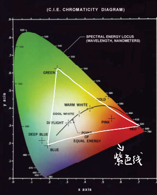

- 翼型轮廓线代表可见光波长的轨迹
- 沿线的数字代表可见光的波长
- 两端的连线被称为紫色线
- 为什么是这个形状：计算机算出来的，两个点代表的颜色等比例混合，刚好是连线中点

### 彩色模型

颜色模型(颜色空间)就是描述用一组数值来描述颜色的数学模型。在彩色图像处理中，选择合适的彩色模型是很重要的。

分类方式：

1. 从颜色感知分类：
   - 混合颜色空间
   - 亮度/色度型颜色空间
   - 强度/饱和度/色调型颜色空间
2. 从技术分
   - 印刷技术
   - 颜色度量
   - 电视广播

#### RGB色彩模型

一般来说是一个立方体，三个轴代表RGB

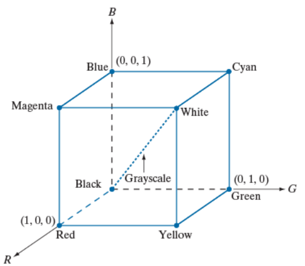

原点：黑色     (1,1,1)：白色   其余六个顶点：红 绿 蓝 黄 青 深红

RGB 色彩模型有三个分量，每一个一般是8bit

RGB模型一般每一个彩色像素有24比特深度

#### CMK和CMYK彩色模型

CMY：青色(Cyan) 深红色(Magenta) 黄色(Yellow)，光的二次色

- 主要用于彩色打印和复印机
  $$
  \begin{bmatrix}\mathbf{C}\\\mathbf{M}\\\mathbf{Y}\end{bmatrix}=\begin{bmatrix}\mathbf{1}\\\mathbf{1}\\\mathbf{1}\end{bmatrix}\text{-}\begin{bmatrix}\mathbf{R}\\\mathbf{G}\\\mathbf{B}\end{bmatrix}
  $$

- CMYK：CMY+黑色，减少颜料消耗

#### HSI色彩模型

理想的描述人眼视觉的彩色图像处理模型，对人来说自然直观

1. **色相（Hue）**: 色相是指颜色的种类，如红色、绿色或蓝色等。在HSI模型中，色相通常表示为一个角度，范围从0°到360°，不同的角度代表不同的颜色。

   - 色调三角形：由RGB外表面的任意颜色a和与黑色和白色点组成三角形
   - 色调三角形内各点（不包括强度轴）的色调相同
     - RGB内任意颜色点的**色调**定义为该店的色调三角形与红色色调三角形的顺时针夹角（红0->绿120->蓝240）

   $$
   \begin{aligned}\theta&=\arccos\left\{\frac{\frac{1}{2}[(R-G)+(R-B)]}{[(R-G)^2+(R-B)(G-B)]^{1/2}}\right\}\end{aligned}
   $$

2. **饱和度（Saturation）**: 饱和度是指颜色的纯度或强度。饱和度较高的颜色看起来更“纯”，而饱和度低的颜色则看起来更“灰”或更“洗淡”。在HSI模型中，饱和度的范围通常是从0（完全无色，即灰色）到1（完全饱和）。

   - 到强度轴垂线的长度

   $$
   \begin{aligned}S&=1-\frac3{R+G+B}\min(R,G,B)\end{aligned}
   $$

3. **强度（Intensity）**: 亮度是指颜色的明亮程度。这个维度与光的强度有关，其范围通常是从0（完全黑）到1（完全白）。

   - 强度轴：RGB空间（正方体）中从黑色到白色的连线
   - 强度：某一点的强度等于过当前点做强度轴的垂线的交点灰度值
   - $ I = \frac{R + G + B}{3} $

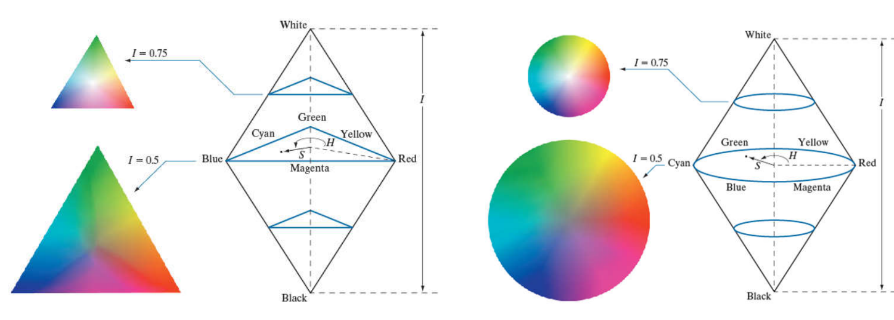

RGB->HSI：
$$
\begin{aligned}
&\left.H=\left\{\begin{array}{ll}\theta,&\text{ if }B\le G\\360^o-\theta,&\text{ if }B>G\end{array}\right.\right. \\
& \theta=\operatorname{arccos}\left\{\frac{\frac{1}{2}[(R-G)+(R-B)]}{[(R-G)^{2}+(R-B)(G-B)]^{1/2}}\right\}  \\
&\begin{aligned}S&=1-\frac{3}{R+G+B}\min(R,G,B)\end{aligned} \\
&I=\frac{R+G+B}{3}
\end{aligned}
$$
HSI->RGB：
$$
\begin{aligned}
&0^{o}\leq H\leq120^{o}:\quad R=I\bigg\lfloor1+\frac{S\cos(H)}{\cos(60^{o}-H)}\bigg\rfloor,\quad G=3I-(R+B),\quad B=I(1-S) \\
&120^{o}\leq H\leq240^{o}:\quad H=H-120^{o},\quad R=I(1-S),\quad G=I\biggl[1+\frac{S\cos(H)}{\cos(60^{o}-H)}\biggr],\quad B=3I-(R+G) \\
&40^{o}\leq H\leq360^{o}:\quad H=H-240^{o},\quad R=3I-(B+G),\quad G=I(1-S),\quad B=I\bigg[1+\frac{S\cos(H)}{\cos(60^{o}-H)}\bigg]
\end{aligned}
$$

### 伪彩色图像

对灰度值赋以颜色的处理

方法：1. 灰度分层    2. 彩色编码技术

#### 灰度分层 (Density Slicing)

一幅图像被描述为3D函数，使用平行坐标轴的函数切割，给每一层给予不同的彩色

## 小波变换

### 基础知识

#### 信号内积与内积空间

内积性质：
$$
\begin{gathered}
<u,v>=<u,v>^{*} \\
<u+v,w>~=~<u,w>~+<v,w> \\
<\alpha u,v>~=~\alpha<u,v> \\
<v,v>\geq0and<v,v>=0\quad only \quad v=0 
\end{gathered} \tag{7.1.1}
$$
内积空间：数域上的抽象向量空间与内积函数共同将向量空间的两个向量映射为属于一个标量

假设$u(t)$和$\nu(t)$是定义在$(t_1,t_2)$区间的函数，其内积为 

$$
<u(t),\nu(t)>=\int_{t1}^{t2}u(t)\nu(t)\operatorname{d}t \tag{7.1.2}
$$

向量的范数：$||z||=\sqrt{<z,z>}$

两个向量的角度:$\theta=\frac{<z1,z2>}{||z1|||||z2||}$

设有$u$和 $\nu$ 是$N \times 1$的列向量，具有如下标量内积的实数域$R$上的欧式空间$R^N$
$$
{<u,v>=u^Tv=u_0v_0+u_1v_1+...u{N-1}v{N-1}=\sum_{i=0}^{N-1}u_iv_i} \tag{7.1.3}
$$

设有$u$和$\nu$是Nx 1的复值列向量，*表示复共轭运算，有内积函数的复数域C上的酉空间$C^N$
$$
<u,v>={u^{*T}v}=\sum_{i=0}^{N-1}u_i^*v_i={<v,u>^*} \tag{7.1.4}
$$
内积空间$C([a,b])$,其中向量是区间$a\ll x\ll b$上连续函数，内积函数是积分内积

$$
{<f(x),g(x)>=\int_a^bf^*(x)g(x)dx} \tag{7.1.5}
$$

#### 信号正交

定义在$(t_1,t_2)$区间的$u(t)$和$\nu(t)$满足$<u(t),\nu(t)>=\int_{\iota_1}^{\iota_2}u(t)\nu(t)\operatorname{d}t=0(\text{两函数的内积为}0)$则称$u(t)$和$\nu(t)$ 在区间$(t_1,t_2)$内正交。

#### 正交函数集

若n个函数$u_1(t),u_2(t),\cdots,u_n(t)$构成一个函数集，这些函数在区间$(t_1,t_2)$ 内满足
$$
\int_{t_1}^{t_2}u_i(t)u_j(t)\operatorname{d}t=\begin{cases}0,&{i\neq j}\\K_i\neq0,&{i=j}\end{cases} \qquad k_i=\int_{t_1}^{t_2}u_i^{z}(t)dt  \tag{7.1.6}
$$
则称此函数集为在区间$(t_1,t_2)$的正交函数集/正交向量集

#### 向量正交

设有u和 $\nu$ 是Nx 1的列向量，具有如下内积的实数域$R$上的欧式空间$R^N$

$$
{<u,v>}={u^Tv=u_0v_0+u_1v_1+}...{u_{N-1}v_{N-1}=\sum_{i=0}^{N-1}u_iv_i=0} \tag{7.1.7}
$$

#### 正交基

如果 <u, v> = 0, 称$u$和$\nu$是正交的

若果非零向量$w_0,w_1,w_2,\ldots$是互相两两正交，即$<w_i,w_j>=0,i\neq j$,它们是内积空间的正交基。

$$
\left.<w_i,w_j>~=\delta_{ij}=~\left\{\begin{matrix}0,~i\neq j\\1,~i=j\end{matrix}\right.\right. \tag{7.1.8}
$$

#### 向量正交分解

$$
z=\alpha_0w_0+\alpha_1w_1+\alpha_2w_2+... \tag{7.1.9}
$$

由于任意不同两基向量正交，所以系数：

$$
\alpha_i=\frac{<w_i,z>}{<w_i,w_i>}=\frac{\int_{t_1}^{t_2}w_i\left(t\right)z(t)\operatorname{d}t}{\int_{t_1}^{t_2}w_i^2\left(t\right)\operatorname{d}t}=\frac1{K_i}{\int_{t_1}^{t_2}w_i\left(t\right)z(t)\operatorname{d}t} \tag{7.1.10}
$$

### 基于矩阵的变换（Matrix-based Transforms）

### 时间-频率基函数

### 基图像

### 傅里叶相关的变换

### 图像多分辨率分析

#### 图像金字塔

是以多分辨率来表示图像的一种结构，结构非常有效，且概念简单。是一系列以金字塔形状排列的、分辨率逐步降低的图像集合。 金字塔底部是待处理图像的高分辨率表示，顶部则包含低分辨率的近似。向金字塔上层移动时，尺寸和分辨率逐步降低。

基础级：大小为2$^\mathrm{J}$x2$^\mathrm{J}$或 N x N 

顶点级：大小为1x1 (单个像素）

第j级大小为2$^{\mathrm{j}}\times2^{\mathrm{j}}\:,\:0<=j<=J_{\mathrm{o}}$

但通常金字塔会截短到P+1级，即将级别限制到P来降低原图像的分辨率近似，也就是说不会到金字塔靠近顶端的位置。

步骤：

1、初始化，原始图象大小，j=J
2、j-1级，以2为步长进行子抽样，计算输入图像减少的分辨率近似值—j-1级近似值，生成子抽样金字塔。
3、对j-1 级近似值进行步长为2的内插，并进行过滤，生成与输入图像等分辨率的预测图像。
4、输入图像和预测图像之间的差异，产生预测残差金字塔。
5、重复2、3、4步骤。

金字塔低分辨率级别用于分析较大的结构或图像的整体内容；高分辨率图像适合于分析单个物体的特性。

#### 子带编码

### 小波变换

傅里叶变换处理非平稳信号的缺陷：它只能获取一段信号总体上包含哪些频率的成分，但是对各成分出现的时刻并无所知。因此时域相差很大的两个信号，可能频谱图一样。

为什么傅里叶变换可以得到信号各个频率成分？傅里叶变换把无限长的三角函数作为基函数：

小波做的改变就在于，将无限长的三角函数基换成了有限长的会衰减的小波基。

## 图像压缩

### 基础知识

冗余数据：包含不相关或重复信息的表示

分为无损压缩 和 有损压缩

压缩建立在 **编码冗余、像素间冗余和心里视觉冗余**

信息熵：$H=\sum_{j=1}^{J}P({a_j})\log\frac1{P(a_j)}=-\sum_{j=1}^{J}P(a_j)\log P(a_j)$

### 一些基本的压缩方法

#### 霍夫曼编码

使用不同的码长

压缩：

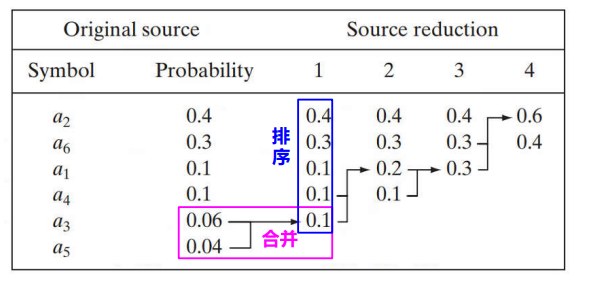

解码：

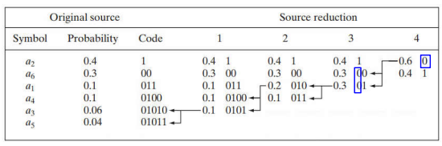

#### Golomb编码

Golomb编码是一种无损数据压缩算法，适用于符号出现概率呈几何分布的场合。这种编码由所谓的Golomb参数$b$控制，它决定了编码的具体形式。下面是Golomb编码的计算过程：

1. **选择参数$b$**：首先需要确定Golomb编码的参数$b$。这个参数通常是基于数据的统计特性选择的。理想情况下，$b$应该是或接近于符号出现的平均间隔。

2. **计算Quotient（商）和Remainder（余数）**：对于要编码的数字$n$，计算商$q$和余数$r$，即：
   $$ q = \left\lfloor \frac{n}{b} \right\rfloor $$
   $$ r = n \mod b $$

3. **编码Quotient**：使用一种称为“Unary编码”的方法对商$q$进行编码。Unary编码是一种简单的编码方式，其中数字$n$表示为$n$个1后跟一个0。因此，$q$用$q$个1后跟一个0来表示。

4. **编码Remainder**：余数$r$的编码取决于$b$的值。
   - $$
     c=2^k-m\\\left.r^{\prime}=\left\{\begin{matrix}r\text{截断至}k-1bit,&0\leq r<c\\r+c\text{截断至}k\textit{ bit,}&\text{其他}\end{matrix}\right.\right.
     $$
   
5. **结合Quotient和Remainder的编码**：将Quotient的编码和Remainder的编码结合起来，形成最终的Golomb编码。

例如，假设我们要用Golomb编码来编码数字$n = 10$，并且选择$b = 3$。

1. 计算商和余数：$q = \lfloor 10/3 \rfloor = 3$，$r = 10 \mod 3 = 1$。
2. 编码商：$q = 3$，Unary编码为"1110"。
3. 编码余数：因为$b = 3$不是2的幂，我们需要使用truncated binary encoding。对于$b = 3$，$r$将用2位二进制编码，其中"00"和"01"分别表示0和1，而"10"表示2（"11"不使用）。
4. 因此，$r = 1$将被编码为"10"。
5. 结合两部分的编码：最终的Golomb编码为"111010"。

#### 算数编码

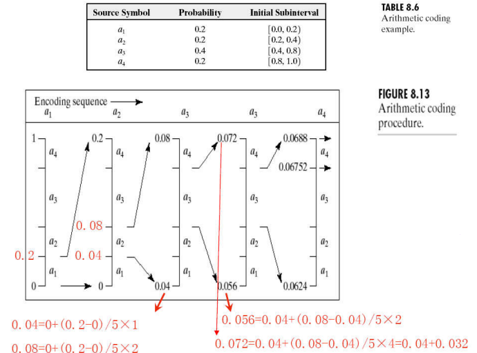

#### LZW编码

GIF PDF TIFF等

LZW（Lempel-Ziv-Welch）编码是一种流行的无损数据压缩算法。它是基于字典编码的原理，通过将输入字符序列转换成一系列代码来实现压缩。下面是LZW编码的基本步骤：

1. **初始化字典**：LZW编码开始时，初始化字典包含所有可能的单个字符及其对应的代码。例如，对于ASCII字符集，字典将包含所有128个ASCII字符及其对应的编码（通常是0-127）。

2. **处理输入**：从输入数据的开始处读取字符。

3. **搜索字典**：在当前字典中搜索当前输入字符序列（初始时为一个字符）的最长序列。随着算法的进行，这个序列可能会包含多个字符。

4. **输出代码**：当找到最长序列时，输出该序列对应的字典代码。

5. **添加新序列到字典**：将当前序列加上下一个输入字符形成的新序列添加到字典中，并为这个新序列分配一个新的代码。这个新序列将用于未来的匹配。

6. **更新当前序列**：将当前序列更新为刚刚输入的那个字符。

7. **重复**：重复步骤3-6，直到处理完所有输入数据。

8. **输出最后一个代码**：输入结束时，输出最后一个序列对应的代码。

LZW编码的关键在于动态地构建字典，即在压缩过程中根据输入数据的具体内容不断添加新的序列和代码。这种方法使得LZW编码特别适合于具有重复模式的数据，例如文本文件、位图图像等。

以一个简单的例子来说明LZW编码过程：假设输入字符串是"ABABABA"。

1. 初始字典包含'A'和'B'的代码，假设为65和66。
2. 读取第一个字符'A'，发现字典中有'A'，继续读取下一个字符。
3. 读取到'B'，发现字典中有"AB"，继续读取下一个字符。
4. 读取到'A'，发现字典中没有"ABA"，输出"AB"的代码，把"ABA"添加到字典中，并以新的序列开始，即从当前的'A'开始。
5. 如此继续，直到处理完所有字符。

通过这种方式，LZW编码将输入数据转换成一系列字典中的代码，实现了数据的压缩。

#### 行程编码

行程编码（Run-Length Encoding, RLE）是一种简单的数据压缩算法，它通过识别连续重复的字符或像素值（称为“行程”）并用一个计数和字符来表示，从而达到压缩数据的目的。这种方法特别适合于那些有大量相同值连续出现的数据，如单色位图图像等。以下是行程编码的基本步骤：

1. **初始化**：设置指针指向数据的开始，初始化计数器。

2. **读取字符**：读取序列中的第一个字符或像素值。

3. **计数连续字符**：继续读取相邻的字符，直到字符改变或达到序列的末尾。在此过程中，计数连续出现的字符数量。

4. **编码行程**：用计数（连续出现的次数）和当前字符来编码行程。例如，序列"AAA"可以被编码为"3A"，表示字符'A'连续出现了3次。

5. **移动到下一个不同的字符**：更新指针，跳过已编码的字符。

6. **重复**：重复步骤2-5，直到处理完所有输入数据。

7. **结束编码**：当所有字符都被处理后，编码过程结束。

以一个简单的例子来说明行程编码过程：假设输入字符串是"AAAABBBCCDAA"。

1. 首先读取第一个字符'A'，并计数其连续出现的次数，共4次。
2. 编码第一个行程为"4A"。
3. 接着是3个'B'，编码为"3B"。
4. 然后是2个'C'，编码为"2C"。
5. 接下来是一个'D'，编码为"1D"。
6. 最后再次出现2个'A'，编码为"2A"。

最终，原始序列"AAAABBBCCDAA"被行程编码压缩为"4A3B2C1D2A"。

#### 基于符号的编码

通过记录子图来实现

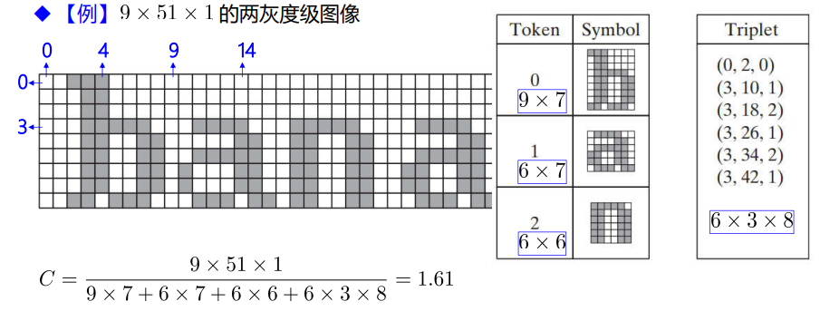

#### 块变换编码

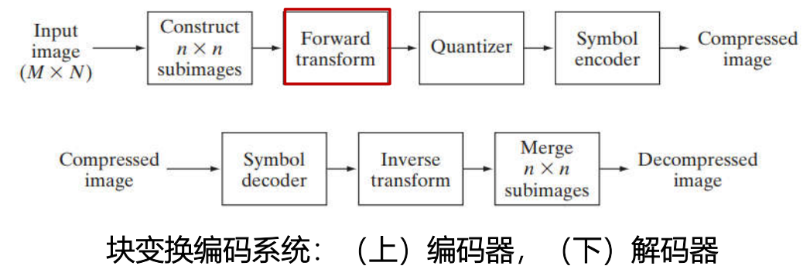

考虑大小为 $n\times n$ 的子图像 $g(x,y)$，其离散变换$T(u,v)$ 表示为如下一般关系：
$$
T(u,v)=\sum_{x=0}^{n-1}\sum_{y=0}^{n-1} g(x,y){r(x,y,u,v)}
$$

给定 $T(u,v)$,通过反变换可得到 $g(x,y):$
$$
\begin{aligned}g(x,y)&=\sum_{u=0}^{n-1}\sum_{v=0}^{n-1}T(u,v){{s(x,y,u,v)}}\end{aligned}
$$

可分离核$:\quad r(x,y,u,v)=r_1(x,u)r_2(y,v)$

对称核：$r(x,y,u,v)=r_1(x,u)r_1(y,v)$

##### 常见变换核

DET：
$$
\begin{aligned}r(x,y,u,v)&=\mathrm{e}^{-j2\pi(ux+vy)/n}\\\\s(x,y,u,v)&=\frac{1}{n^2}\mathrm{e}^{j2\pi(ux+vy)/n}\end{aligned}
$$
Walsh-Hadamard变换(WHT)

1. **Walsh函数**：Walsh-Hadamard变换基于一组称为Walsh函数的正交函数集。这些函数是一组二值函数，其值仅为+1或-1。它们通常以矩阵形式表示，称为Hadamard矩阵。

2. **Hadamard矩阵**：Hadamard矩阵可以通过递归方法构建。基本的Hadamard矩阵是2x2矩阵，表示为：
   $$
   H_1 = \begin{bmatrix} 1 & 1 \\ 1 & -1 \end{bmatrix}
   $$
   对于更高阶的Hadamard矩阵（例如，$H_2$，$H_4$，$H_8$等），使用以下递归公式：
   $$
   H_{2n} = \begin{bmatrix} H_n & H_n \\ H_n & -H_n \end{bmatrix}
   $$
   其中$n$是2的幂。

3. **变换过程**：要对一个信号或图像进行Walsh-Hadamard变换，首先需要确保其长度或尺寸是2的幂。如果不是，可以通过填充零来调整其长度或尺寸。

4. **应用Hadamard矩阵**：变换是通过将信号或图像与Hadamard矩阵相乘来实现的。对于一个长度为N的一维信号$x$，其Walsh-Hadamard变换$W$可以表示为：
   $$
   W = H_N \cdot x
   $$
   对于二维图像，需要先对行进行变换，然后对列进行变换。

5. **变换结果**：变换的结果是原始信号或图像在Walsh函数基下的表示。这个表示可以用于进一步的分析、处理或压缩。

JPEG（Joint Photographic Experts Group）图像压缩标准使用了一种名为离散余弦变换（Discrete Cosine Transform, DCT）的块变换编码方式来压缩图像。这种方法主要包含以下步骤：

1. **颜色空间转换**：首先，JPEG通常会将图像从RGB颜色空间转换到YCbCr颜色空间。这里，Y代表亮度分量，而Cb和Cr代表色度分量。这样做的目的是为了分离图像的亮度信息和色彩信息，便于后续处理。
2. **子采样**：JPEG压缩通常对色度分量进行子采样，因为人眼对亮度的敏感度高于色度。
3. **块划分**：图像被分割成大小通常为8x8像素的小块。每个块独立进行DCT。
4. **离散余弦变换（DCT）**：对每个8x8的块进行DCT，将时域（空间域）的数据转换为频域的数据。DCT有助于集中大部分信号能量到少数几个系数中。
5. **量化**：DCT后的系数被量化，即降低精度，这是一个有损的过程。量化的程度可以调整，对压缩率和图像质量有直接影响。
6. **编码**：量化后的数据被进一步编码，包括使用Zigzag顺序扫描DCT系数、运行长度编码（RLE）和霍夫曼编码（Huffman coding）。

### 数字图像水印

不可见水印很容易被图像压缩破坏

## 形态学处理

膨胀 腐蚀 开操作 和 闭操作

### 基础知识

结构元=中心元素+集合成员

结构元B在集合A上操作的定义：

以A上每一个点为B的中心元素，构建结构元，如果结构元中每个元素都在A中，则这个点为新集合的成员

### 腐蚀与膨胀

腐蚀与膨胀是互补运算

对偶性：
$$
\begin{aligned}&{(A\ominus B)^c=A^c\oplus\hat{B}}\\\\&(A\oplus B)^c=A^c\ominus\hat{B}\end{aligned}
$$

### 开运算和闭运算

开运算：先腐蚀后膨胀

闭运算：先膨胀后腐蚀

对一个集合做过开运算或闭运算，再继续进行运算并不会影响

### 击中-或-击不中变换（Hit-or-Miss Transformation）

$$
I\otimes B_{1,2}=\{z|(B_{1})_{z}\subseteq A\text{和}(B_{2})_{z}\subseteq A^{c}\}=(A\oplus B_{1})\bigcap(A^{c}\oplus B_{2})
$$

结构元素：左B1（击中元素），中B2（击不中元素），右B（两者结合）

### 一些基本的形态学算法

#### 边缘提取

先做腐蚀，然后原集合减去腐蚀后集合

#### 孔洞填充

1. **选择种子点**:
   选择一个位于孔洞内部的种子点。这个点必须是背景像素（值为0），并且位于你想要填充的孔洞内部。
2. **形态学扩张**:
   对选定的种子点应用形态学扩张（dilation）操作。扩张是一种形态学操作，它将图像中的对象边界向外扩展。在孔洞填充的上下文中，扩张操作用于逐步增加种子点的区域，直到它填满整个孔洞。
3. **交集操作**:
   在每次扩张后，将结果与原始图像的补（complement）进行交集操作。原始图像的补是将所有前景像素转换为背景，背景像素转换为前景。这样做是为了确保扩张不会超出孔洞的边界。
4. **迭代**:
   重复进行扩张和交集操作，直到扩张结果不再发生变化。这意味着孔洞已经被完全填充。
5. **结果处理**:
   最后，将填充后的区域（现在是前景）合并回原始图像中。

**联通分量的提取**：

1. 选取种子点：种子点为集合内一点
2. 膨胀：对种子点做膨胀，然后与原有集合取交际
3. 迭代进行膨胀和交集操作

#### 凸包(Convex Hull)

$$
\begin{aligned}&X_k^i=(X_{k-1}^i\otimes B^i)\cup A,X_0^i=A,i=1,2,3,4\text{ and }k=1,2,3,\cdots\\[2ex]&\text{if }X_k^i=X_{k-1}^i\text{ then let }D^i=X_k^i\end{aligned}
$$

对于一个集合A的凸包为：$C(A)=\cup_{i=1}^4D^i$

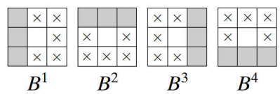

在计算机视觉和图像处理中，凸包是指能够完全包含某个形状或集合点的最小凸多边形。在形态学中，计算一个对象的凸包常常是为了理解该对象的形状特征或是为进一步的图像处理提供辅助（例如，形状分析、对象识别等）。计算凸包的算法有很多，这里主要介绍一种概念性的方法：

1. **图像膨胀与旋转**:
   形态学操作中的膨胀可以用来逐步扩大图像中的对象，而旋转可以帮助从不同的方向审视对象。将对象逐步膨胀，同时在每次迭代中记录边界点，然后对这些边界点使用凸包算法。
2. **边缘检测与跟踪**:
   在计算凸包前，首先要确定对象的边缘。使用形态学梯度或其他边缘检测算法可以找到对象的边界。然后，跟踪这些边界点，为后续凸包计算准备。
3. **凸包算法应用**:
   使用常见的凸包算法，如Graham扫描或Jarvis步进（也称作Jarvis匹配），来处理图像中对象的边缘点集。这些算法通过比较角度和距离，迭代选择构成凸包的点。

- **Graham扫描**:
  1. 选择一个基准点，通常是所有点中y坐标最小（或最小的x坐标，如果y相同）的点。
  2. 将其他点按照相对于基准点的极角进行排序。
  3. 遍历排序后的点集，用栈来维护凸包的边界。如果即将加入栈的点与栈顶的两个点构成的角度是右转，则将栈顶的点弹出，直到角度为左转为止。然后将点加入栈中。
  4. 最终栈中的点就构成了凸包。
- **Jarvis步进**:
  1. 从最左侧（或最低）的点开始，这个点一定是凸包上的点。
  2. 从当前点出发，选择所有点中使得所有其他点都在其左侧的点，作为凸包的下一个点。
  3. 重复步骤2，直到回到起始点。

**注意**：计算凸包是在边界点集上进行的，而不是直接在图像像素上操作。在实际应用中，通常会使用专门的算法库来计算凸包，如OpenCV、CGAL等，它们提供了优化和精确的凸包计算功能。

在形态学中，计算凸包可以帮助我们理解图像中对象的形状特性，如凸性缺陷，以及进行更高级的图像分析，比如形状匹配、对象识别等。

#### 细化

定义：$A\otimes B=A-(A\otimes B)=A\cap(A\otimes B)^c$

对称细化：以结构元序列 $\{B\}=\{B^1,B^2,\cdots,B^n\}$为基础，依次执行细化：

$$
A\otimes\{B\}=((\cdots((A\otimes B^1)\otimes B^2))\otimes B^n)
$$

PS: $R^i$ 是 $B^{i-1}$ 的旋转后的形式。

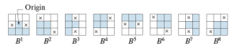

#### 骨架化

使用腐蚀和开运算描述：
$$
\begin{aligned}
&\begin{aligned}S(A)=\cup_{k=0}^KS_k(A)\end{aligned} \\
&\begin{aligned}S_k(A)=(A\ominus kB)-(A\ominus kB)\circ B\end{aligned} \\
&\begin{aligned}(A\ominus kB)=((\cdots(A\ominus B)\ominus B)\ominus B)\end{aligned} \\
&\begin{aligned}K=\max\{k|(A\ominus kB)\neq\varnothing\}\end{aligned}
\end{aligned}
$$

#### 形态学重建

测地膨胀：

对一个图做膨胀，然后和mask取交

测地腐蚀：

对一个图做腐蚀，然后和mask取并

### 灰度级形态学

二值图像的形态学处理：图像和结构都是二值的

灰度图像的形态学处理：

- 图像$f(x,y)$和结构元素$b(x,y)$是数字函数
- 结构元分两种：非平坦和平坦结构
- 结构元反射的定义：$\hat b(x,y)=b(-x,-y)$

**腐蚀：**

**膨胀：**

#### 顶帽和低帽变换

顶帽变换：$T_{hat}(f)=f-(f\circ b)$

底帽变换：$\begin{aligned}B_{hat}(f)=(f\bullet b)-f\end{aligned}$

1. **顶帽变换**:
   - **定义**: 顶帽变换是原始图像与其开操作之差。在数学上表示为：$ \text{Top-hat}(A) = A - (\text{Open}(A)) $，其中 A 是原始图像。
   - 应用:
     - **强调小物体或细节**: 在背景较亮时，顶帽变换能够强调比结构元素小的亮物体或细节。
     - **去除背景**: 如果背景比较均匀且比感兴趣的物体亮，顶帽变换可以帮助去除背景。
     - **图像增强**: 在医学成像、卫星图像和工业检测中用于增强细节。
2. **底帽变换**:
   - **定义**: 底帽变换是原始图像与其闭操作之差。在数学上表示为：$ \text{Bottom-hat}(A) = (\text{Close}(A)) - A $
   - 应用:
     - **强调暗小物体或细节**: 在背景较暗时，底帽变换能够强调比结构元素小的暗物体或细节。
     - **高亮显示缺陷**: 用于检测图像中的小缺陷，如划痕、斑点或其他暗色特征。
     - **图像增强和分析**: 在材料科学、生物学成像和工业检测中，用于增强图像中的某些特征或进行更深入的图像分析。

主要应用是通过开闭操作从一副图像中删除物体

## 图像分割

基于不连续性的分割方法：以灰度突变为基础，比如图像的边缘

基于相似性的分割方法：根据一组准则，将图像分割为相似的区域

### 点、线和边缘检测

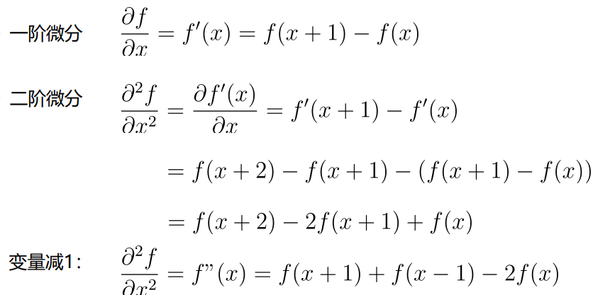

孤立点检测：拉普拉斯算子

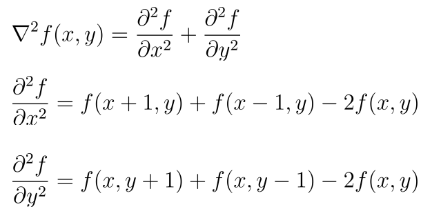

线检测模板

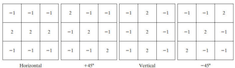

### 阈值处理

1. 为全局阈值 $T$ 选择一个初始估计值； 
2. 使用阈值 $T$ 分割图像，产生两组像素：大于 $T$ 的像素集合，记为$G_1$;小于等于$T$的像素集合，记为$G_2;$
3. 对于 $G_1$ 和$G_2$,分别计算集合中像素的平均灰度值，记为$m_1$和$m_2;$ 
4. 计算一个新的阈值$:T=0.5(m_1+m_2):$
5. 重复步骤2到步骤4，直到连续迭代中的$T$值间的差小于一个预定义的参数 $\Delta T$为止。

#### OTSU求阈值

大津算法（OTSU's method）是一种自动选择图像二值化阈值的流行方法。它通过最大化类间方差来确定最佳阈值，使得不同类别（前景和背景）的分离度最大。以下是大津算法的数学描述：

假设我们有一幅灰度图像，其灰度级范围为\[0, L-1\]（通常L=256），并且我们要将图像的像素分为两组（前景和背景）。大津算法的目标是找到一个阈值$t$，将像素分为两组，并最大化这两组间的方差。

1. **计算每个灰度级的出现概率**：首先，计算图像中每个灰度级$i$的出现概率$p(i)$，其中$i=0,1,2,...,L-1$。概率可以通过计算该灰度级像素的数量除以图像中总像素数量来得到。

2. **计算累积概率和累积均值**：对于每个可能的阈值$t$，计算两个类别（C0为背景，C1为前景）的累积概率$w_0(t)$和$w_1(t)$，以及累积均值$\mu_0(t)$和$\mu_1(t)$：
   $$
   w_0(t) = \sum_{i=0}^{t} p(i)
   $$
   $$
   w_1(t) = \sum_{i=t+1}^{L-1} p(i)
   $$
   $$
   \mu_0(t) = \sum_{i=0}^{t} \frac{i \cdot p(i)}{w_0(t)}
   $$
   $$
   \mu_1(t) = \sum_{i=t+1}^{L-1} \frac{i \cdot p(i)}{w_1(t)}
   $$

3. **计算类间方差**：对于每个阈值$t$，计算类间方差$\sigma^2_{\text{between}}(t)$：
   $$
   \sigma^2_{\text{between}}(t) = w_0(t) \cdot w_1(t) \cdot [\mu_0(t) - \mu_1(t)]^2
   $$

4. **找到最大化类间方差的阈值**：遍历所有可能的阈值$t$，找到使类间方差$\sigma^2_{\text{between}}(t)$最大的那个阈值：
   $$
   t^* = \arg\max_t \sigma^2_{\text{between}}(t)
   $$

5. **应用阈值进行二值化**：最后，使用找到的最佳阈值$t^*$将图像进行二值化。

### 基于区域的分割

区域生长

区域分裂与聚合

k-means

### 分水岭算法

分水岭算法的计算步骤可以详细描述如下：

1. **预处理**：首先对原始图像进行预处理，通常包括降噪和对比度增强。这一步骤是为了减少算法对噪声的敏感性，并强化图像中的边缘。
2. **计算梯度图**：这可以通过使用Sobel、Scharr或其他边缘检测算子完成。梯度图表示了像素强度的变化，边缘区域会在梯度图中显示为高值。
3. **标记前景和背景**：在梯度图上手动或自动标记出感兴趣的对象（前景）和非感兴趣的区域（背景）。这些标记将作为分水岭算法的种子。在自动模式下，可以使用阈值处理或其他图像分割技术来标记。
4. **寻找局部最小值**：在梯度图上寻找局部最小值，这些点将作为水源的起点。有时为了减少过度分割，可以通过一定的方法（如H-minima transform）来修改梯度图，减少局部最小值的数量。
5. **模拟水面上升**：从每个局部最小值（水源）开始，模拟水面逐渐上升的过程。随着水位上升，不同水源的水域会逐渐扩大并开始接触。
6. **构建分水岭**：当两个不同的水域即将合并时，就在它们之间建立一道分水岭，阻止它们合并。这个过程继续进行，直到所有的水域都停止扩张。
7. **后处理**：最后，为了减少由于噪声或图像细节导致的过度分割，可以对分水岭算法的结果进行后处理。这可能包括合并过于小的区域、平滑边界等。
8. **输出分割结果**：最终得到的分水岭线定义了图像中各个独立区域的边界，完成图像分割。
