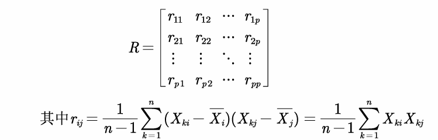
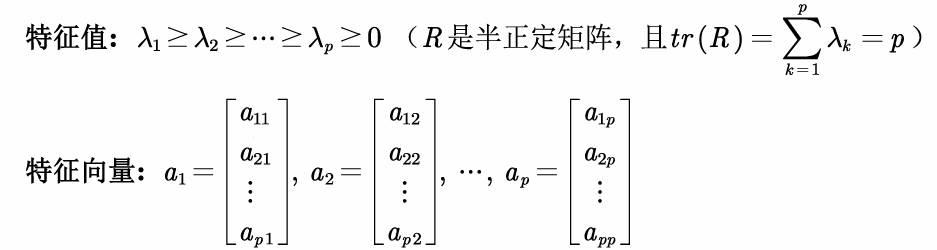
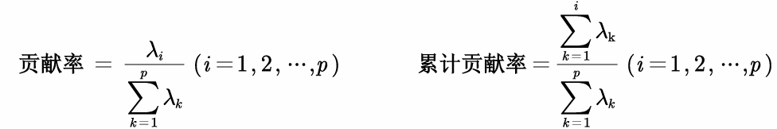
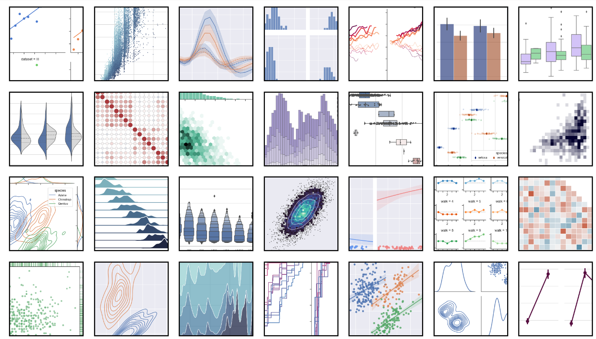

## 主成分分析PCA

**降维算法**，将多个指标转换为少数几个主成分，主成分是原始变量的线性组合，且彼此互不相关。

> 降维：将高维度的数据保留下最重要的特征，去除噪声和不重要的特征。高维数据相较于低维数据，高维数据为我们提供了更多的信息和细节，也更好的描述了样本；但同时，很多高效且准确的分析方法也将无法使用。
>
> 主成分分析的目标是是用**方差（Variance）**来衡量数据的差异性，并将差异性较大的高维数据投影到低维空间中进行表示。绝大多数情况下，我们希望获得两个主成分因子：分别是从数据差异性最大和次大的方向提取出来的

推荐一篇知乎回答：https://www.zhihu.com/question/41120789，里面动图很详细的描述了为什么指标的线性组合可以实现降维

### 思想

样本矩阵如下：

我们需要找到一组变量的组合$$z_1,z_2,...,z_m(m<p)$$

系数确定的原则：

1. 任意两个组合线性无关
2. $$z_1到z_n$$按照方差大小排序

### 计算步骤

1. 先标准化，计算均值和标准差，得到标准化数据，将原矩阵标准化

2. 计算标准化后的协方差矩阵

   

3. 计算R的特征值和特征向量

   

4. 计算主成分贡献率和累计贡献率

   

5. 写出主成分

   取累计贡献率超过80%的特征值所以对应的前第n个主成分，这样就完成了对于数据的降维

6. 利用结果进行分析

   1. 别用主成分得分在评价模型中！！！
   2. 主成分可用于聚类
   3. 用于回归分析

### 实践

计算相关系数的时候不用判断是否显著，因为相关系数在这只是计算中一个步骤

#### 主成分的解释

- 应保证所提取的几个主成分累计贡献率到达一个较高的水平
- 保证主成分都能够给出合理的解释
- 降维付出的代价会使得主成分的解释变得模糊
- 如果有一个主成分解释不了，主成分分析就失败了！！

对于主成分的解释需要动动脑子，没有想出解释的话就难以在后面进行分析

#### 主成分滥用：主成分得分

为什么不能用于评价函数（ex: 对样品排名）：

- 主成分会损失一些信息
- 指标可能有各种类型，但是主成分只有标准化，没有正向化

#### 主成分用于聚类

主成分聚类的最大意义是能帮我们可视化最后的聚类效果，毕竟使用主成分会降低部分信息

#### 主成分用于多重共线性

和逐步回归一样都能解决这个问题，如果能够很好的解释主成分分析的结果，则两个方法都可以；如果不容易解释主成分的结果就还是使用多重共线性吧

## 因子分析

> 因子分析通过研究变量间的相关系数矩阵，把这些变量间错综复杂的关系归因于少数几个综合因子
>
> 能用主成分分析就一定能用因子分析

$$f_n被称为公共因子，\epsilon_i为特殊因子$$

### 与主成分分析的区别

**主成分：**

- 主成分分析是将变量进行线性组合构成新的成分
- 主成分分析只是简单的数值计算，不需要构造一个模型
- 主成分的解是唯一的

**因子分析：**

- 因子分析是将因子进行组合构成原有的变量
- 因子分析需要构造一个因子模型，并伴随几个关键性的假定。
- 因子可有许多解

> 因子分析解释成功的概率高！

### 原理

$$假设p维随机向量x=(x_i,x_2,...,x_p)的均值u=(u_1,u_2,..,u_p)$$

$$f和\epsilon$$都是无法观测的随机变量

上面的式子我们用矩阵可记为：$$x=u+Af+\epsilon$$

所以我们需要解出A这个矩阵来进行因子分析

三保证公因子彼此不相关，且具有单位方差；特殊因子彼此不相关且与公因子也不相关。

五保证假设不具有内生性，在回归中非常重要

$$A_{p\times m}=(a_{ij})$$称为因子载荷矩阵

### 统计意义

1. A的元素$$a_{ij}$$：原始变量$$x_i$$与公因子$$f_j$$中之间的协方差：$$a_{ij}=cov(x_i.f_j)$$

   如何x经过标准化，则$$a_{ij}=\rho(x_imf_j)$$（相关系数）

2. A的行元素平方和$$h_i^2=\sum^m_{j=1}a^2_{ij}$$原始变量 $$x_i$$对公因子依赖的程度

   可以证明：$$Var(x_i)=h^2_i+\sigma^2_i(i=1,2,...,p)$$

   $$h_i^2$$反应公因子对于$$x_i$$的影响，可以看出公因子对于x的方差贡献，称为共性方差；$$\sigma^2_i$$是特殊因子对于$$x_i$$的方差贡献，称为个性方差，如果x经过标准化，$$h_i^2+\sigma^2_i=1$$

3. 

### 性质

因子载荷是不唯一的，证明如下：

$$A是一个正交矩阵，正交矩阵性质T的性质为：TT'=I，令A^*=AT，f^*=T'f，则模型如下：$$

所以我们可以通过因子变换使得分析更容易解释其实际含义

### 参数估计

使用样本来进行估计，为了建立因子模型，我们需要估计出因子载荷矩阵$$A_{p\times m}=(a_{ij})$$，以及个性方差矩阵D

	SPSS中提供的方法有主成分法、未加权的最小平方法、综合最小平方法、最 大似然法、主轴因子法、Alpha因式分解法和映像因子法。

### 因子旋转的方法

	得到因子模型后，其中的公共因子不一定能反映问题的实质特征，为了能更好地解释每一个公共因子的实际意义，且减少解释的主观性，可以通过因子旋转达到目的。
	
	因子旋转分为正交旋转与斜交旋转，经过正交旋转而得到的新的公共因子仍然保持彼此独立的性质，而斜交旋转得到的公共因子是相关的(违背了最初的假定，因此可以看作传统因子分析的拓展)，其实际意义更容易解释。
	
	**但不论是正交旋转还是斜交旋转，都应当使新公共因子的载荷系数的绝对值尽可能接近0或1（这里默认了我们从相关系数矩阵进行计算）**。

#### SPSS中方法：

最多还是第一个

### 因子得分

因子分析是将变量表示为公共因子和特殊因子的线性组合；此外，我们可以反过来将公共因子表示为原变量的线性组合，即可得到因子得分。

> 注：我们计算出因子得分函数的系数后，就能够求出所有的因子得分

	和主成分分析一样，我们可以用因子得分f1和f2作为两个新的变量，来进行后续的建模（例如聚类、回归等） 

> 		注意：因子分析模型不能用于综合评价，尽管有很多论文是这样写的，但这是 存在很大的问题的。例如变量的类型、选择因子的方法、旋转对最终的影响都 是很难说清的

### 实践

#### 第一次因子分析

SPSS软件可选的一些输出：

检验的科普：

确定因子的数目：

碎石检验（scree test）是根据碎石图来决定因素数的方法。 Kaiser提出，可通过直接观察特征值的变化来决定因素数。 当某个特征值较前一特征值的 值出现较大的下降，而这个特征值较小，其后面的特征值变化不大，说明添加相应于该特 征值的因素只能增加很少的信息，所以前几个特征值就是应抽取的公共因子数

PS：碎石图得到的因子数只起到参考作用；在因子分析应用于某些专业问题上时，可能事先我们已经知道了最后要确定的因子数，这时候碎石图的意义就不大了

#### 重新做因子分析

在这一次需要设置因子的数目

## 典型相关分析

我们之前研究的相关分析均聚焦于一元统计分析中，而对于一组数据的相关性无能为力 。	

> 目的：识别并量化两组变量之间的联系，将两组变量相关关系的分析，转化为一组变量的线性组合与另一组变量线性组合之间的相关关系分析
>

如何选择代表：**该组变量的线性组合**

在每组变量之间找到变量的线性组合，使得两组线性组合之间具有最大的相关系数

如此继续配对，直到两组变量之间的相关性被提取完。

如何做：

1. 在两组变量中选择具有代表性的综合变量$$U_i,V_i$$，使得每一个综合变量是原变量的线性组合

   

   综合变量的数量是不确定的，如果第一组就能代表原本数据的大部分信息，那么一组就足够了

2. 为了让第二组数据有效，则要和之前的数组的相关性为0
   $$
   不相关：cov(U_1,U_2)=cov(V_1,V_2)=0
   $$

第一组需要满足的条件：

在方差$$var(U_1)=var(V_1)=1$$的条件下，找到$$a^{(1)}和b^{(1)}$$两组系数，使得$$\rho(U_1,V_1)=\rho(aU_i,bV_i)$$

因为相关系数和量纲无关！！

### 公式推导：

设有两组随机向量，$$X^{(1)}$$代表第一组的p个变量，$$X^{(2)}$$代表第二组的q个变量，假设$$p \ge q $$
$$
Cov(X^{(1)})=\begin{matrix} \sum_{11} \end{matrix} \quad Cov(X^{(2)})=\begin{matrix} \sum_{22} \end{matrix} \quad Cov(X^{(1)},X^{(2)})=\begin{matrix} \sum_{12} \end{matrix} =\begin{matrix} \sum_{21} \end{matrix}
$$

$$
D\text{(}X\text{)}=Cov\text{(}X,X\text{)}=Cov\text{(}X\text{)}=E\text{[(}X-E\text{(}X\text{))(}X-E\text{(}X\text{))}^T\text{]}
$$

X是一个n维随机向量，即：

$$
X\,\,=\,\,\left[ \begin{array}{c}
	X_1\\
	X_2\\
	\vdots\\
	X_n\\
\end{array} \right] \,\,,\,\,\text{这里}X_i\text{(}i\,\,=\,\,1,2,\cdots ,n\text{)均为随机变量\,\,\,\,}
$$
$$
\text{那么}E\text{(}X\text{)\,\,}=\,\,\left[ \begin{array}{c}
	E\text{(}X_1\text{)}\\
	E\text{(}X_2\text{)}\\
	\vdots\\
	E\text{(}X_n\text{)}\\
\end{array} \right] \,\,\text{，\,\,}D\text{(}X\text{)}=Cov\text{(}X,X\text{)}=Cov\text{(}X\text{)}=E\text{[(}X-E\text{(}X\text{))(}X-E\text{(}X\text{))}^T\text{]}
$$
如果a是一个列常数向量，则:
$$
D\text{(}a^TX\text{)\,\,}=\,\,E\text{[(}a^TX-E\text{(}a^TX\text{))(}a^TX-E\text{(}a^TX\text{))}^T\text{]}=a^TE\text{[(}X-E\text{(}X\text{))}^T\text{(}X-E\text{(}X\text{))]}a\\=a^TD\text{(}X\text{)}a
$$
$$
\text{如果}X\text{和}Y\text{均为}n\text{维随机向量，那么}Cov\text{(}X,Y\text{)}=E\text{[(}X-E\text{(}X\text{))(}Y-E\text{(}Y\text{))}^T\text{]}
$$
$$
Cov\text{(}aX,bY\text{)}=E\text{[(}aX-E\text{(}aX\text{))(}bY-E\text{(}bY\text{))}^T\text{]}=aE\text{[(}X-E\text{(}X\text{))(}Y-E\text{(}Y\text{))}^T\text{]}b^T
$$
典型相关系数通过协方差矩阵求得的，涉及n维随机向量，有点绕

### 关键步骤

1. 数据分布假设：

实际使用该方法时，一定要给出数据符合正态分布的假设

2. 对两组变量的相关性进行检验

构造似然比统计量，如果不相关，则讨论两组变量的典型相关就毫无意义。

3. 确定典型相关的个数
4. 利用标准化后的典型相关变量分析，如果不进行标准化，量纲会影响分析的合理性
5. 进行典型载荷数据分析

**区别**：主成分分析中只涉及一组变量的相互依赖关系，而典型相关则扩展到了两组变量之间的相互依赖的关系之中，度量了这两组变量之间联系的强度。

# 论文部分

## 绘图

- excel绘图时不要带标题
- 数据分析构造频率直方图

- 直方图比较数据的分布，柱状图比较数据的大小

- 时间期数多的时候用折线图

- 加上数字可以输入文字形式 

### 配色

https://mycolor.space/：根据一个颜色进行推荐

https://colorhunt.co/：直接推荐配色

### Python画图

Seaborn可视化库在数据科学领域是重量级的存在。

官方图库：https://seaborn.pydata.org/examples/index.html

要画的时候可以去里面找参考，点击有代码

教程：https://seaborn.pydata.org/tutorial/introduction.html

#### 风格管理

`sns.set()`可以设置5种风格的图表背景：darkgrid, whitegrid, dark, white, ticks，通过参数style设置，默认情况下为darkgrid风格：

### matlab绘图

阿昆的科研日常：https://www.zhihu.com/column/c_1074615528869531648

这里面讲的非常全，有代码

### 网站

https://www.bioladder.cn/web/#/pro/cloud

比如词云，弦图等

### 软件绘图

软件Gephi

Tableau：绘制地理图

一个介绍网站：https://levitate-qian.github.io/2020/05/04/10%E7%B1%BB%E6%A1%88%E4%BE%8B%E5%B8%A6%E4%BD%A0%E4%BA%86%E8%A7%A3%E8%AE%BA%E6%96%87%E6%8F%92%E5%9B%BE%E5%88%B6%E4%BD%9C/