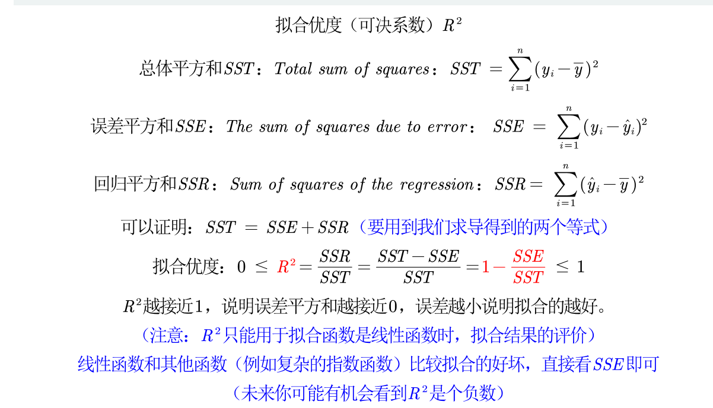
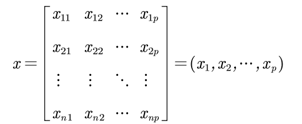
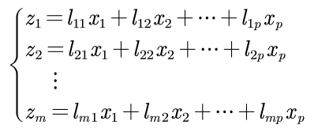
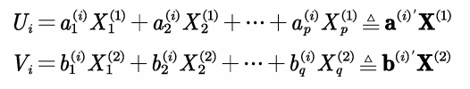

# 数学建模

## 评价类问题

- 我们评价的目标是什么
- 为了达到目标有几种方案
- 评价的准则或者说指标是什么（如何评价好坏


## 层次分析法

通过判断矩阵来得出权重

正互反矩阵满足：
$$
a_{ij}*a_{ji}=1
$$
一致矩阵满足：
$$
a_{ij}*a_{jk}=a_{ik}
$$
求权重前要判断是否是一致矩阵（判断是否成比例

### 一致性检验步骤

1. 计算一致性指标CI
   $$
   CI=\dfrac{\lambda_{max}-n}{n-1}
   $$
   
2. 查找平均随机一致性指标RI

   查表查出来的

3. 计算一致性比例CR
   $$
   CR=\dfrac {CI}{RI}
   $$
   

**如果CR<0.1，则认为一致性可以接受**

RI的值：

用随机的方法构造500个样本矩阵，随机从1-9及其倒数抽取数字构造正互反矩阵，求最大特征根的平均值$$\lambda_{max}$$并定义
$$
RI=\dfrac{\lambda^{'}_{max}-n}{n-1}
$$
算数评价求权重：

1. 按列归一化
2. 将归一化的各列相加求平均

F4锁定单元格


用层次分析法，就一定要使用层次结构图 


## Topsis法

正向化处理

1.极小型->极大型指标
$$
max-x或\dfrac{1}{x}
$$


2.中间型指标
$$
M=max\{|x_i-x_{best}\}, \tilde{x_i}=1-\dfrac{|x_i-x_{best}|}{M}
$$


讲原始矩阵统一转换为极大型指标

 

标准化处理 避免不同数据的量纲不同

 构造计算评分的公式
$$
\dfrac{x-min}{max-min}
$$


## 模糊分析法

隶属函数，将数值映射到区间里面

隶属度

##### 模糊集合的三种表示方法

###### Zadeh表示法

$$
A=\dfrac{A(x_1)}{x_1}+\dfrac{A(x_2)}{x_2}+...+\dfrac{A(x_n)}{x_n}
$$

序偶表示法
$$
A=\{(x_1,A(x_1)),...,(x_n,A(x_n))\}
$$
向量表示法
$$
A=\{A(x_1),A(x_2),...,A(x_n)\}
$$


##### 隶属函数的确定方法

###### 问卷

###### 借助已有的尺度

 ex：恩格尔系数，记得归一化

###### 指派法（主观性比较强）


## 相关系数

经常使用抽样的统计量估计总体统计量

协方差可以反应两个变量的相关性，协方差不能直接比较，因为他们有量纲，皮尔逊相关系数就是为了消除这个影响

### 皮尔逊相关系数

目的：消除变量量纲的影响，也即X和Y标准化后的协方差

总体均值： $$E(X)=\dfrac{\sum_{i=1}^{n}X_1}{n}$$

总体协方差：$$Cov(X,Y)=\dfrac{\sum_{i=1}^{n}(X_i-E(X))(Y_i-E(Y))}{n}$$

总体*Person*相关系数：$$\rho_{xy}=\dfrac{Cov(X,Y)}{\sigma_x\sigma_y}=\dfrac{\sum_{i=1}^n{\dfrac{(X_i-E(X))}{\sigma_x}}{\dfrac{(Y_i-E(Y))}{\sigma_y}}}{n}$$

$$\sigma_x(sigma X)是X的标准差$$，$$\sigma_x=\sqrt{\dfrac{\sum_{i=1}^1(X_i-E(X))^2}{n}}$$，$$\sigma_y=\sqrt{\dfrac{\sum_{i=1}^1(y_i-E(Y))^2}{n}}$$


**特殊情况下：**$$|\rho_{xy}|\le1且Y=aX+b时，\rho_{xy}= \left\{  \begin{aligned}  1,a>0 \\ -1,a<0 \end{aligned}\right.$$

- 皮尔逊相关系数只用来衡量两个变量线性相关的指标
- 只有**确认线性相关**才可以使用皮尔逊相关系数

比起相关系数的大小，我们更关注显著性检验

可以通过图表的方式展示是否具有线性关系，很直观


#### 步骤：

- 先做一个统计性描述

- spss画出散点图

- matlab计算皮尔逊相关系数

  ```matlab
  R=corrcoef(A) #返回每两个变量的相关系数
  ```

- 美好输出的矩阵


### 假设检验


### 皮尔逊相关系数的假设检验

当相关系数为0.3时，我们希望知道这个值和0有没有显著差异

步骤：

1. 提出假设
2. 构造某一分布量，在这里可以构造自由度为n-2的t分布
3. 进行检验

```matlab
[R,P]=corrcoef(test) %P返回的就是假设检验的概率值
```


### 对数据进行正态分布检验

对相关系数进行假设检验前必须要进行正态分布检验

#### 正太分布JB检验(大样本，30)

对于一个随机变量，假设其偏度为S，峰度为K，那么我们可以构造JB统计量：
$$
JB=\frac{n}{6}[S^2+\frac{(K-3)^2}4]
$$
如果$${X_i}$$符合正太分布，那么大样本情况下$$JB\sim  \chi^2(2)$$

之后进行假设检验

原假设：符合正态分布

```matlab
[h,p] = jbtest(x,alpha) %x为向量，alpha为显著性水平，一般为5%
```


#### Shapiro-wilk夏皮洛-威尔克检验(小样本)

spss 探索 完成

3-50

假设：$$H_0: 数据符合正态分布$$


#### QQ图

可以大致显示是否为正态分布，依然需要大样本


### 斯皮尔曼spearman相关系数

假设X和Y为两组数据
$$
r_s=1-\frac{6\sum_{i-1}^{n}d_i^2}{n(n^2-1)}
$$
$$d_i定义为X_i与Y_i的等级差$$


### 如何选择相关系数

1. 连续，线性，正太，用person
2. 上述任意不满足，用spearman
3. 有定序数据的情况下只能用spearman


## 多元回归分析

通过研究X和Y的相关关系，尝试去解释Y的形成机制，进而达到通过X去预测Y的目的。

数据的类型：

- 连续数值
- 0-1变量
- 定序变量（ex：打等级）
- 计数变量（ex：客户到访的次数）
- 生存变量


### 回归分析使命

1. 区分什么是真相关关系
2. 回答是正相关还是负相关
3. 确定了重要的x变量的前提下，我们**想赋予X不同权值，也就是不同的回归系数，进而我们可以知道不同变量之间的相对重要性**


### 数据分类

横截面数据：某一时间收集的不同对象数据

时间序列数据：同一个对象不同时间

面板数据：以上两种综合


数据收集网站

**到时候看课件！**


### 线性回归理解

拟合过程中，目的是使残差最小

$$
y_i=\beta_0+\beta_ix_i+\mu_i
$$
线性关系在这里不是严格线性的，自变量和因变量通过变量变换而转换为线性模型


#### 内生性

如果满足误差项u与所有自变量x均不相关，则称该回归模型具有**外生性**

遗漏变量对参数影响很大，而且要保证误差项u和所有的自变量x均不相关

误差项$$u_i$$包含了所有与y相关但是未添加到回归模型中的变量，如果这些变量和我们已经添加的自变量相关，则存在内生性


在实际应用中，我们只需要保证扰动项和核心解释变量不相关


### 四种模型

- 我们一般不关注偏置项，因为不会所有自变量都为0
- 注意解释核心控制变量


#### 什么时候取对数

当增加不是数值变化时，而是比例变化时，比如每次增加10%的工资。

EX：

1. 与市场价值有关的，例如，价格、销售额、工资等都可以
2. 以年为度量的变量，如教育年限、工作经历等往往不取对数
3. 比例变量，如失业率，参与率等
4. 变量取值必须是非负数，如果为0，则取$$ln(1+x)$$


##### 取对数的好处

1. 减少异方差性性
2. 使变量符合或者渐进正态分布
3. 模型需要


#### 四种模型

1. 一元线性回归：$$y=ax+b+u$$，x每增加一个单位，y平均变化a
2. 双对数模型：$$lny=a+blnx+u，x每增加1%，y平均变化b%$$
3. 半对数模型：


#### 虚拟变量

将定性变量转换为数据变量


### 实操

State软件：到时候具体再看清风的教程叭

- 导入数据：文件，导入，EXCEL

- 描述性统计：

  - 数值变量：Summarize 变量1，变量2

  - 分类变量：tabulate 变量名1, gen(AA)
    - AA为虚拟变量

- 回归：regress y x1 x2 x3...xk
  - 默认OLS，普通最小二乘估计法

- 检验的要求：原假设，p值
  - 在这个问题中，原假设是系数都为0，查看prob值是否小于0.05，这样就可以拒绝原假设
  - coef就是回归系数，P>|t|是显著性检验

- 对每一个变量都要进行显著性检验，如果变量不显著，则不讨论该变量


**Excel的数据透视表**


如何处理拟合优度的问题


- 研究影响评价量的重要因素
  - 标准化回归系数
  - 标准化回归系数越大，说明对因变量的影响越大


一些需要避免的问题：

- 不要归一化，不好解释
- 解释性回归尽量不要加入高次项，不好解释


中国地图数据图！！！这个在它的论文讲解当中


### 异方差

之前的回归分析中，我们默认了扰动项是球形扰动项（满足同方差和无自相关性）

1. 


## 插值算法

数据少的模型

### 一般多项式插值模型

- 只要n+1个节点互异，满足上述多项式插值条件的多项式是唯一存在的
- 如果不限制多项式的次数，插值多项式并不唯一

#### 拉格朗日插值

$$
f(x)=\dfrac{x-x_1}{x_0-x_1}y_0+\dfrac{x-x_0}{x_1-x_0}
$$

高次插值时会出现龙格现象，两端波动大

**问题**

1. 高次插值多项式精度未必提高
2. 插值多项式次数越高摄入误差可能显著增加

**分段线性插值可以优化**


#### 牛顿插值法

利用差值来构造函数

k阶差商
$$
f[x_1,x_2,...,x_k]=\dfrac{f[x_1,...x_{k-1},x_k]-f[x_0,x_1,...x_{k-1}]}{x_k-x_0}
$$
**优点**：计算过程具有继承性  **缺点**：也存在龙格现象


### 分段三次Hermite插值原理

保证函数和导数都相等

```matlab
pchip()
```


### 三次样条插值

**选一种或者取平均**


## 拟合算法

和插值算法的区别：

不要求经过所有的样本点，保证误差足够小就可以

**如何判断最接近：**最小二乘法
$$
\hat{k},\hat{b}=\mathop{arg\min}\limits_{k,b}(\sum^n_{i=1}({y-\hat{y_i}})^2)
$$
**为什么不选择其他方式：**

1. 绝对值不好求导，不容易优化
2. 三次方无法解决正负问题
3. 四次方产生误差较大

**如何评价：**

拟合优度（可决系数）$$R^2$$




## 分类模型

二分类 多分类

### 逻辑回归

生成虚拟变量

如果直接使用线性概率模型，会出现内生性问题，回归系数估计出来不一致且有偏

需要找一个值域在[0,1]的函数：

- 标准正态函数的累计密度函数

- sigmoid函数

sigmoid函数多一些，通过极大似然估计计算出$$\beta$$

极大似然估计是一个迭代的算法，需要设置迭代次数

如何提高预测正确率：

添加平方项或者交叉项（可能过拟合）


## 主成分分析

降维算法，将多个指标转换为少数几个主成分，主成分是原始变量的线性组合，且彼此互不相关

> 降维：将高维度的数据保留下最重要的特征，去除噪声和不重要的特征	

n个样本，p个指标，可以构成$$n\times p$$的样本矩阵：



我们需要找到一组新的变量，这个变量是每一个参数的线性组合：



确定原则：

1. 两两相互无关
2. $$z_1到z_n$$的排序是按照方差的顺序排序的


计算步骤：

1. 按列进行标准化，计算均值和标准差，按照以下公式标准化数据：

$$
X_{ij}=\frac{x_{ij}- \overline{x_j}}{S_j}
$$

2. 计算标准化样本的协方差矩阵

$$
r_{ij}=\frac{1}{n-1}\sum^n_{k=1}(X_{ki}-\overline{X_i})(X_{kj}-\overline{X_j})=\frac{1}{n-1}\sum_{k=1}^{n}X_{ki}X_{kj}
$$


## 因子分析

> 因子分析通过研究变量间的相关系数矩阵，把这些变量间错综复杂的关系归因于少数几个综合因子
>
> 能用主成分分析就一定能用因子分析


## 典型相关分析

我们之前研究的相关分析均聚焦于一元统计分析中，而对于一组数据的相关性无能为力 。	

> 目的：识别并量化两组变量之间的联系，将两组变量相关关系的分析，转化为一组变量的线性组合与另一组变量线性组合之间的相关关系分析
>

如何选择代表：**该组变量的线性组合**

在每组变量之间找到变量的线性组合，使得两组线性组合之间具有最大的相关系数


如何做：

1. 在两组变量中选择具有代表性的综合变量$$U_i,V_i$$，使得每一个综合变量是原变量的线性组合

   

   综合变量的数量是不确定的，如果第一组就能代表原本数据的大部分信息，那么一组就足够了

2. 为了让第二组数据有效，则要和之前的数组的相关性为0
   $$
   不相关：cov(U_1,U_2)=cov(V_1,V_2)=0
   $$


第一组需要满足的条件：

在方差$$var(U_1)=var(V_1)=1$$的条件下，找到$$a^{(1)}和b^{(1)}$$两组系数，使得$$\rho(U_1,V_1)=\rho(aU_i,bV_i)$$

因为相关系数和量纲无关！！


### 公式推导：

设有两组随机向量，$$X^{(1)}$$代表第一组的p个变量，$$X^{(2)}$$代表第二组的q个变量，假设$$p \ge q $$
$$
Cov(X^{(1)})=\begin{matrix} \sum_{11} \end{matrix} \quad Cov(X^{(2)})=\begin{matrix} \sum_{22} \end{matrix} \quad Cov(X^{(1)},X^{(2)})=\begin{matrix} \sum_{12} \end{matrix} =\begin{matrix} \sum_{21} \end{matrix}
$$

$$
D\text{(}X\text{)}=Cov\text{(}X,X\text{)}=Cov\text{(}X\text{)}=E\text{[(}X-E\text{(}X\text{))(}X-E\text{(}X\text{))}^T\text{]}
$$

X是一个n维随机向量，即：

$$
X\,\,=\,\,\left[ \begin{array}{c}
	X_1\\
	X_2\\
	\vdots\\
	X_n\\
\end{array} \right] \,\,,\,\,\text{这里}X_i\text{(}i\,\,=\,\,1,2,\cdots ,n\text{)均为随机变量\,\,\,\,}
$$
$$
\text{那么}E\text{(}X\text{)\,\,}=\,\,\left[ \begin{array}{c}
	E\text{(}X_1\text{)}\\
	E\text{(}X_2\text{)}\\
	\vdots\\
	E\text{(}X_n\text{)}\\
\end{array} \right] \,\,\text{，\,\,}D\text{(}X\text{)}=Cov\text{(}X,X\text{)}=Cov\text{(}X\text{)}=E\text{[(}X-E\text{(}X\text{))(}X-E\text{(}X\text{))}^T\text{]}
$$
如果a是一个列常数向量，则:
$$
D\text{(}a^TX\text{)\,\,}=\,\,E\text{[(}a^TX-E\text{(}a^TX\text{))(}a^TX-E\text{(}a^TX\text{))}^T\text{]}=a^TE\text{[(}X-E\text{(}X\text{))}^T\text{(}X-E\text{(}X\text{))]}a\\=a^TD\text{(}X\text{)}a
$$
$$
\text{如果}X\text{和}Y\text{均为}n\text{维随机向量，那么}Cov\text{(}X,Y\text{)}=E\text{[(}X-E\text{(}X\text{))(}Y-E\text{(}Y\text{))}^T\text{]}
$$
$$
Cov\text{(}aX,bY\text{)}=E\text{[(}aX-E\text{(}aX\text{))(}bY-E\text{(}bY\text{))}^T\text{]}=aE\text{[(}X-E\text{(}X\text{))(}Y-E\text{(}Y\text{))}^T\text{]}b^T
$$
典型相关系数通过协方差矩阵求得的，涉及n维随机向量，有点绕


### 关键步骤

1. 数据分布假设：

实际使用该方法时，一定要给出数据符合正态分布的假设

2. 对两组变量的相关性进行检验

构造似然比统计量

3. 确定典型相关的个数
4. 利用标准化后的典型相关变量分析，如果不进行标准化，量纲会影响分析的合理性
5. 进行典型载荷数据分析


# 论文部分


## 绘图

- excel绘图时不要带标题
- 数据分析构造频率直方图

- 直方图比较数据的分布，柱状图比较数据的大小

- 时间期数多的时候用折线图

- 加上数字可以输入文字形式 


### 配色

https://mycolor.space/：根据一个颜色进行推荐

https://colorhunt.co/：直接推荐配色


### Python画图

Seaborn可视化库在数据科学领域是重量级的存在。

官方图库：https://seaborn.pydata.org/examples/index.html

要画的时候可以去里面找参考，点击有代码


教程：https://seaborn.pydata.org/tutorial/introduction.html


#### 风格管理

`sns.set()`可以设置5种风格的图表背景：darkgrid, whitegrid, dark, white, ticks，通过参数style设置，默认情况下为darkgrid风格：


### matlab绘图

阿昆的科研日常：https://www.zhihu.com/column/c_1074615528869531648

这里面讲的非常全，有代码


### 网站

https://www.bioladder.cn/web/#/pro/cloud

比如词云，弦图等


### 软件绘图

软件Gephi

Tableau：绘制地理图

一个介绍网站：https://levitate-qian.github.io/2020/05/04/10%E7%B1%BB%E6%A1%88%E4%BE%8B%E5%B8%A6%E4%BD%A0%E4%BA%86%E8%A7%A3%E8%AE%BA%E6%96%87%E6%8F%92%E5%9B%BE%E5%88%B6%E4%BD%9C/
