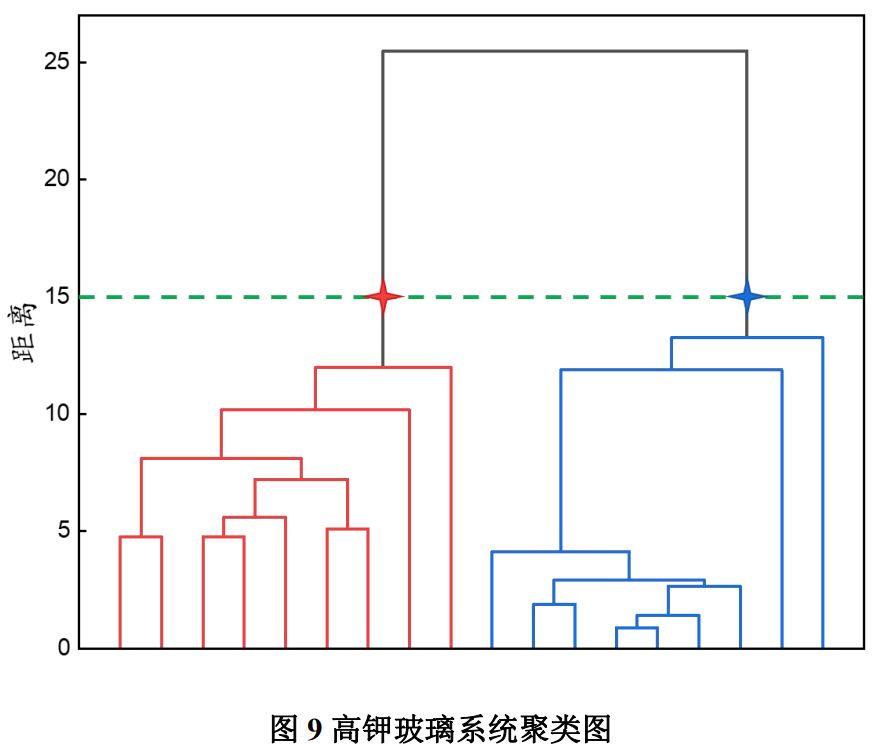

## 绘图

- excel绘图时不要带标题
- 数据分析构造频率直方图

- 直方图比较数据的分布，柱状图比较数据的大小

- 时间期数多的时候用折线图

- 加上数字可以输入文字形式 

### 配色

https://mycolor.space/：根据一个颜色进行推荐

https://colorhunt.co/：直接推荐配色

### Python画图

Seaborn可视化库在数据科学领域是重量级的存在。

官方图库：https://seaborn.pydata.org/examples/index.html

要画的时候可以去里面找参考，点击有代码

教程：https://seaborn.pydata.org/tutorial/introduction.html

#### 风格管理

`sns.set()`可以设置5种风格的图表背景：darkgrid, whitegrid, dark, white, ticks，通过参数style设置，默认情况下为darkgrid风格：

### matlab绘图

阿昆的科研日常：https://www.zhihu.com/column/c_1074615528869531648

这里面讲的非常全，有代码

### 网站

https://www.bioladder.cn/web/#/pro/cloud

比如词云，弦图等

### 软件绘图

软件Gephi

Tableau：绘制地理图

一个介绍网站：https://levitate-qian.github.io/2020/05/04/10%E7%B1%BB%E6%A1%88%E4%BE%8B%E5%B8%A6%E4%BD%A0%E4%BA%86%E8%A7%A3%E8%AE%BA%E6%96%87%E6%8F%92%E5%9B%BE%E5%88%B6%E4%BD%9C/

## 各种图的意义

### 箱线图

箱线图是一个能够通过5个数字来描述数据的分布的标准方式，这5个数字包括：最小值，第一分位，中位数，第三分位数，最大值，箱线图能够明确的展示离群点的信息，同时能够让我们了解数据是否对称，数据如何分组、数据的峰度；

箱线图是一种基于五位数摘要（“最小”，第一四分位数（Q1），中位数，第三四分位数（Q3）和“最大”）显示数据分布的标准化方法。

1. 中位数（Q2 / 50th百分位数）：数据集的中间值；
2. 第一个四分位数（Q1 / 25百分位数）：最小数（不是“最小值”）和数据集的中位数之间的中间数；
3. 第三四分位数（Q3 / 75th Percentile）：数据集的中位数和最大值之间的中间值（不是“最大值”）；
4. 四分位间距（IQR）：第25至第75个百分点的距离；
5. 晶须（蓝色显示）
6. 离群值（显示为绿色圆圈）
7. “最大”：Q3 + 1.5 * IQR
8. “最低”：Q1 -1.5 * IQR

## 各种图的绘制方法

### 聚类图

SPSS绘制，ppt 或者 PS填充颜色

### 散点图

没有类别：

区分类别：

**多种图并列：**

.png)

### 折线图

