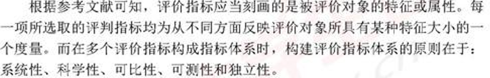

# 论文

## 题目

题目：1.基于什么方法的什么模型

​     	 2.用问题

## 摘要

第一段先写出建模的成果

然后分别对每个问题进行一段话的描述（什么方法，什么效果，结论是什么）

最后进行总结

 

关键词 ：摘要 模型

PS：

- 摘要最后写！

- 不能超过一页

## 问题重述

简短 不能照抄

 

简单做法  划水 换词

复杂做法  丰富题目背景 结合自己的分析思路来描述问题

 

问题分析：题目包含的信息条件 用什么方法 每个问题单独一段 不需要结论

更好的是画图

 

 

问题假设：
 题目中给出的明确假设 

假设排除小概率事件

考虑问题中的核心因素 次要因素忽略 （不能说过于简化）！

模型中的假设：

1.    博弈论中都是理性人

2.    回归模型符合正态分布

对模型中的参数进行假设 

 

模型假设：

合理性！！（从以前的论文）

 

画图软件

 

符号说明：符号  说明  单位经·

常用的 通用的变量

 

模型的建立与求解

建立：套用别人的模型 使用软件 改善模型可以成为你的论文的亮点 模型和问题一定要紧密联系。

优化类问题：目标函数+优化条件

 

求解：初始解 答案简明扼要

 

模型的分析与检验：

分析：灵敏度分析：控制变量！！ 改变某个参数 

误差分析：寻找误差点

 

检验：稳定性检验 （和灵敏度检验相似，一个是为了找出结果与变量的关系，另一个是为了

 

 

模型的评价、改进与推广

评价：优缺点；优点多于缺点；

改进：

推广：

 

## 参考论文

- 最好要有15-20条参考论文

 

附录：

支撑性文件

交互式代码

 

 

 

符号说明

# 论文注意

## 代码降重

方法一：给代码加上自己的注释

大家比赛时肯定会参考很多现成的代码，但是这就有了重复率的风险。在大家照搬其他人代码后，可以按照自己的理解对代码进行一个自己的注释，可以对代码的逻辑，数值传递，甚至是一些现有函数的功能进行注释这样就可以有效的降低代码的重复率。

方法二：改变代码的变量名称

大家可以选择改变代码中的变量名称来降低重复率，在文本中搜索时可以用（Ctrl+F）做到一键替换、可以将变量的名称改为全称或者简称，从而进行简单有效的降重。

方法三：利用公式编辑器

 大家在降低重复率时可以选择用公式编辑器将重复率高的部分全部换为公式，或者插入文本框。这是最简单快捷的，但是作者对这种行为并不提倡，希望大家可以用自己的想法写出自己的文章。

方法四：做成表格

将自己的数据或者其他的罗列换成表格形式，可以有限避免查重。

## 写的好的

## 每一问要包含的内容

为什么选择这个模型（与其他模型相比的优点）

如何建立

结果是什么

结果分析

## 绘图

- excel绘图时不要带标题
- 数据分析构造频率直方图

- 直方图比较数据的分布，柱状图比较数据的大小

- 时间期数多的时候用折线图

- 加上数字可以输入文字形式 

### 配色

https://mycolor.space/：根据一个颜色进行推荐

https://colorhunt.co/：直接推荐配色

### Python画图

Seaborn可视化库在数据科学领域是重量级的存在。

官方图库：https://seaborn.pydata.org/examples/index.html

要画的时候可以去里面找参考，点击有代码

教程：https://seaborn.pydata.org/tutorial/introduction.html

#### 风格管理

`sns.set()`可以设置5种风格的图表背景：darkgrid, whitegrid, dark, white, ticks，通过参数style设置，默认情况下为darkgrid风格：

### matlab绘图

阿昆的科研日常：https://www.zhihu.com/column/c_1074615528869531648

这里面讲的非常全，有代码

### 网站

https://www.bioladder.cn/web/#/pro/cloud

比如词云，弦图等

### 软件绘图

软件Gephi

Tableau：绘制地理图

一个介绍网站：https://levitate-qian.github.io/2020/05/04/10%E7%B1%BB%E6%A1%88%E4%BE%8B%E5%B8%A6%E4%BD%A0%E4%BA%86%E8%A7%A3%E8%AE%BA%E6%96%87%E6%8F%92%E5%9B%BE%E5%88%B6%E4%BD%9C/

## 各种图的意义

### 箱线图

箱线图是一个能够通过5个数字来描述数据的分布的标准方式，这5个数字包括：最小值，第一分位，中位数，第三分位数，最大值，箱线图能够明确的展示离群点的信息，同时能够让我们了解数据是否对称，数据如何分组、数据的峰度；

箱线图是一种基于五位数摘要（“最小”，第一四分位数（Q1），中位数，第三四分位数（Q3）和“最大”）显示数据分布的标准化方法。

1. 中位数（Q2 / 50th百分位数）：数据集的中间值；
2. 第一个四分位数（Q1 / 25百分位数）：最小数（不是“最小值”）和数据集的中位数之间的中间数；
3. 第三四分位数（Q3 / 75th Percentile）：数据集的中位数和最大值之间的中间值（不是“最大值”）；
4. 四分位间距（IQR）：第25至第75个百分点的距离；
5. 晶须（蓝色显示）
6. 离群值（显示为绿色圆圈）
7. “最大”：Q3 + 1.5 * IQR
8. “最低”：Q1 -1.5 * IQR

## 各种图的绘制方法

### 聚类图

SPSS绘制，ppt 或者 PS填充颜色

### 散点图

没有类别：

区分类别：

**多种图并列：**

.png)

### 折线图

