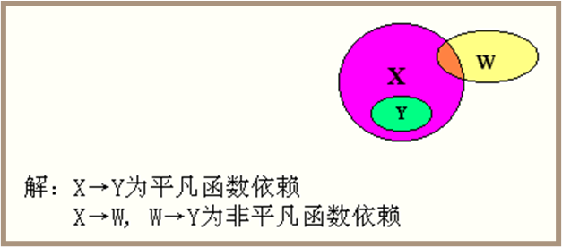
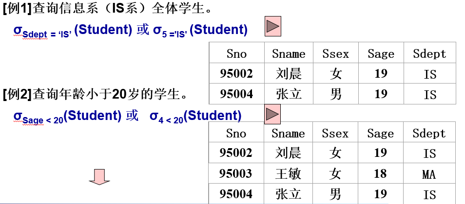
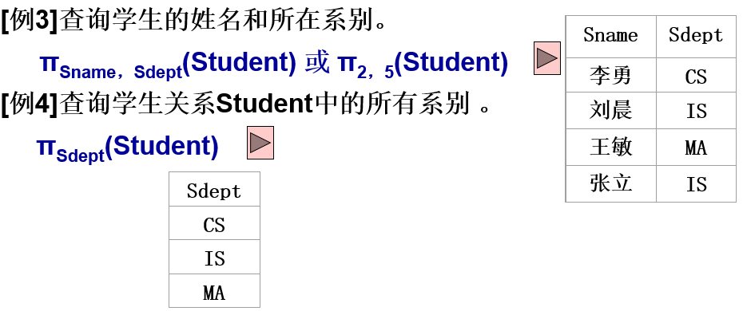
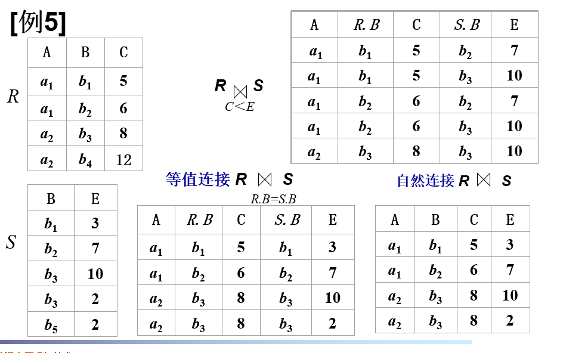
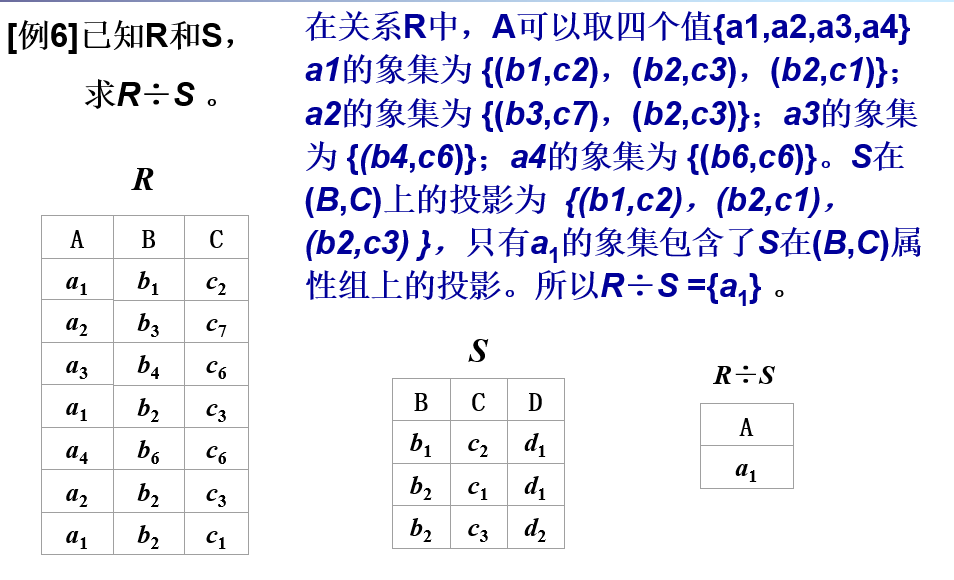
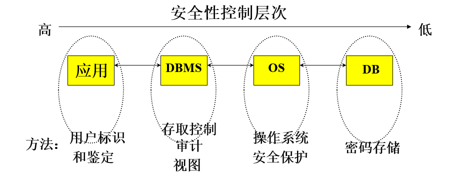

# 数据库系统原理

## 引言

### 数据管理的阶段

- 人工管理
  - 纸质或者物理方式
  - 容易丢数据
  - 数据重复
- 计算机出现以后，通过文件系统方式存储数据
  - 如今仍然使用文件方式保存
  - 不能实现记录和数据项的访问和共享，数据冗余大，利用率低
  - 逻辑文件和物理文件间的独立性差，物理文件结构的改变影响程序的运行。
  - 应用程序设计困难，程序员要进行程序设计实现对数据的操作，（查找、插入、删除、修改）对程序员的算法和程序设计的能力要求高。
  - 易造成数据的不一致性。 

### 数据库系统的组成:star::star::star:

数据库
- 逻辑上看，它是数据的集合；物理上看，它就是一些数据的文件
- 它把我们关心的数据的集合按一定结构组织、描述存储在一起

数据库管理系统（核心）（DMBS, Database Management System）
- 专门描述、管理和维护数据库的系统
- 建立在操作系统之上，对数据库统一管理

数据库应用程序
- 允许用户开发数据库的工具
- 能让用户方便的获取、更新和利用数据库管理系统中管理和维护的数据库中的数据。
- 是数据库系统的核心组成部分,它连接着数据库应用程序和数据库

数据库管理员

- 决定数据库中的信息内容和数据的逻辑结构。
- 决定数据库的存储结构和存取策略。
- 定义数据的安全性要求和完整性约束条件。
- 数据库系统的日常维护：周期性转储数据库、故障恢复、监督系统运行、优化系统性能、设置必要的审计。
- 重组和重构数据库。

### 数据库体系结构 :star::star::star:

#### 三级结构

三个抽象极：用户级，概念级，物理级

物理级（**内模式**）：描述数据的实际存贮组织，内部由记录组成，又称为内部视图，**物理级数据库并不是真正的物理存贮，而是是最接近于物理存贮的级。**

概念极（**概念模式**）：介于用户级和物理级之间，是**所有用户视图的最小并集**，数据库管理员看到的。

用户级（**外模式**）：用户看到和使用的数据库，又称为用户视图，不同用户视图可以互相重叠，用户的所有操作都是针对用户视图进行。

用户级和概念级：

- 一个数据库可有多个不同的用户视图，每个用户视图由数据库某一部分的抽象表示所组成。
- 一个数据库应用系统只存在一个DBA视图，它把数据库作为一个整体的抽象表示。概念级模式把用户视图有机地结合成一个整体，综合平衡考虑所有用户要求。
- 实现数据的一致性、最大限度降低数据冗余、准确地反映数据间的联系。

#### 两级独立性

数据库系统两级独立性：逻辑独立性、物理独立性

- 三个抽象级间通过两级映射（根据一定的对应规则）进行相互转换，
- 使得数据库的三级形成一个统一整体。
- 映射隔离了各层之间的相互影响，实现数据独立性。
- 各层间的映射能力决定数据独立性程度。

物理独立性：底层数据的物理形式的变化对于数据的使用者来说是不透明的。当内模式改变之后，只需要对概念模式/内模式映射修改，而不用改变应用程序。

逻辑独立性：用户的应用程序与数据库的逻辑结构是相互独立的，当概念模式改变时，只需要改变概念模式/外模式映射即可，不用改变应用程序。

#### 数据模型

- 关系模型
- 实体-联系模型
- 基于对象的数据模型

DBMS主要有：

1. 层次数据库系统
2. 网状数据库系统
3. 关系数据库系统

## 关系模型与完整性

### 数据描述

- 现实世界
  - 存在于人们头脑之外的客观世界，称为现实世界
  - 现实世界中的数据是原始数据，是数据库设计者的原材料
- 信息世界
  - 信息世界是现实世界在人们头脑中的反映，并用文字和符号记载下来
- 机器世界（或计算机世界）
  - 信息世界的信息在机器世界中以数据形式存储

#### 信息世界的数据描述术语

实体

- 客观存在东西称为实体。实体可以是具体的对象，也可以是抽象的事件，例如：一名男学生，一辆汽车等；一次足球比赛，一次借书等。

实体集

- 性质相同的同类实体的集合，称为实体集。例如所有的男学生，全足球锦标赛的所有比赛等。

属性

- 实体有很多特性，每一个特性称为属性。每个属性有一个值域，其类型可以是整数型、实数型或字符串型。例如学生有学号、姓名、年龄等属性，相应值域为字符串、字符串、整数。

实体键

- 能唯一标识每个实体的属性或属性集，称为实体的键。例如学生的学号可以作为学生实体的键。

#### 机器世界的数据描述术语

字段

- 标记实体属性的命名单位称为字段或数据项。它是可以命名的最小信息单位，所以又叫数据元素或初等项。字段的命名往往和属性名相同。例如学生有学号、姓名、年龄、性别等字段。

记录

- 字段有序集合称为记录。一般用一个记录描述一个实体，所以记录又可以定义为能完整地描述一个实体的字段集。例如一个学生记录（990001，王军，20，男，计算机）由有序的字段集组成。

文件

- 同一类记录的汇集称为文件。文件是描述实体集的，所以它又有可以定义为描述一个实体集的所有记录集。例如所有的学生记录组成了一个学生文件。

记录键

- 能唯一标识文件中每个记录的字段或字段集，称为文件的键（或记录的键）。这个概念与实体集的键概念相对应。例如学生的学号可以作为学生记录

### 术语:star::star:

- 关系，通俗地讲就是一张**二维表**，表名就是关系名
- 属性：**二维表中的列**称为属性
- 元组：**二维表中一行**称为一个元组，元组中的每一个属性值称为元组分量
- 关系模式：二维表的结构。可以表示未REL（A,B,C,D）
- 候选码：如果一个属性集（一个或多个属性）的值能够唯一标识一个关系的元素，又不含有多余的属性，就称他为候选码。一个关系上可以有多个候选码。
- 主键：当一个关系有多个候选码时，可以选出一个作为主键。
- 主属性：包含在任意候选码中的属性
- 非主属性：不包含在候选码中的属性
- 外键：如果关系模式R中的属性K是其他关系模式的主键，则说K是关系模式R的外键。

### 实体－联系模型 ER模型

实体 属性 联系

联系有 `1-1 1-n n-n`

实体一般是长方形来体现，而属性则是椭圆形，关系则用菱形表示，关系也可能有属性

每个实体有一个键，唯一的确认实体

在建立 E-R图的时候，应根据实际应用首先确定哪些是实体集，有多少个实体集，其次确定实体集的属性，然后再确定这些实体集之间存在什么联系及联系的属性。

属性的更详细的画法

- E-R图中: 带下划线的属性为实体键或实体键的一部分。 组合属性用一个树型表示。多值属性用虚线椭圆表示或标出。
- 关系型数据库系统不能处理组合属性和多值属性的情况，实际操作时要转化成原子属性和单值属性的情况。

### 关系数据模型完整性约束规则:star::star::star:

- **完整性约束**（关系数据库模型的重要组成部分 ）
  - 数据库管理系统通过对单个属性的取值范围、主关键字的属性以及属性之间的关系加以约束，以及提供对违反约束的处理过程实现保证数据库的数据与现实世界的一致性。 

- 域完整性 
  - **数据类型约束**：确保数据项符合预定的数据类型（如整数、浮点数、字符串等）。
  - **范围约束**：确保数据项在一个特定的值范围内（例如，年龄字段必须是从0到120之间的整数）。
  - **格式约束**：确保数据项符合特定格式（例如，邮件地址或电话号码的格式）。
  - **唯一性约束**：某些字段的值必须唯一，例如用户ID或电子邮件地址。
  
- **实体完整性约束**
  - **主关键字**上值必须是唯一的且非空。 

- **引用／参考完整性**约束
  - **外键必须是空或者另一张表上的主键** 

- 用户自定义完整性约束
  - **外键约束**：用于维护表之间的关联性，确保一个表中的字段值在另一个表中有相对应的值。
  - **检查约束**（CHECK约束）：确保字段值必须满足某个指定的条件，比如“员工的入职日期必须在其出生日期之后”。
  - **复合约束**：涉及多个字段的约束条件，例如，“库存数量必须大于或等于订购数量”。

### 将实体联系模型转化为关系数据模型 

**规则1** 

- **每个实体类型转化为一个关系模式**，实体的属性转化为该为关系模式的属性：实体标识符（实体健）转化为该关系模式的键，每一个实体转化为该关系模式对应关系的一个元组。 

**规则2** 

- 实体类型间的每一个自身有属性的联系转化为一个关系模式，该联系的属性直接转化为该关系模式的属性，与该联系所关联的所有实体类型的实体键都转化为该关系模式的属性，共同组成该关系模式的主关键字。 

**规则3** 

- 若联系自身无属性

- 对1:N型联系，则1侧实体类型的实体健转化为属性加入到N侧实体类型 

- 对M:N型联系，则两侧实体类型的实体键都转化为属性，互相加入到对侧实体类型所转化后的关系模式中，和该关系模式的原主关键字一起，共同构成该关系模式新的主关键字；或者建立一个新关系模式关键字是关系的双方的主键共同组成（推荐后面这种）

- 对 1:1 型联系，则按1:N或M:N处理。

**简单说：**有属性的实体类型或者联系变成表，没有属性的联系将1的属性放到N中

## 函数依赖与范式

一篇很好的例子：https://zhuanlan.zhihu.com/p/20028672

### 规范化的方向

好的关系模式具有四个条件：

- 尽可能少的数据冗余
- 没有插入异常
- 没有删除异常
- 没有更新异常

符号表示：

- 若X→Y，则X称为决定因素。 
- 若X→Y，Y→X，则记作X←→Y。 
- 若Y不函数依赖于X，则记作X\→Y。 

- 平凡函数依赖

- 非平凡函数依赖

  

### 函数依赖:star::star:

**若在一张表中，在属性（或属性组）X的值确定的情况下，必定能确定属性Y的值，那么就可以说Y函数依赖于X，写作 X → Y**（X决定Y）

在数据表中，不存在任意两条记录，它们在X属性（或属性组）上的值相同，而在Y属性上的值不同。

#### 完全函数依赖

在一张表中，若 X → Y，且对于 X 的任何一个真子集（假如属性组 X 包含超过一个属性的话），X ' → Y 不成立，那么我们称 Y 对于 X **完全函数依赖**

#### 部分函数依赖

假如 Y 函数依赖于 X，但同时 Y 并不完全函数依赖于 X，那么我们就称 Y 部分函数依赖于 X，记作 X P→ Y

例如：（学号，课名） P→ 姓名

#### 传递函数依赖

- 假如 Z 函数依赖于 Y，且 Y 函数依赖于 X （严格来说还有一个X 不包含于Y，且 Y 不函数依赖于Z的前提条件），那么我们就称 Z 传递函数依赖于 X ，记作 X T→ Z

### 范式（Normal Form）:star::star::star:

在关系模式的设计中，函数依赖起着重要作用，关系模式设计的好坏依赖于它的函数依赖是否满足特定的要求。满足特定要求的模式称为范式，满足不同程度要求的模式为不同范式。

第一范式：每一列属性不可分解，不满足这个属性则不能被称为关系型数据库

第二范式：每一个非主属性完全函数依赖于主键

第三范式：每一个非主属性不传递函数依赖于主键

BCNF 范式：**在野者不能干政**：**老板不能受到候选人的制约**，主属性不能由另一个主属性决定！！！

第四范式：关系模式的属性之间不允许有非平凡且非函数依赖的多值依赖。

### 判断候选码

1. 没在函数依赖集中，一定在候选中
2. 只在右边，一定不是候选
3. 只在左边，一定是候选
4. 能唯一的标识元组

### 最小依赖集

1. 先将右边分成独立的
2. 一个个去除X->a，然后求X的闭包，看是否包含a，如果包含就可以去除
3. 对多个的属性决定的关系，依次去除其中一个属性，看剩下的属性在前后两个闭包的内容是否相等，相等可以去除

## 关系代数

### 选择

### 投影

选择列组成新的关系，可能需要删除某些重复行

### 连接

自然连接时等值连接中删除等值的部分

### 除

象集包含对面的域

## 视图

视图是一个不存在的表，其内容是由查询定义的

1. 集中用户的数据
2. 简化用户管理安全性
3. 隔离变化

## 可靠性

### 备份与恢复

> 备份和还原组件为存储在数据库中的数据提供重要的保护手段。

以SQL Server例子 提供以下完善的备份功能：

- 完整数据库备份
  - 备份数据库的完整复本。
- 差异备份
  - 备份自上一次完整数据库备份后修改过的数据库页。
- 事务日志备份
  - 仅备份事务日志。
- 文件或文件组备份
  - 仅备份数据库中某个文件或文件组，用于恢复位于故障磁盘上的那部分。

### 并发控制

数据库是一个共享资源，允许多个用户同时访问。多用户数据库系统中多事务的执行方式有：

（1）串行执行：每个时刻只有一个事务运行，其他事务必须等到该事务结束后才能运行，它不能发挥数据库共享资源的特点。

（2）交叉并发方式：事务并行操作，轮流交叉运行，这是单处理机系统的并发方式，能够减少CPU空闲时间，提高系统的效率。

（3）同时并发方式：多处理机系统中，每个处理机可以运行一个事务，多个处理机可以同时运行多个事务，实现多个事务真正的并行运行。这是最理想的并发方式，但受制于硬件环境。

### 事务

> 是用户定义的一个数据库操作序列，这些操作要么全做，要么全不做，是一个不可分割的工作单位

事务是事务的ACID特性：

- 原子性（Atomicity）：恢复和并发控制的基本单位，要不全执行，要不全不执行
- 一致性（Consistency）：事务前和后数据库完整性保持住，但事务中可以变化 
- 隔离性（Isolation）：一个事务执行时不被其他事务干扰
- 持续性（Durability ）：事务执行后，数据的改变将是永久性的

## 安全性

