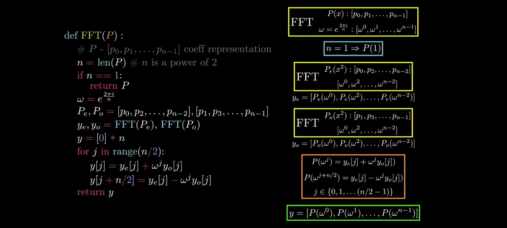

# 算法分析与设计

## 序言

时间复杂度：用算法的**基本操作（算法中最重要的操作）**的执行次数来度量算法的时间效率
$$
T(n) ≈ copC(n)
$$
**一个需要指数级操作次数的算法只能用来解决规模非常小的问题**


### 渐进符号

**f(n)<=Cg(n)**，记作t(n)=O(g(n))

f(n)≥Cg(n)，记作f(n)= **Ω**(g(n))

使用极限的方法来求


### NPC问题

#### P问题

如果一个问题可以找到一个多项式级复杂度的解法，那么该问题就是P问题。

#### NP问题

指那些可以在多项式时间内被验证的问题。换句话说，如果一个解被提供给你，你可以在多项式时间内验证它是否是正确的。

#### P与NP

- 所有的P问题都是NP问题。
- NP问题一定是P问题吗？
  - 这个问题无解


#### 归约

“问题A可约化为问题B”的一个隐含的含义： B的时间复杂度 >= A的时间复杂度 


#### NPC问题（NP完全）

NPC问题是一类特殊的NP问题。一个问题被称为NP完全，如果它既属于NP问题集合，又具有一个特殊的性质：任何一个NP问题都可以在多项式时间内约归到该问题。

NPC问题属于NP问题，但是NP问题不一定属于NPC问题

证明：

首先，证明它是一个NP问题；

然后，证明一个已知的NPC问题可以归约为它。（根据归约的传递性）


#### NP难问题

某个NPC问题可以归约为一个特定的问题，但这个问题并不是一个NP问题，则称这个问题为NP-Hard问题。

NP难问题（NP-Hard）和NP完全问题（NPC，NP-Complete）是两个相关但不完全相同的概念。


简答题：简述三个渐进复杂的公式的含义

简述NP，NP难，NP-完成等术语，如何证明题目是NP-难算法

如何证明一个问题是NP难问题：

1. 挑选一个已知具有NP难的问题
2. 证明如果从L1的任意实例I（在多项式时间内确定）获得L2的一个实例I'，由I'的解能确定L1实例的I的解
3. 有传递性可以得出L2是NP-难的

## 递归

思想和栈比较相同，我们需要找到循环终止的条件

步骤：

1. 明白函数想干嘛
2. 寻找函数终止条件
3. 找出函数的等价关系时


时间复杂度分析：

- 决定用哪个参数作为输入规模的度量
- 找出算法的基本操作
- 检查对相同规模的输入，基本操作的执行次数是否相同，如果不同，必须对最差、平均及最优效率单独研究
- 建立一个递推关系式及相应的初始条件
- 求解这个递归关系式，或者至少确定解的增长次数

**递归的简洁性可能会掩饰其算法的效率复杂性**


## 分治

**分治法的几个步骤：**

1、将原始问题划分为k个相同类型的子问题。（问题：为什么？）

2、子问题不可解还可继续划分。（问题：分到什么时候结束？）

3、求解每个子问题。

4、将每个最小子问题的解合并成原问题的解。


**分治法适用条件：**

1、原始可分解，且分解出来的子问题和原始问题就有相同的类型。

2、分解出来的子问题到很小时可以很容易（在很短的时间和空间内能求解）求解。

3、**子问题的解能合并。**（这是能否使用分治算法的关键）


**最优子结构指的是**问题的最优解包含了子问题的最优解


### 归并排序

归并排序的时间复杂度任何情况下都是 O(nlogn)

空间复杂度是是指在某个时刻最大的空间数量，为n个


### 分治矩阵乘法(nop)

c++步骤：

1. 声明类
2. 主要递归函数：如果矩阵的长度大于2，则继续分割
3. 辅助函数：矩阵分割，矩阵合并，矩阵相加，2阶矩阵相乘


### 棋盘覆盖问题(nop)

函数变量：tr tc左上角点，dr dc当前分治中特殊点，size长度

如果宽度等于2，就覆盖除了特殊点的其他点

如果宽度不等于2，就对区域四分
$$
T(n)=O(4^k)
$$


### *寻找第k小数

时间复杂度：O(n)

```pseudocode
function FindKthSmallest(arr, left, right, k):
    // 基本情况：当数组中只有少量元素时，直接返回第k小的数
    if right - left + 1 <= 5:
       	sort(arr[left:right+1])
       	return arr[left+k-1]

    // 将数组划分为大小为5的子数组
    numGroups = (right - left + 1) / 5
    medians = int[numGroups]

    for i from 0 to numGroups - 1:
        groupLeft = left + i * 5
        groupRight = groupLeft + 4

        if groupRight > right:
            groupRight = right

        medians[i] = FindKthSmallest(arr, groupLeft, groupRight, 3)

    // 找到中位数的中位数（中位数数组的中位数）
    medianOfMedians = FindKthSmallest(medians, 0, numGroups - 1, numGroups / 2 + 1)

    // 使用中位数的中位数作为pivot，划分数组
    pivotIndex = Partition(arr, left, right, medianOfMedians)

    // 计算pivot的位置与k的关系
    pivotRank = pivotIndex - left + 1

    if k == pivotRank:
        return arr[pivotIndex]
    else if k < pivotRank:
        return FindKthSmallest(arr, left, pivotIndex - 1, k)
    else:
        return FindKthSmallest(arr, pivotIndex + 1, right, k - pivotRank)

function Partition(arr, left, right, pivot):
    //找到pivot在数组中的位置，并将其移动到最右边
    pivotIndex = left

    for i from left to right - 1:
        if arr[i] == pivot:
            swap(arr[i],arr[right])
            break

    pivot = arr[right]
    i = left

    for j from right - 1 to i:
        if arr[j] <= pivot:
            i = i + 1
            swap(arr[i],arr[j])

   	swap(arr[i + 1],arr[right])
   	return i + 1

```


### 求二维图中最近的两个点

按x升序排列

1. 对半分进行递归调用
2. 当分到只剩两个时，直接返回距离
3. 合并问题，从左边，右边和中间判断最小


### 快速傅里叶变化（FFT）

$$
P(x):[p_0,p_1,...,p_{n-1}] \\
w=e^{\frac{2\pi i}{n}}:[w^0,w^1,...,w^{n-1}]
$$

将w带入p(x)求解

可以对整个FFT公式左右分治

左侧：
$$ {FFT}
P_e(x):[p_0,p_2,...,p_{n-2}] \\
w=e^{\frac{2\pi i}{n}}:[w^0,w^1,...,w^{n-1}]
$$

右侧：
$$
P_o(x):[p_1,p_3,...,p_{n-1}] \\
w=e^{\frac{2\pi i}{n}}:[w^0,w^1,...,w^{n-1}]
$$




## 减治法

分治法是把一个大问题划分为若干个子问题，分别求解各个子问题，然后再把子问题的解进行合并得到原问题的解。

减治法同样是把一个大问题划分为若干个子问题，但是这些子问题不需要分别求解，只需求解其中的一个子问题，因而也无需对子问题的解进行合并。

所以，严格的说，减治法应该是一种退化了的分治法，时间复杂性一般是$$O(log_2 n)$$。

（1）原问题的解只存在于其中一个较小规模的子问题中；

（2）原问题的解与其中一个较小规模的解之间存在某种对应关系


## 动态规划

动态规划的基本思想是将一个大问题分解为若干个重叠子问题，并通过求解子问题的最优解来得到原问题的最优解。

动态规划的核心思想是"最优子结构"和"重叠子问题"。

1. 最优子结构：指原问题的最优解包含了子问题的最优解。换句话说，通过求解子问题的最优解可以推导出原问题的最优解。
2. 重叠子问题：指在求解原问题时，会重复地遇到相同的子问题。为了避免重复计算，动态规划使用一种记忆化的技术，将已经求解过的子问题的结果保存起来，以便需要时直接查找而不需要重新计算。

动态规划通常使用一个表格或数组来存储子问题的解，这被称为"动态规划表"或"记忆化数组"。通过填充表格中的元素，可以逐步求解更大规模的子问题，直到最终解决原问题。


优点：

1. 最优化问题求解：动态规划适用于求解最优化问题，可以找到问题的最优解。通过将问题拆分为子问题并利用最优子结构，可以有效地求解复杂的最优化问题。
2. 减少重复计算：动态规划使用记忆化技术，通过保存已经求解过的子问题的结果，避免重复计算。这样可以大幅度减少计算量，提高算法的效率。
3. 时间复杂度优化：相对于朴素的递归方法，动态规划通常可以将指数级的时间复杂度优化为多项式级别的复杂度，大大提高了算法的效率。

缺点：

1. 占用空间大
2. 不适用于所有算法


### 求二项式系数

利用二维数组存储n从1开始的对角线数组，$$dp[i][k]=dp[i-1][k]+dp[j-1][k-1]$$


### 拓扑图中最长距离

依次遍历入度为0的点，判断当前节点大小：
$$
dis[i]=max\{dis[i],dis[j]+dis(i,j)\}
$$

```pseudocode
function DAG(G(V,E)){
	topologically sort the node in G
    
    path[0]=0
    path[sort[1]]=0
    for i = 1 to sort.size:
    {
        max_path=0
        for j = 1 to i:
        {
            if edge[sort(j)][sort(i)]:
                if path[sort[j]]+edge[sort[j]][sort[i]]>max_path: 
                    max_path=path[sort[j]]+edge[sort[j]][sort[i]];
        }
        path[sort[i]]=max_path;
    }

    max = max(path)
    return max
}
```


### 加空格编辑距离

编辑距离：将一个字符串变成另一个字符串的最小改变数量

对应有两种情况：
$$
x[i]==y[j]时，&E[i][j]=E[i-1][j-1]\\
x[i]!=y[j]时，&E[i][j]=min(E[i-1][j],E[i][j-1],E[i-1][j-1])+1
$$


### 背包问题

#### 01背包

定义变量`bp[i][j]: 将前i件物品装进限重为j的背包可以获得的最大价值`

```pseudocode
function 01package(w[1...n],v[1...n]){
	for i=1 to n do
		for j=1 to n do
			dp[i][j] = max(dp[i-1][j],dp[i-1][j-w[i]]+v[i];
	return dp[n][n];
}
```


#### 完全背包

与01背包问题只有一个不同地方：

状态量的定义应该改为：`dp[i][j] = max(dp[i-1][j],dp[i][j-w[i]]+v[i];`

这样就是说可以在选择每个物体的时候，还可以选择要装入几个物体


#### 多重背包

状态方程：

```c
# k为装入第i种物品的件数, k <= min(n[i], j/w[i])
dp[i][j] = max{(dp[i-1][j − k*w[i]] + k*v[i]) for every k}
```


### 链式矩阵相乘

求解矩阵链相乘问题时动态规划算法的另一个例子。给定一个n个矩阵的序列（矩阵链）<A1,A2,...,An>，我们希望计算它们的乘积  A1A2...An

例如如果有矩阵链为<A1,A2,A3,A4>,则共有5种完全括号化的矩阵乘积链。

(A1(A2(A3A4)))、(A1((A2A3)A4))、((A1A2)(A3A4))、((A1(A2A3))A4)、((A1(A2A3))A4) 对矩阵链加括号的方式会对乘积运算的代价产生巨大影响。

 因此，A(i)A(i+1)...A(j)的最小代价括号化方案的递归求解公式变为：
    ①如果i=j，m[i,j]=0
    ②如果i<j，m[i,j]=min{m[i,k]+m[k+1,j]+p(i-1)p(k)p(j)}  i<=k<j

```pseudocode
function MATRIX_CHAIN_ORDER(P(0...n),i,j):
	if i==j then:
		m[i][j] := 0;
	if i<j then:
		for x := i to j
			left := MATRIX_CHAIN_ORDER(P(0...n),i,x)
			right := MATRIX_CHAIN_ORDER(P(0...n),x+1,j)
			m[i][j] = min(left+right+P(i-1)P(k)P(j),m[i][j]);
	return m[i][j];
```


### 全源最短路径问题

```pseudocode
For i=1 to n do:
	for j=1 to n do
		dij(0)= ∞;
For all (i,j) ∈E do 
		dij(0)=w(i, j);
For k=1 to n do: 
		for i=1 to n do:
      		for j=1 to n do
      			dij(k) = min{dij(k-1) , dik(k-1) + dkj(k-1)}
return D(n);
```


## DFS BFS

### DFS

#### 递归

```pseudocode
function dfs(n){
	if n==node: 
		return n;
	for nb in n.邻居:
		if !nb.ischecked:
			nb.ischecked = True
			return dfs(nb);
}
```


#### 非递归

```pseudocode
function dfs(n){
	var s:stack
	s.push(n)
	while not s.empty:
		node = s.pop()
		for nb in n.邻居:
			if !nb.ischecked:
				if nb = node:
					return nb;
				nb.ischecked = True
				dfs(nb);
}
```


### 求连通分量

使用BFS或者DFS对每个未判断的点判断一次，一次BFS或者DFS可以遍历完一个连通分量


## 贪心

贪心算法是一种优化算法，它的基本思想是在每一步选择中都采取当前状态下最优的选择，以期望最终达到全局最优解。

贪心算法的关键在于贪心选择策略，即每一步选择时都选择当前看起来最优的解决方案。这里的最优是指局部最优，也就是在当前步骤下能够获得最大（或最小）收益的选择。通过连续地进行这样的局部最优选择，最终希望能够达到全局最优解。

需要注意的是，贪心算法并不是适用于所有问题的解决方法。它只适用于一些具有贪心选择性质的问题，即通过局部最优选择就能够得到全局最优解的问题。对于一些问题，贪心算法可能会得到次优解或者根本无法得到正确解答。


### Prim算法

思想：使用贪心算法解决最小生成树问题，它的基本思想是通过逐步添加未访问顶点相连的最小权重边来构建一个连通图，使得图的总权重最小，并最终形成一个包含所有顶点的树。

时间复杂度：O(vloge)


### Kruska算法

思想：Kruskal算法的贪心选择性质在于每次选择权重最小的边，并且通过判断是否会形成环路来保证了每一步都选择了当前最优的解决方案。通过不断添加边并合并连通分量，最 终形成了一个最小生成树。

时间复杂度：O(E log E)


### dijkstra算法

任务：求单源最短路径，每次选择到原点最短的点，加入到已选择的边集合中，使用选择的点来刷新与他连接的点

不能处理有负权边的图，因为这个方法不会重新更新已选择的点


### Bellman-Ford算法

可以判断是否存在负值

```pseudocode
function BellmanFord(Graph, source):
    // 初始化距离数组和前驱数组
    distance[source] = 0
    predecessor[source] = null

    // 对所有顶点进行V-1次迭代
    for i from 1 to |V| - 1:
        // 对每条边进行松弛操作
        for each edge (u, v, w) in Graph:
            if distance[u] + w < distance[v]:
                distance[v] = distance[u] + w
                predecessor[v] = u

    // 检测是否存在负权环
    for each edge (u, v, w) in Graph:
        if distance[u] + w < distance[v]:
            return "存在负权环"

    return distance[], predecessor[]
```


### SPFA

选择性松弛，是Bellman-Ford的优化算法，我们会发现每一次松弛操作都对所有边做了一次操作，但是我们每次更新都未必会真的更新最短距离，SPFA就是对这个优化，如果距离缩小了，就将其放入队列中去，每次从队列中取第一个数，更新与他相连的点


### Floyd算法

求一个图中 **所有点到所有点** 最短路径的算法，时间复杂度 O(n3)


### 贪心正确性的证明

第一步：符合贪心选择的特性（Greedy Choice Property）

我们需要证明我们的第一个选择（贪心选择 Greedy Choice，First Choice）包含在某些最优解中

第二步：符合归纳法结构（Inductive Structure）

我们需要证明第一个选择（贪心选择）cˆ之后，子问题P′和原问题P还是同一类问题，意味着我们的选择不改变问题的结构，并且子问题P′的解可以和第一个选择（贪心选择）cˆ合并

第三步：最优子结构（Optimal Substructure）

如果我们可以最优的解决子问题P′，我们可以将子问题P′的解和贪心选择cˆ得到原问题P的解


## 排序

判断k次比较能否对n个数，进行排序：

比较$$2^k与n的大小关系$$


### **堆排序

① 将待排序的序列构造成一个最大堆，此时序列的最大值为根节点

② 依次将根节点与待排序序列的最后一个元素交换

③ 再维护从根节点到该元素的前一个节点为最大堆，如此往复，最终得到一个递增序列

构建堆时间复杂度：$$O(n)$$

堆调整的时间复杂度为$$O(log n)$$

```pseudocode
// 堆排序函数
function heapSort(arr):
    n = arr.length

    // 构建最大堆
    for i from n/2 - 1 down to 0:
        heapify(arr, n, i)

    // 依次取出堆顶元素，进行排序
    for i from n-1 down to 1:
        swap(arr[0], arr[i]) // 将当前最大元素（堆顶）与最后一个元素交换
        heapify(arr, i, 0) // 对剩余的元素重新构建最大堆

// 堆调整函数（递归实现）
function heapify(arr, n, i):
    largest = i // 初始化最大元素为当前节点
    left = 2 * i + 1
    right = 2 * i + 2

    // 比较左子节点和根节点
    if left < n and arr[left] > arr[largest]:
        largest = left

    // 比较右子节点和当前最大节点
    if right < n and arr[right] > arr[largest]:
        largest = right

    // 如果最大节点不是当前节点，则交换节点并递归调整堆
    if largest != i:
        swap(arr[i], arr[largest])
        heapify(arr, n, largest)

// 交换函数
function swap(a, b):
    temp = a
    a = b
    b = temp
```


## 回溯法(BackTracking)

​		回溯法是从初始状态出发，按照深度优先搜索的方式，根据产生子结点的条件约束，搜索问题的解。当发现当前结点不满足求解条件时，就回溯，尝试其他的路径。回溯法是一种“能进则进，进不了则换，换不了则退”的搜索方法。


### 八皇后

```pseudocode
function backtrack(k){
	if k==max:
		print(ans);
	else:
		for i:=1 to max:
			for j:=1 to k:
				if ans[j] == i || abs(k-j)==abs(ans[j]-i):
					flag:=False
					break;
			if flag != False:
				ans[k]:=i
				backtrack(k+1);
}
```


## 分支限界法

求解目标是找出符合约束函数的一个解，或者是找出最优解。通常采用广度优先算法

### 01背包问题

优先队列法：

根据上界函数：$$ub=v+(W-w)(v_i+1/w_i+1)$$

步骤：

1. 基于可行结点相应的`子树最大价值上界优先级`，从堆中选择一个节点（根节点）作为当前可扩展结点。
2. 检查当前扩展结点的左儿子结点的可行性。
3. 如果左儿子结点是可行结点，则将它加入到子集树和活结点优先队列中。
4. 当前扩展结点的右儿子结点一定是可行结点，`仅当右儿子结点满足上界函数约束时,才将它加入子集树和活结点优先队列。`
5. 当扩展到叶节点时，算法结束，叶子节点如果其价值是最大的，对应的解即为问题的最优值。


