# Mamba: 你所需要知道的一切

🐍 Mamba是一种状态空间模型(SSM)架构，它改进了S4架构。它有时也被称为S6或者selective SSM，它对S4进行了两项重要修改:

- **选择性扫描算法(selective scan algorithm）**，允许模型过滤相关或者不相关的信息

- **硬件感知的算法(hardware-aware algorithm)**，允许通过并行扫描(parallel scan)、核融合(kernel fusion)和重计算(recomputation)有效地存储结果。

这篇博客会讲述SSM的系列模型，直到Mamba的重点。

## Mamba 的提出

### Transformer回顾

优点：

1.  无论它收到什么输入，它都可以通过自注意力矩阵来回忆任何较早的 token。
2. 自注意力可以通过快速训练获得整个序列的未压缩视图，支持并行化，从而极大地加快训练速度。

缺点：

1. 无法处理超出有限窗口外的信息，无法处理超长序列，比如音频、生物识别信号、视频等
2. 开销与输入长度成二次方比，为长度为 L 的序列生成标记大约需要 L² 计算，如果序列长度增加，计算成本可能会很高。

### RNN回顾

优点：

1. 在生成输出时，RNN 只需要考虑之前的隐藏状态和当前的输入。它可以防止重新计算所有先前的隐藏状态，换句话说，RNN 可以快速进行推理，甚至拥有无限上下文。

缺点：

1. 每个隐藏状态都是所有先前隐藏状态的聚合，并且通常是压缩视图，会遗忘之前的信息。
1. 训练不能并行进行，因为它需要依次执行每个步骤。

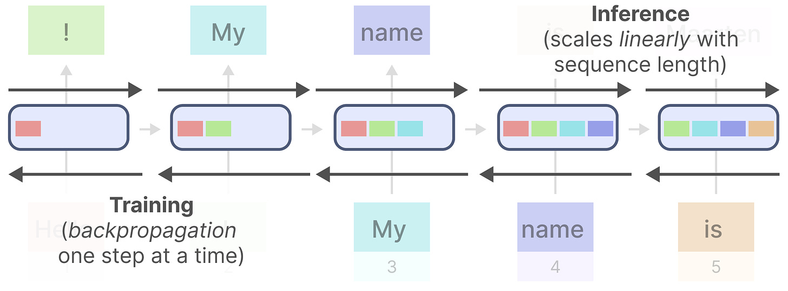

在处理超长序列时，要求模型能够解决几个问题：

1. 长距离信息
2. 对于数据的分辨率不敏感
   - 从200MHz的音频或者是100MHz的音频中都能识别出你的声音
3. 在训练和推理的时候都特别有效

## Mamba 背景 ①——SSM

### The State Space Model (SSM)

状态空间模型（SSM）由**这两个简单的方程定义**。它将一个**一维输入信号**映射到一个$N$维潜在状态 $x(t)$ ，然后投影到一个一维输出信号 $y(t)$ ，它是一种通过**定义系统的可能状态来表示问题的方法**。
$$
\begin{aligned}x^{\prime}(t)&=\boldsymbol{A}x(t)+\boldsymbol{B}u(t)\\y(t)&=\boldsymbol{C}x(t)+\boldsymbol{D}u(t)\end{aligned}
$$

状态空间模型（SSN）是控制理论、统计学和计算神经科学等许多科学和工程学科中使用的基本表示形式，并且还与隐马尔可夫模型和卡尔曼滤波器等潜在状态模型相关。按照惯例，在这些领域中，系统参数 **A**、**B**、**C**、**D** 被**假定为固定的**，目标是控制系统或使用噪声模型对参数或状态等量进行统计推断。

一般SSMs包括以下组成：

- 映射输入序列x(t)，比如在迷宫中向左和向下移动
- 到潜在状态表示h(t)，比如距离出口距离和 x/y 坐标
- 并导出预测输出序列y(t)，比如再次向左移动以更快到达出口

### SSM的三种表达形式

SSM 很重要的一个特性是他拥有三种表达形式，这使得SSM能够分别利用他们的优点，接下来会分别讨论三种形式是怎么实现的。

### 连续时间表示

在控制理论中，SSM是一个闭环系统，常用控制图来绘制：

此时SSM它不使用离散序列，而是将连续序列作为输入并预测输出序列。

将上面的控制图展开：

请注意，这种表示主要是理论上的；我们不会以连续函数的形式接收数据，因此我们不能直接应用这种表示形式，但这是计算其他形式的基本形式，也能帮助我们理解SSM。

### 循环离散时间表示

真实数据输入（比如文本数据）往往是离散的，因此希望能够将输入的一维离散序列 $u_k$：
$$
\begin{aligned}x_k&={\overline{A}}x_{k-1}+{\overline{B}}u_k\\y_k&={\overline{C}}x_k+{\overline{D}}u_k\end{aligned}
$$
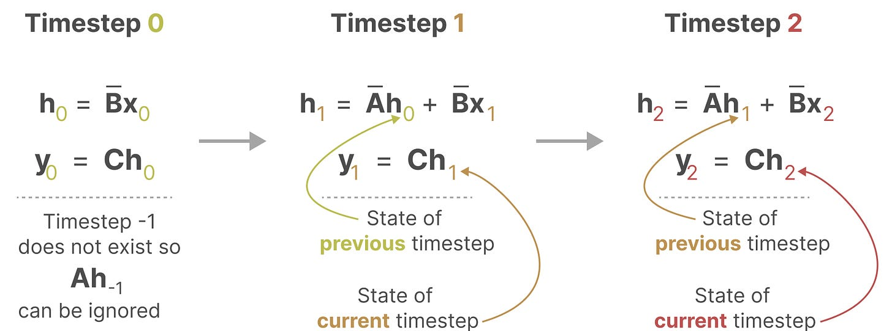

$\overline{A},\overline{B},\overline{C},\overline{D}$ 是原有参数 $A,B,C,D$ 的离散化，实际上有很多有效的公式，但在 S4 中使用的公式称为双线性变换，其由下式给出（其中 $\Delta$ 是由输入数据的步长或者粒度决定，是一个新的可学习参数）：
$$
\begin{aligned}
&\overline{A} =(I-\frac\Delta2\cdot\boldsymbol{A})^{-1}(\boldsymbol{I}+\frac\Delta2\cdot\boldsymbol{A})  \\
&\overline{B} =(\boldsymbol{I}-\frac\Delta2\cdot\boldsymbol{A})^{-1}\Delta\boldsymbol{B}  \\
& \overline{\boldsymbol{C}}=\boldsymbol{C}  \\
&\overline{\boldsymbol{D}}=D \\
\end{aligned}
$$

这种技术给我们带来了 RNN 的优点和缺点，即快速推理和缓慢训练。

### 卷积离散时间表示

首先将计算上面循环表示的公式，并将其展开：
$$
x_0=\overline{B}u_0\quad x_1=\overline{AB}u_0+\overline{B}u_1\quad x_2=\overline{A}^2\overline{B}u_0+\overline{AB}u_1+\overline{B}u_2\quad\ldots 
$$
输出是状态的线性投影：
$$
\begin{aligned}
&{y}_0 =\overline{CB}u_0+\overline{D}u_0  \\
&y_{1} =\overline{\boldsymbol{CAB}}u_0+\overline{\boldsymbol{CB}}u_1+\overline{\boldsymbol{D}}u_1  \\
&{y_2} =\overline{CA}^2\overline{B}u_0+\overline{CAB}u_1+\overline{CB}u_2+\overline{D}u_2\quad\ldots  
\end{aligned}
$$
可以通过展开的方式，将RNN转换为CNN，我们假设初始状态为 $x_{-1}=0$，然后展开：
$$
\begin{aligned}x_0&=\overline{B}u_0&x_1&=\overline{AB}u_0+\overline{B}u_1\quad&x_2&=\overline{A}^2\overline{B}u_0+\overline{AB}u_1+\overline{B}u_2\quad&\ldots
\\y_0&=\overline{CB}u_0\quad&y_1&=\overline{CAB}u_0+\overline{CB}u_1\quad&y_2&=\overline{CA}^2\overline{B}u_0+\overline{CAB}u_1+\overline{CB}u_2\quad&\ldots\end{aligned}
$$
我们最终得到了每一步 *k* 的输出 $y_k$ 的简单形式：
$$
\begin{gathered}\begin{aligned}y_k&=\overline{CA}^k\overline{B}u_0+\overline{CA}^{k-1}\overline{B}u_1+\cdots+\overline{CAB}u_{k-1}+\overline{CB}u_k \quad y=\overline{K}*u\end{aligned}\\\overline{K}\in\mathbb{R}^L=(\overline{CB},\overline{CAB},\ldots,\overline{CA}^{L-1}\overline{B})\end{gathered}
$$
这意味着SSM的输出只是**输入 $u$ 和卷积滤波器的卷积**，这个卷积核是一个非常**巨大**的卷积核，因为它是整个序列的长度。

将 SSM 表示为卷积的一个主要好处是它可以像卷积神经网络 (CNN) 一样进行并行训练。然而，由于内核大小固定，它们的推理不如 RNN 那样快速和无限制。

### 关于连续时间和离散化的讨论

上面几行公式就已经描述了SSM的卷积表示以及他们的卷积核 $\overline{K}$。但我们依然需要以下几个问题的答案：

1. $\overline{A},\overline{B},\overline{C},\overline{D}$ 与 $A,B,C,D$ 的转换公式是什么
2. 为什么连续时间表示和离散时间表示是等效的

接下来给出几种解释

#### 解释1：插值并应用连续模型

在概念上最简单的方式可能是首先将离散时间（序列到序列）模型转换为连续时间模型，然后应用原始的（函数到函数）模型。下面是这一过程的示意图。

这种简单的“插值”在信号处理中被称为*信号保持*，因为在下一个信号来临前，一直保持当前值；使用公式离散化SSM：
$$
\begin{aligned}\color{red}{\overline{A}}&=e^{\Delta A}\\\color{red}{\overline{B}}&=A^{-1}(e^{\Delta A}-I)B\\\color{red}{\overline{C}}&=C\\\color{red}{\overline{D}}&=D\end{aligned}
$$

> 注意：我们在训练过程仍然保存矩阵 A 的连续形式，而不是离散化版本。在训练过程中，连续表示被离散化。

最后，其他一些离散化方法可以看作是这个公式的近似；例如，欧拉方法使用近似
$e^x\approx1+x$ ，而我们使用的双线性变换是一阶 Pade 近似$e^x\approx\frac{1+x/2}{1-x/2}$

以下解释内容请参考关于SSM的博客[^b.4]

解释2：数值积分的循环逼近

解读3：改变卷积核的宽度

## Mamba 背景 ②——LSSL

在前文的基础上，我们得到了SSMs的三种表示形式

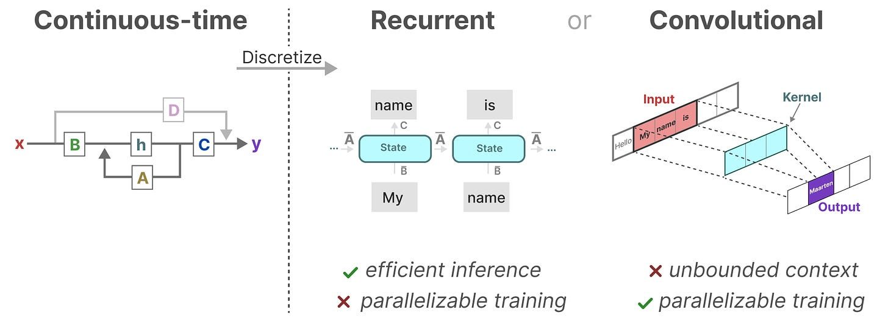

有了这些表示，我们可以使用一个巧妙的技巧，即根据任务选择表示**。在训练期间，我们使用可以并行化的卷积表示**，**在推理期间，我们使用高效的循环表示**：

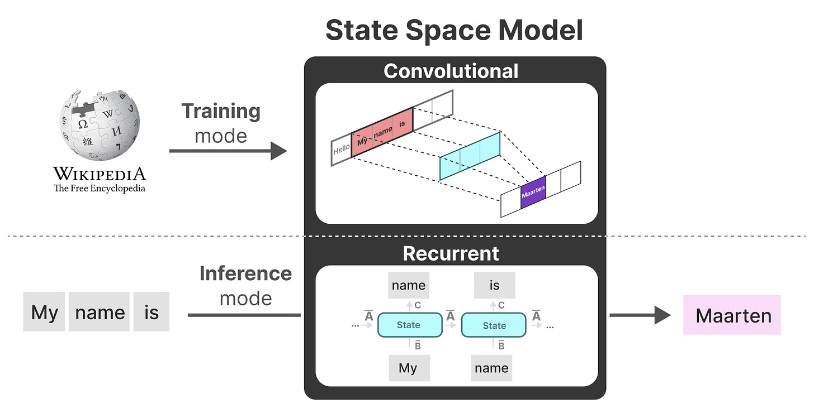

该模型被称为：**Linear State-Space Layer**[^a.2]

这些表示都有一个重要特点：线性时不变 (***Linear Time Invariance***, LTI)

这意味着：无论你输入是什么，A、B、C的参数都是不变的！！！！！

## Mamba 背景 ③——S4

S4：序列的结构化状态空间——Structured State Space for Sequences

在SSM公式中，最重要的就是矩阵 $A$，因为它决定了如何从先前的状态中获取信息。

A 矩阵可能只需要记住几个词，也可能是之前所有输入的总和。

那么我们怎样才能以保留大内存（上下文大小）的方式创建矩阵A呢？

之前的工作发现，基本的 SSM 在实践中实际上表现很差。直观上，一种解释是它们遭受梯度在序列长度上呈指数缩放的问题（即梯度消失/爆炸问题）。为了解决这个问题，之前的工作发展了 HiPPO 连续时间记忆理论。

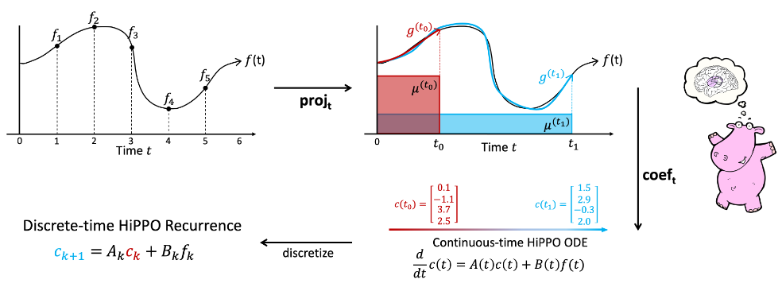

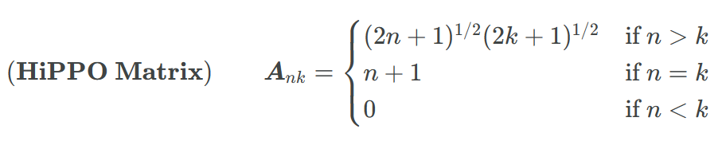

这个矩阵非常重要，但它有点神奇。出于我们的目的，我们主要需要知道：

- 我们只需要计算一次。
- 它有一个漂亮、简单的结构。
- 在不深入 ODE 数学的情况下，该矩阵能够将过去的历史压缩为具有足够信息来**近似重建历史的状态**。

深入一点，这个矩阵的直观解释是它产生一个隐藏的状态来记住它的历史。它通过跟踪**勒让德多项式**的系数来实现这一点。这些系数让它近似所有以前的历史。让我们看一个例子，

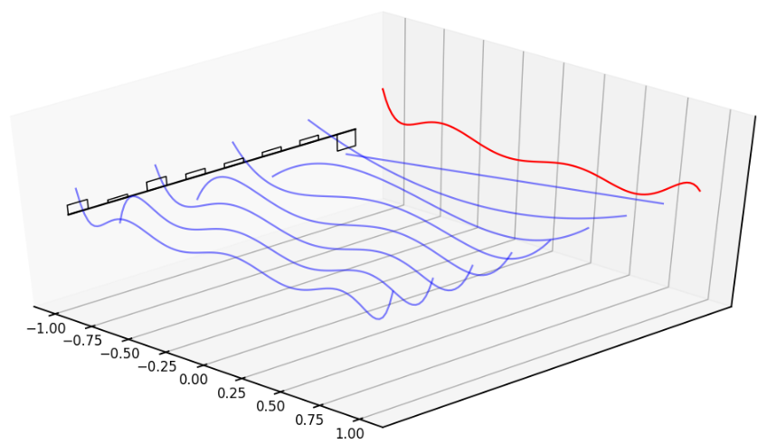

S4 是一种最新的状态空间架构，可以被视为RNN和CNN结合，对于序列长度能够有线性或接近线性的规模，也能够很好处理长距离依赖，许多SSMs变体在音视频方向有较好效果，但是对于离散或信息密集型数据没有那么有效

### HiPPO

HiPPO中采用**正交多项式**投影历史数据，并转换成具有特殊初始化矩阵A和B的SSM形式

HiPPO 的提出是为了解决两个问题：

1. 如何找到先前输入的最优近似
2. 如何快速的更新多项式的参数

HiPPO相当于将函数映射到函数，这里给个通俗的例子解释一下，如下图所示，这里的u是原始输入信号，x是压缩后的信号

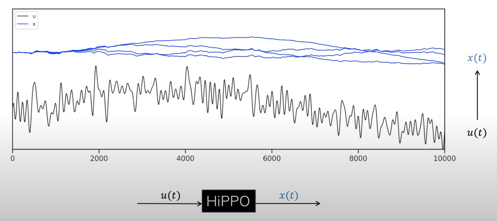

现给定一个持续增长的u，HiPPO允许online update压缩的x，如下图所示

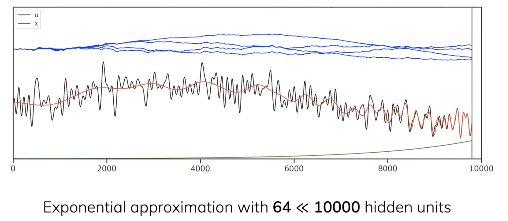

## SSM存在问题

1. 由于SSM的时不变性，在针对不同的输入时，矩阵的参数都是不变的。

   

2. SSM和S4无法选择性的关注指定的输入，也就是说矩阵A、B和C的静态性质导致了其无法进行内容感知（content-awareness）。

## Mamba 介绍 ①——选择性保留信息

回顾之前 S4 离散形式的两个方程（$\overline{D}$ 被视为跳跃连接，所以可以设为0）：

$$
\begin{aligned}x_k&={\overline{A}}x_{k-1}+{\overline{B}}u_k\\y_k&={\overline{C}}x_k+{\overline{D}}u_k\end{aligned}
$$

其中**离散参数 $\overline A,\overline B,\overline C,\overline D$ 都是固定的（时不变）**，这样就导致了S4，在语言建模和生成中至关重要的某些任务（即关注或忽略特定输入的能力）上表现不佳。

Mamba希望在以下两个部分取得一个折中的方案：

- 创建了一个非常高效的小状态（SSM, RNN）
- 压缩整个上下文（Transformer）

然而Mamba可以让这些参数根据输入而变化，选择性提供了一种类似于注意力机制的效果，通过使模型参数成为输入的函数，Mamba 可以“专注于”输入中对于当前任务更重要的部分：
$$
\begin{aligned}&h_t={\bar{\mathbf{A}}}h_{t-1}+S_{\bar{\mathbf{B}}}(x_t)x_t\\&y_t=S_\bar{\mathbf{C}}(x_t)h_t\end{aligned}
$$
> 注意：矩阵 A 保持不变，因为我们希望历史状态本身保持静态，但它受到影响的方式（通过 B 和 C）是动态的。

### Mamba中三个矩阵的变化

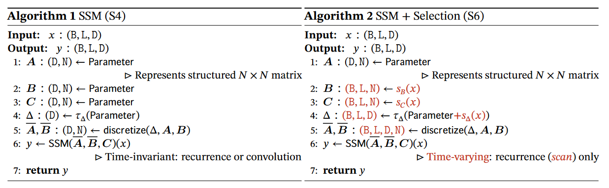

$B$ 矩阵和 $C$ 矩阵的大小从原来的(D,N)「D指的是输入向量的维度，比如一个颜色的变量一般有R G B三个维度，*N* 指SSM的隐藏层维度(hidden dimension)，当然 **一般设的远小于*L*** 」变成了(B,L,N)「*这三个参数分别对应batch size、sequence length、hidden state size*」

对于输入x的每一个维度D都有一个SSM，用于计算。

#### Mamba种B,C,$\Delta$是如何动态获取的

输入x和参数矩阵 $B$ 之间仅有一个维度不同，所以Mamba的解决方式是通过线性连接层获取参数矩阵。
$$
\begin{aligned}
&s_B(x)=\text{Linear}_N(x) \\
&s_C(x)=\text{Linear}_N(x) \\
&s_\Delta(x)=\mathrm{Linear}_D(x) \\
&\tau_{\Delta}=\mathrm{softplus}
\end{aligned}
$$
这样使得参数矩阵变得和输入相关，每个输入的token的矩阵都不同，可以解决内容感知问题。

#### 如何理解B,C,$\Delta$的作用

较小的步长 $\Delta$ 会导致忽略特定单词，而是更多地使用先前的上下文，而较大的步长 Δ 会更多地关注输入单词而不是上下文

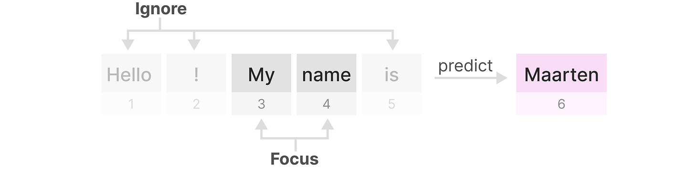

#### 如何理解S4的时不变性和S6的时变性

> 这里的时不变性特指：推理时**参数矩阵**不随输入变化而变化，但在训练过程中，矩阵是可以根据需要去做梯度下降而变化的，具体来说，对于SSM和S4模型：
>
> - 首先，对于训练过程：在训练时，模型会接收输入数据，并尝试预测输出。模型的参数(矩阵A、B、C的值)在每次迭代中通过梯度下降等优化算法进行调整，以便减少预测误差
>
>   - 这意味着矩阵的值会随着训练的进行而逐渐变化，以更好地适应数据
> - 其次，对于推理过程：一旦模型训练完成，进入推理阶段，此时矩阵A、B、C的值将固定为训练结束时学习到的值
>   - 即在推理时，模型使用这些固定的矩阵来处理新的输入数据并生成预测
> - 顺带提前说一嘴，即无论是SSM，还是mamba，训练时 **参数肯定会变** 这点毫无疑问
>
> 但推理时，SSM的参数矩阵不会随着输入的不同而改变，即对任何输入都是一视同仁
>
> 但mamba会对输入做选择性推理，虽然推理时模型本身的参数也不会变，但是模型会先计算出参数矩阵，针对每个token的参数矩阵都不相同。
>
> 总之，虽然Mamba模型在推理时**参数本身也不变**，但由于其设计中引入的选择性机制，使得模型能够根据输入数据的特点进行有区别的对待，这与SSM模型相比是一个显著的进步。且Mamba这种选择性是通过训练阶段的参数学习来实现的(根据训练阶段学习到的参数对不同的输入给予不同的处理)，而不是在推理阶段动态调整参数

### 选择性带来的问题

虽然选择性能让我们关注重要的部分，但选择性给我们带来一个很严重的问题：由于矩阵是动态的，我们无法提前计算卷积核 $\overline{K}$，也就导致我们只能够使用RNN的方式进行训练，这非常缓慢！！！这也导致了 Mamba 的作者提出了他们的第二个伟大想法。

## Mamba 介绍 ②——扫描算法

Mamba 的第二个主要思想是在 RNN 模式下进行非常非常快速的训练。Gu 和 Dao 意识到它们的递归与**扫描算法**（也称为前缀和）非常相似。要计算前缀和，我们需要获取一个输入数组 [𝑥1,𝑥2,𝑥3,⋯,𝑥𝑛] 并返回一个输出数组，其中每个元素都是该项目及其之前项目的总和。换句话说，输出的第一个元素将为 𝑥1 ，第二个元素将为 𝑥1+𝑥2 ，第三个 𝑥1+𝑥2+𝑥3 ，依此类推。一个例子如下所示。

现在我们画出RNN模式下更新Mamba隐藏状态的流程，每个状态都是前一个状态（乘以 A）加上当前输入（乘以 B）的总和：

并行化似乎是不可能的，因为只有在我们拥有前一个状态的情况下才能计算每个状态。然而，Mamba 通过并行扫描算法使这成为可能。它假设我们执行操作的顺序与关联属性无关。因此，我们可以分段计算序列并迭代地组合它们：

## Mamba 介绍 ③——硬件感知算法

最新 GPU 的一个缺点是其小型但高效的 SRAM 与大型但效率稍低的 DRAM 之间的传输 (IO) 速度有限。在 SRAM 和 DRAM 之间频繁复制信息成为瓶颈。

Mamba 与 Flash Attention 一样，试图限制数据在 DRAM 和 SRAM 之间传输的速度。它通过核融合技术（*kernel fusion*）来实现，这允许模型不写入中间结果并连续执行计算直到完成。

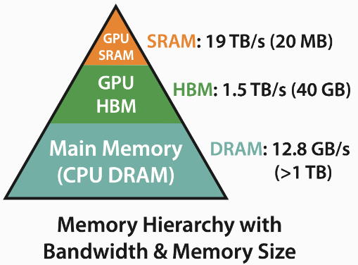

在这里，以下内容被融合到一个核操作中：

- 使用步长 Δ 离散化
- 选择性扫描算法
- 与 C 相乘

硬件感知算法的最后一部分是重新计算，因为中间状态不会被保存，但在反向传播中是必需的。相反，作者在向后传递期间重新计算这些中间状态。

尽管这看起来效率低下，但它比从相对较慢的 DRAM 中读取所有这些中间状态的成本要低得多。

## Mamab Block

Mamba块：

看一看每一个Mamba块中的结构：

再来看一看端到端的模型图：

## 实验结果

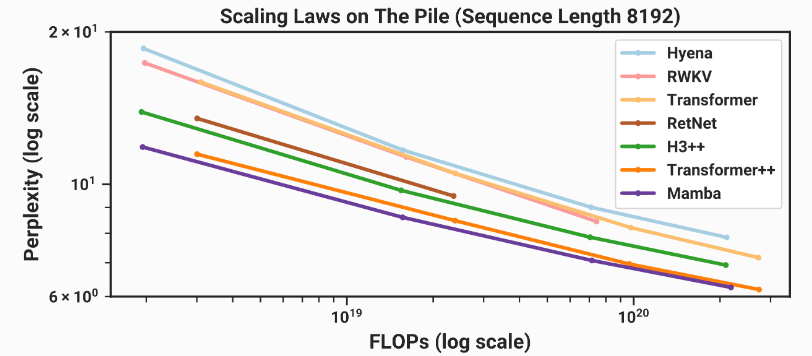

在此图中，模型大小向右增加，语言建模性能随着进一步向下而提高（y轴是困惑度，越低表示人类越能理解模型的输出）。这意味着最好的模型应该位于左侧：小（因此速度快），并且非常擅长建模语言。由于 Gu 和 Dao 是学者，他们没有数千个 GPU 来训练 GPT-4 大小的模型，因此他们通过训练一堆较小的模型（大约 125M 到 1.3B 参数）进行比较。如上图所示，结果看起来非常有希望。与其他类似尺寸的模型相比，Mamba 似乎是最擅长建模语言的。

## 参考文献

A参考论文

[^a.1]: Mamba: [Mamba: Linear-Time Sequence Modeling with Selective State Spaces](https://arxiv.org/abs/2312.00752)
[^a.2]:Linear State-Space Layer (LSSL): [Combining Recurrent, Convolutional, and Continuous-time Models with Linear State Space Layers](https://proceedings.neurips.cc/paper_files/paper/2021/hash/05546b0e38ab9175cd905eebcc6ebb76-Abstract.html)
[^a.3]:[HiPPO: Recurrent Memory with Optimal Polynomial Projections](https://arxiv.org/abs/2008.07669)
[^a.4]:Legendre polynomial 《Legendre Memory Units: Continuous-Time Representation in Recurrent Neural Networks》
[^a.5]: Structured State Space for Sequences(S4): [Efficiently Modeling Long Sequences with Structured State Spaces](https://arxiv.org/abs/2111.00396)
[^a.6]:Simplified State Space Layers for Sequence Modeling(S5) 《Simplified State Space Layers for Sequence Modeling》

---

B参考博客

[^b.1]:Mamba高层次概览：[Mamba: the easy way](https://jackcook.com/2024/02/23/mamba.html)
[^b.2]:作者的Mamba原理介绍：[Mamba: the hard way](https://srush.github.io/annotated-mamba/hard.html)
[^b.3]:Mamba的可视化图解：[A Visual Guide to Mamba and State Space Models](https://newsletter.maartengrootendorst.com/p/a-visual-guide-to-mamba-and-state)
[^b.4]:SSM的讲解Structured State Spaces: Combining Continuous-Time, Recurrent, and Convolutional Models
[^b.5]:HiPPO的讲解：https://hazyresearch.stanford.edu/blog/2020-12-05-hippo
[^b.6]:S4的讲解: [The Annotated S4](https://srush.github.io/annotated-s4)
[^b.7]:另外一个Mamba的讲解,更多的偏向于数学的角度 Mamba No. 5 (A Little Bit Of…)
[^b.8]:非常全面的一个ssm到mamba的博客：https://blog.csdn.net/v_JULY_v/article/details/134923301

---

C参考视频

[^c.1]: NeurIPS-Spotlight-HiPPO
[^c.2]: YouTube-Mamba Paper Explained
[^c.3]: Bilibili-Mamba 论文速读
[^c.4]: YouTube-S4 Explained

---

D参考代码

[^d.1]:Mamba的官方代码https://github.com/state-spaces/mamba

