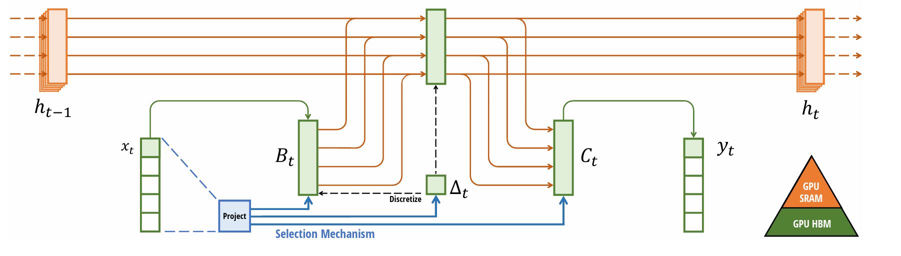

# Mamba

Mamba：具有选择状态空间的线性时间序列建模

## Introduce

Transformer 缺点：

1. 无法处理超出有限窗口外的信息
2. 开销与窗口长度成二次方比

structured state space sequence models (SSMs) 可以被视为RNN和CNN结合，对于序列长度能够有线性或接近线性的规模，也能够很好处理长距离依赖，许多SSMs变体在音视频方向有较好效果，但是对于离散或信息密集型数据没有那么有效

提出的新 selective state space models：

1. 选择机制：通过基于输入参数化SSM参数，设计了一个简单的选择机制。这使得模型能够过滤掉无关信息，并无限期地记住相关信息
2. 硬件感知算法：使用scan代替卷积
3. 结构：使用Mamba

