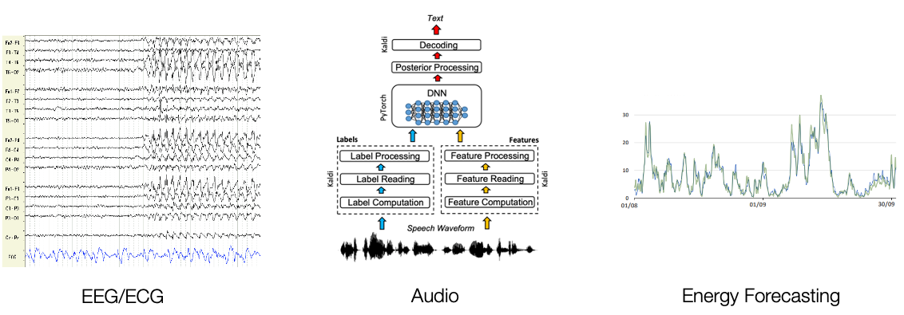
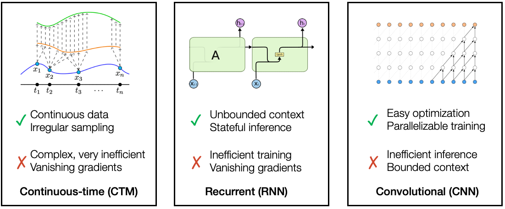

# Structured State Spaces for Sequence Modeling (S4)

## Introduce

Transformer能够在中等长度的序列中取得较好效果，但是**无法处理超长序列**，在NLP之外有很多从原始数据中采集到的超长序列，它们的特点往往是特别长且平滑，比如音频、生物识别信号、图像等。

所有就要求模型能够解决超长序列中的几个问题：

1. 长距离信息
2. 对于数据的分辨率不敏感
   - 从200MHz的音频或者是100MHz的音频中都能识别出你的声音
3. 在训练和推理的时候都特别有效

S4 使用以下一些内容进行长序列建模：

1. HiPPO
2. Linear State Space Layer
3. Structured State Spaces

## Related Models

## Structured State Spaces

### The State Space Model (SSM)

The continuous state space model (SSM) 可以简单的被定义为两个函数：
$$
\begin{aligned}x^{\prime}(t)&=\boldsymbol{A}x(t)+\boldsymbol{B}u(t)\\y(t)&=\boldsymbol{C}x(t)+\boldsymbol{D}u(t)\end{aligned}
$$
状态空间模型由这个简单的方程定义。它将一个一维输入信号映射到一个$N$维潜在状态 $x(t)$ ，然后投影到一个一维输出信号 $y(t)$ ，这是一种在许多领域都很通用的基础公式，我们可以简单的将深度学习中的参数映射到这几个参数，并使用梯度下降的方法来学习他们。

### SSMs的三种表达形式

SSMs很重要的一个特性是拥有三种表达形式，这使得SSMs能够分别利用他们的优点。

#### The Continuous-time 表示

在控制理论中，SSM是一个闭环系统，常用控制图来绘制：

请注意，这种表示主要是理论上的；我们不会以函数的形式接收数据，因此我们不能直接应用这种表示形式。然而，这是计算其他形式的基本形式，并且提供了对模型行为的最直观的了解。

#### 离散时间SSM——循环表示

真实数据往往是离散的，因此我们希望能够将输入的一维离散序列转化为参数：
$$
\begin{aligned}x_k&={\overline{A}}x_{k-1}+{\overline{B}}u_k\\y_k&={\overline{C}}x_k+{\overline{D}}u_k\end{aligned}
$$
$\overline{A},\overline{B},\overline{C},\overline{D}$ 是原有$A,B,C,D$参数的转换，实际上有很多有效的公式，但我们在 S4 中使用的公式称为双线性变换，其由下式给出：
$$
\begin{aligned}
&\overline{A} =(I-\frac\Delta2\cdot\boldsymbol{A})^{-1}(\boldsymbol{I}+\frac\Delta2\cdot\boldsymbol{A})  \\
&\overline{B} =(\boldsymbol{I}-\frac\Delta2\cdot\boldsymbol{A})^{-1}\Delta\boldsymbol{B}  \\
& \overline{\boldsymbol{C}}=\boldsymbol{C}  \\
&\overline{\boldsymbol{D}}=D \\
\end{aligned}
$$

#### SSMs卷积表示

可以通过展开的方式，将RNN转换为CNN，我们假设初始状态为$x_{-1}=0$，然后展开：
$$
\begin{aligned}x_0&=\overline{B}u_0&x_1=\overline{AB}u_0+\overline{B}u_1\quad&x_2=\overline{A}^2\overline{B}u_0+\overline{AB}u_1+\overline{B}u_2\quad&\ldots
\\y_0&=\overline{CB}u_0\quad&y_1=\overline{CAB}u_0+\overline{CB}u_1\quad&y_2=\overline{CA}^2\overline{B}u_0+\overline{CAB}u_1+\overline{CB}u_2\quad&\ldots\end{aligned}
$$
可以用卷积核的显式公式向量化为卷积
$$
\begin{gathered}\begin{aligned}y_k&=\overline{CA}^k\overline{B}u_0+\overline{CA}^{k-1}\overline{B}u_1+\cdots+\overline{CAB}u_{k-1}+\overline{CB}u_k \quad y=\overline{K}*u\end{aligned}\\\overline{K}\in\mathbb{R}^L=(\overline{CB},\overline{CAB},\ldots,\overline{CA}^{L-1}\overline{B})\end{gathered}
$$
这个卷积核是一个非常**巨大**的卷积核，他是整个序列的长度。

### 解释1：插值并应用连续模型

在概念上最简单的方式可能是首先将离散时间（序列到序列）模型转换为连续时间，然后应用原始的（函数到函数）模型。下面是这一过程的示意图。

这种简单的“插值”在信号处理中被称为*保持*，因为在下一个信号来临前，一直保持当前值。当离散SSM使用以下公式的时候，完全等价于离散信号，维基百科中有[推导](https://en.wikipedia.org/wiki/Discretization_of_linear_state_space_models)
$$
\begin{aligned}\color{red}{\overline{A}}&=e^{\Delta A}\\\color{red}{\overline{B}}&=A^{-1}(e^{\Delta A}-I)B\\\color{red}{\overline{C}}&=C\\\color{red}{\overline{D}}&=D\end{aligned}
$$

### 使用HiPPO解决长程依赖问题

之前的工作发现，基本的 SSM 在实践中实际上表现很差。直观上，一种解释是它们遭受梯度在序列长度上呈指数缩放的问题（即梯度消失/爆炸问题）。为了解决这个问题，之前的工作发展了 HiPPO 连续时间记忆理论。

HiPPO 矩阵定义：

主要需要知道：

1. 我们只需要计算一次
2. 它有一个漂亮、简单的结构（我们将在第 2 部分中利用）。
3. 在不深入 ODE 数学的情况下，主要要点是该矩阵旨在将过去的历史压缩为具有足够信息来近似重建历史的状态。

## 参考

S4博客：https://hazyresearch.stanford.edu/blog/2022-01-14-s4-1

S4的JAX实现：https://srush.github.io/annotated-s4/

