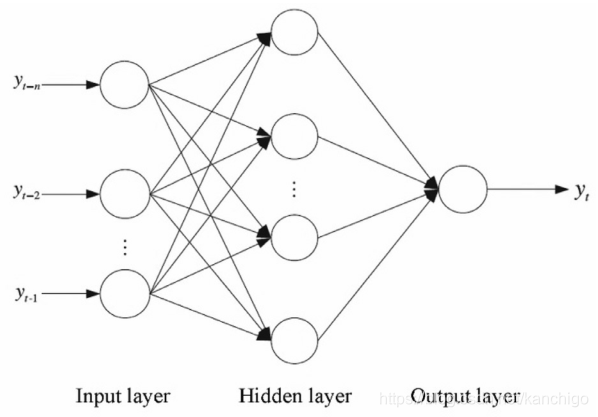

## 启发式搜索

### A*算法

A*算法是一种用于图搜索和路径查找的启发式算法。它可以在加权图中找到从起点到目标点的最短路径。A*算法结合了Dijkstra算法和贪心最佳优先搜索算法的优点，使用启发式函数来指导搜索，使其更加高效。

A*算法的主要步骤如下：

1. **初始化**：
   - 将起点加入到开放列表（open list）中。
   - 初始化关闭列表（closed list）为空。

2. **搜索过程**：
   - 从开放列表中选取具有最低估价函数值f(n)的节点n，并将其移出开放列表，加入关闭列表。
   - 如果n是目标节点，则结束搜索，路径找到。
   - 否则，对节点n的每个相邻节点m：
     - 如果m在关闭列表中，跳过它。
     - 如果m不在开放列表中，将m加入开放列表，并计算其估价函数值f(m)，并将n设为m的父节点。
     - 如果m已经在开放列表中，检查从n到m的路径是否比之前找到的路径更短。如果更短，则更新f(m)和m的父节点为n。

3. **重复**：
   - 重复上述过程，直到找到目标节点或开放列表为空（表示无路径）。

估价函数f(n)的计算：

$$ f(n) = g(n) + h(n) $$

- g(n) 是从起点到节点n的实际代价。
- h(n) 是节点n到目标节点的估计代价（通常使用启发式函数，如曼哈顿距离或欧几里得距离）。

**举例**：

假设我们在一个网格地图上寻找从起点 (0, 0) 到目标点 (4, 4) 的最短路径，网格上的每个节点表示一个位置，相邻节点之间的代价为1。

1. **初始化**：
   - 起点 (0, 0)，开放列表：[(0, 0)], 关闭列表：[]。
   - f(0, 0) = g(0, 0) + h(0, 0) = 0 + 8 = 8 （h(0, 0) 使用曼哈顿距离计算：|4-0| + |4-0| = 8）

2. **搜索过程**：
   - 从开放列表中选取 (0, 0)，移到关闭列表。
   - 检查相邻的节点：(0, 1), (1, 0)。
     - 对于 (0, 1)，g(0, 1) = 1, h(0, 1) = 7, f(0, 1) = 8。加入开放列表。
     - 对于 (1, 0)，g(1, 0) = 1, h(1, 0) = 7, f(1, 0) = 8。加入开放列表。
   - 当前开放列表：[(0, 1), (1, 0)], 关闭列表：[(0, 0)]。

3. **重复**：
   - 从开放列表中选取具有最低f值的节点（此例中有多个最低值节点，我们可以任选其一），假设选取 (0, 1)。
   - 将 (0, 1) 移到关闭列表，检查相邻节点 (0, 2), (1, 1), (0, 0)。
     - (0, 0) 在关闭列表中，跳过。
     - 对于 (0, 2)，g(0, 2) = 2, h(0, 2) = 6, f(0, 2) = 8。加入开放列表。
     - 对于 (1, 1)，g(1, 1) = 2, h(1, 1) = 6, f(1, 1) = 8。加入开放列表。
   - 当前开放列表：[(1, 0), (0, 2), (1, 1)], 关闭列表：[(0, 0), (0, 1)]。

这个过程会持续，直到找到目标点 (4, 4) 或开放列表为空。通过每次选择估价函数值最低的节点，并不断更新路径，我们最终能找到最短路径。


### 贪婪优先

贪婪优先搜索（Greedy Best-First Search）是一种启发式搜索算法，用于在图中找到从起点到目标点的路径。该算法的核心思想是每次选择最有希望到达目标节点的节点进行扩展，即选择启发式函数值最小的节点。

贪婪优先搜索算法的主要步骤如下：

1. **初始化**：
   - 将起点加入到开放列表（open list）中。
   - 初始化关闭列表（closed list）为空。

2. **搜索过程**：
   - 从开放列表中选取启发式函数值h(n)最小的节点n，并将其移出开放列表，加入关闭列表。
   - 如果n是目标节点，则结束搜索，路径找到。
   - 否则，对节点n的每个相邻节点m：
     - 如果m在关闭列表中，跳过它。
     - 如果m不在开放列表中，将m加入开放列表，并计算其启发式函数值h(m)。
     - 如果m已经在开放列表中，不需要更新h(m)，因为贪婪优先搜索只使用启发式函数值，不考虑路径成本。

3. **重复**：
   - 重复上述过程，直到找到目标节点或开放列表为空（表示无路径）。

启发式函数h(n)通常是从节点n到目标节点的估计代价，可以使用曼哈顿距离或欧几里得距离等。

**举例**：

假设我们在一个网格地图上寻找从起点 (0, 0) 到目标点 (4, 4) 的路径，网格上的每个节点表示一个位置，相邻节点之间的代价为1。

1. **初始化**：
   - 起点 (0, 0)，开放列表：[(0, 0)], 关闭列表：[]。
   - h(0, 0) = |4-0| + |4-0| = 8 （使用曼哈顿距离）

2. **搜索过程**：
   - 从开放列表中选取 (0, 0)，移到关闭列表。
   - 检查相邻的节点：(0, 1), (1, 0)。
     - 对于 (0, 1)，h(0, 1) = |4-0| + |4-1| = 7。加入开放列表。
     - 对于 (1, 0)，h(1, 0) = |4-1| + |4-0| = 7。加入开放列表。
   - 当前开放列表：[(0, 1), (1, 0)], 关闭列表：[(0, 0)]。

3. **重复**：
   - 从开放列表中选取具有最低h值的节点（此例中有多个最低值节点，我们可以任选其一），假设选取 (0, 1)。
   - 将 (0, 1) 移到关闭列表，检查相邻节点 (0, 2), (1, 1), (0, 0)。
     - (0, 0) 在关闭列表中，跳过。
     - 对于 (0, 2)，h(0, 2) = |4-0| + |4-2| = 6。加入开放列表。
     - 对于 (1, 1)，h(1, 1) = |4-1| + |4-1| = 6。加入开放列表。
   - 当前开放列表：[(1, 0), (0, 2), (1, 1)], 关闭列表：[(0, 0), (0, 1)]。

这个过程会持续，直到找到目标点 (4, 4) 或开放列表为空。通过每次选择启发式函数值最低的节点进行扩展，贪婪优先搜索可以快速找到一条路径，但它不保证找到最短路径。

### Minimax 算法

Minimax算法是一种在博弈论中用于最小化对手可能最大利益的决策算法。它常用于零和游戏，如西洋棋、国际象棋、围棋等，其中一个玩家的损失即另一个玩家的收益。Minimax算法通过递归寻找在最坏情况下的最佳移动方式。

Minimax算法的计算方式是建立一个游戏树，其中包含所有可能的游戏状态的节点和可能的移动方式的边。然后，从叶节点（游戏结束的状态）开始，根据游戏规则对节点进行评估。评估的结果会向上传递，即每个节点根据它的子节点选取最小或最大的评估值。这是因为博弈双方分别试图最大化和最小化相同的评估函数，双方轮流选择移动，一方选择时将从其子节点中选择最大的评分，而另一方则选择最小的评分。

由于Minimax算法涉及到对游戏树的全面搜索，其时间复杂度可能会非常高。因此，通常需要采用剪枝技术来减少计算量。最常用的剪枝技术是α-β剪枝。α-β剪枝通过维护两个值α和β来记录已经探索的部分树中找到的最佳评估，α表示在当前路径下，最大化玩家能确保的最低得分；β表示最小化玩家能确保的最高得分。在遍历树的过程中，如果在某个节点发现其最佳可能结果不如已经找到的结果（对于最大化玩家来说，该点的评估值小于α；对于最小化玩家，评估值大于β），就可以剪掉这个分支，不再向下搜索。

通过使用Minimax算法和α-β剪枝，可以有效地对抗策略游戏中的对手，计算出在特定情况下的最优策略。

### alpha-beta 搜索

Alpha-beta搜索是对Minimax算法的一种改进，它通过剪枝技术减少了搜索空间，从而提高了搜索效率。其基本思想是在递归搜索过程中，通过设定两个值α和β来剪去那些不可能影响最终决策的分支，从而避免对整个游戏树的全面搜索。

具体来说，α表示当前节点及其祖先节点中已知的最大下界（即最大化玩家能得到的最小值），β表示当前节点及其祖先节点中已知的最小上界（即最小化玩家能得到的最大值）。在搜索过程中，α和β会逐渐更新。

**Alpha-beta剪枝的步骤如下：**

1. **初始调用**：从根节点开始调用Minimax算法，并传入初始的α和β值（通常为负无穷和正无穷）。

2. **递归搜索**：
   - 对于每个节点，首先检查当前节点的类型（是最大化节点还是最小化节点）。
   - 对于最大化节点，初始设定当前最佳值v为负无穷。然后遍历每一个子节点：
     - 调用Minimax算法并传入子节点，同时更新α值为当前最佳值v。
     - 如果得到的值大于当前最佳值v，则更新v。
     - 如果v大于或等于β，停止进一步搜索（因为父节点不会选择这个分支），称为β剪枝。
   - 对于最小化节点，初始设定当前最佳值v为正无穷。然后遍历每一个子节点：
     - 调用Minimax算法并传入子节点，同时更新β值为当前最佳值v。
     - 如果得到的值小于当前最佳值v，则更新v。
     - 如果v小于或等于α，停止进一步搜索（因为父节点不会选择这个分支），称为α剪枝。

3. **返回值**：返回当前节点的最佳值v。

**伪代码示例**：

```python
def alpha_beta_search(node, depth, α, β, maximizingPlayer):
    if depth == 0 or node is a terminal node:
        return the heuristic value of node
    
    if maximizingPlayer:
        value = -∞
        for each child of node:
            value = max(value, alpha_beta_search(child, depth - 1, α, β, False))
            α = max(α, value)
            if α >= β:
                break  # β 剪枝
        return value
    else:
        value = ∞
        for each child of node:
            value = min(value, alpha_beta_search(child, depth - 1, α, β, True))
            β = min(β, value)
            if β <= α:
                break  # α 剪枝
        return value
```

通过α-β剪枝，算法能够显著减少需要评估的节点数量，从而在计算时间和空间上都更加高效。

## 蒙特卡洛树搜索

蒙特卡洛树搜索（Monte Carlo Tree Search，MCTS）是一种用于决策过程的启发式搜索算法，尤其在博弈论和复杂的决策问题中非常有效。它结合了蒙特卡洛方法的随机性和树搜索的结构性，能在状态空间巨大和搜索深度深的情况下，找到较优解。MCTS主要包括四个步骤：选择、扩展、模拟和反向传播。

### 1. 选择（Selection）
从根节点开始，根据某种策略（如UCB1，Upper Confidence Bound 1）选择一个子节点。策略通常是基于节点的访问次数和平均奖励来平衡探索与利用。在MCTS中，一个常用的选择策略是UCB1公式：
$$ \text{UCB1}(v) = \overline{X}_v + C \sqrt{\frac{\ln N_v}{n_v}} $$
其中：

- $ \overline{X}_v $ 是节点v的平均奖励。
- $ N_v $ 是父节点的访问次数。
- $ n_v $ 是节点v的访问次数。
- $ C $ 是一个常数，控制探索和利用的平衡。

### 2. 扩展（Expansion）
当选择过程到达一个叶节点（即尚未完全展开的节点），从该节点选择一个未被访问的子节点，并将其添加到树中。

### 3. 模拟（Simulation）
从新扩展的节点开始，进行模拟（也称为Playout或Rollout）。模拟阶段会随机选择动作，直到达到游戏结束或达到预设的深度。这个过程是为了估计该节点的胜率。

### 4. 反向传播（Backpropagation）
将模拟结果从新扩展的节点反向传播到根节点，更新路径上所有节点的统计数据，如访问次数和平均奖励。

### 重复
以上四个步骤不断重复，直到满足停止条件（如计算时间、模拟次数等）。最后，从根节点选择访问次数最多的子节点作为最佳决策。

### MCTS算法的伪代码

```pseudo
function MCTS(root):
    while computational budget not exhausted:
        leaf = TreePolicy(root)
        simulation_result = DefaultPolicy(leaf)
        Backup(leaf, simulation_result)
    return BestChild(root)

function TreePolicy(node):
    while node is not terminal:
        if node not fully expanded:
            return Expand(node)
        else:
            node = BestChild(node, C)
    return node

function Expand(node):
    choose an untried action a from node
    add a new child node from node with action a
    return new child node

function BestChild(node, C):
    return child with highest UCB1 value

function DefaultPolicy(node):
    while node is not terminal:
        node = random child of node
    return reward of final node

function Backup(node, reward):
    while node is not null:
        update node statistics with reward
        node = parent of node
```

### 应用领域
蒙特卡洛树搜索在很多领域都取得了成功，特别是在以下几方面：
- 博弈论：如围棋、国际象棋等。
- 规划和优化问题：如机器人路径规划。
- 决策过程：如决策支持系统。

MCTS的优势在于它不需要先验知识，适应性强，可以在有限计算资源下提供较好的解。然而，由于它依赖于随机模拟，在某些特定情况下可能会遇到效率瓶颈。

## 无监督学习

### K-means 聚类 	

K-means是一种广泛使用的聚类算法，它的目标是将n个数据点分配到k个聚类中，使得每个数据点归属的聚类中心与其距离之和最小。这里的“聚类中心”是该聚类中所有点的均值。K-means算法简单高效，适用于处理大数据集。然而，K-means算法也有一定的局限性，比如对初始聚类中心的选择敏感，可能陷入局部最优，而且要求预先指定聚类的数量k。

K-means算法的基本步骤如下：

1. **初始化**：随机选择k个数据点作为初始聚类中心。

2. **分配步骤**：对于每个数据点，计算其与各个聚类中心的距离，并将其分配到最近的聚类中心所代表的聚类。

3. **更新步骤**：重新计算每个聚类的中心，即计算该聚类所有点的均值作为新的聚类中心。

4. **迭代**：重复步骤2和步骤3，直到聚类中心不再发生变化，或者变化小于某个阈值，或者达到预设的迭代次数。

K-means算法的几个关键点：

- **距离计算**：K-means通常使用欧氏距离作为距离度量，但也可以使用其他距离度量。

- **聚类数量k的选择**：k的选择对结果有很大影响。实践中，可能需要根据问题的具体背景预先定义，或者使用诸如肘方法（Elbow Method）等技术确定更合适的k值。

- **初始化的影响**：为减少对初始聚类中心选择的依赖，可以多次运行算法，选取最佳结果，或者使用改进的初始化方法，如K-means++。

- **K-means++初始化**：这是一种特别的初始化方式，首先随机选择一个点作为第一个聚类中心，然后每次选择一个新的数据点作为新的聚类中心，选择概率与该点到现有聚类中心的距离成正比，直到选出k个聚类中心。这种方法能够提高算法的收敛速度和聚类质量。

- **收敛性**：尽管K-means算法可以保证在每次迭代中减少数据点与其所属聚类中心的距离，但只能保证找到局部最优解。

K-means算法因其简单和效率在许多领域被广泛应用，包括市场细分、社交网络分析、计算机视觉和图像分析等。

## 有监督学习

### 决策树

决策树是一种常用的机器学习算法，在构建决策树的过程中，需要选择特征进行节点划分，以便最大化分类或回归任务的效果。

#### 信息增益（Information Gain）

信息增益基于熵（Entropy）的减少来选择特征进行划分。

##### 计算方法：
$$
\text{Information Gain}(D, A) = \text{Entropy}(D) - \sum_{v \in \text{Values}(A)} \frac{|D_v|}{|D|} \text{Entropy}(D_v)
$$

其中，$ \text{Entropy}(D) $ 是数据集 D 的熵， $ D_v $ 是特征 A 取值为 v 的数据子集。

##### 优缺点：
- 直观简单，计算方便。
- 在许多情况下效果良好，尤其是二分类问题。

- 偏向于选择取值较多的特征，容易导致过拟合。

##### 例子说明

假设我们有一个简单的数据集，用于判断天气条件是否适合打网球。数据集包含以下特征：天气（Weather）、温度（Temperature）、湿度（Humidity）和风速（Windy），以及对应的标签（是否适合打网球）。

| 天气（Weather）  | 温度（Temperature） | 湿度（Humidity） | 风速（Windy） | 是否适合打网球（Play Tennis） |
| ---------------- | ------------------- | ---------------- | ------------- | ----------------------------- |
| 晴朗（Sunny）    | 热（Hot）           | 高（High）       | 否（No）      | 否（No）                      |
| 晴朗（Sunny）    | 热（Hot）           | 高（High）       | 是（Yes）     | 否（No）                      |
| 阴天（Overcast） | 热（Hot）           | 高（High）       | 否（No）      | 是（Yes）                     |
| 雨天（Rainy）    | 温暖（Mild）        | 高（High）       | 否（No）      | 是（Yes）                     |
| 雨天（Rainy）    | 凉爽（Cool）        | 正常（Normal）   | 否（No）      | 是（Yes）                     |
| 雨天（Rainy）    | 凉爽（Cool）        | 正常（Normal）   | 是（Yes）     | 否（No）                      |
| 阴天（Overcast） | 凉爽（Cool）        | 正常（Normal）   | 是（Yes）     | 是（Yes）                     |
| 晴朗（Sunny）    | 温暖（Mild）        | 高（High）       | 否（No）      | 否（No）                      |
| 晴朗（Sunny）    | 凉爽（Cool）        | 正常（Normal）   | 否（No）      | 是（Yes）                     |
| 雨天（Rainy）    | 温暖（Mild）        | 正常（Normal）   | 否（No）      | 是（Yes）                     |
| 晴朗（Sunny）    | 温暖（Mild）        | 正常（Normal）   | 是（Yes）     | 是（Yes）                     |
| 阴天（Overcast） | 温暖（Mild）        | 高（High）       | 是（Yes）     | 是（Yes）                     |
| 阴天（Overcast） | 热（Hot）           | 正常（Normal）   | 否（No）      | 是（Yes）                     |
| 雨天（Rainy）    | 温暖（Mild）        | 高（High）       | 是（Yes）     | 否（No）                      |

###### 计算信息增益

1. **计算熵（Entropy）**
   熵是数据集的不确定性度量。数据集D的熵计算公式为：
   $$
   \text{Entropy}(D) = - \sum_{i=1}^c p_i \log_2(p_i)
   $$
   其中，$ p_i $ 是第 i 类的概率。

   在这个例子中，我们有两类：“是（Yes）”和“否（No）”。
   - 是（Yes）：9 个
   - 否（No）：5 个

   总的熵为：
   $$
   \text{Entropy}(D) = - \left( \frac{9}{14} \log_2 \left( \frac{9}{14} \right) + \frac{5}{14} \log_2 \left( \frac{5}{14} \right) \right) \approx 0.940
   $$

2. **计算特征“天气（Weather）”的条件熵**
   “天气（Weather）”有三个取值：晴朗（Sunny）、阴天（Overcast）和雨天（Rainy）。

   - **晴朗（Sunny）**：5 个样本，其中 3 个否（No），2 个是（Yes）
     $$
     \text{Entropy(Sunny)} = - \left( \frac{3}{5} \log_2 \left( \frac{3}{5} \right) + \frac{2}{5} \log_2 \left( \frac{2}{5} \right) \right) \approx 0.971
     $$

   - **阴天（Overcast）**：4 个样本，全部是（Yes）
     $$
     \text{Entropy(Overcast)} = - \left( \frac{4}{4} \log_2 \left( \frac{4}{4} \right) \right) = 0
     $$

   -  **雨天（Rainy）**：5 个样本，其中 2 个否（No），3 个是（Yes）
     $$
     \text{Entropy(Rainy)} = - \left( \frac{2}{5} \log_2 \left( \frac{2}{5} \right) + \frac{3}{5} \log_2 \left( \frac{3}{5} \right) \right) \approx 0.971
     $$

   条件熵为：
   $$
   \text{Entropy}(D|Weather) = \frac{5}{14} \times 0.971 + \frac{4}{14} \times 0 + \frac{5}{14} \times 0.971 \approx 0.693
   $$

3. **计算信息增益**
   信息增益为初始熵与条件熵之差：
   $$
   \text{Information Gain}(D, \text{Weather}) = \text{Entropy}(D) - \text{Entropy}(D|\text{Weather}) \\\approx 0.940 - 0.693 = 0.247
   $$

通过类似的方法，可以计算其他特征（如温度、湿度、风速）的信息增益，选择信息增益最大的特征进行划分。


#### 增益比（Gain Ratio）
##### 计算方法：
$$
\text{Gain Ratio}(D, A) = \frac{\text{Information Gain}(D, A)}{\text{Split Information}(A)}
$$

其中，$ \text{Split Information}(A) $ 计算如下：$$ \text{Split Information}(A) = - \sum_{v \in \text{Values}(A)} \frac{|D_v|}{|D|} \log_2 \left( \frac{|D_v|}{|D|} \right) $$

##### 优点：
- 解决了信息增益偏向取值较多特征的问题。

##### 缺点：
- 增加了计算复杂度。
- 可能在某些情况下对数据噪声较为敏感。

##### 例子说明

假设我们有一个简单的数据集，用于判断天气条件是否适合打网球。数据集包含以下特征：天气（Weather）、温度（Temperature）、湿度（Humidity）和风速（Windy），以及对应的标签（是否适合打网球）。

| 天气（Weather）  | 是否适合打网球（Play Tennis） |
| ---------------- | ----------------------------- |
| 晴朗（Sunny）    | 否（No）                      |
| 晴朗（Sunny）    | 否（No）                      |
| 阴天（Overcast） | 是（Yes）                     |
| 雨天（Rainy）    | 是（Yes）                     |
| 雨天（Rainy）    | 是（Yes）                     |
| 雨天（Rainy）    | 否（No）                      |
| 阴天（Overcast） | 是（Yes）                     |
| 晴朗（Sunny）    | 否（No）                      |
| 晴朗（Sunny）    | 是（Yes）                     |
| 雨天（Rainy）    | 是（Yes）                     |
| 晴朗（Sunny）    | 是（Yes）                     |
| 阴天（Overcast） | 是（Yes）                     |
| 阴天（Overcast） | 是（Yes）                     |
| 雨天（Rainy）    | 否（No）                      |

###### 计算信息增益

1. 计算熵（Entropy）
   初始数据集D的熵：
   $$
   \text{Entropy}(D) = - \left( \frac{9}{14} \log_2 \left( \frac{9}{14} \right) + \frac{5}{14} \log_2 \left( \frac{5}{14} \right) \right) \approx 0.940
   $$

2. **计算特征“天气（Weather）”的条件熵**
   “天气（Weather）”有三个取值：晴朗（Sunny）、阴天（Overcast）和雨天（Rainy）。

   - **晴朗（Sunny）**：5 个样本，其中 3 个否（No），2 个是（Yes）
     $$
     \text{Entropy(Sunny)} = - \left( \frac{3}{5} \log_2 \left( \frac{3}{5} \right) + \frac{2}{5} \log_2 \left( \frac{2}{5} \right) \right) \approx 0.971
     $$

   - **阴天（Overcast）**：4 个样本，全部是（Yes）
     $$
     \text{Entropy(Overcast)} = - \left( \frac{4}{4} \log_2 \left( \frac{4}{4} \right) \right) = 0
     $$

   - **雨天（Rainy）**：5 个样本，其中 2 个否（No），3 个是（Yes）
     $$
     \text{Entropy(Rainy)} = - \left( \frac{2}{5} \log_2 \left( \frac{2}{5} \right) + \frac{3}{5} \log_2 \left( \frac{3}{5} \right) \right) \approx 0.971
     $$

   条件熵为：
   $$
   \text{Entropy}(D|Weather) = \frac{5}{14} \times 0.971 + \frac{4}{14} \times 0 + \frac{5}{14} \times 0.971 \approx 0.693
   $$

3. **计算信息增益**
   信息增益为初始熵与条件熵之差：
   $$
   \text{Information Gain}(D, \text{Weather}) = \text{Entropy}(D) - \text{Entropy}(D|\text{Weather}) \approx 0.940 - 0.693 = 0.247
   $$

###### 计算增益比

4. **计算分裂信息（Split Information）**
   分裂信息用于度量特征的固有信息量，其计算公式为：
   $$
   \text{Split Information}(A) = - \sum_{v \in \text{Values}(A)} \frac{|D_v|}{|D|} \log_2 \left( \frac{|D_v|}{|D|} \right)
   $$

   对于特征“天气（Weather）”：
   - **晴朗（Sunny）**：5 个样本
     $$
     \frac{5}{14} \log_2 \left( \frac{5}{14} \right) \approx -0.530
     $$

   - **阴天（Overcast）**：4 个样本
     $$
     \frac{4}{14} \log_2 \left( \frac{4}{14} \right) \approx -0.371
     $$

   - **雨天（Rainy）**：5 个样本
     $$
     \frac{5}{14} \log_2 \left( \frac{5}{14} \right) \approx -0.530
     $$

   分裂信息为：
   $$
   \text{Split Information}(Weather) = - \left( \frac{5}{14} \log_2 \left( \frac{5}{14} \right) + \frac{4}{14} \log_2 \left( \frac{4}{14} \right) + \frac{5}{14} \log_2 \left( \frac{5}{14} \right)  \right) \approx 1.431
   $$

5. **计算增益比**
   增益比为信息增益与分裂信息之比：
   $$
   \text{Gain Ratio}(D, \text{Weather}) = \frac{\text{Information Gain}(D, \text{Weather})}{\text{Split Information}(Weather)} \approx \frac{0.247}{1.431} \approx 0.173
   $$

#### 基尼指数（Gini Index）
基尼指数用于衡量数据集的不纯度，是分类树（如 CART）的常用指标。

##### 计算方法：
$$ \text{Gini}(D) = 1 - \sum_{i=1}^m p_i^2 $$

其中，$ p_i $ 是类别 i 在数据集 D 中的概率。

特征 A 的基尼指数计算如下：

$$ \text{Gini}(D, A) = \sum_{v \in \text{Values}(A)} \frac{|D_v|}{|D|} \text{Gini}(D_v) $$

##### 优点：
- **计算简单**：基尼指数的计算比信息增益和增益比更简单，计算成本较低。
- **减少偏好**：基尼指数在分裂时不偏好于取值较多的特征，更加公平地评估不同特征的分裂效果。
- **稳定性**：在实际应用中，基尼指数在处理分类问题时表现稳定，尤其是在处理大型数据集时，能够有效避免过拟合。

##### 缺点：
- 基尼指数对数据分布不均的情况可能表现较差。

基尼指数（Gini Index）是一种衡量数据集不纯度的指标，广泛用于分类问题中的决策树算法。下面通过一个具体的例子说明基尼指数的计算过程。

##### 例子说明

假设我们有一个简单的数据集，用于判断天气条件是否适合打网球。数据集包含以下特征：天气（Weather）和标签（是否适合打网球）。

| 天气（Weather）  | 是否适合打网球（Play Tennis） |
| ---------------- | ----------------------------- |
| 晴朗（Sunny）    | 否（No）                      |
| 晴朗（Sunny）    | 否（No）                      |
| 阴天（Overcast） | 是（Yes）                     |
| 雨天（Rainy）    | 是（Yes）                     |
| 雨天（Rainy）    | 是（Yes）                     |
| 雨天（Rainy）    | 否（No）                      |
| 阴天（Overcast） | 是（Yes）                     |
| 晴朗（Sunny）    | 否（No）                      |
| 晴朗（Sunny）    | 是（Yes）                     |
| 雨天（Rainy）    | 是（Yes）                     |
| 晴朗（Sunny）    | 是（Yes）                     |
| 阴天（Overcast） | 是（Yes）                     |
| 阴天（Overcast） | 是（Yes）                     |
| 雨天（Rainy）    | 否（No）                      |

###### 计算基尼指数

1. **计算总体基尼指数**

首先，计算整个数据集的基尼指数。我们有14个样本，其中9个是（Yes），5个否（No）。

基尼指数的计算公式为：
$$
\text{Gini}(D) = 1 - \sum_{i=1}^c p_i^2
$$
其中，$ p_i $ 是第 i 类的概率。

对于这个数据集：
$$
p_{\text{Yes}} = \frac{9}{14}, \quad p_{\text{No}} = \frac{5}{14}
$$

所以总体基尼指数为：
$$
\text{Gini}(D) = 1 - \left( \left( \frac{9}{14} \right)^2 + \left( \frac{5}{14} \right)^2 \right) = 1 - \left( \frac{81}{196} + \frac{25}{196} \right) = 1 - \frac{106}{196} \approx 0.459
$$

2. **计算特征“天气（Weather）”的基尼指数**

“天气（Weather）”有三个取值：晴朗（Sunny）、阴天（Overcast）和雨天（Rainy）。

- **晴朗（Sunny）**：5 个样本，其中 3 个否（No），2 个是（Yes）
  $$
  p_{\text{No}} = \frac{3}{5}, \quad p_{\text{Yes}} = \frac{2}{5}
  $$
  $$
  \text{Gini(Sunny)} = 1 - \left( \left( \frac{3}{5} \right)^2 + \left( \frac{2}{5} \right)^2 \right) = 1 - \left( \frac{9}{25} + \frac{4}{25} \right) = 1 - \frac{13}{25} = 0.48
  $$

- **阴天（Overcast）**：4 个样本，全部是（Yes）
  $$
  p_{\text{Yes}} = \frac{4}{4} = 1, \quad p_{\text{No}} = 0
  $$
  $$
  \text{Gini(Overcast)} = 1 - \left( \left( \frac{4}{4} \right)^2 + 0 \right) = 1 - 1 = 0
  $$

- **雨天（Rainy）**：5 个样本，其中 2 个否（No），3 个是（Yes）
  $$
  p_{\text{No}} = \frac{2}{5}, \quad p_{\text{Yes}} = \frac{3}{5}
  $$
  $$
  \text{Gini(Rainy)} = 1 - \left( \left( \frac{2}{5} \right)^2 + \left( \frac{3}{5} \right)^2 \right) = 1 - \left( \frac{4}{25} + \frac{9}{25} \right) = 1 - \frac{13}{25} = 0.48
  $$

3. **计算特征“天气（Weather）”的加权基尼指数**

特征“天气（Weather）”的加权基尼指数为：
$$
\text{Gini}(D|\text{Weather}) = \frac{5}{14} \times \text{Gini(Sunny)} + \frac{4}{14} \times \text{Gini(Overcast)} + \frac{5}{14} \times \text{Gini(Rainy)}
$$

代入基尼值：
$$
\text{Gini}(D|\text{Weather}) = \frac{5}{14} \times 0.48 + \frac{4}{14} \times 0 + \frac{5}{14} \times 0.48 \approx 0.343
$$

###### 选择最佳分裂特征

通过比较不同特征的加权基尼指数，我们可以选择使**基尼指数最小的特征**进行划分。在这个例子中，如果天气是唯一的特征，则天气的加权基尼指数为 0.343，而总体基尼指数为 0.459。

选择天气作为第一个划分特征，因为它降低了整体数据集的不纯度。


## 反向传播神经网络（BP）

反向传播神经网络（Backpropagation Neural Network，简称BP神经网络）是人工神经网络中最常见的一种训练算法。它是一种通过误差反馈来调整网络权重的监督学习方法，广泛应用于分类、回归等任务中。



### 算法步骤
BP算法的基本步骤如下：

1. **初始化**：随机初始化网络的权重和偏置。
2. **前向传播**：
   - 输入层接收输入数据并将其传递到隐藏层。
   - 隐藏层通过激活函数计算输出，并将结果传递到下一层（输出层）。
   - 输出层计算最终输出。
3. **计算误差**：计算输出层的误差，即网络输出与期望输出之间的差异。
4. **后向传播**：
   - 从输出层开始，计算每个节点的误差项。
   - 通过链式法则，将误差项逐层传递回去，更新各层的权重和偏置。
5. **更新权重和偏置**：使用梯度下降法，根据误差项调整每个连接的权重和每个节点的偏置。
6. **重复**：重复上述步骤，直到误差达到预定的阈值或达到最大迭代次数。

### 计算过程
#### 1. 前向传播
假设网络有 $L$ 层，第 $l$ 层的输入表示为 $\mathbf{a}^{(l-1)}$，权重矩阵为 $\mathbf{W}^{(l)}$，偏置为 $\mathbf{b}^{(l)}$，激活函数为 $f$。

$$
\mathbf{z}^{(l)} = \mathbf{W}^{(l)} \mathbf{a}^{(l-1)} + \mathbf{b}^{(l)} \\ \mathbf{a}^{(l)} = f(\mathbf{z}^{(l)})
$$
最终输出为 $\mathbf{a}^{(L)}$。

#### 2. 计算误差
假设期望输出为 $\mathbf{y}$，网络输出为 $\mathbf{a}^{(L)}$，则误差函数（如均方误差）为：

$$
E = \frac{1}{2} \sum_{k} (\mathbf{y}_k - \mathbf{a}^{(L)}_k)^2
$$

#### 3. 后向传播
从输出层开始，计算误差项 $\delta^{(L)}$：$$ \delta^{(L)} = (\mathbf{a}^{(L)} - \mathbf{y}) \odot f'(\mathbf{z}^{(L)}) $$

对隐藏层，误差项 $\delta^{(l)}$ 为：$$ \delta^{(l)} = (\mathbf{W}^{(l+1)})^T \delta^{(l+1)} \odot f'(\mathbf{z}^{(l)}) $$

#### 4. 更新权重和偏置
使用学习率 $\eta$ 调整权重和偏置：

$$
\mathbf{b}^{(l)} \leftarrow \mathbf{b}^{(l)} - \eta \delta^{(l)} \\
\mathbf{W}^{(l)} \leftarrow \mathbf{W}^{(l)} - \eta \delta^{(l)} (\mathbf{a}^{(l-1)})^T
$$

### 反向传播的计算过程

假设我们有一个简单的三层神经网络：输入层、一个隐藏层和输出层。为了简化计算，我们使用一个只有一个神经元的隐藏层和一个神经元的输出层。

1. **前向传播（Forward Propagation）**
    - 输入层到隐藏层：
      $$ z_1 = w_1 x + b_1 $$
      $$ a_1 = \sigma(z_1) $$
    - 隐藏层到输出层：
      $$ z_2 = w_2 a_1 + b_2 $$
      $$ a_2 = \sigma(z_2) $$
2. **计算误差（Error Calculation）**
    - 误差函数：$$ E = \frac{1}{2}(y - a_2)^2 $$，其中，$ y $ 是期望输出，$ a_2 $ 是实际输出。
3. **后向传播（Backward Propagation）**
    - 输出层误差项：$$ \delta_2 = (a_2 - y) \cdot \sigma'(z_2) $$
    - 隐藏层误差项：$$ \delta_1 = \delta_2 \cdot w_2 \cdot \sigma'(z_1) $$
4. **更新权重和偏置**
    - 学习率为 $ \eta $：
    - $$ w_2 \leftarrow w_2 - \eta \cdot \delta_2 \cdot a_1 $$
    - $$ b_2 \leftarrow b_2 - \eta \cdot \delta_2 $$
    - $$ w_1 \leftarrow w_1 - \eta \cdot \delta_1 \cdot x $$
    - $$ b_1 \leftarrow b_1 - \eta \cdot \delta_1 $$

### 实际例子

假设我们有以下数据：
- 输入 $ x = 0.5 $
- 期望输出 $ y = 0.8 $
- 初始权重和偏置：$ w_1 = 0.4 $, $ b_1 = 0.1 $, $ w_2 = 0.3 $, $ b_2 = -0.2 $
- 学习率 $ \eta = 0.1 $
- 激活函数使用Sigmoid函数 $ \sigma(z) = \frac{1}{1 + e^{-z}} $

#### 1. 前向传播

计算隐藏层输出：
$$ z_1 = w_1 \cdot x + b_1 = 0.4 \cdot 0.5 + 0.1 = 0.3 $$
$$ a_1 = \sigma(z_1) = \frac{1}{1 + e^{-0.3}} \approx 0.5744 $$

计算输出层输出：
$$ z_2 = w_2 \cdot a_1 + b_2 = 0.3 \cdot 0.5744 - 0.2 \approx -0.0277 $$
$$ a_2 = \sigma(z_2) = \frac{1}{1 + e^{0.0277}} \approx 0.4931 $$

#### 2. 计算误差
$$ E = \frac{1}{2}(y - a_2)^2 = \frac{1}{2}(0.8 - 0.4931)^2 \approx 0.0471 $$

#### 3. 后向传播

计算输出层误差项：
$$ \delta_2 = (a_2 - y) \cdot \sigma'(z_2) = (0.4931 - 0.8) \cdot 0.4931 \cdot (1 - 0.4931) \approx -0.0766 $$

计算隐藏层误差项：
$$ \delta_1 = \delta_2 \cdot w_2 \cdot \sigma'(z_1) = -0.0766 \cdot 0.3 \cdot 0.5744 \cdot (1 - 0.5744) \approx -0.0055 $$

#### 4. 更新权重和偏置

$$ w_2 \leftarrow w_2 - \eta \cdot \delta_2 \cdot a_1 = 0.3 - 0.1 \cdot (-0.0766) \cdot 0.5744 \approx 0.3034 $$
$$ b_2 \leftarrow b_2 - \eta \cdot \delta_2 = -0.2 - 0.1 \cdot (-0.0766) \approx -0.1923 $$
$$ w_1 \leftarrow w_1 - \eta \cdot \delta_1 \cdot x = 0.4 - 0.1 \cdot (-0.0055) \cdot 0.5 \approx 0.4003 $$
$$ b_1 \leftarrow b_1 - \eta \cdot \delta_1 = 0.1 - 0.1 \cdot (-0.0055) \approx 0.1006 $$


## 卷积神经网络CNN

这个不会不如死了算了


## 距离计算公式

1. **欧氏距离（Euclidean Distance）**：
   - 这是最常见的距离度量方式，适用于多数几何空间中的距离计算。计算公式为：$$ d(p, q) = \sqrt{\sum_{i=1}^n (p_i - q_i)^2} $$
   - 其中，$ p $ 和 $ q $ 是两个点，$ n $ 是维度数。

2. **曼哈顿距离（Manhattan Distance）**：
   - 又称为城市街区距离（因为它模拟了一个人在规则的街区网络中从一个点移动到另一个点的距离）。该距离是各坐标的绝对值差的总和：$$ d(p, q) = \sum_{i=1}^n |p_i - q_i| $$

3. **切比雪夫距离（Chebyshev Distance）**：
   - 它是无限维空间中的度量，给出的是各个坐标距离的最大值：$$ d(p, q) = \max_i |p_i - q_i| $$

4. **余弦相似度（Cosine Similarity）**：
   - 主要用于度量两个向量的夹角，常用于文本分析中。相似度计算公式为：$$ \cos(\theta) = \frac{p \cdot q}{\|p\| \|q\|} $$
   - 其中，点积 $\cdot$ 表示两个向量的点积，$\|p\|$ 和 $\|q\|$ 是向量的模。余弦距离由1减去余弦相似度得到。

5. **汉明距离（Hamming Distance）**：
   - 用于度量两个等长字符串之间的距离，它等于将一个字符串变换为另一个字符串所需的最少字符替换次数。

6. **杰卡德相似度（Jaccard Similarity）**：
   - 用于比较有限样本集之间的相似性和多样性。计算公式是两集合交集大小与并集大小的比例：$$ J(A, B) = \frac{|A \cap B|}{|A \cup B|} $$
   - 其中，$ A $ 和 $ B $ 是两个集合。

7. **马氏距离（Mahalanobis Distance）**：
   - 它是由印度统计学家马哈拉诺比斯提出的，考虑了数据的协方差。适合用于考虑数据内部结构的情况。计算公式为：$$ d(\mathbf{x}, \mathbf{y}) = \sqrt{(\mathbf{x} - \mathbf{y})^T S^{-1} (\mathbf{x} - \mathbf{y})} $$
   - 其中，$ \mathbf{x} $ 和 $ \mathbf{y} $ 是向量，$ S $ 是数据集的协方差矩阵。


## 深度学习

Word2Vec 是一种用于自然语言处理的技术，由谷歌在2013年提出。它通过将单词表示为向量的方式，将语言中的词汇转换为数值形式，使得计算机能够更好地理解和处理语言。

Word2Vec 模型的核心思想是将语义相似的词汇映射到相近的向量空间中。它有两种主要的训练方法：

1. **CBOW (Continuous Bag of Words)**：通过已知上下文词汇来预测当前中心词汇。
2. **Skip-gram**：通过已知当前词汇来预测其上下文词汇。

这种向量化的方法使得词汇之间的关系可以通过简单的向量运算来表达，比如“王者 - 男人 + 女人 ≈ 女王”。

Word2Vec 的应用非常广泛，包括文本分类、情感分析、机器翻译等领域。


