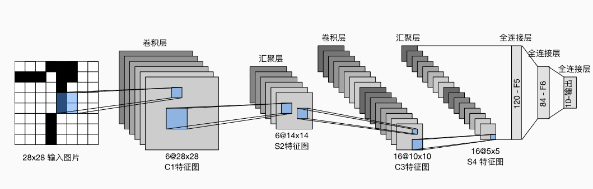

# 机器学习

## 预备知识

统计学习：模型 策略 算法

构建一个函数集合，训练评价

### 监督学习

*监督学习*擅长在“给定输入特征”的情况下预测标签。

监督学习的学习过程一般可以分为三大步骤：

1. 从已知大量数据样本中随机选取一个子集，为每个样本获取真实标签。有时，这些样本已有标签（例如，患者是否在下一年内康复？）；有时，这些样本可能需要被人工标记（例如，图像分类）。这些输入和相应的标签一起构成了训练数据集；
2. 选择有监督的学习算法，它将训练数据集作为输入，并输出一个“已完成学习的模型”；
3. 将之前没有见过的样本特征放到这个“已完成学习的模型”中，使用模型的输出作为相应标签的预测。

### 无监督学习


# 深度学习

## 线性神经网络

### 基本模型

#### 线性回归

而在机器学习领域，我们通常使用的是高维数据集，建模时采用线性代数表示法会比较方便。 当我们的输入包含d个特征时，我们将预测结果$$\hat{y}$$表示为：

$$
\hat{y} = w_1  x_1 + ... + w_d  x_d + b.
$$
实际中我们难以找到一个完美的线性相关数据，所以在开始寻找最优权重和偏移量之前， 我们还需要两个东西： （1）一种模型质量的度量方式； 

（2）一种能够更新模型以提高模型预测质量的方法。


#### 损失函数

在我们开始考虑如何用模型*拟合*（fit）数据之前，我们需要确定一个拟合程度的度量。 *损失函数*（loss function）能够量化目标的*实际*值与*预测*值之间的差距。 通常我们会选择非负数作为损失，且数值越小表示损失越小，完美预测时的损失为0。 回归问题中最常用的损失函数是平方误差函数。
$$
l^{(i)}(\mathbf{w}, b) = \frac{1}{2} \left(\hat{y}^{(i)} - y^{(i)}\right)^2.
$$
$$\frac{1}{2}$$并不会带来本质上的区别，只是为了求导简单

均方误差不能用于分类


#### 随机梯度下降

不是所有的模型都能够求解析解，而**梯度下降方法几乎可以优化所有的深度学习模型**

它通过不断地在损失函数递减的方向上更新参数来降低误差。

为了增加速度，我们每次选取固定数量的样本（batch），然后，我们计算小批量的平均损失关于模型参数的导数（也可以称为梯度）

> 算法的步骤如下： 
>
> （1）初始化模型参数的值，如随机初始化； 
>
> （2）从数据集中随机抽取小批量样本且在负梯度的方向上更新参数，并不断迭代这一步骤。

$$
\begin{split}\begin{aligned} \mathbf{w} &\leftarrow \mathbf{w} -   \frac{\eta}{|\mathcal{B}|} \sum_{i \in \mathcal{B}} \partial_{\mathbf{w}} l^{(i)}(\mathbf{w}, b) = \mathbf{w} - \frac{\eta}{|\mathcal{B}|} \sum_{i \in \mathcal{B}} \mathbf{x}^{(i)} \left(\mathbf{w}^\top \mathbf{x}^{(i)} + b - y^{(i)}\right),\\ b &\leftarrow b -  \frac{\eta}{|\mathcal{B}|} \sum_{i \in \mathcal{B}} \partial_b l^{(i)}(\mathbf{w}, b)  = b - \frac{\eta}{|\mathcal{B}|} \sum_{i \in \mathcal{B}} \left(\mathbf{w}^\top \mathbf{x}^{(i)} + b - y^{(i)}\right). \end{aligned}\end{split}
$$

 |B|表示每个小批量中的样本数，这也称为*批量大小*（batch size）。 $$\eta$$表示*学习率*（learning rate）。 批量大小和学习率的值通常是手动预先指定，而不是通过模型训练得到的。 这些可以调整但不在训练过程中更新的参数称为*超参数*（hyperparameter）。 *调参*（hyperparameter tuning）是**选择超参数**的过程。 超参数通常是我们根据训练迭代结果来调整的， 而训练迭代结果是在独立的*验证数据集*（validation dataset）上评估得到的。


### Softmax回归

把输入映射为0-1之间的实数，并且归一化保证和为1，因此多分类的概率也为1


## 多层感知机

线性模型是很容易出错的，因为我们无法保证线性相关的关系


### 概念

#### 隐藏层

我们可以通过在网络中加入一个或多个隐藏层来克服线性模型的限制， 使其能处理更普遍的函数关系类型。


如果没有激活函数，那么每个隐藏层仅仅只是一个仿射函数，与Softmax并无区别，为了避免多层感知机模型退化成线性模型，我们需要引入激活函数


通用近似定理：给定足够的神经元和正确的权重， 我们可以对任意函数建模

#### 激活函数

隐层激活函数：ReLU的系列函数

只有加上非线性的变换才有意义


ReLU的系列函数，在负数段给一个非常小的斜率

Sigmiod梯度趋近于0，饱和现象，改进：取正切


### 模型的选择、欠拟合和过拟合

将模型在训练数据上拟合的比在潜在分布中更接近的现象称为*过拟合*（overfitting）， 用于对抗过拟合的技术称为*正则化*（regularization）


*训练误差*（training error）是指， 模型在训练数据集上计算得到的误差。 *泛化误差*（generalization error）是指， 模型应用在同样从原始样本的分布中抽取的无限多数据样本时，模型误差的期望。


### 权重衰减

可以通过正则化的方式来修正过拟合的问题

**范式：**常用来描述向量的大小

常用的范式有两种$$L_1,L_2$$范数

$$L_1$$范数常常表示为向量元素的绝对值之和
$$
||X||_1=\sum^n_{i=1}|x_i|
$$
$$L_2$$范数是向量元素平方和的平方根，深度学习中更经常地使用$$L_2$$范数的平方
$$
||X||_2=\sqrt{\sum^x_{n-1}x^2_i}
$$


$$L_2$$范数更常用的原因是它对权重向量的大分量施加了巨大的惩罚。 这使得我们的学习算法偏向于在大量特征上均匀分布权重的模型。 在实践中，这可能使它们对单个变量中的观测误差更为稳定。

 $$L_1$$惩罚会导致模型将权重集中在一小部分特征上， 而将其他权重清除为零。这叫*特征选择*


### 暂退法(Dropout)

在计算后续层之前向网络的每一层注入噪声, 因为当训练一个有多层的深层网络时，注入噪声只会在输入-输出映射上增强平滑性。

标准暂退法包括在计算下一层之前将当前层中的一些节点置零

如何注入噪声：*无偏性*
在标准暂退法正则化中，通过按保留（未丢弃）的节点的分数$$h$$进行规范化来消除每一层的偏差。 换言之，每个中间活性值以暂退概率$$p$$由随机变量$$h^`$$替换，如下所示：
$$
\begin{split}\begin{aligned}
h' =
\begin{cases}
    0 & \text{ 概率为 } p \\
    \frac{h}{1-p} & \text{ 其他情况}
\end{cases}
\end{aligned}\end{split}
$$
通过这种方式我们可以保证模型的期望值不变，即$$E[h^{'}]=h$$

通常在**测试的过程中**，我们不用暂退法，我们不会丢弃任何节点


### 前向传播、反向传播

反向传播：计算梯度

梯度下降：使用梯度学习参数


前馈神经网络：都和前面的节点相连，和同层没有相连

只要有足够多的神经元，可以以任何精度逼近任何函数


找假设空间

mlp-mixer


### 环境与分布偏移

讨论训练数据的问题而导致的模型问题

ex： 通过将基于模型的决策引入环境，我们可能会破坏模型

#### 分布偏移的类型

协变量偏移：训练的特征和测试的特征不一样

标签偏移：类别条件分布不变，但边缘概率改变

概念偏移：事物一样但是标签不一样


#### 经验风险和实际风险

最小化训练损失：
$$
经验损失=\mathop{\mathrm{minimize}}_f \frac{1}{n} \sum_{i=1}^n l(f(\mathbf{x}_i), y_i),
$$


## 卷积神经网络CNN

当图片达到百万级像素时候，全连接层的开销会大到难以接受，所以多层感知机变得不可用

为了避免丢失边缘像素，我们常常使用小卷积核


### 图像卷积

卷积层所表达的运算其实是*互相关运算*，而不是卷积运算，结果是将对应位相乘并求和

#### 互相关和卷积

卷积=矩阵乘法

卷积层可能执行严格的卷积运算或者互相关运算，如果执行的是严格的卷积运算，我们需要的就是垂直和水平翻转卷积核，然后对输入张量执行互相关运算


### 填充和步幅

填充：在输入图像的边界填充元素（通常填充元素是0）

步幅：每次滑动元素的数量$$n:输入 \qquad k:卷积核  \qquad p:填充  \qquad s:步长$$
$$
\lfloor(n_h-k_h+p_h+s_h)/s_h\rfloor \times \lfloor(n_w-k_w+p_w+s_w)/s_w\rfloor.
$$

```python
nn.Conv2D(1, kernel_size=3, padding=1) #二维卷积
```


### 多输入多输出通道

当引入RGB图像的通道时，每个RGB输入图像具有$$3×ℎ×w$$的形状。我们将这个大小为3的轴称为*通道*（channel）维度


#### 多输出通道

用$$c_i$$和$$c_o$$分别表示输入和输出通道的数目，并让$$k_h$$和$$k_w$$为卷积核的高度和宽度。为了获得多个通道的输出，我们可以为每个输出通道创建一个形状为$$c_i\times k_h \times k_w$$的卷积核张量，这样卷积核的形状是$$c_i\times c_o \times k_h  \times k_h$$。在互相关运算中，每个输出通道先获取所有输入通道，再以对应该输出通道的卷积核计算出结果。


#### $$1\times 1$$卷积层

我们可以将1×1卷积层看作在每个像素位置应用的全连接层，以$$c_i$$个输入值转换为$$c_o$$个输出值。 因为这仍然是一个卷积层，所以跨像素的权重是一致的。

- 当以每像素为基础应用时，1×1卷积层相当于全连接层。
- 1×1卷积层通常用于调整网络层的通道数量和控制模型复杂性。


仿射变换

1*1的卷积层，不识别空间模式，知识融合通道


### 池化层（汇聚层）

汇聚(pooling)：它具有双重目的：**降低卷积层对位置的敏感性**，同时**降低对空间降采样表示的敏感性**。

常用：maximum pooling and average pooling


默认情况下，深度学习框架中的步幅与汇聚窗口大小相等

同样的，汇聚层也有填充和步幅


#### 多个通道

与卷积层不同的是，汇聚层在每一个通道上单独运算，不像卷积层一样对输入进行汇总。所以汇聚层的输入通道数和输出通道数相等


### LeNet

LeNet（LeNet-5）由两个部分组成：

- 卷积编码器：由两个卷积层组成;
- 全连接层密集块：由三个全连接层组成。




### AlexNet

主要思想和LeNet相似，改进地方：

数据量的提升，硬件算力的提升

AlexNet将sigmoid激活函数改为更简单的ReLU激活函数

AlexNet通过暂退法控制全连接层的模型复杂度，而LeNet只使用了权重衰减。


### 使用块的网络(VGG)

经典卷积神经网络的基本组成部分是下面的这个序列：

1. 带填充以保持分辨率的卷积层；
2. 非线性激活函数，如ReLU；
3. 汇聚层，如最大汇聚层。

在VGG论文中，Simonyan和Ziserman尝试了各种架构。特别是他们发现深层且窄的卷积（即$$3\times 3$$）比较浅层且宽的卷积更有效。


### NIN块

NiN和AlexNet之间的一个显著区别是NiN完全取消了全连接层。 相反，NiN使用一个NiN块，其输出通道数等于标签类别的数量。最后放一个*全局平均汇聚层*（global average pooling layer），生成一个对数几率 （logits）。NiN设计的一个优点是，它显著减少了模型所需参数的数量。然而，在实践中，这种设计有时会增加训练模型的时间。


- NiN使用由一个卷积层和多个$$1\times1$$卷积层组成的块。该块可以在卷积神经网络中使用，以允许更多的每像素非线性。
- NiN去除了容易造成过拟合的全连接层，将它们替换为全局平均汇聚层（即在所有位置上进行求和）。该汇聚层通道数量为所需的输出数量（例如，Fashion-MNIST的输出为10）。
- 移除全连接层可减少过拟合，同时显著减少NiN的参数。
- NiN的设计影响了许多后续卷积神经网络的设计。


### googleNet


### resNet

别的网络在层数增加之后不会有太多提升

加一个恒等项


## 优化算法

损失函数是优化问题的目标函数，一般来说我们的目的是让损失函数最小化，如果为了求最大化我们可以添加负号

### 优化和深度学习

#### 优化的目标

深度学习（或更广义地说，统计推断）的目标是减少泛化误差

#### 优化挑战

##### 局部最小值

在优化过程中，模型的目标函数通常有很多局部最优解，可能会被误认为是全局

##### 鞍点

*鞍点*（saddle point）是指函数的所有梯度都消失但既不是全局最小值也不是局部最小值的任何位置。考虑这个函数$$f(x) = x^3$$。它的一阶和二阶导数$$x=0$$在时消失。这时优化可能会停止，尽管它不是最小值。

##### 梯度消失

开始训练时梯度就接近0，因此训练会停滞很长一段时间


### 凸性

TODO


### 梯度下降

在梯度下降中，我们首先选择初始值$$x$$和常数$$\eta > 0$$， 然后使用它们连续迭代$$x$$，直到停止条件达成。 例如，当梯度的幅度足够小或迭代次数达到某个值时。


### 随机梯度下降

在深度学习中，目标函数通常是训练数据集中每个样本的损失函数的平均值。给定$$i$$个样本的训练数据集，我们假设$$f_i(x)$$是关于索引$$i$$的训练样本的损失函数，其中$$x$$是参数向量。然后我们得到目标函数
$$
f(\mathbf{x}) = \frac{1}{n} \sum_{i = 1}^n f_i(\mathbf{x}).
$$
目标函数的梯度：
$$
\nabla f(\mathbf{x}) = \frac{1}{n} \sum_{i = 1}^n \nabla f_i(\mathbf{x}).
$$
如果使用梯度下降，时间复杂度会大到不可以接受

**随机梯度下降（SGD）**可降低每次迭代时的计算代价。在随机梯度下降的每次迭代中，我们对数据样本随机均匀采样一个索引$i$，其中$i\in\{1,\ldots, n\}$，并计算梯度$\nabla f_i(\mathbf{x})$以更新$\mathbf{x}$：

$$
\mathbf{x} \leftarrow \mathbf{x} - \eta \nabla f_i(\mathbf{x})
$$

其中$\eta$是学习率。我们可以看到，每次迭代的计算代价从梯度下降的$\mathcal{O}(n)$降至常数$\mathcal{O}(1)$。此外，我们要强调，随机梯度$\nabla f_i(\mathbf{x})$是对完整梯度$\nabla f(\mathbf{x})$的无偏估计，因为

$$
\mathbb{E}_i \nabla f_i(\mathbf{x}) = \frac{1}{n} \sum_{i = 1}^n \nabla f_i(\mathbf{x}) = \nabla f(\mathbf{x}).
$$

这意味着，平均而言，随机梯度是对梯度的良好估计。
