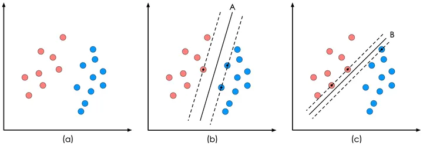
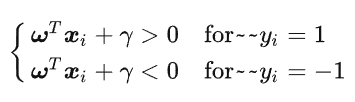
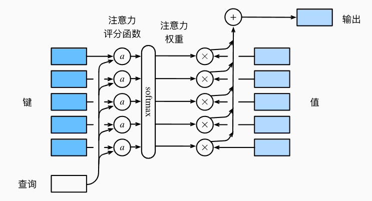
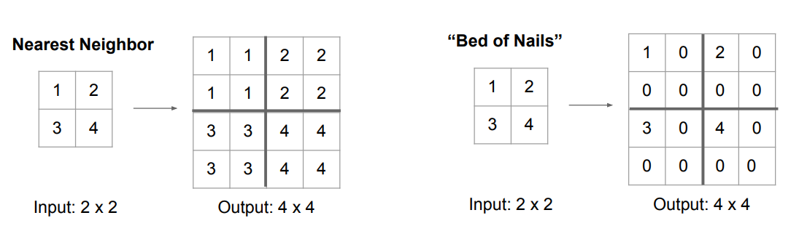

# 机器学习

## 预备知识

统计学习：模型 策略 算法

构建一个函数集合，训练评价

### 监督学习

*监督学习*擅长在“给定输入特征”的情况下预测标签。

监督学习的学习过程一般可以分为三大步骤：

1. 从已知大量数据样本中随机选取一个子集，为每个样本获取真实标签。有时，这些样本已有标签（例如，患者是否在下一年内康复？）；有时，这些样本可能需要被人工标记（例如，图像分类）。这些输入和相应的标签一起构成了训练数据集；
2. 选择有监督的学习算法，它将训练数据集作为输入，并输出一个“已完成学习的模型”；
3. 将之前没有见过的样本特征放到这个“已完成学习的模型”中，使用模型的输出作为相应标签的预测。

### 无监督学习


## SVM

Support Vector Machine即支持向量机主要用于解决模式识别领域中的数据分类问题，属于有监督学习算法的一种。

SVM要解决的问题可以用一个经典的二分类问题加以描述，黑色实线为分界线，术语称为“决策面”。虽然在目前的数据上看，这两个分类器的分类结果是一样的，但如果考虑潜在的其他数据，则两者的分类性能是有差别的。



SVM算法认为图1中的分类器A在性能上优于分类器B，其依据是A的分类间隔比B要大。

> 分类间隔：在保证决策面方向不变且不会出现错分样本的情况下移动决策面，会在原来的决策面两侧找到两个极限位置（越过该位置就会产生错分现象），**如虚线所示**。虚线的位置由决策面的方向和距离原决策面最近的几个样本的位置决定。而这两条平行虚线正中间的分界线就是在保持当前决策面方向不变的前提下的最优决策面。两条虚线之间的垂直距离就是这个最优决策面对应的分类间隔。
>
> 支持向量：那个具有“最大间隔”的决策面就是SVM要寻找的最优解。而这个真正的最优解对应的两侧虚线所穿过的样本点，就是SVM中的支持样本点，称为“支持向量”。


### 线性SVM算法的数学建模

决策面方程

目前只考虑二维平面中的一根直线$$y=ax+b$$

转换之后可以写成一个更加通用的形式
$$
\omega x+\gamma = 0
$$

#### 约束条件

1. 并不是所有的方向都存在能够实现100%正确分类的决策面，我们如何判断一条直线是否能够将所有的样本点都正确分类？
2. 即便找到了正确的决策面方向，还要注意决策面的位置应该在间隔区域的中轴线上，所以用来确定决策面位置的截距$$\gamma$$也不能自由的优化，而是受到决策面方向和样本点分布的约束。
3. 即便取到了合适的方向和截距，x不是随随便便的一个样本点，而是支持向量对应的样本点。对于一个给定的决策面，我们该如何找到对应的支持向量？



#### 线性SVM优化问题基本描述

里面$$\omega^Tx_i+\gamma=1 or −1$$的情况什么时候会发生呢，只有当$$x_i$$是决策面$$\omega^Tx_i+\gamma=0$$所对应的支持向量样本点时，等于1或-1的情况才会出现。这一点给了我们另一个简化目标函数的启发。所以对于这些支持向量样本点有：
$$
d=\frac{|\omega^Tx_i+\gamma|}{||\omega||}=\frac{1}{||\omega||} \quad 如果x_i是一个支持向量点
$$
原来的任务：找到一组参数$$\omega和\gamma$$使得分类间隔最小

现在任务：使得$$||\omega||$$最小，也就等效于使得$$\frac 1 2 ||\omega||^2$$

我们之所以要在上加上平方和1/2的系数，是为了以后进行最优化的过程中对目标函数求导时比较方便，但这绝不影响最优化问题最后的解。


此外由上面式子还可以推出：
$$
y_i(\omega^Tx_i+\gamma) \ge1
$$
到这个地方我们已经得出了SVM最优化问题的数学描述了：
$$
\min_{\omega,\gamma}\frac 1 2 ||\omega||^2 \\ y_i(\omega^T+x_i+\gamma) \ge1, \quad i=1,2,\dots,m
$$


### 核函数

#### 通俗理解


观察这个图片，可以得出结论：**我们无论如何也不能找到一个直线将这两类分开**

那如果我们把上面的数据映射到更高的维度当中，上图是二维的图像，我们把它映射到三维当中，就可以使用一个平面将样本区分开了。也就是说**通过一个映射函数，将样本从n维映射到n+1或者更高的维度**，使得原本线性不可分的数据变成线性可分，这样我们就解决了一些原本不能解决的问题。

> 核函数是一系列函数的统称，这些函数的输入是样本x，输出是一个映射到更高维度的样本$$x_t$$。

这里有一个小问题，我们前面说了函数$$\Phi(x)$$会把x映射到更高的维度。比如x本身是10维的，我们用了函数之后给映射到1000维了，当然它的线性不可分的问题可能解决了，但是这会带来另外一个问题，就是**计算的复杂度增加了**。计算次数也增加了100倍。所以我们对核函数做了一些限制，**只有可以白嫖的映射函数才被称为核函数**。即应该满足：
$$
\Phi(x_i^Tx_j)=\Phi(x_i)^T\Phi(x_j)
$$


常见核函数如下

1. 线性核函数，其实就是没有核函数。$$K(x_i,x_j)=x_i^Tx_j$$
2. 多项式核函数，它等价于一个多项式变换：$$K(x_i,x_j)=(\gamma x_i^Tx_j+b)^d$$，这里的�，b和d都是我们设置的参数
3. 高斯核，这种核函数使用频率很高，$$K(x_i,x_j)=exp(-\gamma ||x_i-x_j||^2)$$
4. sigmoid核，它的公式是：$$K(x_i,x_j)=\tanh(\gamma x_i^Tx_j+b)$$


# 深度学习

## 预备知识

### 线性代数

#### 点积dot

对应位置相乘


## 线性神经网络

### 基本模型

#### 线性回归

而在机器学习领域，我们通常使用的是高维数据集，建模时采用线性代数表示法会比较方便。 当我们的输入包含d个特征时，我们将预测结果$$\hat{y}$$表示为：

$$
\hat{y} = w_1  x_1 + ... + w_d  x_d + b.
$$
实际中我们难以找到一个完美的线性相关数据，所以在开始寻找最优权重和偏移量之前， 我们还需要两个东西： （1）一种模型质量的度量方式； 

（2）一种能够更新模型以提高模型预测质量的方法。


#### 损失函数

在我们开始考虑如何用模型*拟合*（fit）数据之前，我们需要确定一个拟合程度的度量。 *损失函数*（loss function）能够量化目标的*实际*值与*预测*值之间的差距。 通常我们会选择非负数作为损失，且数值越小表示损失越小，完美预测时的损失为0。 回归问题中最常用的损失函数是平方误差函数。
$$
l^{(i)}(\mathbf{w}, b) = \frac{1}{2} \left(\hat{y}^{(i)} - y^{(i)}\right)^2.
$$
$$\frac{1}{2}$$并不会带来本质上的区别，只是为了求导简单

均方误差不能用于分类


#### 随机梯度下降

不是所有的模型都能够求解析解，而**梯度下降方法几乎可以优化所有的深度学习模型**

它通过不断地在损失函数递减的方向上更新参数来降低误差。

为了增加速度，我们每次选取固定数量的样本（batch），然后，我们计算小批量的平均损失关于模型参数的导数（也可以称为梯度）

> 算法的步骤如下： 
>
> （1）初始化模型参数的值，如随机初始化； 
>
> （2）从数据集中随机抽取小批量样本且在负梯度的方向上更新参数，并不断迭代这一步骤。

$$
\begin{split}\begin{aligned} \mathbf{w} &\leftarrow \mathbf{w} -   \frac{\eta}{|\mathcal{B}|} \sum_{i \in \mathcal{B}} \partial_{\mathbf{w}} l^{(i)}(\mathbf{w}, b) = \mathbf{w} - \frac{\eta}{|\mathcal{B}|} \sum_{i \in \mathcal{B}} \mathbf{x}^{(i)} \left(\mathbf{w}^\top \mathbf{x}^{(i)} + b - y^{(i)}\right),\\ b &\leftarrow b -  \frac{\eta}{|\mathcal{B}|} \sum_{i \in \mathcal{B}} \partial_b l^{(i)}(\mathbf{w}, b)  = b - \frac{\eta}{|\mathcal{B}|} \sum_{i \in \mathcal{B}} \left(\mathbf{w}^\top \mathbf{x}^{(i)} + b - y^{(i)}\right). \end{aligned}\end{split}
$$

 |B|表示每个小批量中的样本数，这也称为*批量大小*（batch size）。 $$\eta$$表示*学习率*（learning rate）。 批量大小和学习率的值通常是手动预先指定，而不是通过模型训练得到的。 这些可以调整但不在训练过程中更新的参数称为*超参数*（hyperparameter）。 *调参*（hyperparameter tuning）是**选择超参数**的过程。 超参数通常是我们根据训练迭代结果来调整的， 而训练迭代结果是在独立的*验证数据集*（validation dataset）上评估得到的。


### softmax回归

把输入映射为0-1之间的实数，并且归一化保证和为1，因此多分类的概率也为1

$$
\hat{\mathbf{y}} = \mathrm{softmax}(\mathbf{o})\quad \text{其中}\quad \hat{y}_j = \frac{\exp(o_j)}{\sum_k \exp(o_k)}
$$
softmax仍然是一个线性函数，运算不会改变预测o之间的大小顺序，只会确定分配给每个类别的概率


#### 损失函数

所有预测正确项的积，然后对其求负对数，相乘一定是小于1的数，求负对数一定大于0

这种方法被称为交叉熵损失


## 多层感知机

线性模型是很容易出错的，因为我们无法保证线性相关的关系


### 概念

#### 隐藏层

我们可以通过在网络中加入一个或多个隐藏层来克服线性模型的限制， 使其能处理更普遍的函数关系类型。


如果没有激活函数，那么每个隐藏层仅仅只是一个仿射函数，与Softmax并无区别，为了避免多层感知机模型退化成线性模型，我们需要引入激活函数


通用近似定理：给定足够的神经元和正确的权重， 我们可以对任意函数建模

#### 激活函数

隐层激活函数：ReLU的系列函数

只有加上非线性的变换才有意义


ReLU的系列函数，在负数段给一个非常小的斜率

Sigmiod梯度趋近于0，饱和现象，改进：取正切


### 模型的选择、欠拟合和过拟合

将模型在训练数据上拟合的比在潜在分布中更接近的现象称为*过拟合*（overfitting）， 用于对抗过拟合的技术称为*正则化*（regularization）


*训练误差*（training error）是指， 模型在训练数据集上计算得到的误差。 *泛化误差*（generalization error）是指， 模型应用在同样从原始样本的分布中抽取的无限多数据样本时，模型误差的期望。


### 权重衰减

可以通过正则化的方式来修正过拟合的问题

**范式：**常用来描述向量的大小

常用的范式有两种$$L_1,L_2$$范数

$$L_1$$范数常常表示为向量元素的绝对值之和
$$
||X||_1=\sum^n_{i=1}|x_i|
$$
$$L_2$$范数是向量元素平方和的平方根，深度学习中更经常地使用$$L_2$$范数的平方
$$
||X||_2=\sqrt{\sum^x_{n-1}x^2_i}
$$


$$L_2$$范数更常用的原因是它对权重向量的大分量施加了巨大的惩罚。 这使得我们的学习算法偏向于在大量特征上均匀分布权重的模型。 在实践中，这可能使它们对单个变量中的观测误差更为稳定。

 $$L_1$$惩罚会导致模型将权重集中在一小部分特征上， 而将其他权重清除为零。这叫*特征选择*


### 暂退法(Dropout)

在计算后续层之前向网络的每一层注入噪声, 因为当训练一个有多层的深层网络时，注入噪声只会在输入-输出映射上增强平滑性。

标准暂退法包括在计算下一层之前将当前层中的一些节点置零

如何注入噪声：*无偏性*
在标准暂退法正则化中，通过按保留（未丢弃）的节点的分数$$h$$进行规范化来消除每一层的偏差。 换言之，每个中间活性值以暂退概率$$p$$由随机变量$$h^`$$替换，如下所示：
$$
\begin{split}\begin{aligned}
h' =
\begin{cases}
    0 & \text{ 概率为 } p \\
    \frac{h}{1-p} & \text{ 其他情况}
\end{cases}
\end{aligned}\end{split}
$$
通过这种方式我们可以保证模型的期望值不变，即$$E[h^{'}]=h$$

通常在**测试的过程中**，我们不用暂退法，我们不会丢弃任何节点


### 前向传播、反向传播

反向传播：计算梯度

梯度下降：使用梯度学习参数


前馈神经网络：都和前面的节点相连，和同层没有相连

只要有足够多的神经元，可以以任何精度逼近任何函数


找假设空间

mlp-mixer


### 环境与分布偏移

讨论训练数据的问题而导致的模型问题

ex： 通过将基于模型的决策引入环境，我们可能会破坏模型

#### 分布偏移的类型

协变量偏移：训练的特征和测试的特征不一样

标签偏移：类别条件分布不变，但边缘概率改变

概念偏移：事物一样但是标签不一样


#### 经验风险和实际风险

最小化训练损失：
$$
经验损失=\mathop{\mathrm{minimize}}_f \frac{1}{n} \sum_{i=1}^n l(f(\mathbf{x}_i), y_i),
$$


## 卷积神经网络CNN

当图片达到百万级像素时候，全连接层的开销会大到难以接受，所以多层感知机变得不可用

为了避免丢失边缘像素，我们常常使用小卷积核


### 图像卷积

卷积层所表达的运算其实是*互相关运算*，而不是卷积运算，结果是将对应位相乘并求和

#### 互相关和卷积

卷积=矩阵乘法

卷积层可能执行严格的卷积运算或者互相关运算，如果执行的是严格的卷积运算，我们需要的就是垂直和水平翻转卷积核，然后对输入张量执行互相关运算


### 填充和步幅

填充：在输入图像的边界填充元素（通常填充元素是0）

步幅：每次滑动元素的数量$$n:输入 \qquad k:卷积核  \qquad p:填充  \qquad s:步长$$
$$
\lfloor(n_h-k_h+p_h+s_h)/s_h\rfloor \times \lfloor(n_w-k_w+p_w+s_w)/s_w\rfloor.
$$

```python
nn.Conv2D(1, kernel_size=3, padding=1) #二维卷积
```


### 多输入多输出通道

当引入RGB图像的通道时，每个RGB输入图像具有$$3×ℎ×w$$的形状。我们将这个大小为3的轴称为*通道*（channel）维度


#### 多输出通道

> 当输入包含多个通道时，需要构造一个与输入数据具有相同输入通道数的卷积核

用$$c_i$$和$$c_o$$分别表示输入和输出通道的数目，并让$$k_h$$和$$k_w$$为卷积核的高度和宽度。为了获得多个通道的输出，我们可以为每个输出通道创建一个形状为$$c_i\times k_h \times k_w$$的卷积核张量，这样卷积核的形状是$$c_i\times c_o \times k_h  \times k_h$$。在互相关运算中，每个输出通道先获取所有输入通道，再以对应该输出通道的卷积核计算出结果。


#### $$1\times 1$$卷积层

我们可以将1×1卷积层看作在每个像素位置应用的全连接层，以$$c_i$$个输入值转换为$$c_o$$个输出值。 因为这仍然是一个卷积层，所以跨像素的权重是一致的。

- 当以每像素为基础应用时，1×1卷积层相当于全连接层。
- 1×1卷积层通常用于调整网络层的通道数量和控制模型复杂性。


仿射变换

1*1的卷积层，不识别空间模式，知识融合通道


### 池化层（汇聚层）

汇聚(pooling)：它具有双重目的：**降低卷积层对位置的敏感性**，同时**降低对空间降采样表示的敏感性**。

常用：maximum pooling and average pooling


默认情况下，深度学习框架中的步幅与汇聚窗口大小相等

同样的，汇聚层也有填充和步幅


#### 多个通道

与卷积层不同的是，汇聚层在每一个通道上单独运算，不像卷积层一样对输入进行汇总。所以汇聚层的输入通道数和输出通道数相等


### LeNet

LeNet（LeNet-5）由两个部分组成：

- 卷积编码器：由两个卷积层组成;
- 全连接层密集块：由三个全连接层组成。


### AlexNet

主要思想和LeNet相似，改进地方：

数据量的提升，硬件算力的提升

AlexNet将sigmoid激活函数改为更简单的ReLU激活函数

AlexNet通过暂退法控制全连接层的模型复杂度，而LeNet只使用了权重衰减。


### 使用块的网络(VGG)

经典卷积神经网络的基本组成部分是下面的这个序列：

1. 带填充以保持分辨率的卷积层；
2. 非线性激活函数，如ReLU；
3. 汇聚层，如最大汇聚层。

在VGG论文中，Simonyan和Ziserman尝试了各种架构。特别是他们发现深层且窄的卷积（即$$3\times 3$$）比较浅层且宽的卷积更有效。


### NIN块

NiN和AlexNet之间的一个显著区别是NiN完全取消了全连接层。 相反，NiN使用一个NiN块，其输出通道数等于标签类别的数量。最后放一个*全局平均汇聚层*（global average pooling layer），生成一个对数几率 （logits）。NiN设计的一个优点是，它显著减少了模型所需参数的数量。然而，在实践中，这种设计有时会增加训练模型的时间。


- NiN使用由一个卷积层和多个$$1\times1$$卷积层组成的块。该块可以在卷积神经网络中使用，以允许更多的每像素非线性。
- NiN去除了容易造成过拟合的全连接层，将它们替换为全局平均汇聚层（即在所有位置上进行求和）。该汇聚层通道数量为所需的输出数量（例如，Fashion-MNIST的输出为10）。
- 移除全连接层可减少过拟合，同时显著减少NiN的参数。
- NiN的设计影响了许多后续卷积神经网络的设计。


### 含并行连结的网络（GoogLeNet）

基本的卷积块被称为*Inception块*（Inception block）


在Inception块中，通常调整的超参数是每层输出通道数。

- Inception块相当于一个有4条路径的子网络。它通过不同窗口形状的卷积层和最大汇聚层来并行抽取信息，并使用卷积层减少每像素级别上的通道维数从而降低模型复杂度。
- GoogLeNet将多个设计精细的Inception块与其他层（卷积层、全连接层）串联起来。其中Inception块的通道数分配之比是在ImageNet数据集上通过大量的实验得来的。
- GoogLeNet和它的后继者们一度是ImageNet上最有效的模型之一：它以较低的计算复杂度提供了类似的测试精度。


### 批量规范化

训练深层次的网络，遇到的问题：

- 层次变深之后，无法预知会发生什么，可能一层是另一层的几百倍

**批量规范化**应用于单个可选层（也可以应用到所有层），其原理如下：在每次训练迭代中，我们首先规范化输入，即通过减去其均值并除以其标准差，其中两者均基于当前小批量处理。 接下来，我们应用比例系数和比例偏移。


### ResNet(残差网络)

别的网络在层数增加之后不会有太多提升

加一个恒等项


## 循环神经网络RNN

### 序列模型

#### 自回归模型

任务：围绕如何实现$$P(x_t \mid x_{t-1}, \ldots, x_1)$$

第一种(*自回归模型*)：基于过去的一段序列预测当前序列

第二种(*隐变量自回归模型*)：是保留一些对过去观测的总结$$h_t$$， 并且同时更新预测$$\hat{x_t}$$和总结$$h_t$$。

假设：数据的动力学是不变的


#### 马尔可夫模型

*马尔可夫条件*（Markov condition）：使用接近的数据而不是所有数据来预测，只要这种方式是准确的，我们就认为它符合马尔可夫模型


### 文本预处理

步骤：

1. 将文本加入到内存中
2. 将字符串拆分为词元
3. 建立一个词表，进行映射
4. 将文本转换为数字索引序列，方便操作


### 语言模型和数据集

基本概率规则：
$$
P(x_1, x_2, \ldots, x_T) = \prod_{t=1}^T P(x_t  \mid  x_1, \ldots, x_{t-1}).
$$
自然语言统计：

通过此图我们可以发现：词频以一种明确的方式迅速衰减。


### 循环神经网络

我们希望之前所有的数据都能对当前产生影响，而不是仅前列几个数据，因此我们引入隐状态，注意区分隐状态和隐藏层的区别


## 注意力机制

“是否包含自主性提示”将注意力机制与全连接层或汇聚层区别开来。 在注意力机制的背景下，自主性提示被称为*查询*（query）。 给定任何查询，注意力机制通过*注意力汇聚*（attention pooling） 将选择引导至*感官输入*（sensory inputs，例如中间特征表示）。 在注意力机制中，这些感官输入被称为*值*（value）。 更通俗的解释，每个值都与一个*键*（key）配对， 这可以想象为感官输入的非自主提示。 


### 注意力汇聚

#### 不带参数

根据输入位置对输出$$y_i$$进行加权：
$$
f(x) = \sum_{i=1}^n \frac{K(x - x_i)}{\sum_{j=1}^n K(x - x_j)} y_i,
$$
$$K$$是核， 估计器*Nadaraya-Watson核回归*（Nadaraya-Watson kernel regression）

更加通用的*注意力汇聚*公式：
$$
f(x) = \sum_{i=1}^n \alpha(x, x_i) y_i,
$$
**如果一个键$$x_i$$越是接近给定的查询$$x$$**， 那么分配给这个键对应值的注意力权重就会越大， 也就“获得了更多的注意力”。

非参数的Nadaraya-Watson核回归具有*一致性*（consistency）的优点： 如果有足够的数据，此模型会收敛到最优结果。

#### 带参数

 在下面的查询$$x$$和键$$x_i$$之间的距离乘以可学习参数$$w$$：
$$
\begin{split}\begin{aligned}f(x) &= \sum_{i=1}^n \alpha(x, x_i) y_i \\&= \sum_{i=1}^n \frac{\exp\left(-\frac{1}{2}((x - x_i)w)^2\right)}{\sum_{j=1}^n \exp\left(-\frac{1}{2}((x - x_j)w)^2\right)} y_i \\&= \sum_{i=1}^n \mathrm{softmax}\left(-\frac{1}{2}((x - x_i)w)^2\right) y_i.\end{aligned}\end{split}
$$


### 注意力评分函数

高斯核指数部分可以视为*注意力评分函数*（attention scoring function），然后把这个函数的输出结果输入到softmax函数中进行运算。 通过上述步骤，将得到与键对应的值的概率分布（即注意力权重）。 最后，注意力汇聚的输出就是基于这些注意力权重的值的加权和。




#### 掩码softmax操作

在某些情况，并非所有值都应被纳入注意力汇聚中，比如某些序列被填充了无意义的特殊词元，可以指定一个有效序列长度（即词元的个数）， 以便在计算softmax时过滤掉超出指定范围的位置。 


#### 加性注意力

当查询和键是不同长度的矢量时，可以使用加性注意力作为评分函数。 给定查询$$\mathbf{q} \in \mathbb{R}^q$$和键$$\mathbf{k} \in \mathbb{R}^k$$， *加性注意力*（additive attention）的评分函数为
$$
a(\mathbf q, \mathbf k) = \mathbf w_v^\top \text{tanh}(\mathbf W_q\mathbf q + \mathbf W_k \mathbf k) \in \mathbb{R},
$$
将查询和键连结起来后输入到一个多层感知机（MLP）中， 感知机包含一个隐藏层，其隐藏单元数是一个超参数ℎ。 通过使用tanh作为激活函数，并且禁用偏置项。


#### 缩放点积注意力

使用点积可以得到计算效率更高的评分函数， 但是点积操作要求查询和键具有相同的长度d。


## 优化算法

损失函数是优化问题的目标函数，一般来说我们的目的是让损失函数最小化，如果为了求最大化我们可以添加负号

### 优化和深度学习

#### 优化的目标

深度学习（或更广义地说，统计推断）的目标是减少泛化误差

#### 优化挑战

##### 局部最小值

在优化过程中，模型的目标函数通常有很多局部最优解，可能会被误认为是全局最优，只有一定程度的噪声可能会使参数跳出局部最小值。事实上，这是小批量随机梯度下降的有利特性之一。在这种情况下，小批量上梯度的自然变化能够将参数从局部极小值中跳出。


##### 鞍点

*鞍点*（saddle point）是指函数的所有梯度都消失但既不是全局最小值也不是局部最小值的任何位置。考虑这个函数$$f(x) = x^3$$。它的一阶和二阶导数$$x=0$$在时消失。这时优化可能会停止，尽管它不是最小值。

对于高维度问题，*部分*特征值为负的可能性相当高。这使得鞍点比局部最小值更有可能出现。


##### 梯度消失

开始训练时梯度就接近0，因此训练会停滞很长一段时间，重参数化通常会有所帮助。对参数进行良好的初始化也可能是有益的。


### 凸性

> *凸性*（convexity）在优化算法的设计中起到至关重要的作用， 这主要是由于在这种情况下对算法进行分析和测试要容易。 换言之，如果算法在凸性条件设定下的效果很差， 那通常我们很难在其他条件下看到好的结果。

#### 定义

##### 凸集

> *凸集*（convex set）是凸性的基础。 简单地说，如果对于任何$$a, b \in \mathcal{X}$$，连接a和b的线段也位于$$\mathcal{X}$$中，则向量空间中的一个集合$$\mathcal{X}$$是*凸*（convex）的。 在数学术语上，这意味着对于所有$$\lambda \in [0, 1]$$，我们得到
> $$
> \lambda  a + (1-\lambda)  b \in \mathcal{X} \text{ 当 } a, b \in \mathcal{X}.
> $$

##### 凸函数

凸函数满足
$$
\lambda f(x) + (1-\lambda) f(x') \geq f(\lambda x + (1-\lambda) x').
$$


#### 詹森不等式


### 梯度下降

在梯度下降中，我们首先选择初始值$$x$$和常数$$\eta > 0$$， 然后使用它们连续迭代$$x$$，直到停止条件达成。 例如，当梯度的幅度足够小或迭代次数达到某个值时。


### 随机梯度下降

在深度学习中，目标函数通常是训练数据集中每个样本的损失函数的平均值。给定$$i$$个样本的训练数据集，我们假设$$f_i(x)$$是关于索引$$i$$的训练样本的损失函数，其中$$x$$是参数向量。然后我们得到目标函数
$$
f(\mathbf{x}) = \frac{1}{n} \sum_{i = 1}^n f_i(\mathbf{x}).
$$
目标函数的梯度：
$$
\nabla f(\mathbf{x}) = \frac{1}{n} \sum_{i = 1}^n \nabla f_i(\mathbf{x}).
$$
如果使用梯度下降，时间复杂度会大到不可以接受

**随机梯度下降（SGD）**可降低每次迭代时的计算代价。在随机梯度下降的每次迭代中，我们对数据样本随机均匀采样一个索引$i$，其中$i\in\{1,\ldots, n\}$，并计算梯度$\nabla f_i(\mathbf{x})$以更新$\mathbf{x}$：

$$
\mathbf{x} \leftarrow \mathbf{x} - \eta \nabla f_i(\mathbf{x})
$$

其中$\eta$是学习率。我们可以看到，每次迭代的计算代价从梯度下降的$\mathcal{O}(n)$降至常数$\mathcal{O}(1)$。此外，我们要强调，随机梯度$\nabla f_i(\mathbf{x})$是对完整梯度$\nabla f(\mathbf{x})$的无偏估计，因为

$$
\mathbb{E}_i \nabla f_i(\mathbf{x}) = \frac{1}{n} \sum_{i = 1}^n \nabla f_i(\mathbf{x}) = \nabla f(\mathbf{x}).
$$

这意味着，平均而言，随机梯度是对梯度的良好估计。


## PPT

#### 上采样



物体检测


区域建议:选择性搜索找到可能包含物体的“斑点”图像区域，运行速度相对较快;

例如，选择性搜索在CPU上几秒钟内给出2000个区域建议


## RCNN

### 问题一：速度

经典的目标检测算法使用滑动窗法依次判断所有可能的区域。本文则预先提取一系列较可能是物体的**候选区域**，之后仅在这些候选区域上提取特征，进行判断。

### 问题二：训练集

经典的目标检测算法在区域中提取人工设定的特征（Haar，HOG）。本文则需要训练深度网络进行特征提取。可供使用的有两个数据库：

一个较大的识别库（ImageNet ILSVC 2012）：标定每张图片中物体的类别。一千万图像，1000类。

一个较小的检测库（PASCAL VOC 2007）：标定每张图片中，物体的类别和位置。一万图像，20类。

本文使用识别库进行预训练，而后用检测库调优参数。最后在检测库上评测。

### 流程

RCNN算法分为4个步骤

- 一张图像生成1K~2K个**候选区域**
- 对每个候选区域，使用深度网络**提取特征**
- 特征送入每一类的SVM **分类器**，判别是否属于该类
- 使用回归器**精细修正**候选框位置

### 候选区域生成

使用了Selective Search1方法从一张图像生成约2000-3000个候选区域。基本思路如下：

使用一种过分割手段，将图像分割成小区域

查看现有小区域，合并可能性最高的两个区域。重复直到整张图像合并成一个区域位置

输出所有曾经存在过的区域，所谓候选区域

候选区域生成和后续步骤相对独立，实际可以使用任意算法进行。


### 缺点

1. 慢速：R-CNN算法是一种两阶段的方法，需要对每个候选区域进行独立的特征提取和分类，这导致它的处理速度相对较慢。这限制了它在实时应用和大规模数据集上的应用。
2. 内存消耗大：R-CNN算法需要为每个候选区域提取CNN特征，这导致需要大量的存储空间来存储这些特征向量。这限制了R-CNN算法在处理大规模数据集时的可扩展性。
3. 不可训练端到端：R-CNN算法的不同组件（候选区域提取、特征提取、分类和边界框回归）是独立进行训练的，而没有一个端到端的训练过程。这可能导致子任务之间的不一致性，并且不利于整体优化。


##  Fast RCNN

Fast R-CNN是R-CNN目标检测算法的改进版本，它在速度和效率方面进行了优化。相比于R-CNN算法，Fast R-CNN具有以下主要特点：

1. 端到端训练：Fast R-CNN引入了ROI池化层（Region of Interest Pooling），它可以将不同尺寸的候选区域映射到固定大小的特征图上。这样，在特征提取过程中，可以将整个图像输入到CNN中，然后在ROI池化层中根据候选区域的位置和大小提取固定长度的特征向量。这使得Fast R-CNN可以通过端到端的方式进行训练，优化整个目标检测过程。

2. 共享特征提取：Fast R-CNN在特征提取阶段共享了整个图像的特征提取过程，而不是对每个候选区域单独提取特征。这样可以避免对每个候选区域进行重复的计算，提高了特征提取的效率。

3. 多任务损失：Fast R-CNN在分类任务和边界框回归任务上使用了多任务损失函数。除了物体分类的损失函数，还引入了边界框回归的损失函数，用于准确地预测物体的位置。这样可以同时优化分类和定位的准确性。

4. 特征金字塔网络（FPN）的整合：Fast R-CNN可以与特征金字塔网络（FPN）结合使用，以处理不同尺度的目标。FPN可以在不同层级的特征图中检测目标，并将它们进行融合，以提高对尺度变化较大的目标的检测能力。

Fast R-CNN在目标检测中取得了较好的性能和速度平衡。它在R-CNN的基础上进行了改进，通过共享特征提取、ROI池化和多任务损失等技术，使得整个目标检测过程更加高效、准确，并且能够进行端到端的训练。


Fast R-CNN算法的步骤如下：

1. 输入图像和真实标签：将输入图像和对应的物体类别标签（例如，汽车、猫、人等）作为算法的输入。

2. 提取共享特征：通过卷积神经网络（CNN）提取整个图像的共享特征。这可以使用在大规模图像数据集上预训练的CNN模型（如VGGNet、ResNet等）来完成。

3. 候选区域提取：使用选择性搜索（Selective Search）等方法在图像中提取候选区域。候选区域是可能包含物体的矩形区域。

4. ROI池化层：对于每个候选区域，使用ROI池化层将其映射到固定大小的特征图上。ROI池化将不同大小的候选区域转换为固定大小的特征向量，以便后续处理。

5. 特征分类：将ROI池化层输出的特征向量输入到全连接层（或者称为分类器）进行物体分类。通常，可以使用支持向量机（SVM）或softmax分类器来对不同类别进行分类。

6. 边界框回归：对于被分类为物体的候选区域，进行边界框回归来精确预测物体的位置。通过优化边界框的坐标，使其更好地拟合目标的位置。

7. 输出结果：根据分类和边界框回归的结果，得到最终的目标检测结果。通常，会根据分类概率和阈值进行筛选和筛除，以得到最终的检测结果。

整个Fast R-CNN算法的关键是使用ROI池化层将候选区域映射到固定大小的特征图上，从而可以在整个图像上共享特征提取过程，并通过端到端的训练优化整个目标检测过程。这样可以提高目标检测的效率和准确性。


## 比较

R-CNN（Region-CNN）和Fast R-CNN是目标检测领域中的两种经典算法，它们在目标检测的方法和性能上有一些区别，主要体现在以下几个方面：

1. 算法框架：R-CNN是一种两阶段的目标检测算法，它将目标检测过程分为候选区域提取、特征提取、分类和边界框回归四个阶段。Fast R-CNN是R-CNN的改进版，它引入了ROI池化层，将整个图像输入到卷积神经网络（CNN）中进行特征提取，并在ROI池化层对候选区域进行特征映射，从而实现了端到端的训练和更高的检测速度。

2. 特征提取方式：R-CNN算法对每个候选区域都进行独立的特征提取，这导致了大量的重复计算和高昂的计算成本。而Fast R-CNN通过共享整个图像的特征提取过程，避免了重复计算，提高了特征提取的效率。

3. 训练方式：R-CNN的训练过程相对复杂，需要分别训练候选区域提取、特征提取、分类和边界框回归等模块，并进行多次迭代训练。Fast R-CNN通过ROI池化层的引入，使得整个目标检测过程可以进行端到端的训练，简化了训练流程。

4. 速度和效率：Fast R-CNN相对于R-CNN在目标检测速度和效率方面有较大的提升。R-CNN需要对每个候选区域独立进行特征提取和分类，导致速度较慢。而Fast R-CNN通过共享特征提取和ROI池化层的引入，实现了更高的检测速度和更高的处理效率。

综上所述，Fast R-CNN在算法框架、特征提取方式、训练方式以及速度和效率等方面对R-CNN进行了改进和优化，使得目标检测算法更加高效、准确，并且能够进行端到端的训练。


## Region Proposal Network (RPN)

Region Proposal Network (RPN) 是一种神经网络模块，用于生成候选区域（region proposals）的算法。它是 Faster R-CNN 目标检测算法中的关键组成部分。

RPN 的主要任务是在输入图像中生成一组可能包含物体的候选区域，这些候选区域将作为后续目标检测过程的输入。RPN 基于滑动窗口（sliding window）的思想，通过在图像上滑动不同大小和比例的窗口，并对每个窗口提取特征，来预测该窗口是否包含物体以及相应的边界框。

RPN 的输入是特征图，通常是由共享特征提取网络（如 VGGNet 或 ResNet）生成的。RPN 在特征图上应用一系列的卷积和全连接层来提取窗口的特征表示。然后，对于每个窗口，RPN 通过两个并行的输出分支进行预测：

1. 窗口分类（objectness classification）：RPN 使用一个二分类器来预测窗口是否包含物体。对于每个窗口，分类器输出一个概率，表示该窗口包含物体的置信度。

2. 边界框回归（bounding box regression）：RPN 使用一个回归器来预测窗口的边界框坐标调整。对于每个窗口，回归器输出一个边界框的坐标调整值，用于修正窗口的位置和大小。

通过窗口分类和边界框回归的输出，RPN 对每个窗口进行评分和调整，从而生成一组候选区域。这些候选区域将进一步用于目标检测算法的后续处理，如区域兴趣池化（ROI pooling）和分类器训练等。

RPN 的引入使 Faster R-CNN 可以在端到端的训练过程中同时生成候选区域和进行目标分类和边界框回归，从而提高了目标检测算法的速度和准确性。


## Faster R-CNN

Faster R-CNN（Faster Region-CNN）是一种非常流行的目标检测算法，它是 R-CNN 和 Fast R-CNN 的改进版本，通过引入 Region Proposal Network (RPN) 实现了端到端的目标检测。

Faster R-CNN 的主要思想是将目标检测任务分为两个子任务：候选区域生成和目标分类与边界框回归。具体来说，Faster R-CNN 包含以下关键组件：

1. 共享特征提取网络：Faster R-CNN 使用一个卷积神经网络（如 VGGNet、ResNet 等）来提取图像的共享特征。该网络可以将整个图像映射为特征图。

2. Region Proposal Network (RPN)：RPN 是 Faster R-CNN 的核心组件，它在共享特征提取网络之后引入了一个小型的卷积神经网络。RPN 通过在特征图上滑动不同大小和比例的窗口，通过分类和回归来生成候选区域。RPN 生成的候选区域被认为可能包含目标。

3. ROI池化层：Faster R-CNN 使用 ROI池化层来对 RPN 生成的候选区域进行特征提取。ROI池化层将不同尺寸的候选区域映射到固定大小的特征图上，以便后续的目标分类和边界框回归。

4. 目标分类和边界框回归：在 ROI池化层输出的特征上，Faster R-CNN 使用分类器（如 softmax 或支持向量机）进行目标分类，并使用回归器来调整候选区域的边界框，以更准确地框定目标的位置。

整个 Faster R-CNN 系统可以通过端到端的方式进行训练，优化整个目标检测过程。通过引入 RPN，Faster R-CNN 实现了候选区域的高效生成，并且在候选区域上进行目标分类和边界框回归。这种设计使得 Faster R-CNN 在目标检测任务中取得了较好的性能，并成为目标检测领域的重要里程碑之一。


## Mask R-CNN

Mask R-CNN 是一种用于目标检测和实例分割的深度学习算法。它是在 Faster R-CNN 的基础上进行改进，引入了一个额外的分支，用于生成每个检测到的目标实例的精确像素级掩码。

相比于传统的目标检测算法，Mask R-CNN 不仅可以准确地定位和分类目标，还能够提供每个目标实例的精确像素级分割结果。

Mask R-CNN 的主要特点和组成部分如下：

1. 候选区域生成：与 Faster R-CNN 类似，Mask R-CNN 使用 RPN 生成候选目标区域。

2. 特征提取：使用共享的卷积神经网络（如 ResNet、VGGNet）从整个图像中提取特征。

3. 目标分类和边界框回归：对于每个候选区域，使用分类器进行目标分类，并使用回归器进行边界框调整。

4. 掩码分支：Mask R-CNN 引入了一个额外的分支，即掩码分支，用于生成目标实例的精确像素级掩码。这个分支是在特征图上的每个候选区域上应用全卷积网络，并输出一个与原始输入图像大小相匹配的二进制掩码。

通过在每个目标实例上生成掩码，Mask R-CNN 可以提供每个实例的精确分割结果，而不仅仅是边界框。

Mask R-CNN 的训练过程是端到端的，可以同时优化目标分类、边界框回归和像素级掩码生成的任务。该算法在许多实例分割任务中取得了显著的性能提升，例如人体姿态估计、物体分割等。

总而言之，Mask R-CNN 是在 Faster R-CNN 的基础上扩展而来的算法，不仅可以进行目标检测和分类，还能够提供每个目标实例的像素级精确分割结果。这使得 Mask R-CNN 成为目标检测和实例分割领域中的重要算法之一。
