# 深度学习

*机器学习*（machine learning，ML）是一类强大的可以**从经验中学习**的技术。 通常采用观测数据或与环境交互的形式，机器学习算法会积累更多的经验，其性能也会逐步提高。 

*深度学习*（deep learning，DL）的基础知识。 深度学习是一套强大的技术，它可以推动计算机视觉、自然语言处理、医疗保健和基因组学等不同领域的创新。

一个常见的训练过程：


黑盒 and 很多原理的不可解释性


## 预备知识

### 核心组件

无论什么类型的机器学习问题，都会遇到这些核心组件：

1. 可以用来学习的*数据*（data）；
2. 如何转换数据的*模型*（model）；
3. 一个*目标函数*（objective function），用来量化模型的有效性；
4. 调整模型参数以优化目标函数的*算法*（algorithm）。


#### 数据

每个数据集由一个个**样本**组成，大多时候，它们**遵循独立同分布**。 通常每个样本由一组称为**特征**的属性组成。 机器学习模型会根据这些属性进行预测。 在**监督学习**问题中，要预测的是一个特殊的属性，它被称为**标签**

当每个样本的**特征类别数量**都是相同的时候，其特征向量是**固定长度**的，这个长度被称为数据的*维数*。 固定长度的特征向量是一个方便的属性，它可以用来量化学习大量样本。

一般来说，越多正确的数据肯定可以得到更优秀的模型，如果数据太少可能和机器学习差不多；如果数据中充满垃圾，那肯定输出也是垃圾：

- 比如用白皮肤的数据集建立的皮肤癌识别模型去识别黑皮肤。


#### 模型

深度学习与经典方法的区别主要在于：前者关注的功能强大的模型，这些模型由神经网络错综复杂的交织在一起，包含层层数据转换，因此被称为深度学习。


#### 目标函数

目标函数**定义模型的优劣程度**的度量，这个度量在大多数情况是“可优化”的，这被称之为*目标函数*。 我们通常定义一个目标函数，并希望优化它到最低点。 因为越低越好，所以这些函数有时被称为*损失函数*（loss function）。

当任务在试图预测数值时，最常见的损失函数是*平方误差*（squared error），即预测值与实际值之差的平方。

通常，损失函数是根据模型参数定义的，并取决于数据集。 在一个数据集上，我们可以通过最小化总损失来学习模型参数的最佳值。 通常我们会将收集到的数据分为两个部分：

- *训练数据集*：该数据集由一些为训练而收集的样本组成。
- *测试数据集*： 在训练数据上表现良好的模型，并不一定在“新数据集”上有同样的性能，所以需要测试数据集

ex：训练集就像平时模拟考试，测试集就像高考，高考考得好才有用


#### 优化算法

一种能够**搜索出最佳参数，以最小化损失函数**的算法。 深度学习中，大多流行的优化算法通常基于一种基本方法–***梯度下降*（gradient descent）**。 


### 监督学习

*监督学习*擅长在“给定输入特征”的情况下预测标签。

监督学习的学习过程一般可以分为三大步骤：

1. 从已知大量数据样本中随机选取一个子集，为每个样本获取真实标签。有时，这些样本已有标签（例如，患者是否在下一年内康复？）；有时，这些样本可能需要被人工标记（例如，图像分类）。这些**输入和相应的标签**一起构成了训练数据集；
2. 选择有监督的学习算法，它将训练数据集作为输入，并输出一个“已完成学习的模型”；
3. 将之前没有见过的样本特征放到这个“已完成学习的模型”中（测试集），使用模型的输出作为相应标签的预测。


#### 回归

*回归*问题：输出是数值类型

举例：通过各种影响因素预测房价、预测用户对一部电影的评分可以被归类为一个回归问题

#### 分类

分类问题：输出是类别的

分类问题的常见损失函数被称为*交叉熵*（cross-entropy）

举例：从手写数据集中区分0~9（类别问题）、以下图片是否是毒蘑菇（二分类问题）


模型通常给出的是一个概率：比如输入以上蘑菇，分类器可能输出0.8

可以这样理解：分类器90%确定图像描绘的是一只猫


### 无监督学习

监督学习要向模型提供巨大数据集：每个样本包含特征和相应标签值。

相反，如果工作没有十分具体的目标，就需要“自发”地去学习了。 比如，老板可能会给我们一大堆数据，然后要求用它做一些数据科学研究，却没有对结果有要求。 这类数据中不含有“目标”的机器学习问题通常被为*无监督学习*（unsupervised learning）

- *聚类*（clustering）问题：没有标签的情况下，我们是否能给数据分类呢？比如，给定一组照片，我们能把它们分成风景照片、狗、婴儿、猫和山峰的照片吗？同样，给定一组用户的网页浏览记录，我们能否将具有相似行为的用户聚类呢？

- *主成分分析*（principal component analysis）问题：我们能否找到少量的参数来准确地捕捉数据的线性相关属性？比如，一个球的运动轨迹可以用球的速度、直径和质量来描述。再比如，裁缝们已经开发出了一小部分参数，这些参数相当准确地描述了人体的形状，以适应衣服的需要。另一个例子：在欧几里得空间中是否存在一种（任意结构的）对象的表示，使其符号属性能够很好地匹配?这可以用来描述实体及其关系，例如“罗马” − “意大利” + “法国” = “巴黎”。
- *因果关系*（causality）和*概率图模型*（probabilistic graphical models）问题：我们能否描述观察到的许多数据的根本原因？例如，如果我们有关于房价、污染、犯罪、地理位置、教育和工资的人口统计数据，我们能否简单地根据经验数据发现它们之间的关系？
- *生成对抗性网络*（generative adversarial networks）：为我们提供一种合成数据的方法，甚至像图像和音频这样复杂的非结构化数据。潜在的统计机制是检查真实和虚假数据是否相同的测试，它是无监督学习的另一个重要而令人兴奋的领域。


### 强化学习

强化学习的目标是产生一个好的*策略*（policy）。 

模型根据对环境的观察产生一定的动作，将这个动作应用到环境当中，模型从环境中获得*奖励*

举例：AlphaGo

[我用30天写了一个完美的贪吃蛇AI](https://www.bilibili.com/video/BV1ag4y1F7x4)


## 深度学习的历史和发展

*神经网络*（neural networks）的得名源于生物灵感。 一个多世纪以来，研究人员一直试图组装类似于相互作用的神经元网络的计算电路。 随着时间的推移，对生物学的解释变得不再肤浅，但这个名字仍然存在。 其核心是当今大多数网络中都可以找到的几个关键原则：

- 线性和非线性处理单元的交替，通常称为*层*（layers）；
- 使用链式规则（也称为*反向传播*（backpropagation））一次性调整网络中的全部参数。


深度学习的提出其实非常早，比如现在深度学习中一些中流砥柱的模型：如多层感知机 ([McCulloch and Pitts, 1943](https://zh-v2.d2l.ai/chapter_references/zreferences.html#id106)) 、卷积神经网络 ([LeCun *et al.*, 1998](https://zh-v2.d2l.ai/chapter_references/zreferences.html#id90)) 、长短期记忆网络 ([Graves and Schmidhuber, 2005](https://zh-v2.d2l.ai/chapter_references/zreferences.html#id51)) 和Q学习 ([Watkins and Dayan, 1992](https://zh-v2.d2l.ai/chapter_references/zreferences.html#id179)) ，在相对休眠了相当长一段时间之后，在过去十年中被“重新发现”。


为什么最近十几年深度学习才重新“热门”：

- 网络和图像传感器的发展使得数据的获取变得廉价：大量图片、视频和用户数据信息使得大规模数据集变得触手可及；
- 运算设备的算力发展，GPU的普及，使大规模算力唾手可得。
- 深度学习框架在传播思想方面发挥了至关重要的作用。目前最常用的框架是PyTorch和tensorflow； 例如，在2014年，对卡内基梅隆大学机器学习博士生来说，训练线性回归模型曾经是一个不容易的作业问题。 而现在，这项任务只需不到10行代码就能完成。


## 线性神经网络

### 基本模型

#### 线性回归

假设自变量$x$和因变量$y$之间的关系是线性的， **即$y$可以表示为$x$中元素的加权和**

这里通常允许包含观测值的一些噪声； 其次，我们假设任何噪声都比较正常，如噪声遵循正态分布。

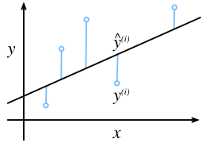

举一个实际的例子： 我们希望根据**房屋的面积（平方英尺）和房龄（年）**来估算**房屋价格（美元）**。 为了开发一个能预测房价的模型，我们需要收集一个真实的数据集。 这个数据集包括了房屋的销售价格、面积和房龄。 

在每行数据（比如一次房屋交易相对应的数据）称为*样本*（sample）。 我们把试图预测的目标（比如预测房屋价格）称为*标签*（label）。


线性回归假设目标可以表示为特征的线性组合：
$$
\mathrm{price} = w_{\mathrm{area}} \cdot \mathrm{area} + w_{\mathrm{age}} \cdot \mathrm{age} + b.
$$
我们的目标是寻找模型的权重$w$和偏置$b$， 使得根据模型做出的预测大体符合数据里的真实价格

而在机器学习领域，我们通常使用的是高维数据集，当我们的输入包含d个特征时，我们将预测结果$$\hat{y}$$表示为：

$$
\hat{y} = w_1  x_1 + ... + w_d  x_d + b.
$$
在开始寻找最好的*模型参数*$w$和$b$之前， 我们还需要两个东西： 

1. 一种模型质量的**度量方式（损失函数）**；
2. 一种能够更新模型以**提高模型预测质量**的方法。


#### 损失函数

*损失函数*（loss function）能够量化目标的***实际值*与*预测值***之间的差距。 通常我们会选择非负数作为损失，且数值越小表示损失越小，完美预测时的损失为0。**回归问题**中最常用的损失函数是平方误差函数。
$$
l^{(i)}(\mathbf{w}, b) = \frac{1}{2} \left(\hat{y}^{(i)} - y^{(i)}\right)^2.
$$
$$\frac{1}{2}$$并不会带来本质上的区别，只是为了求导简单

**均方误差不能用于分类**


我们需要计算在训练集n个样本上的损失均值：
$$
L(\mathbf{w}, b) =\frac{1}{n}\sum_{i=1}^n l^{(i)}(\mathbf{w}, b) =\frac{1}{n} \sum_{i=1}^n \frac{1}{2}\left(\mathbf{w}^\top \mathbf{x}^{(i)} + b - y^{(i)}\right)^2.
$$


#### 从线性回归到深度网络

到目前为止，我们只谈论了线性模型。尽管神经网络涵盖了更多更为丰富的模型，我们依然可以用描述神经网络的方式来描述线性模型，从而把线性模型看作一个神经网络。首先，我们用“层”符号来重写这个模型。

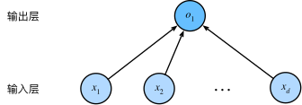

- 该图只显示连接模式，即只显示每个输入如何连接到输出，隐去了权重和偏置的值
- 输入为$x_1, \ldots, x_d$，因此输入层中的*输入数*（或称为*特征维度*）为d
- 输出维度为1
- 由于神经网络主要考虑的是计算，所以一般输入层不算入层数
- 我们可以将线性回归模型视为仅由单个人工神经元组成的神经网络，或称为单层神经网络
- 对于这种输入和输出的每个节点都相连的层，我们一般称为**全连接层或稠密层**


### softmax回归

当我们做分类问题的时候，我们需要将输出的概率（连续）得到我们认为的类别（离散）

#### 分类问题的标签设置

- 如果类别间有一些自然顺序， 比如说我们试图预测${婴儿,儿童,青少年,青年人,中年人,老年人}$， 那么将这个问题转变为**回归问题**，并且保留标签分别为1，2，3，...是有意义的

- 但是大多数分类都没有自然顺序，假设对于图像分类，我们有**猫、狗和鸡三类**

- 统计学家很早以前就发明了一种表示分类数据的简单方法：***独热编码*（one-hot encoding）**
  -  在我们的例子中，标签$y$将是一个三维向量， 其中(1,0,0)对应于“猫”、(0,1,0)对应于“鸡”、(0,0,1)对应于“狗”：


#### 网络架构

依然假设是分类**猫、狗和鸡**问题，我们需要分别计算这张图片可能是猫狗鸡的概率，所以我们要算三个概率

我们需要一个有多个输出的模型，每个类别对应一个输出

假设我们的图片只有四个像素$x_1到x_4$

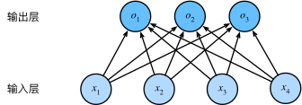

与线性回归一样，softmax回归也是一个单层神经网络，softmax回归的输出层也是全连接层。
$$
\begin{split}\begin{aligned}
o_1 &= x_1 w_{11} + x_2 w_{12} + x_3 w_{13} + x_4 w_{14} + b_1,\\
o_2 &= x_1 w_{21} + x_2 w_{22} + x_3 w_{23} + x_4 w_{24} + b_2,\\
o_3 &= x_1 w_{31} + x_2 w_{32} + x_3 w_{33} + x_4 w_{34} + b_3.
\end{aligned}\end{split}
$$


#### softmax运算

现在经过上面三个公式（等于是三个单独的线性回归）的计算，我们已经得到了三个数；为了得到最后预测结果是啥，我们选择最大概率的标签为预测结果。

假设输出为0.1，0.8，0.1，那么我们预测的类别就是2（鸡）

我们能否直接使用单个线性回归的结果作为这个输出呢？显然是否定的！输入可能为负，也可能大于1


那我们需要规范化输出，让模型给出的对应标签的数值，就是这个标签的概率，所以需要找到一个函数满足以下要求：

1. 输出非负
2. 所有标签结果的和为1

现在常用的就是softmax函数：

把输入映射为0-1之间的实数，并且归一化保证和为1，因此多分类的概率也为1

$$
\hat{\mathbf{y}} = \mathrm{softmax}(\mathbf{o})\quad \text{其中}\quad \hat{y}_j = \frac{\exp(o_j)}{\sum_k \exp(o_k)}
$$
虽然softmax是一个非线性函数，但由于输出依然由输入特征的放射变换组成，因此softmax回归仍然是一个线性模型，运算不会改变预测o之间的大小顺序，只会确定分配给每个类别的概率


#### 损失函数

如何定义分类问题的损失函数？均方误差肯定不行

我们需要找到一个函数去分析这个模型预测正确的比例

softmax函数给出了一个向量$\hat{\mathbf{y}}$， 我们可以将其视为“对给定任意输入x的每个类的条件概率”

$P(y=\text{猫} \mid \mathbf{x})$指的是输入为$x$的时候，输出为猫的概率；

我们可以表示出对于每个数据$x$预测正确的概率：$P(\mathbf{y}^{(i)} \mid \mathbf{x}^{(i)})$

那对于整个数据集的预测正确的概率就是将每个样本预测正确的概率相乘：
$$
P(\mathbf{Y} \mid \mathbf{X}) = \prod_{i=1}^n P(\mathbf{y}^{(i)} \mid \mathbf{x}^{(i)}).
$$
我们最大化$P(\mathbf{Y} \mid \mathbf{X})$，相当于最小化负对数似然：
$$
-\log P(\mathbf{Y} \mid \mathbf{X}) = \sum_{i=1}^n -\log P(\mathbf{y}^{(i)} \mid \mathbf{x}^{(i)})
= \sum_{i=1}^n l(\mathbf{y}^{(i)}, \hat{\mathbf{y}}^{(i)}),
$$
损失函数定义为：
$$
l(\mathbf{y}, \hat{\mathbf{y}}) = - \sum_{j=1}^q y_j \log \hat{y}_j.
$$
所有预测正确项的积，然后对其求负对数，相乘一定是小于1的数，求负对数一定大于0

这种方法被称为**交叉熵损失**


### 常见数据集

有一些标准数据集可以用于评估一个模型的好坏，一个标准数据集是需要经过严格的测试才可以成为的

比如pytorch框架提供的数据集有：

用于image classification：

手写字符识别：EMNIST、**MNIST**、QMNIST、USPS、SVHN、KMNIST、Omniglot

实物分类：**Fashion MNIST**、CIFAR、LSUN、SLT-10、ImageNet

人脸识别：CelebA

场景分类：LSUN、Places365

用于object detection：SVHN、VOCDetection、**COCODetection**

用于semantic/instance segmentation：

语义分割：Cityscapes、VOCSegmentation

语义边界：SBD

用于image captioning：Flickr、COCOCaption

用于video classification：HMDB51、Kinetics

用于3D reconstruction：PhotoTour

用于shadow detectors：SBU


作业：使用 pytorch 搭建线性神经网络or多层感知机or卷积神经网络网络，训练Fashion MNIST数据集，可以参考《动手学深度学习》，要求提交ipython格式文件，包含训练的结果和超参数


## 梯度下降

不是所有的模型的损失函数都能够求解析解，而**梯度下降方法几乎可以优化所有的深度学习模型**，梯度下降是深度学习的本质

### 梯度下降的基本思想

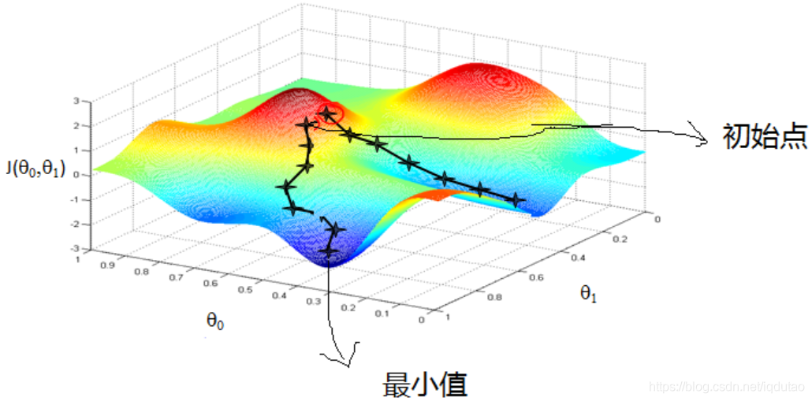

每走一段路，测出最抖的方向，然后接着走。

它通过不断地在损失函数递减的方向上更新参数来降低误差。

确定优化目标

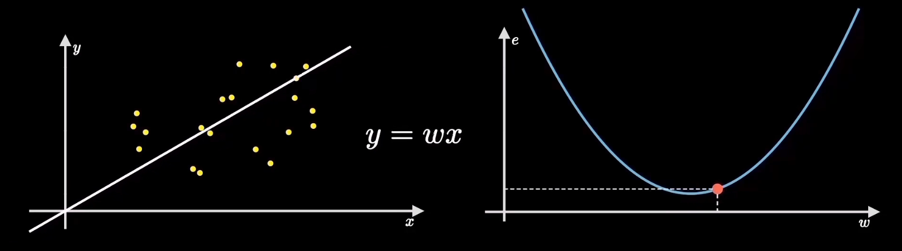

机器学习的目标是找到使得损失函数最小化的参数，找到这个点的过程就是梯度下降

直觉告诉我们，沿着陡峭最大的方向走，就能更快找到最低点


### 走多快？

- 固定一个数值
- 按照梯度大小
- 按照梯度大小乘上一个很小系数

这个系数被称为学习率

$新w=旧w-斜率\times学习率$


重复计算梯度和按照学习率方向前进，这就是所谓的梯度下降法

### 实际情况

上面描述的损失函数仅仅只是最简单的一个理想情况，实际情况是目标函数通常有许多局部最优解，我们的目标是找到全局最优点而不是局部最优点，但是这往往很难做到，现在的算法也大多是在**优化计算梯度方法和动态控制学习率大小**


### 深度学习中的优化挑战

- 训练集的最低损失可能和所有数据的最低损失不同


- 局部最小点

- 鞍点

  *鞍点*（saddle point）是指函数的所有梯度都消失但既不是全局最小值也不是局部最小值的任何位置。考虑这个函数$$f(x) = x^3$$。它的一阶和二阶导数$$x=0$$在时消失。这时优化可能会停止，尽管它不是最小值。

  对于高维度问题，*部分*特征值为负的可能性相当高。这使得鞍点比局部最小值更有可能出现。


- 梯度消失

  开始训练时梯度就接近0，因此训练会停滞很长一段时间，重参数化通常会有所帮助。对参数进行良好的初始化也可能是有益的。


如果找不到全局最优解其实也没关系，局部最优解或者近似解也能用。


### 不同的优化算法

批量随机梯度下降

随机梯度下降

小批量随机梯度下降

AdaGrad-动态学习率

RMSProp-优化动态学习率

AdaDelta-无需设置学习率

Adam-融合RMSProp和AdaDelta


为了增加速度，我们每次选取固定数量的样本（batch），然后，我们计算小批量的平均损失关于模型参数的导数

> 算法的步骤如下： 
>
> （1）初始化模型参数的值，如随机初始化； 
>
> （2）从数据集中随机抽取小批量样本且在负梯度的方向上更新参数，并不断迭代这一步骤。

$$
\begin{split}\begin{aligned} \mathbf{w} &\leftarrow \mathbf{w} -   \frac{\eta}{|\mathcal{B}|} \sum_{i \in \mathcal{B}} \partial_{\mathbf{w}} l^{(i)}(\mathbf{w}, b) = \mathbf{w} - \frac{\eta}{|\mathcal{B}|} \sum_{i \in \mathcal{B}} \mathbf{x}^{(i)} \left(\mathbf{w}^\top \mathbf{x}^{(i)} + b - y^{(i)}\right),\\ b &\leftarrow b -  \frac{\eta}{|\mathcal{B}|} \sum_{i \in \mathcal{B}} \partial_b l^{(i)}(\mathbf{w}, b)  = b - \frac{\eta}{|\mathcal{B}|} \sum_{i \in \mathcal{B}} \left(\mathbf{w}^\top \mathbf{x}^{(i)} + b - y^{(i)}\right). \end{aligned}\end{split}
$$

 |B|表示每个小批量中的样本数，这也称为*批量大小*（batch size）。 $$\eta$$表示*学习率*（learning rate）。 批量大小和学习率的值通常是手动预先指定，而不是通过模型训练得到的。 这些可以调整但不在训练过程中更新的参数称为*超参数*（hyperparameter）。 *调参*（hyperparameter tuning）是**选择超参数**的过程。 超参数通常是我们根据训练迭代结果来调整的， 而训练迭代结果是在独立的*验证数据集*（validation dataset）上评估得到的。


## 多层感知机

在上面的线性神经网络中我们了解很多深度学习的概念，那现在我们要深入对于深度神经网络的探索


### 隐藏层

在线性网络中我们描述了**仿射变换**，这在深度学习种是一种线性变换，然后使用softmax函数规范输出，如果我们的输入输出满足线性关系，那么这样就足够了，但是**线性**是一个很强的假设；线性模型是很容易出错的，因为我们无法保证线性相关的关系

举例：

1. 我们尝试预测一个人是否会还贷，我们可以认为，在其他条件不变的情况下， 收入较高的申请人比收入较低的申请人更有可能偿还贷款。 但是，虽然收入与还款概率存在单调性，但它们不是线性相关的。 收入从0增加到5万，可能比从100万增加到105万带来更大的还款可能性。
2. 我们想要根据体温预测死亡率。 对体温高于37摄氏度的人来说，温度越高风险越大。 然而，对体温低于37摄氏度的人来说，温度越高风险就越低。


我们可以通过在网络中加入一个或多个隐藏层来克服线性模型的限制，使其能处理更普遍的函数关系类型。最简单的方法就是将多个**全连接层**连接到一起，这种架构通常称为*多层感知机*（multilayer perceptron），通常缩写为*MLP*。

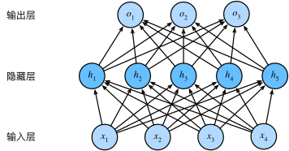


- 这是一个两层的网络
- 全连接层的开销非常大，需要权衡性能和参数规模


仿射变换=权重*参数+偏置

**仿射变换的组合还是仿射变换**

那么这个模型还是线性的，依然没有解决上述线性模型表达能力弱的问题，我们需要有一个函数使他变成非线性的：**激活函数**

如果没有激活函数，那么每个隐藏层仅仅只是一个仿射函数，与线性模型并无区别，为了避免多层感知机模型退化成线性模型，我们需要引入激活函数


#### 激活函数

*激活函数*判断经过仿射变换后，这个神经元是否应该被激活（类似于神经细胞接收到足够的刺激，释放化学物质）

目前最**受欢迎**的激活函数：ReLU(*修正线性单元*（Rectified linear unit，*ReLU*）)
$$
\operatorname{ReLU}(x) = \max(x, 0).
$$
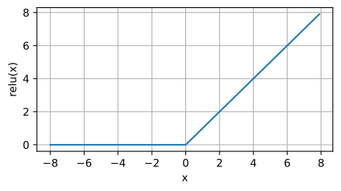

why：简单好用，效果好

当输入为负时，ReLU函数的导数为0，而当输入为正时，ReLU函数的导数为1。注意，当输入值精确等于0时，ReLU函数不可导。在此时，我们默认使用左侧的导数，即当输入为0时导数为0。但我们可以忽略这个问题，在工程实际中，几乎是永远不可能为0的

导数图：

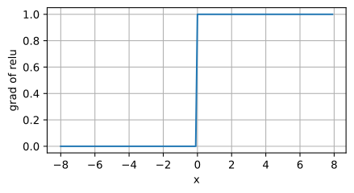

减轻了梯度消失的问题

PS: ReLU函数有许多变体


**sigmoid**

*sigmoid函数*将输入变换为区间(0, 1)上的输出。 因此，sigmoid通常称为*挤压函数*（squashing function）： 它将范围（-inf, inf）中的任意输入压缩到区间（0, 1）中的某个值：
$$
\operatorname{sigmoid}(x) = \frac{1}{1 + \exp(-x)}.
$$
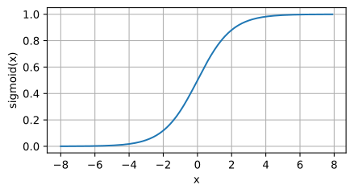

RuLU提出以前最常用的激活函数，现在已经逐渐被取代


### 模型的选择、欠拟合和过拟合

我们希望模型在我们没有训练过的数据上也取得很好的效果，而不是只在训练集上有很好的效果。


将模型在训练数据上拟合的比在潜在分布中更接近的现象称为*过拟合*（overfitting），用于对抗过拟合的技术称为*正则化*（regularization）

模型最终可以在训练集上达到完美的精度，此时测试集的准确性却下降了。


*训练误差*（training error）是指，模型在训练数据集上计算得到的误差。 *泛化误差*（generalization error）是指，模型应用在同样从原始样本的分布中抽取的无限多数据样本时，模型误差的期望。


### 暂退法(Dropout)

在计算后续层之前向网络的每一层注入噪声, 因为当训练一个有多层的深层网络时，注入噪声只会在输入-输出映射上增强平滑性。

标准暂退法包括在计算下一层之前将当前层中的一些节点置零

如何注入噪声：*无偏性*
在标准暂退法正则化中，通过按保留（未丢弃）的节点的分数$$h$$进行规范化来消除每一层的偏差。 换言之，每个中间活性值以暂退概率$$p$$由随机变量$$h^`$$替换，如下所示：
$$
\begin{split}\begin{aligned}
h' =
\begin{cases}
    0 & \text{ 概率为 } p \\
    \frac{h}{1-p} & \text{ 其他情况}
\end{cases}
\end{aligned}\end{split}
$$
通过这种方式我们可以保证模型的期望值不变，即$$E[h^{'}]=h$$

通常在**测试的过程中**，我们不用暂退法，我们不会丢弃任何节点

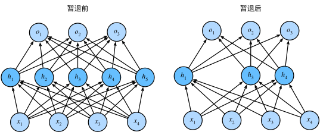


## 卷积神经网络

比如现在常见的视频分辨率1980*1080，图片达到百万级像素时候，如果使用全连接层，则意味着我们需要使用百万级的输入单元，那么开销会大到难以接受，所以多层感知机、全连接层变得不可用

为图像中本就拥有丰富的结构，而这些结构可以被人类和机器学习模型使用


### 不变性

假设我们需要从图片找到一个物体，合理的假设是：

- 无论哪种方法找到这个物体，都应该和物体在图像中的位置无关；

- 可行的一个方案是：将图像分割成多个区域，然后对每个区域有可能的概率打分


如果将上述思维转换为计算机视觉的神经网络框架：

- 平移不变性（translation invariance）：不管检测对象出现在图像中的哪个位置，神经网络的前面几层应该对相同的图像区域具有相似的反应，即为“平移不变性”。
- 局部性（locality）：神经网络的前面几层应该只探索输入图像中的局部区域，而不过度在意图像中相隔较远区域的关系，这就是“局部性”原则。最终，可以聚合这些局部特征，以在整个图像级别进行预测。


### 图像卷积

在数学中，两个函数之间的“卷积”被定义为：
$$
(f * g)(\mathbf{x}) = \int f(\mathbf{z}) g(\mathbf{x}-\mathbf{z}) d\mathbf{z}.
$$
卷积层所表达的运算其实是*互相关运算*，而不是卷积运算，在卷积层中，输入**张量和核张量**通过互相关运算产生输出张量。结果是将对应位相乘并求和

**张量**可以看作是一个多维数组


#### 互相关和卷积

卷积=矩阵乘法

卷积层可能执行严格的卷积运算或者互相关运算，如果执行的是严格的卷积运算，我们需要的就是垂直和水平翻转卷积核，然后对输入张量执行互相关运算

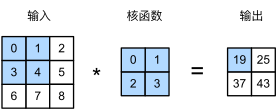

二维互相关运算：$0\times0+1\times1+3\times2+4\times3=19$

所以，输出大小等于输入大小$n_h \times n_w$减去卷积核大小$k_h \times k_w$，即：

$$
(n_h-k_h+1) \times (n_w-k_w+1).
$$
这是因为我们需要足够的空间在图像上“移动”卷积核。所以为了避免丢失边缘像素，我们常常使用小卷积核

卷积层当中也有偏置项，偏置项和卷积核内的参数都是需要训练的


### 填充和步幅

对于任何单个卷积，我们可能只会丢失几个像素。 但随着我们应用许多连续卷积层，累积丢失的像素数就多了。 解决这个问题的简单方法即为*填充*（padding）

填充：在输入图像的边界填充元素（通常填充元素是0）


通常，如果我们添加$p_h$行填充（大约一半在顶部，一半在底部）和$p_w$列填充（左侧大约一半，右侧一半），则输出形状将为
$$
(n_h-k_h+p_h+1)\times(n_w-k_w+p_w+1)。
$$
通常设置：$p_h=k_h-1$，为了保证$p_h$是一个整数，我们通常让$k_h$为奇数


步幅：每次滑动元素的数量$$n:输入 \qquad k:卷积核  \qquad p:填充  \qquad s:步长$$
$$
\lfloor(n_h-k_h+p_h+s_h)/s_h\rfloor \times \lfloor(n_w-k_w+p_w+s_w)/s_w\rfloor.
$$

```python
nn.Conv2D(1, kernel_size=3, padding=1) #二维卷积
```


### 多输入多输出通道

到目前为止，我们仅展示了单个输入和单个输出通道的简化例子。 这使得我们可以将输入、卷积核和输出看作二维张量。

当引入RGB图像的通道时，每个RGB输入图像具有$$3×ℎ×w$$的形状。我们将这个大小为3的轴称为*通道*（channel）维度


#### 多输入通道

> 当输入包含多个通道时，需要构造一个**与输入数据具有相同输入通道数**的卷积核，以便与输入数据进行互相关运算

**输入的通道数=卷积核的输入通道数**

运算方法：每个通道输入的二维张量和卷积核的二维张量进行互相关运算，再对通道求和（将结果相加）得到二维张量


#### 多输出通道

到目前为止，不论有多少输入通道，我们还只有一个输出通道。

在最流行的神经网络架构中，随着神经网络层数的加深，我们常会**增加输出通道的维数**，通过减少空间分辨率以获得更大的通道深度。直观地说，我们可以将每个通道看作对**不同特征**的响应。


用$$c_i$$和$$c_o$$分别表示输入和输出通道的数目，并让$$k_h$$和$$k_w$$为卷积核的高度和宽度。为了获得多个通道的输出，我们可以为每个输出通道创建一个形状为$$c_i\times k_h \times k_w$$的卷积核张量，这样卷积核的形状是$$c_i\times c_o \times k_h  \times k_h$$。在互相关运算中，每个输出通道先获取所有输入通道，再以对应该输出通道的卷积核计算出结果。


#### $$1\times 1$$卷积层

$1\times 1$卷积核丧失了影响高度和宽度的能力，但是它可以影响通道数

我们可以将1×1卷积层看作在每个像素位置应用的全连接层，以$$c_i$$个输入值转换为$$c_o$$个输出值。 因为这仍然是一个卷积层，所以跨像素的权重是一致的。

- 当以每像素为基础应用时，1×1卷积层相当于全连接层。
- 1×1卷积层通常用于调整网络层的通道数量和控制模型复杂性。


总结作用：

1. 改变模型的通道数
2. 在卷积层后会使用激活函数，增加了模型的非线性


### 池化层（汇聚层）

汇聚(pooling)：它具有双重目的：**降低卷积层对位置的敏感性**，同时**降低对空间降采样表示的敏感性**。

常用：maximum pooling and average pooling

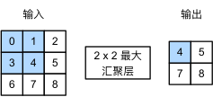

默认情况下，深度学习框架中的步幅与汇聚窗口大小相等

同样的，汇聚层也有填充和步幅


#### 多个通道

与卷积层不同的是，汇聚层在每一个通道上单独运算，不像卷积层一样对输入进行汇总。所以汇聚层的输入通道数和输出通道数相等


## 深度学习环境

**独立显卡驱动**：ubuntu下请使用 update manager 安装驱动，中文论坛上一堆使用命令行去安装驱动都是害人！！

https://www.cyberciti.biz/faq/ubuntu-linux-install-nvidia-driver-latest-proprietary-driver/

安装成功后在终端使用 nvidia-smi 可以看到GPU信息，看到就算安装成功

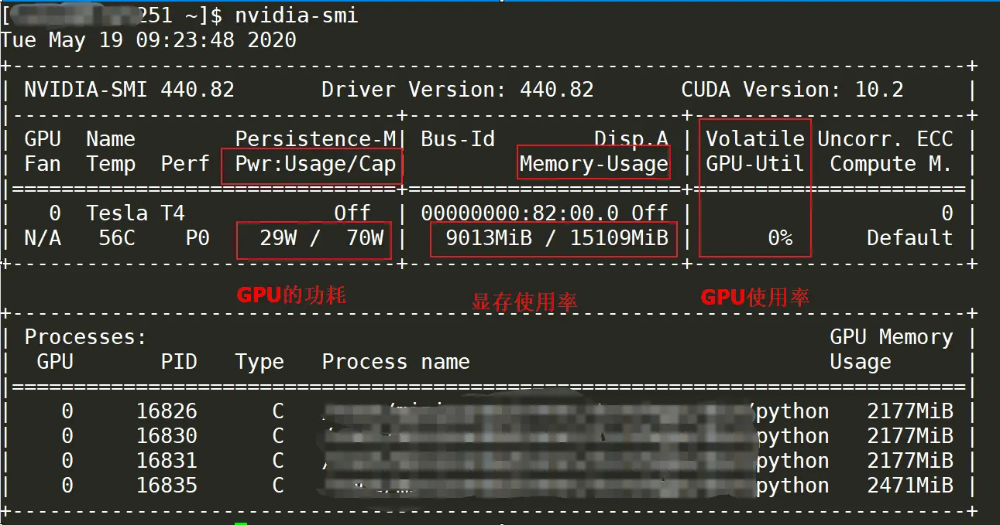

[nvidia-smi命令详解](https://www.jianshu.com/p/ceb3c020e06b)

GPU **乱安装的话会导致桌面无法显示**，**谨慎操作**


**CUDA**：英伟达NVIDIA推出的运算平台

不要装最新的，最新的和后面 pytorch 可能不兼容之类的，建议装个11.8就行了

[显卡驱动版本与CUDA兼容情况](https://blog.csdn.net/mouse1598189/article/details/86695400)

11.8网站：https://developer.nvidia.com/cuda-11-8-0-download-archive

**不要下载deb格式的，下载runfile！！！！**

Cuda的一个安装教程：https://yinguobing.com/install-cuda11-with-runfile/

安装成功后在终端使用 nvcc --version 可以看到GPU信息，看到就算安装成功


**CUDNN**：CUDA深度学习框架

下载网址：https://developer.nvidia.com/rdp/cudnn-download

以头文件格式保存的，只需要复制到我们cuda的路径里去就行了

```
将下载的 cuDNN Library for Linux (x86_64) 解压，复制解压出来的文件复制到安装好的CUDA环境中
 
将cuda/include/cudnn.h文件复制到usr/local/cuda/include文件夹
>>> sudo cp cuda/include/cudnn.h /usr/local/cuda/include
 
将cuda/lib64/下所有文件复制到/usr/local/cuda/lib64文件夹中
>>> sudo cp cuda/lib64/libcudnn* /usr/local/cuda/lib64
 
添加读取权限
>>> sudo chmod a+r /usr/local/cuda/include/cudnn.h /usr/local/cuda/lib64/libcudnn*
```


**Anaconda**：python包管理虚拟环境（可装可不装）

官网：https://zhuanlan.zhihu.com/p/459607806

可以参考的国内教程：https://zhuanlan.zhihu.com/p/459607806

官网安装教程：https://docs.anaconda.com/free/anaconda/install/linux/


**pytorch**：深度学习框架

在国内直接下载大概率下载的不是和你的cuda和显卡驱动匹配的版本

torch版本大全：https://download.pytorch.org/whl/torch_stable.html

`pip install *.whl`


torch.cuda.is_available()
