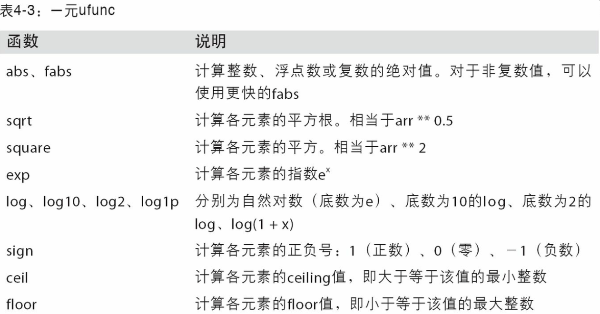
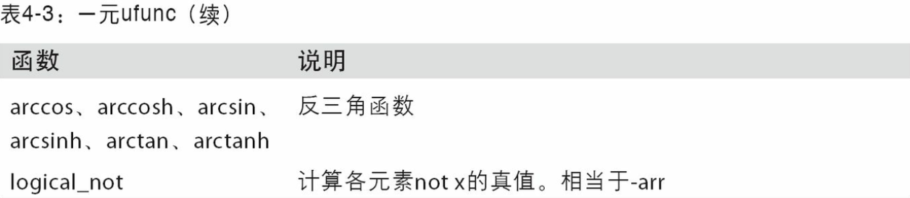
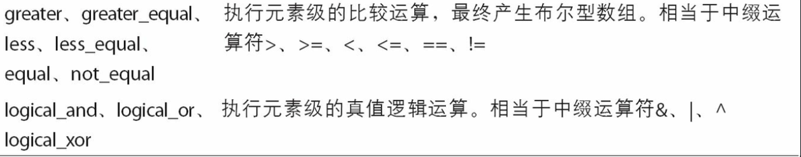

### Numpy

- 速度快
- 可以和c互通

#### ndarray

> NumPy最重要的一个特点就是其N维数组对象（即ndarray），该对象是一个快速而灵活的大数据集容器。你可以利用这种数组对整块数据执行一些数学运算，其语法跟标量元素之间的运算一样。

> ndarray是一个通用的同构数据多维容器，也就是说，其中的所有元素必须是相同类型的。每个数组都有一个shape（一个表示各维度大小的元组）和一个dtype（一个用于说明数组数据类型的对象）

##### 创建ndarray

1. 使用array数组，接受一切序列化对象

   ```python
   In [19]: data1 = [6, 7.5, 8, 0, 1]
   
   In [20]: arr1 = np.array(data1)
   ```

2. 用嵌套序列

2. 使用zeros和ones分别创建指定长度或者形状的全0或全1数组


##### Numpy数组的运算

1. 大小相等的数组之间的运算会运用到元素级
2. 标量运算会作用到每个元素
3. 比较会产生布尔值


##### 切片和索引

> 如上所示，当你将一个标量值赋值给一个切片时（如arr[5:8]=12），该值会自动传播（也就说后面将会讲到的“广播”）到整个选区。跟列表最重要的区别在于，数组切片是原始数组的视图。这意味着数据不会被复制，视图上的任何修改都会直接反映到源数组上。

如果确实需要一份副本而非视图，可以使用`arr[5:8].copy()`


布尔型数组需要用& |来表示和 或

通过布尔型选中的数组中的数据，总是会创建数据的副本，即使一模一样也是


##### 转置和轴对换

转置是重塑的一种特殊形式

返回的是视图

**高维的数组需要由轴编号组成的元组**

```python
In [132]: arr = np.arange(16).reshape((2, 2, 4))

In [133]: arr
Out[133]: 
array([[[ 0,  1,  2,  3],
        [ 4,  5,  6,  7]],
       [[ 8,  9, 10, 11],
        [12, 13, 14, 15]]])

In [134]: arr.transpose((1, 0, 2))
Out[134]: 
array([[[ 0,  1,  2,  3],
        [ 8,  9, 10, 11]],
       [[ 4,  5,  6,  7],
        [12, 13, 14, 15]]])
```

`swapaxes`方法，接受轴编号转置，返回的也是视图


#### 通用函数：快速的元素级数组函数










##### 数组中的三元表达式

##### where

通过ture和数组来做三元判断


###  Pandas

#### 数据结构

#### Series

带索引的一维数组

主要功能：数据对齐，类似数据库中的join


##### DataFrame

> DataFrame是一个表格型的数据结构，它含有一组有序的列，每列可以是不同的值类型（数值、字符串、布尔值等）。DataFrame既有行索引也有列索引，它可以被看做由Series组成的字典（共用同一个索引）。DataFrame中的数据是以一个或多个二维块存放的（而不是列表、字典或别的一维数据结构）。

建表方法：传入一个等长的列表或Numpy数组组成的字典

```python
data = {'state': ['Ohio', 'Ohio', 'Ohio', 'Nevada', 'Nevada', 'Nevada'],
        'year': [2000, 2001, 2002, 2001, 2002, 2003],
        'pop': [1.5, 1.7, 3.6, 2.4, 2.9, 3.2]}
frame = pd.DataFrame(data)
```

