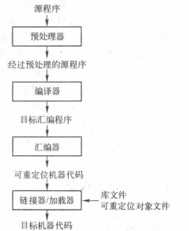
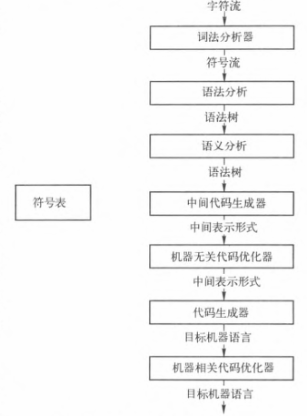
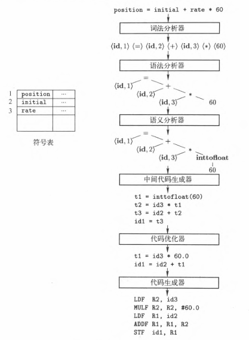

# 编译原理

## 引论

编译器：

- 是一个语言翻译程序
- 能够发现源程序中的错误
- 产生汇编语言，汇编语言比较易于调试和输出

解释器：

-  逐条翻译语句

汇编器：

- 生成可重定位的机器代码。

### 编译器的结构

- 分析部分
  - 把源程序分解成为多个组成要素，并在这些要素之上加上语法结构
  - 使用这个结构来创建该源程序的一个中间表示
  - 把信息存放在一个称为符号表(symbol table)的数据结构  中
- 综合部分
  - 根据中间表示和符号表中的信息来构造用户期待的目标程序。

- 词法分析
  - 读入组成源程序的字符流，并且将它们组织成为有意义的词素(lexeme)的序列。对于每个词素，词法分析器产生如下形式的词法单元(token)作为输出： 〈token-name, attribute-value)
  - 例如：`position = initial + rate + 60` => `<id, 1> < = > <id, 2> <*> < 60 >`

- 语法分析
  - 使用由词法分析器生成的各个词法单元的第一个分量来创建树形的中间表示。

- 语义分析
  - 使用语法树和符号表中的信息来检査源程序是否和语言定义的语义一致
  - **类型检查**
- 中间代码生成
  - 在把一个源程序翻译成目标代码的过程中，一个编译器可能构造出一个或多个中间表示。这些中间表示可以有多种形式
  - 中间代码的性质：它应该易于生成，且能够被轻松地翻译为目标机器上的语言

