## 计算机体系结构

**推荐书籍：**

计算机体系结构（第二版） 清华大学出版社

John L. Hennessy, David A. Patternson; Computer Architecture: A Quantitative Approach; sixth Edition. 

David A. Patternson, John L. Hennessy ; Computer Organization and Design- The Hardware/Software Interface; RISC-V Edition.

**参考书**：CSAPP

## 考试

不要被填空题堵住了，不会做先做大题

### 题型

- 十题
- 填空题20分
- 九大题80分 最小5分 最大12分

### 题目

- 第七章

  - 开关

- 第六章

  - 向量优化，向量处理方式，哪种方式适合

- 第五章（填空、计算）

  - 理解相关性，怎样处理相关性
  - 针对计算流水性能分析，流水线的时空图的基本计算指标 加速比 吞吐率 效率等
  - 看清楚题目，是不是一个多滚轮的，动态静态多功能看清楚
  - 做一个简单算法，哪个先算哪个后算
    - 相同功能的要尽可能一起算
    - 尽可能减少RAW去除

- 第四章

  - 输入输出的三种基本方式
    - 程序控制
    - 中断（中断处理重点：中断优先级）
  - iop处理问题 通道 最大流量跟什么有关（工作周期互为倒数）
  - 使用通道的基本条件，实际流量不能超过通道最大流量，
  - 判断哪些通道与设备是否能连接

- 第三章 I/O
  - 几个层次
    - 每个层次的目标，扩容or提速
  - 如何地址变换提速
  - 如何 cache 性能优化
    - 减低失效率，减少时效冲突，减少命中时间
    - 替换算法   页 块  
      - 堆栈型替换算法怎么用
- 第二章 指令系统
  - 指令基本构成
  - 寻址方式 确定选择使用什么方式
    - 选择方法：频度分析
    - 间接寻址、变址寻址 -> 扩充寻址空间；立即寻址
  - 指令格式优化  分别对操作码操作数进行优化
  - 标记 下一条指令在哪 PC
  - CRSC RISC，了解RISC经常使用的技术
- 第一章
  - 计算：计算性能处理衡量cpu：CPI，计算过程中间有小的转弯
  - 阿姆达尔定理（部分改进对整体的影响），
    - 单部件优化的改善
    - 多部件的优化
  - 设计原理
    - 局部性原理（时间 空间局部性）

## 一、系统结构

- 体系结构要做的事情：

  - 从设计者角度，分析和评价 **系统性能/价格**

    - 在分析和评价的基础上，进行系统结构的设计

    - 系统结构的分析、设计和优化是本课程的重点

- 计算机体系结构的定义：
  - 狭义观点：**软件设计者与硬件设计者之间的中间层，以及微体系，软件与硬件的接口**
  - 扩展观点：**算法层、语言层、系统软件层、ISA层、微体系结构、逻辑电路层**
- **计算机性能提高的原因：**

  - 科技：更多晶体管
  - 机器组织和实现
  - 更深的流水线 更多并行执行

### 计算机系统结构概念

#### 计算机系统结构

系统结构(System Architecture)是对计算机系统中各机器之间界面的划分和定义，以及对各级界面上、下的功能进行分配

$$系统效率=\min(器件速度)*\min(系统结构效率)$$

> **基本定义：程序员所看到的计算机的属性，即概念性结构和功能特性。**

透明性概念： 在计算机中，客观存在的事物或属性从某个角度看不到，称这些事物或属性对它是透明的。计算机重的“透明”与社会生活中的“透明”，含义正好相反。

#### 计算机多层结构

1. 六级层次结构

   - 应用语言机器 面向用户

   - 高级语言机器 面向用户

   - 汇编语言机器 面向用户

   - 操作系统机器 面向上层机器

   - 传统机器 面向上层机器

   - 微指令机器 面向上层机器
2. 层次结构的实现方式
   - 根据性价比，软硬件逻辑是等同的

#### 计算机分类方式:star::star:

**并行度与并行体系分类**：数据级并行  任务级并行

计算机通过以下方式开发这两类应用并行：

1. **指令集并行**在编译器帮助下，利用流水线思想适度开发数据级并行
2. **向量体系结构和图形处理器 (GPU)** 将单条指令并行应用于一个数据集
3. **线程级并行**在一种紧搞合硬件模型中开发数据级并行或任务级并行
4. 请求级并行在程序员或操作系统指定的大量去搞合任务之间开发并行

- **按处理机性能分类**

- 按大小分类：**巨型、大型、中型、小型、微型机**

- 按照性能和价格分

- 按用途分：科学计算、事务处理、实时控制、工作站、服务器、家用计算机等。
  - 个人移动设备
  - 桌面计算，强调性价比
  - 服务器，强调可用性、可缩放性
  - 集群/仓储级计算机（Clusters / Warehouse Scale Computers）
    - 每个数据中心包含10+万个处理器核
    - X86-ISA兼容的服务器芯片在市场上占统治地位
    - 专门的应用程序，加上虚拟机的云托管
    - 现在越来越多地使用gpu、fpga和定制硬件来加速工作负载
    - 强调可用性和性价比(availability、price-performance、energy)
  - 嵌入式计算机/物联网（Embedded Computers / Internet of Things）
    - 有线/无线网络基础设施，打印机
    - 消费类产品( TV/Music/Games/Automotive/Camera/MP3)
    - 物联网（Internet of Things!)
    - 强调价格、能耗及面向特定应用的性能

- 按数据类型分：定点计算机、浮点计算机、向量计算机、堆栈计算机等

- 按处理机个数和种类划分：单处理机，并行处理机、多处理机、分布处理机，关联处理机，超标量处理机, 超流水线处理机, VLIW处理机，SMP(对称多处理机)、MPP(大规模并行处理机)、机群(Cluster)系统等

- 按所使用的器件划分：电子管、晶体管、集成电路、大规模集成电路

- 按“并行级”和“流水线”分类：Händler表示法

  - 根据可并行和流水处理的程度，将硬件分成三个层次：

    - 程序控制部件（PCU）的个数k；
    - 算术逻辑部件（ALU）或处理部件（PE）的个数d；
    - 每个算逻部件包含基本逻辑线路（ECL）的套数w。

  - 每一个计算机系统都可以用上述三个参数表示其结构特征，即：

    ​             t（系统型号）=（k，d，w）。

  - 为了更细致的反映结构特殊性，表示式可写成：

    ​              t（系统型号）=（k×k’，d×d’，w×w’），

  - 其中：k’表示宏流水线中程序控制部件的个数；
        d’表示指令流水线中算术逻辑部件的个数；
        w’表示操作流水线中基本逻辑线路的套数。

  - 各层次的数值越大越好。

- 按控制方式分类

  - 控制流方式：顺序执行 （冯·诺依曼型）
  - 数据流方式：操作数到位即可运算，无序执行
  - 规约方式：驱动方式与数据流相反，无序执行
  - 匹配方式：非数值型应用，主要对象为符号。
  - 对不同类型结构，并行程度越大越好。

- 按系统结构风格分类

  - 面向堆栈型、面向寄存器型、面向对象型等

##### 基于流（Flynn分类法）:star:

1. 模型中的重要概念

   指令流（Instruction Stream）：机器执行的指令序列；

   数据流（Data stream）：由指令处理的数据序列；

   多倍性（Multiplicity）：在系统最窄的部件上，处于同一执行阶段的指令和数据的最大可能个数。

2. 模型中的基本模块

   MM（Memory Module）：内存模块。

   PU（Process Unit）：处理单元

   CU（Control Unit）：控制单元

3. 按照指令流和数据流的多寡，Flynn将 CA 分成4种：

   1. **单指令流单数据流(SISD)**：一个CU从MM读取一个指令，并操控PU对MM操作
   2. **单指令流多数据流(SIMD)**：同一指令由多个使用不同数据流的处理器执行。开发数据级并行
   3. **多指令流单数据流(MISD)**:  目前为止，还没有这种类型的商用多处理器，但包含这种类型之后，这种简单的分类方式变得更完整。
   4. **多指令流多数据流(MIMD)**: 每个处理器都提取自己的指令，对自己的数据进行操作，它针对的是任务级并行。
   5. single program multiple data(SPMD)与single instruction multiple data(SIMD)都是可以处理多数据的，不同点是SIMD是从指令级上看的，这意味着SIMD处理的多数据是执行相同的操作，比如都执行加法。而SPMD是从程序级上看的，这意味着处理的多数据不一定是执行相同的操作，因为程序里面可以有分支等，即执行路径可以是多条。一句话，SIMD是多个数据执行相同的操作，SPMD是多个数据可以执行不同的操作也可以执行相同的操作。
   6. XIMD (variable instruction stream, multiple data stream) ： As an extension to the VLIW (Very Long Instruction Word) architecture, the XIMD can exploit all VLIW scheduling techniques but these do not take full advantage of the unique features of the XIMD
   7. 混合指令多数据(XIMD):所述XIMD计算系统可包括多个数据处理器，每个数据处理器代表单指令多数据(SIMD)计算系统的一条通道;其中，多个数据处理器被配置为使用第一主导通道执行指令，并在XIMD计算系统在执行程序期间遇到与第一主导通道不共享已取/未取状态的数据依赖指令时，分叉第二主导通道。

> 缺点：
>
> 1. 分类太粗
>
>    - 在SIMD中包括有多种处理机
>
>    - 对流水线处理机的划分不明确，
>
>    - 标量流水线为SISD，向量流水线为SIMD
>
>
> 2. 根本问题是把两个不同等级的功能并列对待     
>    - 数据流受指令流控制，造成MISD不存在
>
>
> 3. 非冯计算机的分类？其他新型计算机的分类

##### 库克分类法：按控制流和执行流分类:star:

(1)单指令流单执行流 (Single Instruction Single Executionstream, SISE) 典型的单处理机

(2)单指令流多执行流 (Single Instruction Multiple Executionstream, SIME)

- 多功能部件处理机、相联处理机、向量处理机、流水线处理机、超流水线处理机、超标量处理机、SIMD并行处理机

(3)多指令流单执行流 (Multiple Instruction Single Execution stream, MISE) 多道程序系统 

(4)多指令流多执行流 (Multiple Instruction Multiple Execution stream, MIME) 典型的多处理机

##### 冯氏分类法:star:

以最大并行度作为系统结构分类的标准，最大并行度的数值越大越好。

所谓最大并行度Pm是指一个系统在单位时间内能够处理的最多的二进制位数，显然这是一个完全由计算机硬件结构决定的参数。

- 字串位串（WSBS）：*n* = 1，*m* = 1。这是最早期全串行运算的计算机。

- 字并位串（WPBS）：*n* > 1，*m* = 1。这是传统的并行单处理机。

- 字串位并（WSBP）：*n* = 1，*m* > 1。每处理机只一位，但有许多个处理机字并行运用，如STARAN，MPP，DAP等。

- 字并位并（WPBP）：*n* > 1，*m* > 1。PEPE，ILLIAC Ⅳ，Cmmp等计算机属此类。

  ​         W – Word；B – Bit；S – Serial；P – Parallel

- 平均并行度

  - 如果在一个时钟周期$\Delta t_i$内实际处理的二进制位数为Pi，那么在T个时钟周期内的平均并行度Pa 就为：
    $$
    P_a=\left(\sum_{i=1}^T P_i\right) / T
    $$

  - 把平均并行度与最大并行度之比称为平均利用率，用μ表示为：
    $$
    \mu=P_a/P_m=\frac{\sum^T_{i=1}P_i}{T \bullet P_m}
    $$

### 系统结构设计

#### 计算机系统设计思路

1. **由上向下方法**：根据用户的要求，设计基本的命令、数据类型与格式等，然后再逐级往下设计，并考虑对上一级进行优化来实现

   - **适合于专用机的设计，从应用到实现级，周期几年。**

   - **缺点：当应用对象或范围变化时，效率急剧下降。**

   - **原因：软、硬件脱节，不能利用最新的软件技术。**

2. 由下向上方法：根据器件条件，先把微程序机器级及传统机器级研制出来，然后再配合不同的操作系统和编译系统软件，使应用人员根据所提供的条件来采用合适的算法满足相应的应用要求

   - 前提：硬件不能改变

   - 缺点：易形成软、硬脱节，软件不能获得最新硬件的支持，结果软件繁杂、效率低。

3. 从中间开始方法：

   - 从软、硬件交界面开始设计。
   - 要求首先进行软、硬件功能分配，同时考虑硬件能为软件提供什么支持。

#### 系统结构的设计步骤

1. 需求分析

2. 需求说明

   主要包括设计准则、功能说明、器件性能说明等。

3. 概念性设计

   进行软、硬件功能分析，确定机器级界面。

4. 具体设计

   机器级界面各方面的确切定义，可考虑几种方案。

5. 反复优化设计及评价

设计需求的转变：

1. Power Wall：以前能源便宜，晶体管贵；现在晶体管便宜，能源贵
2. ILP Wall：以前依靠编译器、架构创新来提高ILP (Out- of-order, speculation, VLIW)；现代利用ILP的好处变得越来越小
3. Memory Wall：以前乘法器慢，存储器速度快；现代相反
4. Power Wall + ILP Wall + Memory Wall = Brick Wall

#### 软硬件取舍原则

1. 现有软、硬件条件下，选择能提高**性价比**的方法；
2. 考虑到准备采用和可能采用的组成技术，所选方法能否尽量不限制组成和实现技术；
3. 不能仅从“硬”的角度去考虑如何便于应用组成技术的成果和发挥器件技术的进展，还应考虑所选方法能否从“软”的角度为编译和操作系统的实现，以至高级语言程序的设计提供更多更好的硬件支持。

硬件和软件在功能实现上是等效的，即一种功能可以由软件实现，也可以由硬件实现。在实现性能上是不等效的。软件实现的优点是设计容易、改进简单；硬件实现的优点是速度快。

### 计算机设计的定量原则

:star::star:常用的4个定量原理：

（1）以经常性事件为重点。在计算机系统的设计中， 对经常发生的情况，赋予它优先的处理权和资源使用权， 以得到更多的总体上的改进。

（2）Amdahl定律。加快某 部件执行速度所获得的系统性能加速比，受限于该部件在 系统中所占的重要性。

（3）CPU性能公式。执行一个程序所需的CPU时间 = IC ×CPI ×时钟周期时间。

（4）程序的局部性原理。程序在执行时所访问地址的分布不是随机的，而是相对地簇聚。

程序定位： • 把一个程序交给处理机运行，必须首先把这个程序的指令 和数据装入到主存储器中。一般情况下，程序所分配到的主存物理空间与程序本身的逻辑地址空间是不同的，把指令和数据中的逻辑地址(相对地址)转变成主存物理地址(绝对地址)的过程称为程序定位

- 使用抽象简化设计（表示层）
- 通过冗余实现可靠性；有了冗余，当中断发生时，系统仍能平稳运行
- 使用并行性：多处理器，磁盘，内存空，通道，多处理单元
- 性能方程

#### 如何使用并行性提高性能

- （超级）流水线
- 强大的指令
  - MD-technique：每次操作有多个数据操作数
  - MO-technique：每条指令执行多个操作
- 多指令问题
  - 单指令程序流
  - 多个流(或程序，或任务)

#### 局部性原则

- 一些重要的基本观察结果来自于程序的性质。
  - 程序在任何时刻都只能访问相对较小的地址空间。
- 局部性原则:程序倾向于重用它们最近使用过的数据和指令。
- 有两种不同类型的局部性
  - 时间局部性(局部性):如果一个道具被引用，它很快就会被再次引用(循环、重用等)。
  - 空间局部性(空间/位置中的局部性):如果一个项被引用，其地址彼此接近的项往往很快被引用(直线代码、数组访问等)。
- 根据一个程序过去的访问记录，我们可以相当准确地预测它在不久的将来会使用什么指令和数据。
- 一个程序将90%的执行时间花在10%的代码上

#### 专注于常见情况

- 更倾向于优化常见情况
  - 例如：指令提取和解码单元比乘法器使用频率更高，因此首先对其进行优化
  - 例如：如果数据库服务器有50个磁盘/处理器，存储可靠性高于系统可靠性，因此首先优化它明显有助于提高表现
  - 改善频繁事件，而不是罕见事件
- 频繁的情况通常比不频繁的情况更简单、更快地改善
  - 例如，当添加2个数字时溢出是罕见的，所以通过优化更常见的无溢出情况来提高性能
  - 可能会减慢溢出速度，但通过对正常情况的优化，整体性能有所提高
- 我们必须决定频繁的情况是什么，以及通过使情况更快可以提高多少性能=> Amdahl's Law

#### Amdahl's Law :star::star:

- Amdahl 定律定义了通过使用特定特性可以获得的性能提高
- 通过改进计算机的某些部件而获得的性能增益可以使用Amdahl定律来计算

$$
Speedup(E)=\frac{Execution\_Time\_Without\_Enhancement}{Execution\_Time\_With\_Enhancement}\\S_n=\frac{T_o}{T_n}=\frac{1}{(1-F_e)+\frac{F_e}{S_e}}
$$

其中：

$S_n$ —— 全局加速比；

$\mathrm{T_o} \longrightarrow $原执行时间(old) 一新执行时间(new)

$T_n$ —— 新执行时间

$S_e $ —— 被改进部分的局部加速比

$F_e $ —— 被改进部分原执行时间占原来总时间的百分比。

计算公式：改进之前程序运行总时间可写为: $T_o=T_o\left(1-F_e+F_e\right)$,改进之后由于其中部分操作加快, 总时间降为:

$T_n=T_o\left(1-F_e+\frac{F_e}{S_e}\right)$

根据加速比定义, 有: $S_n=\frac{T_o}{T_n}=\frac{1}{\left(1-F_e\right)+\frac{F_e}{S_e}}$

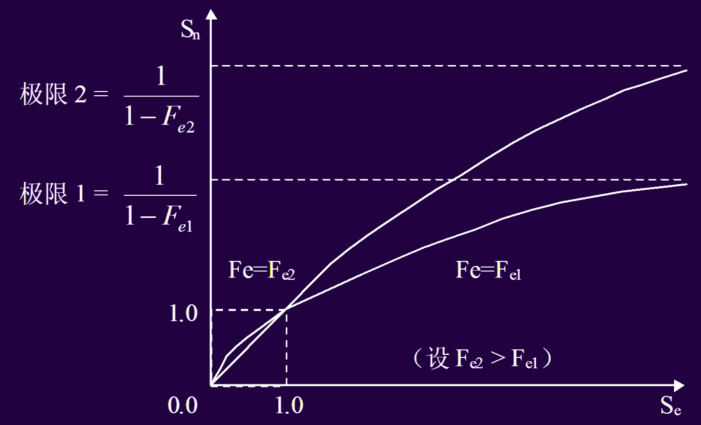

例题1：

例1-1：设改进后的某部件运行速度是原速度的10倍，而该部件原运行时间占全系统运行时间的比例为40%，那么此项改进会使全系统的性能得到多少提升？

解：按照Amdahl定律，系统性能的提升可以用加速比表示。据题意：Fe = 0.4；Re = 10，直接使用式（1-3），可得：

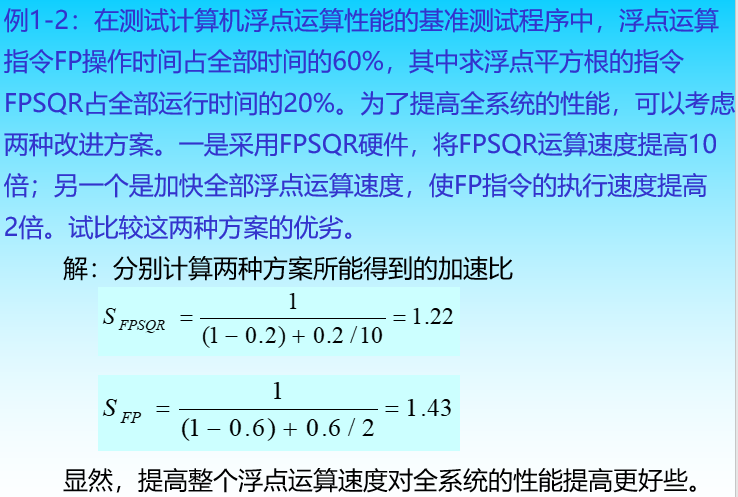

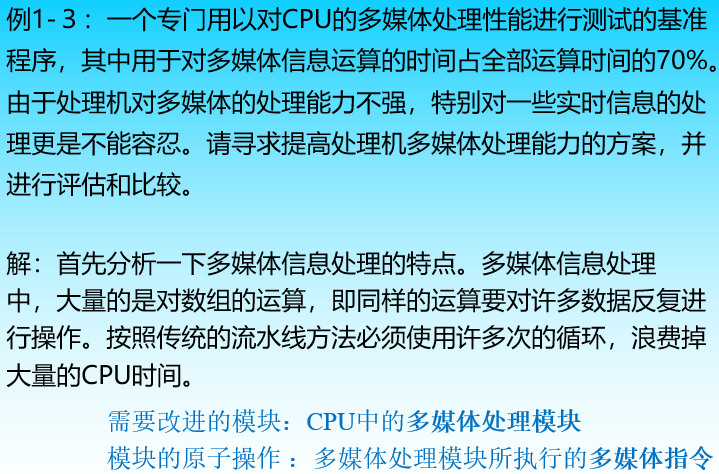

1. 提高CPU的时钟频率，即减少CPI

   实现困难

   实用的考虑：体系结构设计者所作的工作不是进行元件级别的设计，但是可以选择元件，如果市面上没有所要求的元件或者价格太贵，则应考虑放弃这种方案；

   除非有实现元件级别改进的配套设备，否则不应该考虑开发新的元件。

2. 将CPU的流水线条数增加为n条，在理想情况下其运行速度可以提高n倍

   与上面同样的理由，因为速度相差太大，需要增加的流水线数目也相当大。

   一方面会给工艺上带来极大的困难，甚至达到不可能制作的地步（体系结构受到元件发展的限制）。

   另一方面如果流水线条数太多，指令的分配和调度也会带来许多困难，使实际效果大打折扣（得不偿失）。

3. 设计专门的多媒体指令及处理硬件，大幅度提高同一条指令处理大量数据的能力。

#### CPU性能公式:star::star:

- 时钟频率
- 时钟周期=1/时钟频率

一个程序的CPU时间为：
$$
\text{CPU时间} = \text{指令数} \times \text{CPI} \times \text{时钟周期时间} =程序的CPU时钟周期\times时钟周期时间=ncycle*Tcycle\\
\text{CPU时间} = \frac{\text{指令数} \times \text{CPI}}{\text{时钟频率}}
$$
指令计数（IC）

CPI: 平均每个指令的时钟周期

CPU性能依赖于：时钟周期时间、CPI 和 IC，它们是独立的

抽象简化设计

善用并行性

可靠性法则：没有单点故障的设计。

数据和指令的重复性使用

### 计算机性能标准

#### 衡量计算机性能的主要标准

计算机性能：**正确性、可靠性和工作能力**

工作能力指标：

- 处理能力—单位时间内能处理的信息量(吞吐率)。
- 响应能力—响应时间、周转时间、排队时间。
- 利用率—T时间内，某部分被使用时间t与T的比值。

CPU的能力：

- 硬件连接能力（主要是指速度指标）
  - CPU通过在引脚上设置数据、地址和控制总线实现与外部电路的连接，这种能力的强弱常用数据**总线带宽**，即单位时间内传输的数据量来表示。这是一个速度指标
  - 地址总线的宽度可以衡量CPU支持的容量指标。
- 数据带宽
  - CPU 引脚中数据总线的宽度乘以总线传输速率得到数据带宽
  - 例如，数据总线的传输速率为266 MHz，总线的宽度为32位（4字节），那么该数据总线的带宽就达到2.1GB/s（266MHz×4B）。
  - 体系结构改善：提高总线传输速率、增加总线宽度，相应的增加成本。

- CPU与Cache连接方式
  - CPU在片内连接Cache比在片外连接Cache具有更高的速度指标
  - CPU与Cache之间的数据通道越多，则速度越快
  - 一级CACHE集成在CPU同一芯片内，二级一般也在CPU同一芯片内，有的在芯片外；有的CPU还提供专门通道连结第三级CACHE。
  - 体系结构改善：为CACHE设计足够宽的通道、尽量把Cache设计在CPU芯片内，但是这会相应增加制造难度和成本。

**管理能力**（可靠性、速度、容量、可扩展性、性能价格比）：

- 其中对存储器的管理、对多道作业的管理、中断管理及对多处理机工作的管理能力尤其值得关注。

- 可靠性：多道作业管理

- 速度：Cache寻址，中断管理
- 容量：虚拟存储器寻址
- 可扩展性：中断管理
- 性能价格比：操作系统中某些软件功能放在硬件中实现，提高系统整体的性能价格比。

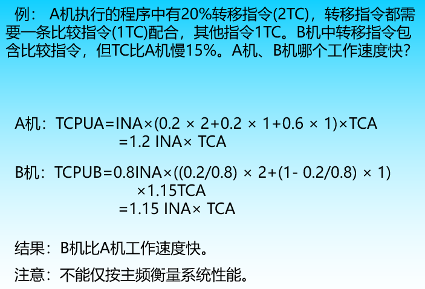

结论：

系统响应能力能反映计算机系统的软、硬件性能。不能仅用计算机主频衡量系统性能。

#### 系统处理能力

CPI的含义：以CPU为评估的模块，以指令系统中各条指令被执行的概率（频度）为依据，以平均每条指令所花费的时钟周期数标尺，对CPU的速度进行评估

CPI 不适合作为计算机系统整体的评估模块

可用的评价方式：基准测试，硬件，模拟，排队理论（分析模型），经验法则，基本“定律”/原则

##### MIPS和MFLOPS

- MIPS：每秒百万条指令数
  $$
  MIPS=\frac{指令条数}{执行时间\times 10^6}=\frac{时钟频率}{CPI\times 10^6}
  $$

- 缺点：

  - 只是反映了当前指令系统的前提条件下，指令执行的速度，不能反映指令的含金量，即不能反映指令系统本身的效率。
    - 例1：A系统1秒钟执行了100条指令，完成了应用程序TEST的全部功能，程序执行完毕；B系统1秒钟执行了1000条指令，完成了应用系统10%的功能，程序还没执行完。
    - 还不如直接使用应用程序总的执行时间来进行比较。
  - 没有考虑测试的全面性，如果没有一组用于测试的标准测试程序，那么该指标是没有可比性的。

- MFLOPS（Million Floating Point Operations Per Second），被称为每秒百万次浮点运算。
  $$
  MFLOPS=\frac{MIPS}{每次浮点运算所需指令条数}，主要用于评估向量计算机
  $$

- 

- MFLOPS与MIPS关系：1MFLOPS≈3MIPS。

##### 基准测试程序

基准测试程序通常可以分为两类：

（1）一类用于测试系统中所用的元部件，如CPU（针对指令系统测试）、硬盘（针对IO操作测试）等，

（2）另一类则用来对全系统的性能进行测试（针对程序测试）。

##### 利用率

应用：利用阿姆达尔定律和程序局部性原理改进来提高部件利用率。

#### 性能评价技术

目的：可用于开发中和开发后的系统评价

种类：分为分析、模拟和测量

1. 分析技术
   - 方法：在一定假设条件下，计算机系统参数与性能指标参数之间存在着某种函数关系，按其工作负载的驱动条件列出方程，用数学方法求解。
   - 近似求解算法：聚合法、均值分析法、扩散法等。
2. 模拟技术
   - 按被评价系统的运行特性建立系统模型；
   - 按系统可能有的工作负载特性建立工作负载模型；
3. 测量技术
   - 评估层次：有实际应用程序、核心程序、合成测试程序三个层次。但必须均为国际性组织认可的程序。
   - 性能评价结果有峰值性能和持续性能两种。

#### 多机系统性能评价

1. 性能加速比
   $$
   S(p,n)=\frac{T(p,1)}{T(p,n)+h(p,n)}
   $$
   P问题大小，n处理机数，h为通信开销

2. 性能可伸缩性

   定义：对一个给定的应用问题，系统性能随PE数增加而线性增长的性能

   影响因素：PE数，时钟频率，问题大小，求解时间等。

   评价方法：选择某参考机作为比较参照机，测量后得出性能可伸缩性值。

### 计算机系统结构的发展

- 体系结构发展历史
  - Minicomputers,Microprocessors
  - RISC vs CISC，VLIW 
- 体系结构发展机遇
  - Open Architectures 
  - Domain Specific Languages and Architecture
  - Agile Hardware Development
- 集成电路技术方面
  - 登纳德缩放比例定律的终结
    - 功耗成为关键制约条件
    - Stopped by threshold voltage
  - Moore定律的终结：晶体管的集成度提高延缓
    - 11 nm, 3 nm might be the limit

#### 冯·诺依曼机组系统结构的演变

**单处理器结构：**

1. 组成：由运算器、控制器、存储器、I/O设备组成

2. 特点 also called stored program computer

   - 采用存储程序原理

   - 指令串行执行，由控制器控制

   - 存储器按地址访问，是顺序的一维线性空间

   - 使用机器语言，数据以二进制表示

   - 单处理机结构，以运算器为中心

   - 输入输出设备与存储器之间的数据传送都途经运算器

3. 缺点
   - 两个瓶颈：CPU—存储器，指令串行执行
   - 机器语言与高级语言间语义差别较大
   - 复杂数据结构必须经过地址映象存放
4. 改良
   - 程序运行中不允许被修改
   - 采用先行控制、流水线等方法，开发并行性
   - 采用多体交叉存储器，增加存储带宽
   - 增加新的数据表示，进一步支持高级语言
   - 以存储器为核心，使I/O设备和CPU可并行工作

**总线结构：**

- 总线： 连接计算机各功能部件的连线和管理信息传输规则的逻辑电路称为总线。
- 特点：在任何时刻，只能有一个部件向总线上发送信息，可以有多个部件同时接收信息。
- 组成： 数据总线、地址总线、控制总线。

#### 非冯计算机的发展

- 从传统的指令驱动型改变为数据驱动型，出现了数据流机计算机
- 从传统的指令驱动型改变为需求驱动型，出现各种图归约计算机
- 处理非数值化信息的智能计算机，自然语言、声音、图形和图象处理,虚拟现实处理等
- 第五代计算机，由推理机和知识库机等组成。历经10年，召开过多次专题国际会议

#### 现代体系结构发展趋势：并行！！！

- 工艺发展的趋势

  - 芯片的集成度不断提高，但提升的速度在放缓
  - 时钟频率的提高在放缓，并有降低的趋势
- 体系结构的发展及机遇
  - 指令集并行受到制约
  - 线程级并行和数据级并行是发展的方向
  - 提高单处理器性能花费的代价呈现上升趋势
  - 面向特定领域的体系结构正蓬勃发展

### 系统结构中并行性

> :star:并行性概念：在同一时刻或同一时间间隔内完成两种或两种以上工作，只要在时间上相互重叠，均存在并行性。
>
> - 并行性：解题中具有可以同时进行运算或操作的特性。目的是为了能并行处理，提高解题效率。 
> - 广义并行性：只要在同一时刻或是在同一时间间隔内完成两种或两种以上性质相同或不同的工作， 在时间上能相互重叠，都称为并行性。
>
> 分类：
>
> - 同时性——指两个或多个事情在同一时刻发生的并行性
> - 并发性——指两个或多个事情在同一时间间隔内发生的并行性

#### 并行性等级

- 从执行角度分

  - 指令内部并行，即指令内部的微操作之间的并行；（硬件和组织的设计）

  - 指令间并行，即并行执行两条或多条指令（处理好指令间的关联  ILP）

  - 任务级或过程级并行，即并行执行两个或多个过程或任务（程序段 TLP）（任务分解）

  - 作业或程序级并行，即在多个作业或程序间的并行（并行算法）

- 从数据处理角度：位串字串  位并字串  位片串字并  全并行 

- 从信息加工角度 

  - 存贮器操作并行； 处理器操作步骤并行； 处理器操作并行；  指令、任务、作业并行

#### 提高并行性的技术途径:star::star:

- 时间重叠
  - 多个处理过程在时间上相互错开，轮流重叠使用同一套硬件的各个部件，以加快部件的周转而提高速度
  - 举例：流水线——分离、细化功能部件→流水线→功能不同的多机系统→异构型多处理机系统
- 资源重复
  - 以数量取胜原则，重复设置硬件资源以大幅度提高计算机系统的性能
- 资源共享
  - 利用软件方法，使多个用户分时使用同一个计算机系统。例如多道程序、分时系统就是资源共享的产物。它是提高计算机系统资源利用率的有效措施。 
  - 多道程序、分时OS →真正的处理机代替虚拟机→分布处理系统

#### 并行处理的发展

##### 单机系统中并行处理的发展

- 单处理机并行性开发的主要途径是**时间重叠**。
- 实现时间重叠的基础是**部件功能专用化**。
- 将一件工作按功能分割成若干联系的部分，每一部分有指定的专门部件来完成，然后按时间重叠的原则把各部分执行过程在时间上重叠起来，使所有部件依次分工完成一组同样工作。   

> 将若干台具有独立功能的处理机（或计算机）相互连接起来，在操作系统（或分布式操作系统）的控制下，统一协调的运行，这就是**分布式处理系统（distributed processing system）** 。
>
> 分时系统是以“集中”为特征，分布系统是以“分布”为特征。 

##### 多机系统中并行处理的发展 

- 多计算机系统：多台独立的计算机构成的系统。
- 多处理机系统：多台处理机构成的系统

耦合（耦合度是反映多机系统中各机器之间物理连接的紧密程度和交互作用能力的强弱 ）：

- 最低耦合：仅通过中间存储介质互相通信，除此之外，各机器间并无物理连接，也无共享的联机硬件资源 。例如：磁带
- 松散耦合（间接耦合）：机器之间是通过通道或通信线路实现互联，共享某些外围设备。特点：通信频带较低；例如：计算机网络
- 紧密耦合（直接耦合）：通过总线或高速开关实现互连，共享主存储器，机器间通信频率高，信息传输率和吞吐量大。

两种典型的松散耦合形式：

- 多台计算机通过通道和共享的外围设备连接，各个机器实现功能专用化，机器处理结果以文件和数据集合形式送到共享外设，供其他机器调用，从而获得较高的系统使用效率；
- 各节点计算机通过计算机网络连接，在网络操作系统管理下，合理调度软、硬件资源，以求得更大范围内资源共享。 

- 同构型多处理机是把一道程序（作业）分解为若干相互独立的程序段或任务，分别有各个处理机并行执行。
- 异构型多处理机是将作业分解成串行执行的若干个任务，分别有不同功能的处理机分工完成，依靠流水作业的原理，对多个作业重叠地进行处理。
- 分布处理系统各处理机尽量完成本地作业，当其资源和能力不够时才与其他处理机协同。 

## 二、指令系统 (Instruction Set)

### 指令系统概述

- IS 是计算机体系结构的主要组成部分
- IS 标识硬件和软件之间的接口
- IS 是通信硬件和软件之间的桥梁
- 信息系统和软件之间的语义差异越来越大，一个指令系统是使用处理器的基本方法

指令系统**设计原则**：**加快经常性事件**

大多数指令系统都很相似，只有少数不同的不同的方式去操作数据，有流行的指令架构，但其他也不能忽视。

### 数据

#### 数据类型

定义：具有一组**值的集合**，且定义了作用于该集合的操作集

目的：防止不同类型数据间的误操作，为了满足软件的需求，是计算机软件系统需要使用的。

分类：基本类型、结构类型

**基本数据类型**：二进制位、二进制位串、整数、十进制数

**结构数据类型：由一组相互有关的数据元素复合而成的数据类型**，数组、字符串、向量、堆栈、队列、记录等

> **大多数系统结构只能部分地支持结构数据类型**

#### 数据表示

DR (data representation) 是电脑硬件可以直接识别的，可以直接被指令系统使用的。

需要确认哪些 DS 是使用 DR 实现的，使用 DR 的数据类型更高效，DR决定怎么选择软硬件

数据类型的确定原则：

- 减少程序运行实践
- 减少CPU和内存间通信
- 数据类型的普遍和实用效率

DR 是在发展和扩大的，实现新的DR可以更好的使用软硬件

高质量的数据表示：栈、向量、数组等；

目标：支持数据结构，提高系统有效性和性能/价格。

> 例：实现A＝A＋B，A和B均为200×200的矩阵，分析向量数据表示的作用
>
> 解：如果在没有向量数据表示的计算机系统上实现，一般需要6条指令，其中有4条指令要循环4万次。因此，CPU与主存储器之间的通信量：
>
> 取指令2＋4×40,000条，读或写数据3×40,000个，
>
> 共要访问主存储器7×40,000次以上。
>
> 如果有向量数据表示，只需要一条指令。
>
> 减少访问主存（取指令）次数：4×40,000次
>
> 缩短程序执行时间一倍以上。

**数据表示增加的原则：**

1. 是否提高了系统的有效性

   是否减少实现时间，是否减少专用空间。例如：向量被操纵A=A+B，当采用向量数据表示时，矢量算法组件管道计算可以节省时间，辅助开销时间减少；

2. 数据表示是否具有通用性和利用率就足够了

   通用性：是否适用于多种数据结构。

例子：增加树结构数据类型还是指针数据类型

- 树结构对向量、数组等支持不好
- 更好支持多种数据结构
- 出现选择困难的时候依据 性能/价格比

**DS与DR的关系：**

- DR 是 DS 的子集
- DR 是软硬件的接口，DS 属于软件程序

#### 自定义数据表示

数据存储单元（寄存器、主内存储器、外存储器等）仅存储纯数据。

- 由指令中的运算符解释的：数据类型(定点，浮点，字符，字符串，逻辑，矢量等)进位系统(2、10、16等)
- 数据字长(字、半字、双字、字节等)
- 寻址方式(直接寻址，间接寻址，相对寻址，寄存器寻址)
- 数据功能(地址，数值，控制字，符号等)
- 相同类型的操作(在加法的情况下)

有很多指令在高级语言和应用软件中，数据的属性是由数据本身定义的，高质量语言和机器语言之间的语义差异由编译器来解决。

- 60年开始，Burroughs公司引进了自定义的数据表示方式，数据表示方式包括符号

##### 带数据标识符的数据表示

目的：为了减少高级语言和机器语言的差异，减少数据分类

实现：编译器建立，由硬件完成转换

例子：

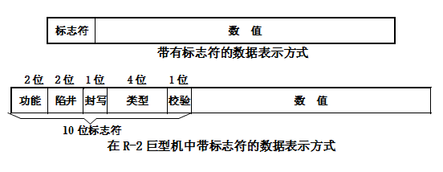

> 功能位：操作数、指令、地址、控制字
> 陷井位：由软件定义四种捕捉方式
> 封写位：指定数据是只读的还是可读可写
> 类型位：二进制,十进制,定点数,浮点数,复数,字符串,单精度,双精度；绝对地址、相对地址、变址地址、未连接地址等。

**标志符的处理机所占用的存储空间通常要小**

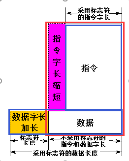

通过合理的设计可以让橙色框比紫色框小

标识符数据表示方法的[优点]：

- 简化了指令系统。

- 由硬件实现一致性检查和数据类型转换。
- 简化程序设计，缩小了人与计算机之间的语义差距。
- 简化编译器，使高级语言与机器语言之间的语义差距大大缩短。
- 支持数据库系统，一个软件不加修改就可适用于多种数据类型。
- 方便软件调试，在每个数据中都有陷井位。

[缺点]：

- 数据和指令长度可能不一致：可以通过精心设计指令系统来解决
- 指令速度降低，但是采用标志符设计，程序的设计编译调试实践都会降低
- 硬件复杂度增加

##### 数据描述符

数据描述符与标志符的**区别**：标志符只作用于一个数据，而**数据描述符要作用于一组数据**

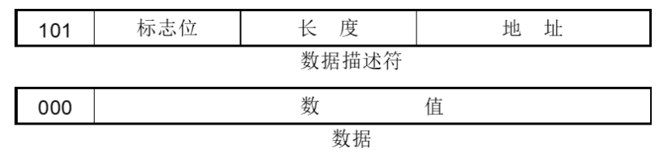

举个栗子：
$$
A=\left[\begin{array}{llll}
a_{11} & a_{12} & a_{13} & a_{14} \\
a_{21} & a_{22} & a_{23} & a_{24} \\
a_{31} & a_{32} & a_{33} & a_{34}
\end{array}\right]
$$

第一行的3表示有三个这样的数据（组）并且存了他们的起始地址（**这一行是用来描述之后数据类型的（比如说三个单行数组）**）；后三个101表示每一组数据有4个数据并且存了他们（数据）的起始地址（**这几行是用来描述具体数据的（描述单行数组中的数据）**）；后面就是顺序存放的数据

### 指令

**指令**是处理器进行操作的最小单元，如加减乘除、读写存储器操作

组成：操作 + 源地址 + 目标地址 + 下一个指令地址

类型：数据的处理、存储、移动、程序的流程控制

#### 操作数

- 操作数类型：是面向应用、面向软件系统所处理的各种数据类型。
  - 整型、浮点型、字符、字符串、向量类型等
  - 类型由操作码确定或数据附加硬件解释的标记，一般采用由操作码确定
  - 数据附加硬件解释的标记，现在已经不采用
- 操作数的表示：操作数在机器中的表示，硬件结构能够识别，指令系统可以直接使用的表示格式
  - 整型：原码、反码、补码
  - 浮点：IEEE 754标准
  - 十进制：BCD码/二进制十进制表示

常用操作数类型：

- ASCII character = 1 byte (64-bit register can store  8 characters
- Unicode character or Short integer = 2 bytes = 16 bits （half word) 
- Integer = 4 bytes = 32 bits (word size on many RISC Processors)
- Single-precision float = 4 bytes = 32 bits (word size)
- Long integer = 8 bytes = 64 bits (double word)
- Double-precision float = 8 bytes = 64 bits (double word)
- Extended-precision float = 10 bytes = 80 bits (Intel architecture)
- Quad-precision float = 16 bytes = 128 bits

#### 指令结构分类

分类准则：

1. CPU中操作数的存储方法分类
2. 指令中显式操作数个数分类
3. 根据操作数能否放在存储器中分类

指令集划分成堆栈、累加器、寄存器型三类

根据以上准则，指令集划分成堆栈、累加器、寄存器型三类。目前，指令系统则为三种中某些类型的混合型。

指令集结构选择：

针对应用需求，对指令中各属性分布进行分析，根据指令执行效率确定指令集风格；

#### 编址方式

编址单位：字编址、字节编址、位编址、块编址等

- 一般：字节编址，字访问
  - 部分机器：位编址，字访问
  - 辅助存储器：块编址

#### 零地址选择

  - **三个零地址空间**：通用寄存器、主存储器、输入输出设备独立编址
    - 由于三种存储设备所采用的寻址技术差别比较大，因此对它们分别进行编址是很自然的。

- **两个零地址空间**：主存储器与输入输出设备统一编址
  - 主存储器与输入输出设备统一编址能够简化指令系统，因为在指令系统中不必另外设置输入输出指令，所有能够访问主存储器的指令都能够用来对输入输出进行操作

- **一个零地址空间**：所有存储设备统一编址。最低端是通用寄存器，最高端是输入输出设备，中间为主存储器
  - 采用一个零地址空间的处理机通常有一个存储容量比较大的高速存储器，有多个进程或线程存放在高速存储器中，并且可通过硬件进行进程和线程的且换。

- **隐含编址方式**，实际上没有零地址空间：堆栈、Cache等
  - 在堆栈计算机中，运算指令是不需要地址的，有关设备（包括寄存器、主存储器和输入输出设备等）不需要进行编址。

- 对于I/O设备
  - 一个地址一个设备：必须通过指令中的操作码来识别该输入输出设备上的有关寄存器
  - 两个地址一个设备：一个地址是数据寄存器，一个地址是状态/控制寄存器
  - 单设备多地址：对编程增加困难

#### 寻址方式

1. 寄存器寻址（Register）
2. 立即数寻址（Immediate or literals）
3. 偏移寻址（Displacement）
4. 寄存器间接寻址（Register deferred or indirect）
5. 索引寻址（Indexed）
6. 直接寻址或绝对寻址（Direct or absolute）
7. 存储器间接寻址（Memory indirect or memory deferred）
8. 自增寻址（Auto increment）
9. 自减寻址（Auto decrement）
10. 缩放寻址（Scaled）

**采用多种寻址方式可以显著地减少程序的指令条数，但可能增加计算机的实现复杂度以及指令的CPI。**

重要的寻址方式:

- 偏移寻址方式，立即数寻址方式，寄存器间址方式，使用频度达到 75%--99%

偏移字段的大小应该在 12 - 16 bits

- 可满足75%-99%的需求

立即数字段的大小应该在 8 -16 bits

- 可满足50%-80%的需求

##### 存储器寻址

**尾端问题：**

尾端问题描述的是多字节数据在内存中的存储顺序。主要有两种类型的尾端格式：

1. **大端（Big-Endian）**：在这种格式中，最高有效字节（MSB）存储在最低的内存地址，而最低有效字节（LSB）存储在最高的内存地址。简而言之，数据的“头部”在前。xx00位置是字的最高字节
2. **小端（Little-Endian）**：相反地，在小端格式中，LSB存储在最低的内存地址，而MSB存储在最高的内存地址。在这种格式下，数据的“尾部”在前。xx00 位置是字的最低字节

不同的计算机架构可能采用不同的尾端格式。例如，Intel的x86架构是小端的，而很多网络协议和一些RISC架构（如SPARC）使用大端格式。尾端问题在不同架构之间进行数据交换时尤为重要，需要确保正确地解释数据。

**对齐问题：**

对s字节的对象访问地址为A，如果 $A \, {\rm mod} \, s =0$，则称为边界对其，

如果边界没有对其，就可能访问一个对象需要读取两次寄存器，也可能会引发异常

##### 间接寻址与变址寻址

间接寻址（Indirect Addressing）

在间接寻址模式中，指令中包含的地址并不是操作数的实际地址，而是指向操作数实际地址的指针（或称为地址的地址）。换句话说，CPU首先要读取指令中给出的地址处的内容，这个内容才是操作数的实际地址。

- **优点**：提供了更大的灵活性，可以动态改变操作数的地址。
- **缺点**：由于需要额外的内存访问来获取实际的操作数地址，所以可能会降低指令的执行速度。

变址寻址（Indexed Addressing）

变址寻址是一种在指令执行时动态计算操作数地址的方法。它通常涉及一个基地址（在指令中直接给出或存储在某个寄存器中）和一个索引量（通常存储在另一个寄存器，称为索引寄存器）。最终的操作数地址是这两个数值的和。

- **优点**：对于处理数组和循环结构非常有效，因为可以通过改变索引寄存器的值来遍历数组中的元素。
- **缺点**：相对于直接寻址，它的计算过程更复杂，可能需要额外的时间来计算地址。

#### 指令的格式

许多计算机支持不止一种指令格式

- 就所需比特而言，计算机可支持不同大小的指令

指令格式大小与数据总线宽度的关系：

- 指令的大小小于数据总线的大小：32 位总线上的 16 位指令--一次获取多条指令！
- 比数据总线宽的指令：整个指令需要多次获取

指令集支持的指令格式各不相同。

指令格式主要因其操作数的数量和类型而异。

##### 指令格式设计举例

例子1：为以下两种指令格式的设计指令：

- 格式A：Reg, Reg: R1 <- R1 OP R2

- 格式B：Reg, Mem: R1 <- R1 OP Mem

机器有 16 个寄存器，有 32 条 A 类指令，B 类指令有 16 条，内存访问是 13 位的位移加上一个基寄存器。

例子2：

我们需要开发支持以下操作的指令集和格式：

R1 <- R1 OP R2, 64 instructions
R3 <- R1 OP R2, 64 instructions
MEM <- R1, 64 instructions
MEM <- R1 OP R2, 32 instructions
R3 <- R1 OP MEM, 32 instructions

机器有 16 个通用寄存器，每个寄存器大小为 16 位。 通过 8 位的基数加位移访问内存。

答：需要四种长度的指令即可，因为后两种的指令长度一样，64个指令需要6位操作码，32个指令的需要5位操作码

#### 程序的装入和链接

##### 程序的装入

将程序(模块)装入内存时，可以有三种方式：

- 绝对装入方式
  - 编译时知道程序在内存中位置，产生绝对地址

  - 地址不需要修改

  - 单道程序

- 可重定位装入方式(静态重定位方式)
  - 在装入时对程序中逻辑地址的偏移值加入起始地址中

  - 在装入时一次完成

  - 只能连续装入

- 动态运行时装入方式

##### 程序的链接

源程序经编译后，可得到一组目标程序，再利用链接程序将这组目标模块链接，形成装入模块。

- 静态链接
- 装入时动态链接
- 运行时动态链接

### 优化指令格式

目标：

- 节省程序存储空间
- 指令格式尽量规整，便于译码

三种方法：固定长度，哈夫曼编码，扩展编码

#### Huffman

主要使用 Huffman 编码：

每个字符最少所需要的位数（信息熵/最优Huffman编码）：
$$
H=-\sum_{i-1}^nP_i \cdot \log_2P_i
$$
$P_i$ 表示第$i$个数出现的概率的排序

固定长度编码冗余：
$$
\mathrm{R}=1-\frac{-\sum_{\mathrm{i}=1}^{\mathrm{n}} \mathrm{P}_{\mathrm{i}} \cdot \log _2 \mathrm{P}_{\mathrm{i}}}{\left[\log _2 \mathrm{n}\right]}
$$
使用变长编码的时候我们要极其注意冲突问题，我们使用前缀码来编码哈夫曼，也就是说在一个树上，没有一个字符的编码可以是另一个字符的祖先，因此一个字符的编码不可能是另一个字符的前缀

对树的边进行标记，使通向左子结点的边被赋值为0，通向右子结点的边被赋值为1。

计算 Huffman 方法：

- 对于n个字母的字母表，Huffman 算法从第n个节点开始，标记字母和其频率
- 我们确定两个具有最低频率的顶点，并将它们替换为树，其根标记为这两个频率的和，其两个子节点是我们替换的两个顶点。

缺点：

- 操作码长度不规整，硬件译码苦难
- 与地址码共同组成固定长的指令比较困难

#### 拓展编码

扩展编码法：由固定长操作码与Huffman编码法相结合形成

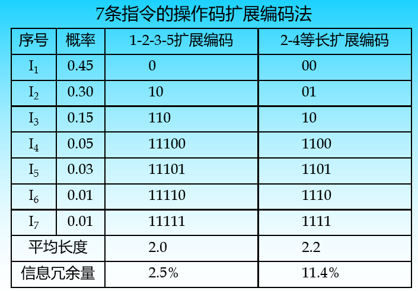

扩展方法：等长扩展和不等长扩展两种。

扩展编码中选择某些特征位用于扩展。

注意扩展目标(各频率段)间关系。

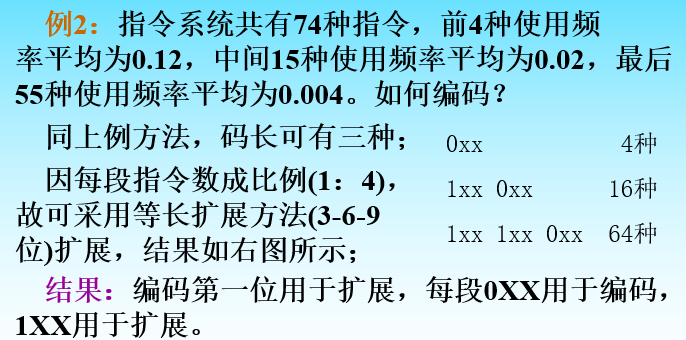

不等长扩展：

例3：指令系统共有78种指令，前10种使用频率平均为0.049，中间18种使用频率平均为0.02，最后50种使用频率平均为0.003。如何编码？

同上例方法，码长可有三种；

因每段指令数比例为1：2：5，故不可采用等长扩展，采用不等长编码（4-6-10位）较能减少平均码长。

### 编译器优化

编译器优化目标：

- 所有程序都被正确编译
- 大多数编译程序执行更快
- 快速编译
- 支持调试

优化类型

高级——在源代码级别或接近源代码级别完成

- 如果过程只被调用一次，则将其内联并保存CALL
- (更一般的情况)如果调用次数 < 某个阈值，则将它们内联

本地——完成的直线代码

- 公共子表达式产生相同的值——要么分配一个寄存器，要么用一个拷贝替换
- 常量传播——用常量替换常量值变量
- 堆栈高度缩减——重新安排表达式树以最小化临时存储需求

全局——跨分支

- 复制传播——将赋值为X(即a =X)的变量a的所有实例替换为X。
- 代码移动——从循环中删除每次循环计算相同值的代码，并将其放在循环之前
- 简化或消除循环中的数组寻址计算

依靠机器优化

- 长度减少——通过移位和加法减少乘法
- 流水线调度——对指令重新排序，以提高流水线性能
- 分支偏移优化——重新排序代码以最小化分支偏移

编译器技术综述

- 尽量避免依赖停滞
- 循环展开-减少循环开销
- 软件流水线-减少单体依赖失速
- 跟踪调度-减少其他分支的影响
- 编译器混合使用三种
- 所有的技术都依赖于预测的准确性

### 指令系统的功能设计

要求：完整性、规整性、高效率和兼容性

- 完整性：是指应该具备的基本指令种类，通用计算机必须有５类基本指令
- 规整性：包括对称性和均匀性对称性：所有寄存器同等对待，操作码的设置等都要对称，如：A－B与B－A
- 均匀性：不同的数据类型、字长、存储设备、操作种类要设置相同的指令
- 高效率：指令的执行速度要快；指令的使用频度要高；各类指令之间要有一定的比例
- 兼容性：在同一系列机内指令系统不变（可以适当增加）

指令系统的优化设计有两种截然不同的方向：CISC和RISC

1. 复杂指令系统计算机CISC(Complex Instruction Set Computer)增强指令功能，设置功能复杂的指令面向目标代码、高级语言和操作系统用一条指令代替一串指令
2. 精简指令系统计算机RISC(Reduced Instruction Set Computer)只保留功能简单的指令功能较复杂的指令用子程序来实现

#### 指令类型：CISC和RISC

##### CISC

经典的CISC架构有x86，CISC出现较早，显得大而全。其指令数很多，不仅包含了处理器常用的指令，也包含了许多不常用的特殊指令。

提出的原因：

- 软件成本远远超过硬件成本
- 日益复杂的高级语言
- 语义差距

其特征主要有：

- 指令系统复杂，寻址方式多，各种指令都能访问存储器

存在的问题：

- 难以进行编译优化生成高效目标代码
- 研发周期长
- 大量的特殊指令让CPU设计变得复杂，增加了硬件上的时间成本和面积开销
  - 难以保证设计的正确性，难以调试和维护
  - 机器的时钟周期长，降低系统性能
  - 效率低下：CISC的指令只有20%被经常使用，80%则很少被用到；且20%的指令占据了80%的存储空间
  - CISC发展后期，硬件实现时将x86指令转换成内部的RISC操作，使CISC处理器能够使用RISC处理器设计技术。
  - 复杂的指令使指令的执行周期大大加长，一般CISC处理机的指令平均执行周期都在4以上，有些在10以上

##### RISC

- **减少CPI是RISC思想的精华**
- RISC指令的特征有：

  - 简化的指令系统
  - 以寄存器-寄存器方式工作
  - 指令周期短
  - 采用大量通用寄存器，以减少访问次数
  - 采用组合逻辑电路控制，不用或少用微程序控制
  - 采用优化的编译系统，力求有效的支持高级语言程序

程序执行时间的计算公式：
$$
P = I· CPI · T
$$
其中：P是执行这个程序所使用的总的时间；I是这个程序所需执行的总的指令条数；CPI (Cycles Per Instruction)是每条指令执行的平均周期数T是一个周期的时间长度。

RISC的速度要比CISC快3倍左右，关键是RISC的CPI减小了

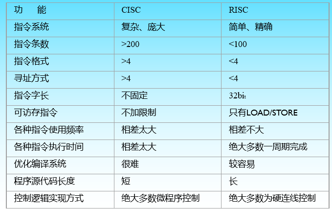

#### VIEW

VLIW（Very Long Instruction Word）指令系统是一种特殊的计算机架构，其核心特点是使用非常长的指令字（Instruction Word）。这些指令字包含多个操作，可以并行执行。VLIW体系结构的设计理念是将指令级并行（ILP，Instruction-Level Parallelism）的复杂性从硬件转移到编译器，使得硬件设计相对简化。

##### VLIW的特点

1. **长指令字**：VLIW的指令字包含多个操作，每个操作可以是一个独立的指令。
2. **编译器优化**：编译器负责识别可以并行执行的操作，并将它们打包到一个长指令字中。
3. **简化的硬件**：由于编译器负责处理指令的并行性，硬件可以在不涉及复杂的动态调度逻辑的情况下实现并行执行。

##### 为什么VLIW被较少使用或“淘汰”

尽管VLIW架构在理论上具有显著的性能优势，但在实践中它面临着一些挑战：

1. **编译器的复杂性**：将并行性的责任转移到编译器意味着编译器必须非常智能和复杂，能够准确识别并行执行的机会。
2. **代码密度问题**：长指令字可能导致代码密度低下，因为并不是所有的指令都能被有效地打包为并行操作。
3. **可移植性问题**：VLIW架构密切依赖于特定的编译技术，这可能导致针对特定VLIW处理器优化的代码在其他处理器上运行效率低下。
4. **动态性能调整的局限**：由于VLIW依赖于编译时确定的静态指令调度，它不擅长处理动态变化的运行时环境，例如分支预测和数据依赖。

### ISA (Instruction Set Architecture) 

指令集架构 (ISA) 是计算机抽象模型的一部分，它定义了**软件如何控制 CPU**。 

ISA 充当硬件和软件之间的接口，指定处理器能够做什么以及如何完成。

ISA 提供了用户与硬件交互的唯一方式。它是机器中对汇编语言程序员、编译器编写者和应用程序程序员可见的部分。

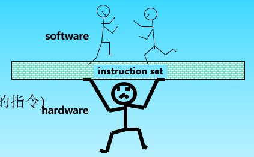

ISA 应当具备**特性**：

- 成本低
- 简洁性
- 架构和具体实现分离：可持续多代，以保持向后（backward) 兼容
- 易于编程/链接/编译

**优秀的 ISA **所具有的**特征**：

- 可持续用于很多代机器上(portability)
- 可以适用于多个领域 (generality)
- 对上层提供方便的功能（convenient functionality)
- 可以由下层有效地实现（efficient implementation )

ISA 需要描述的内容：

- 内存地址
- 取址方式
- 操作数的类型和大小
- 操作符

ISA 定义了支持的数据类型、寄存器、硬件如何管理主内存、关键功能（例如虚拟内存）、微处理器可以执行哪些指令以及多个 ISA 实现的输入/输出模型。可以通过添加指令或其他功能，或者添加对更大地址和数据值的支持来扩展 ISA。

- 重要的系统界面（System Interface）
  - ISA界面（Instruction Set Architecture）
  - ABI界面（Application Binary Interface）

- ISA：用户级ISA+特权级ISA
  - 用户级ISA 适用于操作系统和应用程序
  - 特权级ISA 适用于硬件资源的管理（操作系统）

#### ISA 的实现

## 三、存储系统

大纲：

1. 存储系统的**构成机制与性能优化**
2. 虚拟存储器（cache）的**工作原理与主要设计思考**
3. **地址的映象和变换方法及优化**
4. 页面（cache块）**替换算法及其实现**
5. 虚拟存储器（Cache）**性能的优化方法**
6. 一致性问题研究
7. 存储系统实例研究

### 存储系统原理

#### 存储系统的定义

种类：主存储器、Cache、通用寄存器、缓冲存储器、磁盘存储器、磁带存储器、光盘存储器等。

- RAM：代表随机访问内存因为你可以通过地址访问内存，读写内存；被称为 DRAM (dynamic RAM) ；电容器失去电荷，因此必须经常充电(每隔几毫秒)，并且具有破坏性读取，因此必须在读取后充电
- Cache：SRAM（static RAM），比寄存器慢，因为增加了寻找正确缓存位置的电路，但比RAM快得多；DRAM比SRAM慢10-100倍
- ROM：只读存储器，有几个变种

材料工艺：ECL、TTL、MOS、磁表面、激光，SRAM，DRAM。

访问方式：随机访问、直接译码、先进先出、 相联访问、 块传送、文件组。

RAID 对比：

存储器的主要性能：**速度、容量、价格。**

- **速度**用存储器的访问周期、读出时间、频带宽度等表示。

- **容量**用字节B、千字节KB、兆字节MB和千兆字节GB等单位表示。

- **价格**用单位容量的价格表示，例如：$C/bit。

- **组成存储系统的关键**：把速度、容量和价格不同的多个物理存储器组织成一个存储器，这个存储器的**速度最快，存储容量最大，单位容量的价格最便宜。**
- 用户对存储器的“容量，价格和速度”要求是相互矛盾的
  - 速度越快，每位价格就高
  - 容量越大，每位价格就低，速度就越慢
- 目前主存一般由DRAM构成

**存储系统的定义：**

- 两个或两个以上速度、容量和价格各不相同的存储器用硬件、软件、或软件与硬件相结合的方法连接起来成为一个存储系统。
- 这个存储系统对应用程序员是透明的，并且，从应用程序员看，它是一个存储器，这个存储器的速度接近速度最快的那个存储器，存储容量与容量最大的那个存储器相等，单位容量的价格接近最便宜的那个存储器。

虚拟存储器系统：对应用程序员透明

- 由主存储器和硬盘构成

- 目的：扩大存储器容量

  

Cache存储系统：对系统程序员以上均透明

理想情况：0延迟；无限体积；零花费；无限带宽（支持多路并行访问）

##### 局部性原理

缓存利用了局部性原则

一些技术：记忆翻译;保护和虚拟化内存管理单元(MMU)

- 转换：虚拟地址到物理地址的映射
- 保护：访问内存地址的权限
- 虚拟化：使用磁盘透明地扩展内存空间

存储层次工作原理：**局部性**

应用程序局部性原理: 给用户

- 一个采用低成本技术达到的存储容量。（容量大，价格低）
- 一个采用高速存储技术达到的访问速度。（速度快）

Temporal Locality (时间局部性):

- =>保持最近访问的数据项最接近微处理器

Spatial Locality (空间局部性):

- 以由地址连续的若干个字构成的块为单位，从低层复制到上一层

##### 存储系统容量

要求：

1. 尽可能大的地址空间
2. 能够随机访问

方法有两种：

- 只对系统中存储容量最大的那个存储器进行编址，其他存储器只在内部编址或不编址。
  - Cache存储系统。
- 另外设计一个容量很大的逻辑地址空间，把相关存储器都映射这个地址空间中。
  - 虚拟存储系统

##### 存储系统的速度

访问周期、存取周期和存取时间等

- 命中：访问的块在存储系统的较高层次上
  - 命中率：存储器访问较高层次命中的比例 $H=N_1/(N_1+N_2)$
  - 命中时间：访问较高层的时间
- 失效：访问的块不在存储系统的较高层次上
  - 失效：$1-(Hit\ Rate)=1-H=N_2/(N_1+N_2)$
  - 当在M1中没有命中时：一般必须从M2中将所访问的数据所在块搬到M1中，然后CPU才能在M1中访问。
  - 设传送一个块的时间为TB,即不命中时的访问时间为：TA2+TB+TA1 = TA1+TM
  - TM 通常称为失效开销Miss Penalty 
- 访问周期与命中率的关系：
  - 平均访存时间 $TA = HTA_1+(1-H)(TA_1+TM) = TA_1+(1-H)TM$
  - 当命中率H→1时，$T→ TA_1$

提高存储速度的途径：

- 提高缓存的命中率
- 两个存储器的速度不要差太大

采用预取技术提高命中率

方法：不命中时，把$M_2$存储器中相邻多个单元组成的一个数据块取出来送入$M_1$存储器中。
$$
H^{\prime}=\frac{H+n-1}n
$$

##### 存储系统的访问效率

$H$为命中率，$T_1$为全部访问cache的时间
$$
e=\frac{T_1}T=\frac{T_1}{H\cdot T_1+(1-H)\cdot T_2}=\frac1{H+(1-H)\cdot\frac{T_2}{T_1}}=f(H,\frac{T_2}{T_1})
$$

#### 并行访问存储器

- 高位交叉编址：主要目的是用来扩大存储器容量。

  - 实现方法：用地址码的高位部分区分存储体号

  - 当程序按体内地址顺序存放，即一个体存满之后，再存入下一个体时，这种方式称为顺序存储，高位地址表示题号，低位表示体内地址（注意0 1 2 3....的顺序是从上往下的）：

    

  - 因此，CPU给出一次存储访问总是对一块连续的存储单元进行的，在多CPU系统中，不同的CPU访问不同的存储块，达到并行工作。 存储轨迹可以用下面的线条表示：

    

- 低位交叉编址  主要目的是提高存储器速度。

  - 对应于高位交叉编址，低位交叉编址指的是将程序连续存放在相邻体中，又称**交叉存储**。（注意，0 1 2 3的顺序是从左往右的）

    

  - 这种做法可以在不改变存取周期的前提下，提高存储器带宽，因为可以在一个访问周期下，访问多个不同的存储体。适用于单处理器系统存储轨迹可以用下图表示：

  

3.1.5 交叉访问存储器
3.1.6 无冲突访问存储器

### 虚拟存储器（Virtual Memory）

#### 虚拟缓存器工作原理

把主存储器、磁盘存储器和虚拟存储器都划分为固定大小的页：

- 主存储器的页称为实页
- 虚拟存储器中的页称为虚页

虚拟存储器为操作系统和应用程序提供了多项重要优势：

1. **扩大可用内存空间**：虚拟存储器通过硬盘空间来扩展物理内存（RAM），使得系统能够运行比物理内存更大的程序和数据集。这意味着即便物理内存有限，也能高效地运行大型应用程序。
2. **内存管理简化**：对于程序而言，虚拟存储器提供了一个连续的内存地址空间，从而简化了内存的管理。程序员无需关心物理内存的分配和管理，可以专注于程序逻辑。
3. **内存保护**：每个程序在虚拟空间中都有自己的地址空间，这有助于防止一个程序访问另一个程序的数据和代码，从而增强了系统的稳定性和安全性。
4. **数据共享和通信**：虚拟存储器允许不同的程序共享内存中的数据。这对于多任务操作系统中进程间的通信和数据共享非常重要。

在虚拟存储器的设计和实现过程中，需要应对多种挑战，主要包括：

1. **页面置换算法的选择**：虚拟存储器依赖于页面置换算法来决定哪些数据应该保留在内存中，哪些应该移动到硬盘。选择合适的页面置换算法（如LRU、FIFO、Clock算法等）对于系统性能至关重要。算法需要平衡内存利用率和页面置换成本。
2. **内存和磁盘的速度差异**：由于磁盘访问速度远慢于RAM，因此频繁的页面交换（Paging）会严重影响系统性能。设计时需要有效减少页面错误（Page Fault）的发生。
3. **内存碎片问题**：虚拟存储器需要有效管理内存碎片，特别是避免过多的小碎片造成的内存浪费。

#### 地址的映象和变换方法

- 三种地址空间：
  - 虚拟地址空间
  - 主存储器地址空间
  - 辅存地址空间（磁盘空间）
- 地址映象：
  - 把虚拟地址空间映象到主存地址空间
- 地址变换：
  - 在程序运行时，把虚地址变换成主存实地址
- 三种虚拟存储器：
  - 段式虚拟存储器
  - 页式虚拟存储器
  - 段页式虚拟存储器

##### 段式虚拟存储器

每访问一个数据，需要访问两次内存

方便编程：用户通常把自己的程序按逻辑关系分成若干段

> 共享：页只是信息存放的物理单位，没有实际意义，段是逻辑单位
>
> 保护：同样是对逻辑单位的包含，分段管理更容易实现

因为段的大小不一定，所以一定会产生碎片，解决碎片的版本：

1. 紧凑（开销很大）
2. 把段放入已经存在的洞中

放入段的算法：1. 最合适 2. 最先满足

##### 页式虚拟存储器

- 把虚拟地址空间划分为固定大小的块，每一块称为1页。

- 主存的地址空间也划分为同样大小的页。

- 为和磁盘存储器物理块大小配合，虚拟存储器大小指定为0.5kb的整数倍。

- 用户程序只需要将虚页号变换为实页号即可实现到主存实地址空间的映像。

页面和页表

1. 页面

   - 将逻辑地址空间分成若干大小相等的片，称为页面或页(page)。页号从0开始。

   - 内存空间分成与页大小相同的若干存储块，称为块或页框(frame)。也从0开始编号。

   - 页框=页帧=内存块=物理块=物理页面

   - 为进程分配内存时，以**块为单位将进程中的若干页分别装入到多个可以不相邻的物理页**中。最后一个页不满，称为页内碎片。 

   - **页的大小**：应是2的幂。通常为512B～8KB 

2. 地址结构

   - 分页逻辑地址可以分为：

   - 页号P+分页地址d

   - 对于特定的机器来说，其地址结构是一定的

3. 页表
   - 系统为每个进程建立一张表，记录了相应页在内存中对应的物理块

基本的地址转换机构：

主要优点：

- 主存储器的利用率比较高。每个用户程序只有不到1页的浪费。
- 页表相对比较简单。需保存的字段数比较少。
- 地址变换的速度比较快。只需建立虚页和实页之间的联系即可。
- 对磁盘的管理比较容易。一页的大小是磁盘快大小的整数倍。

主要缺点：

- 程序的模块化性能不好。一页可能多个程序或者部分程序。
- 页表很长，需要占用很大的存储空间。
- 例如：虚拟存储空间4GB，页大小1KB，则页表的容量为4M存储字，16MB。

##### 段页式虚拟存储器

分页系统能有效地提高内存利用率

分段系统能很好地满足用户的需要，分段大小可以由用户决定

**原理：**将用户程序分成若干段，然后把段分成若干页

逻辑地址由3部分组成：段号，段内地址，页内地址

地址映象方法：每个程序段在段表中占一行，在段表中给出页表长度和页表的起始地址，页表中给出每一页在主存储器中的实页号。

地址变换方法：先查段表，得到页表起始地址和页表长度，再查页表找到要访问的主存实页号，把实页号p与页内偏移d拼接得到主存实地址。

##### 页表级数计算公式

$$
g=\left[\frac{\log2N\nu-\log2Np}{\log2Np-\log2Nd}\right]
$$

Nv为虚拟存储空间大小，Np为页面的大小，Nd为一个页表存储字的大小。

#### 加快内部地址变换的方法

1. 目录表

   基本思想：压缩页表存储容量，用一个小容量高速存储器存放页表，加快页表的查表速度。

   页表只为装入到主存的那些页面建立虚页号与实页号之间的对应关系。

   地址变换过程：把多用户虚地址中U与P拼接，相联访问目录表。读出主存实页号p，把p与多用户虚地址中的D拼接得到主存实地址。如果相联访问失败，发出页面失效请求。

   主要优点：与页表放在主存中相比，查表速度快。

   主要缺点：可扩展性比较差。主存储器容量大时，目录表造价高，速度低。

2. 快慢表

   快表：TLB(Translation Lookaside Buffer)：小容量(几～几十个字)。
   高速硬件实现。
   采用相联方式访问。

   慢表：当快表中查不到时，从主存的慢表中查找。快表是慢表的部分副本。访问速度接近快表，存储容量是慢表的容量。慢表按地址访问；用软件实现。

   快表与慢表也构成一个两级存储系统。

   主要存在问题：相联访问实现困难，速度低。

3. 散列函数

   目的：把相联访问变成按地址访问

   按地址查找信息，散列(Hashing)函数最快，对于快表就是要把多用户虚页号变成快表的地址：Ah＝H(Pv)

   把一个大得多的多用户虚页号Pv散列变成一个小的快表地址，必然有很多个多用户虚页号都变到相同的快表地址中，这种现象称为散列冲突。

   为避免散列冲突，必须把多用户虚页号也加入到快表中，并且与主存实页号存放到同一个快表存储字中。

   需要一个比较器，把快表中读出来的多用户虚页号与多用户虚地址中的虚页号进行比较。
   比较结果相等，继续正常进行主存的访问。
   比较结果不等，发生了散列冲突，需要查询主存中的慢表。

4. 倒排页表

   在传统的页表中，每个进程都有自己的页表，而在倒置页表结构中，整个系统只有一个页表，用于所有的进程。
   在倒置页表中，表的每一项不再直接对应特定进程的虚拟页，而是对应物理内存中的一个页框（Page Frame）。每个条目包含了映射到该页框的虚拟页信息，以及拥有该虚拟页的进程标识（如进程ID）。由于这种结构，倒置页表通常需要结合某种**快速查找技术**来有效地解析地址。

   实现步骤通常包括：

   **散列技术**：为了快速查找对应的物理页，IPT通常与散列技术结合使用。系统会使用一个散列函数来将虚拟地址映射到IPT中的条目。如果发生散列冲突，则可能需要链表或其他结构来处理这些冲突。

   **查找过程**：当进行虚拟地址到物理地址的映射时，系统会取出虚拟地址中的虚拟页号和进程标识，然后使用散列函数定位到IPT中的一个特定条目。然后，系统会检查该条目是否为正确的虚拟页和进程。如果是，那么就可以直接从该条目获取物理页号，完成映射。如果不是，系统需要遍历链表（如果使用了链表来处理冲突）来找到正确的条目。

   **处理缺页**：如果所需的虚拟页不在内存中，就会发生缺页中断，操作系统需要从磁盘上加载相应的页到内存中，并更新IPT。

#### 页面替换算法及其实现

1. 随机算法（RAND random algorithm）
   
   算法简单，容易实现。没有利用历史信息，没有反映程序的局部性。命中率低。
   
2. 先进先出算法(FIFO first-in first-out algorithm)
   容易实现，利用了历史信息。没有反映程序的局部性。最先调入的页面，很可能也是要使用的页面。

3. 近期最少使用算法(LFU least frequently used algorithm)：
   既充分利用了历史信息，又反映了程序的局部性实现起来非常困难。

4. 最久没有使用算法(LRU least recently used algorithm)：
   把LFU算法中的“多”与“少”简化成“有”与“无”，实现比较容易

5. 最优替换算法（OPT optimal replacement algorithm）：
   是一种理想算法，仅用作评价其它页面替换算法好坏的标准。
   在虚拟存储器中，实际上可能采用的只有FIFO和LRU两种算法。

6. 堆栈型替换算法
   定义：对任意一个程序的页地址流作两次主存页面数分配，分别分配m个主存页面和n个主存页面，并且有m≤n。如果在任何时刻 t，主存页面数集合Bt都满足关系：
            Bt（m）属于 Bt（n），
     则这类算法称为堆栈型替换算法。
   堆栈型算法的基本特点是：随着分配给程序的主存页面数增加，主存的命中率也提高，至少不下降。

   堆栈型替换算法的命中率随分配给该程序的主存页面上升而单调上升。

在多道程序中采用页面失效频率法动态调度页面。
根据各道程序在实际运行过程中页面失效率的情况，由操作系统动态调整分配给每道程序主存页面数。
当一道程序命中率低于某个限定值时就增加分配给该程序的主存页面书，以提高命中率。
但某程序命中率高于某限定值时，将降低其主存页面数。

复习从108开始:star::star::star:

#### 提高主存命中率的方法

122-258

### 高速缓冲存储器(Cache)

#### 基本工作原理

地址映象：把主存中的程序按照某种规则装入到Cache中，并建立主存地址与Cache地址之间的对应关系。

地址变换：当程序已经装入到Cache之后，在程序运行过程中，把主存地址变换成Cache地址。

#### 地址映象与变换方法

##### 全相联映象及其变换

映象规则：主存的任意一块可以映象到Cache中的任意一块。映象关系有 $C_b×M_b$ 种。

需要结构：采用**目录表**存放这种关系，目录表的容量为$C_b$，字长为Cache地址中的块号长度加主存地址中的块号长度，再加1位有效位。

替换算法：

1. 利用主存地址去访问主存，将主存一个字内容送到CPU。
2. 包括被访问字的一块内容替换到Cache中。

3. 修改目录表中的主存块号字段，把当前的主存块号B写到目录表的存储字中。

4. 有效位表示目录表中各个存储字是否有效。
   如果为1，表示目录表中主存块号B与Cache块号b建立的映像有效，b是B的正确副本。
5. 如果为0，表示B和b之间映像无效，或没有关系。

优点：块的冲突率最小。Cache利用率最高。

缺点：需要一个相联访问速度很快，容量为Cb的相联存储器（目录表），代价高。相联比较所花费的时间会影响到Cache的访问速度

##### 直接映象及其变换

映象规则：主存储器中一块只能映象到Cache的一个特定的块中。
Cache地址的计算公式：$b＝B\mod C_b$。其中：b为Cache块号，B是主存块号，$C_b$是Cache块数。

实际上，Cache地址与主存储器地址的低位部分完全相同。

优点：硬件实现很简单，不需要相联访问存储器，访问速度也比较快，实际上不需要进行地址变换

缺点：块的冲突率比较高。主存中多块都映像到Cache同一块中，又是常用块，Cache的命中率很低。

##### 组相联映像及其实现

映象规则：

- 主存和Cache按同样大小划分成块和组。
- 主存和Cache的组之间采用直接映象方式。
- 组的内部采用全相联映象方式。

组相联映象方式的优点：

- 块的冲突概率比较低，
- 块的利用率大幅度提高，
- 块失效率明显降低。

组相联映象方式的缺点：实现难度和造价要比直接映象方式高。

所需结构：一个高速小容量的存储器做成块表存储器。

组相联映像方式和全相联映像方式相比，实现起来还是要容易，而命中率相近。

- 当每组的块容量Gb为1时，就是直接映像方式。
- 当每组块容量Gb与Cache的块容量Cb相等时，就是全相联方式。

##### 段相联映像及其实现

映象规则：

- 主存和Cache按同样大小划分成段和块。
- 主存和Cache的段之间采用全相联映象方式。
- 段的内部采用直接映象方式。

#### Cache替换算法及其实现

##### 轮换法

用于组相联映象方式中，有两种实现方法。

1. 为每一块设置一个计数器字段，字段长度与组内块号字段长度相同
   - 新装入或替换的块，它的计数器清0，同组其它块的计数器都加“1”。
   - 在同组中选择计数器的值最大的块作为被替换的块。
2. 为每一组设置一个计数器，每次访问计数器加一，计数器的值为多少，替换哪一个块

优点：简单；缺点：没有利用局部性

##### LRU

未每一块设置一个计数器，计数器的长度与块号字段的长度相同

#### Cache存储系统的加速比

178

#### Cache的一致性问题

Cache 由于某些原因，可能会出现和主存不同步的情况

Cache的更新算法：

(1)写直达法，写通过法，WT(Write-through)：CPU的数据写入Cache时，同时也写入主存。

(2)写回法，抵触修改法，WB(Write-Back)：CPU的数据只写入Cache，不写入主存，仅当替换时，才把修改过的Cache块写回主存。

### 三级存储系统

- 虚拟存储系统和Cache 存储系统可同时存在
- 存储系统可以有多种构成方法，不同的构成只是实现技术不同

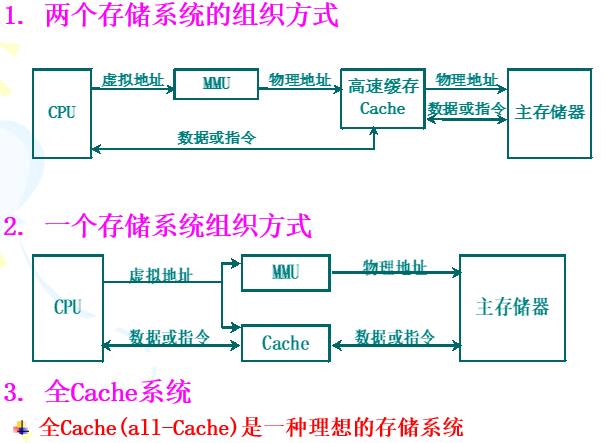

既有虚拟存储器又有Cache系统：

- 虚拟存储器次啊用**位选择组相联方式**
- 虚拟存储器中的一页等于主存储器的一个区
- 用虚拟地址中的虚页号访问快表

#### 全cache存储系统

建立存储系统的目的：获得一个速度接近Cache，容量等于虚拟地址空间的存储器。

- 这个存储器如何构成，具体分成几级来实现，只是具体的实现技术而已。
- 随着计算机硬件和软件技术的发展，存储系统的实现技术也在不断改变。
- 最直接最简单的方法：用一个速度很高，存储容量很大的存储器来实现。

全Cache(all-Cache)是一种理想的存储系统。

## 四、输入输出系统

本章重点：

1. 了解三种基本输入输出方式的原理及特点。

2. 中断系统中的软硬件功能分配。

3. 中断优先级和中断屏蔽的原理及方法。

4. 通道中的数据传送过程与流量分析。

5. 输入输出处理机的作用及种类。

输入/输出系统简称I/O系统

- I/O 设备
- I/O 设备与处理机的连接

### 引言

指令系统设计原则：**加快经常性事件**

- CISC和RISC思路都是加快经常性事件
- 加快经常性使用的指令是RISC的核心思想

加快方法：**并行（Parallel)**

1. 流水线技术（指令流水线，指令时间并行）

2. 多指令流出技术（指令空间并行）
3. 向量机（数据流水线，数据时间并行）
4. SIMD（单指令多数据，数据空间并行）

存储系统设计原则：**加快经常性事件、与CPU性能匹配**

加快方法：**系统**

- cache存储系统（将经常访问的数据放在cache中）
- 虚拟存储系统（将经常访问的数据放在内存中）

I/O设备接口的两种策略：

- 内存映射
  - I/O 设备作为处理器内存的一部分
  - 读写I/O设备位置，配置I/O和传输数据(使用编程I/O或DMA)

- I/O 通道
  - 特殊指令在指定的通道上执行I/O命令
- **同步问题**
  - 轮询：CPU检查状态字节
  - 中断：设备通过事件中断CPU

#### I/O系统性能

如何评价 I/O 性能：

- 连接特性 容量 响应时间 吞吐率 

另一种衡量I/O系统性能的方法：

-  考虑I/O操作对CPU的打扰情况。
-  即考查某个进程在执行时，由于其他进程的I/O操作，使得该进程的执行时间增加了多少。 

影响I/O性能的方面有很多，但是有两个主要方面：

- 吞吐量：I/O带宽
- 响应时间：延时

##### 简单 Producer-Server 模型

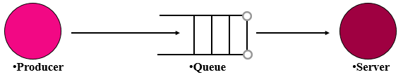

- 吞吐量：

  - 服务器在单位时间之间内完成的任务

  - 为了获得尽可能高的吞吐量
    - 服务器不应该处于空闲
    - 队列不应该是空的

- 响应时间
  - 任务放入队列时开始，在被服务完成时结束
  - 最小化响应时间
    - 队列应该是空的
    - 服务应该处于空闲状态

*吞吐量* 和 *响应时间* 的函数应该是指数增长的

一般来说，吞吐量可以通过以下方式提高:

- 投入更多硬件
- 减少与负载相关的延迟

响应时间更难减少:

- 最终它会受到光速的限制(但我们离光速还很远)

##### 响应时间

- 系统响应时间 = I/O系统的处理时间 + CPU的处理时间
- **多线程技术**只能提高系统吞吐率，并不能减少系统响应时间
- 进程切换时可能需要增加I/O操作
- 可切换的进程数量有限，当I/O处理较慢时，仍然会导致CPU处于空闲状态

##### 连接特性

物理上的规定和标准只要是需要互联的，必须各方面一致，否则无法连接

接口尺寸，接口形式，协议的一致性每根线的定义，电压，电流，频率等

#### I/O数据传输的三个要求

1. 数据位置
   - 必须选择正确的设备
   - 数据必须能在该设备内寻址
   - 一旦选择正确的设备，数据位置可能就变得微不足道了
     - 从键盘获取数据
   - 位置可能需要搜索
     - 磁道需要选择和旋转
   - 位置可能不是简单的二进制数字
2. 数据传输
   - 需要指定设备
   - 传输速率因设备而异
     - 键盘最快的可能就1秒10字节，但是磁盘块可能会快很多
   - 数据可以是输出、输入
3. 同步
   - 不仅I/O速率与处理器速度差别很大，而且I/O是异步的
   - CPU只能在时钟周期间隔询问I/O状态和传输信息，I/O状态和信息在被访问时必须是稳定的
   - 对于输出设备，只有设备准备好接收数据时才必须发送数据
   - 对于输入设备，处理器只有在设备可用时才能读取数据

#### 如何在数据传输中减少定位和同步

- 不同设备的数据结构不同，设备需要翻译地址
  - 处理器选择设备，但是地址只是处理器发送给设备的一个消息
- 处理器在读取读取设备状态时可以解决同步问题
- 为了提高速度，我们需要更高效的同步方法：DMA 和 中断

#### I/O系统的可靠性、可用性和可信性

反映外设可靠性能的参数有：

- 可靠性
  - 系统从某个初始参考点开始一直连续提供服务的能力。
  - **平均无故障时间MTTF**来衡量
  - 系统中断服务的时间用**平均修复时间MTTR**来衡量
  - 系统的失效率 = MTTF的倒数
  - 如果系统中每个模块的生存期服从指数分布，则**系统整体的失效率是各部件的失效率之和**。
- 可用性
  - 系统正常工作的时间在连续两次正常服务间隔时间中所占的比率。
  - $可用性=\frac{MTTF}{MTTF+MTTR}$
  - $MTTF+MTTR$: **平均失效间隔时间MTBF**
- 可信性（不能够度量）
  - 服务的质量。即在多大程度上可以合理地认为服务是可靠的

:hand:栗子：

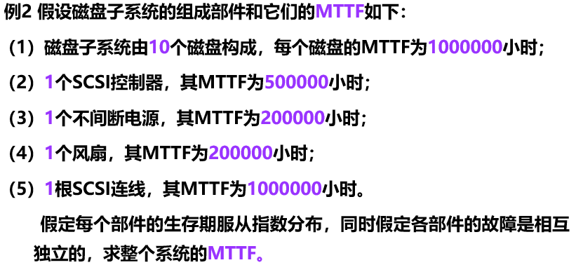

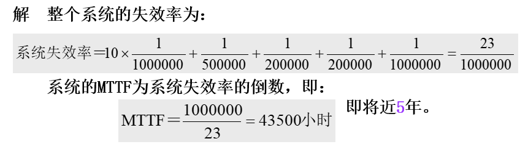

##### 故障、错误和失效

(1) 一个故障可能会导致一个或者多个错误；

(2) 错误通常具有以下特性：

  ◆ 错误在潜在状态和有效状态间相互转换；
  ◆ 潜在的错误可能通过激活而有效；
  ◆ 有效错误的影响可以传递，引起新的错误。

(3) 如果错误影响到部件正常的服务时，部件就发生了失效；

(4) 系统中的所有部件的故障、错误和失效均存在这样的关系。

**故障的分类：**

(1) 按故障产生的原因分：

  ◆ 硬件故障：设备失效产生的故障 
  ◆ 设计故障
  ◆ 操作故障：由于用户操作的失误引起的故障 
  ◆ 环境故障

(2) 按故障出现的周期分：

  ◆ 暂时性故障 间歇性故障 永久性故障

##### 提高系统组成部件可靠性

- 有效构建方法：在构建系统的过程中消除故障隐患，这样建立起来的系统就不会出现故障

- 纠错方法：在系统构建中采用容错方法

  -  故障避免技术
  
  -  故障容忍技术
  
  -  错误消除技术
  
  -  错误预报技术

### 输入输出原理

输入输出系统：**处理机与主存储器之外的部分**

包括**输入输出设备、输入输出接口和输入输出软件**

#### 输入输出系统的特点

- 处理机与外界进行数据交换的通道
- 计算机系统中最具有多样性和复杂性的位置
- 软硬件组合

- 异步性
  - 输入输出系统通常没有统一的中央时钟，各个设备按照自己的时钟工作
  - 外围设备与外围设备之间能并行工作
- 实时性
  - 如果处理机提高服务不及时，可能丢失数据，或造成外围设备工作的错误
  - 对于实时控制计算机系统，如果处理机提供的服务不及时，可能造成巨大的损失，甚至造成人身伤害。
  - 对于处理机本身的硬件或软件错误：如电源故障、数据校验错、页面失效、非法指令、地址越界等，处理机必须及时处理。
  - 对不同类型的设备，必须具有与设备相配合的多种工作方式。

- 与设备无关性
  - 独立于具体设备的标准接口
  - 处理机采用统一的硬件和软件对品种繁多的设备进行管理。
  - 某些计算机系统已经实现了即插即用技术。

#### 输入输出系统的组织方式

- 针对实时性，采用层次结构的方法。
  - 最内层是输入输出处理机、输入输出通道等。
  - 中间层是标准接口。
  - 标准接口通过设备控制器与输入输出设备连接。
- 针对与设备无关性，采用分类处理的方法。
  - 面向字符的设备，如字符终端、打字机等
  - 面向数据块的设备，如磁盘、磁带、光盘等。
- 针对异步性，采用自治控制的方法。
  - 输入输出系统是独立于CPU之外的自治系统处理机与外围设备之间要有恰当的分工

#### 基本输入输出方式

##### 程序控制输入输出

状态驱动输入输出方式、应答输入输出方式、查询输入输出方式、条件驱动输入输出方式。

程序控制输入输出方式有4个特点：

1. 何时对何设备进行输入输出操作受CPU控制。
2. CPU要通过指令对设备进行测试才能知道设备的工作状态。如：闲、准备就绪、忙碌等
3. 数据的输入和输出都要经过CPU。
4. 用于连接低速外围设备，如终端、打印机等。

**简单的总线结构**

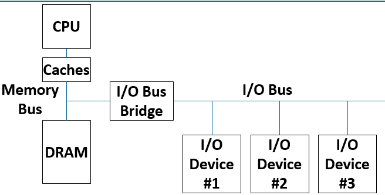

- 设备可以是“奴隶”，只响应I/O总线请求
- 设备可以是“主人”，启动I/O总线传输

例：一个处理机在一段时间内只能管理一台打印机。处理机执行指令的速度为1GIPS，字长32位，打印机每秒钟100个字符。
解：处理机用一条指令就能向打印机传送4个字符。因此，处理机的实际利用率只有即4千万分之一。 
$$
100/10^9\times 4＝0.25\times 10^{-7}
$$

**一个处理机管理多台外围设备**

处理机采用轮流循环测试方法，分时为各台外围设备服务

- 优点：
  - 灵活性很好。可以很容易地改变各台外围设备的优先级。

- 缺点：
  - 不能实现处理机与外围设备之间并行工作。

##### 中断输入输出方式

定义：**当出现来自系统外部，机器内部，甚至处理机本身的任何例外的**，或者虽然是事先安排的，但出现在现行程序的什么地方是事先不知道的事件时，**CPU暂停执行现行程序，转去处理这些事件，等处理完成后再返回来继续执行原先的程序。**

特点：

1. CPU与外围设备能够并行工作。
2. 能够处理例外事件。
3. 数据的输入和输出都要经过CPU。
4. 用于连接低速外围设备。

##### 直接存储器访问方式

直接存储器访问方式(DMA：Direct Memory Access)，主要用来连接高速外围设备。如磁盘存储器，磁带存储器、光盘辅助存储器，行式打印机等。

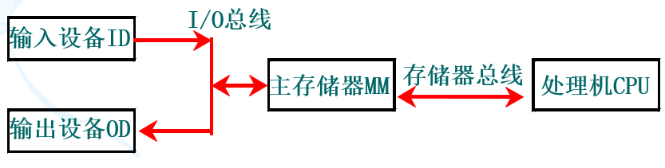

- DMA在I/O设备和主存之间自动传输数据，中断 / 轮询完成
  - 通过内存映射寄存器编程的直接存储器存取
  - 有些系统在DMA内部使用专用处理器
  - 外围设备的访问请求直接发往主存储器，数据的传送过程不需要CPU的干预。
  - 全部用硬件实现，不需要做保存现场和恢复现场等工作。
  - DMA控制器复杂，需要设置**数据寄存器、设备状态控制寄存器、主存地址寄存器、设备地址寄存器和数据交换个数计数器**及控制逻辑等。
  - 在DMA方式开始和结束时，需要处理机进行管理。

**DMA输入设备的工作流程如下：**

- 从设备读一个字节到DMA控制器中的数据缓冲寄存器中。
- 若一个字没有装配满，则返回到上面；若校验出错，则发中断申请；若一个字已装配满，则将数据送主存数据寄存器。

- 把主存地址送主存地址寄存器，并将主存地址增值。

- 把DMA控制器内的数据交换个数计数器减１。

- 若交换个数为0，则DMA数据传送过程结束，否则回到上面

**DMA输出设备的工作流程如下：**

- 把主存地址送入主存地址寄存器，并启动主存储器，同时将主存地址增值。
- 将主存数据寄存器中的数据送DMA控制器的数据寄存器。

- 把数据写到输出介质上（可能要逐个字符输出）。

- 把DMA控制器内的数据交换个数计数器中的内容减１。

- 若交换个数为0，则DMA数据传送过程结束，否则回到上面。

目前使用DMA的方式：

- 周期窃取方式：
  - 在每一条指令执行结束时，CPU**测试**有没有DMA服务申请。
  - 借用CPU完成DMA工作流程。包括数据和主存地址的传送，交换个数计数器减1，主存地址的增值及一些测试判断等。
  - 周期窃取方式的**优点**是硬件结构简单，比较容易实现。
  - 缺点是在数据输入或输出过程种实际上占用了CPU的时间。
- 直接存取方式：
  - 整个工作流程全部用硬件完成。
  - 优点与缺点正好与周期窃取方式相反。

- 数据块传送方式：
  - 在设备控制器中设置一个比较大的数据缓冲存储器。设备控制器与主存储器之间的数据交换以数据块为单位，并采用程序中断方式进行。	
  - 采用数据块传送方式的外围设备有软盘驱动器、行式打印机、激光打印机、卡片阅读机、绘图仪等。

**从并行转向串行 I/O 离片**

- 并行总线的时钟速率受限于长总线上的时钟偏斜（大约100MHz）

- 驱动大量加载的总线线路需要高功率

- 中央总线仲裁器增加了每个交易的延迟，共享限制了吞吐量

- 昂贵的并行连接器和背板/电缆（所有设备都要支付成本）

- 示例：VMEbus、Sbus、ISA总线、PCI、SCSI、IDE。

点对点链接使用高级时钟/信号编码在gigabit速度运行（需要在每端大量电路）

- 较低功率，因为只有一个表现良好的负载
- 多重同时传输
- 廉价电缆和连接器（用更高的端点晶体管成本换取较低的物理布线成本），通过并行使用多个链接为每个设备定制带宽
- 示例：以太网、Infiniband、PCI Express、SATA、USB、Firewire 等。

**从总线转向Crossbar**

- 总线在那个时代发展起来，那时候电线非常昂贵且必须共享。
- 总线三态驱动器在标准单元流程中存在问题，因此用组合复用器替代。
- 交叉开关利用芯片内布线的密集度，允许多个数据传送同时进行。

### 中断系统

#### 中断源的组织

- 中断系统需要**硬件和软件**共同来实现，引起中断的各种事件称为**中断源**。

- 中断系统的复杂性实际上主要是由**中断源的多样性**引起的。

- 中断源可以来自**系统外部**，也可以来自**机器内部**，甚至**处理机**本身。

- 中断可以是硬件引起的，也可以是软件引起的。

- 把各种各样的中断源分类、分级组织好，是中断系统的关键之一。

##### 中断源的种类

- 由**外围设备**引起的中断：低速外围设备每传送一个字节申请一次中断；高速外围设备的前、后处理。
- 由**处理机本身**产生的中断：如算术溢出，除数为零，数据校验错等。
- 由**存储器产生**的中断：如地址越界、页面失效、访问存储器超时等。
- 由**控制器产生**的中断：如非法指令、堆栈溢出、时间片到、切换到特权态。

- 由**总线产生**的中断：输入输出总线出错,存储总线出错等。
- 实时过程控制产生的中断。
- 实时钟的定时中断。
- 多处理机系统中，从其它处理机发送来的中断。
- 程序调试过程中，由断点产生的中断。
- 硬件故障中断。

##### 中断源的分类组织

- 中断源分类组织的目的：在**响应中断后能尽快找到中断入口。**
- 根据中断事件的**紧迫程度**，中断源工作速度、性质等进行分类

- **为每一类中断源分配一个硬件的中断入口，**在进入这个入口之后，再通过软件找到具体的中断源。

- 可屏蔽中断与不可屏蔽中断，或称**一般中断和异常中断**。

IBM公司的机器，把中断源分为6类：

- 机器检验出错中断。由硬件或软件故障时产生。
- 程序性错误引起的中断。

- 访问管理程序中断。当用户程序执行访管指令引起的中断。

- 外部事件中断。

- 输入输出中断。

- 重新启动中断。处理机不能禁止这类中断

##### 中断优先级

- 安排中断优先顺序主要由下列因素来决定：
  - 中断源的急迫性。
  - 设备的工作速度。
  - 数据恢复的难易程度。
  - 要求处理机提供的服务量。
- 中断优先级与中断服务顺序
  - 要求：**响应速度快，灵活性好**。
  - 做法：由硬件排队器决定**中断优先级**。
- **通过软件设置中断屏蔽码改变中断服务顺序**。

:hand:：在IBM 370系列机中，把7类中断分为5个中断优先级，从高到低分别是：

1. 紧急的机器检验错误引起的中断。
2. 调用管理程序，程序性错误，可以抑制的机器检验错误引起的中断。
3. 外部事件引起的中断。
4. 外围设备的中断。
5. 重新启动引起的中断。

:hand:：某处理机共有4个中断源，中断优先级从高到低分别是：1级、2级、3级和4级。当处理机在执行主程序时，同时有3级和2级两个中断源向处理机发出中断服务请求。当处理机为2级中断源服务时又有4级中断源发出中断服务请求。当处理机为４级中断源服务时又有１级中断源发出中断服务请求：

#### 中断系统的软硬件分配

有些功能必须用硬件实现，有的功能必须用软件实现，而大部分功能既可以用硬件实现，也可以用软件实现。

**恰当分配中断系统的软硬件功能**，是中断系统最关键问题。

必须用硬件实现的有：

- 保存中断点和进入中断服务程序入口。
- 这两个功能相当于执行一条转子程序指令，因为中断发生在现行程序的什么地方是不确定的，不能由程序员来安排。

必须用软件实现的有：

- 中断服务和返回到中断点。
- 返回到中断点，通过执行一条中断返回指令来实现。
- 中断服务必须用软件实现，因为是“程序中断方式”。

主要考虑的两个因素：

- **中断响应时间：中断响应时间是一个非常重要的指标。**
- **灵活性：硬件实现速度快，灵活性差；软件实现正好相反。**

##### 中断处理过程

现行指令结束，且没有更紧急的服务请求。关CPU中断。保存断点，主要保存PC中的内容。撤消中断源的中断请求。
保存硬件现场，主要是PSW及SP等。识别中断源。改变设备的屏蔽状态。进入中断服务程序入口。保存软件现场，在中断服务程序中使用的通用寄存器等。
开CPU中断，可以响应更高级别的中断请求。中断服务，执行中断服务程序。关CPU中断。
恢复软件现场。恢复屏蔽状态。恢复硬件现场。开CPU中断。返回到中断点。

##### 中断响应时间

定义：从**中断源向处理机发出中断服务请求开始**，到**处理机开始执行这个中断源的中断服务程序时为止**，这一段时间称为中断响应时间。

影响中断响应时间的因素主要有4个： (前2个属于处理机设计，后2个属于中断系统)

1. 最长指令执行时间
   有些指令的执行时间很长，甚至无法预测。
2. 处理其它更紧急的任务所用时间
   如处理DMA请求等。
3. 从第一次关CPU中断到第一次开CPU中断所经历的时间
   中断系统的软件与硬件功能分配，主要就是要考虑这一段内要所的事情用软件来实现，还是用硬件来实现。
4. 通过软件找到中断服务程序入口所用时间
   主要是第1和第3两部分。其中，第1部分是指令系统设计时考虑的问题，在中断系统的设计中，主要考虑第3部分。

#### 中断源的识别方法

识别中断源的查询法

- 所有中断源共用一条中断请求线
- 处理机响应中断后都进入同一个程序入口
- 用软件找出申请中断的中断源
- 主要优点：灵活性好。主要缺点：速度慢。

软件排队链法

- 设置一个中断请求寄存器，每个中断源在其中占据一位，并且按照中断的优先级从高位到低的顺序排列。
- 所有中断源使用同一条公共的中断请求线，进入公共中断源服务程序入口，其过程与查询法相同。

- 在公共中断服务程序入口，用一条特殊指令读出中断请求寄存器中的内容，并根据读出的内容直接进入中断服务程序。

- 节省了用软件逐个寻找中断源的时间。

硬件排队链法

- 用硬件排队器和编码器，在所有请求中断服务的中断源中，找出具有最高优先级的中断源。
- 设置一个中断请求寄存器，每个中断源在其中中占据一位。

- 所有中断源使用同一条公共的中断请求线，进入公共中断源服务程序入口。

- 转入公共的中断服务程序后，用一条特殊指令直接读到所有请求中断服务的中断源中具有最高优先级的中断源编号。

- 特点：**识别中断源的速度更快**

中断向量法

- 在主存储器的固定区域中开辟出一个专用的**中断向量区**。
- 用硬件排队器和编码器在所有请求中断服务的中断源中，产生具有最高优先级的中断源编号。

- 隐含执行上面方法中的两条识别中断源的指令，直接通过硬件转向这个中断源的中断服务程序入口。
  不需要进入公共中断服务程序，能够实现到中断程序的最快转移

独立请求法

各个中断源使用自己独立的中断请求线。每一根中断请求线在处理机中有固定的或可编程的中断优先级。

如果同时有多个中断源请求中断服务，通过仲裁线路立即选择具有最高优先级的中断源，并向它发出中断响应信号INIT，处理机就可以立即转入这个中断源的中断服务程序。

独立请求法实际上是把分布在各个中断源内的串行排队器都集中到处理机中，从而克服了串行排队链法可靠性差的缺点，但灵活性差的缺点仍然存在。

中断源用init信号清除中断请求信号。

不需要软件或硬件对中断源进行扫描，不需要中断源送回中断源编号或中断向量

分组独立请求法

把独立请求法与串行排队链法结合起来。

中断源分组：组内采用串行排队链法，组间采用独立请求法。

上面的2、3、4三种识别中断源的方法都属于串行排队链法：

- 串行排队链法的优点：
  - 识别中断源的速度比较快，特别是中断向量法。
  - 实现比较简单，中断源与处理机的连线很少。

- 串行排队链法的缺点：
  - 灵活性比较差，中断优先级是由硬件固定。不能由程序员通过软件修改。
  - 可靠性比较差，排队链串行分布在各个中断源中。一个出错，都出错。

#### 中断现场的保存和恢复

中断现场的保护和恢复分别是中断处理机过程开始和结束时必须执行的步骤，可以分为三类：

1. 程序计数器PC，必须由硬件来完成保存，可以保存在存储器固定单元或者堆栈。利用中断返回指令来恢复。
2. 当前程序状态的有关信息，包括：处理机状态字、堆栈指针、基址寄存器、中断屏蔽码等
   保存与恢复方法有：主存固定区域，压入系统堆栈、交换处理机状态字。也可以采用软件在中断服务程序中保存和恢复。
3. 软件现场：指在中断服务程序中被破坏的通用寄存器。一般采用软件来保存和恢复现场，指令系统给予适当支持。也有些处理机采用硬件来保存软件现场，如Sparc处理机。

#### 中断屏蔽

设置中断屏蔽有三个用处：

1. 在中断优先级由硬件确定了的情况下，改变中断源的中断服务顺序。
2. 决定设备是否采用中断方式工作。
3. 在多处理机系统中，把外围设备的服务工作分配到不同的处理机中。

中断屏蔽的实现方法主要有两种：

1. 每级中断源设置一个中断屏蔽位。
   - 中断屏蔽位可以分部在各个中断源中，也可以集中到处理机，如放到处理机的状态字中。

2. 改变处理机优先级
   - 中断优先级不仅在处理机相应中断源的中断服务请求时使用，而且为每个中断的中断服务程序也赋予同样的中断优先级。

两者的区别：

- 两者使用的概念不同。
  - 前者使用中断屏蔽，后者使用中断优先级。
- 需要屏蔽码的位数不同。
  - 前者所需要的屏蔽位数比较多，   n：log2n
- 可屏蔽的中断源数量和种类不同。
  - 前者可以任意屏蔽掉一个或几个中断源，后者只能屏蔽掉比某一个优先级低的中断源。

### 通道处理机

通道处理机的作用主要是在外围设备种类、数量很多的情况下把外围设备的管理工作从CPU中分离出来。

处理机与外部设备的连接方式：

- 直接连接
- 通道处理机
- 输入输出处理机

三种基本输入输出方式存在的问题：

1. CPU的输入输出负担很重，不能专心用于用户程序的计算工作。
2. 低速外围设备，每传送每个字符都由CPU执行一段程序来完成。

3. 高速外围设备的初始化、前处理和后处理等工作需要CPU来完成。

4. 大型机中的外围设备台数很多，但一般并不同时工作。让DMA控制器能被多台设备共享，提高硬件的利用率

#### 通道的作用和功能

通道处理机能够负担外围设备的大部分输入输出工作，包括管理所有**按字节传输方式工作**的低速和中速外围设备，按**数据块传输方式工作**的高速设备。对DMA接口初始化，设备故障的检测和处理。

可以看作一台能够执行有**限输入输出指令**，并且能够被多台外围设备共享的小型DMA专用处理机。

在一台大型计算机系统中可以有多个通道，一个通道可以连接多个设备控制器，一个设备控制器又可以管理一台或者多台外围设备。形成典型的I/O系统四层结构。

通道的主要功能：

- 接受CPU发来的指令，选择一台指定的外围设备与通道相连接。
- 执行CPU为通道组织的通道程序。

- 管理外围设备的有关地址。

- 管理主存缓冲区的地址。

- 控制外围设备与主存缓冲区之间数据交换的个数。

- 指定传送工作结束时要进行的操作。

- 检查外围设备的工作状态，是正常或故障。

- 在数据传输过程中完成必要的格式变换。

#### 通道的工作过程

通道完成一次数据输入输出的过程分为三步：

1. 在用户程序中使用访管指令进入管理程序，由CPU通过管理程序组织一个通道程序，并启动通道。
2. 通道处理机执行通道程序，完成指定的数据输入输出工作。

3. 通道程序结束后再次调用管理程序进行处理。

每完成一次输入输出工作，CPU只需要两次调用管理程序。

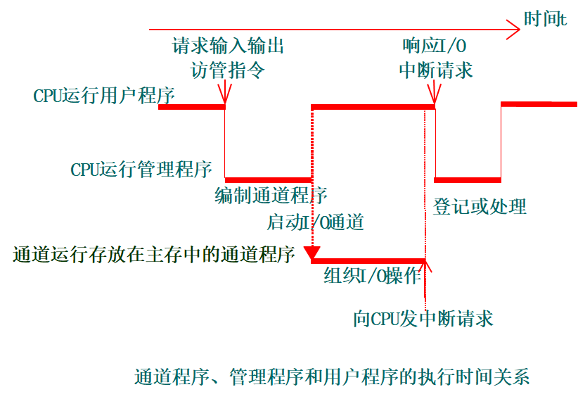

#### 通道的种类

1. 字节多路通道

   - 为多台低中速的外围设备服务。

   - 有多个子通道，每个子通道连接一个控制器。

2. 选择通道

   - 为高速外围设备服务

   - 只有一个以成组方式工作的子通道
   - 高速外围设备必须设置专门通道在一段时间单独为一台外围设备服务，不同时间可以选择不同设备。一旦选中，通道进入忙状态。直至数据传输结束。
   - 只有一套完整硬件，逐个为物理连接的几台高速设备服务。

3. 数组多路通道
     - 字节多路通道和选择通道的结合。
     - 每次为一台高速设备传送一个数据块，并轮流为多台外围设备服务。
     - 从磁盘存储器读出文件的的过程分为三步：
         	 定位、找扇区、读出数据
     - 数组多路通道的实际工作方式：
         	在为一台高速设备传送数据的同时，有多台高速设备可以在定位或者在找扇区。
     - 与选择通道相比，数组多路通道的数据传输率和通道的硬件利用都很高，控制硬件的复杂度也高。

#### 通道流量分析

通道流量：单位时间内能够传送的最大数据量。又称通道吞吐率，通道数据传输率等。

通道最大流量：通道在满负荷工作状态下的流量。

通道流量与连接在通道上的设备的数据传输率的关系如下：
$$
f_{BYTE}=\sum_{i=1}^pf_i\quad f_{SELETE}=\operatorname*{Max}_{i=1}^pf_i\quad f_{BLOCK}=\operatorname*{Max}_{i=1}^pf_i
$$
三种通道的最大流量计算公式：
$$
\begin{aligned}
&\begin{aligned}f_{MAX.BYTE}&=\frac{p\cdot n}{(T_S+T_D)\cdot p\cdot n}=\frac{1}{T_S+T_D}\text{字节/秒}\end{aligned} \\
&\begin{aligned}f_{MAX.SELETE}&=\frac{p\cdot n}{(T_S/n+T_D)\cdot p\cdot n}=\frac{1}{T_S/n+T_D}\text{字节/秒}\end{aligned} \\
&\begin{aligned}f_{MAX.BLOCK}&=\frac{p\cdot n}{(T_S/k+T_D)\cdot p\cdot n}=\frac{1}{T_S/k+T_D}\text{字节}/\text{秒}\end{aligned}
\end{aligned}
$$
为保证通道不丢失数据，通道的实际流量应不大于通道最大流量

### 输入输出处理机

通道处理机存在如下问题：

1. 每完成一次输入输出操作要两次中断CPU的现行程序。

2. 通道处理机不能处理自身及输入输出设备的故障。

3. 数据格式转换、码制转换、数据块检验等工作要CPU完成。

4. 文件管理、设备管理等工作，通道处理机本身无能为力。

根据是否共享主存储器分为：

1. 共享主存储器的输入输出处理机。
2. 不共享主存储器的输入输出处理机。

根据运算部件和指令控制部件是否共享分为：

1. 合用同一个运算部件和指令控制部件：造价低，控制复杂。
2. 独立运算部件和指令控制部件：独立运算部件和指令控制部件已经成为主流。

#### 输入输出处理机的作用

输入输出处理机的多种组织方式：

- 多个输入输出处理机从功能上分工。
- 以输入输出处理机作为主处理机。
- 采用与主处理机相同型号的处理机作为输入输出处理机。
- 采用廉价的微处理机来专门承担输入输出任务。

## 五、标量处理机

只有标量数据表示和标量指令系统的处理机称为标量处理机

提高指令执行速度的主要途径：

 (1) 提高处理机的工作主频
 (2) 采用更好的算法和设计更好的功能部件
 (3) 采用指令级并行技术

三种指令级并行处理机：

 (1) 流水线处理机和超流水线(Super-pipelining)处理机
 (2) 超标量(Superscalar)处理机
 (3) 超长指令字(VLIW: Very Long Instruction Word)处理机

### 流水线结构原理

**流水作业的特点：**

- 流水线不减少单个任务的耗时，增加整个工作的吞吐量
- 被最慢的阶段限制
- 速度=通道数
- 多个工作同时进行
- 不平衡的任务减少速度

**指令流水线：**把指令的解释过程分解为“分析”和“执行”两个子过程，并让这两个子过程分别用独立的分析部件和执行部件来实现。

- 理想情况：速度提高一倍

  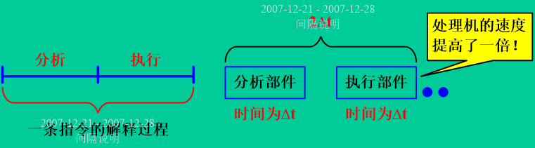

- 当分析部件完成上一条指令的“分析”后，就立即将之送入执行部件，同时分析部件可以开始处理下一条指令。

- 虽然从执行一条指令的全过程来看，仍需要2∆t的时间，但从机器的输出端来看，却是每隔一个∆t就能给出一条指令的执行结果。

**流水线结构原理**：

如何加快指令的解释过程是计算机组成设计的基本任务。除了采用高速部件外，一次重叠，先行控制和流水等控制方式是常用的，意在提高指令的并行性，从而加速指令的解释过程。控制方式分类：**顺序方式、 重叠方式、 流水方式。**

计算机的各个部分几乎都可以采用：

  **(1)**指令的执行过程可以采用流水线，称为**指令流水线**。

  **(2)**运算器中的操作部件，如浮点加法器、浮点乘法器等可以采用流水线，称为**操作部件流水线**。

  **(3)**访问主存的部件可以采用**访存部件流水线**。多个计算机之间，通过存储器连接，也可以采用流水线，称为**宏流水线**。

#### 指令的重叠执行方式

##### 顺序执行方式

$$
执行n条指令的时间\quad T=\sum_{i=1}^n\left(t_{\text{取指令 }i}+t_{\text{ 分析 }i}+t_{\text{执行 }i}\right)
$$

优点：简单，节省设备；缺点：执行指令的速度慢，功能部件的利用率很低。

##### 重叠方式

在两条相近指令的解释过程中，某些不同解释阶段在时间上存在重叠部分。包括一次重叠、先行控制技术和多操作部件并行。 

###### 一次重叠

把取指令操作隐含在分析、执行指令过程中，则在任何时候只允许上条指令“执行”与下条指令“分析”相重叠。           $  T=（n+1）×t $

若执行时间不等，则实际执行时间：
$$
\begin{aligned}{T=t_{\text{分}1}+\sum_{i=2}^{n}[\max(t_{\text{分}i},t_{\text{执}i-1})]+t_{\text{执}n}}\end{aligned}
$$

###### 二次重叠执行方式

把取第k+1条指令提前到分析第k条指令同时执行

- 如果三个过程的时间相等，执行n条指令的时间为：T=(2+n)t

- 理想情况下同时有三条指令在执行

- 处理机的结构要作比较大的改变，必须采用先行控制方式

  

采用二次重叠执行方式，必须解决两个问题：

  (1) 有独立的取指令部件、指令分析部件和指令执行部件

​    独立的控制器：存储控制器、指令控制器、运算控制器

  (2) 要解决访问主存储器的冲突问题

​    取指令、分析指令、执行指令都可能要访问存储器

**解决访存冲突的方法**：

   (1) 采用低位交叉存取方式：这种方法不能根本解决冲突问题。
	 取指令、读操作数、写结果。

  (2) 两个独立的存储器：独立的指令存储器和数据存储器。
	如果再规定，执行指令所需要的操作数和执行结果只写到通用寄存器，那么，取指令、分析指令和执行指令就可以同时进行。
    在许多高性能处理机中有独立的指令Cache和数据Cache。 这种结构被称为哈佛结构。

   (3) 采用先行控制技术。
    先行控制技术的关键是缓冲技术和预处理技术。
    缓冲技术是在工作速度不固定的两个功能部件之间设置缓冲栈，用以平滑它们的工作。
    采用了缓冲技术和预处理技术之后，运算器能够专心于数据的运算，从而大幅度提高程序的执行速度。

多操作部件并行：采用有多个功能部件的处理机，把ALU的多种功能分散到几个具有专门功能的部件中，这些功能部件可以并行工作，使指令流出速度大大提高。 

### 流水线技术 Pipelining 

- 空间并行性
  -  设置多个独立的操作部件
  -  多操作部件处理机
  -  超标量处理机

- 时间并行性
  -  采用流水线技术。
  -  不增加或只增加少量硬件就能使运算速度提高几倍
  -  流水线处理机
  -  超流水线处理机

#### 流水线的表示方法

连接图、时空图、预约表（主要前两种）

**简单流水线**：

流水线的每一个阶段称为**流水步、流水步骤、流水段、流水线阶段、流水功能段、功能段、流水级、流水节拍**等。一个流水阶段与另一个流水阶段相连形成**流水线**。指令从流水线一端进入，经过流水线的处理，从另一端流出。

有些复杂指令在执行阶段也采用流水线方式工作，称为操作流水线。

**指令流水线**：

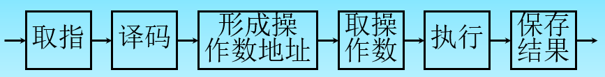

一般4-12个流水段，大于等于8个为超级流水线处理机

**时空图：**

采用“时空图”表示流水线的工作过程。在时空图中，横坐标表示时间，也就是输入到流水线中的各个任务在流水线中所经过的时间。当流水线中各个流水段的执行时间都相等时，横坐标被分割成相等长度的时间段。纵坐标表示空间，即流水线的每一个流水段 

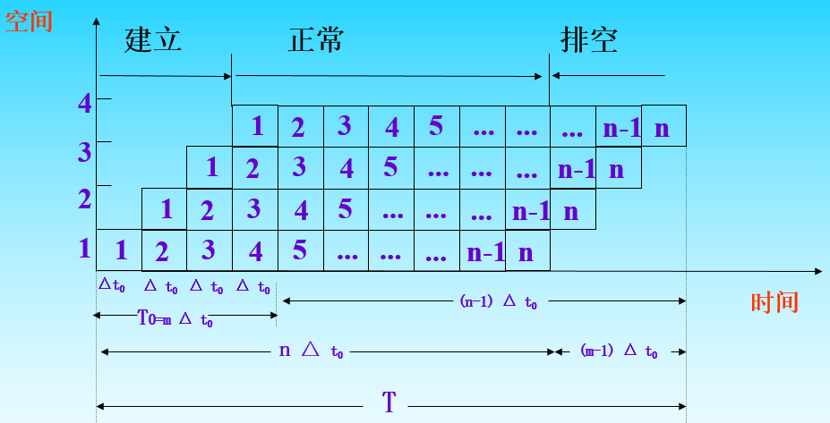

- 建立时间：在流水线开始时有一段流水线填入时间，使得流水线填满。
- 正常流动时间：流水线正常工作，各功能段源源不断满载工作。
- 排空时间：在流水线第一条指令结束时，其他指令还需要一段释放时间。

#### 流水线的特点

- 流水一定重叠，比重叠更苛刻。
- 一条流水线通常有多个子过程。每个子过程称为流水线的“级”或“段”。其数目称为流水线的“深度”。
- 每段有专用功能部件，各部件顺序连接。
- 流水线有建立时间、正常满载时间、排空时间。另外，流水线需要有“通过/装入时间”（第一个任务流出结果所需的时间），在此之后流水过程才进入稳定工作状态，每一个时钟周期（拍）流出一个结果。
- 流水线每一个功能段部件后面都要有一个缓冲寄存器，或称为锁存器，其作用是保存本流水段的结果，如图8所示。由于流水线中每一个流水段的延迟时间不可能绝对相等，再加上电路的延迟时间及时钟等都存在偏移，因此流水段之间传送任务时，必须通过锁存器。
- 流水线中各功能段的时间应尽量相等，否则将引起堵塞、断流，这个时间一般为一个时钟周期（拍） 。要求流水线的时钟周期不能快于最慢的流水段。另一方面，执行时间长的一个流水段将成为整个流水线的瓶颈，此时流水线中的其他功能部件就不能发挥作用。因此瓶颈问题是流水线设计中必须解决的问题。
- 只有连续不断地提供同一种任务时才能发挥流水线的效率。例如，要使浮点加法器流水线充分发挥作用，需要连续提供浮点加法运算。只有流水线完全满载时，整个流水线的效率才能得到充分发挥。
- 给出指标如最大吞吐率，为满负载最佳指标。

### 指令相关

指令相关（Instruction Dependency）是指在程序中一条指令的执行依赖于前一条或几条指令的结果的情况。在处理器的流水线执行中，指令相关会导致执行中断或延迟，影响处理器的性能

分类有：数据相关，控制相关，结构相关

#### 数据相关（Data Hazards）

在处理器的流水线执行中，后续指令依赖于前面指令的执行结果的情况。这种依赖关系导致流水线无法连续流畅地执行，因为某些操作必须等待之前的操作完成后才能开始。

假设我们需要执行指令：

1. `I1: ADD R1, R2, R3` - 将寄存器R2和R3的值相加，结果存储在R1中。
2. `I2: SUB R4, R1, R5` - 从寄存器R1的值中减去R5的值，结果存储在R4中。
3. `I3: MUL R6, R4, R7` - 将寄存器R4和R7的值相乘，结果存储在R6中。

**分类如下：**

- 先写后读（RAW, Read After Write）： 一条指令需要读取前一条指令写入的数据。
  - 例子： I1和I2之间存在RAW相关，因为I2需要使用I1计算的结果（R1的值）
- 先读后写（WAR, Write After Read）： 一条指令需要写入的数据之前被另一条指令读取。
  - 假设例子： 如果I2写入R2，而I1要读取R2，那么I1和I2之间就存在WAR相关。
- 写后写（WAW, Write After Write）： 两条指令写入相同的位置。
  - 假设例子： 如果有另一条指令I4: ADD R1, R8, R9紧跟I1，那么I1和I4之间存在WAW相关，因为它们都想写入R1。

后两种类型只会出现在异步流动流水线中

**解决方法：**

1. **数据前递（Data Forwarding/Bypassing）：**
   - **应用于RAW：** 在`I1`和`I2`的情况中，可以将`I1`计算出的结果直接从执行单元传递给`I2`，而不必等待其写回到R1。
   - 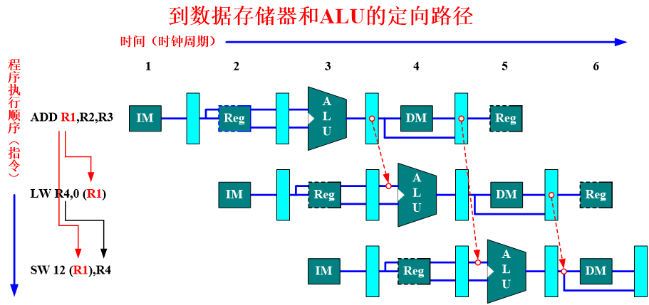
2. **指令重排（Instruction Reordering）：**
   - 如果可能，重新安排指令的顺序，以减少指令之间的直接依赖。
   - 例如，如果`I3`不依赖于`I1`和`I2`的结果，可以先执行`I3`。
3. **流水线暂停（Pipeline Stalling）：**
   - 当检测到数据相关时，特别是在前递不可能的情况下，暂停流水线直到所需数据准备好。
   - 例如，在`I1`和`I2`的例子中，如果前递不可行，则`I2`可能需要等待直到`I1`完成写回操作。
4. **动态调度（Dynamic Scheduling）：**
   - 处理器在运行时动态地检测指令之间的依赖性，并调整指令的执行顺序。
   - 这种方法在现代处理器中常见，特别是在乱序执行环境中。

> MIPS整数流水线是指在MIPS（Microprocessor without Interlocked Pipeline Stages）架构中实现的整数指令流水线。MIPS架构是一种典型的精简指令集计算机（RISC）架构，其设计哲学注重简单、规整的指令集和高效的流水线执行。
>
> MIPS处理器的整数流水线通常被划分为几个主要阶段，每个阶段完成指令执行过程中的一部分工作。一个典型的MIPS流水线包括以下阶段：
>
> 1. **取指（Instruction Fetch, IF）：**
>    - 在这个阶段，处理器从内存中取出下一条要执行的指令。通常涉及到程序计数器（PC）的读取和更新。
> 2. **译码/寄存器取值（Instruction Decode/Register Fetch, ID）：**
>    - 在译码阶段，处理器解析指令，确定要执行的操作类型，并从寄存器文件中取出所需的操作数。
> 3. **执行/地址计算（Execute/Address Calculation, EX）：**
>    - 执行阶段根据译码阶段的结果执行算术或逻辑操作，或者计算内存访问的地址。对于分支指令，这个阶段也包括条件判断和计算跳转地址。
> 4. **访存（Memory Access, MEM）：**
>    - 如果指令涉及内存访问（如加载和存储指令），这个阶段负责实际的内存读写操作。
> 5. **写回（Write-back, WB）：**
>    - 在写回阶段，执行结果（如果有的话）被写回到寄存器文件中。对于加载指令，从内存读取的数据在这个阶段写入寄存器。
>
> MIPS流水线的设计旨在每个时钟周期内推进一个阶段，以实现高吞吐率和效率。然而，流水线设计也面临着一些挑战，如数据冒险、控制冒险和结构冒险，需要通过各种技术（如前递、流水线暂停和分支预测）来解决。

#### 控制相关（Control Hazards）

**控制相关**因为程序执行转移类指令而引起的相关。转移类指令如无条件转移、条件转移、子程序调用、中断等，它们属于分支指令，执行中可能改变程序的方向，从而造成流水线断流。

数据相关影响到的仅仅是本条指令附近少数几条指令，所以称为局部相关。而控制相关影响的范围要大得多，它会引起程序执行方向的改变，使流水线损失更多的性能，所以称为全局相关。

控制相关会使流水线的连续流动受到破坏。当执行条件转移指令时，有两种可能结果：

1. 如发生转移，将程序计数器PC的内容改变成转移目标地址；
2. 如不发生转移，只是将PC加上一个增量，指向下一条指令的地址。

> "Control Dependence Ignored"（忽略控制依赖）是在编译优化和程序并行化领域中的一个概念，尤其是在尝试提高程序执行效率的过程中。它涉及到一种假设或技术，即在某些情况下可以忽略控制依赖，以便在不改变程序意义的前提下进行更大范围的代码重组或并行化。
>
> **忽略控制依赖的动机**：
>
> - **性能优化**：通过重排指令顺序或并行执行原本依赖于控制流的指令，可以提高程序的性能。
> - **编译器优化**：编译器在优化代码时可能会选择忽略某些控制依赖，以便重新安排指令序列，减少延迟，或增加并行度。
> - **并行处理**：在多线程或多核心处理中，忽略控制依赖可以帮助更有效地利用资源，通过并行执行原本串行的代码片段。
>
> 实现方法：
>
> 实现忽略控制依赖的技术可能包括但不限于：
>
> - **谓词执行**（Predication）：将条件分支转换为条件执行的指令，这样所有路径上的指令都会执行，但只有在给定条件为真时才会影响状态。
> - **编译时分析**：静态分析代码以确定哪些控制依赖可以安全地忽略或重新排列。
> - **动态重排**：在运行时动态地决定指令的执行顺序，可能结合硬件支持。

由转移指令(占总指令的1/4)引起的相关。

##### 解决控制相关的方法：

1. **分支预测（Branch Prediction）：**
   - **原理**：提前预测分支指令的结果（是否会跳转以及跳转目标地址），并据此继续指令的取指和执行。
   - **实现**：可以是简单的静态预测（如始终预测跳转或不跳转），或复杂的动态预测（基于历史信息进行预测）。
   - 预测分支失败
     - 流水线继续照常流动，就像没发生什么似的。在知道分支结果之前，分支指令后的指令不能
       改变机器状态，或者改变了之后能够回退。
     - 若预测分支失败，则照常执行；否则，从转移目标处开始取指令执行。
   - 预测分支成功
     - 假设分支转移成功，并开始从分支目标地址处取指令执行。
     - 起作用的前题：先知道分支目标地址，后知道分支是否成功。
   - 想办法提高猜测的正确率，可以有效提高流水线效率
2. **延迟分支（Delayed Branch）：**
   - **原理**：在分支指令后安排几条无关的指令执行，这些指令无论分支结果如何都要执行。
   - **实现**：编译器或汇编程序员负责在分支指令后安排适当的指令。
3. **双指令缓冲：**
   - 同时运行判断语句的两个分支，使用正确的那一个
4. **分支目标缓冲区（Branch Target Buffer, BTB）：**
   - **原理**：缓存分支指令的目标地址，使得在再次遇到相同的分支指令时，可以快速获取跳转地址。
   - **实现**：硬件中实现一个专门的缓存，存储分支指令的地址及其对应的跳转目标地址和分支结果。
5. **分支历史表（Branch History Table, BHT）：**
   - **原理**：记录分支指令的历史行为（跳转或不跳转），用于动态分支预测。
   - **实现**：在硬件中维护一个表格，记录每个分支指令的历史行为，以指导未来的预测。
6. **动态预测技术：**
   - **原理**：使用更复杂的算法，如基于局部或全局历史的预测算法，以提高分支预测的准确性。
   - **实现**：例如，两级自适应训练（Two-Level Adaptive Training）或全局历史表（Global History Table）等。
7. **乱序执行和指令重排：**
   - **原理**：允许处理器乱序执行指令，并在保证数据一致性的前提下调整指令的完成顺序。
   - **实现**：在处理器中实现复杂的逻辑，以允许乱序执行和动态调度。

##### 延迟分支

延迟分支（Delayed Branch）是一种用于处理流水线中控制相关的技术，尤其是在分支指令导致的流水线停顿（Branch Stall）中。延迟分支的核心思想是在分支决定是否跳转以及跳转到哪里之前，执行一个或多个“延迟槽”（Delay Slot）中的指令。这样做的目的是在分支指令的影响被解析出来之前，利用原本会空闲的流水线周期。

延迟分支所使用的填充指令通常来源于：

1. **从前调度：**
   - 被调度的指令必须与分支无关
2. **分支指令紧随其后的指令**：
   - 编译器会尝试重排代码，将一些与分支无关的指令移动到延迟槽中。这些指令在分支无论如何都会执行，不受分支结果的影响。
3. **编译器专门插入的无操作指令（NOPs）**：
   - 如果找不到合适的指令来填充延迟槽，编译器可能会插入NOP指令。这虽然不增加额外的有效工作，但至少可以避免错误的行为。
4. **代码中其他位置的无关指令**：
   - 编译器可能会进行更复杂的代码分析，从程序的其他部分找到可以安全执行的指令，并将它们移动到延迟槽中。

移动指令到延迟槽的方式

1. **简单移动**：直接将分支后紧接着的指令移动到延迟槽中。
2. **复杂重排**：进行更全面的代码分析和重排，找到可以安全移动到延迟槽的指令。
3. **循环展开**：在循环结构中，将循环体内的某些指令移动到循环条件的分支延迟槽中。
4. **与其他优化技术结合**：如和指令流水线优化、循环变换等结合，以找到更多合适的指令。

##### 动态分支预测

动态分支预测是一种在现代微处理器中常用的技术，用于提高处理器执行指令时的效率。这种技术旨在预测程序中的条件分支（如if-else语句或循环）将如何执行，以减少因等待分支结果而导致的处理器空闲时间。

**动态分支预测的基本原理**

动态分支预测依赖于在运行时收集的信息，以预测分支指令的行为。它的核心思想是基于分支指令的历史行为来预测它未来的行为。这种方法认为程序的行为具有一定的模式，通过观察过去的行为来预测未来的行为。

**动态分支预测必须解决两个问题**：

- 如何记录一个分支操作的历史
  - 仅仅记录最近一次或最近几次的分支历史；
  - 记录分支成功的目标地址；
  - 记录分支历史和分支目标地址，相当于前面两种方式的结合；
  - 记录分支目标地址的一条或若干条指令。  
- 决定预测的走向。

**如何预测**

- 如果预测正确，则不会产生分支惩罚，因为我们获取了正确的指令
- 如果预测错误（错误预测），则必须从流水线中清除错误指令
- 最简单的预测器：始终预测未执行的指令
- 动态分支预测器在分支历史表（BHT）（又称分支预测缓冲区）中跟踪过去的行为

**关键组件和技术**

1. **分支历史表（Branch History Table, BHT）**：这是一种硬件机制，用于记录每个分支指令的最近几次执行情况（是否发生了跳转）。
2. **分支目标缓冲区（Branch Target Buffer, BTB）**：存储分支指令的目标地址，当再次遇到相同的分支指令时，可以快速获取跳转地址。
3. **分支预测算法**：例如二位饱和计数器（Two-bit Saturating Counter），它为每个分支维护一个小型状态机，根据最近几次的跳转或不跳转历史来预测下一次的行为。
4. **全局历史记录**：考虑整个程序的分支历史，而不仅仅是单个分支的历史。这可以通过全局历史表（Global History Table）等实现。
5. **局部历史记录**：仅考虑特定分支的历史。

:hand:例子：

1. 只有1个预测位的分支预测缓冲 

  - 索引：分支指令地址的低位。

  - 存储区：1位的分支历史记录位，又称为预测位，记录该指令最近一次分支是否成功。

    - “0”记录分支不成功 
    - “1”记录分支成功

  - 状态转换图 

    

  - 分支预测错误时，预测位就被修改，并且需要恢复现场，程序从分支指令处重新执行。 

  - 缺点：只要预测出错，往往是连续两次而不是一次。

2. 采用两个预测位

  - 必须有两次连续预测错误才更改

    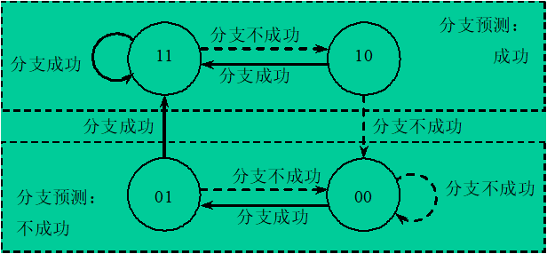

3. n 位分支预测缓冲

  - 采用n位计数器，则计数器的值在0到2n-1之间：
         当计数器的值大于或等于最大值的一半（2n-1）时，
         预测下一次分支成功；否则预测下一次分支不成功。
  - 预测位的修改和两位预测时相同：
         当分支成功时计数器的值加1，不成功时减1。
  - 研究表明：n位分支预测的性能和两位分支预测差不多，因而
        大多数处理器都只采用两位分支预测。

#### 结构相关（Structure Hazards）

**结构冒险解决方法**：

- 当两个指令同时需要相同的硬件资源时，就会产生结构危害
  - 能否在硬件上通过拖延新指令直到旧指令用完资源来解决问题
- 通过在设计中添加更多的硬件，总是可以避免结构上的危险
  - 例如，如果两个指令同时需要一个端口到内存，可以通过增加第二个端口到内存来避免危险

#### 异常和中断

##### 精确中断与非精确中断

精确中断（Precise Interrupts）与非精确中断（Imprecise Interrupts）是处理器在面对中断和异常时的两种不同处理机制。

**精确中断（Precise Interrupts）**

精确中断指的是处理器能够在任何指令的执行点准确地报告程序的状态。当发生精确中断时，处理器保证以下条件：

1. **所有先于中断点的指令都已完全执行**：这意味着所有影响程序状态的操作都完成了。
2. **所有后续指令尚未执行**：即中断点之后的指令不会影响程序状态。
3. **程序计数器（PC）精确地指向引起中断的指令**：这允许程序在处理中断后恢复执行。
4. **所有的寄存器和内存状态都能反映出中断发生时的确切情况**。

精确中断对于调试、错误恢复和多线程程序的正确性至关重要。它确保在中断处理后，程序能够无缝地从中断点继续执行。

**非精确中断（Imprecise Interrupts）**

非精确中断是指处理器不能保证上述所有条件，特别是在现代高性能处理器使用复杂技术（如乱序执行、规格执行）时。在非精确中断发生时：

1. **一些先于中断点的指令可能尚未完成**。
2. **一些后续指令可能已经部分或完全执行**。
3. **程序计数器可能不精确指向引起中断的指令**。

非精确中断使得错误恢复和程序调试变得更加困难，因为中断时的程序状态可能不完全清晰。

##### 处理中断的四种可能的办法

方法1：忽略这种问题，当非精确处理

- 原来的supercomputer的方法
- 但现代计算机对 IEEE 浮点标准的异常处理，虚拟存储的异常处理要求必须是精确中断。

方法2：缓存操作结果，直到早期发射的指令执行完。

- 当指令运行时间较长时，缓冲区较大
- Future file
  - 缓存执行结果，按指令序确认
- history file
  - 尽快确认
  - 缓存区存放原来的操作数，如果异常发生，回卷到合适的状态

方法3：以非精确方式处理，用软件来修正

- 为软件修正保存足够的状态
- 让软件仿真尚未执行完的指令的执行
  - Instruction 1 – A 执行时间较长，引起中断的指令
  - Instruction 2, instruction 3, ….instruction n-1 未执行完的指令
  - Instruction n    已执行完的指令
  - 由于第n条指令已执行完，希望中断返回后从第n+1条指令开始执行，如果我们保存所有的流水线的PC值，那么软件可以仿真Instruction1 到Instruction n-1 的执行

方法4：暂停发射，直到确定先前的指令都可无异常的完成，再发射下面的指令。

- 在EX段的前期确认（MIPS流水线在前三个周期中）

  

### 流水线分类

流水线（Pipeline）在计算机架构中是一种重要的概念，用于提高处理器的性能。流水线可以按照不同的方式进行分类，每种分类侧重于流水线的某个特定特征或设计理念。以下是一些常见的流水线分类方式及其类别：

#### 按照流水线的级别来分

- 处理机级流水线，又称为指令流水线 (Instruction Pipelining)，例如：在采用先行控制器的处理机中，各功能部件之间的流水线

  

- 部件级流水线（操作流水线），把处理机的算术逻辑部件分段，使得各种数据类型的操作能够进行流水。如浮点加法器流水线

  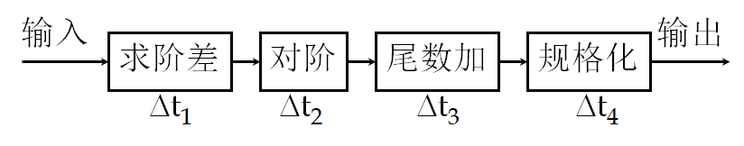

- 宏流水线 (Macro Pipelining)，每个处理机对同一个数据流的不同部分分别进行处理，它是指由两个以上的处理机串行地对同一数据流进行处理，每个处理机完成一项任务。

  

#### 单功能流水线与多功能流水线

- 单功能流水线：只能完成一种固定功能的流水线
  - Cray-1计算机中有12条；YH-1计算机有18条；Pentium有一条5段的定点和一条8段的浮点流水线；PentiumⅢ有三条指令流水线，其中两条定点指令流水线，一条浮点指令流水线。
- 多功能流水线：流水线的各段通过不同连接实现不同功能
  - Texas公司的ASC计算机中的8段流水线，能够实现：定点加减法、定点乘法、浮点加法、浮点乘法、逻辑运算、移位操作、数据转换、向量运算等。

#### 按照指令处理的方式分类

##### a. 静态流水线（Static Pipeline）

- **定义**：每个流水线阶段在每个时钟周期内**执行固定的操作**，流水线的行为在编译时就已经确定。
- **特点**：结构简单，易于实现，但在面对复杂指令或数据依赖时效率较低。

##### b. 动态流水线（Dynamic Pipeline）

- **定义**：流水线能够根据运行时的情况动态调整，如动态指令调度和乱序执行。
- **特点**：能更有效地处理各种冒险和依赖，提高执行效率，但设计复杂。

#### 按照指令执行的顺序分类

##### a. 直线流水线（Linear Pipeline）

- **定义**：指令按照固定的顺序逐阶段进行处理，每个阶段固定。
- **特点**：设计简单，适合顺序执行的任务。

##### b. 超标量流水线（Superscalar Pipeline）

- **定义**：在每个时钟周期内可以同时发射和完成多条指令。
- **特点**：能够提高吞吐率，但需要复杂的指令调度和冒险管理机制。

##### c. 乱序执行流水线（Out-of-Order Pipeline）

- **定义**：指令可以根据数据依赖和资源可用性乱序执行。
- **特点**：提高资源利用率和执行效率，但设计和实现相对复杂。

#### 按照流水线的结构分类

##### a. 线性结构流水线（Linear Structured Pipeline）

- **定义**：流水线的每个阶段固定，按顺序排列。
- **特点**：易于理解和实现，但在某些阶段可能成为瓶颈。

##### b. 循环流水线（Cyclic Pipeline）

- **定义**：流水线的末端与开始相连，形成一个循环，允许连续的数据处理。
- **特点**：适用于重复性任务，如数字信号处理，但需要管理循环中的数据依赖。

#### 按照功能分类

##### a. 整数流水线（Integer Pipeline）

- **定义**：专门处理整数运算的流水线。
- **特点**：通常简单高效，用于处理基本的算术和逻辑操作。

##### b. 浮点流水线（Floating Point Pipeline）

- **定义**：专门处理浮点运算的流水线。
- **特点**：比整数流水线复杂，用于执行浮点数计算。

##### c. 图形流水线（Graphics Pipeline）

- **定义**：专为图形处理设计的流水线，如在GPU中。
- **特点**：优化了图形和图像处理任务，结构和操作针对图形处理进行特化。

### 线性流水线的性能分析

1. 吞吐率（Throughput）

     - 定义：单位时间内流水线完成指令的数量。

   - 计算方法：通常是每个时钟周期完成的指令数。对于完全流水线，理论上每个时钟周期可以完成一条指令，但实际吞吐率可能因冒险和延迟而降低。

   - $TP=n/T_k$，$TP$为吞吐里，n为指令数，$T_k$为完成n个指令所用时间

   - 若各段执行时间相等，则输入连续任务情况下完成n个连续任务需要的总时间为：$T_k=(k+n-1)D_t$，k为流水线段数，$D_t$为完成一条指令所需时间

   - 最大吞吐率：$TP_\max=\underset{n\to\infty}{\operatorname*{Lim}}\frac n{(k+n-1)\Delta t}=\frac1{\Delta t}$

   - 各段执行时间不相等、输入连续任务情况下：吞吐率为

$$
\begin{aligned}TP=\frac{n}{\sum_{i=1}^kt_i+(n-1)\max(\Delta t_1,\Delta t_2,\cdot\cdot\cdot,\Delta t_k)}\end{aligned}
$$

2. 延迟（Latency）

     - 定义：一条指令从开始到结束所需的时间。

     - 计算方法：通常以时钟周期数计算。在流水线中，延迟等于流水线的深度（阶段数）乘以时钟周期时间。

3. 流水线效率（Pipeline Efficiency）

     - 定义：流水线资源的利用率。

     - 计算方法：有效执行时间与总执行时间的比率。如果存在流水线停顿（如由于数据冒险），效率会下降。

     - 若各段时间相等，则各段的效率$e_i$相等，即$e_1=e_2=\dots=e_k=\Delta t_o/T_{流水}$

       整个流水线的效率：$\begin{aligned}E=\frac{n\Delta t_0}{T_\text{流水}} = \frac n { k + n - 1 }&=\frac1{1+\frac{k-1}n}\end{aligned}$

       从时－空图上看，效率实际上就是 n 个任务所占的时空区与 k 个段总的时空区之比，即：

   $$
   E=\frac{n\text{个任务占用的时空区}}{ k\text{个流水段的总的时空区}} = \frac { T _ 0 }{ k \cdot T _ k}
   $$

   - 若各段时间相等，输入n个连续任务流水线的效率为：$E=\frac{k\cdot n\cdot\Delta t}{k\cdot(k+n-1)\cdot\Delta t}=\frac n{k+n-1}$

     最高效率为：$\begin{array}{rcl}E_\mathrm{max}=Lim\frac n{k^2+2n^2-1}=1\end{array}$

   - 各流水段执行时间不等，输入n个连续任务流水线的效率为：
     $$
     E=\frac{n\cdot\sum_{i=1}^k\Delta t_i}{k\cdot[\sum_{i=1}^k\Delta t_i+(n-1)\cdot\max(\Delta t_1,\Delta t_2,\cdots,\Delta t_k)]}
     $$

4. 速度提升比（Speedup Ratio）

     - 定义：流水线实现相比于非流水线执行的速度提升。

     - 计算方法：非流水线执行时间与流水线执行时间的比率。理想情况下，速度提升与流水线的阶段数相等。$S = 顺序执行时间T_0 / 流水线执行时间T_k$

     - 各段执行时间相等，输入连续任务情况下加速比为：
       $$
       S=\frac{k\cdot n\cdot\Delta t}{(k+n-1)\Delta t}=\frac{k\cdot n}{k+n-1}
       $$

     - 最大加速比：$S_\max=\underset{n\to\infin}{\operatorname*{Lim}}\frac{k\cdot n}{k+n-1}=k$
     
      - **各段执行时间不等**，输入连续任务情况下实际加速比为：
        $$
        S=\frac{n\cdot\sum_{i=1}^{\kappa}\Delta t_i}{\sum_{i=1}^{k}\Delta t_i+(n-1)\cdot\max(\Delta t_1,\Delta t_{2,\cdots,\Delta t_k})}
        $$

5. 流水线利用率（Pipeline Utilization）

     - 定义：流水线在执行过程中被有效利用的程度。

     - 计算方法：考虑流水线各阶段的利用情况。如果某些阶段经常空闲，说明流水线利用率不高。

### 调度

假想这么一个情况，lw 指令后面紧跟着一连串的计算指令，且这些计算指令和 lw 指令没有关系，在这种情况下，如果lw指令发生 data cache miss，那么它可能会被卡在访存阶段几十上百个周期，而因为处理器是顺序执行的，所以后面的一连串计算指令也都被阻塞住。这里面就出现了一个问题，lw 后面的一连串指令完全不依赖lw指令，但是却因为 lw 指令而没办法继续执行。在理想情况下，我们肯定希望在 lw 指令阻塞的时候，别的可以执行的指令继续执行，不要受 lw 的影响。但是这在一个顺序执行的处理器中是做不到的，顺序执行的处理器只能一个接着一个地执行，如果想要实现“继续执行”，即后面的指令“绕过” lw 指令继续执行，那么就需要处理器支持乱序。

#### 静态指令调度

静态调度(static scheduling)是由优化的编译程序来完成，其基本思想是重排指令序列，拉开具有数据相关的有关指令间的距离。由于是用编译程序判测潜在的数据相关，并在程序运行之前完成调度，故称为静态调度。

#### 动态调度

- 通过忽略 "顺序 "程序中人为的串行限制，实现更多并行性，也称为失序问题（OOO-issue）：指令不需要按照原来的程序顺序执行

优点：

1. **提高资源利用率**：动态调度可以更有效地利用处理器资源，如算术逻辑单元（ALU）、寄存器等，减少空闲时间。
2. **提升性能**：通过减少指令间的依赖和冲突，减少阻塞和等待时间，提高执行效率。
3. **更好的适应性**：能够根据当前系统的负载和环境条件灵活调整，适应多变的工作条件。
4. **容错和负载均衡**：在发现错误或性能瓶颈时，能够动态地重新分配任务，实现负载均衡。

#### ScoreBoard 记分牌算法

记分牌算法是 CDC 公司在上个世纪提出的一个乱序执行算法，合理使用记分牌算法，就可以让多配置流水的处理器实现乱序执行。首个应用记分牌算法的处理器是CDC公司在上个世纪六十年代研发的 CDC 6600，实际上 CDC 6600 不能说是一个处理器，因为 CDC 6600 是一个几吨重的超级计算机。

##### 记分板信息

积分板其实是一个信息存储单元，包含了两块信息：

**功能单元状态**：记分牌是面向功能部件的，在记分牌中每一个功能部件都有一组信息，信息包括部件是否正在忙、部件执行的指令类型、部件现在需要的源寄存器、部件现在的目的寄存器、源寄存器是否准备好（Rj、Rk 表示）和如果源寄存器没准备好部件该向哪里要数据（Qj、Qk 表示，PPT 中有一个表格，表格 Mult1 这一行 Qj 是 Integer，这就表示乘法单元 1 的 F2 源寄存器的数值将由整数部件算出）

**寄存器结果状态：**

##### 工作流程

**黄色方框表示流水段寄存器**，分别有指令寄存器、部件寄存器（即 MUL_1 这一列）、操作数寄存器（ OPRAND ）、结果寄存器（ RESULT ）。**蓝色部分是解码单元和运算单元。红色部分是寄存器堆。绿色部分是记分牌**。解码单元和记分牌的交互是指解码单元要“问”记分牌当前指令是否有“ WAW 冒险”和“ Structure 结构冒险”，如果没有，指令就可以顺利渡过当前的阶段，后面的 RAW、WAR 也都是这个意思。

一条指令分四个阶段执行，分别是**发射、读数、执行、写回**

2.1、发射

对指令进行解码，并观察记分牌信息，主要观察各个功能部件的占用情况，和寄存器堆的写情况，以此来判断是否可以把解码得到的信息存进对应的部件寄存器。

如果指令对应的功能部件空闲，且指令要写的目标寄存器没有别的指令将要写（这是为了解决 WAW 冒险），那么阶段结束的时候，就可以把指令信息存进部件寄存器，同时改写记分牌，把指令相关信息进入记分牌。

2.2、取数

观察记分牌，了解当前指令需要哪些寄存器的数值、该数值是否准备好、如果数值没有准备好的话数值正在哪个功能部件进行运算。如果数值没有准备好（这是为了解决 RAW 冒险），那么指令就卡在部件寄存器中，无法读取数据。

如果寄存器都可以读取，那么阶段结束的时候，对应的寄存器数值会被存进操作数寄存器中，注意，这里不会改写记分牌。

2.3、执行

执行计算过程，计算过程可能维持很多个周期。

在第一个计算周期结束时，记分牌的读取寄存器部分内容（即 Rj、Rk ）会被修改，表明指令不再需要读寄存器。至于为什么不在读取阶段结束时就这么修改，我也不清楚。

在得到计算结果的那个周期结束时，结果会被存进结果寄存器。

2.4、写回

此时需要观察记分牌，如果别的指令不需要读当前计算结果即将写入的寄存器（这是为了解决 WAR 冒险，需要观察所有 Rj、Rk，如果相关寄存器的 Rj、Rk 是 Yes ，那就说明有指令要读当前要写入的寄存器，如此一来就要先等前序指令读完寄存器再写回），那么周期结束时，就会把结果写回到寄存器堆，同时会清空记分牌中的信息。

总结和补充一下记分牌工作流程中的要点：

- 一条指令能否发射，一看是否有功能部件空闲可用，这个信息包含在功能状态中；二看指令要写的寄存器是否正要被别的指令写，这个信息包含在寄存器状态中，观察这个信息是为了解决 WAW 冒险。
- 一条指令能否读数，要看记分牌是否提示源寄存器不可读，如果不可读，就说明该寄存器将要被别的前序指令改写，现在的指令要等待前序指令写回，观察这个信息是为了解决 RAW 冒险。
- 一条指令一旦读数完成，就必然可以进行运算，运算可以是多周期的，在第一个周期结束时应该改写功能状态，表明自己不再需要读寄存器。
- 一条指令能否写回，要看是否有指令需要读即将被改写的这个寄存器，具体一点来说，就是要观察标记 Yes 的Rj、Rk 对应的寄存器里是否有当前指令的目的寄存器，如果有，就说明有指令需要读取寄存器的旧值，这样一来我们就要等指令读完旧值之后再写回，观察这个信息是为了解决 WAR 冒险。

**优缺点：**

记分牌算法的优点是**实现了指令的乱序执行，解决了乱序执行过程中的数据冒险问题**，实现了指令的数据流式运行（即数据一旦准备好就开始运行，这区别于传统五级流水线中控制运行方式），并且实现起来并不复杂。

但是记分牌算法还是会因为 WAR 和 WAW 冒险而产生阻塞，**且一旦产生阻塞，后续相同类型的指令就没办法继续发射**（在乱序执行过程中，记分牌规定每一条配置路线都只能同时存在一条指令），即图中所列的“ Limited waiting space at functional units ”，如果后续相同类型的指令没法发射，那么更后面的也许可以立马执行的指令也会被阻塞到，这对性能有很大的影响。

而且记分牌算法在指令完成时不是顺序的（即写回的时候不按顺序），**不按顺序完成指令会对程序的调试提出挑战**。

#### Tomasulo算法:star:

Tomasulo算法是一种用于处理器流水线的动态调度算法，由Robert Tomasulo在IBM为System/360设计的浮点单元中首次实现。这个算法的主要目的是通过乱序执行和寄存器重命名来减少指令之间的数据依赖，从而提高执行效率。

##### 消除假的数据冒险

根据判断结果，**SocreBoard采用停滞发射、tag广播和停滞写回机制解决了三种数据冒险，从而在逻辑上支持了乱序执行**。

但是记分板算法有很大缺点：

1. 每一个运算部件都只拥有一个OPRAND流水段寄存器，也只拥有一个译码信息流水段寄存器，这意味着多配置处理器中的每一条配置通路同一时间只能存在一条指令，如果某一配置通路被占据，而INST中又来一条该配置通路的对应指令，那这条指令就没法发射到配置通路上
2. 为了乱序执行指令，在碰到写后写、读后写这两个冒险的时候也会暂停流水线，而这其实是不必要的
3. 而且记分牌的“写回”是乱序的，乱序完成指令不利于处理器处理中断、异常等情况，不利于程序员debug程序

**“读后写”、“写后写”两个冒险是“假的冒险”**。只需要更改写入的寄存器，就可以解决写入的冒险。即这两种冒险其实没有数据依赖，**即发生冒险的指令之间其实没有数据流动**。

**寄存器重命名：**

消除假数据相关的主要方法是寄存器重命名

有两种方法实现寄存器重命名：

1. 在逻辑寄存器之外存在一组物理寄存器。假如逻辑寄存器正要被改写或被读，就置Busy位为1，并通过Tag指示最新数据将被写到哪一个物理寄存器。通过这样的方法，我们可以在新数据计算完毕时立刻写回，同时也允许前序指令读取寄存器旧值（因为旧值没有被覆盖，它还存在于逻辑寄存器中）。
2. 把两者混合起来，即为处理器提供超过逻辑寄存器数量的寄存器，如MIPS指令集要求32个逻辑寄存器，那就设计40个物理寄存器给处理器，至于哪些寄存器是ISA要求的32个寄存器，则视程序运行情况而定，相关信息可以用一个表格存储起来，理论上任何一个物理寄存器都可能是任何一个逻辑寄存器。

Tomasulo在解决这两个冒险的时候是这样的：发生写后写冒险时总是把最新的值写进寄存器，稍微旧一点的值不写进寄存器，但是广播，如果有指令需要这个稍微旧的值，就可以通过广播接收到数据；发生读后写冒险时，咳咳，Tomasulo算法里不会出现读后写冒险，因为指令一旦发射，指令就会把能读取的数据拷贝下来，一旦拷贝下数据，源寄存器是否被改写就和该指令没关系了。

##### Tomasulo算法

Tomasulo是一种计算机硬件架构的**算法**，用于动态调度指令的指令，允许乱序执行以及更有效率的使用多个执行单元。它由IBM公司在1967年提出，首次应用是在IBM system 360上。**第一节花那么大功夫讲解数据冒险和寄存器重命名，是因为Tomasulo最大的特点就是通过借助重命名的思想消除了假数据冒险，从而提高了机器的乱序性能**。Tomasulo算法的实现结构如图4。在开始了解Tomasulo之前，首先观察一下这个结构：

- 首先是FP OP Queue，这里是浮点指令队列，指令在这里等待发射；
- 青绿色模块是加法单元和乘法单元的保留站；
- 蓝绿色的Address Unit是地址计算单元，在这个算法中存储指令在执行前会先计算好存储地址；
- Memory Unit则是存储单元；
- CDB是数据广播总线（在[记分牌一文](https://zhuanlan.zhihu.com/p/496078836)提到过），它可以直达寄存器堆（用来更新通用寄存器）、加法乘法存储单元的保留站（输送保留站中指令需要的数据）。

###### 保留站和寄存器结果状态表

保留站是Tomasulo算法提出的新结构，有点类似记分牌中每一个配置通路前面的译码信息流水段寄存器，但是记分牌中每一条配置通路只能存放一条指令，**而Tomasulo算法则为每一条通路配置了一组缓冲**，就像图4中的绿色模块，其中浮点加法单元拥有能够缓冲三条指令的保留站。保留站存储的信息和记分牌有点类似：

保留站的结构有点像cache，可能有多行数据，每一行都对应一条被发射到保留站的指令。保留站每一行都有Busy位，指示这一行是否现存有指令；Vj和Vk与记分牌不同，记分牌的Vj和Vk会记录源寄存器的编号，**而保留站则直接把能读取的数据直接拷贝到保留站中**，可想而知，一旦数据进入保留站，那对应的寄存器就和这条指令没瓜葛了；Qj和Qk的信息和记分牌一样，记录尚不能读取的数据将由哪条指令算出；A是存储的地址，用于存放立即数和计算得到的地址数据。

看上去保留站和记分牌非常相似，但是两者其实有很大的不同。以图5的Add为例，保留站中有三行Add信息，这三行数据对应的是同一个加法单元，而在记分牌中这代表着三个加法单元。记分牌那样的一条通路只对应一条信息的做法容易造成指令堵塞、无法发射，**而保留站则为每条通路预留了缓冲区，指令可以在加法单元忙碌的时候发射到保留站的缓冲区待命**。

其次，保留站会直接把读取的数据缓冲下来，而不像记分牌一样只记录一个寄存器编号，只记录编号的话会造成读后写阻塞，因为一条指令在正式执行前一直在监控着它的源寄存器，源寄存器的值是不能改变的，因此后续指令无法写回，只能阻塞流水，**而保留站则贯彻了“数据一旦准备完毕，就立马执行指令”的思想**，指令一旦发现有数据可读，就立马读下来，读下来之后，那个源寄存器的写与不写就不关己事了。

记分牌和保留站相同的地方是都记录了Qj和Qk，即一旦需要的数据被算出来，就通过Qj和Qk捕捉广播数据，**这样的做法其实就是重命名，即用保留站的编号而不是寄存器编号来标记数据源**。

**Tomasulo算法的调度分为三个步骤：发射、执行、写回**。相比记分牌少了读数这个环节，因为在Tomasulo中指令在发射时就会读数。

- 发射：**Tomasulo算法是顺序发射的**，即指令按照程序中的顺序一条接一条被发射到保留站。**判断能否发射的唯一标准是指令对应通路的保留站是否有空余位置**，只要保留站有空余，就可以把指令发射到保留站中。周期结束时会更新保留站和寄存器结果状态表，如果指令有可以读取的数据，就会立刻拷贝到保留站中；寄存器结果状态表中总是存有最新的值，即如果后序指令的目的寄存器和前序指令的目的寄存器重合，那就只保留后序指令的写信息。
- 执行：指令通过拷贝数据和监听CDB获得源数据，然后开始执行，执行可能是多周期的，在执行过程中不改变处理器状态。
- 写回：指令在写回阶段通过CDB总线将数据直通到寄存器堆和各个保留站；周期结束时，根据寄存器结果状态表来更新寄存器堆，并且清除保留站和寄存器结果状态表的信息。

##### 要点总结和补充（重点）

总结和补充一下Tomuasulo调度流程中的要点：

- 一条指令能否发射，要看对应配置通路的保留站是否有空余，**只要有空余，就可以发射到保留站中等待执行；发射的同时会把能读取的数据直接拷贝到保留站**，这样做就不用考虑读后写冒险，后续的指令只要完成就可以写回，不用顾虑是否会有前序指令需要读取寄存器，换句话说，每一条被发射到保留站中的指令都不再需要读取寄存器堆。
- 指令在发射的时候会更新寄存器状态表，如果后序指令和前序指令的目的寄存器重合了，就用后序指令的写信息标志寄存器，**表示只会把后序指令的计算结果写进寄存器**，这样可以解决写后写冒险；
- 如果执行单元中有指令正在执行，其他指令就在保留站中等待；**如果指令缺少源数据，就留在保留站中，时刻监听CDB总线**，如果CDB总线广播了需要的数据，就立马拷贝下来，然后准备执行。
- 一条指令在源数据全部准备好之后就可以执行，执行可能是多周期的。
- 一条指令只要完成计算，就可以写回，**写回的数据通过CDB总线直通寄存器堆和各个保留站**。**但是要注意的一点是指令的结果未必会写进寄存器堆**，因为寄存器结果状态表中总是存有最新的状态，即如果发生写后写冒险，Tomasulo算法会记录下最新的写指令，而抛弃前序的写指令结果，前序写指令的结果不会写回到寄存器堆，这样的做法很符合数据流思维。

缺点：

1. 执行单元只能一次执行一条指令，但可能有多个指令准备好
2. 一个周期只能有一条写回指令
3. 目前只保证了单发射的，但是高性能的现代处理器是多发射，为此需要增加寄存器堆的读写口，**还要增加额外的控制逻辑使得多条指令变得有序**，让它们就像单发射一样按照顺序更新保留站和寄存器结果状态表。
4. **Tomasulo算法没办法实现精确中断，**要支持精确中断，就要确保指令按序提交

#### 超流水线处理机

- 指令执行时序
- 典型处理机结构
- 超流水线处理机性能

两种定义：

- 一个周期内能够分时发射多条指令的处理机称为超流水线处理机。
- 指令流水线有8个或更多功能段的流水线处理机称为超流水线处理机。

提高处理机性能的不同方法：

- 超标量处理机是通过增加硬件资源为代价来换取处理机性能的。
- 超流水线处理机则通过各硬件部件充分重叠工作来提高处理机性能。

两种不同并行性：

- 超标量处理机采用的是空间并行性
- 超流水线处理机采用的是时间并行性

指令执行时序

- 每隔1/n个时钟周期发射一条指令，流水线周期为1/n个时钟周期
- 在超标量处理机中，流水线的有些功能段还可以进一步细分

例如：ID功能段可以再细分为译码、读第一操作数和读第二操作数三个流水段。也有些功能段不能再细分，如WR功能段一般不再细分。因此有超流水线的另外一种定义：有8个或8个以上流水段的处理机称为超流水线处理机

每个时钟周期分时发送3条指令的超流水线

##### 性能分析

指令级并行度为(1,n)的超流水线处理机，执行N条指令所的时间为：$T\left(1,n\right)=(k+\frac{N-1}n)\Delta t$

超流水线处理机相对于单流水线普通标量处理机的加速比为：
$$
S\left(1,n\right)=\frac{T\left(1,1\right)}{T\left(1,n\right)}=\frac{(k+N-1)\Delta t}{(k+\frac{N-1}n)\Delta t}=\frac{n(k+N-1)}{nk+N-1}
$$

#### 超标量超流水线处理机

把超标量与超流水线技术结合在一起，就成为超标量超流水线处理机

超标量超流水线处理机在一个时钟周期内分时发射指令n次，每次同时发射指令m条，每个时钟周期总共发射指令m × n条。

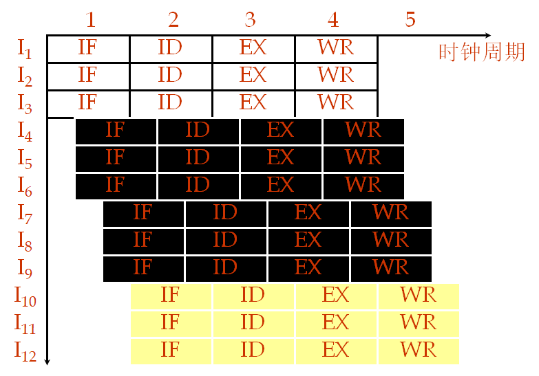

##### 性能分析

指令级并行度为(m,n)的超标量超流水线处理机，连续执行N条指令所需要的时间为：$T(m,n)=(k+\frac{N-m}{m\cdot n})\Delta t$

超标量超流水线处理机相对于单流水线标量处理机的加速比为：
$$
\begin{aligned}
&\begin{aligned}S(m,n)=\frac{S(1,1)}{S(m,n)}=\frac{(k+N-1)\Delta t}{(k+\frac{N-m}{mn})\Delta t }\end{aligned} \\
&S(m,n)=\frac{m\cdot n\cdot(k+N-1)}{m\cdot n\cdot k+N-m}
\end{aligned}
$$
、

## 六、向量处理机

- 向量处理机是解决数值计算问题的一种高性能计算机结构
- 向量处理机一般都采用流水线结构，有多条流水线并行工作
- 向量处理机通常属大型或巨型机，也可以用微机加一台向量协处理器组成
- 一般向量计算机中包括有一台高性能标量处理机
- 必须把要解决的问题转化为向量运算，向量处理机才能充分发挥作用

向量处理机

提高流水性能方法：

- 增加流水线段数，以减少Δt；
- 每个时钟同时启动多条指令；
- 减少相关，减少功能变换次数，增加处理指令条数。

向量操作特点：

- 1.向量元素间操作相互独立，且为相同操作。
- 2.相当于标量循环，对指令带宽的访问要求不高。
- 3.可采用多体交叉存储器，减少访存延迟。

  向量操作很适合于流水处理或并行处理。

### 向量的基本概念

#### 向量处理方式

根据向量运算的特点和向量处理机的类型选择向量的处理方式。

有三种处理方式：

1. 横向处理方式，又称为水平处理方式，横向加工方式等。向量计算是按行的方式从左至右横向地进行。
   - 不适合向量机

2. 纵向处理方式，又称为垂直处理方式，纵向加工方式等。向量计算是按列的方式自上而下纵向地进行。

3. 纵横处理方式，又称为分组处理方式，纵横向加工方式等。横向处理和纵向处理相结合的方式。
   - 将长度为n的向量分成若干组，每组长度为m，组内按纵向方式处理，依次处理各组。

### 向量处理机结构

向量处理机在系统结构方面所采用的主要技术都是设法维持连续的数据流，调整操作的

存储器-存储器结构

寄存器-寄存器结构

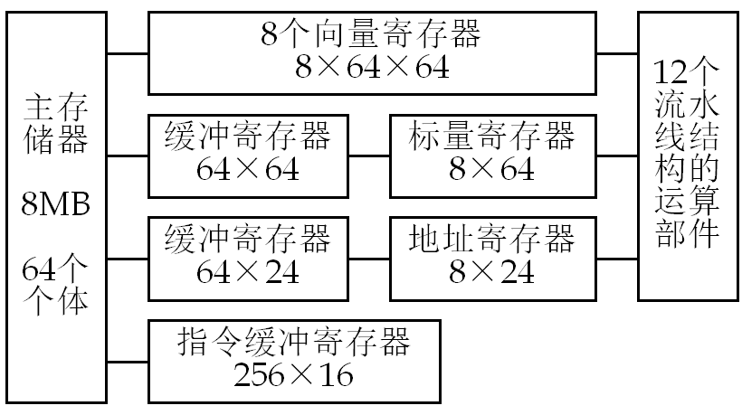

## 七、互联网络

由开关元件按照一定的拓扑结构和控制方式构成的网络，用于实现计算机系统内部多个处理机或多个功能部件之间的相互连接

- 并行计算机架构核心
- 许多权衡
  - 优雅数学结构

