# 计算机组成原理

## 第一章 计算机系统概论

### 计算机发展历史

计算机是由软件+硬件组成的

#### 计算机分类方式:star::star::star:

- 按处**理机性能**和**价格**分类
- 按大小分类：**巨型、大型、中型、小型、微型机**
- 按用途分：个人移动设备、科学计算、事务处理、实时控制、工作站、服务器、家用计算机等。
  - 集群/仓储级计算机（Clusters / Warehouse Scale Computers）
    - 每个数据中心包含10+万个处理器核，专门的应用程序，加上虚拟机的云托管
    - 现在越来越多地使用gpu、fpga和定制硬件来加速工作负载
    - 强调可用性和性价比(availability、price-performance、energy)
  - 嵌入式计算机/物联网（Embedded Computers / Internet of Things）
    - 有线/无线网络基础设施，打印机
    - 消费类产品( TV/Music/Games/Automotive/Camera/MP3)和物联网
    - 强调价格、能耗及面向特定应用的性能
- 按数据类型分：定点计算机、浮点计算机、向量计算机、堆栈计算机等
- 按处理机个数和种类划分：单处理机，并行处理机、多处理机、分布处理机，关联处理机，超标量处理机，超流水线处理机，VLIW处理机，SMP(对称多处理机)、MPP(大规模并行处理机)、机群(Cluster)系统等
- 按“并行级”和“流水线”分类：Handler表示法

  - 根据可并行和流水处理的程度，将硬件分成三个层次：

    - 程序控制部件（PCU）的个数k；
    - 算术逻辑部件（ALU）或处理部件（PE）的个数d；
    - 每个算逻部件包含基本逻辑线路（ECL）的套数w。

  - 每一个计算机系统都可以用上述三个参数表示其结构特征，即：t（系统型号）=（k，d，w）

  - 为了更细致的反映结构特殊性，表示式可写成：t（系统型号）=（k×k’，d×d’，w×w’）

  - 其中：k’表示宏流水线中程序控制部件的个数；
        d’表示指令流水线中算术逻辑部件的个数；
        w’表示操作流水线中基本逻辑线路的套数。

  - 各层次的数值越大越好。
- 按控制方式分类

  - 控制流方式：顺序执行 （冯·诺依曼型）
  - 数据流方式：操作数到位即可运算，无序执行
  - 规约方式：驱动方式与数据流相反，无序执行
  - 匹配方式：非数值型应用，主要对象为符号
  - 对不同类型结构，并行程度越大越好
- 按系统结构风格分类

  - 面向堆栈型、面向寄存器型、面向对象型等

##### 基于流（Flynn分类法）:star:

1. 模型中的重要概念

   指令流（Instruction Stream）：机器执行的指令序列；

   数据流（Data stream）：由指令处理的数据序列；

   多倍性（Multiplicity）：在系统最窄的部件上，处于同一执行阶段的指令和数据的最大可能个数。

2. 模型中的基本模块

   MM（Memory Module）：内存模块。

   PU（Process Unit）：处理单元

   CU（Control Unit）：控制单元

3. 按照**指令流和数据流的多倍性（原理）**，Flynn将 CA 分成4种：

   1. **单指令流单数据流(SISD)**：一个CU从MM读取一个指令，并操控PU对MM操作
   2. **单指令流多数据流(SIMD)**：同一指令由多个使用不同数据流的处理器执行。开发数据级并行
   3. **多指令流单数据流(MISD)**:  目前为止，还没有这种类型的商用多处理器，但包含这种类型之后，这种简单的分类方式变得更完整。
   4. **多指令流多数据流(MIMD)**: 每个处理器都提取自己的指令，对自己的数据进行操作，它针对的是任务级并行。

> 分类缺点：
>
> 1. 分类太粗
>
>    - 在SIMD中包括有多种处理机
>
>    - 对流水线处理机的划分不明确，
>
>    - 标量流水线为SISD，向量流水线为SIMD
>
>
> 2. 根本问题是把两个不同等级的功能并列对待     
>    - 数据流受指令流控制，造成MISD不存在
>
>
> 3. 没有区分非冯计算机的分类

##### 库克分类法：按控制流和执行流分类:star:

- 单指令流单执行流 (Single Instruction Single Executionstream, SISE) ，典型的单处理机

- 单指令流多执行流 (Single Instruction Multiple Executionstream, SIME)，多功能部件处理机、相联、向量、流水线、超流水线、超标量

- 多指令流单执行流 (Multiple Instruction Single Execution stream, MISE) 多道程序系统 

- 多指令流多执行流 (Multiple Instruction Multiple Execution stream, MIME) 典型的多处理机

##### 冯氏分类法:star:

以最大并行度作为系统结构分类的标准，最大并行度的数值越大越好。

所谓最大并行度 $P_m$ 是指一个系统在单位时间内能够处理的最多的二进制位数，显然这是一个完全由计算机硬件结构决定的参数。

- 字串位串（WSBS）：*n* = 1，*m* = 1。这是最早期全串行运算的计算机。

- 字并位串（WPBS）：*n* > 1，*m* = 1。这是传统的并行单处理机。

- 字串位并（WSBP）：*n* = 1，*m* > 1。每处理机只一位，但有许多个处理机字并行运用

- 字并位并（WPBP）：*n* > 1，*m* > 1。

  W – Word；B – Bit；S – Serial；P – Parallel；位宽代表一个位片中能同时处理的字数，字宽代表一个字中的bit数

- 平均并行度

  - 如果在一个时钟周期$\Delta t_i$内实际处理的二进制位数为$P_i$，那么在T个时钟周期内的平均并行度$P_a$就为：
    $$
    P_a=\left(\sum_{i=1}^T P_i\right) / T
    $$

  - 把平均并行度与最大并行度之比称为平均利用率，用μ表示为：
    $$
    \mu=P_a/P_m=\frac{\sum^T_{i=1}P_i}{T \bullet P_m}
    $$

### 计算机系统的层次结构

- 应用语言机器 面向用户

- 高级语言机器 面向用户

- 汇编语言机器 面向用户

- 操作系统机器 面向上层机器

- 传统机器 面向上层机器

- 微指令机器 面向上层机器

#### 冯诺伊曼计算机

- 计算器由 **运算器、存储器、控制器、输入设备、输出设备** 五大设备组成
- 指令和数据以同等地位存放于存储器中，按地址访问
- 指令和数据均用二进制存储
- 指令由**操作码和地址码**组成，操作码指明操作的性质，地址码表示操作数在存储器中的位置
- 指令在存储器内顺序存放
- 机器以**运算器**为核心

#### 计算机的功能部件

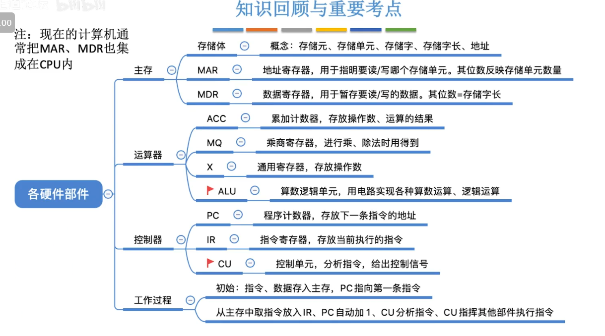

1. 输入设备，是指将外部信息以计算机能读懂的方式输入进来，如键盘，鼠标等

2. 输出设备，就是将计算机处理的信息以人所能接受的方式输出出来，比如显示屏，打印机。

##### 存储器的组成

- 主存储器（内存储器，CPU能直接访问）
  - 由地址寄存器(MAR)，数据寄存器(MDR)，存储体，时序控制逻辑，地址寄存器存放访存地址，经过地址译码后找到所选的存储单元
  - 时序控制逻辑用于产生存储器操作所需的各种时序信号
- 辅助存储器（外存储器，协助主存储器记忆更多的信息，辅助存储器的信息需要导入到主存储器中，才可以被CPU访问）

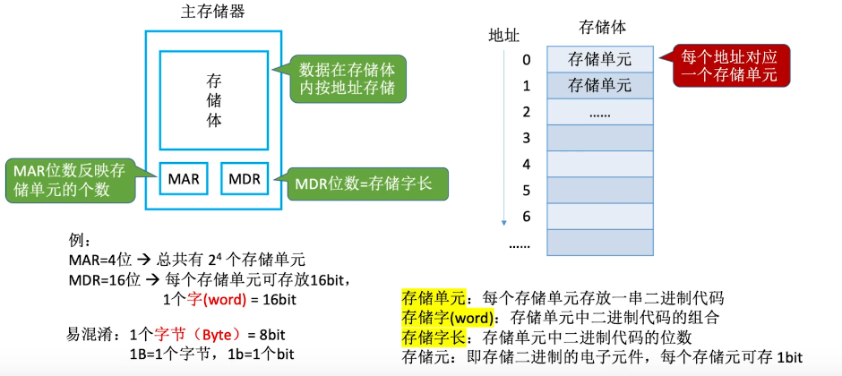

##### 运算器的组成

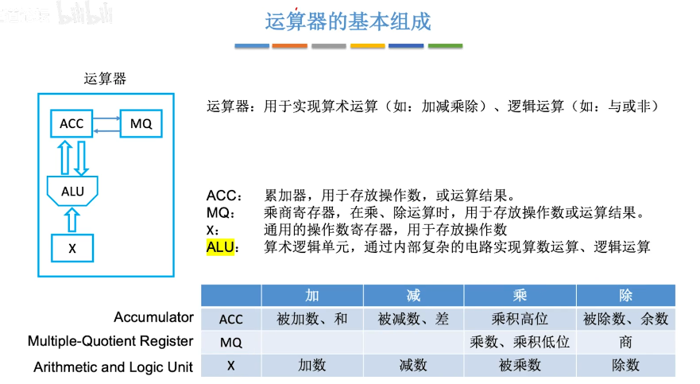

##### 控制器组成

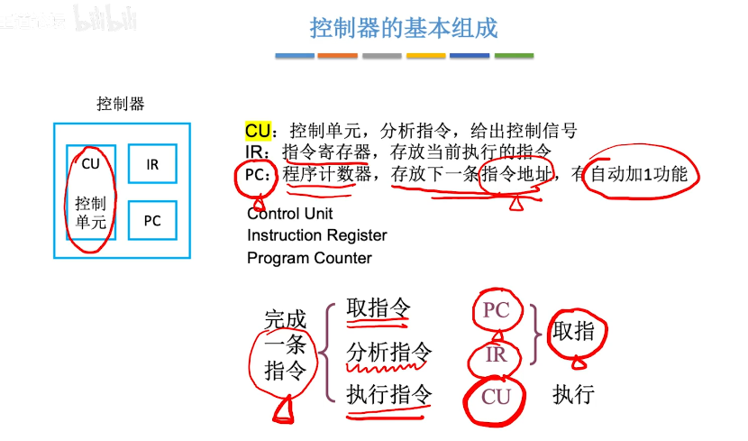

#### 计算机软件的分类

系统软件和应用软件

- 系统软件包括操作系统，数据库管理系统，语言处理系统，分布式软件系统，网络软件系统，标准库系统，服务性系统。
- 应用软件包括各种科学计算类程序，工程设计类程序，数据统计与处理程序。

三个级别的语言

- **机器语言**。又称二进制代码语言，需要编程人员记忆每条指令的二进制编码。机器语言是计算机唯一可以直接识别和执行的语言。
- **汇编语言**。汇编语言用英文单词或其缩写代替二进制的指令代码，更容易为人们记忆和理解。使用汇编语言编辑的程序，必须经过一个称为汇编程序的系统软件的翻译，将其转换为计算机的机器语言后，才能在计算机的硬件系统上执行。
- **高级语言**。高级语言是为方便程序设计人员写出解决问题的处理方案和解题过程的程序。通常高级语言需要经过编译程序编译成汇编语言程序，然后经过汇编操作得到机器语言程序，或直接由高级语言程序翻译成机器语言程序。

#### 解释和编译:star:

**编译（Compile）**的过程是把整个源程序代码翻译成另外一种代码，翻译后的代码等待被执行或者被优化等等，发生在运行之前，产物是**另一份代码**。

**解释（Interpret）**的过程是把源程序代码一行一行的读懂，然后一行一行的执行，发生在运行时，产物是**运行结果**。

### 计算机性能标准

#### 衡量计算机性能的主要标准

工作能力指标：

- 处理能力——单位时间内能处理的信息量（吞吐率）。
- 响应能力——响应时间、周转时间、排队时间。
- 利用率——$T$时间内，某部分被使用时间$t$与$T$的比值。

数据通路带宽：数据总线一次所能传送信息的位数

例如，数据总线的传输速率为266 MHz，总线的宽度为32位（4字节），那么该数据总线的带宽就达到2.1GB/s（266MHz×4B）。

#### 系统处理能力:star::star:

> CPI：执行一条指令所需的时钟周期数
>
> CPI 不适合作为计算机系统整体的评估模块
>

> CPU执行时间，指运行一个程序所花费的时间。
> CPU执行时间 = CPU时钟周期数/主频 = (指令条数xCPI)/主频
> CPU的性能取决于三个要素:主频、CPI 、指令条数

> - IPS(Instructions Per Second) =主频/平均CPI，每秒执行多少指令
>
> - MIPS(Million Instructions Per Second)=即每秒执行多少百万条指令。
>   $$
>   MIPS=\frac{指令条数}{执行时间\times 10^6}=\frac{时钟频率}{CPI\times 10^6}
>   $$
>
> - 
>   MFLOPS(Mega Floating-point Operations Per Second)=浮点操作次数/(执行时间x106),即每秒执行多少百万次浮点运算。
>
> - 
>   GFLOPS(Giga Floating-point Operations Per Second)=浮点操作次数/(执行时间x109)，即每秒执行多少十亿次浮点运算。
>
> - 
>   TFLOPS(Tera Floating-point Operations Per Second)=浮点操作次数/(执行时间x1012)，即每秒执行多少万亿次浮点运算。
>

##### 基准测试程序

基准测试程序通常可以分为两类：

1. 一类用于测试系统中所用的元部件，如CPU（针对指令系统测试）、硬盘（针对IO操作测试）等，

2. 另一类则用来对全系统的性能进行测试（针对程序测试）。

#### 多机系统性能评价

1. 性能加速比：P为问题大小，n为处理机数，h为通信开销
   $$
   S(p,n)=\frac{T(p,1)}{T(p,n)+h(p,n)}
   $$

2. 性能可伸缩性

   定义：对一个给定的应用问题，系统性能随PE数增加而线性增长的性能

   影响因素：PE数，时钟频率，问题大小，求解时间等。

   评价方法：选择某参考机作为比较参照机，测量后得出性能可伸缩性值。

## 第二章 数据的表示与运算

## 第三章 系统总线

#### 3.2 总线的分类

##### 按位置分

1. 片内总线

##### 按传输内容分

1. 数据
2. 地址
3. 控制总线

##### 按数据格式

- 串行总线
  - 只需要一根线
- 并行总线
  - 可以传输若干数据
  - 信号线数量多，频率高的时候会产生严重干扰

#### 3.3 系统总线的结构

- 单总线
  - 都连接在一组总线上
- 双总线
  - 主存总线和IO总线
- 三总线
  - IO和主存间有DMA总线

#### 3.5总线控制

主设备：对总线有控制权

从设备：响应总线命令

##### 总线判优控制的分类：

集中判优方式：

1. 链式查询
2. 计数器查询
3. 独立请求方式

分布判优方式：

 定义：不需要中央仲裁器，每个潜在的主模块都有自己的仲裁器和仲裁号，多个仲裁器竞争使用总线。

#### 3.6 总线操作和定时

##### 同步通信：由统一时钟控制

同步通信适用于总线长度较短及总线所接部件的存取时间比较接近的系统。

##### 异步通信（异步定时方式）：采用应答方式，没有公共时钟标准

适合速度不匹配的设备间的数据传输，提供给用户灵活性

> 1)不互锁方式：速度最快 可靠性最差
>
> 主设备发出“请求”信号后,不必等到接到从设备的“回答”信号,而是经过一段时间,便撤销“请求”信号。
>
> 而从设备在接到“请求”信号后,发出“回答”信号,并经过一段时间,自动撤销“回答”信号。双方不存在互锁关系。
>
> 2)半互锁方式：
>
> 主设备发出“请求”信号后,必须待接到从设备的“回答”信号后,才撤销“请求”信号,有互锁的关系。
>
> 而从设备在接到“请求”信号后,发出“回答”信号,但不必等待获知主设备的“请求”信号已经撤销,而是隔一段时间后自动撤销“回答”信号,不存在互锁关系。
>
> 3)全互锁方式：最可靠 速度最慢
>
> 主设备发出“请求”信号后,必须待从设备“回答”后,才撤销“请求”信号;
>
> 从设备发出“回答”信号,必须待获知主设备“请求”信号已撤销后,再撤销其“回答”信号。双方存在互锁关系。

##### 半同步通信：同步、异步结合

>  同步：发送方用系统时钟前沿发信号
>
>  接收方用系统时钟后沿判断、识别
>
>  异步：允许不同速度的模块和谐工作
>
>  半同步通信:统一时钟的基础 上,增加一个“等待”响应信号WAIT

##### 分离式通讯：都是主模块

> 得到总线使用权后，发送数据，不等待对方的回答信号，使得总线保持有效工作

## 第四章 存储器

存储方式分类：
RAM 随机存储器

ROM 只读存储器

**缓存-主存** ：解决 **速度** 需求

**主存-辅存** ：解决 **容量** 需求

CPU与Cache连接方式

- CPU在片内连接Cache比在片外连接Cache具有更高的速度指标
- CPU与Cache之间的数据通道越多，则速度越快
- 一级CACHE集成在CPU同一芯片内，二级一般也在CPU同一芯片内，有的在芯片外；有的CPU还提供专门通道连结第三级CACHE。
- 体系结构改善：为Cache设计足够宽的通道、尽量把Cache设计在CPU芯片内，但是这会相应增加制造难度和成本。

#### 存储器的选择

1. 确定地址
2. 确定片选
3. 确定cpu地址线，数据线，片选线
3. 注意几根线W/R线

#### 汉明码

偶校验 1，2，4，8是校验位

分组：第几组的校验内容是倒数第几位是1的数

偶校验的话是校验位加检验组异或为0

#### Cache主存地址映射

1. 直接映射
2. 全相联映射
3. 组相联映射

## 第五章 输入/输出系统

### 输入/输出原理

输入/输出系统：**处理机与主存储器之外的部分**

包括**输入输出设备**、**输入输出接口**和**输入输出软件**

#### 输入输出系统的特点

- 处理机与外界进行数据交换的通道
- 异步性
  - 输入输出系统通常没有统一的中央时钟，各个设备按照自己的时钟工作
  - 外围设备与外围设备之间能并行工作
- 实时性
  - 如果处理机提供服务不及时，可能丢失数据，或造成外围设备工作的错误
  - 对于处理机本身的硬件或软件错误：如电源故障、数据校验错、页面失效、非法指令、地址越界等，处理机必须及时处理。
  - 对不同类型的设备，必须具有与设备相配合的多种工作方式。
- 与设备无关性
  - 独立于具体设备的标准接口
  - 处理机采用统一的硬件和软件对品种繁多的设备进行管理。

#### 输入输出系统的组织方式

- 针对实时性，采用层次结构的方法。
  - 最内层是输入输出处理机、输入输出通道等。
  - 中间层是标准接口。
  - 标准接口通过设备控制器与输入输出设备连接。
- 针对与设备无关性，采用分类处理的方法。
  - 面向字符的设备，如字符终端、打字机等
  - 面向数据块的设备，如磁盘、磁带、光盘等。
- 针对异步性，采用自治控制的方法。
  - 输入输出系统是独立于CPU之外的自治系统处理机与外围设备之间要有恰当的分工

### I/O系统基本概念

#### 输入/输出系统

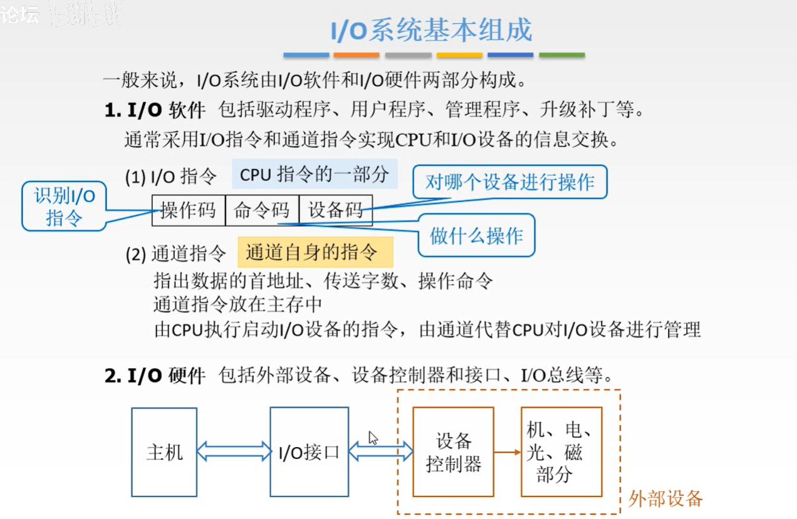

### I/O设备

#### 设备类型

输入设备：键盘鼠标

输出设备：打印机显示器

外存设备：磁盘、机械硬盘、固态硬盘、光盘

### I/O接口

#### I/O接口概念

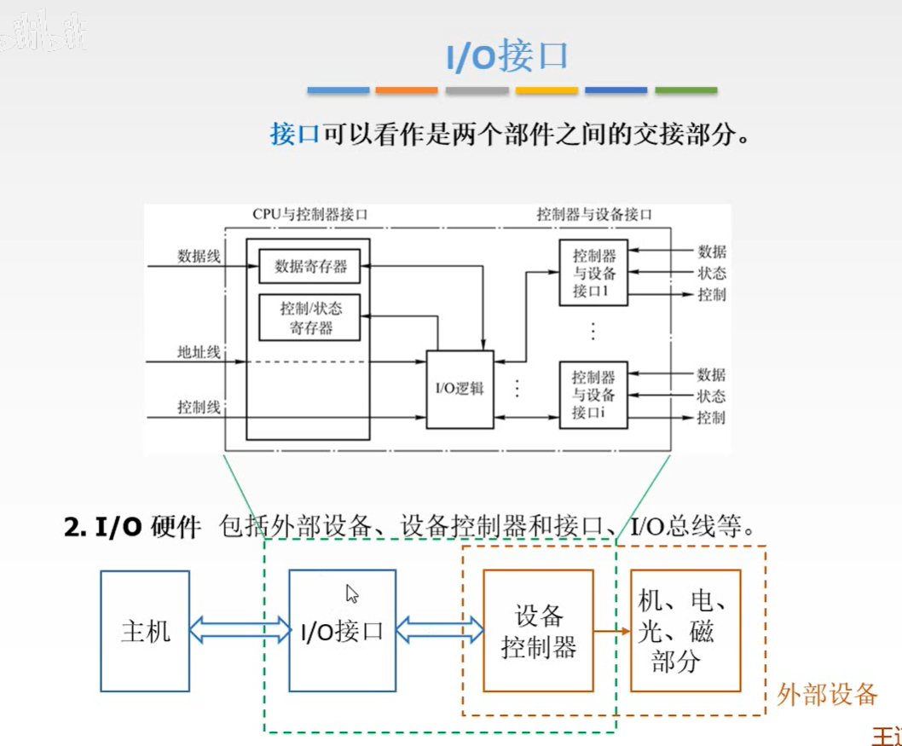

**I/O接口 是主机与I/O设备之间设置的一个硬件电路及其相应的软件控制**

接口的功能（需要解决的问题）：

- 实现设备选择和地址译码
- 传送命令的功能：有存放命令的命令寄存器以及命令译码器
- 传送数据的功能：数据缓冲器
- 信号格式转换
- 反映I\O设备工作状态的功能：完成触发器D和工作触发器B

接口类型：

- 按数据传送方式分类：并行接口和串行接口
- 按功能选择的灵活性分类：可编程接口和不可编程接口
- 按通用性分类有通用接口和专用接口
- 按数据传送的控制方式分类：程序型接口和DMA接口

#### 访问I/O的基本流程

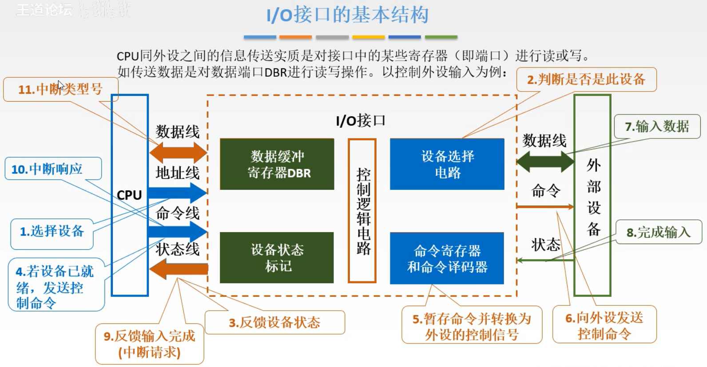

#### I/O端口

I/O端口是指接口电路中可以被CPU直接访问的寄存器

#### I/O编址方式

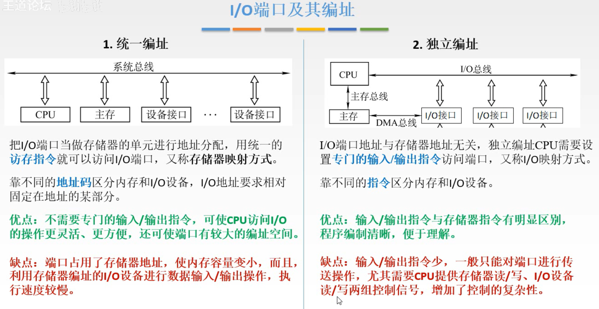

### I/O方式

#### 程序查询方式

只要启动I/O设备，CPU就在不断查询能否读取数据，导致CPU等待，不能继续执行程序。

程序控制输入输出方式有4个特点：

1. 何时对何设备进行输入输出操作受CPU控制。
2. CPU要通过指令对设备进行测试才能知道设备的工作状态。如：闲、准备就绪、忙碌等
3. 数据的输入和输出都要经过CPU。
4. 用于连接低速外围设备，如终端、打印机等。

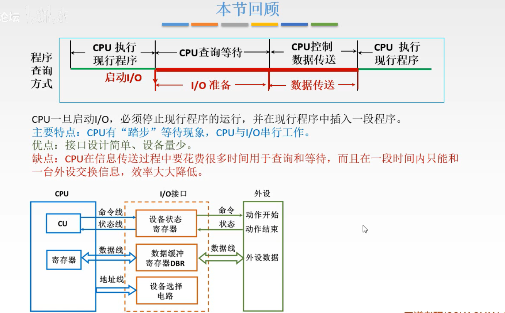

##### 例题

问：一个处理机在一段时间内只能管理一台打印机。处理机执行指令的速度为1GIPS，字长32位，打印机每秒钟100个字符？
解：处理机用一条指令就能向打印机传送4个字符。因此，处理机的实际利用率只有即4千万分之一。 
$$
100/10^9\times 4＝0.25\times 10^{-7}
$$

#### 程序中断方式

CPU启动I/O设备后，不查询设备是否已就绪，继续执行自身的程序，只是当I/O设备准备就绪并向CPU发出中断请求后才予以响应。

特点：

1. CPU与外围设备能够**并行工作**。
2. 能够处理例外事件。
3. 数据的输入和输出都要经过CPU。
4. 用于连接低速外围设备。

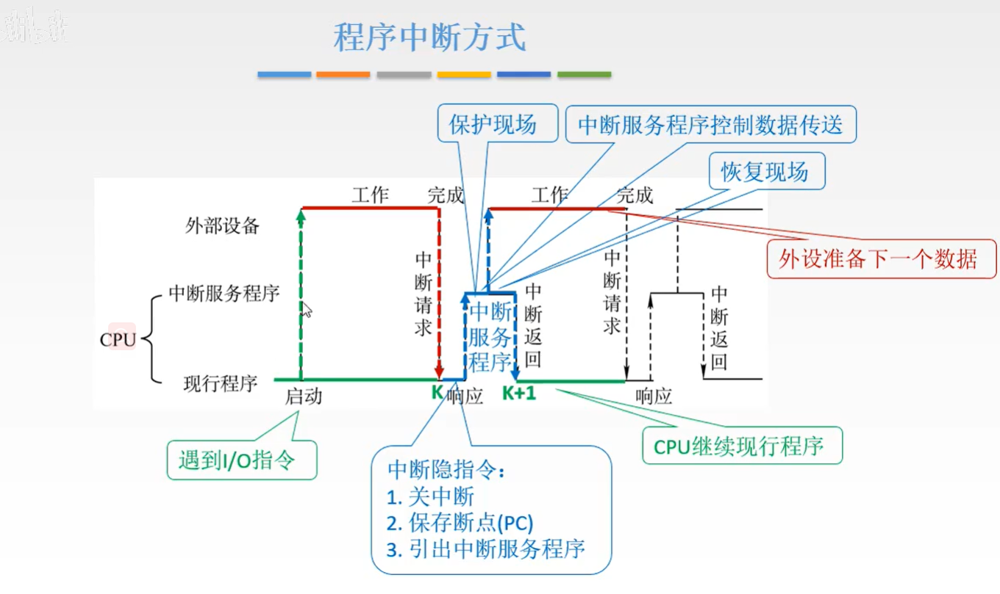

#### DMA方式

直接存储器访问方式(DMA：Direct Memory Access)，主要用来连接高速外围设备。如磁盘存储器，磁带存储器、光盘辅助存储器，行式打印机等。

主存和I\O设备中有一条数据通路，主存与I\O设备交换信息时，无须调用中断服务程序。若出现DMA和CPU同时访问主存，CPU总是将总线占有权让给DMA，通常把DMA的这种占有称为窃取或挪用。窃取的时间一遍为一个存储周期，故又把DMA占用的存储周期称为窃取周期

- DMA在I/O设备和主存之间自动传输数据，中断 / 轮询完成
  - 通过内存映射寄存器编程的直接存储器存取
  - 外围设备的访问请求直接发往主存储器，数据的传送过程不需要CPU的干预。
  - 全部用硬件实现，不需要做保存现场和恢复现场等工作。
  - DMA控制器复杂，需要设置**数据寄存器、设备状态控制寄存器、主存地址寄存器、设备地址寄存器和数据交换个数计数器**及控制逻辑等。
  - 在DMA方式开始和结束时，需要处理机进行管理。

**DMA输入设备的工作流程如下：**

- 从设备读一个字节到DMA控制器中的数据缓冲寄存器中。
- 若一个字没有装配满，则返回到上面；若校验出错，则发中断申请；若一个字已装配满，则将数据送主存数据寄存器。

- 把主存地址送主存地址寄存器，并将主存地址增值。

- 把DMA控制器内的数据交换个数计数器减１。

- 若交换个数为0，则DMA数据传送过程结束，否则回到上面

**DMA输出设备的工作流程如下：**

- 把主存地址送入主存地址寄存器，并启动主存储器，同时将主存地址增值。
- 将主存数据寄存器中的数据送DMA控制器的数据寄存器。

- 把数据写到输出介质上（可能要逐个字符输出）。

- 把DMA控制器内的数据交换个数计数器中的内容减１。

- 若交换个数为0，则DMA数据传送过程结束，否则回到上面。

目前使用DMA的方式：

- 周期窃取方式：
  - 在每一条指令执行结束时，CPU**测试**有没有DMA服务申请。
  - 借用CPU完成DMA工作流程。包括数据和主存地址的传送，交换个数计数器减1，主存地址的增值及一些测试判断等。
  - 周期窃取方式的**优点**是硬件结构简单，比较容易实现。
  - 缺点是在数据输入或输出过程种实际上占用了CPU的时间。
- 直接存取方式：
  - 整个工作流程全部用硬件完成。
  - 优点与缺点正好与周期窃取方式相反。

- 数据块传送方式：
  - 在设备控制器中设置一个比较大的数据缓冲存储器。设备控制器与主存储器之间的数据交换以数据块为单位，并采用程序中断方式进行。	
  - 采用数据块传送方式的外围设备有软盘驱动器、行式打印机、激光打印机、卡片阅读机、绘图仪等。

作。

### 通道处理机

通道处理机的作用主要是在外围设备种类、数量很多的情况下把外围设备的管理工作从CPU中分离出来。

处理机与外部设备的连接方式：

- 直接连接
- 通道处理机
- 输入输出处理机

I/O指令和通道指令有何区别？

- I/O指令是CPU指令系统的一部分，是CPU用来控制输入/输出操作的指令，由CPU译码后执行。在具有通道结构的机器中，I/O指令不实现I/O数据传送，主要完成启、停I/O设备，査询通道和I/O设备的状态，及控制通道进行其他一些操作等。
- 通道指令是通道本身的指令，用来执行I/O操作，如读、写、磁带走带及磁盘找道等操作

三种基本输入输出方式存在的问题：

1. CPU的输入输出负担很重，不能专心用于用户程序的计算工作。
2. 低速外围设备，每传送每个字符都由CPU执行一段程序来完成。

3. 高速外围设备的初始化、前处理和后处理等工作需要CPU来完成。

4. 大型机中的外围设备台数很多，但一般并不同时工作。让DMA控制器能被多台设备共享，提高硬件的利用率

#### 通道的作用和功能:star:

通道处理机能够负担外围设备的大部分输入输出工作，包括管理所有**按字节传输方式工作**的低速和中速外围设备，按**数据块传输方式工作**的高速设备。对DMA接口初始化，设备故障的检测和处理。

可以看作一台能够执行**有限输入输出指令**，并且能够被多台外围设备共享的小型DMA专用处理机。

在一台大型计算机系统中可以有多个通道，一个通道可以连接多个设备控制器，一个设备控制器又可以管理一台或者多台外围设备。形成典型的I/O系统四层结构。

通道的主要功能：

- 接受CPU发来的指令，选择一台指定的外围设备与通道相连接。
- 执行CPU为通道组织的通道程序。

- 管理外围设备的有关地址。

- 管理主存缓冲区的地址。

- 控制外围设备与主存缓冲区之间数据交换的个数（传送计数）。

- 指定传送工作结束时要进行的操作。

- 检查外围设备的工作状态。

- 在数据传输过程中完成格式变换。

#### 通道的工作过程

通道完成一次数据输入输出的过程分为三步：

1. 在用户程序中使用访管指令进入管理程序，由CPU通过管理程序组织一个通道程序，并启动通道。
2. 通道处理机执行通道程序，完成指定的数据输入输出工作。

3. 通道程序结束后再次调用管理程序进行处理。

每完成一次输入输出工作，CPU只需要两次调用管理程序（两次中断）。

#### 三种通道及传输方式:star::star:

1. 字节多路通道

   - 为**多台**低中速的外围设备服务。字节交叉，“分时复用”

      - 有多个子通道，每个子通道连接一个控制器。

2. 选择通道

   - 为多台高速外围设备服务

      - 只有一个以成组方式工作的子通道，在**一段时间内只为一台高速外设`独占使用`**。

      - 高速外围设备必须设置专门通道在一段时间单独为一台外围设备服务，不同时间可以选择不同设备。一旦选中，通道进入忙状态。直至数据传输结束。

3. 数组多路通道

   - 字节多路通道和选择通道的结合。
   - 每次为一台高速设备传送一个数据块，并轮流为多台外围设备服务。
   - 从磁盘存储器读出文件的的过程分为三步：定位、找扇区、读出数据
   - 数组多路通道的实际工作方式：在为一台高速设备传送数据的同时，有多台高速设备可以在定位或者在找扇区（查找扇区的时间远长于传输时间）。
   - 与选择通道相比，数组多路通道的数据传输率和通道的硬件利用都很高，控制硬件的复杂度也高。

#### 通道流量分析 :star::star:

通道流量：单位时间内能够传送的最大数据量。又称通道吞吐率，通道数据传输率等。

通道最大流量：通道在满负荷工作状态下的流量。

通道流量与连接在通道上的设备的数据传输率的关系如下：
$$
f_{BYTE}=\sum_{i=1}^pf_i\quad f_{SELETE}=\operatorname*{Max}_{i=1}^pf_i\quad f_{BLOCK}=\operatorname*{Max}_{i=1}^pf_i
$$
三种通道的最大流量计算公式：
$$
\begin{aligned}
&\begin{aligned}f_{MAX.BYTE}&=\frac{p\cdot n}{(T_S+T_D)\cdot p\cdot n}=\frac{1}{T_S+T_D}\text{字节/秒}\end{aligned} \\
&\begin{aligned}f_{MAX.SELETE}&=\frac{p\cdot n}{(T_S/n+T_D)\cdot p\cdot n}=\frac{1}{T_S/n+T_D}\text{字节/秒}\end{aligned} \\
&\begin{aligned}f_{MAX.BLOCK}&=\frac{p\cdot n}{(T_S/k+T_D)\cdot p\cdot n}=\frac{1}{T_S/k+T_D}\text{字节}/\text{秒}\end{aligned}
\end{aligned}
$$
Ts：设备选择时间（准备时间）
Td：传送一个字节所用的时间
p: 在一个通道上连接的设备台数，且这些设备同时都在工作。
n: 每台设备需要传输的字节数，这里假设每台设备传输字节数都一样
K: 数组多路通道传输一个数据块中所包含的字节数
T: 通道完成全部数据传送工作所需要的时间

为保证通道不丢失数据，通道的实际流量应不大于通道最大流量

### 输入输出处理机

通道处理机存在如下问题：

1. 每完成一次输入输出操作要两次中断CPU的现行程序。

2. 通道处理机不能处理自身及输入输出设备的故障。

3. 数据格式转换、码制转换、数据块检验等工作要CPU完成。

4. 文件管理、设备管理等工作，通道处理机本身无能为力。

根据是否共享主存储器分为：

1. 共享主存储器的输入输出处理机。
2. 不共享主存储器的输入输出处理机。

根据运算部件和指令控制部件是否共享分为：

1. 合用同一个运算部件和指令控制部件：造价低，控制复杂。
2. 独立运算部件和指令控制部件：独立运算部件和指令控制部件已经成为主流。

#### 输入输出处理机的作用

输入输出处理机的多种组织方式：

- 多个输入输出处理机从功能上分工。
- 以输入输出处理机作为主处理机。
- 采用与主处理机相同型号的处理机作为输入输出处理机。
- 采用廉价的微处理机来专门承担输入输出任务。

### 中断系统

#### 中断的基本定义

当出现来自 系统外部，机器内部，甚至处理机本身的异常或者特殊情况，**CPU暂停执行现行程序，转去处理这些事件，等处理完成后再返回来继续执行原先的程序。**

#### 中断的基本流程

1. 中断请求
   - 中断源向CPU发送中断请求信号
2. 中断响应
   - 响应中断的条件
   - 选择优先级最高的中断请求
3. 中断处理
   - 中断隐指令
   - 中断服务程序

#### 中断请求的分类

- 中断系统需要**硬件和软件**共同来实现，引起中断的各种事件称为**中断源**。
- 中断系统的复杂性实际上主要是由**中断源的多样性**引起的。
- 中断源可以来自**系统外部**，也可以来自**机器内部**，甚至**处理机**本身。
- 中断可以是硬件引起的，也可以是软件引起的。

##### 中断源的种类

- 内中断（异常、陷入）
  - 由**处理机本身**产生的中断：如算术溢出，除数为零，数据校验错等。
  - 由**存储器产生**的中断：如地址越界、页面失效、访问存储器超时等。
  - 由**控制器产生**的中断：如非法指令、堆栈溢出、时间片到、切换到特权态。
  - 由**总线产生**的中断：输入输出总线出错,存储总线出错等。
- 外中断（中断）
  - 由**外围设备**引起的中断：低速外围设备每传送一个字节申请一次中断；高速外围设备的前、后处理。
  - 程序调试过程中，由断点产生的中断。
  - 多处理机系统中，从其它处理机发送来的中断。
  - 实时过程控制产生的中断。

##### 中断源的分类组织

- 中断源分类组织的目的：在**响应中断后能尽快找到中断入口。**
- 根据中断事件的**紧迫程度**，中断源工作速度、性质等进行分类
- **为每一类中断源分配一个硬件的中断入口，**在进入这个入口之后，再通过软件找到具体的中断源。
- 可屏蔽中断与不可屏蔽中断，或称**一般中断和异常中断**。

##### 中断源的识别方法

**中断请求线**：

- 所有中断源共用一条中断请求线
- 处理机响应中断后都进入同一个程序入口
- 用软件找出申请中断的中断源
- 主要优点：灵活性好。主要缺点：速度慢。

**软件排队链法**：

- 设置一个中断请求寄存器，每个中断源在其中占据一位，并且按照中断的优先级从高位到低的顺序排列。
- 所有中断源使用同一条公共的中断请求线，进入公共中断源服务程序入口，其过程与查询法相同。
- 在公共中断服务程序入口，用一条特殊指令读出中断请求寄存器中的内容，并根据读出的内容直接进入中断服务程序。

**硬件排队链法**：

- 用硬件排队器和编码器，在所有请求中断服务的中断源中，找出具有最高优先级的中断源。
- 设置一个中断请求寄存器，每个中断源在其中中占据一位。
- 所有中断源使用同一条公共的中断请求线，进入公共中断源服务程序入口。
- 转入公共的中断服务程序后，用一条特殊指令直接读到所有请求中断服务的中断源中具有最高优先级的中断源编号。
- 特点：**识别中断源的速度更快**

中断向量法

- 在主存储器的固定区域中开辟出一个专用的**中断向量区**。
- 用硬件排队器和编码器在所有请求中断服务的中断源中，产生具有最高优先级的中断源编号。
- 隐含执行上面方法中的两条识别中断源的指令，直接通过硬件转向这个中断源的中断服务程序入口。 不需要进入公共中断服务程序，能够实现到中断程序的最快转移

独立请求法

- 各个中断源使用自己独立的中断请求线。每一根中断请求线在处理机中有固定的或可编程的中断优先级。
- 如果同时有多个中断源请求中断服务，通过仲裁线路立即选择具有最高优先级的中断源，并向它发出中断响应信号INIT，处理机就可以立即转入这个中断源的中断服务程序。
- 独立请求法实际上是把分布在各个中断源内的串行排队器都集中到处理机中，从而克服了串行排队链法可靠性差的缺点，但灵活性差的缺点仍然存在。

中断源用init信号清除中断请求信号。

不需要软件或硬件对中断源进行扫描，不需要中断源送回中断源编号或中断向量

分组独立请求法

- 把独立请求法与串行排队链法结合起来。
- 中断源分组：组内采用串行排队链法，组间采用独立请求法。

上面的2、3、4三种识别中断源的方法都属于串行排队链法：

- 串行排队链法的优点：
  - 识别中断源的速度比较快，特别是中断向量法。
  - 实现比较简单，中断源与处理机的连线很少。
- 串行排队链法的缺点：
  - 灵活性比较差，中断优先级是由硬件固定。不能由程序员通过软件修改。
  - 可靠性比较差，排队链串行分布在各个中断源中。一个出错，都出错。

#### 中断请求标记

每个中断源向CPU发出中断请求的时间是随机的。

中断请求标记触发器INTR：

- 用于记录是否产生中断
- 当其为1是，表示存在该类型的中断。
- 可以在CPU中，也可以在各个设备中

CPU响应中断应具备哪些条件？

1. 在CPU内部设置的中断屏蔽触发器必须是开放的
2. 外设有中断请求时，中断请求触发器必须处于“1”状态，保持中断请求信号。
3. 外设(接口)中断允许触发器必须为“1”，这样才能把外设中断请求送至CPU。

具备上述三个条件时，CPU在现行指令结束的最后一个状态周期响应中断。

#### 中断优先级

- 安排中断优先顺序主要由下列因素来决定：
  - 中断源的急迫性。
  - 设备的工作速度。
  - 数据恢复的难易程度。
  - 要求处理机提供的服务量。
- 中断优先级与中断服务顺序
  - 要求：**响应速度快，灵活性好**。
  - 做法：由硬件排队器决定**中断优先级**。
- **通过软件设置中断屏蔽码改变中断服务顺序**。

✋：在IBM 370系列机中，把7类中断分为5个中断优先级，从高到低分别是：

1. 紧急的机器检验错误引起的中断。
2. 调用管理程序，程序性错误，可以抑制的机器检验错误引起的中断。
3. 外部事件引起的中断。
4. 外围设备的中断。
5. 重新启动引起的中断。

✋：某处理机共有4个中断源，中断优先级从高到低分别是：1级、2级、3级和4级。当处理机在执行主程序时，同时有3级和2级两个中断源向处理机发出中断服务请求。当处理机为2级中断源服务时又有4级中断源发出中断服务请求。当处理机为４级中断源服务时又有１级中断源发出中断服务请求：

#### 中断处理方式

1. 现行指令结束，且没有更紧急的服务请求，CPU获得中断信号
2. 调用中断隐指令
   1. 关中断：为了保证中断现在不被新的中断所打断，保证中断服务程序能正常执行
   2. 保存断点：将原来的程序的断点保存，主要保存PC中的内容。
      - 撤消中断源的中断请求
      - 保存硬件现场，主要是PSW及SP等
      - 保存软件现场，在中断服务程序中使用的通用寄存器等
   3. 获取中断服务程序的入口地址，将地址传送给PC
      - 软件查询法
      - 硬件向量法
        - *中断向量地址的形成部件* 的输入时来自 *硬件排队器* 的输出IMTP1，INTP2...它的输出是中断向量地址，其位数与计算机可以处理中断源的个数有关，即一个中断源对应一个向量地址。
        - 向量地址对应一个中断向量，用于寻找设备的中断服务程序入口地址
3. 开CPU中断，可以响应更高级别的中断请求。
4. 执行中断服务程序
5. 关CPU中断。恢复软件现场，恢复屏蔽状态，恢复硬件现场
6. 开CPU中断。返回到中断点

#### 中断系统的软硬件分配

**恰当分配中断系统的软硬件功能**，是中断系统最关键问题。

必须用硬件实现的有：

- 保存中断点和进入中断服务程序入口。
- 这两个功能相当于执行一条转子程序指令，因为中断发生在现行程序的什么地方是不确定的，不能由程序员来安排。

必须用软件实现的有：

- 中断服务和返回到中断点。
- 返回到中断点，通过执行一条中断返回指令来实现。
- 中断服务必须用软件实现，因为是“程序中断方式”。

主要考虑的两个因素：

- **中断响应时间：中断响应时间是一个非常重要的指标。**
- **灵活性：硬件实现速度快，灵活性差；软件实现正好相反。**

##### 中断响应时间

定义：从**中断源向处理机发出中断服务请求开始**，到**处理机开始执行这个中断源的中断服务程序时为止**，这一段时间称为中断响应时间。

影响中断响应时间的因素主要有4个： (前2个属于处理机设计，后2个属于中断系统)

1. 最长指令执行时间 有些指令的执行时间很长，甚至无法预测。
2. 处理其它更紧急的任务所用时间 如处理DMA请求等。
3. 从第一次关CPU中断到第一次开CPU中断所经历的时间 中断系统的软件与硬件功能分配，主要就是要考虑这一段内要所的事情用软件来实现，还是用硬件来实现。
4. 通过软件找到中断服务程序入口所用时间 主要是第1和第3两部分。其中，第1部分是指令系统设计时考虑的问题，在中断系统的设计中，主要考虑第3部分。

#### 中断屏蔽⭐️⭐️

设置中断屏蔽有三个用处：

1. 在中断优先级由硬件确定了的情况下，改变中断源的中断服务顺序。
2. 决定设备是否采用中断方式工作。
3. 在多处理机系统中，把外围设备的服务工作分配到不同的处理机中。

中断屏蔽的实现方法主要有两种：

1. 每级中断源设置一个中断屏蔽位。
   - 中断屏蔽位可以分部在各个中断源中，也可以集中到处理机，如放到处理机的状态字中。
2. 改变处理机优先级
   - 中断优先级不仅在处理机相应中断源的中断服务请求时使用，而且为每个中断的中断服务程序也赋予同样的中断优先级。

两者的区别：

- 两者使用的概念不同。
  - 前者使用中断屏蔽，后者使用中断优先级。
- 需要屏蔽码的位数不同。
  - 前者所需要的屏蔽位数比较多，$n$：$log_2n$
- 可屏蔽的中断源数量和种类不同。
  - 前者可以任意屏蔽掉一个或几个中断源，后者只能屏蔽掉比某一个优先级低的中断源。

### I/O系统性能

#### I/O系统性能

- 连接特性 容量 响应时间 吞吐率 

-  考虑I/O操作对CPU的打扰情况。
   -  即考查某个进程在执行时，由于其他进程的I/O操作，使得该进程的执行时间增加了多少。 

##### 简单 Producer-Server 模型

- 吞吐量：

  - 服务器在单位时间之间内完成的任务

  - 为了获得尽可能高的吞吐量
    - 服务器不应该处于空闲
    - 队列不应该是空的

- 响应时间
  - 任务放入队列时开始，在被服务完成时结束
  - 最小化响应时间
    - 队列应该是空的
    - 服务应该处于空闲状态

*吞吐量* 和 *响应时间* 的函数应该是指数增长的

一般来说，吞吐量可以通过以下方式提高:

- 投入更多硬件
- 减少与负载相关的延迟

响应时间更难减少:

- 最终它会受到光速的限制(但我们离光速还很远)

##### 响应时间

- 系统响应时间 = I/O系统的处理时间 + CPU的处理时间
- **多线程技术**只能提高系统吞吐率，并不能减少系统响应时间
- 进程切换时可能需要增加I/O操作
- 可切换的进程数量有限，当I/O处理较慢时，仍然会导致CPU处于空闲状态

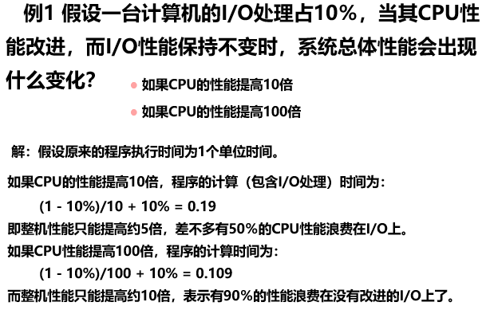

##### 连接特性

物理上的规定和标准只要是需要互联的，必须各方面一致，否则无法连接

接口尺寸，接口形式，协议的一致性每根线的定义，电压，电流，频率等

#### I/O数据传输的三个要求

1. 数据位置
   - 必须选择正确的设备
   - 数据必须能在该设备内寻址
   - 一旦选择正确的设备，数据位置可能就变得微不足道了
     - 从键盘获取数据
   - 位置可能需要搜索
     - 磁道需要选择和旋转
   - 位置可能不是简单的二进制数字
2. 数据传输
   - 需要指定设备
   - 传输速率因设备而异
     - 键盘最快的可能就1秒10字节，但是磁盘块可能会快很多
   - 数据可以是输出、输入
3. 同步
   - 不仅I/O速率与处理器速度差别很大，而且I/O是异步的
   - CPU只能在时钟周期间隔询问I/O状态和传输信息，I/O状态和信息在被访问时必须是稳定的
   - 对于输出设备，只有设备准备好接收数据时才必须发送数据
   - 对于输入设备，处理器只有在设备可用时才能读取数据

#### 如何在数据传输中减少定位和同步

- 不同设备的数据结构不同，设备需要翻译地址
  - 处理器选择设备，但是地址只是处理器发送给设备的一个消息
- 处理器在读取读取设备状态时可以解决同步问题
- 为了提高速度，我们需要更高效的同步方法：DMA 和 中断

#### I/O系统可靠性能的参数:star::star:

反映存储外设可靠性能的参数有：

- 可靠性
  - 系统从某个初始参考点开始一直连续提供服务的能力。
  - **平均无故障时间MTTF**来衡量
  - 系统中断服务的时间用**平均修复时间MTTR**来衡量
  - 系统的失效率 = MTTF的倒数
  - 如果系统中每个模块的生存期服从指数分布，则**系统整体的失效率是各部件的失效率之和**（通过这个来算整体失效率和MTTF，各部件的失效率也等于MTTF的倒数）。
- 可用性
  - 系统正常工作的时间在连续两次正常服务间隔时间中所占的比率。
  - $可用性=\frac{MTTF}{MTTF+MTTR}$
  - $MTTF+MTTR$: **平均失效间隔时间MTBF**
- 可信性（不能够度量）
  - 服务的质量。即在多大程度上可以合理地认为服务是可靠的

:hand:栗子：

##### 故障、错误和失效

(1) 一个故障可能会导致一个或者多个错误；

(2) 错误通常具有以下特性：

  ◆ 错误在潜在状态和有效状态间相互转换；
  ◆ 潜在的错误可能通过激活而有效；
  ◆ 有效错误的影响可以传递，引起新的错误。

(3) 如果错误影响到部件正常的服务时，部件就发生了失效；

**故障的分类：**

(1) 按故障产生的原因分：

  ◆ 硬件故障：设备失效产生的故障 
  ◆ 设计故障
  ◆ 操作故障：由于用户操作的失误引起的故障 
  ◆ 环境故障

(2) 按故障出现的周期分：

  ◆ 暂时性故障 间歇性故障 永久性故障

##### 提高系统组成部件可靠性

- 有效构建方法：在构建系统的过程中消除故障隐患，这样建立起来的系统就不会出现故障

- 纠错方法：在系统构建中采用容错方法

  -  故障避免技术

  -  故障容忍技术

  -  错误消除技术

  -  错误预报技术

## 第六章 计算机的运算方法

#### 6.1 无符号数和有符号数

计算机中的数存储在寄存器中，通常称寄存器的位长为机器字长，无符号数和有符号数的范围不同

##### 有符号数

###### 整数原码定义：

$$
[x]_{源}=\begin{cases} 
0,x & 2^n>x\ge 0 \\
2^n-x & 0\ge x>-2^n
\end{cases}
$$

###### 小数原码定义：

$$
[x]_{源}=\begin{cases} 
x & 1>x\ge 0 \\
1-x & 0> x>-1
\end{cases}
$$

- 正数前面为0，负数前面为1

###### 整数补码

$$
[x]_补= \begin{cases} 
0,x & 2^n>x\ge0\\
2^n+x & 0>x> -2^n
\end{cases}
$$

###### 小数补码：

$$
[x]_补= \begin{cases} 
x & 1>x\ge0\\
2+x & 0>x\ge -1
\end{cases}
$$

- 正数前面为0，负数前面为1
- 后面用大一位的数字去减

补码移位规则：

1.正数

符号位不变，左移右移空出位都补0。

2.负数

符号位都不变
左移:数值左移，空出的位都补0 （小数点右移）
右移:数值右移，空出的位都补1 （小数点左移）

###### 整数反码

$$
[x]_反= \begin{cases} 
0,x & 2^n>x\ge0\\
2^n-1+x & 0>x> -2^n
\end{cases}
$$

###### 小数反码

$$
[x]_补= \begin{cases} 
x & 1>x\ge0\\
2-2^{-n}+x & 0\ge x> -1
\end{cases}
$$

###### 总结：

- 最高位是符号位
- 值为正的时候，三者一样
- 值为负的时候，补码是原码“求反加一”，反码是原码“求反”

##### 移码表示法

存在移码的意义是因为，补码不能直观的比较大小

所以对补码加上$$2^n$$则转换为移码

#### 6.2数的定点表示和浮点表示

##### 定点表示

小数点位于数符和第一数值之间，当机器不是纯小数或纯整数时，必须乘上一个比例分子

##### 浮点表示

$$
N=S\times r^j
$$

S为尾数，J为阶码，r是基数

r可以取2，4，8

- r越大，可表示的浮点数范围越大
- r越大，精度越低

浮点数表示形式

|  阶符   |  阶码的数值部分  |  数符   |   尾数的数值部分    |
| :-----: | :--------------: | :-----: | :-----------------: |
| $$j_f$$ | $$j_1j_2...j_m$$ | $$S_f$$ | $$S_1S_2S_3...S_n$$ |

浮点表示转换，哪一部分是负的就转换哪一部分

注意阶移尾补

##### 机器零

- 尾数为0
- 阶数等于小于其最小数

#### 6.3 定点运算

算术移位规则

##### 加减运算

**1. 补码加减运算公式**

1）整数
$$
[A]_补+[B]_补=[A+B]_补 (mod2^{n+1})
$$
小数
$$
[A]_补+[B]_补=[A+B]_补 (mod2^{n})
$$

###### 减法 整数

$$
[A-B]_补=[A+(-B)]_补=[A]_补+[-B]_补 (mod2^{n+1})
$$

**连同符号位一起相加，然后去除符号位的进位**

###### 溢出判断

1位符号位：

通常用符号位产生的进位和最高有效位产生的进位异或操作，结果为1即溢出

2位符号位：

变形补码，将符号位变成两位，2位符号位连同数值一起参与运算，而且高位产生的进位自动丢失，即可得到正确结果

当2位符号位不同时溢出

##### 乘法运算：

移位相乘

###### **两位乘：**

原码两位乘是通过两位乘数的状态来决定新的部分积如何形成

运算规则：

**实际操作** $$+[x^*]_补 \ \ \ \ \ +[2x^*]_补 \ \ \ \ \ +[-x^*]_补 \ \ \  \rightarrow$$ 补码移

###### 补码一位乘：

1. 被乘数符号任意，乘数符号为正

   和原码一样，但是加和移位都必须按照补码的规则运算

2. 被乘数任意，乘数符号为负

   把乘数的补码$$[y]_补$$去掉符号位，当成一个正数和$$[x]_补$$相乘，然后加上一个$$[-x]_补$$校正

3. 取双符号位

补码乘法的符号位是在运算中自然形成的

#### 6.4浮点运算

##### 浮点四则运算：

1. 对阶
2. 尾数求和
3. 规格化
4. 舍入
5. 溢出判断

- 对阶

  小数向大数看起

- 尾数求和

  补码求和

- 规格化

  当基数r=2时，尾数规格化形式为
  $$
  \frac{1}{2}\leq|S|<1
  $$
  S>0时，规格化为
  $$
  [S]_补=00.1xx...x
  $$
  S<时，规格化为
  $$
  [S]_补=11.0xx...x
  $$
  特规定，$-\frac{1}{2}$不是规格化数，$$-1$$是规格化数

  符号位符合标准时左规，直到符合标准

  符号位不符合标准时，采用右规

###### 乘除法：

阶码用定点加，尾数用定点乘或除

#### 6.5算数逻辑单元

## 第七章 机器指令

格式：操作码字段+地址码字段   寻址方式

1. 操作码

   反应机器做什么操作

2. 地址码

##### 扩展操作码：

操作码的位数随地址数的减少而增加 

#### 操作数类型和操作种类

- 地址			无符号整数
- 数字            定点浮点
- 字符            ASCII
- 逻辑数        逻辑运算

##### 数据的存储方式

1. 任意位置开始存储
2. 从一个存储字的起始位置开始
3. 边界对齐方式

#### 寻址方式

#### 1.指令寻址

顺序  (PC)+1->PC

1指的是指令的长度

跳跃寻址  由转移指令指出

#### 2.数据寻址

操作码   |  寻址特征  |  形式地址A

1.立即寻址

A就是操作数

2.直接寻址

形式地址就是实际地址

3.隐含寻址

操作数地址隐含在操作码中

另一个操作数隐含在ACC中

4.间接寻址

有效地址由形式地址间接提供

- 两次访存
- 扩大寻址范围
- 便于编址程序，我们只需要修改形式地址里的内存值

5.寄存器寻址

有效地址即为寄存器编号

- 执行阶段不放存

6.寄存器的间接寻址

有效地址在寄存器中

- 从寄存器获取内存当中的地址

7.基址寻址

1）专用寄存器作为基址寄存器

EA = BR + A

- 扩大寻址范围
- 有利于多道程序   程序的动态定位
- BR内容由操作系统或管理程序确定、
- BR不变，A可变

2）通用寄存器作基址寄存器

- 可由用户指定哪个通用寄存器为基址寄存器

8.变址寻址 

A不变，变址寄存器可变，依然相加得出实际地址

9.相对寻址

EA = (PC) + A

A是相对于当前指令的位移量

2)按字节寻址的相对寻址

10.堆栈寻址

1. 堆栈的特点

   - 硬堆栈    多个寄存器

   - 软堆栈    指定的存储空间

     先进后出栈顶由SP给出
