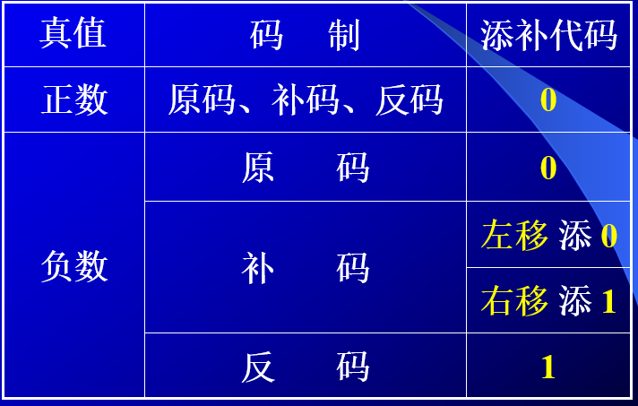
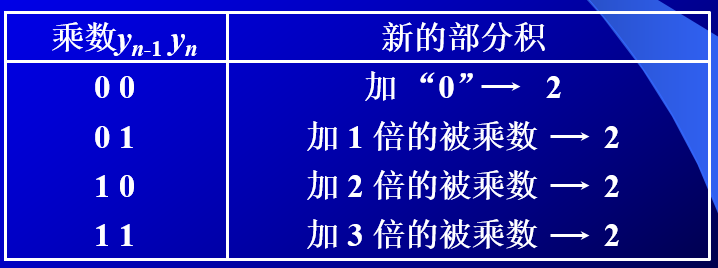

# 计算机组成原理

### 第一章 计算机系统概论

#### 存储器的组成

**MAR：**存储器地址寄存器

**MDR：**存储器数据寄存器

#### 运算器的组成

#### 控制器的组成

### 第三章 系统总线

#### 3.2 总线的分类

1. 片内总线

2. 系统总线

   1. 数据
   2. 地址
   3. 控制总线

3. 通信总线

   用于计算机系统之间或计算机系统与其他系统之间的通信

##### 按数据格式

- 串行总线
  - 只需要一根线
- 并行总线
  - 可以传输若干数据
  - 信号线数量多，频率高的时候会产生严重干扰

#### 3.3 系统总线的结构

- 单总线
  - 都连接在一组总线上
- 双总线
  - 主存总线和IO总线
- 三总线
  - IO和主存间有DMA总线

#### 3.5总线控制

主设备：对总线有控制权

从设备：响应总线命令

##### 总线判优控制的分类：

集中判优方式：

1. 链式查询
2. 计数器查询
3. 独立请求

分布判优方式：

 定义：不需要中央仲裁器，每个潜在的主模块都有自己的仲裁器和仲裁号，多个仲裁器竞争使用总线。

##### 3.6 总线操作和定时

##### 同步通信：由统一时钟控制

同步通信适用于总线长度较短及总线所接部件的存取时间比较接近的系统。

##### 异步通信（异步定时方式）：采用应答方式，没有公共时钟标准

适合速度不匹配的设备间的数据传输

> 1)不互锁方式：速度最快 可靠性最差
>
> 主设备发出“请求”信号后,不必等到接到从设备的“回答”信号,而是经过一段时间,便撤销“请求”信号。
>
> 而从设备在接到“请求”信号后,发出“回答”信号,并经过一段时间,自动撤销“回答”信号。双方不存在互锁关系。
>
> 2)半互锁方式：
>
> 主设备发出“请求”信号后,必须待接到从设备的“回答”信号后,才撤销“请求”信号,有互锁的关系。
>
> 而从设备在接到“请求”信号后,发出“回答”信号,但不必等待获知主设备的“请求”信号已经撤销,而是隔一段时间后自动撤销“回答”信号,不存在互锁关系。
>
> 3)全互锁方式：最可靠 速度最慢
>
> 主设备发出“请求”信号后,必须待从设备“回答”后,才撤销“请求”信号;
>
> 从设备发出“回答”信号,必须待获知主设备“请求”信号已撤销后,再撤销其“回答”信号。双方存在互锁关系。

##### 半同步通信：同步、异步结合

>  同步：发送方用系统时钟前沿发信号
>
>  接收方用系统时钟后沿判断、识别
>
>  异步：允许不同速度的模块和谐工作
>
>  半同步通信:统一时钟的基础 上,增加一个“等待”响应信号WAIT

### 第四章 存储器

存储方式分类：
RAM 随机存储器

ROM 只读存储器

**缓存-主存** ：解决 **速度** 需求

**主存-辅存** ：解决 **容量** 需求

#### 存储器的选择：

1. 确定地址
2. 确定片选
3. 确定cpu地址线，数据线，片选线

#### 汉明码

偶校验 1，2，4，8是校验位

分组：第几组的校验内容是倒数第几位是1的数

偶校验的话是校验位加检验组异或为0

#### 主存储器

### 第五章 输入输出设备

#### 组成

##### I/O软件

1. 将数据输入主机
2. 将运算结果输送用户
3. 实现系统的协调

##### I/O硬件

接口模块和I/O硬件

#### 联系方式

##### 1.I/O设备编址方式

统一编址和不统一编址，统一编址将I/O设备看成存储器地址的一部分，不统一编址就是指I/O地址和存储器地址是分开的，所有对I/O设备的访问必须有专用的I/O指令。

统一编址占用了存储空间，减少了主存容量，但是无需专用的I/O指令。不统一编址由于不占用主存空间，故不影响主存容量，但需要I/O专用指令

##### 2.联络方式

1. 立即响应
2. 异步工作采用应答方式
3. 同步工作采用同步时标

##### 3.连接方式

辐射式和总线式

#### I/O设备与主机信息传送的控制方式

##### 1.程序查询方式

只要启动I/O设备，CPU就在不断查询能否读取数据，导致CPU原地踏步，不能继续执行程序，串行工作效率不高

##### 2.程序中断方式

CPU启动I/O设备后，不查询设备是否已就绪，继续执行自身的程序，只是当I/O设备准备就绪并向CPU发出中断请求后才予以响应

##### 3.DMA方式

主存和I\O设备中有一条数据通路，主存与I\O设备交换信息时，无须调用中断服务程序。若出现DMA和CPU同时访问主存，CPU总是将总线占有权让给DMA，通常把DMA的这种占有称为窃取或挪用。窃取的时间一遍为一个存储周期，故又把DMA占用的存储周期称为窃取周期

#### I/O接口

1.总线连接方式的I/O接口

数据线，设备选择线，命令线和状态线

I/O接口通常指的是主机与I/O设备之间设置的一个硬件电路及其相应的软件控制

端口是指接口电路中的一些寄存器，这些寄存器分别用来存放数据信息、控制信息和状态信息

##### 接口类型

按数据传送方式分类：并行接口和串行接口

按功能选择的灵活性分类：可编程接口和不可编程接口

按通用性分类有通用接口和专用接口

按数据传送的控制方式分类：程序型接口和DMA接口

#### 程序中断方式

##### 接口电路

1.中断请求触发器和中断屏蔽触发器

每一台外部设备必须配置一个中断请求触发器INTR，当其为1是，表示该设备向CPU发出请求。

能向CPU发出中断请求的我们都称之为中断源，当多个中断源向CPU提出请求中断请求时，CPU必须坚持一个原则

2.中断向量地址形成部件

CPU一旦想要了I/O中断，就要暂停现行程序，转而去执行该设备的中断服务程序

中断向量地址的形成部件的输入时来自排队其的输出IMTP1，INTP2...它的输出是中断向量，其位数与计算机可以处理中断源的个数有关，即一个中断源对应一个向量地址。

中断服务程序的地址入口是每个设备有不同的中断服务程序，每个服务程序都有一个入口地址，CPU必须要找到这个地址

CPU可以通过向量地址来寻找设备的中断服务程序入口地址

### 第六章 计算机的运算方法

#### 6.1 无符号数和有符号数

计算机中的数存储在寄存器中，通常称寄存器的位长为机器字长，无符号数和有符号数的范围不同

##### 有符号数

###### 整数原码定义：

$$
[x]_{源}=\begin{cases} 
0,x & 2^n>x\ge 0 \\
2^n-x & 0\ge x>-2^n
\end{cases}
$$

###### 小数原码定义：

$$
[x]_{源}=\begin{cases} 
x & 1>x\ge 0 \\
1-x & 0> x>-1
\end{cases}
$$

- 正数前面为0，负数前面为1

###### 整数补码

$$
[x]_补= \begin{cases} 
0,x & 2^n>x\ge0\\
2^n+x & 0>x> -2^n
\end{cases}
$$

###### 小数补码：

$$
[x]_补= \begin{cases} 
x & 1>x\ge0\\
2+x & 0>x\ge -1
\end{cases}
$$

- 正数前面为0，负数前面为1
- 后面用大一位的数字去减

补码移位规则：

1.正数

符号位不变，左移右移空出位都补0。

2.负数

符号位都不变
左移:数值左移，空出的位都补0 （小数点右移）
右移:数值右移，空出的位都补1 （小数点左移）

###### 整数反码

$$
[x]_反= \begin{cases} 
0,x & 2^n>x\ge0\\
2^n-1+x & 0>x> -2^n
\end{cases}
$$

###### 小数反码

$$
[x]_补= \begin{cases} 
x & 1>x\ge0\\
2-2^{-n}+x & 0\ge x> -1
\end{cases}
$$

###### 总结：

- 最高位是符号位
- 值为正的时候，三者一样
- 值为负的时候，补码是原码“求反加一”，反码是原码“求反”

##### 移码表示法

存在移码的意义是因为，补码不能直观的比较大小

所以对补码加上$$2^n$$则转换为移码

#### 6.2数的定点表示和浮点表示

##### 定点表示

小数点位于数符和第一数值之间，当机器不是纯小数或纯整数时，必须乘上一个比例分子

##### 浮点表示

$$
N=S\times r^j
$$

S为尾数，J为阶码，r是基数

r可以取2，4，8

- r越大，可表示的浮点数范围越大
- r越大，精度越低

浮点数表示形式

|  阶符   |  阶码的数值部分  |  数符   |   尾数的数值部分    |
| :-----: | :--------------: | :-----: | :-----------------: |
| $$j_f$$ | $$j_1j_2...j_m$$ | $$S_f$$ | $$S_1S_2S_3...S_n$$ |

浮点表示转换，哪一部分是负的就转换哪一部分

注意阶移尾补

##### 机器零

- 尾数为0
- 阶数等于小于其最小数

#### 6.3 定点运算

算术移位规则

##### 加减运算

**1. 补码加减运算公式**

1）整数
$$
[A]_补+[B]_补=[A+B]_补 (mod2^{n+1})
$$
小数
$$
[A]_补+[B]_补=[A+B]_补 (mod2^{n})
$$

###### 减法 整数

$$
[A-B]_补=[A+(-B)]_补=[A]_补+[-B]_补 (mod2^{n+1})
$$

**连同符号位一起相加，然后去除符号位的进位**

###### 溢出判断

1位符号位：

通常用符号位产生的进位和最高有效位产生的进位异或操作，结果为1即溢出

2位符号位：

变形补码，将符号位变成两位，2位符号位连同数值一起参与运算，而且高位产生的进位自动丢失，即可得到正确结果

当2位符号位不同时溢出

##### 乘法运算：

移位相乘

###### 两位乘：

原码两位乘是通过两位乘数的状态来决定新的部分积如何形成

运算规则：

**实际操作** $$+[x^*]_补 \ \ \ \ \ +[2x^*]_补 \ \ \ \ \ +[-x^*]_补 \ \ \  \rightarrow$$ 补码移

###### 补码一位乘：

1. 被乘数符号任意，乘数符号为正

   和原码一样，但是加和移位都必须按照补码的规则运算

2. 被乘数任意，乘数符号为负

   把乘数的补码$$[y]_补$$去掉符号位，当成一个正数和$$[x]_补$$相乘，然后加上一个$$[-x]_补$$校正

3. 取双符号位

补码乘法的符号位是在运算中自然形成的

##### 除法运算：

#### 6.4浮点运算

##### 浮点四则运算：

1. 对阶
2. 尾数求和
3. 规格化
4. 舍入
5. 溢出判断

- 对阶

  小数向大数看起

- 尾数求和

  补码求和

- 规格化

  当基数r=2时，尾数规格化形式为
  $$
  \frac{1}{2}\leq|S|<1
  $$
  S>0时，规格化为
  $$
  [S]_补=00.1xx...x
  $$
  S<时，规格化为
  $$
  [S]_补=11.0xx...x
  $$
  特规定，$-\frac{1}{2}$不是规格化数，$$-1$$是规格化数

  符号位符合标准时左规，直到符合标准

  符号位不符合标准时，采用右规

###### 乘除法：

阶码用定点加，尾数用定点乘或除

#### 6.5算数逻辑单元

### 第七章 机器指令

格式：操作码字段+地址码字段   寻址方式

1. 操作码

   反应机器做什么操作

2. 地址码

##### 扩展操作码：

操作码的位数随地址数的减少而增加 

#### 操作数类型和操作种类

- 地址			无符号整数
- 数字            定点浮点
- 字符            ASCII
- 逻辑数        逻辑运算

##### 数据的存储方式

1. 任意位置开始存储
2. 从一个存储字的起始位置开始
3. 边界对齐方式

#### 寻址方式

#### 1.指令寻址

顺序  (PC)+1->PC

1指的是指令的长度

跳跃寻址  由转移指令指出

#### 2.数据寻址

操作码   |  寻址特征  |  形式地址A

1.立即寻址

A就是操作数

2.直接寻址

形式地址就是实际地址

3.隐含寻址

操作数地址隐含在操作码中

另一个操作数隐含在ACC中

4.间接寻址

有效地址由形式地址间接提供

- 两次访存
- 扩大寻址范围
- 便于编址程序，我们只需要修改形式地址里的内存值

5.寄存器寻址

有效地址即为寄存器编号

- 执行阶段不放存

6.寄存器的间接寻址

有效地址在寄存器中

- 从寄存器获取内存当中的地址

7.基址寻址

1）专用寄存器作为基址寄存器

EA = BR + A

- 扩大寻址范围
- 有利于多道程序   程序的动态定位
- BR内容由操作系统或管理程序确定、
- BR不变，A可变

2）通用寄存器作基址寄存器

- 可由用户指定哪个通用寄存器为基址寄存器

8.变址寻址 

A不变，变址寄存器可变，依然相加得出实际地址

9.相对寻址

EA = (PC) + A

A是相对于当前指令的位移量

2)按字节寻址的相对寻址

10.堆栈寻址

1. 堆栈的特点

   - 硬堆栈    多个寄存器

   - 软堆栈    指定的存储空间

     先进后出栈顶由SP给出

### 第八章 CPU的结构和功能

复习课：

hongluoyiman计算机

计算机实现一条指令的过程

总线 判优控制，总线控制

