# 计算机视觉

## 相机

小孔成像相机

没有小孔的画，物平面可以完全映射到相平面上每一个点

两倍小孔直径会增加四倍的光

两倍焦距会减少四分之一的光
$$
\frac{1}{D'}+\frac{1}{D}=\frac 1 f
$$

FOV（Field of View）取决于焦距(f)和传感器长度(d)（单边的）
$$
\varphi = tan^{-1}(\frac d {2f})
$$

## 图像滤波器

方框滤波：卷积核中所有值相等，可以选择为均值，也可以选择为相加

卷积和互相关：卷积需要将卷积核进行180度的翻转

### 高斯滤波器(The Gaussian filter)：

2D高斯卷积核
$$
f(i,j)=\frac 1 {2\pi\sigma^2}e^{-\frac{i^2+j^2}{2\sigma^2}}
$$
权重理论上随着距离无限增加，但一般在$$2-3\sigma$$处截断

- 可以去除高频的部分——低通滤波器
- 和自己卷积是另一个高斯
- 可以分离

离散滤波器使用有限核，$$\sigma$$越大，下降越平缓

**最好使得核边缘接近于0，将滤波器的半宽设置为$$ 3\sigma $$**

### 高斯拉普拉斯算子（Laplacian of Gaussian）

拉普拉斯算子是图像二阶空间导数的二维各向同性测度。拉普拉斯算子可以突出图像中强度发生快速变化的区域，因此常用在边缘检测任务当中。在进行Laplacian操作之前通常需要先用高斯平滑滤波器对图像进行平滑处理，以降低Laplacian操作对于噪声的敏感性。该操作通常是输入一张灰度图，经过处理之后输出一张灰度图。

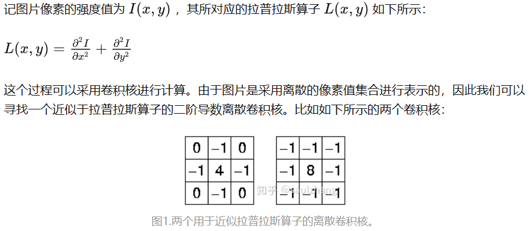

$$LoG$$运算计算图片在空间上的二阶导数。这意味着图片中某个区域的强度是固定值的时候，其 $$LoG$$变换的响应值为0。而在图片的强度发生变化的区域，在较暗的一侧$$LoG$$的响应值是正数，而在较亮的一侧， $$LoG$$的响应值则为负数，这意味着在两个强度均匀但不同的区域中间会有一条相对锐利的边，而$$LoG$$函数对于这一部分区域的响应为：

- 在连续强度不变的区域响应值为0
- 在边的一侧响应为正
- 在边的另一侧响应为负
- 在边中间的某一点响应值为0

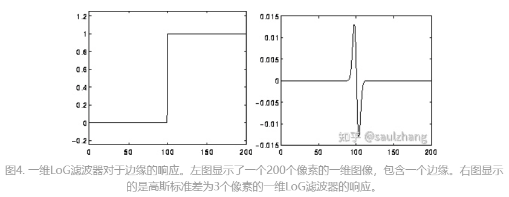

### 差分高斯滤波器(DoG)

​		在灰度图像的简单情况下，通过将原始灰度图像与具有不同宽度(标准差)的高斯核进行卷积得到模糊图像。使用高斯核模糊图像只抑制高频空间信息。从另一幅图像中减去一幅图像保留了位于两个模糊图像中保留的频率范围之间的空间信息。因此，DoG是一个空间带通滤波器，它对原始灰度图像中远离带中心的频率进行衰减。

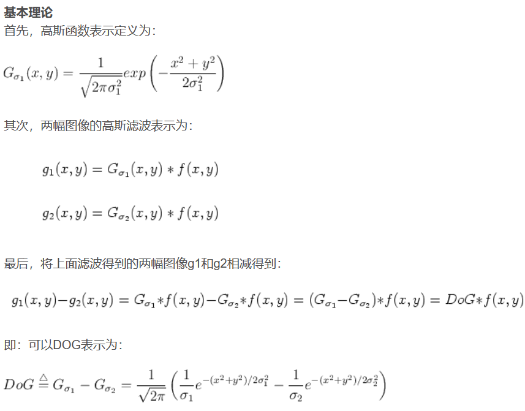

### 降噪和非线性图像滤波

椒盐噪声:包含随机出现的黑色和白色像素

脉冲噪声:包含随机出现的白色像素

高斯噪声:由高斯正态分布得出的强度变化

解决：

高斯噪声：使用一个较大标准差的平滑，但也模糊了图像

椒盐噪声：中值滤波

### 其他过滤器

加权中值(离中心更远的像素计数更少)

裁剪平均值(忽略少数最亮和最暗像素的平均值)

双边过滤(通过空间距离和强度差加权)

### 双边滤波(Bilateral Filters)

对与空域和值域同时进行滤波

空域滤波采用的是高斯滤波

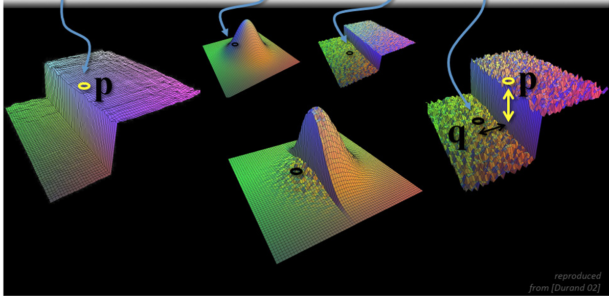

联合双边滤波：

如果在值域的权重计算过程引入另外一幅图像，则称之为联合双边滤波。就是引入的另外一幅图像。该图像**必须**与待处理的图像相似。

## 边缘检测

目标：从二维图像中获取曲线或直线边缘

思路：后期处理后寻找强烈渐变

边缘是图像函数强度中变化最快的部分

### Sobel算子

1. 定义算子

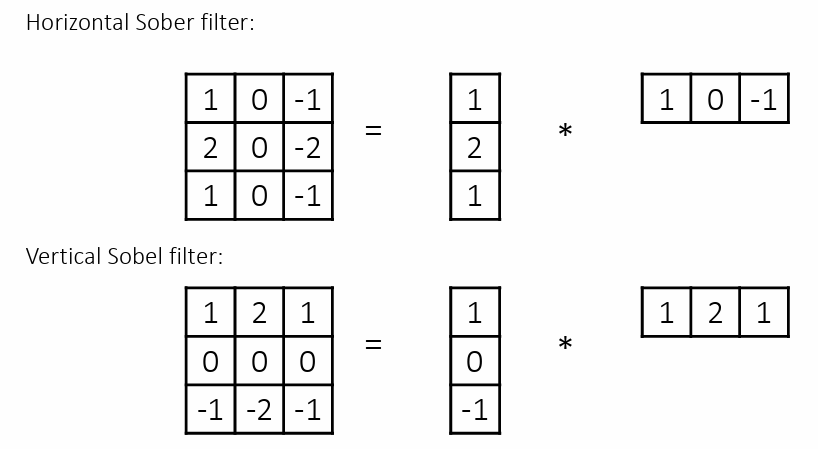

2. 与图像卷积以达到求导：

$$
\frac{\delta f}{\delta x}S_x \otimes f \qquad \frac{\delta f}{\delta y}S_y \otimes f
$$

3. 计算梯度：

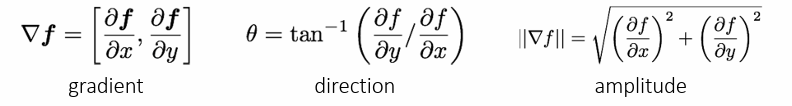

4. 边缘检测：根据梯度强度和方向来判断像素是否为边缘点。通常，可以根据梯度强度设置一个阈值，将梯度强度大于阈值的像素标记为边缘点，否则标记为非边缘点。

对噪声敏感：

### 构建边缘检测器

**二值化**

**非极大值抑制**（Non-Maximum Suppression）

​	只选择阈值以上的边缘

**阈值筛选**

​	使用一个高阈值开始线段，然后以一个低阈值继续

### Canny边缘检测

1. 平滑图像，降噪，高斯滤波
2. 使用Sobel算子计算x和y方向上的梯度（这里是互相关）
    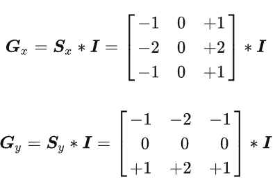
3. 求梯度的大小和方向
   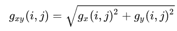
1. 非最大值抑制
2. **阈值筛选**：定义两个阈值:低和高使用高阈值开始边缘曲线，使用低阈值继续边缘曲线

## 图像特征

### 角点检测(Corner Detection)

从小窗中识别

#### 如何发现角点

- 角点是可重复和独特的
- 在角点旁的区域，图像梯度有两个或者多个方向

### Harris角点检测

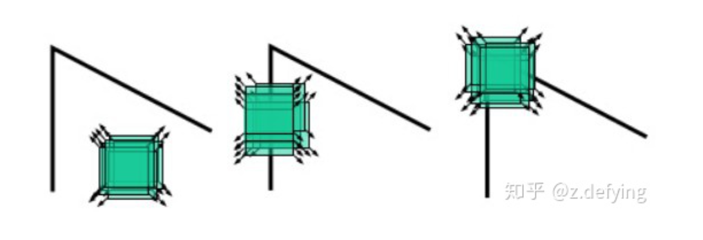

**点在任意一个方向上做微小移动，都会引起该区域的梯度图的方向和幅值发生很大变化。**

1. 先求窗口的变化量：

   窗口在各个方向上移动$$(u,v)$$所造成的像素灰度值的变化量公式如下
   $$
   E(u,v) = \sum_{(x,y)}w(x,y)\times[I(x+u,y+v)-I(x,y)]^2
   $$
   对于上述公式在实际中计算较慢，我们采用泰勒展开，当u，v很小时
   $$
   I(u+x,v+y)=I(x,y)+uI_x+vI_y
   $$
   推导后（注意是对点运算，而不是对于矩阵运算）
   $$
   E(u,v)=w(x,y)\sum_{x,y}(uI_x+vI_y)^2 \\
   E(u,v)=[u,v]M \left[ \begin{align} u\\v  \end{align} \right]\\
   M=\sum_{(x,y)}w(x,y) \left[\begin{matrix} I_x^2 && I_xI_y \\ I_xI_y && I_y^2   \end{matrix} \right] \rightarrow R^{-1}  \left[ \begin{matrix} \lambda _1 &&0\\
   0 && \lambda_2 \end{matrix} \right]R
   $$

2. 计算角点得分

   灰度值的变化取决于M矩阵

   计算每个窗口对应的得分（角点响应函数R），k一般取0.4-0.6：
   $$
   R=det(M)-k(trace(M))^2
   $$
   其中$$det(M)=\lambda_1\lambda_2$$是矩阵的行列式，$$trace(M)=\lambda_1+\lambda_2$$是矩阵的迹
   $$
   trace(M)=a+d \\ det(M)=ad-bc
   $$

3. 判断

   可以先使用**非极大值抑制**

   平面: 该窗口在平坦区域上滑动，窗口内的灰度值基本不会发生变化，所以$$|R|$$值非常小，在水平和竖直方向的变化量均较小，即$$I_x和I_y$$ 都较小，那么 λ1 和 λ2 都较小；

   边缘:R值为负数，仅在水平或竖直方向有较大的变化量，即$$I_x和I_y$$只有一个较大，也就是 λ1>>λ2 或 λ2>>λ1；

   角点：R值很大，在水平、竖直两个方向上变化均较大的点，也就是 λ1 和 λ2 都很大

角点检测对应平移有不变性，对于旋转有协变性，对于尺寸变化没有协变性

## 单目几何

### 齐次坐标

**欧氏空间（几何学）中平行线不可能相交，但是投影几何中，无穷直线会在无穷远点相交**

所以欧式空间的描述方式难以描述投影几何

解决方案：齐次方程

要制作二维齐次坐标，我们只需在现有坐标中增加一个额外的变量w。因此，笛卡尔坐标中的一点，(X，Y)在齐次坐标中就变成了(x，y，w)。而笛卡儿坐标中的X和Y在齐次坐标中的x、y和w则重新表达为
$$
X=x/w \\
Y=y/w
$$

#### 为什么叫齐次

任何乘以a的数（1a，2a，3a）与欧氏空间中的（1/3，2/3）是同一个点，换句话说，齐次坐标是与乘数a不相关的。

#### 两条平行线可以相交

当我们重写投影空间的方程，当w=0时，方程有解，则可以相交

### 二维齐次坐标仿射变换

仿射变换的特点：

1. 起点不一定映射到起点
2. 线映射到线
3. 平行线映射到平行线
4. 比例保持不变
5. 仿射变换的组合也是仿射变换

位置变换：

旋转+位置变换：

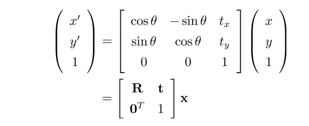

这里的$$\theta$$是逆时针的旋转角度

旋转+尺度+位置变换：

透视变换：

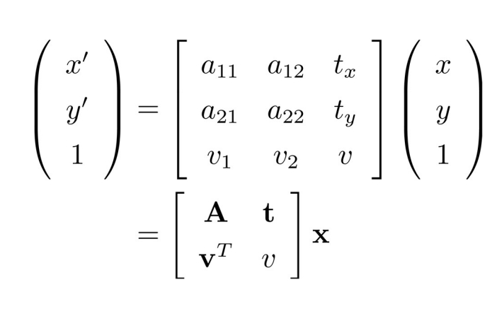

仿射变换内容：

$$
X'=S_xX\\Y'=S_yY
\\
\left [
\begin  {matrix}
X'\\
Y'
\end{matrix}
\right ] =

\left [ \begin{matrix}
S_x&&  0 \\
0&  & S_y \end{matrix} \right]

\left[ \begin{matrix}X\\Y \end{matrix}\right]
$$

无穷远点经过仿射变换还是无穷远点，经过透视变换不一定是无穷远点

### 相机坐标变换

常见的坐标系：世界坐标系，相机坐标系，图像坐标系，像素坐标系

#### 世界坐标系->相机坐标系

旋转矩阵R+平移向量T
$$
\hat X_{cam}=R(\hat{X}-\hat{C})
$$
$$\hat X$$: 相机在世界坐标系中的点

$$\hat C$$: 相机坐标系中心在世界中的点

在齐次坐标系中：

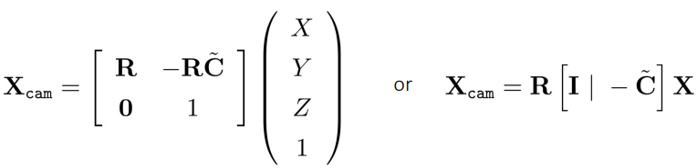

#### 相机坐标系->图像坐标系

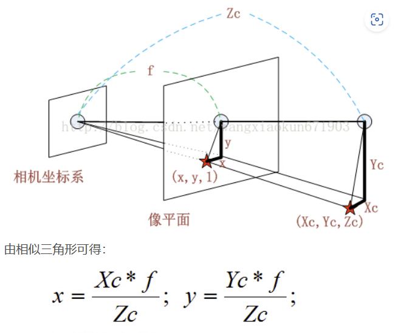

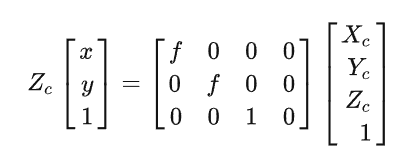

#### 相机透视投影矩阵：

世界坐标转换到像素坐标系（世界坐标系和相机坐标系不在同一点）

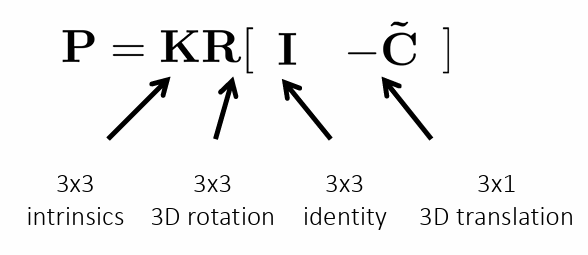

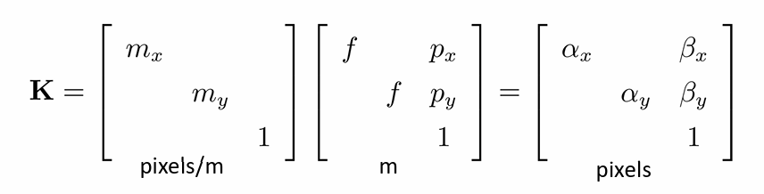

如果相机的像素是矩形的：

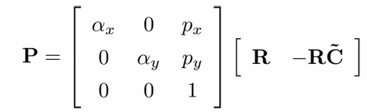

**十个自由度：**4个内参，3个旋转角度，3个平移向量

如果相机的像素不是矩形的：

**十一个自由度：**5个内参，3个旋转角度，3个平移向量

如果世界坐标系和相机坐标系重叠：

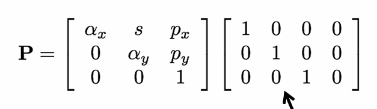

相机矩阵：

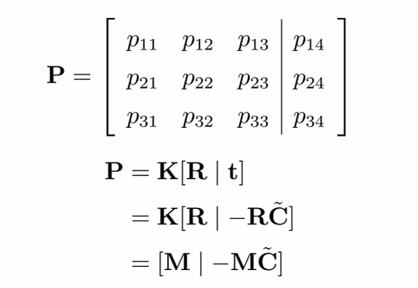

考虑每一列的物理含义：

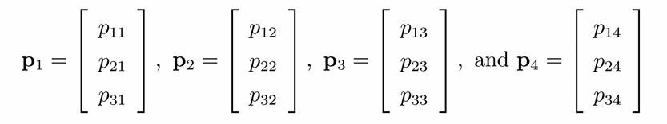

p1, p2, p3代表分别代表x,y,z方向上的消失的点

p4代表图像中世界坐标的原点

证明：考虑一个特殊的点$$D=[0,1,0,0]^T$$

考虑每一行的物理含义：

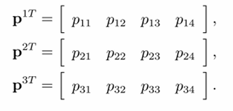

- 第三行向量是主平面，这个平面上的一点将映射到无穷远处的直线上
- 第一和第二行向量分别表示由相机中心和图像平面坐标轴y和x定义的平面

 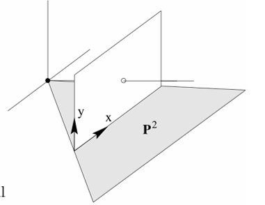

如果透视关系弱，投影矩阵可以写成：

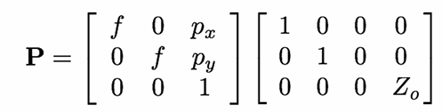

#### 平行投影

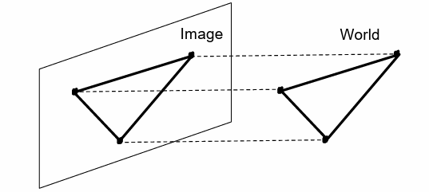

矩阵：

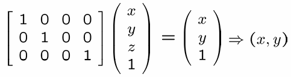

## 相机标定

### 直接线性变换(DLT)

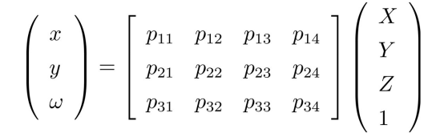

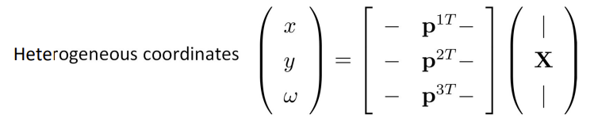

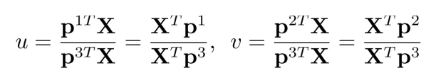

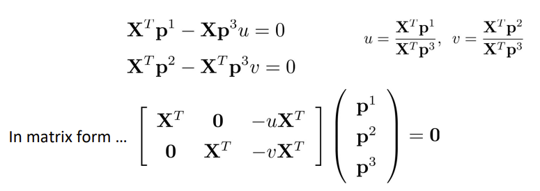

对于多个点的矩阵

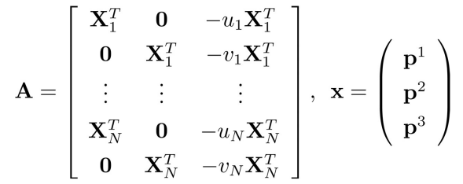

SVD奇异值分解！

约束条件：

1. 观测值的数量要不小于6。
2. 观测值没有严重粗差。
3. 如果所有输入点在一个平面上，则无法解出理想的m。

#### 使用参考物体标定

在场景中放置一个已知的物体:

- 识别图像和场景之间的对应关系
- 计算从场景到图像的映射

问题:

- 准确知道几何关系
- 必须知道3D->2D对应关系

#### DLT方法

优点：

- 简单计算
- 可分析的解决方法

缺点：

- 无法模拟径向扭曲
- 难以施加约束条件
- 不能最小化正确的误差函数

为什么选取这个方法：

- 定义了误差函数E在3d点和图形之间
  - E是关于内参，外参和径向畸变的非线性函数
- 最小化E使用了非线性优化的方法

#### 最小化几何误差

如果点数超过了6个，就需要选择一组解来作为最优解

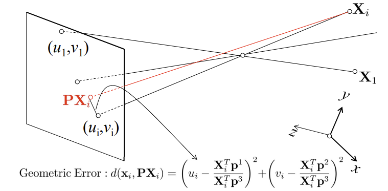

注意：现在做的事和我们之前做的是不相等的，现在对于里的远的点会添加一个大的权重

### PnP(Perspective-n-Points)

PnP：当内参已知的时候，确定外参

每一个点提供两个约束，P还剩6个自由度，需要3个点

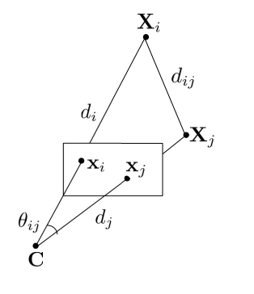

使用余弦定理：

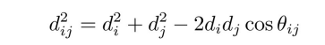

对于三个点来说，仍然存在4个选择

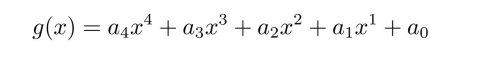

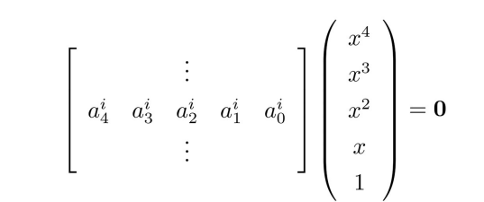

### EPnP

线性Pnp的时间复杂度是$$O(n^5)$$，EPnP的时间复杂度是$$O(n)$$

## 立体几何

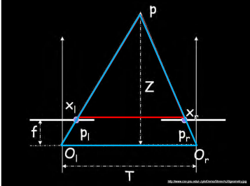
$$
\frac{T-x_l+x_r}{Z-f}=\frac T Z \\
Z = f\frac T {x_l-x_r}
$$
PS: $$x_l和x_r$$是关于图像物理坐标系上，原点在Z轴的位置

一般情况下，不需要两个相机具有平行的光轴，通过两条射线来进行简单的三角运算

问题：

1. 搜索问题：对于每一个在第一个图形的点，找到其在第二个图像中的点
2. 估计问题：对于每一对匹配的点，判断他的3维坐标

### 三维旋转矩阵

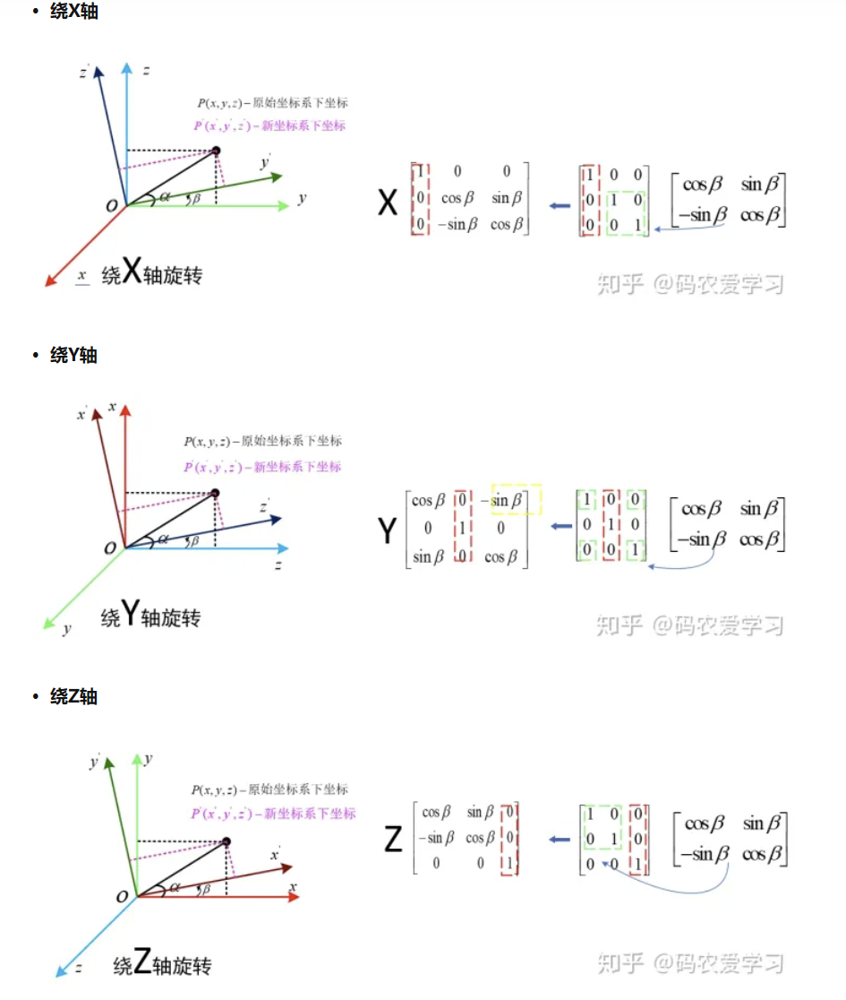

### 对极几何

两个视图的几何约束，其中第一个视图中某些图像点的对应像素必须出现在另一个图像中

它必须在连接世界点和光学中心的平面所划出的直线上。

基本概念：

- 基线：连接相机中心的线基
- 对极点[epipole]：基线与图像平面的交点
- 极平面：包含基线和世界点的平面
- 对极线：对极平面与图像的交线

- 所有的对极线相交与极点
- 所有的极平面相交左右图像在对极线上
- 对极点不一定在图像上

​		直观上讲，从第一帧的角度上看，射线 O1p1 是某个像素可能出现的空间位置——因为该射线上的所有点都会投影到同一个像素点。同时，如果不知道 P 的位置，那么当我们在第二个图像上看时,连线 e2p2 (也就是第二个图像中的极线)就是 P 可能出现的投影的位置，也就是射线 O1p1 在第二个相机中的投影。现在，由于我们通过特征点匹配，确定了 p2 的像素位置，所以能够推断 P 的空间位置，以及相机的运动。

对极约束：**我们在不知道P的真实空间位置的时候，通过几何关系将P点在第二帧图像上可能的投影位置约束在了一条直线上（即极线L2）。然后，通过特征匹配，我们确定p2与p1一样，都是空间点P的投影。**

奇异值分解（SVD）

任何 m×n 的矩阵 A 可以被转换为三个矩阵的乘积：

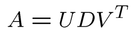

其中：

1. U 是 m x m 矩阵，其列向量是正交向量
2. V 是 n x n 矩阵，其列向量是正交向量
3. D 是 m x n 对角矩阵，其对角线元素被称为A的奇异值（singular values），并且是这样的：

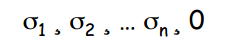

U 的列向量是矩阵 AAT 的特征向量

V 的列向量是矩阵 ATA 的特征向量

矩阵 D 的对角线元素的平方是矩阵 $$AA^T$$ 和矩阵 $$A^TA$$ 的特征值

### Essential matrix

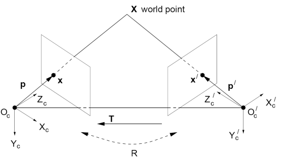

如果深度信息是已经被校准的，那么我们可以知道如何旋转和移动相机从图像一到二
$$
X'_c=RX_c+T
$$
R是三位矩阵，T是三维向量

从几何到代数
$$
X'=RX+T \\ T\times X'=T\times RX\\ X'\cdot (T\times X')=X' \cdot (T\times RX)=0
$$
叉乘的矩阵形式：

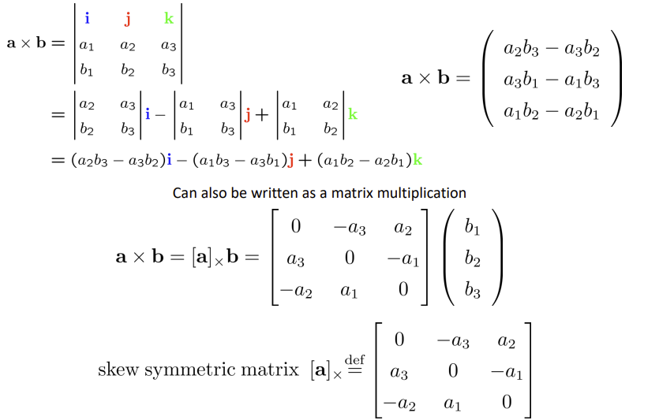

举个例子：

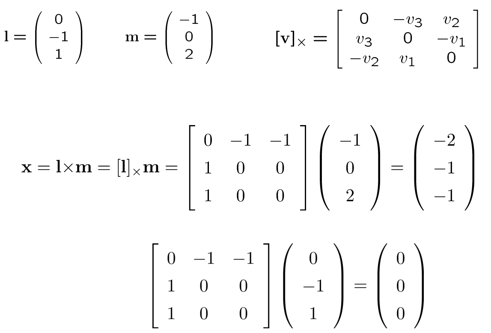

本质矩阵：

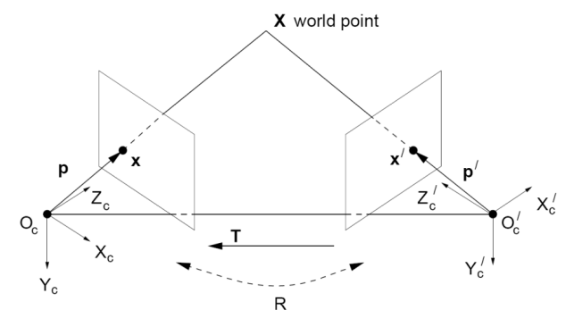
$$
X'\cdot (T\times RX) = 0 \\ X'\cdot ([T]_\times RX) = 0\\Let \quad E=[T]_\times R,\ so\quad X'^TEX=0 \\Recall: X=\frac f Z X \\  ( \frac {Z'}{x'})^TE(\frac{Zx} f )=0  \quad simplify \quad (x')^TEx=0
$$
E称为本质矩阵，在给定旋转和平移的情况下，它将两个相机之间对应的图像点联系起来。

如果我们在一幅图像中观察到一个点，它在另一幅图像中的位置被约束在上面定义的直线上。

注意:这些点在相机坐标系中。

E矩阵的性质：

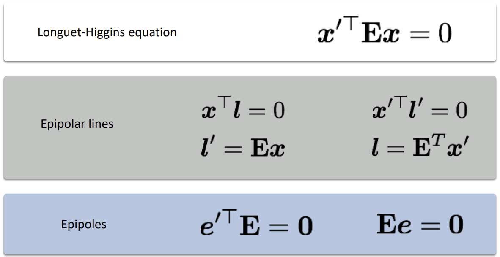

### 对于非标定相机

想要估算世界几何而不需要校准相机

- 存档视频
- 来自多个不相关用户的照片
- 动态摄像系统

主要思想:

- 从两个未校准相机之间的(冗余)点对应集估计极几何

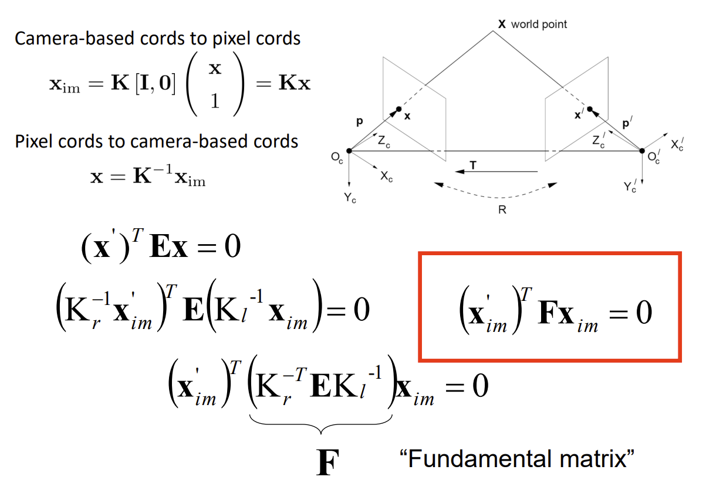

问题：**如何求解F**

F是一个$$3\times 3$$的矩阵，SVD！！！

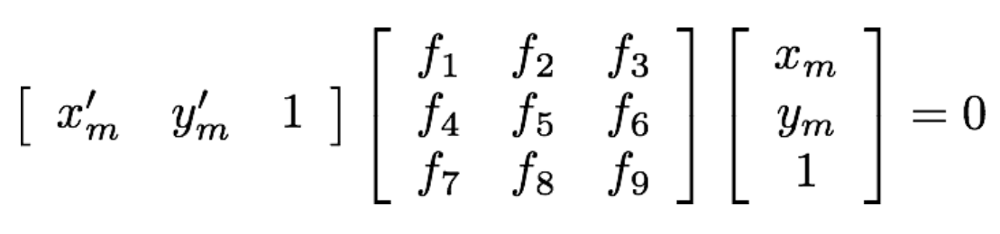

一对对应点提供一组方程，我们至少需要八对点！

步骤：

1. 收集至少8个对应点（图像1和图像2中的对应特征点）。
2. 根据对应点建立一个线性方程组。
3. 通过对方程组进行奇异值分解，得到基础矩阵的估计。
4. 对估计的基础矩阵进行约束处理，使其满足基础矩阵的特性，如秩为2。
5. 可选地，通过非线性优化方法进一步优化基础矩阵的估计结果。

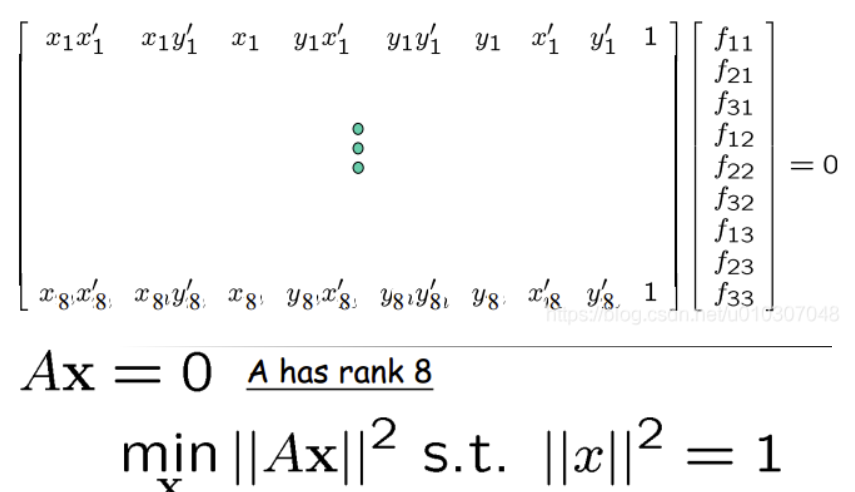

基础矩阵 F 必须是奇异的（请记住，它的秩rank为2，因为对它来说，有一个左右的零空间（即极点）是很重要的）。加入rank为2的约束：

1. 求解矩阵 F 的SVD分解：$$F=U_fD_fV_f^T$$
2. 将矩阵F中除了最大的两个奇异值以外，都设置为0，从而构造$$D'_f$$
3. 重新计算矩阵F

#### 立体校正

图像重投影

将图像平面重新投影到一个公共平面上，这个公共平面平行于两个相机光学中心之间的连线

注意，只有相机的焦点才是最重要的

步骤：

1. 计算E得到R
2. 向右旋转图像R、
3. 通过$$R_{rect}$$旋转两个图像
4. 缩放两个图像都乘以H

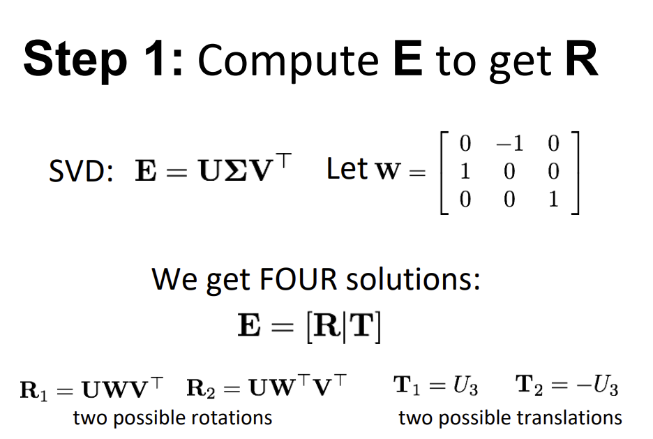

我们如何选择：

- 计算R的行列式，有效解必须等于1(注:det(R) = -1表示旋转和反射)
- 用三角剖分法计算三维点，有效解具有正Z值(注:负Z表示点在相机后面)

### 立体匹配

对应的问题除了极几何的硬约束之外，还有“软”约束来帮助识别相应的点

- 相似性
- 唯一性
- 顺序
- 视差梯度

为了在图像对中找到匹配，我们将假设

- 大多数场景点从两个角度都可见
- 匹配的图像区域在外观上相似

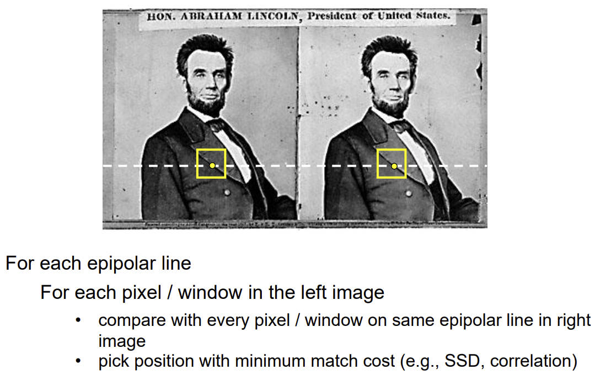

失败的区域：

1. 无纹理区域
2. 重复区域
3. 奇异区域

软约束：

1. 唯一性约束：

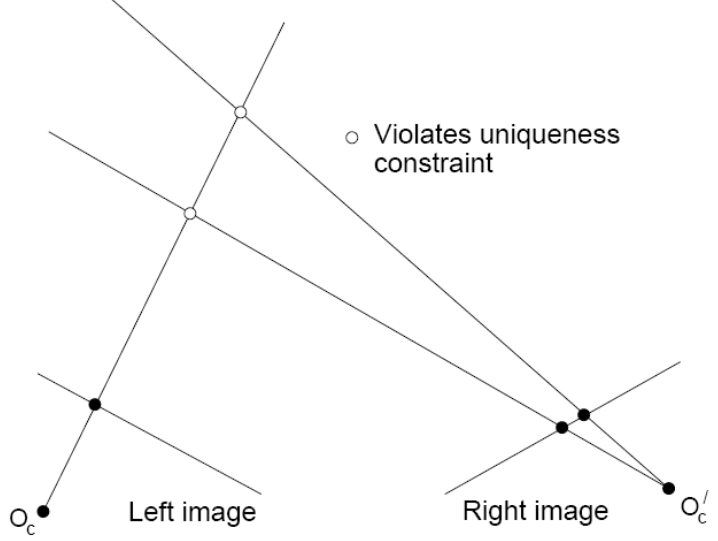

2. 梯度约束：

   假设分段连续曲面，所以要视差估计在局部是平稳的

   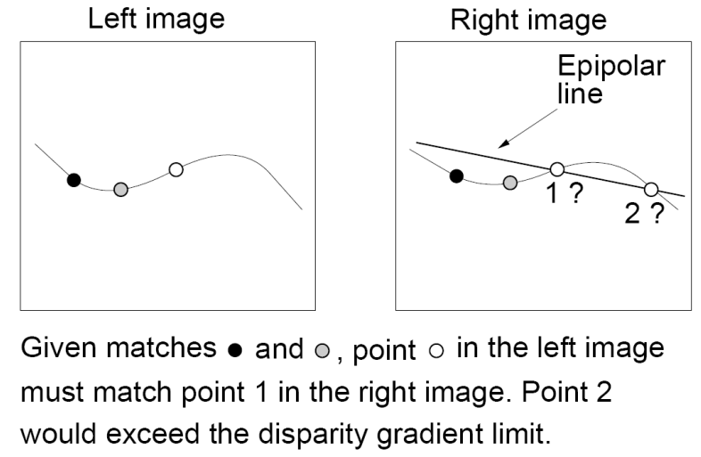

3. 顺序约束

   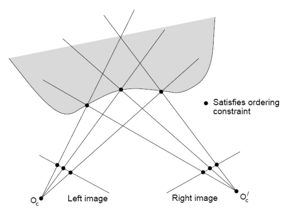

   

## 图像分割

### K-means聚类

一种常见的无监督学习算法，用于将一组数据点划分成K个不同的类别或簇。每个簇由其质心（簇中心）表示，数据点与质心的距离用来确定其所属的簇。

K-means算法的基本步骤如下：

1. 初始化：随机选择K个质心，可以是数据集中的K个随机样本或通过其他初始化方法选择。

2. 分配数据点：对于每个数据点，计算其与各个质心的距离，将其分配给距离最近的质心所代表的簇。

3. 更新质心：对于每个簇，计算簇中所有数据点的平均值（或重心），将其作为新的质心位置。

4. 重复步骤2和步骤3，直到达到收敛条件，例如质心不再变化或达到最大迭代次数。

5. 得到最终的聚类结果：每个数据点被分配到最终的簇中，簇的标识由质心所代表。

K-means算法的目标是最小化数据点与其所属簇质心之间的平方距离的总和，也称为“簇内平方和”（within-cluster sum of squares, WCSS）。因此，该算法是通过迭代优化质心位置来不断减小聚类结果的误差。

K-means算法的优点包括简单易实现、计算效率高以及可扩展性好。它在许多领域和应用中都得到广泛使用，例如图像分割、文本聚类、市场分割等。然而，K-means算法对初始质心的选择敏感，并且需要事先确定聚类的数量K。此外，K-means算法对离群点和噪声敏感，可能会导致错误的聚类结果。因此，在使用K-means算法时需要仔细选择参数和进行数据预处理以提高算法的效果。

### 平均偏移聚类（Mean Shift Clustering）

它通过在数据空间中寻找概率密度函数的高密度区域来识别聚类结构。

平均偏移聚类的基本思想是通过迭代地更新数据点的位置，将其移向密度估计的概率密度函数的局部最大值。这一过程会使数据点逐渐聚集到数据空间中的聚类中心。

算法的基本步骤如下：

1. 初始化：为每个数据点选择一个起始位置（可以是数据点自身的位置）。

2. 估计密度：计算每个数据点周围邻域内的密度估计，可以使用核函数（如高斯核函数）来量化数据点与其邻域内其他点之间的距离。

3. 更新位置：将每个数据点移动到其密度估计最高的邻域内的位置。更新位置的方法是计算数据点在邻域内的平均值，即平均偏移向量（Mean Shift Vector），并将数据点移动到该位置。

4. 重复步骤2和步骤3，直到达到收敛条件，例如数据点的移动变得很小或达到最大迭代次数。

5. 形成聚类：根据最终收敛的位置，将数据点划分为不同的聚类簇。通常，可以使用阈值来合并接近的聚类中心或根据密度值进行聚类簇的合并。

平均偏移聚类的优点是不需要预先指定聚类的数量，能够自适应地发现数据中的聚类结构。它对密度估计的概率分布函数形状没有假设，适用于各种形状的聚类。然而，该算法对初始点的选择敏感，可能会陷入局部最优解。此外，在处理大规模数据时，计算密度估计和更新位置的复杂度较高。

平均偏移聚类在图像分割、目标跟踪、图像检索等领域有广泛应用，并且可以与其他聚类算法结合使用，以提高聚类效果。

## 物体检测

滑动窗口：在窗口上滑动一个窗口，并在每个位置评估模型

- 窗口数量很大，效率和低错误率比较重要
- 难以扩大到大范围的尺度

基于提案机制的检测：

- 生成并评估数百个区域提案
- 建议机制可以利用低级知觉组织线索
- 提案机制可以是特定于类别的，也可以是独立于类别的，可以是手工制作的，也可以是经过培训的
- 分类器可以更慢，但更强大

Viola-Jones滑动窗口检测

Viola-Jones sliding window detector是一种经典的目标检测算法，主要用于检测图像中的人脸。

该算法的基本思想是在图像上使用一个可变大小的滑动窗口，通过在每个窗口位置上应用一个级联分类器来判断窗口内是否包含感兴趣的目标。级联分类器是通过AdaBoost算法训练得到的一系列弱分类器的组合，它能够快速排除不包含目标的窗口，提高检测效率。

Viola-Jones滑动窗口检测器的主要步骤如下：

1. 特征提取：使用Haar-like特征来描述图像的局部区域。这些特征是基于图像的灰度值统计信息，如矩形区域的像素和之间的差异。

2. 训练级联分类器：使用AdaBoost算法来训练级联分类器。AdaBoost通过迭代选择和调整一系列弱分类器，使其能够对正负样本进行准确分类。训练过程中，误分类样本的权重会被增加，以便下一轮迭代更关注这些难分类的样本。

3. 滑动窗口检测：在图像上以不同大小的窗口进行滑动，并使用训练好的级联分类器来判断窗口内是否包含目标。滑动窗口通常会以不同的尺度进行缩放，以适应不同大小的目标。

4. 非极大值抑制：由于滑动窗口可能会在相邻位置产生重叠的检测结果，需要应用非极大值抑制来去除重复的检测框，保留最相关的目标框。

Viola-Jones滑动窗口检测器的优点是快速而准确，特别适用于人脸检测任务。然而，它在处理旋转、遮挡、光照变化等复杂情况下可能表现不佳。

## 卷积神经网络

## 基于深度学习的图像分割

任务：

- 语义分割
- 标记每个像素!
- 不要区分实例(奶牛)

经典的计算机视觉问题

- 实例分割
- 检测实例，给出类别，标记像素
- “同时检测和分割”(SDS)

很多最近的工作(MS-COCO)

- 全视分割:寻找
- 在实例级别FG事物
- 语义层面的BG内容
