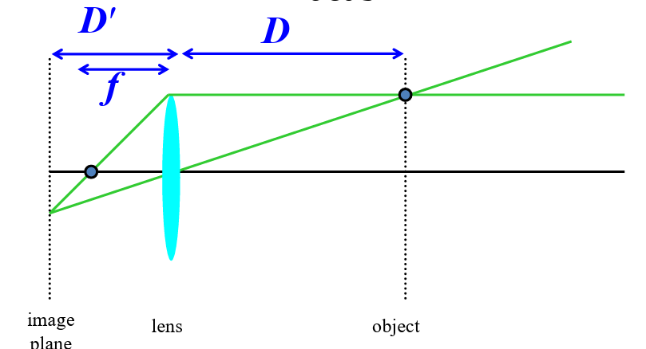

# 计算机视觉

## 相机

小孔成像相机

没有小孔的画，物平面可以完全映射到相平面上每一个点

两倍小孔直径会增加四倍的光

两倍焦距会减少四分之一的光
$$
\frac{1}{D'}+\frac{1}{D}=\frac 1 f
$$

FOV（Field of View）取决于焦距(f)和传感器长度(d)
$$
\varphi = tan^{-1}(\frac d {2f})
$$

两倍

滤波：

高斯平滑滤波

边缘检测：

高斯微分

拉普拉斯微分

## 图像滤波器

方框滤波：卷积核中所有值相等，可以选择为均值，也可以选择为相加

线性滤波器：

## 单目几何

### 齐次坐标

欧氏空间（几何学）中平行线不可能相交，但是投影几何中，无穷直线会在无穷远点相交

所以欧式空间的描述方式难以描述投影几何

解决方案：齐次方程

要制作二维齐次坐标，我们只需在现有坐标中增加一个额外的变量w。因此，笛卡尔坐标中的一点，(X，Y)在齐次坐标中就变成了(x，y，w)。而笛卡儿坐标中的X和Y在齐次坐标中的x、y和w则重新表达为
$$
X=x/w \\
Y=y/w
$$

#### 为什么叫齐次

任何乘以a的数（1a，2a，3a）与欧氏空间中的（1/3，2/3）是同一个点

换句话说，齐次坐标是与乘数a不相关的。

#### 两条线可以相交

当我们重写投影空间的方程，当w=0时，方程有解，则可以相交

### 二维仿射变换

仿射变换内容：
$$
X'=S_xX\\Y'=S_yY
\\
\left [
\begin  {matrix}
X'\\
Y'
\end{matrix}
\right ] =

\left [ \begin{matrix}
S_x&&  0 \\
0&  & S_y \end{matrix} \right]

\left[ \begin{matrix}X\\Y \end{matrix}\right]
$$
