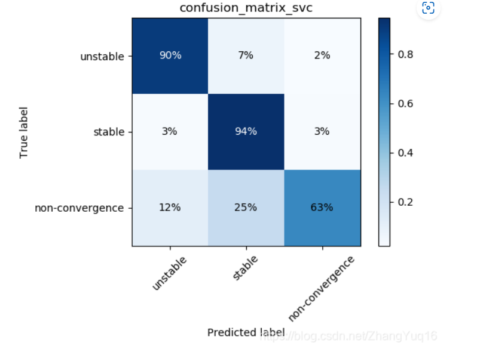
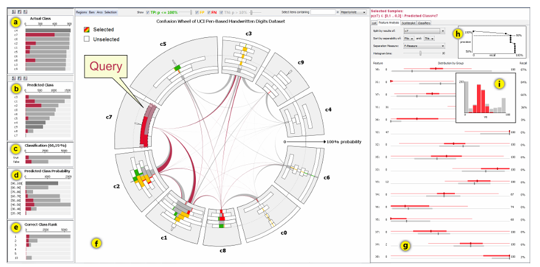
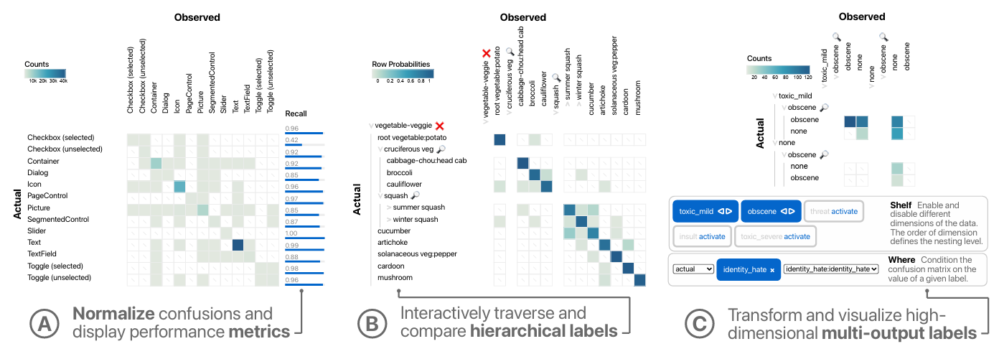

# Uni-Evaluator

## 作者简介

陈长建，2017年本科毕业于中国科学技术大学，2022年博士毕业于清华大学，目前是湖南大学的助理教授，目前主要研究的领域机器学习和可视分析；

谷歌学术：https://scholar.google.com/citations?hl=en&user=Q4pwU6sAAAAJ&view_op=list_works

个人主页：https://changjianchen.github.io

论文网站：http://uni-evaluator.thuvis.org/

## 介绍

**科研目标**：开发一个开源的可视化分析工具 `Uni-Evalutor`，该开源工具是一个**统一**的**可交互**的**与模型无关的**可视化系统，用于评估计算机视觉领域的分类、目标检测和实例分割模型。

**主要应用：**模型评估是机器学习模型开发中的关键一步，`Uni-Evalutor` 用于评估计算机视觉领域中分类、目标检测和实例分割模型的性能，帮助研究人员找到计算机视觉模型性能不佳的原因，并进行改进，并对模型或相关数据进行改进。

## 相关研究

### 在计算机视觉领域进行模型评估

评价一个模型好坏常用准确率、mAP和IoU，但这其实是有误导性的，模型可能对数据集中的主要的类有较好的效果，机器学习中很重要的假设。

最近一些方法一步将模型错误分为多种类型，以了解模型性能，[Bolya等人](https://arxiv.org/pdf/2008.08115.pdf) 提出将目标检测错误分为六类，以从不同角度提供详细的性能总结。

1. 分类错误：对于错误分类的， $IoU_{\max}≥t_f$   (即定位正确但分类错误)。

2. 定位错误：对于正确分类的， $tb$≤$IoU_{\max}$≤$t_f$  (即分类正确但定位错误)。

3. 分类和定位都错误：对于错误分类的，   $t_b$≤ $IoU_{\max}$≤ $t\_f$ (即分类错误并且定位错误)。

4. 重复检测错误：分类正确且$GTIoUmax ≥t_f$，但另一个较高得分的检测已经匹配了该GT(即，如果不是有较高得分的检测，则是正确的)。

5. 背景错误：对所有的GT都 $IoU_{\max}$≤$t_b$   (将背景检测为前景)。

6. 未检测到GT错误：未被分类或定位错误覆盖的所有未被检测到的ground truth(fn)。

Bolya等人中的这些方法在定量总结模型性能方面很有用，**但它们无法识别性能不佳的原因。**

### 在可视化方面进行模型评估

`Uni-Evalutor` 是模型无关的方法，也就是我们只关注模型的输入和输出，而不关心模型的内部结构，这种方法通常从三种层次评估模型：类层次、实例层次和它们的组合

类层次：混淆矩阵

实例层次：网格图和散点图

实际需要进行类级和实例级共同评估才能了解模型性能。因此，将这两种评估方法结合起来以最大化两者的价值。最直观的组合是使用单独但协调的视图。

例如，ConfusionWheel \[2] 利用直方图增强的弦图来显示类之间的混淆以及每个类的预测置信度分布。用户可以在散点图中检查选定样本的子集，并在条形图中检查其特征分布。 尽管这些方法可以同时检查类级指标和实例级预测，但用户必须在两个级别之间切换视图。

  

为了解决在两个级别之间切换视图这个问题，Squares \[50]使用堆叠条形图结合了两级信息，它利用条形图来显示类别之间的混淆，并利用每个条形图中的小方块来表示相关样本。

ConfusionWheel 和Squares 只考虑单输出标签，无法支持更复杂的数据结构，例如多输出标签。为了解决这个问题，Neo \[21] 采用概率分布来表示混淆矩阵。这些分布概括了传统的混淆矩阵以支持分层和多输出标签。

然而，Neo 主要专注于分类任务，缺乏对对象检测和实例分割任务的支持。为了为不同的计算机视觉任务提供统一的模型评估方法，我们扩展了 Neo 中的离散公式，以联合建模不同任务中呈现的离散和连续预测。

## 问卷调查

通过对151位计算机视觉领域的专家进行问卷调研，确定了三个主要设计目标：

1.  使用一个统一方法评估不同模型
2.  从不同层次分析模型性能
3.  识别性能不佳的原因，找到可能有问题的数据子集

从设计目标中衍生出四个任务：

- T1-对于离散和连续的预测数据使用统一的标准建模

- T2-在整个数据集上进行可视化。包括类别之间的混淆关系以及预测对象的不精确尺寸和位置。

- T3-交互式识别有问题的数据子集。包括用于**提取候选子集的子集搜索方法**和**允许用户基于一个或多个属性识别有问题的数据子集的表格可视化**。

- T4-显示感兴趣的样本以进行有效分析。主要包括网格可视化：将相似的样本放在一起，并以紧凑的方式直观地呈现它们，以方便探索

主要模块：

1.  统一计算
2.  可视化

创新点：将不同任务中的离散和连续预测计算为统一的概率分布，该论文提出了一个统一的公式，该公式扩展了 Görtler 等人提出的离散概率公式\[21]。根据这个概率分布，我们开发了三个工具：

1.  矩阵可视化用于提供一个模型性能的基本概要
2.  表格可视化用于识别哪个数据子集的表现不佳
3.  网格可视化用于显示感兴趣样本，以用于发现缺陷数据样本

## 统一概率分布方法

Neo \[21] 通过将预测类别与其基本事实相匹配，利用概率分布对分类任务中的离散变量进行建模。我们将其扩展到对连续预测值（预测区域、GT的大小和长宽比、预测置信度）和ground truth进行建模。然而，在这种概率框架中，由于存在多个可能的ground truth注释，将每个连续预测与相应的ground truth相匹配并非易事。为了解决这个问题，我们开发了一种对象匹配算法，将每个预测与合适的地面事实配对。根据匹配结果，我们使用统一的概率分布对离散和连续变量进行建模。

### 目标匹配

直观上是选择与预测方框重叠面积最大的GT作为匹配值，但这可能会产生误差，所以提出了以下公式用于匹配gt和预测框：

$$
\begin{aligned}\mathop{\mathrm{maximize}}_{z_{ij}}&\quad\sum_j^{\boldsymbol{M}_p}\sum_i^{\boldsymbol{M}_s}z_{ij}a_{ij}\\\mathrm{s.t.}&\quad z_{ij}\in\{0,1\},\quad z_{ij}\mathbb{I}(p_{ij}<\alpha)=0,\quad\sum_iz_{ij}\leq1,\forall i,j.\end{aligned}
$$
$M_p$ 代表预测的数量

$M_g$ 代表GT的数量

$z_{ij}$ 是一个二元变量，代表第i个gt和第j个预测是否匹配

$a_{ij}$ 是匹配后的分数，由三个部分组成：

1. 标签一致性分数（   $c_{ij}$   ），保证预测和GT的标签一致，是一个二元变量

2. 位置一致性分数（   $p_{ij}$   ），保证了预测值和GT有最大重叠，使用IoU

3. 第i个GT的唯一性分数（   $u_i$   ），保证gt值匹配一个预测，   $u_i=e^{-\sum_k{z_{ik}}}$

$a_{ij}$是三者的加权和，$a_{ij}=\lambda_1c_{ij}+\lambda_2p_{ij}+(1-\lambda_1-\lambda_2)u_i$ ，系数是用来控制平衡，分别取0.5，0.25

存在两个约束：

1. 预测和gt匹配的时候，要求   $p_{ij}$   至少为0.1\[9]，

2. 每个预测最多只有一个匹配

#### 算法效率分析

贪心算法，将一张图片上的每一个GT和一个预测框进行比较，所需要的时间为$O(M_pM_g)$ ，那么对于总共有N个图片数据集来说，总体可以规约为$O(N)$,

4分钟100000张照片的COCO数据级，此外这是单次加工过程，可以处理更大的数据级

### 处理离散和连续变量

离散变量包括预测/GT类别

连续变量包括预测区域和GT的大小和长宽比以及预测置信度

基于预测与真实情况之间的匹配，我们采用联合概率分布对离散变量和连续变量进行建模。令 C 和 D 表示连续变量和离散变量，令 X 和 Y 表示基本事实和预测。然后联合概率分布由 $P(C_X , D_X ,C_Y , D_Y ) $ 给出。

对于离散变量，概率质量函数用于确定取特定值的概率，该概率由变量等于该值的频率确定。对于连续变量，概率是使用累积分布函数 (CDF) 在间隔内计算的，该函数由该间隔中变量的频率确定。在该论文的实现中使用的是经验分布函数，可以提高算法效率。

该方法对连续变量进行离散化，并统计离散化变量小于特定值的频率。通过这两个函数，可以使用条件概率计算联合概率。在这里，我们使用对象检测示例来说明联合概率的计算。假设我们要分析具有真实标签“猫”和高预测置信度（> 0.5）的检测到的对象。这定义为 P(LabelX = cat, ConfidenceY > 0.5)。然后可以使用以下条件概率计算概率：

其中 P(LabelX = cat) 由离散变量 LabelX 的概率质量函数确定，P(ConfidenceY > 0.5 | LabelX = cat) 由给定 LabelX 的连续变量 ConfidenceY 的累积分布函数确定。概率框架使用户能够使用概率分布的标准操作处理不同分析任务的数据，包括边缘化和条件化\[21]。边缘化操作通过积分或求和来丢弃分布中的变量，使用户能够专注于分析感兴趣的变量。条件操作将变量限制为特定值或特定区间内，这使得用户能够分析感兴趣的子集。

概率框架使用户能够使用概率分布的标准操作处理不同分析任务的数据，包括边缘化和条件化\[21]。边缘化操作通过积分或求和来丢弃分布中的变量，使用户能够专注于分析感兴趣的变量。条件操作将变量限制为特定值或特定区间内，这使得用户能够分析感兴趣的子集。

## Uni-Evalutor可视化

1.  矩阵可视化用于提供一个模型性能的概要(T2)
2.  表可视化用于识别哪个数据子集表现不佳(T3)
3.  网格可视化用于显示感兴趣样本(T3)

### 基于矩阵可视化

为了评估分类和定位性能，经常需要以下三个参数：

1）类之间的混淆关系； 2）预测对象的大小； 3）它们偏离真实情况的方向。

据此，提供了三种评估模式：1）混淆模式，用于评估分类性能； 2）尺寸模式，用于分析预测对象的尺寸； 3）方向模式，用于分析预测对象的移动方向。在每种模式中，我们通过利用边缘化操作丢弃不相关的变量，将相关变量与其他变量分开。

由于一个大的数据级中可能有几十种类别，如果一起显示可能导致每个方格很小，使用层次聚类算法或基于其固有的层次结构来分层组织类，并将它们呈现为缩进树。

#### 混淆模式

蓝色由浅到深代表混淆的程度，破折号代表没有混淆，用于与低混淆的区分

#### 尺寸模式

本文利用包含三个扇区的饼图来总结每个单元格中预测对象的大小。灰色部分代表具有精确尺寸的预测对象，而黄色/绿色代表与GT尺寸相比具有更大/更小的尺寸的对象。

#### 方向模式

用八个箭头替换了雷达图。每个箭头的长度编码沿该方向移动的预测对象的数量。我们还在中间添加一个圆圈来表示具有精确位置的预测对象。它的半径编码了此类物体的数量

### 基于表格的可视化

为了帮助用户识别有问题的子集，首先开发了基于频繁模式挖掘的搜索方法来挖掘候选子集。然后采用表格可视化来传达这些子集的属性。用户可以按一个属性或多个属性的组合对这些子集进行排序，以找到有问题的子集。

最先进的子集搜索方法 DivExplorer \[48, 67] 采用基于频繁模式挖掘的搜索方法 \[24] 来查找满足最小子集大小的子集。然后，它根据每个子集的模型性能对子集进行排名。通过此排名，用户可以识别模型表现不佳的子集。该方法非常适合分类任务，因为它支持搜索沿离散属性切片的子集。为了将该方法应用于检测和分割任务，需要对连续属性进行离散化。因此，我们首先采用等频离散化方法\[59]来划分

识别有问题的子集。我们采用交互式表格可视化来可视化候选子集并帮助识别有问题的子集。在表中，每一行代表一个子集及其所有属性，例如精度和平均对象大小（图 1(c)）。离散属性显示为文本，连续属性显示为条形项目。我们提供多种交互（例如过滤和排名）来探索子集。例如，用户可以通过过滤来选择特定类别的子集，或者按照一个属性或多个属性的组合对子集进行排序。按照 Lineup \[23]，通过将一列的标题拖到另一列的标题上来实现组合。

### 基于网格的可视化

为了能够有效地检查相关样本，采用了网格可视化，因为它可以有效地探索图像内容。网格的单元格显示选定的样本及其预测。为了支持实时探索，我们利用基于 kNN 的网格布局算法 \[15] 来确定网格内每个样本的位置。该算法首先使用 t-SNE \[44] 将样本投影为一组 2D 点，然后通过解决线性分配问题将这些点与细胞进行匹配，从而保留样本之间的邻近性。为了清楚地显示检测到/分割的对象，我们裁剪图像并将它们呈现在相应的单元格中。

## 专家评估

### 可用性

1.  在其他视觉任务方面有一定的通用性
2.  可以诊断低性能的原因

## 局限性

1.  无法使用语义进行数据级划分，目前仅使用低级特征进行数据子集划分（比如使用大小和横纵对比），不过语义划分需要昂贵的手动注释数据级，且需要结合自然语言处理方面
2.  无法进行多模型对比评估，比如无法对比CNN和Transformer的优劣势