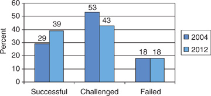

# 论软件危机

## 定义

软件危机（Software Crisis）是指在计算机科学的早期发展阶段，人们面临的一系列与软件开发和维护相关的问题和挑战。这个术语首次由计算机科学家Edsger W. Dijkstra于1968年提出，用来描述当时软件开发领域所面临的一些困难和挑战，以及这些问题对计算机应用的影响。

软件危机的一些主要特征和问题包括：

1. 项目延期：软件开发项目经常无法按时交付，导致项目延期。这可能是因为难以准确估计项目所需的时间和资源，以及软件需求的不断变化。

2. 软件质量问题：早期的软件开发方法和工具不够成熟，导致了许多软件质量问题，如软件中的错误和缺陷。

3. 难以维护：许多早期开发的软件系统难以维护和升级，因为它们的结构复杂，代码难以理解和修改。

4. 高成本：软件开发的成本常常高于预算，这是因为项目延期和质量问题导致了额外的开销。

为了应对软件危机，计算机科学家和工程师逐渐开发了更为成熟的软件开发方法和工具，如结构化编程、面向对象编程、敏捷开发和持续集成等。这些方法和工具帮助提高了软件开发的效率和质量，并减轻了软件危机带来的问题。尽管如今的软件开发领域仍然面临挑战，但相对于过去，我们已经取得了显著的进步。

## 个人想法

根据从上述给出的**软件危机**的主要特征和问题，软件危机的某些现象在现代组织中有所减少，但依然广泛存在于软件开发之中，而且这在未来很长的一段时间内都无法被解决，在搜索最近几年产生的案例中，比较典型的一个是波音737的案例：

> Boeing 737 Max MCAS (2018)
>
> For their 737 Max model jetliner, Boeing increased the engine size on a 737 airframe to increase fuel efficiency. To fit the oversize engines on the wings without changing other aspects of the airframe (which would require significant retooling of their factories), they shifted these large engines forward, which changed the aerodynamic properties of the jet. This change could result in engines stalling if the nose of the plane was pitched too far forward. To prevent this, a computer system was added, the MCAS, which would bring the nose back down when the angle of attack was too steep, effectively cutting the pilot out of the control loop. The software on this system focused on the output of a single angle-of-attack sensor, rather than redundant sensors, and this interaction with faulty sensors led to two deadly crashes shortly after it began operations, and the eventual grounding of all Boeing 737 Max planes. 

波音737max上的软件系统仅仅依赖于单个角度传感器的输出而不是综合参考冗余传感器，这已经导致短期内发生了两起严重坠机事故，也使得波音737max被全部停飞。

产生软件危机的原因有很多，我在网站上搜索资料的原因有很多：

- 拥有和维护软件的成本与开发软件一样昂贵。
- 当时软件效率很低。
- 软件质量低下。
- 软件通常不能满足用户要求。
- 平均软件项目会超出其时间表一半。
- 更改、调试和增强具有挑战性。
- 软件复杂性更难改变。

但我认为归根结底，最根本的有两个原因：

1. 软件的复杂性
2. 人的复杂性

### 软件的复杂性

软件的复杂性是由软件系统本身的性质决定的，其复杂性无法消除且难以减少的，在软件的开发过程中，有许多相互交织在一起的元素、组件，会使得整个软件系统的开发和维护变得异常困难，所以软件是迄今为止最复杂的人造产物。

对于软件开发没有“银弹”，随着技术的进步，开发人员通常采用许多模块化、规范化的编码实践、合理的系统架构、文档化的代码和最佳实践，试着来减少软件的复杂性，但是我们可以从下图中发现，10年时间软件开发的成功率仅提高了10%，开发失败率也没有下降。

随着时间的推移，人们对于软件的需求会发生改变，软件系统需要不断进行变更和更新。复杂的软件系统可能会导致变更复杂性，因为一个小的改动可能会引发不可预测的影响。而开发新的软件系统时，由于需求和技术的变化，之前的开发经验在每一个新系统开发的时候都不能直接使用。

### 人的复杂性

尽管现代企业组织通常会使用许多的方式来控制代码质量，比如代码审查、代码规范，但是依然难以避免bug出现在发行的软件之中，比如前两年小米的手机操作系统MIUI，就由于系统臃肿和bug盛行而闻名于科技圈，小米作为一个世界500强的科技企业，也难以做到高质量的代码系统，其根本原因是：代码质量极大程度上依赖于代码编写者的个人能力，一个深层次的bug可能很难以在代码审查的过程中被发现。

人的本身就是一个复杂体，如果说代码质量依赖于代码编写者的能力，那么可以说代码质量本身就是无法控制的，就算是相同的人进行开发，可能在不同时间、不同心情的时候写的代码质量完全不同，也没有任何一个人可以保证自己写的代码毫无问题。

其次，大型软件开发往往依赖于许多程序员组成的组织，而组织管理又会成为一大难题，有人的地方就会有冲突和争端，那么优秀组织管理能够加速软件的开发，减少软件复杂性，但是实现优秀的组织管理也不是一件容易的事情，随着人员的变动或者是项目的更换，都可能使得之前的组织管理效率改变。

### 解决方法

软件危机没有行之有效的完全解决方法；但有些方法能解决部分问题，包括改进开发流程、采用更好的开发实践、引入合适的工具和技术，以及重视团队协作和管理。

- 采用更成熟的开发方法和流程，选择适当的开发方法，如敏捷开发、瀑布模型、迭代开发等，以确保项目按计划进行。不同的项目可能需要不同的方法，因此根据项目需求进行选择。
- 需求管理，建立清晰的需求文档，及时处理需求变更。
- 代码质量控制，采用代码审查、静态分析工具等方法，确保高质量的代码。
- 团队协作和沟通
- 工具和技术选择
- 质量保障和测试，建立完整的测试体系，保证软件质量

解决软件危机是一个长期和持续的过程，需要不断改进和学习，对于上述提出的方法，其实很宽泛，也没有固定的解决方法。同时，软件开发是一个多领域的综合性活动，需要开发人员、项目经理、测试人员和其他相关方的密切合作。通过采用上述方法，可以降低软件危机的影响，提高软件开发的成功率和质量。

