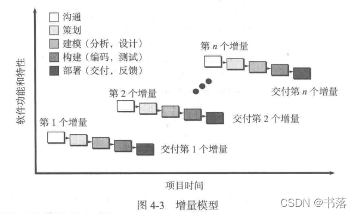
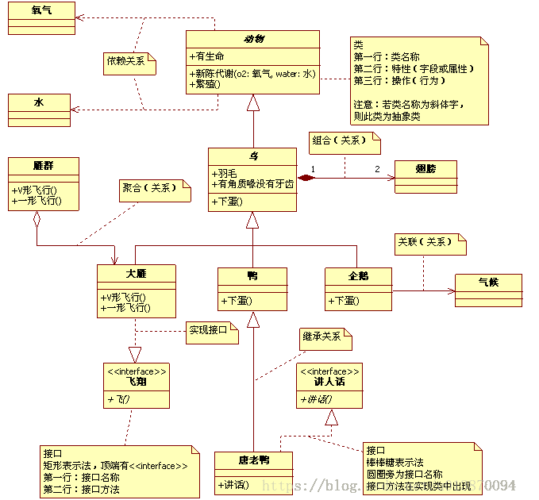
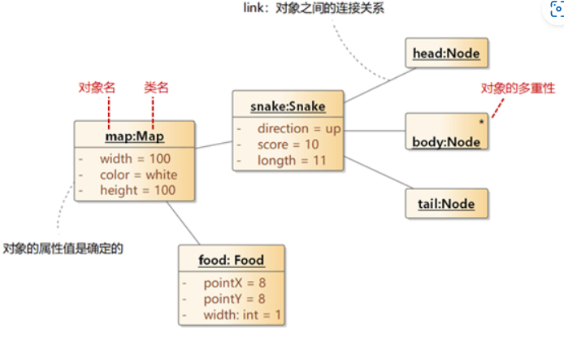

# 软件工程

主要教材：软件工程原理（沈备军）

其他：

- Software Engineering: A Practitioner's Approach(7.th ed.)2009
- lan Sommerville: Software Engineering

## 软件工程学概述

### 软件

软件 = 程序+相关数据+文档

软件是人脑力劳动的结晶

#### 基本特征

- 非物质，不遵循物理定理
- 逻辑实体，不可触摸
- 无磨损 -> 故障曲线率

- 手工开发，过程复杂
- 维护成本高
- 充满创造性、而且唯一
- 复制成本低

#### 突出特征

- 软件是人类迄今为止最复杂的人造产品
- 软件是频变的
  - 改变容易
  - 需求容易改变
- 软件是商品
  - 软件开发成本很昂贵

#### 产品

使用性：商业色彩，被交易

价值：有高有低

质量：用户选择产品的最终原因

人造产品设计：模块化

优点：

- 维护成本低，易于更换坏的产品
- 便于分工
- 降低产品设计难度（分治）

缺点：

- 不一定天然的存在交互关系
- 复杂性过高
- 性能损耗
- 模块化支撑的人造产品存在复杂度的极限

#### 软件危机

软件危机是一个术语，用来描述在软件开发和维护过程中遇到的一系列严重问题。这个概念最早在1960年代晚期出现，当时计算机行业迅速发展，但软件开发的实践和理论并未能跟上硬件的飞速进步。软件危机主要表现为以下几个方面：

##### 软件危机的主要表现

1. **项目超时和超预算**：软件项目常常无法按预定时间和预算完成。
2. **质量问题**：软件产品经常出现错误和缺陷，且难以维护。
3. **规模扩大**：随着技术的发展，软件系统变得越来越大和复杂，增加了管理和维护的难度。
4. **用户需求变化**：软件开发周期长，无法及时适应用户需求的变化。
5. **生产力问题**：软件开发的生产力提升速度跟不上硬件性能的提升速度。

##### 产生软件危机的原因

1. **技术发展的不平衡**：硬件技术的快速发展与软件技术的相对滞后形成鲜明对比。
2. **复杂性管理不当**：软件系统的设计和实现复杂性不断增加，但缺乏有效的管理和控制方法。
3. **需求理解不足**：在软件开发初期，对用户需求的理解不够深入和准确。
4. **缺乏合适的工具和方法**：早期的软件开发缺乏成熟的工具和方法支持。
5. **人才缺乏**：缺乏经验丰富的软件工程师来应对日益增长的需求。
6. 软件越来越复杂
7. 人的局限性
8. 软件越来越重要

### 软件工程

为了应对“软件危机”, 专家们主张以工程化方法开发软件产品,  即 **软件工程(SE)**

- SE主要研究：控制软件及其开发过程的复杂性，从而消减软件危机及其负面影响
- 软件工程是一门实践
- 软件本身无法量产，欠工程性，在工程发展路上，但是还未成功

#### 本质

1. 软件工程关注于大型程序的构造;（关注大型程序）

2. 软件工程的中心课题是控制复杂性; (控制复杂性)

3. 软件经常变化; (考虑软件可能变化)

4. 开发软件的效率非常重要;(关注软件开发效率)

5. 和谐地合作是软件开发的关键; (团队开发)

6. 软件必须有效地支持它的用户; (满足用户需求)

7. 在软件工程领域中是由具有一种文化背景的人替具；(缺乏相关领域知有另一种文化背景的人创造产品。)

#### 软件功能

- 用户视角
  - 实用；审美
- 产品视角
  - 基础 核心 外围
- 数据视角 
  - 生成 存储 加密 传输 报表
- 结构视角
  - 逻辑

三高：

- 高风险
- 高收益
- 收益伴随风险
- 过程影响结果，在成熟的工程中，过程决定结果
- 但是软件行业不能算是成熟的工程，所以人比过程更影响结果

#### 底层逻辑

价值制导

质量关键：人

分而治之 面向对象

**核心问题：**工程师如何以快速、便宜和高质量的方式开发出正确的软件产品？

做工程一定要签合同：

- 留一手
- 谈判技巧

工程不同于科学的地方在于：

#### 魔鬼四角

“四角”之间**总存在冲突或制约**关系，无法全被完整有效地满足

#### 四大挑战

1. 规模

   - 待开发软件的规模越大，项目失败率就越高

   

   - DeRemer规模定律
     - 能有效用于小型软件产品和项目的工程技术和经验都不能同等有效地应用于大型软件产品和项目
   
2. 生产率与质量

   - 典型体现：
     - 低生产率
     - 低质量
   - 软件的生产率与质量之间存在必然联系
     - Brooks“银弹”定律
     - Mills 生产率定律
   - “银弹”
     - 原意：能够在十年内提高软件生产率、可靠性和简化程度十倍以上的工程技术
     - 泛指：能够在短时间内迅速而显著改善软件生产率和质量的技术、过程、语言或工具
     - **软件开发没有“银弹”，即不存在能够在短时间内显著改善软件生产率和质量的技术、过程、语言和工具。**
   - Mills生产率定律
   - 
   
3. 可重复

4. 频变

### 软件工程师

计算机学生多，人才市场供不应求

不要只盯着大企业，看看中小企业

- 眼界高
- 手不能低

道德守则：人道 无害

**实践守则：实事求是 恪守公心 善用工具 终身学习**

项目经理也可以算是软件工程师；技术领袖

#### 能力分级

学->能做事->善于做事->教

#### 职业路线图

## 软件过程

软件过程（Software Process）是指在软件开发和维护过程中，为了生产软件产品而进行的一系列活动、方法和实践的集合，有时被称为**软件生命周期**。它涉及从项目的初始概念开始，到产品的最终交付和维护的整个生命周期。软件过程的目的是确保软件产品的质量和满足用户需求，同时提高开发效率和效果。

**软件过程通常包括以下几个主要阶段：**

1. **需求分析（Requirements Analysis）**：在这个阶段，开发团队与利益相关者沟通，以确定软件需要完成的功能和性能要求。这些需求是后续设计和开发的基础。
2. **系统设计（System Design）**：基于需求分析的结果，进行系统的架构设计。这包括定义系统的整体结构、组件、接口以及数据模型。
3. **实现（Implementation）**：在这一阶段，将设计转化为实际的代码。编程是这一阶段的主要活动。
4. **测试（Testing）**：测试是为了验证和确认软件是否符合需求规格，包括单元测试、集成测试、系统测试和验收测试等。
5. **部署（Deployment）**：在这个阶段，软件被部署到用户的环境中，使其可以被实际使用。
6. **维护（Maintenance）**：软件交付后，还需要进行持续的维护和更新，以修复可能出现的问题，满足新的需求，或对软件进行改进和优化。

**软件生命周期各个阶段:**

1. 问题定义;
2. 可行性研究;
3. 需求分析;
4. 总体设计 (概要设计) :
5. 详细设计;
6. 编码与单元测试;
7. 综合测试;
8. 维护。

### 软件生命周期模型

当软件系统进入维护和演化的时候，质量会转下

#### Royce（瀑布）模型

- 基于朴素的**分析-编程**（AC）模型

**回路**，与自然界中瀑布不同的地方

优点：

- 有利于大型软件开发过程中人员的组织、管理，从而提高了大型软件项目开发的质量和效率。
- 当需求确定、工作采用线性的方式完成的时候瀑布模型是一个很有用的过程模型。

缺点:

- 过于理想，缺乏灵活性，容易产生需求偏差。
- 实际的项目很少遵守瀑布模型提出的顺序。
- 客户通常很难清楚的描述所有的需求。
- 客户必须要有耐心，因为只有在项目接近尾声的时候，他们才能得到可以执行的程序。
- 适用范围： 需求确定，工作能够采用线性的方式完成的软件。

#### V模型（V-model）

V模型强调软件开发的协作和速度，将软件实现和验证有机地结合起来，在保证较高的软件质量情况下缩短开发周期。

优点：适合工程量小、人力资源少并且开发过程中改动不大的项目

缺点：错误发现时间迟，产生的风险代价高

#### 增量-迭代模型

增量过程模型侧重于每一个增量都提交一个可以运行的产品

**适用范围：**

（1）进行已有产品升级或新版本开发，增量模型是非常适合的；
（2）对完成期限严格要求的产品，可以使用增量模型；
（3）对所开发的领域比较熟悉而且已有原型系统，增量模型也是非常适合的。
（4）项目在既定的商业要求期限之前不可能找到足够的开发人员

### 敏捷开发专题

水油不相容：敏捷 vs 质量

**敏捷宣言（Agile development manifesto）：**个人和他们之间的交流胜过了开发过程和工具

- 可运行的软件胜过了宽泛的文档
- 客户合作胜过了合同谈判
- 对变更的良好响应胜过了按部就班地遵循计划

**极限编程（Extreme Programming (XP)）**：极限编程是敏捷软件开发使用最广泛的一个方法。

#### 极限编程

1. 策划：

   - 开始创造“用户故事”

   - 敏捷团队评估每个故事并分配一个成本（开发周数）

   - 故事被分组到一个可交付增量

   - 承诺在交付日期进行

   - 在第一次递增之后，“项目速度”用于帮助估计后续发行版本的发布日期和进度安排，确定是否对整个开发项目中的所有故事有过分承诺。

2. 设计

   - 遵循KIS（保持简洁）原则

   - 鼓励使用CRC（类-责任-协作者）卡（见第8章）

   - 对于困难的设计问题，建议创建“尖峰解决方案” - 一个设计原型

   - 鼓励“重构”： 重构是以不改变代码外部行为而改进其内部结构的方式来修改软件系统的过程。

3. 编码

   - 在编码开始之前，建议对故事进行[单元测试](https://so.csdn.net/so/search?q=单元测试&spm=1001.2101.3001.7020)

   - 鼓励“结队编程”

   - 连续集成

   - 有助于避免兼容性和接口问题，建立能及早发现错误的“冒烟测试”

4. 测试

   - 所有的单元测试每天都执行

   - “验收测试”，由客户规定技术条件，并且着眼于客户可见的、可评审的系统级的特征和功能。

### 项目管理

#### 人月定律

**人月定律（The Mythical Man-Month）**是软件工程领域的一个著名概念，最早由 Fred Brooks 在其1975年的著作《人月神话》中提出。这个定律的核心观点是：“在软件项目管理中，增加人手并不能相应地减少项目完成所需的时间，反而可能导致项目进度的延迟。”

人月定律主要基于两个观察：

1. **软件项目的复杂性和不确定性**：软件开发不像物理工程项目，它涉及大量的创新和不可预见的挑战，因此难以通过简单增加人手来线性缩短开发时间。
2. **团队沟通成本的增加**：项目团队成员数量增加会导致沟通渠道数目呈指数级增长，增加了协调和沟通的难度，从而降低了工作效率。

##### 举例说明：

假设有一个软件开发项目，预计由一个团队在12个月内完成。项目开始后不久，管理层发现项目进展缓慢，决定增加人手以加快开发速度，将原本的5人团队增加到10人。按照直觉，许多人可能会认为**这样可以将项目时间减半，即6个月完成。**

然而，根据人月定律，这种做法可能会适得其反。新增的团队成员需要时间来熟悉项目，原有团队成员需要花时间帮助新成员上手，而且团队成员之间的沟通成本显著增加。结果，项目可能不仅无法在预期的6个月内完成，反而可能需要比原计划更长的时间。

人月定律提醒我们，在软件项目管理中，简单地增加人力资源并不总是解决问题的有效方法。它强调了规划、沟通、团队协作和项目管理的重要性。

### 软件规划

发生在开发之前：问题定义，可行性分析 层层定义 版本规划

问题定义：

钞能力：交通灯（老师和学生需求冲突）(问题选择，告诉别人你如果不这样完成 成本更大)

用户痛点：让交通局理解问题

写作：

1. 短一点，简洁
2. 投其所好：投资人语言 背景 不要写投资人不懂的

可行性分析：

工程师 和 投资人 都会做可行性分析，投资人推动可行性分析

是否可行：

1. 技术
2. 经济
   1. 价值
   2. 成本
   3. 社会接受度 
3. 商业团队来进行可行性分析

谁来主导：不要越界，这是投资人的事情，你推动会让投资人觉得其中有不利于他的，自己又当运动员又当裁判是不利的

估价：1. 竞品 2. 历史 

愿景，渐进地推动愿景完整的实现

### 软件过程的选择、裁剪、评估和改进

#### 软件过程的评估

1. CMMI（Capability Maturity Model Integration）

CMMI 是一个为了提升组织的过程效能而设计的成熟度模型。它被广泛应用于软件工程和其他项目管理领域。CMMI 的核心要素包括：

- **成熟度级别**：CMMI 包含五个成熟度级别，每个级别代表组织过程能力的不同阶段：
  1. **初始级（Initial）**：过程预测性和控制性差。
  2. **可管理级（Managed）**：过程得到了基本管理。
  3. **已定义级（Defined）**：组织有标准化的过程。
  4. **量化管理级（Quantitatively Managed）**：过程和产品质量得到量化管理。
  5. **优化级（Optimizing）**：持续过程改进。
- **实践区域**：CMMI 定义了不同的实践区域，如项目管理、过程管理、工程管理等，每个区域包含一系列目标和实践。

2. ISO/IEC 25010（系统和软件工程 - 系统和软件产品质量模型）

ISO/IEC 25010 提供了一个框架，用于评估软件产品的质量。它定义了以下质量特性：

- **功能性**：软件是否满足用户需求。
- **性能效率**：系统资源使用的有效性。
- **兼容性**：软件与其他系统或软件的兼容性。
- **可用性**：用户使用软件的便利性。
- **可靠性**：软件的稳定性和准确性。
- **安全性**：保护信息和数据的能力。
- **可维护性**：进行修改和更新的易程度。
- **可移植性**：在不同环境中使用的能力。

## 需求工程

并不是所有的“需要”都要表达为需求

**广义的需求：**

- 项目需求
  - 必须一年后完成
- 产品需求
  - 产品允许用户使用有效账号登录
- 系统需求
  - 与什么硬件兼容
- 过程需求
  - 用什么语言

项目流程：

- 项目启动
  - 立项 合同（具有法律效应）
  - 合同谈判（讨价还价）
    - 视频证据 保留证据
    - 合同价格
    - 目标
    - 验收
  - 合同签订
    - 子合同
      - 子合同赚钱，第一个合同说不定不赚钱or亏钱
  - 规模
    - 代码量
    - 功能点
- 规划
  - 经验法
  - 算法
- 实施
- 验收

### Glass需求不足定律

“需求不足”是导致软件开发项目失败、失控或失效的最主要原因。需求过程不易于避免需求不足

- 需求是会经理频繁变更的，且通常会越变越多
- 核心价值需求会占据非常多的价值（二八定理），同时也会很大程度影响项目的超时和超支程度
- 需求难 无法通过技术革新而解决

### 需求文档写作

实事求是，按需写作，简洁易懂

- 不可行的不要写入文档，写入文档的需要标注：可行性有待考究

- 高效

- 完整

- 不应该出现多音字歧义现象

- 单义

- 单责

- 可测

需求写作规范：

- 语法正确且结构完整，主谓宾标点符号
- 陈述语气完整
- 主动语态
- 常用字词
- 短句子，英文最好不要超过两行，中文一点五行

- 需求过程：用户与需求

- 需求前奏：可行性分析

- 需求获取：常用策略、方法与实践

- 需求分析：分簇、依赖分析、优先级定义

- 需求描述：高质量需求的基本要求、IEEE需求模板

- 需求确认：用户的作用、原型法、审查法

为用户画像：

- 一般特征
- 社会特征
- 产品相关

功能：

- 
  成本：工程师+时间

- 甘特图：项目经理的唯一工具

- 工作分解结构：WBS

### 模板文档讲解

标题页 目录页

SRS：软件需求规约

- 目的
- 软件架构
  - UML
- 质量需求
- 非功能需求
- 可追溯性

双峰模型：需求定义&架构设计  需求爆炸阶段

需求和架构互相促进，架构可以放入需求文档，在第二个版本的需求中可以看到第一个版本架构

- 解释各部分之间的关系
- 对于功能需求最重要
  - 子标题何来 需求到设计

亮点：文字写作，简洁；UML图，迭代过程，分簇

### 软件需求

目标和需求，不要将需求写成目标

the system must do sth. 

should 

who

could/may

### 软件设计

需求是靠近问题域的，设计是靠近产品域的

需求和设计之间没有鸿沟

技术选型：

- 技术有效性
- 产品适用性
  - 技术是否适合一个产品
- 技术成熟度
- 兼容性

用例=故事

面向用户用例

技术性用例

用例之间也可能有关系

需求 设计 开发 测试

## 面向对象的分析建模

### 分析模型

分析模型从功能、关键抽象和动态行为等多个方面来对软件系统所要解决的问题进行抽象和描述，分析模型关注于问题而非解决方案，即问题是什么而不是问题怎么解决

## 设计工程

### 设计工程概述

架构设计和详细设计

### 软件设计原则

#### 分解和模块化

##### 分解（Decomposition）

分解是将复杂的系统拆分成更小、更易于管理和理解的部分的过程。在软件设计中，**分解是一种常见的策略，用于处理系统的复杂性**。其主要目的是通过识别系统的组成部分及其相互关系，从而简化设计、实现和测试的工作。分解通常可以采用以下几种方式：

1. **功能分解**：将系统分解成可以独立执行特定功能的模块。每个模块负责一个具体的功能点。
2. **数据分解**：基于数据结构来分解系统，关注如何存储、管理和访问数据。
3. **对象分解**：在面向对象设计中，将系统分解成一系列相互作用的对象。

分解的关键在于识别系统的自然边界，将复杂的问题分解成一系列更小、更具体的问题，然后独立解决每一个小问题。

##### 模块化（Modularity）

模块化是分解过程的自然结果，它涉及到将系统划分为模块的实践，每个模块执行一组相关功能。模块化的主要好处包括：

1. **可维护性**：模块化设计使得理解单个模块变得更加容易，从而简化了维护工作。当需要修改或更新某个功能时，只需要关注与该功能相关的模块，而不是整个系统。
2. **复用性**：设计为独立模块的组件更容易在其他系统或项目中复用。
3. **可测试性**：模块化的系统更易于进行单元测试，因为每个模块可以独立于系统的其他部分进行测试。
4. **并行开发**：不同的团队可以并行开发不同的模块，加快开发速度。

在进行模块化设计时，通常会遵循以下几个原则：

- **高内聚**：模块内部的元素应该紧密相关，执行一组相关的功能。
- **低耦合**：不同模块之间的依赖关系应该尽可能地减少，使得每个模块尽可能独立。
- **封装**：模块应该隐藏其内部的实现细节，只通过定义良好的接口与外界交互。

#### 封装（Encapsulation）

**定义**：封装是指将对象的数据（属性）和行为（方法）组合在一起，并对外部隐藏对象的内部实现细节。封装的主要目的是保护对象内部的状态和实现细节，仅通过定义好的接口与外界交互，这样可以防止外部代码随意修改对象内部的数据。

**举例**：考虑一个账户（Account）类，它有一个私有属性 balance（余额）。这个类提供了公共方法来允许外部代码存款（deposit）和取款（withdraw），但不允许直接访问 balance 属性。这种方式就实现了封装，因为它隐藏了具体的实现细节（如余额如何存储），同时提供了公共接口来与外界交互。

#### 高内聚和低耦合

##### 高内聚（High Cohesion）

**定义**：内聚性是指模块内部各个部分之间关联的紧密程度。高内聚是指一个模块的各个部分紧密地围绕着一个单一的、明确的任务或责任进行组织。高内聚通常被认为是优秀软件设计的特征之一，因为它促进了模块的独立性和可重用性。

**举例**：假设有一个在线购物应用，其中包括一个“购物车”模块。如果这个模块专门负责与购物车相关的所有操作，如添加商品、删除商品、计算总价等，而不涉及支付处理、用户认证等其他功能，那么可以认为这个模块具有高内聚。

##### 低耦合（Low Coupling）

**定义**：耦合是指不同模块之间的相互依赖程度。低耦合是指减少模块之间的依赖关系，使得每个模块尽可能独立于其他模块。低耦合的设计有助于提高系统的灵活性和可维护性，因为改变一个模块的内部实现不太可能影响到其他模块。

**举例**：在同一个在线购物应用中，假设有一个“支付处理”模块。如果这个模块可以独立于购物车模块工作，即使购物车模块发生更改，也不会影响支付处理模块的功能，那么这两个模块之间就是低耦合的。

### 设计模式:star:

设计模式是在软件设计中反复出现的问题的通用解决方案。它不是一个可以直接转化成代码的完整设计，而是一种在特定上下文中解决特定问题的模板。设计模式提供了一种在某些情况下避免重复发明轮子的方法，使软件设计更加高效、清晰和优雅

设计模式通常根据其解决的问题类型和用途分为以下三大类：

1. **创建型模式（Creational Patterns）**：
   - 这类模式与对象的创建有关，帮助构造对象，同时隐藏创建逻辑，而不是直接使用 new 运算符实例化对象。这样可以增加程序的灵活性，因为系统使用的具体类是独立于创建和初始化的。
   - 示例包括：单例模式（Singleton）、工厂方法模式（Factory Method）、抽象工厂模式（Abstract Factory）、建造者模式（Builder）、原型模式（Prototype）。
2. **结构型模式（Structural Patterns）**：
   - 这类模式涉及到对象的组合，通常用于构建复杂的对象结构。结构型模式可以确保系统的部分改变不会影响到其整体结构。
   - 示例包括：适配器模式（Adapter）、桥接模式（Bridge）、装饰器模式（Decorator）、组合模式（Composite）、外观模式（Facade）、享元模式（Flyweight）、代理模式（Proxy）。
3. **行为型模式（Behavioral Patterns）**：
   - 这类模式主要关注对象之间的通信方式，专注于算法和对象之间职责的分配。
   - 示例包括：责任链模式（Chain of Responsibility）、命令模式（Command）、解释器模式（Interpreter）、迭代器模式（Iterator）、中介者模式（Mediator）、备忘录模式（Memento）、观察者模式（Observer）、状态模式（State）、策略模式（Strategy）、模板方法模式（Template Method）、访问者模式（Visitor）。

### 创造型设计模式

#### 1. 单例模式（Singleton）

**定义**：单例模式确保一个类只有一个实例，并提供一个全局访问点。这对于控制资源的访问或者在整个程序中需要一个共享状态的情况非常有用。

**示例**：考虑一个应用程序的日志记录器。通常，整个应用中只需要一个日志记录器实例来收集日志。使用单例模式，可以确保所有试图创建日志记录器的调用都返回同一个日志记录器实例。

#### 2. 工厂方法模式（Factory Method）

**定义**：工厂方法模式定义了一个创建对象的接口，但让子类决定要实例化的类。它让类的实例化推迟到子类。

**示例**：假设有一个应用，需要根据不同的文件格式（如 XML、JSON）创建不同的解析器。可以定义一个解析器工厂接口，然后为每种文件类型实现一个具体的工厂类。

#### 3. 抽象工厂模式（Abstract Factory）

**定义**：抽象工厂模式提供了一个接口，用于创建一系列相关或相互依赖的对象，而无需指定它们具体的类。

**示例**：考虑一个家具店，需要创建一系列相关产品，如维多利亚风格的椅子、沙发和茶几。使用抽象工厂模式，可以定义一个接口来创建一套维多利亚风格的家具，而具体的家具实例化细节则由实现这个接口的工厂类来处理。

#### 4. 建造者模式（Builder）

**定义**：建造者模式将一个复杂对象的构建与其表示分离，以便同样的构建过程可以创建不同的表示。它常用于构建复杂对象。

**示例**：想象一个复杂的文档编辑器，它可以创建多种格式的文档（如文本、RTF、HTML）。使用建造者模式，可以定义一个文档构建者接口，然后为每种文档格式提供一个具体的构建者实现。

#### 5. 原型模式（Prototype）

**定义**：原型模式用于创建重复的对象，同时又能保证性能。这种模式通过复制现有的实例来创建新的实例，而不是通过新建。

**示例**：假设在一个游戏中，有数百个相似的敌人角色。使用原型模式，可以简单地复制一个原型敌人对象，并对其进行小的调整，而不是从头开始创建每个敌人，从而提高性能和减少内存消耗。

### 结构型设计模式

### 行为型设计模式

## 面向对象的设计建模

### 架构设计

4+1架构视图：逻辑视图、进程视图、物理视图、开发视图、场景视图

1. **逻辑视图（Logical View）**：这个视图主要关注系统的功能性需求，展示了系统的各个模块或组件如何相互作用，以实现系统的业务功能。它通常使用类图、对象图等UML图来表示。
2. **开发视图（Development View）**：这个视图着重于软件的静态组织结构，如源代码的组织方式、软件的模块化和层次结构。它通常通过包图、组件图等来描述。
3. **进程视图（Process View）**：进程视图关注系统的运行时方面，如并发处理、系统进程的组织、同步和通信机制。它通常用来描述系统的动态方面，如并发活动和运行时行为。
4. **物理视图（Physical View）**：物理视图描述系统的物理部署，包括硬件和网络环境，以及软件组件如何映射到物理设备上。这个视图使用部署图来表示。
5. **场景（Scenarios）**或**用例视图（Use Case View）**：这不是一个独立的视图，而是串联其他四个视图的线索。它通过用例或场景的形式，展示了系统功能如何在各个视图中实现。这有助于理解各个视图之间的关系，以及它们是如何集成在一起的。

### 包和子系设计

#### 包设计原则

重用-发布等价原则

### 类设计:star::star:

#### 类设计原则

1. **单一职责原则（Single Responsibility Principle, SRP）**：
   - 一个类应该只有一个引起它变化的原因。这意味着一个类应该只承担一种职责或功能。
   - 例如，考虑一个日志记录类。如果这个类负责日志记录和日志格式化，那么它就有两个改变的理由：一是日志记录的方式变化（如写入文件或数据库），二是日志格式变化（如格式的细节）。按照单一职责原则，应该将日志记录和日志格式化分离成两个类，每个类只负责一个职责。
2. **开闭原则（Open-Closed Principle, OCP）**：
   - 软件实体（如类、模块、函数等）应该对扩展开放，对修改关闭。这意味着类的行为可以扩展，但修改一个类时不应该修改源代码
   - 设想一个图形处理程序，可以绘制不同类型的图形。如果新增一种图形，比如三角形，不应该修改现有的图形处理程序代码，而是应该扩展程序，添加一个新的三角形类。这样，原有代码保持不变，而程序功能得到了扩展。
3. **里氏替换原则（Liskov Substitution Principle, LSP）**：
   - 子类在不改变原有程序正确性的情况下，应该能够替换掉它们的父类。这意味着子类的行为应该与父类行为一致。
   - 假设有一个基类“鸟”，和一个子类“企鹅”。通常鸟可以飞，但企鹅不能飞。如果“鸟”类有一个“飞”方法，那么“企鹅”类继承“鸟”就违反了里氏替换原则，因为企鹅不能飞。正确的设计是将“鸟”类拆分，或重新定义基类，确保所有子类都能替换基类而不破坏程序的正确性。
4. **接口隔离原则（Interface Segregation Principle, ISP）**：
   - 客户不应该依赖于它不使用的接口。这意味着应该创建细小的、专用的接口，而不是一个庞大的单一接口。
   - 假设有一个多功能打印机接口，包含打印、扫描和复印功能。如果有的打印机只支持打印功能，那么它们被迫实现不需要的扫描和复印方法。按照接口隔离原则，应该将这个接口拆分为三个独立的接口，每个接口只包含一种功能。
5. **依赖倒置原则（Dependency Inversion Principle, DIP）**：
   - 高层模块不应依赖于低层模块，它们都应该依赖于抽象；抽象不应该依赖于细节，细节应该依赖于抽象。这原则鼓励设计者优先使用抽象类和接口来建立类之间的关系，而不是让高层模块直接依赖低层模块的具体实现。
   - 设想一个应用程序依赖于具体的数据库访问类。这种直接依赖使得切换到另一种数据库变得困难，因为需要修改应用程序的代码。按照依赖倒置原则，应该依赖于一个抽象的数据库访问接口，而具体的数据库访问类则实现这个接口。这样，更换数据库只需要替换具体的实现类，而不需要改动应用程序的核心代码。

#### 类设计过程

### 持久化设计

#### 数据库设计

为什么需要定义学生表：

需求！

概念设计ER图  逻辑设计 表   物理设计

数据库工程师：

- DBA
- 数据分析师
- 数据合规审查员
  - 需要：国际金融和国际法律
  - 行业很小

- 界面设计师

MongoDB

## UML 专题:star::star:

### 用例图

由**参与者（Actor）、用例（Use Case）** 以及**它们之间的关系**构成的用于描述系统功能的动态视图称为用例图。
其中用例和参与者之间的对应关系又叫做**通讯关联（Communication Association）**。

#### 元素

参与者（角色）、用例、系统边界、元素之间的关系

- 参与者(Actor)——与应用程序或系统进行交互的用户、组织或外部系统。用一个小人表示。
  - 存在于系统外部并直接与系统交互的人、系统、子系统或类的外部实体的抽象。每个参与者可以参与一个或多个用例，每个用例也可以有一个或多个参与者。
- 用例(Use Case)——用例就是外部可见的系统功能，对系统提供的服务进行描述。用椭圆表示。
  - 用例的识别存在粒度大小的问题，用例必须给执行者一个可观测的有价值的结果，一个用例是系统和执行者之间的一次完整“对话”
- 系统边界——系统边界是指系统与系统之间的界限。用方形框+系统名称表示。

##### 执行者的识别（Actor Identification）

**执行者**是与系统交互的外部个体或其他系统。它们可以是直接或间接与系统交互的任何东西。

1. **确定系统边界**：首先确定你要分析的系统的边界，这有助于识别系统外部的实体。
2. **识别外部用户**：思考哪些用户会直接与系统交互。这些可能是人（例如用户、管理员）、其他系统或组织。
3. **识别外部系统**：确定与系统交互的外部系统或服务。比如，支付网关、数据库或第三方服务。
4. **识别角色**：一个人可能在不同情境下扮演不同的角色。例如，一个人可能既是购物者也是商品评论者。
5. **考虑间接用户**：一些用户可能不直接与系统交互，但他们的行为或需求可能会间接影响系统功能

#### 关系

- 用例图中的关系有四种：**关联、泛化、包含、扩展**

| 关系类型 | 说明                       | 表示符号                                                     |
| -------- | -------------------------- | ------------------------------------------------------------ |
| 关联     | 参与者与用例之间的关系     |  |
| 泛化     | 参与者之间或用例之间的关系 |  |
| 包含     | 用例之间的关系             |  |
| 扩展     | 用例之间的关系             |  |

泛化：指把某些参与者的共同行为提取出来表示成通用行为，并描述成超类。泛化关系表示的是参与者之间的一般或特殊关系。使用带空心三角箭头的实现表示泛化关系，箭头指向超类参与者。

包含：包含关系指**用例可以简单地包含其他用例具有的行为，并把它所包含的用例行为作为自身行为的一部分。**
在UML中，包含关系是通过**带箭头的虚线段 + << include >>字样**来表示的，箭头**由基础用例（Base）指向被包含的用例（Inclusion）**。

##### 包含（Include）

**定义**：包含关系是一种用例之间的依赖关系，表示一个用例（基础用例）在执行过程中包含另一个用例（被包含用例）的行为。这种关系常用于重用行为，避免在多个用例中重复描述相同的行为。

**举例**：在一个网上购物系统中，多个用例可能都需要进行“验证用户身份”的操作。可以将“验证用户身份”设计为一个独立的用例，并在其他需要这一行为的用例中通过包含关系引用它。

##### 扩展（Extend）

**定义**：扩展关系是一种条件性的用例关系，表示一个用例（扩展用例）在某些条件下扩展或增加另一个用例（基础用例）的行为。扩展用例通常是可选的，仅在特定条件下执行。

**举例**：在同一个网上购物系统中，可能有一个基础用例“结账”，而“使用优惠券”可以是一个扩展用例。只有在用户选择使用优惠券时，扩展用例才会被执行。

##### 泛化（Generalization）

**定义**：泛化关系是一种用例之间的继承关系，其中一个更一般的用例（父用例）被其他更特定的用例（子用例）所继承。这意味着子用例继承了父用例的所有行为，并且可以添加自己特有的行为。

**举例**：考虑一个支付系统，可能有一个一般的用例“进行支付”。这个用例可以被更具体的用例继承，如“信用卡支付”和“电子钱包支付”。这些子用例继承了“进行支付”的基本行为，同时还包含了自己特定的支付处理细节。

参与者间的关系：由于参与者实质上也是类，所以它拥有与类相同的关系描述，即参与者与参与者之间主要是泛化关系

#### 举例

### 类图

#### 元素

具体类、抽象类、接口和包

##### 具体类

- “+”表示 `public`；
- “-”表示 `private`；
- “#”表示 `protected`；
- 不带符号表示 `default`。

##### 抽象类

抽象类的类名以及抽象方法的名字都用斜体字表示

##### 接口

接口在类图中的第一层顶端用构造型` <<interface>>`表示，下面是接口的名字，第二层是方法

##### 包

#### 关系

关系共有六种类型，分别是实现关系、泛化关系、关联关系、依赖关系、聚合关系、组合关系

##### 实现关系

实现关系是指接口及其实现类之间的关系。在UML类图中，实现关系用空心三角和虚线组成的箭头来表示，从实现类指向接口

##### 泛化关系

泛化关系（Generalization）是指对象与对象之间的继承关系。如果对象A和对象B之间的“is a”关系成立，那么二者之间就存在继承关系，对象B是父对象，对象A是子对象。

##### 关联关系

关联关系（Association）是指对象和对象之间的连接，它使一个对象知道另一个对象的属性和方法。如果一个对象的类代码中，包含有另一个对象的引用，那么这两个对象之间就是关联关系。

关联关系有单向关联和双向关联。如果两个对象都知道（即可以调用）对方的公共属性和操作，那么二者就是双向关联。如果只有一个对象知道（即可以调用）另一个对象的公共属性和操作，那么就是单向关联。大多数关联都是单向关联，单向关联关系更容易建立和维护，有助于寻找可重用的类。

在UML图中，双向关联关系用带双箭头的实线或者无箭头的实线双线表示。单向关联用一个带箭头的实线表示，箭头指向被关联的对象。这就是导航性（Navigatity）。

一个对象可以持有其它对象的数组或者集合。在UML中，通过放置多重性（multipicity）表达式在关联线的末端来表示。多重性表达式可以是一个数字、一段范围或者是它们的组合。多重性允许的表达式示例如下：

- 数字：精确的数量
- `*`或者`0..*`：表示0到多个
- `0..1`：表示0或者1个，在Java中经常用一个空引用来实现
- `1..*`：表示1到多个

关联关系又分为依赖关联、聚合关联和组合关联三种类型。

##### 依赖关系

依赖（Dependency）关系是一种弱关联关系。如果对象A用到对象B，但是和B的关系不是太明显的时候，就可以把这种关系看作是依赖关系。如果对象A依赖于对象B，则 A “use a” B。比如驾驶员和汽车的关系，驾驶员使用汽车，二者之间就是依赖关系。

在UML类图中，依赖关系用一个带虚线的箭头表示，由使用方指向被使用方，表示使用方对象持有被使用方对象的引用

##### 聚合关系与组合关系

聚合（Aggregation）是关联关系的一种特例，它体现的是整体与部分的拥有关系，即 “has a” 的关系。此时整体与部分之间是可分离的，它们可以具有各自的生命周期，部分可以属于多个整体对象，也可以为多个整体对象共享，所以聚合关系也常称为共享关系。例如，公司部门与员工的关系，一个员工可以属于多个部门，一个部门撤消了，员工可以转到其它部门。

在UML图中，聚合关系用空心菱形加实线箭头表示，空心菱形在整体一方，箭头指向部分一方

组合（Composition）也是关联关系的一种特例，它同样体现整体与部分间的包含关系，即 “contains a” 的关系。但此时整体与部分是不可分的，部分也不能给其它整体共享，作为整体的对象负责部分的对象的生命周期。这种关系比聚合更强，也称为强聚合。如果A组合B，则A需要知道B的生存周期，即可能A负责生成或者释放B，或者A通过某种途径知道B的生成和释放。

例如，人包含头、躯干、四肢，它们的生命周期一致。当人出生时，头、躯干、四肢同时诞生。当人死亡时，作为人体组成部分的头、躯干、四肢同时死亡。

在UML图中，组合关系用实心菱形加实线箭头表示，实心菱形在整体一方，箭头指向部分一方

#### 举例

### 时序图

#### 元素

角色(Actor)、对象(Object)、生命线(LifeLine)、控制焦点(Activation)、消息(Message)、自关联消息、组合片段。

- 角色(Actor)
  - 系统角色，可以是人或者其他系统，子系统。以一个小人图标表示。
- 对象(Object)
  - 对象位于时序图的顶部,以一个矩形表示。对象的命名方式一般有三种：
    - 对象名和类名。例如：华为手机:手机、loginServiceObject:LoginService。
    - 只显示类名，不显示对象，即为一个匿名类。例如：:手机、:LoginSservice。
    - 只显示对象名，不显示类名。例如：华为手机:、loginServiceObject:。
- 生命线(LifeLine)
  - 时序图中每个对象和底部中心都有一条垂直的虚线，这就是对象的生命线(对象的时间线)。以一条垂直的虚线表。
- 控制焦点(Activation)
  - 控制焦点代表时序图中在对象时间线上某段时期执行的操作。以一个很窄的矩形表示。
- 消息(Message)
  - 表现代表对象之间发送的信息。消息分为三种类型。
  - 同步消息(Synchronous Message)
    - 消息的发送者把控制传递给消息的接收者，然后停止活动，等待消息的接收者放弃或者返回控制。用来表示同步的意义。以一条实线+实心箭头表示。
  - 异步消息(Asynchronous Message)
    - 消息发送者通过消息把信号传递给消息的接收者，然后继续自己的活动，不等待接受者返回消息或者控制。异步消息的接收者和发送者是并发工作的。以一条实线+大于号表示。
  - 返回消息(Return Message)
    - 返回消息表示从过程调用返回。以小于号+虚线表示。
- 自关联消息
  - 表示方法的自身调用或者一个对象内的一个方法调用另外一个方法。以一个半闭合的长方形+下方实心剪头表示。

#### 组合

组合片段一共有13种，他们的含义分别如下：

- ref：引用其他地方定义的组合片段；
- alt：在一组行为中根据特定的条件选择某个交互；
- opt：表示一个可选的行为；
- break：提供了和编程语言中的break类拟的机制；
- par：支持交互片段的并发执行；
- seq：强迫交互按照特定的顺序执行；
- strict：明确定义了一组交互片段的执行顺序；
- neg：用来标志不应该发生的交互；
- region：标志在组合片段中先于其他交互片断发生的交互；
- ignore：明确定义了交互片段不应该响应的消息；
- consider：明确标志了应该被处理的消息
- assert：标志了在交互片段中作为事件唯一的合法继续者的操作数；
- loop：说明交互片段会被重复执行

##### 选项（Option）

包含一个可能发生或不发生的序列。Opt相当于if..语句。

##### 循环（Loop）

片段重复一定次数，可以在临界中指示片段重复的条件。Loop相当于for语句。

##### 并行（Par）

并行处理，片段中的事件可以并行交错。Par相当于多线程。

##### ref（InteractionUse）

表示引用的意思，某部分交互被定义在另一个图中。可将一个规模较大的图划分为若干个规模较小的图，方便图的管理和复用。ref不用要填写参数。

#### 举例

### 通信图

当参与者向系统发送某种形式的消息而激活用例时，开始执行该用例中的动作序列。

**边界类对象**将接收来自**参与者**的消息。

**边界对象**向其他对象发送一个消息，并使有关对象与之交互从而实现该用例。

协作图的组成元素包括**对象、消息、链(连接器)**。消息表示了对象间的通信，对象通过链连接在一起。

对象

消息：需要给消息加序号

迭代标记：迭代标记用 * 号表示，表示循环，通常还有迭代表达式，用来说明循环规则。

### 活动图

### 状态图

和活动图不同的地方在于状态转变要写原因，所用图形一样

### 对象图

### 构件图

构件图描述构件及其相互依赖关系，构件是逻辑体系结构---类、对象和它们间的关系和协作中定义的概念和功能在**物理体系结构中的实现**。

**构件**：相对逻辑设计上的类和对象，构件是和物理系统相关的一个概念，不同的语言对构件的定义有所不同，UML中的构件含义包括**代码文件，也指数据库、动态链接库、web页面**等。

#### 1. 构件

构件是定义了良好接口的物理实现单元，是系统中可替换的物理部件。

构件可以是源代码构件、二进制构件或一个可执行的构件。

在UML中，构件用一个左侧带有突出两个小矩形的矩形来表示。

对于一个构件而言，它有**两类接口**：**提供（provided）接口**和**所需（required）的接口**。

标识接口的构件表示方法有3种。

#### 2. 依赖关系

构件间的关系以依赖的形式表达。把提供服务的构件称为提供者，把使用服务的构件称为客户。

在UML中，构件图中依赖关系的表示方法与类图中依赖关系相同，都是**一个由客户指向提供者的虚线箭头**。

#### 3. 接口

接口用于描述构件所提供的服务的一组操作集合，指定了构件的外部可见操作。可以通过接口访问一个构件。

接口和构件之间的关系分为两种：

- 实现关系（Realization）
- 依赖关系（Dependency）

在UML图中，**接口和构件**之间用**实线**连接表示**实现关系**；而**接口和构件**之间用**虚线箭头**连接则表示**依赖关系**。

- 导出接口由提供操作的构件提供。
- 导入接口供访问操作的构件使用。

------

#### 例题：对系统实现的体系结构进行建模

------

#### 例题：对源代码结构建模

### 部署图

部署图(deployment diagram，配置图)：是用来显示系统中软件和硬件的物理架构。从部署图中，您可以了解到软件和硬件组件之间的物理关系以及处理节点的组件分布情况。使用部署图可以显示运行时系统的结构，同时还传达构成应用程序的硬件和软件元素的配置和部署方式。
****
什么时候用部署图？
软件实现完成后用部署图画出软，硬件之间的物理拓扑结构，清晰的说明系统的使用部署，环境等情况。通过部署图，系统的相关人员可以知道软件应该安装在具体的那个硬件之上。

部署图的作用：
部署图用于描述部署软件组件的硬件组件。构件图和部署图密切相关。
（1）可视化系统的硬件拓扑
（2）描述用于部署软件的硬件组件
（3）描述运行时处理节点

二、部署图的组成
部署图由节点和关系两部分组成。有的部署图中也包含构件，但是构件必须在相对应的节点上，不是孤立的存在的。
1、节点：计算资源的通用名称。包括处理器和设备。两者的区别：前者是可以执行程序的硬件结构，如计算机和服务器等；后者是通过接口对外进行的服务，如打印机。
标记：每个节点应该给出应有的标记说明，如操作系统，供应商等。
表示：立体矩形框，处理器是带阴影的立方体，设备室不带阴影的立方体。

2、关系：依赖和关联。
同样在画关系时应该写明节点间联系的名称。如：服务器和客户端通过局域网连接。

三、绘制部署图
1、找出所要绘图系统的节点，确定节点。
2、找出节点间的通信联系。
3、绘制部署图，每个节点都有名称，写明节点间物理联系的名称。

下图是机房收费系统的部署图：一个服务器，多个客户端。

## 软件测试:star::star:

软件测试是发现在这些隐藏在应用中的错误的一种有效手段，他是软件开发过程中的关键活动

### 软件测试定义

错误、故障、缺陷、失效和事故的定义——P244

#### 软件测试的原则

1. 所有的软件测试应追溯到用户的需求
2. 测试不能发现所有缺陷，测试不能穷举
3. 80%的错误集中在20%的代码上！
4. 尽早和不断地进行软件测试
5. 避免测试自己的程序

测试是为了发现错误二执行程序的过程

考试：如何根据测试流图做测试

### 软件测试策略

单元测试、集成测试和系统测试

### 软件测试技术

#### 基于直觉和经验的测试

即兴测试  探索时测试

#### 基于代码的测试

##### 控制流测试

- 语句覆盖（SC）；
  - 语句覆盖(Statement Coverage)的含义就**是设计足够的测试用例，使得被测程序中每条语句至少执行一次**。又称行覆盖、段覆盖、基本块覆盖，它是最常见的覆盖方式。
  - 语句覆盖虽然可以测试执行语句是否被执行到，但却无法测试程序中存在的逻辑错误。因此，语句覆盖是一种弱覆盖。
  - 例如，如果上述程序中的第一个逻辑判断符号 “&&” 误写了 “||” ，使用测试用例同样可以覆盖 sacbed 路径上的全部执行语句，但却无法发现错误。同样，如果第二个逻辑判断符号 “||” 误写了 “&&” ，使用同样的测试用例也可以执行 sacbed 路径上的全部执行语句，但却无法发现上述逻辑错误。
  - 语句覆盖的目的：语句覆盖的目的是测试程序中的代码是否被执行，它只测试代码中的执行语句，这里的执行语句不包括头文件、注释、空行等。
  - 语句覆盖在多分支的程序中，只能覆盖某一条路径，使得该路径中的每一个语句至少被执行一次，但不会考虑各种分支组合情况。
- 判定覆盖（DC）；
- 条件覆盖（CC）；
- 判定-条件覆盖（CDC）；
- 条件组合覆盖（MCC）；
- 路径覆盖。

修正判定条件覆盖（Modified Condition/Decision Coverage 即 MC-DC）

程序中的每个输入和输出都至少被调用一次，在程序中的每一个条件必须产生所有可能的输出结果至少一次，并且每一个判定中的每一个条件必须能够独立影响一个判定的输出，即在其他条件不变的前提下仅改变这个条件的值，而使判定结果改变。

每一个变量都至少要改变一次值。

### 什么时候结束测试

最常见但却无用的两条准则：

1. 用完了安排的测试时间后，测试便结束。（没用，因为测试人员可以什么都不做直接等到测试时间结束）

2. 当执行完所有测试用例都未发现错误，测试便结束。也就是说，当所有的测试用例不成功时便结束。（没用，因为测试人员会下意识的编写不会发现错误的测试用例）

较为有用的三条准则：

1. 根据的是特定的测试用例设计技术。（解释：根据特定情况设计的所有测试用例最终都没有找到错误）
2. 以确切的数量来描述结束测试的条件。（解释：通过具体方法可以大致预测出错误的数量）
3. 测试过程中记录每个单位时间内发现错误的数量，绘制成曲线图，观察错误数量的趋势。（解释：观察曲线图趋势，根据经验判断结束时间）

## 考试

#### 题型

判断题 15个 2分

填空题 10个 2分

两道大题 七个小问 相对客观又有一定创造性

五个小问

两个小问

#### 考点

做决策！判断和理由

人月定律！如何解决

一个场景两个小问 一共15分

画图！

用例图！类图！时序图！面向对象的原则（开闭法则 替换法则 单一职责法则）判定并给出理由

测试！

白盒（控制流图 根据代码绘制出控制流图）   黑盒

语句覆盖 判定覆盖 条件覆盖 判断/条件覆盖

边界值法 划分法

