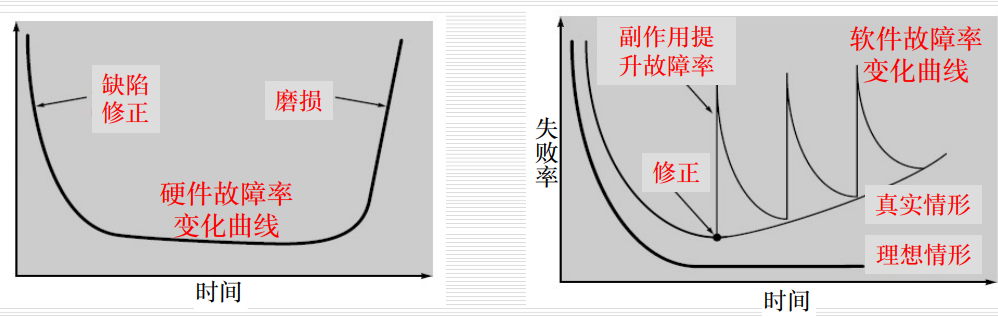
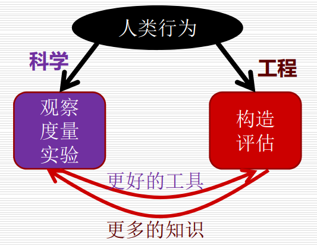
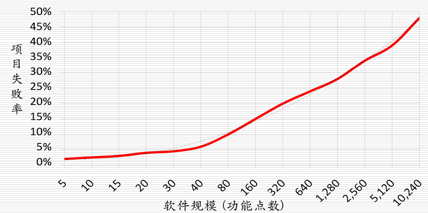
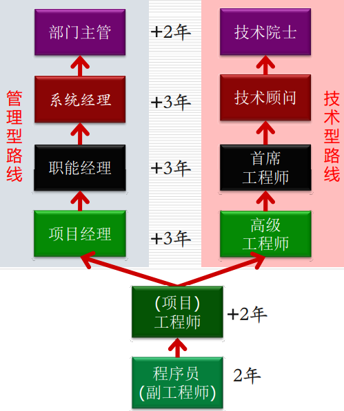
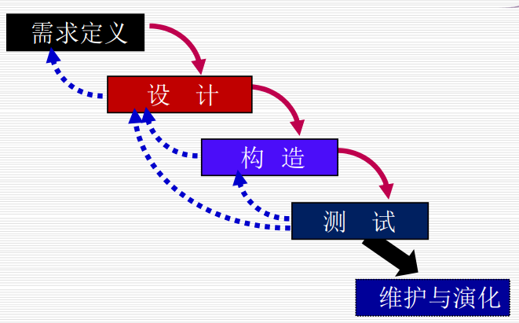

# 软件工程

主要教材：软件工程原理（沈备军）

other:

- Software Engineering: A Practitioner's Approach(7.th ed.)2009
- lan Sommerville: Software Engineering

## 软件工程学概述

### 软件

软件=程序+数据+文档

#### 基本特征

- 非物质，不遵循物理定理
- 逻辑实体，不可触摸
- 无磨损->故障曲线率

- 手工开发，过程复杂
- 维护成本高
- 充满创造性、而且唯一
- 复制成本低

#### 突出特征

- 软件是人类迄今为止最复杂的人造产品
- 软件是频变的
  - 改变容易
  - 需求容易改变
- 软件是商品
  - 软件开发成本很昂贵

#### 软件结构

数据库和CB一起构成模块化

分层

#### 软件功能

- 用户视角
  - 实用
  - 审美
- 产品视角
  - 基础
  - 核心
  - 外围
- 数据视角
  - 生成
  - 存储
  - 加密
  - 传输
  - 报表
- 结构视角
  - 逻辑

### 产品

使用性：商业色彩，被交易

价值：有高有低

质量：用户选择产品的最终原因

人造产品设计：模块化

优点：

- 维护成本低，易于更换坏的产品
- 便于分工
- 降低产品设计难度（分治）

缺点：

- 不一定天然的存在交互关系
- 复杂性过高
- 性能损耗
- 模块化支撑的人造产品存在复杂度的极限

### 软件工程

为了应对“软件危机”, 专家们主张以工程化方法开发软件产品,  即 **软件工程(SE)**

- 是一门实践
- 无法量产
- 欠工程性，在工程发展路上，但是还未成功

> 如果软件工程发展成一个成熟的工程学，应届生就如同农民工板砖一样

三高：

- 高风险
- 高收益
- 收益伴随风险
- 过程影响结果，在成熟的工程中，过程决定结果
- 但是软件行业不能算是成熟的工程，所以人比过程更影响结果

“软件危机”：

低下的软件生产效率难以满足日益 快速增长的计算需求的现象

存在的原因：

1. 软件固有的复杂性
2. 人的局限性
3. 软件重要性的增强

#### 底层逻辑

价值制导

质量关键：人

分而治之 面向对象

``**核心问题：**`` 工程师如何以快速、便宜和高质量的方式开发出正确的软件产品？

做工程一定要签合同：

- 留一手
- 谈判技巧

工程不同于科学的地方在于：

#### 魔鬼四角

“四角”之间总存在冲突或制约关系，无法全被完整有效地满足

#### 四大挑战

1. 规模

   - 待开发软件的规模越大，项目失败率就越高

   

   - DeRemer规模定律
     - 能有效用于小型软件产品和项目的工程技术和经验都不能同等有效地应用于大型软件产品和项目
2. 生产率与质量

   - 典型体现：
     - 低生产率
     - 低质量
   - 软件的生产率与质量之间存在必然联系
     - Brooks“银弹”定律
     - Mills 生产率定律
   - “银弹”
     - 原意：能够在十年内提高软件生产率、可靠性和简化程度十倍以上的工程技术
     - 泛指：能够在短时间内迅速而显著改善软件生产率和质量的技术、过程、语言或工具
     - **软件开发没有“银弹”，即不存在能够在短时间内显著改善软件生产率和质量的技术、过程、语言和工具。**
   - Mills生产率定律
   - 
3. 可重复
4. 频变

### 软件工程师

计算机学生多，人才市场供不应求

不要只盯着大企业，看看中小企业

- 眼界高
- 手不能低

职业特征：

守则：人道 无害

实践守则：实事求是 恪守公心 善用工具 终身学习

项目经理也可以算是软件工程师

技术领袖

#### 能力分级

学->能做事->善于做事->教

#### 职业路线图

## 软件生命期

### 基本概念

#### 生存期概念

对于用户来说：版本在变化

#### 生存期形态

传统or极简

#### 软件生命期

规划->开发（软件\测试）->维护->上市/运营/退市

当软件系统进入维护和演化的时候，质量会转下

质量的瀑布效应，版本3的质量是最低的

#### 生存期最佳实践

全程审查  独立规划 敏捷开发 独立运维（不要用开发去做运维：杀鸡焉用牛刀  ）

敏捷开发：冲锋 攻坚

### 软件开发模型

**Royce（瀑布）模型**

- 基于朴素的**分析-编程**（AC）模型

**回路**，与自然界中瀑布不同的地方

测试和设计在哪个时代被提出，也是一件具有创造力的事情

女生适合作为测试一些，测试其实工资和开发相差不大，相差主要是工资的差距

**原型开发模型**

老教科书：原型做成品

增量-迭代模型

部分并行，第一楼在建造的时候来设计第二楼

构建组装模型

产品线模型

敏捷开发（改进）：

先进行筑基

核心需求+架构设计

## 软件规划

发生在开发之前：问题定义，可行性分析 层层定义 版本规划

问题定义：

钞能力：交通灯（老师和学生需求冲突）(问题选择，告诉别人你如果不这样完成 成本更大)

用户痛点：让交通局理解问题

写作：

1. 短一点，简洁
2. 投其所好：投资人语言 背景 不要写投资人不懂的

可行性分析：

工程师 和 投资人 都会做可行性分析，投资人推动可行性分析

是否可行：

1. 技术
2. 经济
   1. 价值
   2. 成本
   3. 社会接受度 
3. 商业团队来进行可行性分析

谁来主导：不要越界，这是投资人的事情，你推动会让投资人觉得其中有不利于他的，自己又当运动员又当裁判是不利的

写作：客观 

估价：1. 竞品 2. 历史 

愿景，渐进地推动愿景完整的实现

## 需求工程

并不是所有的“需要”都要表达为需求

广义的需求：

- 项目需求
  - 必须一年后完成
- 产品需求
  - 产品允许用户使用有效账号登录
- 系统需求
  - 与什么硬件兼容
- 过程需求
  - 用什么语言

项目流程：

- 项目启动
  - 立项 合同（具有法律效应）
  - 合同谈判（讨价还价）
    - 视频证据 保留证据
    - 合同价格
    - 目标
    - 验收
  - 合同签订
    - 子合同
      - 子合同赚钱，第一个合同说不定不赚钱or亏钱
    - 茅台
  - 规模
    - 代码量
    - 功能点
- 规划
  - 经验法
  - 算法
- 实施
- 验收

### Glass需求不足定律

“需求不足”是导致软件开发项目失败、失控或失效的最主要原因。

需求过程不易于避免需求不足

- 需求是会经理频繁变更的，且通常会越变越多
- 核心价值需求会占据非常多的价值（二八定理），同时也会很大程度影响项目的超时和超支程度
- 需求难 无法通过技术革新而解决

### 需求文档写作

实事求是，按需写作，简洁易懂

不可行的不要写入文档，写入文档的需要标注：可行性有待考究

高效

完整

不应该出现多音字歧义现象

单义

单责

可测

需求写作规范：

- 语法正确且结构完整，主谓宾标点符号
- 陈述语气完整
- 主动语态
- 常用字词
- 短句子，英文最好不要超过两行，中文一点五行

需求过程：用户与需求

需求前奏：可行性分析

需求获取：常用策略、方法与实践

需求分析：分簇、依赖分析、优先级定义

需求描述：高质量需求的基本要求、IEEE需求模板

需求确认：用户的作用、原型法、审查法

为用户画像：

- 一般特征
- 社会特征
- 产品相关

功能

成本：工程师+时间

甘特图：项目经理的唯一工具

工作分解结构：WBS

联想面向应届毕业生招聘产品经理（需求工程师）

- 几乎不需要加班
- 不需要跟着时代化
- 可以带走资源

### 模板文档讲解

标题页 目录页

SRS：软件需求规约

- 目的
- 软件架构
  - UML
- 质量需求
- 非功能需求
- 可追溯性

双峰模型：需求定义&架构设计  需求爆炸阶段

需求和架构互相促进，架构可以放入需求文档，在第二个版本的需求中可以看到第一个版本架构

- 解释各部分之间的关系
- 对于功能需求最重要
  - 子标题何来 需求到设计

亮点：文字写作，简洁；UML图，迭代过程，分簇

## 软件需求

目标和需求，不要将需求写成目标

the system must do sth. 

should 

who

could/may

## 软件设计

需求是靠近问题域的，设计是靠近产品域的

需求和设计之间没有鸿沟

忽悠，用嘴打败对方

数据库隔离和解耦

技术选型：

- 技术有效性
- 产品适用性
  - 技术是否适合一个产品
- 技术成熟度
- 兼容性

UML

用例=故事

面向用户用例

技术性用例

用例之间也可能有关系

需求 设计 开发 测试

## 数据库

为什么需要定义学生表：

需求！

概念设计ER图  逻辑设计 表   物理设计

数据库工程师：

- DBA
- 数据分析师
- 数据合规审查员
  - 需要：国际金融和国际法律
  - 行业很小

- 界面设计师

MongoDB

## 编程和调试

发生在构造阶段

技术债：低质量完成产品设计、构造和测试而被透支的成本和时间

重写代码

## 测试

测试不能发现所有缺陷，测试不能穷举

考试：如何根据测试流图做测试

团队统一

### 软件测试

修正判定条件覆盖（Modified Condition/Decision Coverage 即 MC-DC）

程序中的每个输入和输出都至少被调用一次，在程序中的每一个条件必须产生所有可能的输出结果至少一次，并且每一个判定中的每一个条件必须能够独立影响一个判定的输出，即在其他条件不变的前提下仅改变这个条件的值，而使判定结果改变。

每一个变量都至少要改变一次值。

## 敏捷开发专题

水油不相容：敏捷 vs 质量

小团队还是大团队

大团队做不到敏捷

**开发周期**：

攻坚：概要设计（包括架构设计，部分模块界面数据库设计）  

冲锋：

需求爆炸

### 项目管理

人月定律：无法通过增加人手减少进步上缩减

添加人手不会加快进度

argu需求
